# 对话与模型服务架构

> 返回 [文档索引](../README.md)

> 模型 Provider 系统、对话流程、Thinking/Reasoning 回传、Failover 降级、上下文管理的完整技术文档。

---

## 1. Provider 系统

### 1.1 核心类型

**`crates/ha-core/src/provider/`**

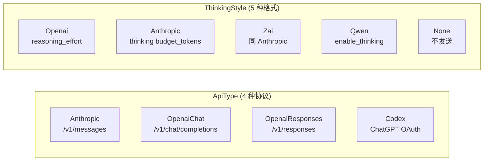

**`ProviderConfig`** — 单个 Provider 的完整配置：

| 字段 | 类型 | 说明 |
|------|------|------|
| `id` | UUID | 唯一标识 |
| `name` | String | 用户自定义显示名 |
| `api_type` | ApiType | 协议类型 |
| `base_url` | String | API 端点 |
| `api_key` | String | 认证凭据（Codex 为空） |
| `models` | Vec\<ModelConfig\> | 可用模型列表 |
| `enabled` | bool | 启用/禁用 |
| `thinking_style` | ThinkingStyle | 推理参数格式 |
| `currency` | Option\<Currency\> | 模型单价币种（`USD`/`CNY`），缺省 = USD。单价照厂商价目页**原文录入**，成本入账在 `dashboard::cost::resolve_cost` 单点按 `CNY_PER_USD` 换算成 USD——模板、GUI、导入导出均原样透传不换算。内置模板中 qwen / volcengine / tencent 标 CNY |

**`ModelConfig`** — 单个模型的配置：

| 字段 | 类型 | 说明 |
|------|------|------|
| `id` | String | 模型标识（如 `claude-sonnet-4-6`） |
| `input_types` | Vec\<String\> | `["text", "image", "video"]` |
| `context_window` | u32 | 上下文窗口（tokens） |
| `max_tokens` | u32 | 最大输出 tokens |
| `reasoning` | bool | 是否支持推理 |
| `thinking_style` | Option\<ThinkingStyle\> | 模型级 think 模式覆盖；`None` = 继承 Provider |
| `cost_input` / `cost_output` | Option\<f64\> | 百万 token 定价，币种由 Provider 级 `currency` 声明。`None` = 未标价（厂商单价未知，成本回退内置估算表），`Some(0.0)` = 明确不按 token 计费（本地模型、包月端点，如实记 $0）——两者语义不同，勿混写 |

**实际生效顺序**

1. `reasoning == false` → 强制 `ThinkingStyle::None`
2. 模型级 `thinking_style`
3. Provider 级 `thinking_style`

因此“模型支持推理”与“当前是否真正发送 thinking 参数”是两个层次：前者由 `reasoning` 声明能力，后者由上述三段式解析决定。

**`AppConfig`** — 全局配置根，持久化到 `~/.hope-agent/config.json`：
- `providers`: 已注册的 Provider 列表
- `active_model`: 当前选中的模型 `{providerId, modelId}`
- `fallback_models`: 降级模型链
- 子配置：`compact`、`notification`、`mediaGen`、`canvas`、`webSearch` 等

### 1.2 前端模板

**`src/components/settings/provider-setup/templates/`**

50 个内置 Provider 模板，392 个预设模型（实测 international 91 + china 61 + infrastructure 230 + local 10 = 392；按 `grep -c '^\s*id:' src/components/settings/provider-setup/templates/{international,china,infrastructure,local}.ts` 复核），分为四个模板文件：

- `international.ts` — 国际 Provider（8 个）
- `china.ts` — 国内 Provider（11 个）
- `infrastructure.ts` — 基础设施/聚合 Provider（26 个）
- `local.ts` — 本地/自托管 Provider（5 个）

#### 国际 Provider（`international.ts`）

| Provider | Key | API 类型 | baseUrl | 模型数 | 代表模型 |
|----------|-----|---------|---------|:------:|---------|
| **Anthropic** | `anthropic` | anthropic · think:anthropic | `https://api.anthropic.com` | 8 | Claude Fable 5, Claude Mythos 5, Claude Sonnet 5 …等 8 个 |
| **Anthropic (Vertex AI)** | `anthropic-vertex` | anthropic · think:anthropic | `https://us-east5-aiplatform.googleapis.com` | 7 | Claude Fable 5, Claude Mythos 5, Claude Sonnet 5 …等 7 个 |
| **OpenAI** | `openai` | openai-responses | `https://api.openai.com` | 20 | GPT-5.6, GPT-5.6 Sol, GPT-5.6 Terra …等 20 个 |
| **OpenAI (Chat)** | `openai-chat` | openai-chat | `https://api.openai.com` | 20 | GPT-5.6, GPT-5.6 Sol, GPT-5.6 Terra …等 20 个 |
| **DeepSeek** | `deepseek` | openai-chat | `https://api.deepseek.com` | 4 | DeepSeek V4 Flash, DeepSeek V4 Pro, DeepSeek Chat …等 4 个 |
| **Google Gemini** | `google-gemini` | openai-chat | `https://generativelanguage.googleapis.com/v1beta/openai` | 7 | Gemini 3.5 Flash, Gemini 3.1 Pro Preview, Gemini 3.1 Flash Lite …等 7 个 |
| **xAI** | `xai` | openai-chat | `https://api.x.ai/v1` | 16 | Grok 4.5, Grok 4.3, Grok 4.20 Beta Latest (Reasoning) …等 16 个 |
| **Mistral** | `mistral` | openai-chat | `https://api.mistral.ai/v1` | 9 | Mistral Medium 3.5, Mistral Large, Mistral Medium 3.1 …等 9 个 |

#### 国内 Provider（`china.ts`）

| Provider | Key | API 类型 | baseUrl | 模型数 | 代表模型 |
|----------|-----|---------|---------|:------:|---------|
| **Moonshot AI (Kimi)** | `moonshot` | openai-chat | `https://api.moonshot.ai/v1` | 7 | Kimi K3, Kimi K2.7 Code, Kimi K2.6 …等 7 个 |
| **通义千问 (Qwen)** | `qwen` | openai-chat · think:qwen | `https://dashscope.aliyuncs.com/compatible-mode` | 4 | Qwen Max, Qwen Plus, Qwen Turbo …等 4 个 |
| **火山引擎 (豆包)** | `volcengine` | openai-chat | `https://ark.cn-beijing.volces.com/api/v3` | 5 | Doubao Seed Code, Doubao Seed 1.8, Kimi K2.5 …等 5 个 |
| **智谱 AI (Z.AI)** | `zhipu` | openai-chat · think:zai | `https://open.bigmodel.cn/api/paas/v4` | 14 | GLM-5.2, GLM-5.1, GLM-5 …等 14 个 |
| **MiniMax** | `minimax` | anthropic · think:anthropic | `https://api.minimax.io/anthropic` | 5 | MiniMax M3, MiniMax M2.7, MiniMax M2.7 Highspeed …等 5 个 |
| **Kimi Coding** | `kimi-coding` | anthropic · think:anthropic | `https://api.kimi.com/coding/` | 5 | Kimi Code, Kimi K3, Kimi K3 (1M) …等 5 个 |
| **小米 MiMo** | `xiaomi` | openai-chat | `https://api.xiaomimimo.com/v1` | 3 | Xiaomi MiMo V2 Pro, Xiaomi MiMo V2 Omni, Xiaomi MiMo V2 Flash |
| **百度千帆** | `qianfan` | openai-chat | `https://qianfan.baidubce.com/v2` | 2 | DeepSeek V3.2, ERNIE 5.0 Thinking |
| **ModelStudio (DashScope)** | `modelstudio` | openai-chat · think:qwen | `https://coding-intl.dashscope.aliyuncs.com/v1` | 11 | Qwen 3.7 Plus, Qwen 3.6 Plus, Qwen 3.5 Plus …等 11 个 |
| **腾讯混元 (TokenHub)** | `tencent` | openai-chat | `https://tokenhub.tencentmaas.com/v1` | 2 | Hy3 (TokenHub), Hy3 Preview |
| **阶跃星辰 (StepFun)** | `stepfun` | openai-chat | `https://api.stepfun.com/v1` | 3 | Step 3.7 Flash, Step 3.5 Flash, Step 3.5 Flash 2603 |

#### 基础设施/聚合 Provider（`infrastructure.ts`）

| Provider | Key | API 类型 | baseUrl | 模型数 | 代表模型 |
|----------|-----|---------|---------|:------:|---------|
| **OpenRouter** | `openrouter` | openai-chat | `https://openrouter.ai/api/v1` | 14 | OpenRouter Auto, Claude Opus 4.8, Claude Sonnet 4.6 …等 14 个 |
| **Groq** | `groq` | openai-chat | `https://api.groq.com/openai` | 10 | Compound, Compound Mini, Llama 4 Scout 17B …等 10 个 |
| **NVIDIA** | `nvidia` | openai-chat | `https://integrate.api.nvidia.com/v1` | 12 | NVIDIA Nemotron 3 Ultra 550B, NVIDIA Nemotron 3 Super 120B, GLM 5.2 …等 12 个 |
| **Together AI** | `together` | openai-chat | `https://api.together.xyz/v1` | 11 | Kimi K2.6 FP4, DeepSeek V4 Pro, GLM 5.1 FP4 …等 11 个 |
| **Hugging Face** | `huggingface` | openai-chat | `https://router.huggingface.co/v1` | 4 | DeepSeek V3.1, DeepSeek R1, Llama 3.3 70B Turbo …等 4 个 |
| **BytePlus (海外火山)** | `byteplus` | openai-chat | `https://ark.ap-southeast.bytepluses.com/api/v3` | 3 | Seed 1.8, Kimi K2.5, GLM 4.7 |
| **Chutes (TEE)** | `chutes` | openai-chat | `https://llm.chutes.ai/v1` | 47 | GLM-5 TEE, GLM-4.7 TEE, GLM-4.7 FP8 …等 47 个 |
| **Fireworks AI** | `fireworks` | openai-chat | `https://api.fireworks.ai/inference/v1` | 2 | Kimi K2.6, Kimi K2.5 Turbo (Fire Pass) |
| **Arcee** | `arcee` | openai-chat | `https://api.arcee.ai/api/v1` | 3 | Trinity Large Thinking, Trinity Large Preview, Trinity Mini 26B |
| **Venice** | `venice` | openai-chat | `https://api.venice.ai/api/v1` | 38 | Claude Opus 4.6 (via Venice), Claude Sonnet 4.6 (via Venice), GPT-5.4 (via Venice) …等 38 个 |
| **Synthetic** | `synthetic` | anthropic · think:anthropic | `https://api.synthetic.new/anthropic` | 11 | MiniMax M2.5, Kimi K2.5, Kimi K2 Thinking …等 11 个 |
| **Vercel AI Gateway** | `vercel-ai-gateway` | openai-chat | `https://ai-gateway.vercel.sh` | 7 | Claude Opus 4.8, Claude Opus 4.6, Claude Sonnet 4.6 …等 7 个 |
| **Cloudflare AI Gateway** | `cloudflare-ai` | openai-chat | `https://gateway.ai.cloudflare.com/v1/{accountId}/{gatewayId}` | 3 | Claude Opus 4.8, Claude Opus 4.7, Claude Sonnet 4.6 |
| **Cerebras** | `cerebras` | openai-chat | `https://api.cerebras.ai/v1` | 4 | Z.ai GLM 4.7, GPT OSS 120B, Qwen 3 235B Instruct …等 4 个 |
| **DeepInfra** | `deepinfra` | openai-chat | `https://api.deepinfra.com/v1/openai` | 8 | DeepSeek V4 Flash, DeepSeek V3.2, GLM-5.1 …等 8 个 |
| **GitHub Copilot** | `github-copilot` | openai-responses | `https://api.individual.githubcopilot.com` | 14 | Claude Opus 4.8, Claude Opus 4.7, Claude Opus 4.6 …等 14 个 |
| **GMI Cloud** | `gmi` | openai-chat | `https://api.gmi-serving.com/v1` | 6 | GPT-5.4, Claude Sonnet 4.6, Gemini 3.1 Flash Lite …等 6 个 |
| **Novita AI** | `novita` | openai-chat | `https://api.novita.ai/openai/v1` | 6 | Kimi K2.5, MiniMax M2.7, GLM-5 …等 6 个 |
| **OpenCode Zen** | `opencode` | openai-chat | `https://opencode.ai/zen/v1` | 4 | Claude Opus 4.8, GPT-5.5, Gemini 3.1 Pro …等 4 个 |
| **OpenCode Zen Go** | `opencode-go` | openai-chat | `https://opencode.ai/zen/go/v1` | 2 | DeepSeek V4 Pro, DeepSeek V4 Flash |
| **KiloCode** | `kilocode` | openai-chat | `https://api.kilo.ai/api/gateway/` | 1 | Kilo Auto |
| **Cohere** | `cohere` | openai-chat | `https://api.cohere.ai/compatibility/v1` | 5 | Command A+, North Mini Code 1.0, Command A Reasoning …等 5 个 |
| **Baseten** | `baseten` | openai-chat | `https://inference.baseten.co/v1` | 12 | DeepSeek V4 Pro, Kimi K2.7 Code, Kimi K2.6 …等 12 个 |
| **LongCat** | `longcat` | openai-chat | `https://api.longcat.chat/openai` | 1 | LongCat 2.0 |
| **Meta** | `meta` | openai-chat | `https://api.meta.ai/v1` | 1 | Muse Spark 1.1 |
| **Featherless** | `featherless` | openai-chat | `https://api.featherless.ai/v1` | 1 | Qwen3 32B |

#### 本地/自托管 Provider（`local.ts`）

| Provider | Key | API 类型 | baseUrl | 模型数 | 代表模型 |
|----------|-----|---------|---------|:------:|---------|
| **LiteLLM** | `litellm` | openai-chat | `http://127.0.0.1:4000` | 1 | Your Model |
| **Ollama** | `ollama` | openai-chat | `http://127.0.0.1:11434` | 6 | GLM 5.2 (云端), Kimi K2.5 (云端), MiniMax M2.7 (云端) …等 6 个 |
| **vLLM** | `vllm` | openai-chat | `http://127.0.0.1:8000` | 1 | Your Model |
| **LM Studio** | `lm-studio` | openai-chat | `http://127.0.0.1:1234` | 1 | Your Model |
| **SGLang** | `sglang` | openai-chat | `http://127.0.0.1:30000` | 1 | Your Model |

### 1.3 Provider Write Contract（强制）

所有 Provider 列表与 `active_model` 写入必须走 `crates/ha-core/src/provider/crud.rs` 提供的 helper，禁止在 Tauri / HTTP / onboarding / importer / local_llm 等任何路径里直接 `providers.push` / `retain` / 手写 `active_model`：

| Helper | 语义 |
|---|---|
| `add_provider(cfg)` | 生成新 id 并 append 到列表尾部（前端「新增后取最后一项」依赖此语义，不要破坏） |
| `update_provider(id, mutator)` | 按 id 找到现有 Provider 并修改字段 |
| `delete_provider(id)` | 删除 Provider，并清理可能挂在其上的 `active_model` |
| `reorder_providers(order)` | 按给定 id 序列重排 |
| `set_active_model(provider_id, model_id)` | 唯一允许修改 `active_model` 的入口 |
| `add_and_activate_provider(cfg)` | 添加并把 active model 切到首个模型（onboarding 用） |
| `add_many_providers(cfgs)` | 批量导入（importer 用） |
| `ensure_codex_provider_persisted()` | Codex Provider 构造期失败保活（commit `99bc84a7`，配合 OAuth 重新登录） |
| `upsert_known_local_provider_model(kind, ...)` | 本地 LLM 安装路径专用：按 [Local Backend Catalog](#14-local-backend-catalog) 的 host/port 去重，补模型、启用 Provider、设置 `allow_private_network`、切 active model |

Tauri / HTTP 命令一律只做薄壳，业务路径必须走以上 helper。CR / review 阶段一旦看到直接操作 `cfg.providers` 数组或 `active_model` 字段，必须打回。

### 1.4 Local Backend Catalog

本地后端目录硬编码在 `crates/ha-core/src/provider/local.rs`，当前条目：

| Kind | Host / Port | 备注 |
|---|---|---|
| `ollama` | `localhost:11434`（额外接受 `ollama.local`） | 本地大模型默认入口 |
| `litellm` | `localhost:4000` | 统一 LLM 代理网关 |
| `vllm` | `localhost:8000` | 高性能推理 |
| `lm-studio` | `localhost:1234` | 桌面端本地推理 |
| `sglang` | `localhost:30000` | 高性能推理 |

匹配规则固定为「`apiType` 一致 + host/port 命中」，URL path 一律忽略——所以 `http://localhost:11434/v1` 也算 Ollama。Tauri 命令 `local_llm_known_backends` 与 HTTP `GET /api/local-llm/known-backends` 同步暴露此 catalog；前端判断"是否已配置本地后端"必须消费这个目录，禁止再写硬编码 regex。

本地 LLM 一键安装、模型拉取、Embedding 拉取等流程详见 [local-model-loading.md](./local-model-loading.md)。

---

## 2. Agent 核心

### 2.1 LlmProvider 枚举

**`crates/ha-core/src/agent/types.rs`**

```rust
enum LlmProvider {
    Anthropic { api_key, base_url, model },
    OpenAIChat { api_key, base_url, model },
    OpenAIResponses { api_key, base_url, model },
    Codex { access_token, account_id, model },
}
```

### 2.2 AssistantAgent 结构体

**`crates/ha-core/src/agent/types.rs`**

| 字段 | 说明 |
|------|------|
| `provider` | LlmProvider 枚举，决定走哪个 API |
| `thinking_style` | ThinkingStyle，控制推理参数格式 |
| `conversation_history` | `Mutex<Vec<JSON>>`，完整对话状态 |
| `context_window` | 模型上下文窗口大小 |
| `compact_config` | 上下文压缩配置 |
| `denied_tools` | 深度分层工具策略 |
| `plan_agent_mode` | Plan/Executing Agent 模式切换 |

### 2.3 Chat 分发器

**`crates/ha-core/src/agent/mod.rs`**

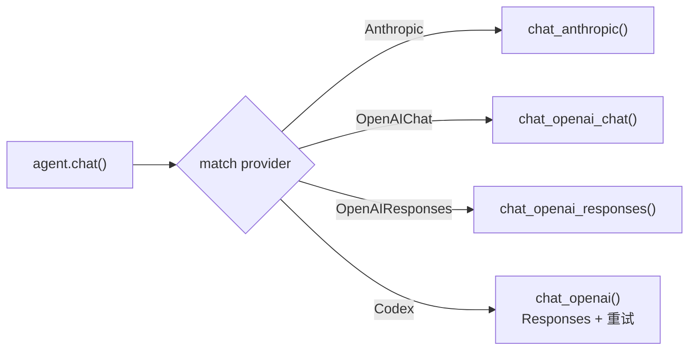

---

## 3. 对话流程

### 3.1 主流程

**入口**：`src-tauri/src/commands/chat.rs`（桌面）/ `crates/ha-server/src/routes/chat.rs`（HTTP）→ 调用 `crates/ha-core/src/chat_engine/`

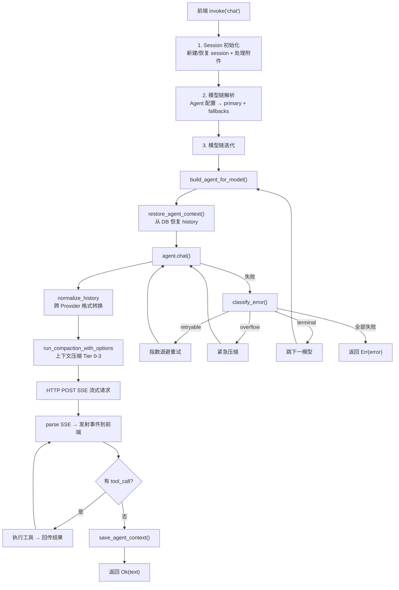

### 3.2 事件流 (Channel\<String\>)

Provider 通过 `on_delta` 回调实时推送 JSON 事件：

| 事件类型 | 字段 | 说明 |
|---------|------|------|
| `text_delta` | `content` | 增量文本 |
| `thinking_delta` | `content` | 增量推理内容 |
| `tool_call` | `call_id`, `name`, `arguments` | 工具调用开始 |
| `tool_result` | `call_id`, `result`, `duration_ms`, `is_error` | 工具执行结果 |
| `usage` | `input_tokens`, `output_tokens`, `model`, `ttft_ms` | Token 用量 |
| `context_compaction_progress` | `phase`, `kind` | live-only 压缩进度通知（GUI banner） |
| `context_compacted` | `tier_applied`, `tokens_before`, `tokens_after`, `manifest` | 上下文压缩完成通知 |
| `model_fallback` | `model`, `from_model`, `reason` | 模型降级通知 |

### 3.3 前端事件处理

**`src/components/chat/useChatStream.ts`**

- `text_delta` + `thinking_delta`：缓冲 + `requestAnimationFrame` 批量刷新（60fps）
- `tool_call` → 先同步 flush 缓冲区 → 创建 ToolCallBlock 组件（pending 状态）
- `tool_result` → 更新 ToolCallBlock（完成/错误状态）
- `thinking_delta` → ThinkingBlock 组件（可折叠，自动展开配置）

---

## 4. Provider 实现详解

### 4.1 Anthropic Messages API

**`crates/ha-core/src/agent/providers/anthropic.rs`**（`chat_anthropic` 公开入口薄壳）+ **`anthropic_adapter.rs`**（请求体构建 / SSE 解析 / history 持久化实现）

**请求格式：**
```json
{
  "model": "claude-sonnet-4-6",
  "max_tokens": 16384,
  "system": [{ "type": "text", "text": "...", "cache_control": { "type": "ephemeral" } }],
  "messages": [...],
  "tools": [...],
  "stream": true,
  "thinking": { "type": "enabled", "budget_tokens": 4096 }
}
```

> `cache_control` 用于 Prompt Cache 复用，详见 [Side Query 缓存架构](side-query.md)。

**History 格式（assistant 消息）：**
```json
{
  "role": "assistant",
  "content": [
    { "type": "thinking", "thinking": "推理过程..." },
    { "type": "text", "text": "回复内容" },
    { "type": "tool_use", "id": "call_123", "name": "read", "input": {...} }
  ]
}
```

**Thinking 回传**：thinking 块写入 content 数组，下一轮原样回传给 API，保证多轮推理连贯。

### 4.2 OpenAI Chat Completions API

**`crates/ha-core/src/agent/providers/openai_chat.rs`**（`chat_openai_chat` 公开入口薄壳）+ **`openai_chat_adapter.rs`**（请求体构建 / SSE 解析 / history 持久化实现）

**ThinkingStyle 分发（`apply_thinking_to_chat_body`，定义在 `crates/ha-core/src/agent/config.rs`）：**

| ThinkingStyle | 参数格式 | 适用 Provider |
|---------------|---------|-------------|
| Openai | `reasoning_effort: "high"` | OpenAI、DeepSeek、Mistral、xAI 等 |
| Anthropic | `thinking: { type: "enabled", budget_tokens: N }` | MiniMax、Kimi Coding |
| Zai | 同 Anthropic | 智谱 Z.AI |
| Qwen | `enable_thinking: true` | 通义千问、阿里云百炼 |
| None | 不发送 | 自定义 Provider |

**Thinking 来源（两种）：**
1. **`reasoning_content` 字段**（o3/o4-mini 等原生推理模型）→ 直接从 SSE delta 提取
2. **`<think>` 标签**（Qwen/DeepSeek 等）→ `ThinkTagFilter` 状态机实时解析，分离 thinking 和 text

**History 格式（assistant 消息）：**
```json
{
  "role": "assistant",
  "content": "回复内容",
  "reasoning_content": "推理过程...",
  "tool_calls": [{ "id": "call_123", "type": "function", "function": { "name": "read", "arguments": "{...}" } }]
}
```

### 4.3 OpenAI Responses API

**`crates/ha-core/src/agent/providers/openai_responses.rs`**（`chat_openai_responses` 公开入口薄壳）+ **`openai_responses_adapter.rs`**（请求体构建 / `parse_openai_sse` 解析 / history 持久化实现）

**请求格式：**
```json
{
  "model": "o3",
  "store": false,
  "stream": true,
  "instructions": "系统提示词",
  "input": [...],
  "reasoning": { "effort": "high", "summary": "auto" },
  "include": ["reasoning.encrypted_content"],
  "tools": [...]
}
```

**Reasoning item 不回传（`store: false` 红线）**

Hope Agent 始终用 `store: false` 调 Responses API。在这一模式下，服务端**不持久化** reasoning item，`rs_*` id 是一次性引用——下一轮请求只要带上历史 reasoning item，无论是否携带 `encrypted_content`，服务端都会按 id 查持久化记录并 404（`Item with id 'rs_xxx' not found. Items are not persisted when store is set to false.`）。

因此契约是：**reasoning item 从不进入 `conversation_history`，从不参与下一轮 replay**。

1. 请求中**不再加** `include: ["reasoning.encrypted_content"]`（即便加了也不写回 history）
2. SSE 中收到 reasoning 事件时，`response.reasoning_summary_text.delta` 流给前端做"思考可视化"，但其结构化的 reasoning item（id + encrypted_content）**就地丢弃**
3. `parse_openai_sse` 返回签名不含 `reasoning_items`；`RoundOutcome` 也不再有该字段
4. `normalize_history_for_responses` 把任何残留的 `type: reasoning` item 一并 `continue`（兜底，防御旧版本写下的 context_json）
5. 每轮独立 reasoning 与 `store=false` 的 stateless 语义完全对齐——少几秒 reasoning 时间换稳定性

**SSE 事件处理：**

| 事件 | 处理 |
|------|------|
| `response.reasoning_summary_text.delta` | → `emit_thinking_delta` + 累积（仅 UI 可视化） |
| `response.reasoning_summary_part.done` | → 追加 `\n\n` 段落分隔 |
| `response.output_text.delta` | → `emit_text_delta` + 累积 |
| `response.output_item.added` (function_call) | → 创建 pending tool call |
| `response.output_item.done` (reasoning) | → 丢弃结构化 item（thinking 已通过 delta 路径累积） |
| `response.output_item.done` (function_call) | → 完成 tool call |
| `response.completed` | → 提取 usage + fallback 文本提取 |

**History 格式：**
```json
[
  { "role": "user", "content": "问题" },
  { "type": "message", "role": "assistant", "content": [{ "type": "output_text", "text": "回复" }], "status": "completed" },
  { "type": "function_call", "id": "fc_xxx", "call_id": "fc_xxx", "name": "read", "arguments": "{...}" },
  { "type": "function_call_output", "call_id": "fc_xxx", "output": "文件内容" }
]
```

### 4.4 Codex OAuth API

**`crates/ha-core/src/agent/providers/codex.rs`**（`chat_openai`/Codex 公开入口薄壳）+ **`codex_adapter.rs`**（请求体构建 / 历史持久化实现，SSE 解析复用 Responses 的 `parse_openai_sse`）

与 OpenAI Responses API 相同的请求/响应格式，额外特性：
- **OAuth 认证**：`Authorization: Bearer {access_token}` + `chatgpt-account-id` header
- **终端登录入口**：`hope-agent auth codex login` 复用同一 PKCE loopback 流程，登录成功后写 `~/.hope-agent/credentials/auth.json` 并调用 `ensure_codex_provider_persisted(Always(DEFAULT_CODEX_MODEL_ID))`；`--no-open` 只打印 URL，适合 SSH/headless 配合 `ssh -L 1455:127.0.0.1:1455 <host>` 使用
- **内置模型目录**：`agent::config::get_codex_models()` / `provider::helpers::default_codex_models()` / `provider::crud::default_codex_model_ids()` 三份列表必须同步（id 集合 + 顺序一致，后两者靠 `codex_noop_detects_existing_provider_and_active_model` 单测锁长度）；`DEFAULT_CODEX_MODEL_ID` 当前是 `gpt-5.6-terra`——不是列表里的旗舰 `gpt-5.6-sol`，因为 GPT-5.6 按 ChatGPT 套餐分级（Free/Go 只有 Terra，Sol 需付费套餐/workspace），而这个常量会通过 `ActiveModelUpdate::Always` 套到每个新登录账号，必须选所有 Codex 账号都有的那一档
- **重试 / 降级**：Codex 调用同样走 `failover::executor::execute_with_failover` + `chat_engine_default` policy（max_retries=2，退避基数与上限统一），不再有 Codex 自管的「3 次 1s/2s/4s」逻辑
- **不参与 auth profile 轮换**：executor 内部硬编码 Codex Provider 跳过 profile 选择/轮换；Codex 凭据失败直接经标准失败路径走下一模型
- **构造期失败保活**：Codex Provider 在 `crates/ha-core/src/provider/crud.rs::ensure_codex_provider_persisted`（commit `99bc84a7`）保证 token 缺失或构造异常时配置仍持久化，下次手动登录补回即可，不会被静默移除
- **共享 SSE 解析**：调用 `parse_openai_sse()`（与 Responses API 共享）

---

## 5. Thinking/Reasoning 系统

### 5.1 推理参数映射

**`crates/ha-core/src/agent/config.rs`**

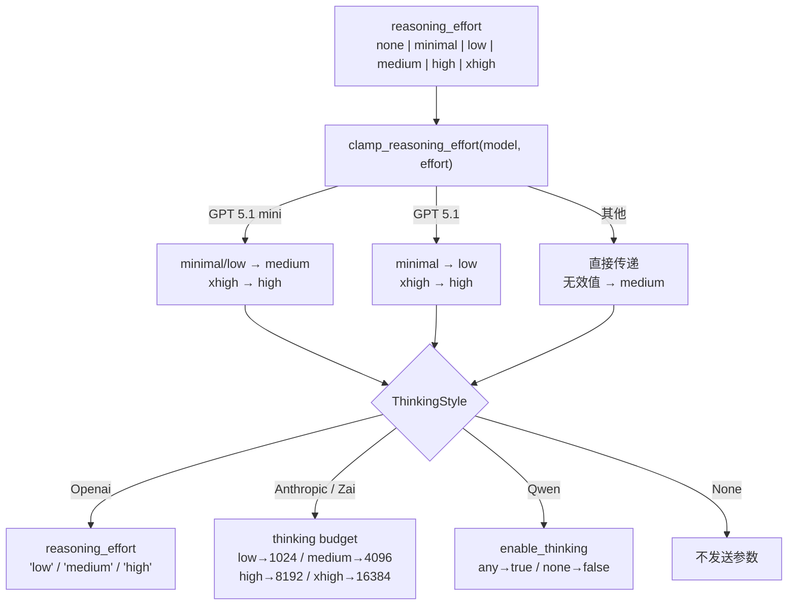

### 5.2 ThinkTagFilter

**`crates/ha-core/src/agent/types.rs`**

有状态的流式解析器，用于从 Chat Completions 响应中提取 `<think>` 标签内的内容：

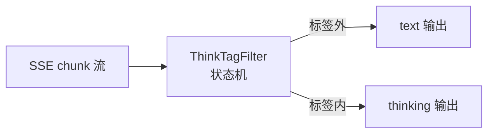

- 支持 `<think>`、`<thinking>`、`<thought>` 标签（大小写不敏感）
- 处理跨 chunk 边界的部分标签
- 当 `reasoning_effort == "none"` 时丢弃 thinking 内容

### 5.3 多轮 Thinking 回传

每个 Provider 在 conversation_history 中保存 thinking 内容，确保下一轮对话时模型能看到之前的推理：

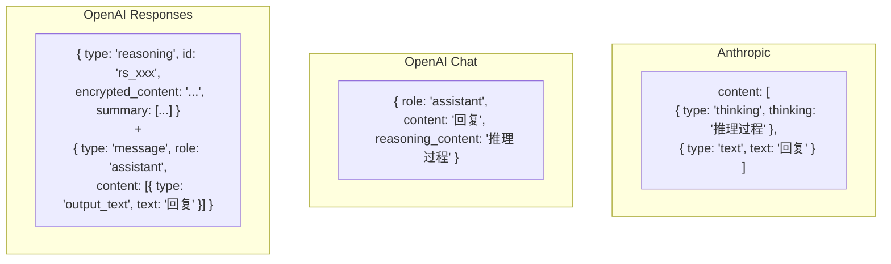

---

## 6. History 格式标准化

### 6.1 问题

当 failover 降级或用户手动切换模型时，`conversation_history` 中可能包含**另一个 Provider 格式**的消息。例如 Responses API 的 `{ type: "reasoning" }` 项被发送给 Anthropic API 会导致错误。

### 6.2 解决方案

**`crates/ha-core/src/agent/context.rs`** 中三个标准化函数，每个 Provider 在读取 history 时调用：

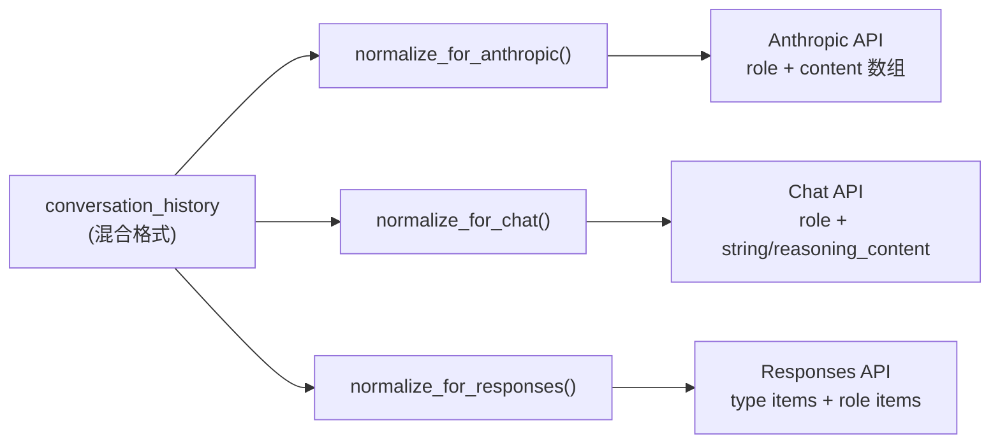

**`normalize_history_for_anthropic()`**

| 输入格式 | 转换 |
|---------|------|
| `type: "reasoning"` (加密) | 跳过 |
| `type: "function_call"` | 跳过（Anthropic 用 tool_use） |
| `type: "function_call_output"` | 跳过 |
| `type: "message"` (Responses) | 提取 output_text → `{ role, content: text }` |
| `reasoning_content` 字段 (Chat) | 转为 `[{ type: "thinking" }, { type: "text" }]` 数组 |
| 标准 role 消息 | 直通 |

**`normalize_history_for_chat()`**

| 输入格式 | 转换 |
|---------|------|
| `type: "reasoning"` | 跳过 |
| `type: "function_call"` / `function_call_output` | 跳过 |
| `type: "message"` (Responses) | 提取 text → `{ role, content: text }` |
| Anthropic content 数组 (thinking+text) | text → `content`，thinking → `reasoning_content` |
| 标准 role 消息 | 直通 |

**`normalize_history_for_responses()`**

| 输入格式 | 转换 |
|---------|------|
| 原生 Responses 项 | 直通 |
| Anthropic tool_use/tool_result 数组 | 跳过（Responses 用 function_call） |
| Anthropic content 数组 | 提取 text → `{ role, content: text }` |
| `reasoning_content` 字段 | 移除 |
| 标准 role 消息 | 直通 |

### 6.3 调用时机

```rust
// 每个 Provider 的 chat_* 方法开头：
let mut messages = Self::normalize_history_for_anthropic(&self.conversation_history.lock().unwrap());
let mut messages = Self::normalize_history_for_chat(&self.conversation_history.lock().unwrap());
let mut input = Self::normalize_history_for_responses(&self.conversation_history.lock().unwrap());
```

---

## 7. Failover 降级系统

### 7.1 错误分类

**`crates/ha-core/src/failover/{mod,executor}.rs`**

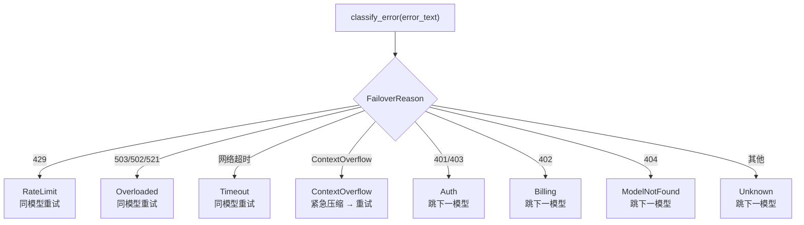

### 7.2 模型链解析

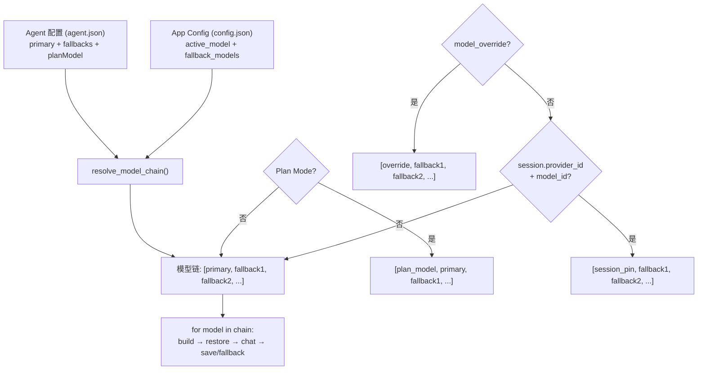

**chat 入口决策优先级（高到低）**（[`src-tauri/src/commands/chat.rs`](../../src-tauri/src/commands/chat.rs) / [`crates/ha-server/src/routes/chat.rs`](../../crates/ha-server/src/routes/chat.rs) 完全对称）：

1. **Plan Mode `plan_model`**（仅 Planning 阶段，临时降级到便宜模型）
2. **本轮显式 `model_override`**（仅 API 单轮覆盖；GUI 对已有会话不持续发送）
3. **`sessions.provider_id` + `sessions.model_id`**（Session 创建时固定或由 `set_session_model` / HTTP PATCH / IM `/model` 更新的首选模型）
4. **`agent.model.primary`**（Agent 配置的首选）
5. **`AppConfig.active_model`**（应用全局默认，由「设置 → 模型」面板修改）

Session 创建时同时固定有效模型、温度与 Think；Agent/全局默认后续变化不反向影响已有 Session。fallback 只记录本轮实际模型与用量，**不得回写 Session 首选模型**，所以下一轮仍从原主模型开始。Provider 禁用时保留首选引用并临时跳过，重新启用即恢复；永久删除才清理全局、Agent 与 Session 的硬失效引用。

尚未物化的 GUI 草稿通过 `sessionDefaults` 携带模型、温度与 Think，仅在首次创建 Session 时消费；兼容字段 `modelOverride` / `temperatureOverride` / `reasoningEffort` 保留为单轮 API 覆盖，不作为 GUI 的会话持久化通道。

Agent 的字段独立继承：`primary=None` 跟随全局主模型，`fallbacks=[]` 跟随全局 fallback 链，`temperature=None` 与 `reasoning_effort=None` 分别跟随全局值。配置了 Agent fallbacks 后完全替代全局 fallbacks。

### 7.3 重试策略

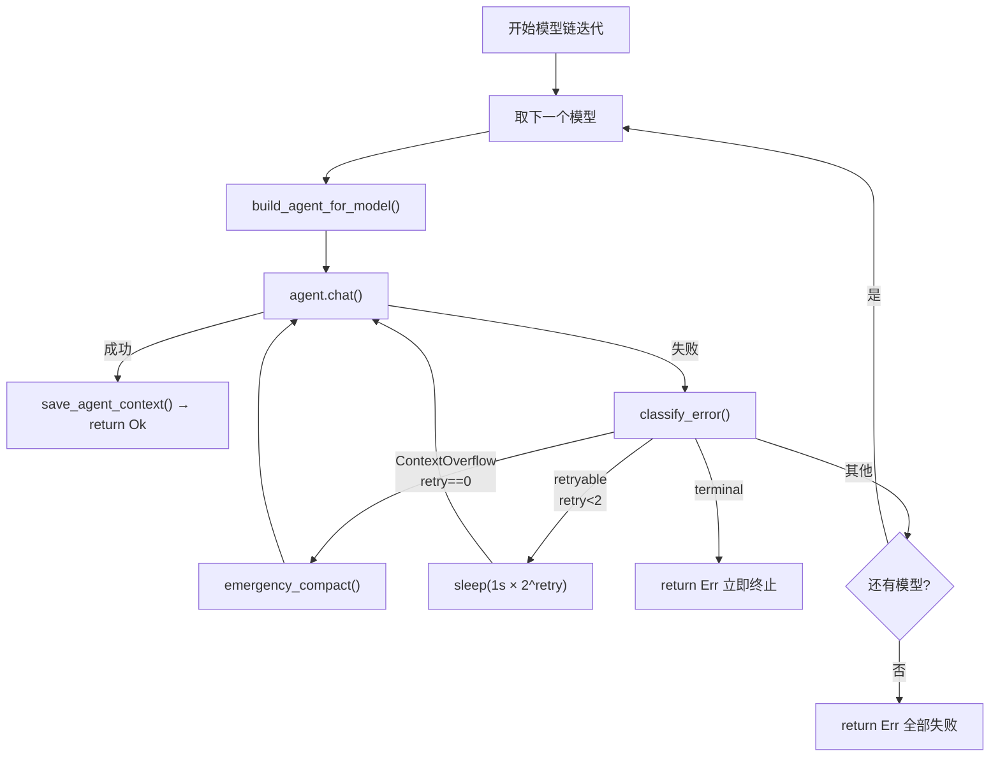

---

## 8. 数据落盘存储与加载

### 8.0 双轨存储架构

对话数据存在**两条并行的持久化通道**，服务于不同目的：

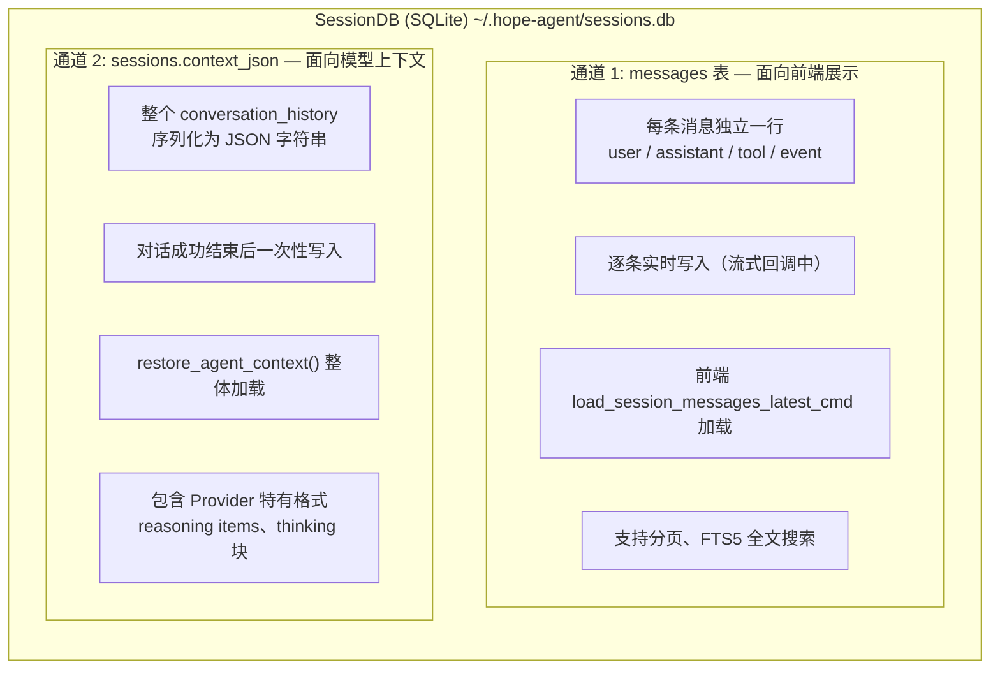

**为什么需要两条通道？**
- `messages` 表：行式结构，方便前端分页展示、搜索、统计 token 用量
- `context_json` 列：保留完整的 Provider API 格式，直接喂给下一轮 API 调用，无需格式转换

### 8.1 通道 1：messages 表 — 逐条实时写入

**Schema（`crates/ha-core/src/session/db.rs`）：**

```sql
CREATE TABLE messages (
  id              INTEGER PRIMARY KEY AUTOINCREMENT,
  session_id      TEXT NOT NULL,
  role            TEXT NOT NULL,      -- user|assistant|tool|text_block|thinking_block|event
  content         TEXT DEFAULT '',     -- 消息文本内容
  timestamp       TEXT NOT NULL,
  attachments_meta TEXT,               -- 附件 JSON 元数据
  model           TEXT,                -- 使用的模型 ID
  tokens_in       INTEGER,             -- 输入 token 数
  tokens_out      INTEGER,             -- 输出 token 数
  reasoning_effort TEXT,               -- 推理强度
  tool_call_id    TEXT,                -- 工具调用 ID
  tool_name       TEXT,                -- 工具名
  tool_arguments  TEXT,                -- 工具参数 JSON
  tool_result     TEXT,                -- 工具结果
  tool_duration_ms INTEGER,            -- 工具执行耗时
  is_error        INTEGER DEFAULT 0,   -- 是否工具错误
  thinking        TEXT,                -- 思维过程（独立列）
  ttft_ms         INTEGER,             -- Time to First Token
  FOREIGN KEY (session_id) REFERENCES sessions(id) ON DELETE CASCADE
);

-- FTS5 全文搜索（仅索引 user/assistant 消息）
CREATE VIRTUAL TABLE messages_fts USING fts5(content, content='messages', content_rowid='id');
CREATE TRIGGER messages_fts_ai AFTER INSERT ON messages
  WHEN new.role IN ('user', 'assistant') AND length(new.content) > 0
  BEGIN INSERT INTO messages_fts(rowid, content) VALUES (new.id, new.content); END;
```

**写入时机（`crates/ha-core/src/chat_engine/context.rs`，由 Tauri 命令层 / HTTP 路由层调用）：**

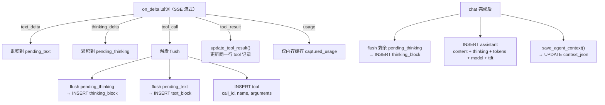

**消息角色（`MessageRole` 枚举）：**

| Role | 说明 | 写入时机 |
|------|------|---------|
| `user` | 用户输入 | chat 命令开始时 |
| `assistant` | AI 最终回复 | chat 完成后 |
| `tool` | 工具调用记录 | tool_call 事件时（result 后续更新） |
| `text_block` | 中间文本片段 | tool_call 前 flush |
| `thinking_block` | 中间思维片段 | tool_call 前 flush |
| `event` | 系统事件（降级通知等） | failover / 错误时 |

**为什么需要 text_block / thinking_block？**

多轮 tool loop 中，消息顺序是：thinking → text → tool_call → tool_result → thinking → text → tool_call → ...

如果只在最后写一条 assistant 消息，中间的 thinking/text 片段与 tool_call 的时序关系会丢失。`text_block` 和 `thinking_block` 保留了多轮执行过程中的完整时序。

### 8.2 通道 2：context_json — 整体序列化

**Schema：**
```sql
-- sessions 表的 context_json 列
ALTER TABLE sessions ADD COLUMN context_json TEXT;
```

**写入（`save_agent_context`）：**
```rust
fn save_agent_context(db: &SessionDB, session_id: &str, agent: &AssistantAgent) {
    let history: Vec<Value> = agent.get_conversation_history();
    let json_str: String = serde_json::to_string(&history);
    db.save_context(session_id, &json_str);
    // → UPDATE sessions SET context_json = ?1 WHERE id = ?2
}
```

**加载（`restore_agent_context`）：**
```rust
fn restore_agent_context(db: &SessionDB, session_id: &str, agent: &AssistantAgent) {
    if let Some(json_str) = db.load_context(session_id) {
        let history: Vec<Value> = serde_json::from_str(&json_str);
        agent.set_conversation_history(history);
    }
    // → SELECT context_json FROM sessions WHERE id = ?1
}
```

**context_json 中的数据格式（取决于最后使用的 Provider）：**

```json
// Anthropic 格式
[
  { "role": "user", "content": "你好" },
  { "role": "assistant", "content": [
    { "type": "thinking", "thinking": "用户在打招呼..." },
    { "type": "text", "text": "你好！" }
  ]},
  { "role": "user", "content": [{ "type": "tool_result", "tool_use_id": "call_1", "content": "..." }] }
]

// OpenAI Responses 格式
[
  { "role": "user", "content": "你好" },
  { "type": "reasoning", "id": "rs_xxx", "encrypted_content": "...", "summary": [...] },
  { "type": "message", "role": "assistant", "content": [{ "type": "output_text", "text": "你好！" }], "status": "completed" },
  { "type": "function_call", "id": "fc_xxx", "call_id": "fc_xxx", "name": "read", "arguments": "{...}" },
  { "type": "function_call_output", "call_id": "fc_xxx", "output": "文件内容" }
]

// OpenAI Chat 格式
[
  { "role": "system", "content": "..." },
  { "role": "user", "content": "你好" },
  { "role": "assistant", "content": "你好！", "reasoning_content": "用户在打招呼..." },
  { "role": "assistant", "content": null, "tool_calls": [{ "id": "call_1", "type": "function", "function": { "name": "read", "arguments": "{...}" } }] },
  { "role": "tool", "tool_call_id": "call_1", "content": "文件内容" }
]
```

### 8.3 写入时序全景

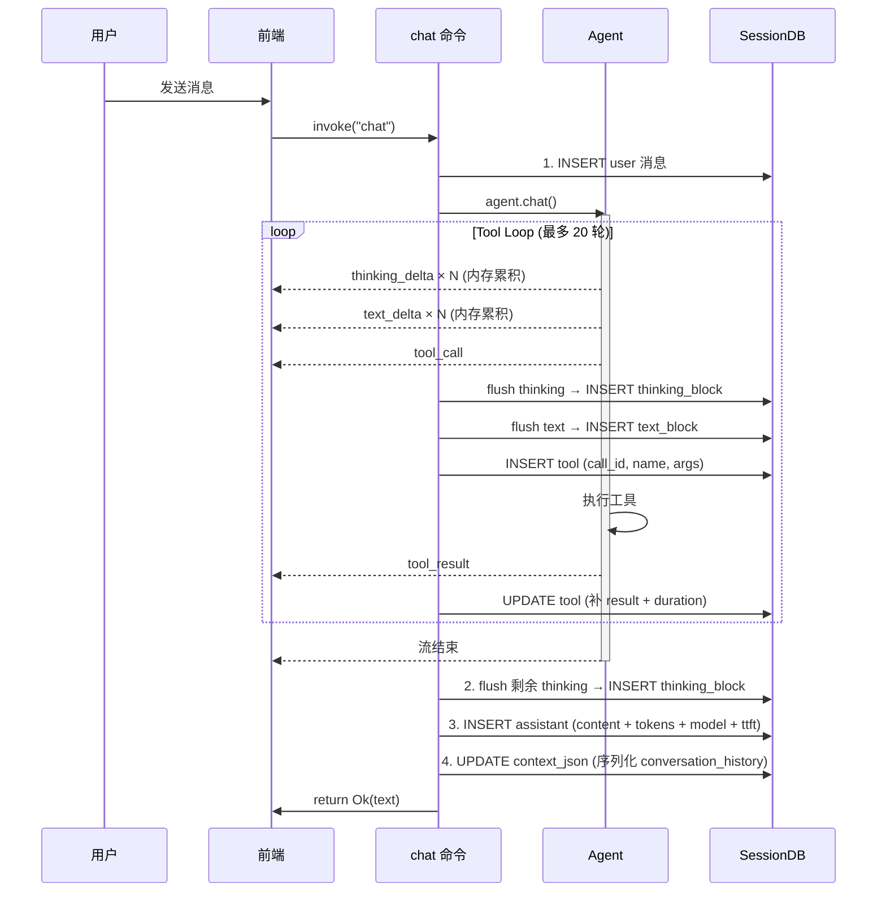

### 8.4 加载时序

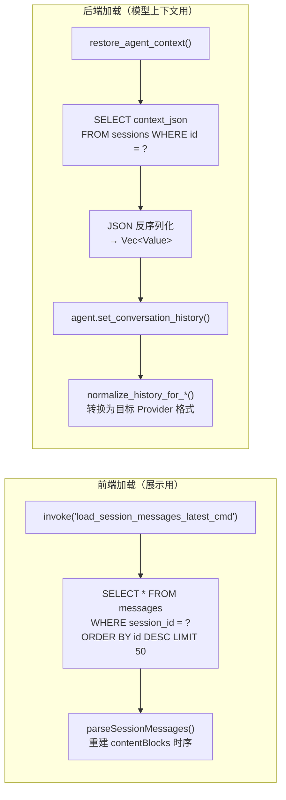

### 8.5 Failover 场景的存储交互

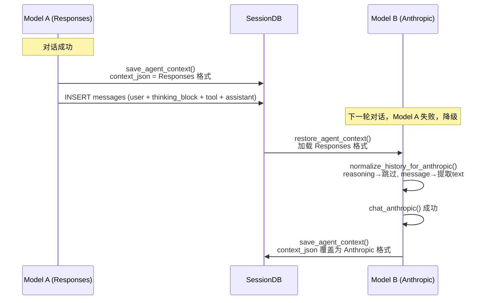

### 8.6 附件存储

```
~/.hope-agent/
  attachments/
    {session_id}/
      {uuid}.png        ← 图片文件
      {uuid}.pdf        ← 文件附件
  generated-images/
    {timestamp}_{uuid}.png  ← AI 生成的图片
```

- 附件在 chat 命令开始时保存到磁盘
- `attachments_meta` JSON 存入 messages 表（名称、MIME、大小、路径）
- Session 删除时级联清理附件目录

---

## 9. 上下文管理

### 9.1 上下文压缩

上下文压缩详见 [context-compact.md](./context-compact.md)。本系统采用 **5 层渐进式**结构：Tier 0 反应式微压缩（turn-start + tool-loop checkpoint 清理 `toolPolicies=eager` 的旧工具结果，cache-safe）+ Tier 1 工具结果截断 + Tier 2 上下文裁剪（软/硬）+ Tier 3 LLM 摘要 + Tier 4 ContextOverflow 应急恢复。Provider 系统作为消费方，只需保证消息格式标准化与 Token 计量准确；触发条件、cache-TTL 节流、mid-loop 频率地板、runtime ledger / recovery 注入和压缩策略全部由 `agent/context.rs` + `context_compact` 模块负责。

### 9.2 Summarization 消息格式处理

**`crates/ha-core/src/context_compact/summarization.rs`**

摘要构建时，需要正确处理所有 Provider 格式的消息：

| 消息格式 | 摘要处理 |
|---------|---------|
| `type: "reasoning"` (加密) | 跳过（不可读） |
| `type: "function_call"` | `[tool_call]: name(args_preview)` |
| `type: "function_call_output"` | `[tool_result]: output_preview` |
| `type: "message"` (Responses) | 提取 output_text → `[assistant]: text` |
| Anthropic `thinking` 块 | `[assistant/thinking]: preview(300chars)` |
| Anthropic `text` 块 | `[assistant]: text` |
| Chat `reasoning_content` | `[assistant/thinking]: preview(300chars)` |
| 简单字符串 content | `[role]: text` |
| `tool_result` (Anthropic) | `[tool_result]: preview(500chars)` |

### 9.3 Session 持久化

**`crates/ha-core/src/session/db.rs`**

```sql
-- 核心表结构
sessions (id, title, agent_id, provider_id, model_id, plan_mode, plan_steps, ...)
messages  (id, session_id, role, content, thinking, model, tokens_in, tokens_out,
           tool_call_id, tool_name, tool_arguments, tool_result, tool_duration_ms, ttft_ms, ...)
messages_fts (FTS5 全文搜索索引，覆盖 user/assistant 消息)
```

**上下文保存/恢复：**
```rust
// 保存：序列化 conversation_history 为 JSON 存入 DB
save_agent_context(db, session_id, agent)
  → agent.get_conversation_history() → JSON string → db.save_context()

// 恢复：从 DB 加载 JSON 反序列化为 Vec<Value>
restore_agent_context(db, session_id, agent)
  → db.load_context() → Vec<Value> → agent.set_conversation_history()
```

---

## 10. 数据流全景图

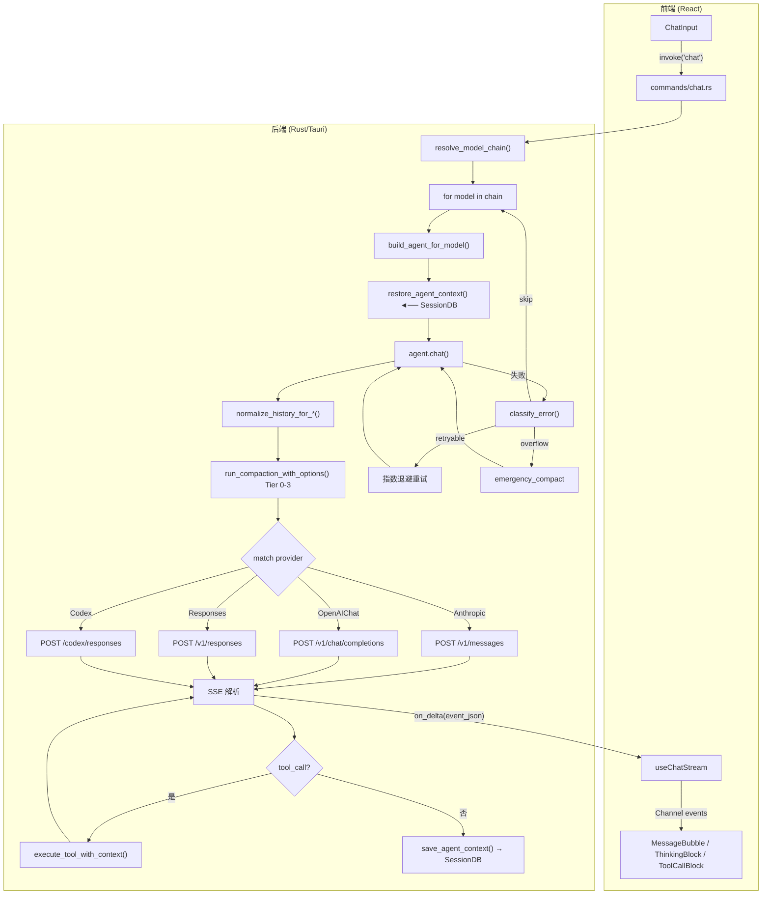

---

## 11. 关键文件索引

| 模块 | 文件 | 职责 |
|------|------|------|
| Provider 配置 | `crates/ha-core/src/provider/` | ApiType、ThinkingStyle、ProviderConfig、模型链解析 |
| Agent 核心 | `crates/ha-core/src/agent/mod.rs` | 构造器、chat 分发、系统提示词组装 |
| Agent 类型 | `crates/ha-core/src/agent/types.rs` | LlmProvider、AssistantAgent、ThinkTagFilter |
| Anthropic | `crates/ha-core/src/agent/providers/anthropic.rs` | Messages API + thinking 块回传 |
| Chat Completions | `crates/ha-core/src/agent/providers/openai_chat.rs` | ThinkingStyle 分发 + reasoning_content 回传 |
| Responses API | `crates/ha-core/src/agent/providers/openai_responses.rs`（薄壳）+ `openai_responses_adapter.rs`（实现） | Responses 请求构建 + `parse_openai_sse` 解析；`store: false` 下 reasoning item 就地丢弃、不请求 encrypted_content、不回传 |
| Codex OAuth | `crates/ha-core/src/agent/providers/codex.rs` | Responses 变体 + 重试逻辑 |
| 推理参数 | `crates/ha-core/src/agent/config.rs` | 5 种 ThinkingStyle 映射、effort 钳制 |
| 内容构建 | `crates/ha-core/src/agent/content.rs` | 各 Provider 的用户消息格式构建 |
| 事件发射 | `crates/ha-core/src/agent/events.rs` | text_delta、thinking_delta、tool_call 等 |
| 上下文管理 | `crates/ha-core/src/agent/context.rs` | history 标准化、push_user_message、run_compaction |
| 上下文压缩 | `crates/ha-core/src/context_compact/` + `crates/ha-core/src/agent/context.rs` | 5 层渐进式压缩 + mid-loop checkpoint + 摘要/ledger/recovery 编排 |
| Failover | `crates/ha-core/src/failover/{mod,executor}.rs` | 错误分类、统一执行器（policy + provider 选择 + 退避 + Codex 不轮换） |
| Session DB | `crates/ha-core/src/session/` | SQLite 持久化、消息 FTS 搜索 |
| Chat 命令（桌面） | `src-tauri/src/commands/chat.rs` | Tauri 命令层：主流程编排、模型链迭代、上下文保存恢复 |
| Chat 路由（HTTP） | `crates/ha-server/src/routes/chat.rs` | HTTP/WS 入口：REST API + WebSocket 流式推送 |
| 前端模板 | `src/components/settings/provider-setup/templates/` | 44 个 Provider 模板（335 个预设模型） |
| 前端 Hook | `src/components/chat/useChatStream.ts` | 事件处理、delta 批量刷新 |
| Dashboard 定价 | `crates/ha-core/src/dashboard/` | `estimate_cost()` 50+ 模型定价规则 |

## 12. 视觉桥（Vision Bridge，issue #434）

主模型不支持视觉（`ProviderConfig::model_supports_vision(model_id)==false`，即 `ModelConfig.input_types` 显式不含 `"image"`，如 DeepSeek 系列）却收到图片时，用一个**单独配置**的视觉模型把图片转成文字描述注入主模型，替代旧行为「丢图 + `[image omitted]` 占位符」。核心实现 [`agent/vision_bridge.rs`](../../crates/ha-core/src/agent/vision_bridge.rs)。

> `function_models.vision`（本节）与 `function_models.automation`（后台一次性 LLM 调用的默认模型链）是同一个 `FunctionModelsConfig` 容器下平级的两个功能，互不影响。后者的执行原语、15 个消费者清单见 [模型 vs Agent 统一配置](automation-model.md)。

### 12.1 配置与解析

- `AppConfig.function_models.vision: Option<ActiveModel>`（`FunctionModelsConfig` 容器，camelCase `functionModels.vision`）。**opt-in**：`None` = 视觉桥关闭（维持占位符行为），不做自动挑选。
- 设置三件套（MEDIUM）：GUI 全局模型区 `ModelSelector`（过滤 `inputTypes` 含 `image`）、`ha-settings` `function_models` category（纯模型引用无凭据、不 redact）、SKILL.md 登记。专用命令 `get_vision_model` / `set_vision_model`（Tauri + HTTP `GET`/`PUT /api/models/vision`）。
- `vision_bridge::prepare(session_id)` 解析：取 `function_models.vision` → `find_provider` → 校验 `model_supports_vision` → `AssistantAgent::try_new_from_provider` → **`set_session_id(sid)`**（令 `KIND_VISION` 用量按 incognito 跳过）。任一步失败返回 `None`（桥关闭，调用方回退占位符）。

### 12.2 流水线：memo-cache + 每轮临时 transform

**决定性约束**：tool loop 在内存 `conversation_history` 里逐轮追加、整体重发（不每轮从 SQLite 重载），且 `save_agent_context` 把 `conversation_history` **原样序列化落 `context_json`**——所以**绝不能就地把图换成文字**（永久丢图、不可逆，日后换回视觉模型无法恢复）。

方案 = **进程级 memo cache（异步填、每图一次）+ 每轮对临时 `api_messages` 副本做同步 rewrite**，`conversation_history` 保持原样可逆：

- 挂接点：[`streaming_loop.rs`](../../crates/ha-core/src/agent/streaming_loop.rs) **round head**，`prepare_messages_for_api(&messages)` 产出 `api_messages` 之后。`ResolvedVisionBridge::apply(&mut api_messages, fmt)`：
  1. `collect_identities` 递归扫 `api_messages`，按 content 形态识别图片（**不读文件**，file marker 用路径作 identity）：用户图块 `{"type":"image"}`（Anthropic）/ `image_url`（OpenAI Chat）/ `input_image`（Responses·Codex）+ 工具结果 `__IMAGE_BASE64__` / `__IMAGE_FILE__` marker（`tools/image_markers.rs`）。
  2. 对 cache miss（`(image_identity_hash, vision_model_id)` 未命中 / 失败 TTL 过期）**并发有界**转述（每图 `timeout`），填 cache。仅 miss 才 `encode_marker_image`（读盘）。
  3. `rewrite` 递归把每张图换成 `[Image description: …]` 文本 part（fmt 相应 `text`/`input_text`）或占位符（转述失败）。
- **单 round-head hook 统一两条路**：round 0 覆盖用户图，round N 覆盖上一轮 `append_round_to_history` 追加的工具图。memo cache 令重扫廉价（每图只转述一次，跨 round / 跨 turn）。
- **provider 无关**：统一 transform 是唯一降级点，顺带覆盖 Anthropic/Responses/Codex（现状它们不降级、无视觉主模型会 400）。下游各 adapter 的 `expand_*_image_markers_for_api` 此时已无图可处理、自然 no-op（保留作 defense-in-depth）。

### 12.3 转述调用与用量

- `AssistantAgent::transcribe_images_for_vision_bridge`（[`side_query.rs`](../../crates/ha-core/src/agent/side_query.rs)）：复用 `run_one_shot_with_attachments`（与 `independent_query_with_attachments` 同一带图 one_shot 路径），但记 **`KIND_VISION`**（非 `KIND_SIDE_QUERY`）→ Dashboard 单独统计「视觉」成本。**不走 failover**（单次 one_shot，失败即 `Err`）。
- **鲁棒**：未配置 / 不可解析 / 转述失败 / 超时 → 回退占位符，**绝不 hard-fail 整个 turn**（超时在 `transcribe_images_for_vision_bridge` **内部**，令超时也记 ledger）。一次性提示事件 `{"type":"vision_bridge","status":"engaged"|"unavailable"}`（每 turn 最多一条；GUI banner + IM `im_system_message` 双通道）。
- **注入即 untrusted（红线）**：转录文本含图片内逐字转录的可见文字，作 `<untrusted_external_data source="vision_bridge:image">` 信封注入 + 转义 `<`/`&`——图片藏 `SYSTEM: ignore prior instructions…` 只能作数据、不作指令（对齐 `[[note]]` / 被动召回红线）。
- **incognito（红线）**：照常运行（图片可用性是核心功能），但 `set_session_id` + `model_usage.rs` 对 `sessions.incognito!=0` 自动跳过入账；且 **incognito 转录走 per-turn 临时缓存、绝不写全局共享缓存**（转录含敏感文字，关闭即焚 + 不跨会话/跨租户命中）。全局缓存是有界 `TtlCache`（256 cap + 6h TTL + LRU），非无界 HashMap。
- **agent 惰性构建**：`prepare` 只解析 + 校验配置（廉价、不建 agent），vision agent 在 `apply` 首个真图 cache-miss 时才经 `try_new_from_provider().with_failover_context(prov)` 构建并 memoize 一 turn——纯文字 turn 永不白建 agent。`with_failover_context` 也让 `KIND_VISION` 事件带 provider 归因。
- **build 超时兜底（红线）**：惰性单独不足以防主对话冻结——含图轮的**首次**构建仍会在关键路径同步跑 Codex OAuth 刷新（其自身无 timeout，曾是冻结向量）。故 `agent()` 的构建整体套 `tokio::time::timeout(AGENT_BUILD_TIMEOUT=20s)`：超时即 `app_warn` + 返 `None`（静默回退占位符），且 **`None`-init 不写 memo**（`OnceCell` 超时未初始化，下一轮重试）——一次瞬时 OAuth 卡顿不永久禁用本 turn 的视觉桥。
- **取消可响应 + 不缓存（红线）**：`apply` 收 `cancel: &AtomicBool`，把「build（含上述超时）+ 并发转述」整体作 `work` future 经 `tokio::select!` 与 `poll_cancel(cancel)` **竞速**——用户 Stop 触发即腰斩在途 build/转述、`apply` 立即返回。被取消的图 transcription **绝不写缓存**（取消 ≠ 失败，须干净重试，不能像真失败那样缓存 `None` 抑制重试）；取消同时**抑制** `vision_bridge:unavailable` 一次性提示（取消不是「视觉不可用」，避免误导 banner）。转述并发受 `Semaphore(MAX_CONCURRENT=4)` + 每图 `TRANSCRIBE_TIMEOUT=30s` 约束。
- **扫描范围**：只处理 user / tool-result 消息，**跳过 assistant 消息**——其 tool_use / tool_call 参数可能形似图片块，改写会毁坏 tool 调用。
- **防递归红线**：转述本身带图调视觉模型，`apply` 只在主对话 `run_streaming_chat` round head 挂接，**绝不在 side_query 路径触发**。
- **已知限制**：① bridge 门只看静态 catalog `model_supports_vision`，被误标为支持视觉的模型（OpenAI 兼容代理常见）运行时 400 翻 `vision_runtime_disabled` 走旧降级、bridge 不介入；② side_query 缓存快照仍按旧降级折成 `[image omitted]`，与 bridge 改写的 `[Image description]` 不一致，bridge 活跃时 side_query prompt cache 可能 miss；③ 多图消息 round-head 转述串行受 `MAX_CONCURRENT=4` + 每图 30s 超时限。
