# 对话与模型服务架构

> 返回 [文档索引](../README.md)

> 模型 Provider 系统、对话流程、Thinking/Reasoning 回传、Failover 降级、上下文管理的完整技术文档。

---

## 1. Provider 系统

### 1.1 核心类型

**`crates/ha-core/src/provider/`**

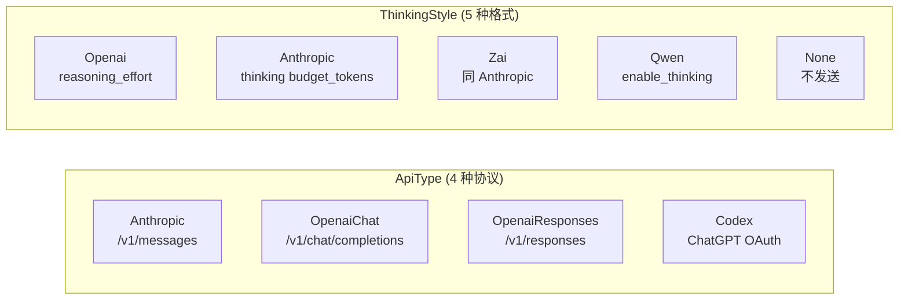

**`ProviderConfig`** — 单个 Provider 的完整配置：

| 字段 | 类型 | 说明 |
|------|------|------|
| `id` | UUID | 唯一标识 |
| `name` | String | 用户自定义显示名 |
| `api_type` | ApiType | 协议类型 |
| `base_url` | String | API 端点 |
| `api_key` | String | 认证凭据（Codex 为空） |
| `models` | Vec\<ModelConfig\> | 可用模型列表 |
| `enabled` | bool | 启用/禁用 |
| `thinking_style` | ThinkingStyle | 推理参数格式 |

**`ModelConfig`** — 单个模型的配置：

| 字段 | 类型 | 说明 |
|------|------|------|
| `id` | String | 模型标识（如 `claude-sonnet-4-6`） |
| `input_types` | Vec\<String\> | `["text", "image", "video"]` |
| `context_window` | u32 | 上下文窗口（tokens） |
| `max_tokens` | u32 | 最大输出 tokens |
| `reasoning` | bool | 是否支持推理 |
| `thinking_style` | Option\<ThinkingStyle\> | 模型级 think 模式覆盖；`None` = 继承 Provider |
| `cost_input` / `cost_output` | f64 | 百万 token 定价（USD） |

**实际生效顺序**

1. `reasoning == false` → 强制 `ThinkingStyle::None`
2. 模型级 `thinking_style`
3. Provider 级 `thinking_style`

因此“模型支持推理”与“当前是否真正发送 thinking 参数”是两个层次：前者由 `reasoning` 声明能力，后者由上述三段式解析决定。

**`AppConfig`** — 全局配置根，持久化到 `~/.hope-agent/config.json`：
- `providers`: 已注册的 Provider 列表
- `active_model`: 当前选中的模型 `{providerId, modelId}`
- `fallback_models`: 降级模型链
- 子配置：`compact`、`notification`、`imageGenerate`、`canvas`、`webSearch` 等

### 1.2 前端模板

**`src/components/settings/provider-setup/templates/`**

36 个内置 Provider 模板，~165 个预设模型（实测 international 38 + china 48 + infrastructure 70 + local 9 = 165；按 `grep -c '^\s*id:' src/components/settings/provider-setup/templates/{international,china,infrastructure,local}.ts` 复核），分为四个模板文件：

- `international.ts` — 国际 Provider（8 个）
- `china.ts` — 国内 Provider（10 个）
- `infrastructure.ts` — 基础设施/聚合 Provider（13 个）
- `local.ts` — 本地/自托管 Provider（5 个）

#### 国际 Provider（`international.ts`）

| Provider | Key | API 类型 | 模型 ID | 模型名 | 上下文 | 最大输出 | 推理 | 输入 | $/M in | $/M out |
|----------|-----|---------|---------|--------|--------|---------|------|------|--------|---------|
| **Anthropic** | `anthropic` | anthropic | `claude-sonnet-4-6` | Claude Sonnet 4.6 | 200K | 8,192 | ❌ | text, image | 3.0 | 15.0 |
| | | | `claude-opus-4-6` | Claude Opus 4.6 | 200K | 8,192 | ✅ | text, image | 15.0 | 75.0 |
| | | | `claude-haiku-4-5` | Claude Haiku 4.5 | 200K | 8,192 | ❌ | text, image | 0.8 | 4.0 |
| **Anthropic (Vertex AI)** | `anthropic-vertex` | anthropic | `claude-opus-4-6` | Claude Opus 4.6 | 1M | 128,000 | ✅ | text, image | 5.0 | 25.0 |
| | | | `claude-sonnet-4-6` | Claude Sonnet 4.6 | 1M | 128,000 | ✅ | text, image | 3.0 | 15.0 |
| **OpenAI** | `openai` | openai-responses | `gpt-5.4` | GPT-5.4 | 1.05M | 128,000 | ✅ | text, image | 2.5 | 15.0 |
| | | | `gpt-5.4-mini` | GPT-5.4 Mini | 400K | 128,000 | ✅ | text, image | 0.75 | 4.5 |
| | | | `gpt-5.4-nano` | GPT-5.4 Nano | 400K | 128,000 | ✅ | text, image | 0.2 | 1.25 |
| | | | `o3` | GPT o3 | 200K | 100,000 | ✅ | text, image | 10.0 | 40.0 |
| | | | `o4-mini` | GPT o4-mini | 200K | 100,000 | ✅ | text, image | 1.1 | 4.4 |
| **OpenAI (Chat)** | `openai-chat` | openai-chat | `gpt-5.4` | GPT-5.4 | 1.05M | 128,000 | ✅ | text, image | 2.5 | 15.0 |
| | | | `gpt-5.4-mini` | GPT-5.4 Mini | 400K | 128,000 | ✅ | text, image | 0.75 | 4.5 |
| | | | `gpt-5.4-nano` | GPT-5.4 Nano | 400K | 128,000 | ✅ | text, image | 0.2 | 1.25 |
| | | | `o3` | GPT o3 | 200K | 100,000 | ✅ | text, image | 10.0 | 40.0 |
| | | | `o4-mini` | GPT o4-mini | 200K | 100,000 | ✅ | text, image | 1.1 | 4.4 |
| **DeepSeek** | `deepseek` | openai-chat | `deepseek-chat` | DeepSeek V3 | 128K | 8,192 | ❌ | text | 0.27 | 1.1 |
| | | | `deepseek-reasoner` | DeepSeek R1 | 131K | 65,536 | ✅ | text | 0.55 | 2.19 |
| **Google Gemini** | `google-gemini` | openai-chat | `gemini-2.5-pro` | Gemini 2.5 Pro | 1M | 65,536 | ✅ | text, image, video | 1.25 | 10.0 |
| | | | `gemini-2.5-flash` | Gemini 2.5 Flash | 1M | 65,536 | ✅ | text, image, video | 0.15 | 0.6 |
| | | | `gemini-3.1-pro-preview` | Gemini 3.1 Pro | 1M | 65,536 | ✅ | text, image, video | 1.25 | 10.0 |
| | | | `gemini-3-flash-preview` | Gemini 3.1 Flash | 1M | 65,536 | ❌ | text, image, video | 0.15 | 0.6 |
| **xAI** | `xai` | openai-chat | `grok-4` | Grok 4 | 256K | 64,000 | ✅ | text | 3.0 | 15.0 |
| | | | `grok-4-0709` | Grok 4 0709 | 256K | 64,000 | ❌ | text | 3.0 | 15.0 |
| | | | `grok-4.20-beta-latest-reasoning` | Grok 4.20 Beta (Reasoning) | 2M | 30,000 | ✅ | text, image | 2.0 | 6.0 |
| | | | `grok-4-fast` | Grok 4 Fast | 2M | 30,000 | ✅ | text, image | 0.2 | 0.5 |
| | | | `grok-4-1-fast` | Grok 4.1 Fast | 2M | 30,000 | ✅ | text, image | 0.2 | 0.5 |
| | | | `grok-3` | Grok 3 | 131K | 8,192 | ❌ | text | 3.0 | 15.0 |
| | | | `grok-3-fast` | Grok 3 Fast | 131K | 8,192 | ❌ | text | 5.0 | 25.0 |
| | | | `grok-3-mini` | Grok 3 Mini | 131K | 8,192 | ✅ | text | 0.3 | 0.5 |
| | | | `grok-3-mini-fast` | Grok 3 Mini Fast | 131K | 8,192 | ✅ | text | 0.6 | 4.0 |
| | | | `grok-code-fast-1` | Grok Code Fast | 256K | 10,000 | ✅ | text | 0.2 | 1.5 |
| **Mistral** | `mistral` | openai-chat | `mistral-large-latest` | Mistral Large | 262K | 16,384 | ❌ | text, image | 0.5 | 1.5 |
| | | | `codestral-latest` | Codestral | 256K | 4,096 | ❌ | text | 0.3 | 0.9 |
| | | | `devstral-medium-latest` | Devstral 2 | 262K | 32,768 | ❌ | text | 0.4 | 2.0 |
| | | | `magistral-small` | Magistral Small | 128K | 40,000 | ✅ | text | 0.5 | 1.5 |
| | | | `mistral-medium-2508` | Mistral Medium 3.1 | 262K | 8,192 | ❌ | text, image | 0.4 | 2.0 |
| | | | `mistral-small-latest` | Mistral Small | 128K | 16,384 | ❌ | text, image | 0.1 | 0.3 |
| | | | `pixtral-large-latest` | Pixtral Large | 128K | 32,768 | ❌ | text, image | 2.0 | 6.0 |

#### 国内 Provider（`china.ts`）

| Provider | Key | API 类型 | 模型 ID | 模型名 | 上下文 | 最大输出 | 推理 | 输入 | $/M in | $/M out |
|----------|-----|---------|---------|--------|--------|---------|------|------|--------|---------|
| **Moonshot AI (Kimi)** | `moonshot` | openai-chat | `kimi-k2.5` | Kimi K2.5 | 262K | 262,144 | ❌ | text, image | 0 | 0 |
| | | | `kimi-k2-thinking` | Kimi K2 Thinking | 262K | 262,144 | ✅ | text | 0 | 0 |
| | | | `kimi-k2-thinking-turbo` | Kimi K2 Thinking Turbo | 262K | 262,144 | ✅ | text | 0 | 0 |
| | | | `kimi-k2-turbo` | Kimi K2 Turbo | 256K | 16,384 | ❌ | text | 0 | 0 |
| **通义千问 (Qwen)** | `qwen` | openai-chat | `qwen-max` | Qwen Max | 32K | 8,192 | ❌ | text | 2.4 | 9.6 |
| | | | `qwen-plus` | Qwen Plus | 131K | 8,192 | ❌ | text | 0.8 | 2.0 |
| | | | `qwen-turbo` | Qwen Turbo | 131K | 8,192 | ❌ | text | 0.3 | 0.6 |
| | | | `qwq-plus` | QwQ Plus (推理) | 131K | 16,384 | ✅ | text | 1.6 | 4.0 |
| **火山引擎 (豆包)** | `volcengine` | openai-chat | `doubao-seed-1-8-251228` | Doubao Seed 1.8 | 256K | 4,096 | ❌ | text, image | 0 | 0 |
| | | | `doubao-seed-code-preview-251028` | Doubao Seed Code | 256K | 4,096 | ❌ | text, image | 0 | 0 |
| | | | `kimi-k2-5-260127` | Kimi K2.5 | 256K | 4,096 | ❌ | text, image | 0 | 0 |
| | | | `glm-4-7-251222` | GLM 4.7 | 200K | 4,096 | ❌ | text, image | 0 | 0 |
| | | | `deepseek-v3-2-251201` | DeepSeek V3.2 | 128K | 4,096 | ❌ | text, image | 0 | 0 |
| **智谱 AI (Z.AI)** | `zhipu` | openai-chat | `glm-5.1` | GLM-5.1 | 202K | 131,100 | ✅ | text | 1.2 | 4.0 |
| | | | `glm-5` | GLM-5 | 202K | 131,100 | ✅ | text | 1.0 | 3.2 |
| | | | `glm-5-turbo` | GLM-5 Turbo | 202K | 131,100 | ✅ | text | 1.2 | 4.0 |
| | | | `glm-5v-turbo` | GLM-5V Turbo | 202K | 131,100 | ✅ | text, image | 1.2 | 4.0 |
| | | | `glm-4.7` | GLM-4.7 | 204K | 131,072 | ✅ | text | 0.6 | 2.2 |
| | | | `glm-4.7-flash` | GLM-4.7 Flash | 200K | 131,072 | ✅ | text | 0.07 | 0.4 |
| | | | `glm-4.7-flashx` | GLM-4.7 FlashX | 200K | 128,000 | ✅ | text | 0.06 | 0.4 |
| | | | `glm-4.6` | GLM-4.6 | 204K | 131,072 | ✅ | text | 0.6 | 2.2 |
| | | | `glm-4.6v` | GLM-4.6V | 128K | 32,768 | ✅ | text, image | 0.3 | 0.9 |
| | | | `glm-4.5` | GLM-4.5 | 131K | 98,304 | ✅ | text | 0.6 | 2.2 |
| | | | `glm-4.5-air` | GLM-4.5 Air | 131K | 98,304 | ✅ | text | 0.2 | 1.1 |
| | | | `glm-4.5-flash` | GLM-4.5 Flash | 131K | 98,304 | ✅ | text | 0 | 0 |
| | | | `glm-4.5v` | GLM-4.5V | 64K | 16,384 | ✅ | text, image | 0.6 | 1.8 |
| **MiniMax** | `minimax` | anthropic | `MiniMax-M2.7` | MiniMax M2.7 | 204K | 131,072 | ✅ | text, image | 0.3 | 1.2 |
| | | | `MiniMax-M2.7-highspeed` | MiniMax M2.7 Highspeed | 204K | 131,072 | ✅ | text, image | 0.3 | 1.2 |
| | | | `MiniMax-VL-01` | MiniMax VL 01 | 200K | 8,192 | ❌ | text, image | 0.3 | 1.2 |
| | | | `MiniMax-M2.5` | MiniMax M2.5 | 200K | 8,192 | ✅ | text | 0.3 | 1.2 |
| **Kimi Coding** | `kimi-coding` | anthropic | `kimi-code` | Kimi Code | 262K | 32,768 | ✅ | text, image | 0 | 0 |
| | | | `k2p5` | Kimi Code (legacy) | 262K | 32,768 | ✅ | text, image | 0 | 0 |
| **小米 MiMo** | `xiaomi` | openai-chat | `mimo-v2-pro` | MiMo V2 Pro | 1M | 32,000 | ✅ | text | 0 | 0 |
| | | | `mimo-v2-omni` | MiMo V2 Omni | 262K | 32,000 | ✅ | text, image | 0 | 0 |
| | | | `mimo-v2-flash` | MiMo V2 Flash | 262K | 8,192 | ❌ | text | 0 | 0 |
| **百度千帆** | `qianfan` | openai-chat | `deepseek-v3.2` | DeepSeek V3.2 | 98K | 32,768 | ✅ | text | 0 | 0 |
| | | | `ernie-5.0-thinking-preview` | ERNIE 5.0 Thinking | 119K | 64,000 | ✅ | text, image | 0 | 0 |
| **ModelStudio (DashScope)** | `modelstudio` | openai-chat | `qwen3.6-plus` | Qwen 3.6 Plus | 1M | 65,536 | ❌ | text, image | 0 | 0 |
| | | | `qwen3.5-plus` | Qwen 3.5 Plus | 1M | 65,536 | ❌ | text, image | 0 | 0 |
| | | | `qwen3-coder-plus` | Qwen 3 Coder Plus | 1M | 65,536 | ❌ | text | 0 | 0 |
| | | | `qwen3-coder-next` | Qwen 3 Coder Next | 262K | 65,536 | ❌ | text | 0 | 0 |
| | | | `qwen3-max-2026-01-23` | Qwen 3 Max | 262K | 65,536 | ❌ | text | 0 | 0 |
| | | | `MiniMax-M2.5` | MiniMax M2.5 | 1M | 65,536 | ✅ | text | 0 | 0 |
| | | | `glm-5` | GLM-5 | 202K | 16,384 | ❌ | text | 0 | 0 |
| | | | `glm-4.7` | GLM 4.7 | 202K | 16,384 | ❌ | text | 0 | 0 |
| | | | `kimi-k2.5` | Kimi K2.5 | 262K | 32,768 | ❌ | text, image | 0 | 0 |
| **阶跃星辰 (StepFun)** | `stepfun` | openai-chat | `step-3.5-flash` | Step 3.5 Flash | 262K | 65,536 | ✅ | text | 0 | 0 |
| | | | `step-3.5-flash-2603` | Step 3.5 Flash 2603 | 262K | 65,536 | ✅ | text | 0 | 0 |

#### 基础设施/聚合 Provider（`infrastructure.ts`）

| Provider | Key | API 类型 | 模型 ID | 模型名 | 上下文 | 最大输出 | 推理 | 输入 | $/M in | $/M out |
|----------|-----|---------|---------|--------|--------|---------|------|------|--------|---------|
| **OpenRouter** | `openrouter` | openai-chat | `auto` | OpenRouter Auto | 200K | 8,192 | ❌ | text, image | 0 | 0 |
| | | | `anthropic/claude-sonnet-4-6` | Claude Sonnet 4.6 | 200K | 8,192 | ❌ | text, image | 3.0 | 15.0 |
| | | | `openai/gpt-4o` | GPT-4o | 128K | 16,384 | ❌ | text, image | 2.5 | 10.0 |
| | | | `google/gemini-2.5-pro-preview` | Gemini 2.5 Pro | 1M | 65,536 | ✅ | text, image | 1.25 | 10.0 |
| | | | `deepseek/deepseek-r1` | DeepSeek R1 | 128K | 8,192 | ✅ | text | 0.55 | 2.19 |
| | | | `openrouter/hunter-alpha` | Hunter Alpha | 1M | 65,536 | ✅ | text | 0 | 0 |
| | | | `openrouter/healer-alpha` | Healer Alpha | 262K | 65,536 | ✅ | text, image | 0 | 0 |
| **Groq** | `groq` | openai-chat | `llama-3.3-70b-versatile` | Llama 3.3 70B | 128K | 32,768 | ❌ | text | 0.59 | 0.79 |
| | | | `mixtral-8x7b-32768` | Mixtral 8x7B | 32K | 32,768 | ❌ | text | 0.24 | 0.24 |
| **NVIDIA** | `nvidia` | openai-chat | `nvidia/nemotron-3-super-120b-a12b` | Nemotron 3 Super 120B | 262K | 8,192 | ❌ | text | 0 | 0 |
| | | | `moonshotai/kimi-k2.5` | Kimi K2.5 | 262K | 8,192 | ❌ | text | 0 | 0 |
| | | | `minimaxai/minimax-m2.5` | MiniMax M2.5 | 196K | 8,192 | ❌ | text | 0 | 0 |
| | | | `z-ai/glm5` | GLM-5 | 202K | 8,192 | ❌ | text | 0 | 0 |
| **Together AI** | `together` | openai-chat | `meta-llama/Llama-3.3-70B-Instruct-Turbo` | Llama 3.3 70B Turbo | 131K | 8,192 | ❌ | text | 0.88 | 0.88 |
| | | | `moonshotai/Kimi-K2.5` | Kimi K2.5 | 262K | 32,768 | ✅ | text, image | 0.5 | 2.8 |
| | | | `zai-org/GLM-4.7` | GLM 4.7 Fp8 | 202K | 8,192 | ❌ | text | 0.45 | 2.0 |
| | | | `meta-llama/Llama-4-Scout-17B-16E-Instruct` | Llama 4 Scout 17B | 10M | 32,768 | ❌ | text, image | 0.18 | 0.59 |
| | | | `meta-llama/Llama-4-Maverick-17B-128E-Instruct-FP8` | Llama 4 Maverick 17B | 20M | 32,768 | ❌ | text, image | 0.27 | 0.85 |
| | | | `deepseek-ai/DeepSeek-V3.1` | DeepSeek V3.1 | 131K | 8,192 | ❌ | text | 0.6 | 1.25 |
| | | | `deepseek-ai/DeepSeek-R1` | DeepSeek R1 | 131K | 8,192 | ✅ | text | 3.0 | 7.0 |
| | | | `moonshotai/Kimi-K2-Instruct-0905` | Kimi K2 Instruct | 262K | 8,192 | ❌ | text | 1.0 | 3.0 |
| **Hugging Face** | `huggingface` | openai-chat | `deepseek-ai/DeepSeek-V3.1` | DeepSeek V3.1 | 131K | 8,192 | ❌ | text | 0.6 | 1.25 |
| | | | `deepseek-ai/DeepSeek-R1` | DeepSeek R1 | 131K | 8,192 | ✅ | text | 3.0 | 7.0 |
| | | | `meta-llama/Llama-3.3-70B-Instruct-Turbo` | Llama 3.3 70B Turbo | 131K | 8,192 | ❌ | text | 0.88 | 0.88 |
| | | | `openai/gpt-oss-120b` | GPT-OSS 120B | 131K | 8,192 | ❌ | text | 0 | 0 |
| **BytePlus (海外火山)** | `byteplus` | openai-chat | `seed-1-8-251228` | Seed 1.8 | 256K | 4,096 | ❌ | text, image | 0 | 0 |
| | | | `kimi-k2-5-260127` | Kimi K2.5 | 256K | 4,096 | ❌ | text, image | 0 | 0 |
| | | | `glm-4-7-251222` | GLM 4.7 | 200K | 4,096 | ❌ | text, image | 0 | 0 |
| **Chutes (TEE)** | `chutes` | openai-chat | `zai-org/GLM-5-TEE` | GLM-5 TEE | 202K | 65,535 | ✅ | text | 0.95 | 3.15 |
| | | | `zai-org/GLM-4.7-TEE` | GLM-4.7 TEE | 202K | 65,535 | ✅ | text | 0.4 | 2.0 |
| | | | `zai-org/GLM-4.7-FP8` | GLM-4.7 FP8 | 202K | 65,535 | ✅ | text | 0.3 | 1.2 |
| | | | `zai-org/GLM-4.6-TEE` | GLM-4.6 TEE | 202K | 65,536 | ✅ | text | 0.4 | 1.7 |
| | | | `zai-org/GLM-4.6-FP8` | GLM-4.6 FP8 | 202K | 65,535 | ✅ | text | 0.3 | 1.2 |
| | | | `zai-org/GLM-4.6V` | GLM-4.6V | 131K | 65,536 | ✅ | text, image | 0.3 | 0.9 |
| | | | `moonshotai/Kimi-K2.5-TEE` | Kimi K2.5 TEE | 262K | 65,535 | ✅ | text, image | 0.45 | 2.2 |
| | | | `deepseek-ai/DeepSeek-V3-0324-TEE` | DeepSeek V3 TEE | 163K | 65,536 | ✅ | text | 0.25 | 1.0 |
| | | | `deepseek-ai/DeepSeek-V3.1-TEE` | DeepSeek V3.1 TEE | 163K | 65,536 | ✅ | text | 0.2 | 0.8 |
| | | | `deepseek-ai/DeepSeek-V3.2-TEE` | DeepSeek V3.2 TEE | 131K | 65,536 | ✅ | text | 0.28 | 0.42 |
| | | | `deepseek-ai/DeepSeek-R1-0528-TEE` | DeepSeek R1 0528 TEE | 163K | 65,536 | ✅ | text | 0.45 | 2.15 |
| | | | `MiniMaxAI/MiniMax-M2.5-TEE` | MiniMax M2.5 TEE | 196K | 65,536 | ✅ | text | 0.3 | 1.1 |
| | | | `XiaomiMiMo/MiMo-V2-Flash-TEE` | MiMo V2 Flash TEE | 262K | 65,536 | ✅ | text | 0.09 | 0.29 |
| | | | `openai/gpt-oss-120b-TEE` | GPT-OSS 120B TEE | 131K | 65,536 | ✅ | text | 0.05 | 0.45 |
| | | | `Qwen/Qwen3-235B-A22B-Instruct-2507-TEE` | Qwen 3 235B TEE | 262K | 65,536 | ✅ | text | 0.08 | 0.55 |
| | | | `Qwen/Qwen3.5-397B-A17B-TEE` | Qwen 3.5 397B TEE | 262K | 65,536 | ✅ | text, image | 0.55 | 3.5 |
| | | | `Qwen/Qwen3-Coder-Next-TEE` | Qwen 3 Coder Next TEE | 262K | 65,536 | ✅ | text | 0.12 | 0.75 |
| | | | `Qwen/Qwen3-32B` | Qwen 3 32B | 40K | 40,960 | ✅ | text | 0.08 | 0.24 |
| **Fireworks AI** | `fireworks` | openai-chat | `accounts/fireworks/routers/kimi-k2p5-turbo` | Kimi K2.5 Turbo (Fire Pass) | 256K | 256,000 | ❌ | text, image | 0 | 0 |
| **Arcee** | `arcee` | openai-chat | `trinity-large-thinking` | Trinity Large Thinking | 262K | 80,000 | ✅ | text | 0.25 | 0.9 |
| | | | `trinity-large-preview` | Trinity Large Preview | 131K | 16,384 | ❌ | text | 0.25 | 1.0 |
| | | | `trinity-mini` | Trinity Mini 26B | 131K | 80,000 | ❌ | text | 0.045 | 0.15 |
| **Venice** | `venice` | openai-chat | `kimi-k2-5` | Kimi K2.5 | 256K | 65,536 | ✅ | text, image | 0 | 0 |
| | | | `deepseek-v3.2` | DeepSeek V3.2 | 160K | 32,768 | ✅ | text | 0 | 0 |
| | | | `qwen3-coder-480b-a35b-instruct` | Qwen 3 Coder 480B | 256K | 65,536 | ❌ | text | 0 | 0 |
| | | | `qwen3-5-35b-a3b` | Qwen 3.5 35B | 256K | 65,536 | ✅ | text, image | 0 | 0 |
| | | | `zai-org-glm-5` | GLM-5 | 198K | 32,000 | ✅ | text | 0 | 0 |
| | | | `minimax-m25` | MiniMax M2.5 | 198K | 32,768 | ✅ | text | 0 | 0 |
| | | | `llama-3.3-70b` | Llama 3.3 70B | 128K | 4,096 | ❌ | text | 0 | 0 |
| | | | `openai-gpt-oss-120b` | GPT-OSS 120B | 128K | 16,384 | ❌ | text | 0 | 0 |
| **Synthetic** | `synthetic` | anthropic | `hf:MiniMaxAI/MiniMax-M2.5` | MiniMax M2.5 | 192K | 65,536 | ❌ | text | 0 | 0 |
| | | | `hf:moonshotai/Kimi-K2.5` | Kimi K2.5 | 256K | 8,192 | ✅ | text, image | 0 | 0 |
| | | | `hf:zai-org/GLM-5` | GLM-5 | 256K | 128,000 | ✅ | text, image | 0 | 0 |
| | | | `hf:zai-org/GLM-4.7` | GLM-4.7 | 198K | 128,000 | ❌ | text | 0 | 0 |
| | | | `hf:deepseek-ai/DeepSeek-V3.2` | DeepSeek V3.2 | 159K | 8,192 | ❌ | text | 0 | 0 |
| | | | `hf:deepseek-ai/DeepSeek-R1-0528` | DeepSeek R1 0528 | 128K | 8,192 | ❌ | text | 0 | 0 |
| | | | `hf:Qwen/Qwen3-Coder-480B-A35B-Instruct` | Qwen 3 Coder 480B | 256K | 8,192 | ❌ | text | 0 | 0 |
| | | | `hf:openai/gpt-oss-120b` | GPT-OSS 120B | 128K | 8,192 | ❌ | text | 0 | 0 |
| **Vercel AI Gateway** | `vercel-ai-gateway` | openai-chat | `anthropic/claude-opus-4.6` | Claude Opus 4.6 | 1M | 128,000 | ✅ | text, image | 5.0 | 25.0 |
| | | | `openai/gpt-5.4` | GPT-5.4 | 200K | 128,000 | ✅ | text, image | 2.5 | 15.0 |
| | | | `openai/gpt-5.4-pro` | GPT-5.4 Pro | 200K | 128,000 | ✅ | text, image | 30.0 | 180.0 |
| **Cloudflare AI Gateway** | `cloudflare-ai` | openai-chat | `claude-sonnet-4-6` | Claude Sonnet 4.6 | 200K | 64,000 | ✅ | text, image | 3.0 | 15.0 |

#### 本地/自托管 Provider（`local.ts`）

| Provider | Key | API 类型 | 模型 ID | 模型名 | 上下文 | 最大输出 | 推理 | 说明 |
|----------|-----|---------|---------|--------|--------|---------|------|------|
| **LiteLLM** | `litellm` | openai-chat | `your-model-id` | Your Model | 128K | 8,192 | ❌ | 统一 LLM API 代理网关 |
| **Ollama** | `ollama` | openai-chat | `glm-4.7-flash` | GLM 4.7 Flash | 128K | 8,192 | ✅ | 本地运行 |
| | | | `qwen3:32b` | Qwen 3 32B | 128K | 8,192 | ✅ | 本地运行 |
| | | | `kimi-k2.5:cloud` | Kimi K2.5 (云端) | 256K | 8,192 | ❌ | Ollama 云端代理 |
| | | | `minimax-m2.5:cloud` | MiniMax M2.5 (云端) | 200K | 8,192 | ✅ | Ollama 云端代理 |
| | | | `glm-5:cloud` | GLM-5 (云端) | 204K | 131,072 | ✅ | Ollama 云端代理 |
| **vLLM** | `vllm` | openai-chat | `your-model-id` | Your Model | 128K | 8,192 | ❌ | 高性能本地推理引擎 |
| **LM Studio** | `lm-studio` | openai-chat | `your-model-id` | Your Model | 128K | 8,192 | ❌ | 桌面端本地推理 |
| **SGLang** | `sglang` | openai-chat | `your-model-id` | Your Model | 128K | 8,192 | ❌ | 高性能本地推理引擎 |

### 1.3 Provider Write Contract（强制）

所有 Provider 列表与 `active_model` 写入必须走 `crates/ha-core/src/provider/crud.rs` 提供的 helper，禁止在 Tauri / HTTP / onboarding / importer / local_llm 等任何路径里直接 `providers.push` / `retain` / 手写 `active_model`：

| Helper | 语义 |
|---|---|
| `add_provider(cfg)` | 生成新 id 并 append 到列表尾部（前端「新增后取最后一项」依赖此语义，不要破坏） |
| `update_provider(id, mutator)` | 按 id 找到现有 Provider 并修改字段 |
| `delete_provider(id)` | 删除 Provider，并清理可能挂在其上的 `active_model` |
| `reorder_providers(order)` | 按给定 id 序列重排 |
| `set_active_model(provider_id, model_id)` | 唯一允许修改 `active_model` 的入口 |
| `add_and_activate_provider(cfg)` | 添加并把 active model 切到首个模型（onboarding 用） |
| `add_many_providers(cfgs)` | 批量导入（importer 用） |
| `ensure_codex_provider_persisted()` | Codex Provider 构造期失败保活（commit `99bc84a7`，配合 OAuth 重新登录） |
| `upsert_known_local_provider_model(kind, ...)` | 本地 LLM 安装路径专用：按 [Local Backend Catalog](#14-local-backend-catalog) 的 host/port 去重，补模型、启用 Provider、设置 `allow_private_network`、切 active model |

Tauri / HTTP 命令一律只做薄壳，业务路径必须走以上 helper。CR / review 阶段一旦看到直接操作 `cfg.providers` 数组或 `active_model` 字段，必须打回。

### 1.4 Local Backend Catalog

本地后端目录硬编码在 `crates/ha-core/src/provider/local.rs`，当前条目：

| Kind | Host / Port | 备注 |
|---|---|---|
| `ollama` | `localhost:11434`（额外接受 `ollama.local`） | 本地大模型默认入口 |
| `litellm` | `localhost:4000` | 统一 LLM 代理网关 |
| `vllm` | `localhost:8000` | 高性能推理 |
| `lm-studio` | `localhost:1234` | 桌面端本地推理 |
| `sglang` | `localhost:30000` | 高性能推理 |

匹配规则固定为「`apiType` 一致 + host/port 命中」，URL path 一律忽略——所以 `http://localhost:11434/v1` 也算 Ollama。Tauri 命令 `local_llm_known_backends` 与 HTTP `GET /api/local-llm/known-backends` 同步暴露此 catalog；前端判断"是否已配置本地后端"必须消费这个目录，禁止再写硬编码 regex。

本地 LLM 一键安装、模型拉取、Embedding 拉取等流程详见 [local-model-loading.md](./local-model-loading.md)。

---

## 2. Agent 核心

### 2.1 LlmProvider 枚举

**`crates/ha-core/src/agent/types.rs`**

```rust
enum LlmProvider {
    Anthropic { api_key, base_url, model },
    OpenAIChat { api_key, base_url, model },
    OpenAIResponses { api_key, base_url, model },
    Codex { access_token, account_id, model },
}
```

### 2.2 AssistantAgent 结构体

**`crates/ha-core/src/agent/types.rs`**

| 字段 | 说明 |
|------|------|
| `provider` | LlmProvider 枚举，决定走哪个 API |
| `thinking_style` | ThinkingStyle，控制推理参数格式 |
| `conversation_history` | `Mutex<Vec<JSON>>`，完整对话状态 |
| `context_window` | 模型上下文窗口大小 |
| `compact_config` | 上下文压缩配置 |
| `denied_tools` | 深度分层工具策略 |
| `plan_agent_mode` | Plan/Executing Agent 模式切换 |

### 2.3 Chat 分发器

**`crates/ha-core/src/agent/mod.rs`**

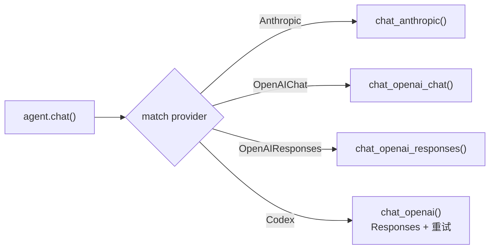

---

## 3. 对话流程

### 3.1 主流程

**入口**：`src-tauri/src/commands/chat.rs`（桌面）/ `crates/ha-server/src/routes/chat.rs`（HTTP）→ 调用 `crates/ha-core/src/chat_engine/`

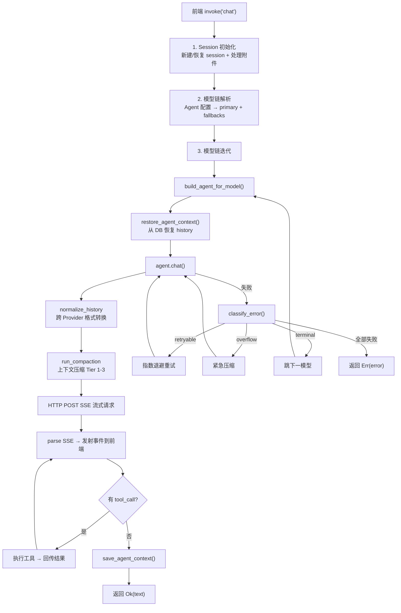

### 3.2 事件流 (Channel\<String\>)

Provider 通过 `on_delta` 回调实时推送 JSON 事件：

| 事件类型 | 字段 | 说明 |
|---------|------|------|
| `text_delta` | `content` | 增量文本 |
| `thinking_delta` | `content` | 增量推理内容 |
| `tool_call` | `call_id`, `name`, `arguments` | 工具调用开始 |
| `tool_result` | `call_id`, `result`, `duration_ms`, `is_error` | 工具执行结果 |
| `usage` | `input_tokens`, `output_tokens`, `model`, `ttft_ms` | Token 用量 |
| `context_compacted` | `tier_applied`, `tokens_before`, `tokens_after` | 上下文压缩通知 |
| `model_fallback` | `model`, `from_model`, `reason` | 模型降级通知 |

### 3.3 前端事件处理

**`src/components/chat/useChatStream.ts`**

- `text_delta` + `thinking_delta`：缓冲 + `requestAnimationFrame` 批量刷新（60fps）
- `tool_call` → 先同步 flush 缓冲区 → 创建 ToolCallBlock 组件（pending 状态）
- `tool_result` → 更新 ToolCallBlock（完成/错误状态）
- `thinking_delta` → ThinkingBlock 组件（可折叠，自动展开配置）

---

## 4. Provider 实现详解

### 4.1 Anthropic Messages API

**`crates/ha-core/src/agent/providers/anthropic.rs`**

**请求格式：**
```json
{
  "model": "claude-sonnet-4-6",
  "max_tokens": 16384,
  "system": [{ "type": "text", "text": "...", "cache_control": { "type": "ephemeral" } }],
  "messages": [...],
  "tools": [...],
  "stream": true,
  "thinking": { "type": "enabled", "budget_tokens": 4096 }
}
```

> `cache_control` 用于 Prompt Cache 复用，详见 [Side Query 缓存架构](side-query.md)。

**History 格式（assistant 消息）：**
```json
{
  "role": "assistant",
  "content": [
    { "type": "thinking", "thinking": "推理过程..." },
    { "type": "text", "text": "回复内容" },
    { "type": "tool_use", "id": "call_123", "name": "read", "input": {...} }
  ]
}
```

**Thinking 回传**：thinking 块写入 content 数组，下一轮原样回传给 API，保证多轮推理连贯。

### 4.2 OpenAI Chat Completions API

**`crates/ha-core/src/agent/providers/openai_chat.rs`**

**ThinkingStyle 分发（`apply_thinking_to_chat_body`）：**

| ThinkingStyle | 参数格式 | 适用 Provider |
|---------------|---------|-------------|
| Openai | `reasoning_effort: "high"` | OpenAI、DeepSeek、Mistral、xAI 等 |
| Anthropic | `thinking: { type: "enabled", budget_tokens: N }` | MiniMax、Kimi Coding |
| Zai | 同 Anthropic | 智谱 Z.AI |
| Qwen | `enable_thinking: true` | 通义千问、阿里云百炼 |
| None | 不发送 | 自定义 Provider |

**Thinking 来源（两种）：**
1. **`reasoning_content` 字段**（o3/o4-mini 等原生推理模型）→ 直接从 SSE delta 提取
2. **`<think>` 标签**（Qwen/DeepSeek 等）→ `ThinkTagFilter` 状态机实时解析，分离 thinking 和 text

**History 格式（assistant 消息）：**
```json
{
  "role": "assistant",
  "content": "回复内容",
  "reasoning_content": "推理过程...",
  "tool_calls": [{ "id": "call_123", "type": "function", "function": { "name": "read", "arguments": "{...}" } }]
}
```

### 4.3 OpenAI Responses API

**`crates/ha-core/src/agent/providers/openai_responses.rs`**

**请求格式：**
```json
{
  "model": "o3",
  "store": false,
  "stream": true,
  "instructions": "系统提示词",
  "input": [...],
  "reasoning": { "effort": "high", "summary": "auto" },
  "include": ["reasoning.encrypted_content"],
  "tools": [...]
}
```

**Reasoning item 不回传（`store: false` 红线）**

Hope Agent 始终用 `store: false` 调 Responses API。在这一模式下，服务端**不持久化** reasoning item，`rs_*` id 是一次性引用——下一轮请求只要带上历史 reasoning item，无论是否携带 `encrypted_content`，服务端都会按 id 查持久化记录并 404（`Item with id 'rs_xxx' not found. Items are not persisted when store is set to false.`）。

因此契约是：**reasoning item 从不进入 `conversation_history`，从不参与下一轮 replay**。

1. 请求中**不再加** `include: ["reasoning.encrypted_content"]`（即便加了也不写回 history）
2. SSE 中收到 reasoning 事件时，`response.reasoning_summary_text.delta` 流给前端做"思考可视化"，但其结构化的 reasoning item（id + encrypted_content）**就地丢弃**
3. `parse_openai_sse` 返回签名不含 `reasoning_items`；`RoundOutcome` 也不再有该字段
4. `normalize_history_for_responses` 把任何残留的 `type: reasoning` item 一并 `continue`（兜底，防御旧版本写下的 context_json）
5. 每轮独立 reasoning 与 `store=false` 的 stateless 语义完全对齐——少几秒 reasoning 时间换稳定性

**SSE 事件处理：**

| 事件 | 处理 |
|------|------|
| `response.reasoning_summary_text.delta` | → `emit_thinking_delta` + 累积（仅 UI 可视化） |
| `response.reasoning_summary_part.done` | → 追加 `\n\n` 段落分隔 |
| `response.output_text.delta` | → `emit_text_delta` + 累积 |
| `response.output_item.added` (function_call) | → 创建 pending tool call |
| `response.output_item.done` (reasoning) | → 丢弃结构化 item（thinking 已通过 delta 路径累积） |
| `response.output_item.done` (function_call) | → 完成 tool call |
| `response.completed` | → 提取 usage + fallback 文本提取 |

**History 格式：**
```json
[
  { "role": "user", "content": "问题" },
  { "type": "message", "role": "assistant", "content": [{ "type": "output_text", "text": "回复" }], "status": "completed" },
  { "type": "function_call", "id": "fc_xxx", "call_id": "fc_xxx", "name": "read", "arguments": "{...}" },
  { "type": "function_call_output", "call_id": "fc_xxx", "output": "文件内容" }
]
```

### 4.4 Codex OAuth API

**`crates/ha-core/src/agent/providers/codex.rs`**

与 OpenAI Responses API 相同的请求/响应格式，额外特性：
- **OAuth 认证**：`Authorization: Bearer {access_token}` + `chatgpt-account-id` header
- **终端登录入口**：`hope-agent auth codex login` 复用同一 PKCE loopback 流程，登录成功后写 `~/.hope-agent/credentials/auth.json` 并调用 `ensure_codex_provider_persisted(Always("gpt-5.4"))`；`--no-open` 只打印 URL，适合 SSH/headless 配合 `ssh -L 1455:127.0.0.1:1455 <host>` 使用
- **重试 / 降级**：Codex 调用同样走 `failover::executor::execute_with_failover` + `chat_engine_default` policy（max_retries=2，退避基数与上限统一），不再有 Codex 自管的「3 次 1s/2s/4s」逻辑
- **不参与 auth profile 轮换**：executor 内部硬编码 Codex Provider 跳过 profile 选择/轮换；Codex 凭据失败直接经标准失败路径走下一模型
- **构造期失败保活**：Codex Provider 在 `crates/ha-core/src/provider/helpers.rs::ensure_codex_provider_persisted`（commit `99bc84a7`）保证 token 缺失或构造异常时配置仍持久化，下次手动登录补回即可，不会被静默移除
- **共享 SSE 解析**：调用 `parse_openai_sse()`（与 Responses API 共享）

---

## 5. Thinking/Reasoning 系统

### 5.1 推理参数映射

**`crates/ha-core/src/agent/config.rs`**

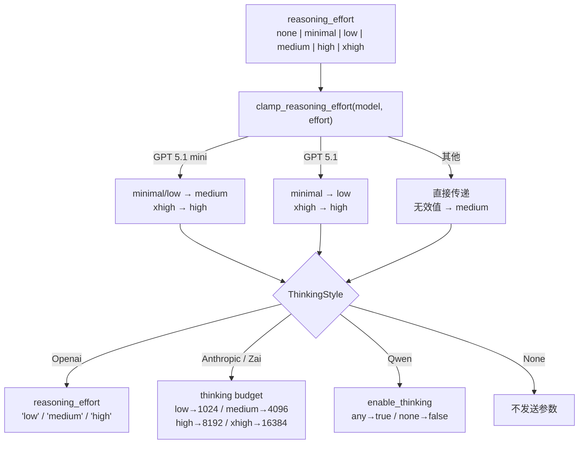

### 5.2 ThinkTagFilter

**`crates/ha-core/src/agent/types.rs`**

有状态的流式解析器，用于从 Chat Completions 响应中提取 `<think>` 标签内的内容：

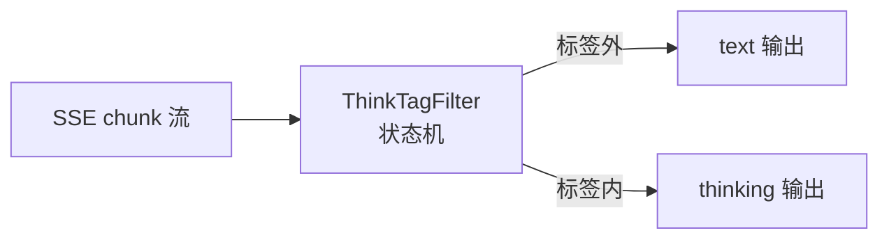

- 支持 `<think>`、`<thinking>`、`<thought>` 标签（大小写不敏感）
- 处理跨 chunk 边界的部分标签
- 当 `reasoning_effort == "none"` 时丢弃 thinking 内容

### 5.3 多轮 Thinking 回传

每个 Provider 在 conversation_history 中保存 thinking 内容，确保下一轮对话时模型能看到之前的推理：

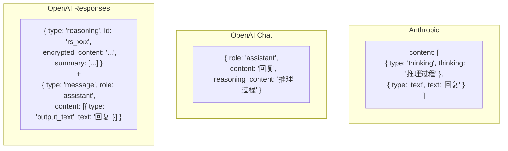

---

## 6. History 格式标准化

### 6.1 问题

当 failover 降级或用户手动切换模型时，`conversation_history` 中可能包含**另一个 Provider 格式**的消息。例如 Responses API 的 `{ type: "reasoning" }` 项被发送给 Anthropic API 会导致错误。

### 6.2 解决方案

**`crates/ha-core/src/agent/context.rs`** 中三个标准化函数，每个 Provider 在读取 history 时调用：

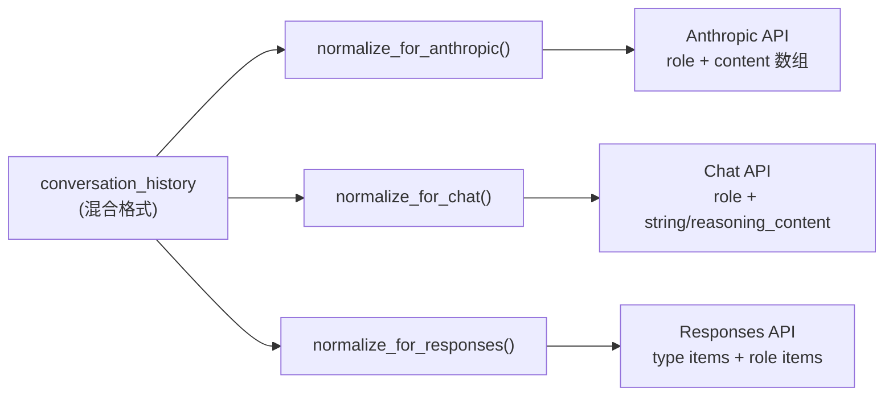

**`normalize_history_for_anthropic()`**

| 输入格式 | 转换 |
|---------|------|
| `type: "reasoning"` (加密) | 跳过 |
| `type: "function_call"` | 跳过（Anthropic 用 tool_use） |
| `type: "function_call_output"` | 跳过 |
| `type: "message"` (Responses) | 提取 output_text → `{ role, content: text }` |
| `reasoning_content` 字段 (Chat) | 转为 `[{ type: "thinking" }, { type: "text" }]` 数组 |
| 标准 role 消息 | 直通 |

**`normalize_history_for_chat()`**

| 输入格式 | 转换 |
|---------|------|
| `type: "reasoning"` | 跳过 |
| `type: "function_call"` / `function_call_output` | 跳过 |
| `type: "message"` (Responses) | 提取 text → `{ role, content: text }` |
| Anthropic content 数组 (thinking+text) | text → `content`，thinking → `reasoning_content` |
| 标准 role 消息 | 直通 |

**`normalize_history_for_responses()`**

| 输入格式 | 转换 |
|---------|------|
| 原生 Responses 项 | 直通 |
| Anthropic tool_use/tool_result 数组 | 跳过（Responses 用 function_call） |
| Anthropic content 数组 | 提取 text → `{ role, content: text }` |
| `reasoning_content` 字段 | 移除 |
| 标准 role 消息 | 直通 |

### 6.3 调用时机

```rust
// 每个 Provider 的 chat_* 方法开头：
let mut messages = Self::normalize_history_for_anthropic(&self.conversation_history.lock().unwrap());
let mut messages = Self::normalize_history_for_chat(&self.conversation_history.lock().unwrap());
let mut input = Self::normalize_history_for_responses(&self.conversation_history.lock().unwrap());
```

---

## 7. Failover 降级系统

### 7.1 错误分类

**`crates/ha-core/src/failover/{mod,executor}.rs`**

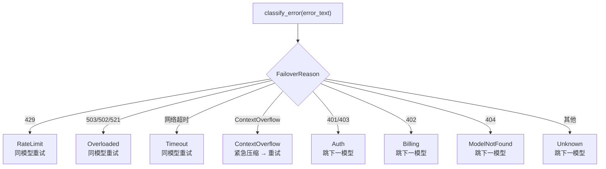

### 7.2 模型链解析

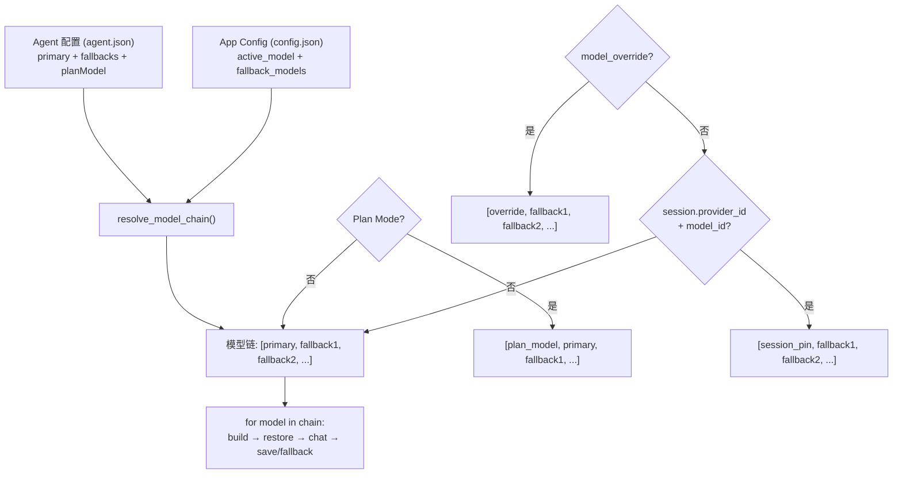

**chat 入口决策优先级（高到低）**（[`src-tauri/src/commands/chat.rs`](../../src-tauri/src/commands/chat.rs) / [`crates/ha-server/src/routes/chat.rs`](../../crates/ha-server/src/routes/chat.rs) 完全对称）：

1. **Plan Mode `plan_model`**（仅 Planning 阶段，临时降级到便宜模型）
2. **本轮显式 `model_override`**（前端 `useChatStream` 把当前 `activeModel` 作为 modelOverride 透传，IM 也可经由 `body.model_override`）
3. **`sessions.provider_id` + `sessions.model_id`**（用户对该会话 pin 的模型；由 `set_session_model` Tauri 命令 / `PATCH /api/sessions/{id}/model` HTTP / IM `/model` 命令写入。chat_engine 每轮事后亦会回写当前实际使用的模型）
4. **`agent.model.primary`**（Agent 配置的首选）
5. **`AppConfig.active_model`**（应用全局默认，由「设置 → 模型」面板修改）

第 3 项 session pin 是 v0.2.1 引入的——之前会话内切模型走 `set_active_model` 写 `AppConfig.active_model`，等于改全应用默认；现在只写当前会话行，跨会话不再相互影响。`set_session_model` 写入后 emit `session:model_updated` 事件（payload `{ sessionId, providerId, modelId }`），桌面 GUI 仅在 `sessionId == currentSessionId` 时同步 UI，避免 IM 远程切换误更新本地正在看的另一个会话。

### 7.3 重试策略

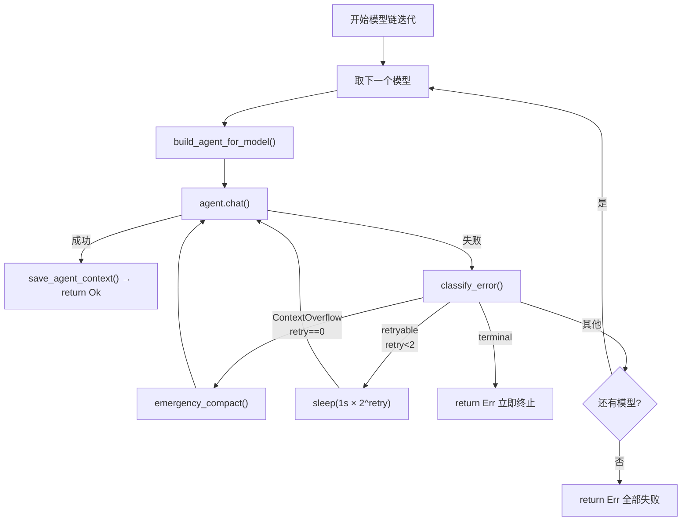

---

## 8. 数据落盘存储与加载

### 8.0 双轨存储架构

对话数据存在**两条并行的持久化通道**，服务于不同目的：

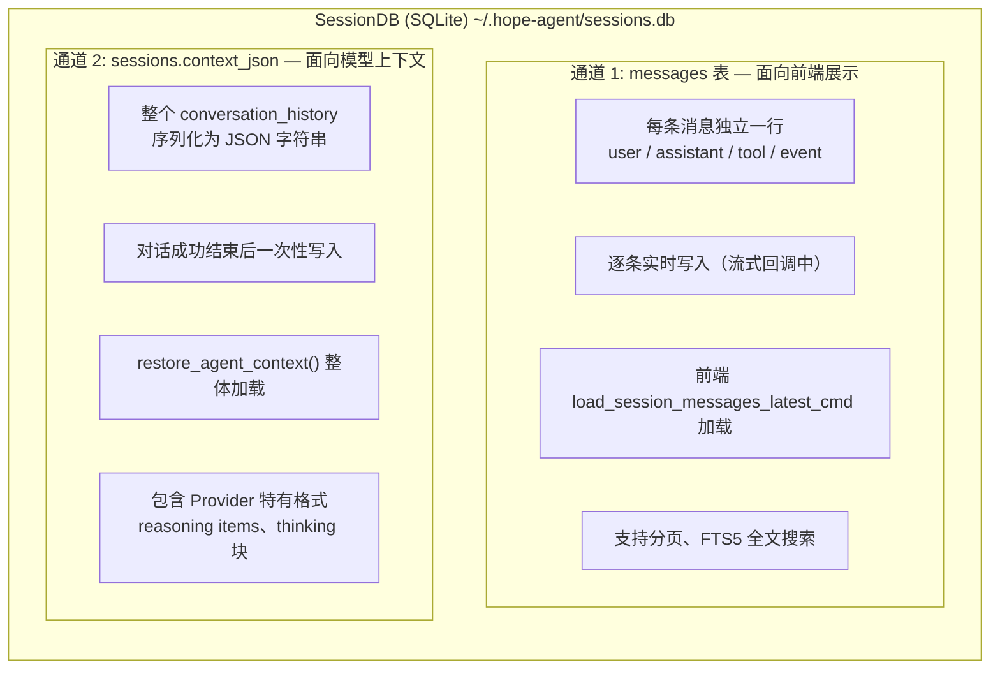

**为什么需要两条通道？**
- `messages` 表：行式结构，方便前端分页展示、搜索、统计 token 用量
- `context_json` 列：保留完整的 Provider API 格式，直接喂给下一轮 API 调用，无需格式转换

### 8.1 通道 1：messages 表 — 逐条实时写入

**Schema（`crates/ha-core/src/session/db.rs`）：**

```sql
CREATE TABLE messages (
  id              INTEGER PRIMARY KEY AUTOINCREMENT,
  session_id      TEXT NOT NULL,
  role            TEXT NOT NULL,      -- user|assistant|tool|text_block|thinking_block|event
  content         TEXT DEFAULT '',     -- 消息文本内容
  timestamp       TEXT NOT NULL,
  attachments_meta TEXT,               -- 附件 JSON 元数据
  model           TEXT,                -- 使用的模型 ID
  tokens_in       INTEGER,             -- 输入 token 数
  tokens_out      INTEGER,             -- 输出 token 数
  reasoning_effort TEXT,               -- 推理强度
  tool_call_id    TEXT,                -- 工具调用 ID
  tool_name       TEXT,                -- 工具名
  tool_arguments  TEXT,                -- 工具参数 JSON
  tool_result     TEXT,                -- 工具结果
  tool_duration_ms INTEGER,            -- 工具执行耗时
  is_error        INTEGER DEFAULT 0,   -- 是否工具错误
  thinking        TEXT,                -- 思维过程（独立列）
  ttft_ms         INTEGER,             -- Time to First Token
  FOREIGN KEY (session_id) REFERENCES sessions(id) ON DELETE CASCADE
);

-- FTS5 全文搜索（仅索引 user/assistant 消息）
CREATE VIRTUAL TABLE messages_fts USING fts5(content, content='messages', content_rowid='id');
CREATE TRIGGER messages_fts_ai AFTER INSERT ON messages
  WHEN new.role IN ('user', 'assistant') AND length(new.content) > 0
  BEGIN INSERT INTO messages_fts(rowid, content) VALUES (new.id, new.content); END;
```

**写入时机（`crates/ha-core/src/chat_engine/context.rs`，由 Tauri 命令层 / HTTP 路由层调用）：**

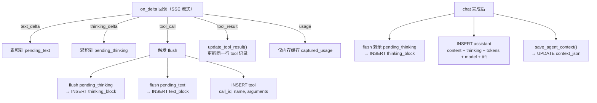

**消息角色（`MessageRole` 枚举）：**

| Role | 说明 | 写入时机 |
|------|------|---------|
| `user` | 用户输入 | chat 命令开始时 |
| `assistant` | AI 最终回复 | chat 完成后 |
| `tool` | 工具调用记录 | tool_call 事件时（result 后续更新） |
| `text_block` | 中间文本片段 | tool_call 前 flush |
| `thinking_block` | 中间思维片段 | tool_call 前 flush |
| `event` | 系统事件（降级通知等） | failover / 错误时 |

**为什么需要 text_block / thinking_block？**

多轮 tool loop 中，消息顺序是：thinking → text → tool_call → tool_result → thinking → text → tool_call → ...

如果只在最后写一条 assistant 消息，中间的 thinking/text 片段与 tool_call 的时序关系会丢失。`text_block` 和 `thinking_block` 保留了多轮执行过程中的完整时序。

### 8.2 通道 2：context_json — 整体序列化

**Schema：**
```sql
-- sessions 表的 context_json 列
ALTER TABLE sessions ADD COLUMN context_json TEXT;
```

**写入（`save_agent_context`）：**
```rust
fn save_agent_context(db: &SessionDB, session_id: &str, agent: &AssistantAgent) {
    let history: Vec<Value> = agent.get_conversation_history();
    let json_str: String = serde_json::to_string(&history);
    db.save_context(session_id, &json_str);
    // → UPDATE sessions SET context_json = ?1 WHERE id = ?2
}
```

**加载（`restore_agent_context`）：**
```rust
fn restore_agent_context(db: &SessionDB, session_id: &str, agent: &AssistantAgent) {
    if let Some(json_str) = db.load_context(session_id) {
        let history: Vec<Value> = serde_json::from_str(&json_str);
        agent.set_conversation_history(history);
    }
    // → SELECT context_json FROM sessions WHERE id = ?1
}
```

**context_json 中的数据格式（取决于最后使用的 Provider）：**

```json
// Anthropic 格式
[
  { "role": "user", "content": "你好" },
  { "role": "assistant", "content": [
    { "type": "thinking", "thinking": "用户在打招呼..." },
    { "type": "text", "text": "你好！" }
  ]},
  { "role": "user", "content": [{ "type": "tool_result", "tool_use_id": "call_1", "content": "..." }] }
]

// OpenAI Responses 格式
[
  { "role": "user", "content": "你好" },
  { "type": "reasoning", "id": "rs_xxx", "encrypted_content": "...", "summary": [...] },
  { "type": "message", "role": "assistant", "content": [{ "type": "output_text", "text": "你好！" }], "status": "completed" },
  { "type": "function_call", "id": "fc_xxx", "call_id": "fc_xxx", "name": "read", "arguments": "{...}" },
  { "type": "function_call_output", "call_id": "fc_xxx", "output": "文件内容" }
]

// OpenAI Chat 格式
[
  { "role": "system", "content": "..." },
  { "role": "user", "content": "你好" },
  { "role": "assistant", "content": "你好！", "reasoning_content": "用户在打招呼..." },
  { "role": "assistant", "content": null, "tool_calls": [{ "id": "call_1", "type": "function", "function": { "name": "read", "arguments": "{...}" } }] },
  { "role": "tool", "tool_call_id": "call_1", "content": "文件内容" }
]
```

### 8.3 写入时序全景

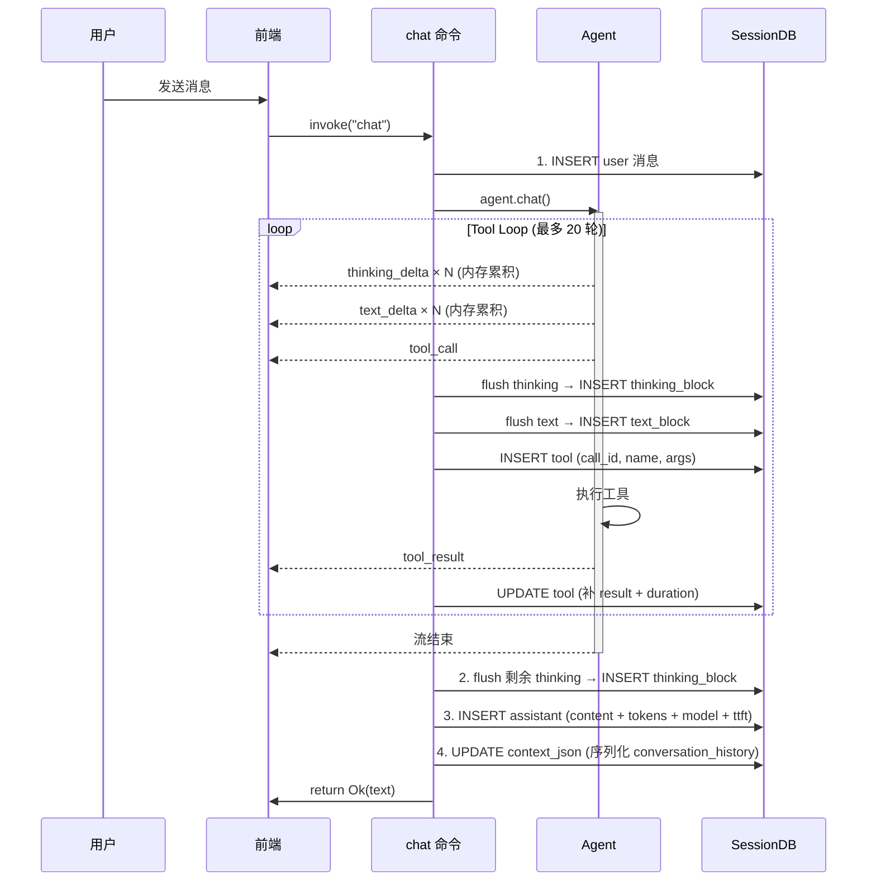

### 8.4 加载时序

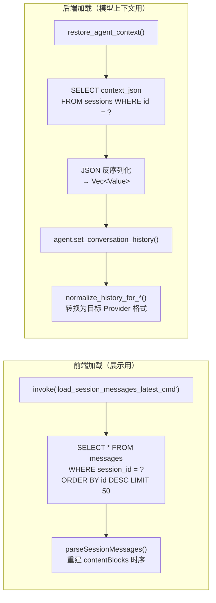

### 8.5 Failover 场景的存储交互

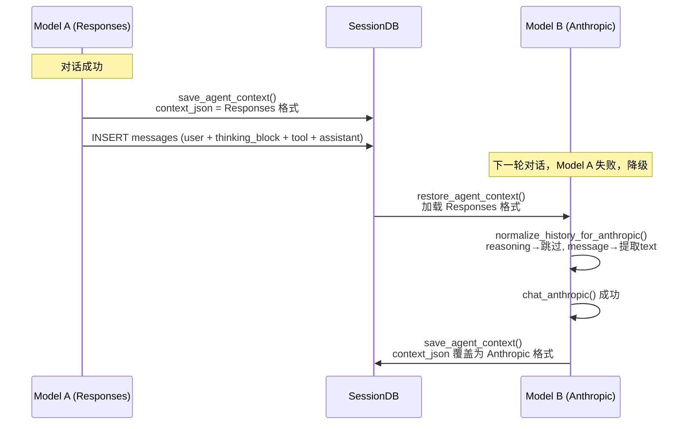

### 8.6 附件存储

```
~/.hope-agent/
  attachments/
    {session_id}/
      {uuid}.png        ← 图片文件
      {uuid}.pdf        ← 文件附件
  generated-images/
    {timestamp}_{uuid}.png  ← AI 生成的图片
```

- 附件在 chat 命令开始时保存到磁盘
- `attachments_meta` JSON 存入 messages 表（名称、MIME、大小、路径）
- Session 删除时级联清理附件目录

---

## 9. 上下文管理

### 9.1 上下文压缩

上下文压缩详见 [context-compact.md](./context-compact.md)。本系统采用 **5 层渐进式**结构：Tier 0 反应式微压缩（每轮工具结束后清理 `tool_policies=eager` 的旧工具结果，cache-safe）+ Tier 1 工具结果截断 + Tier 2 上下文裁剪（软/硬）+ Tier 3 LLM 摘要 + Tier 4 ContextOverflow 应急恢复。Provider 系统作为消费方，只需保证消息格式标准化与 Token 计量准确，触发条件、cache-TTL 节流、压缩策略全部由 `context_compact` 模块负责。

### 9.2 Summarization 消息格式处理

**`crates/ha-core/src/context_compact/summarization.rs`**

摘要构建时，需要正确处理所有 Provider 格式的消息：

| 消息格式 | 摘要处理 |
|---------|---------|
| `type: "reasoning"` (加密) | 跳过（不可读） |
| `type: "function_call"` | `[tool_call]: name(args_preview)` |
| `type: "function_call_output"` | `[tool_result]: output_preview` |
| `type: "message"` (Responses) | 提取 output_text → `[assistant]: text` |
| Anthropic `thinking` 块 | `[assistant/thinking]: preview(300chars)` |
| Anthropic `text` 块 | `[assistant]: text` |
| Chat `reasoning_content` | `[assistant/thinking]: preview(300chars)` |
| 简单字符串 content | `[role]: text` |
| `tool_result` (Anthropic) | `[tool_result]: preview(500chars)` |

### 9.3 Session 持久化

**`crates/ha-core/src/session/db.rs`**

```sql
-- 核心表结构
sessions (id, title, agent_id, provider_id, model_id, plan_mode, plan_steps, ...)
messages  (id, session_id, role, content, thinking, model, tokens_in, tokens_out,
           tool_call_id, tool_name, tool_arguments, tool_result, tool_duration_ms, ttft_ms, ...)
messages_fts (FTS5 全文搜索索引，覆盖 user/assistant 消息)
```

**上下文保存/恢复：**
```rust
// 保存：序列化 conversation_history 为 JSON 存入 DB
save_agent_context(db, session_id, agent)
  → agent.get_conversation_history() → JSON string → db.save_context()

// 恢复：从 DB 加载 JSON 反序列化为 Vec<Value>
restore_agent_context(db, session_id, agent)
  → db.load_context() → Vec<Value> → agent.set_conversation_history()
```

---

## 10. 数据流全景图

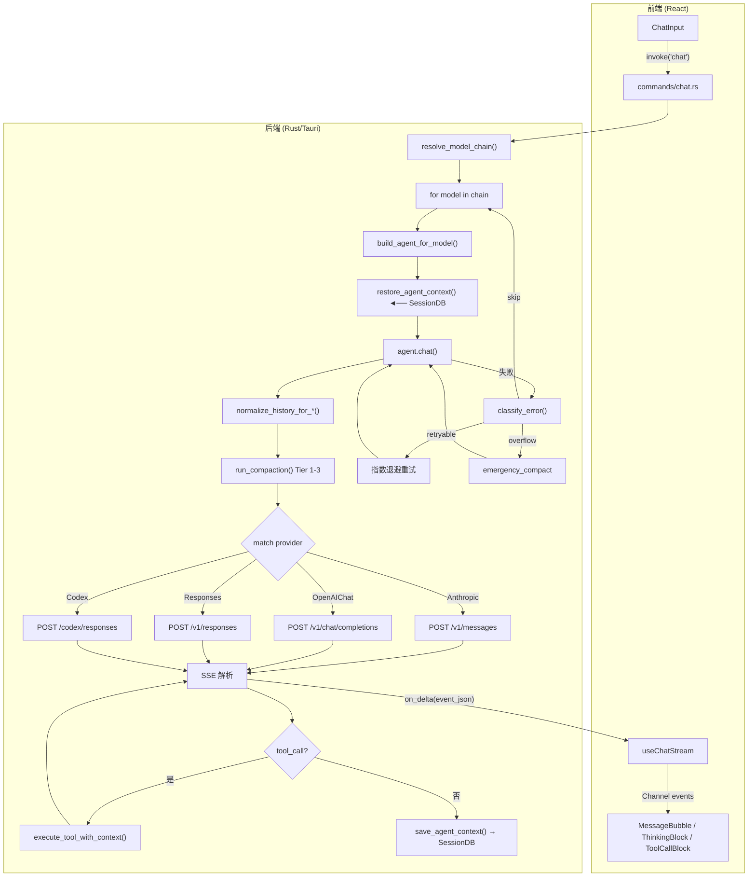

---

## 11. 关键文件索引

| 模块 | 文件 | 职责 |
|------|------|------|
| Provider 配置 | `crates/ha-core/src/provider/` | ApiType、ThinkingStyle、ProviderConfig、模型链解析 |
| Agent 核心 | `crates/ha-core/src/agent/mod.rs` | 构造器、chat 分发、系统提示词组装 |
| Agent 类型 | `crates/ha-core/src/agent/types.rs` | LlmProvider、AssistantAgent、ThinkTagFilter |
| Anthropic | `crates/ha-core/src/agent/providers/anthropic.rs` | Messages API + thinking 块回传 |
| Chat Completions | `crates/ha-core/src/agent/providers/openai_chat.rs` | ThinkingStyle 分发 + reasoning_content 回传 |
| Responses API | `crates/ha-core/src/agent/providers/openai_responses.rs` | encrypted_content 回传 + reasoning item 捕获 |
| Codex OAuth | `crates/ha-core/src/agent/providers/codex.rs` | Responses 变体 + 重试逻辑 |
| 推理参数 | `crates/ha-core/src/agent/config.rs` | 5 种 ThinkingStyle 映射、effort 钳制 |
| 内容构建 | `crates/ha-core/src/agent/content.rs` | 各 Provider 的用户消息格式构建 |
| 事件发射 | `crates/ha-core/src/agent/events.rs` | text_delta、thinking_delta、tool_call 等 |
| 上下文管理 | `crates/ha-core/src/agent/context.rs` | history 标准化、push_user_message、run_compaction |
| 上下文压缩 | `crates/ha-core/src/context_compact/` | 5 层渐进式压缩 + 摘要构建 |
| Failover | `crates/ha-core/src/failover/{mod,executor}.rs` | 错误分类、统一执行器（policy + provider 选择 + 退避 + Codex 不轮换） |
| Session DB | `crates/ha-core/src/session/` | SQLite 持久化、消息 FTS 搜索 |
| Chat 命令（桌面） | `src-tauri/src/commands/chat.rs` | Tauri 命令层：主流程编排、模型链迭代、上下文保存恢复 |
| Chat 路由（HTTP） | `crates/ha-server/src/routes/chat.rs` | HTTP/WS 入口：REST API + WebSocket 流式推送 |
| 前端模板 | `src/components/settings/provider-setup/templates/` | 36 个 Provider 模板（~165 个预设模型） |
| 前端 Hook | `src/components/chat/useChatStream.ts` | 事件处理、delta 批量刷新 |
| Dashboard 定价 | `crates/ha-core/src/dashboard/` | `estimate_cost()` 50+ 模型定价规则 |
