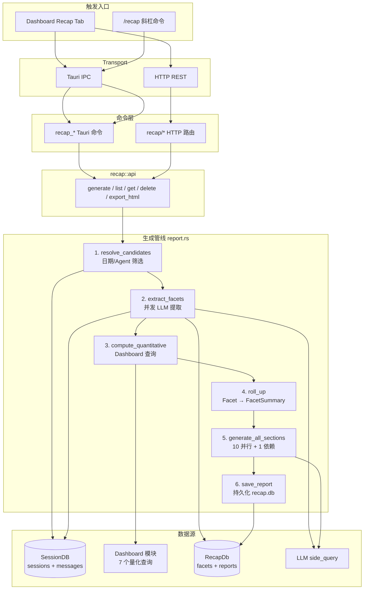
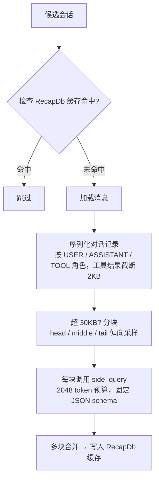
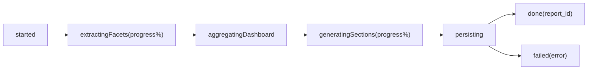

# Recap 深度复盘架构
> 返回 [文档索引](../README.md) | 更新时间：2026-04-16

## 概述

Recap 模块基于 `side_query` 对每个会话做 LLM 语义 facet 提取（目标/成果/摩擦/满意度），结合 Dashboard 量化查询生成 10 个并行 + 1 依赖（共 11 章节）的深度复盘报告。Facet 与完整报告缓存到独立 `~/.hope-agent/recap/recap.db`（按 `last_message_ts` 失效），避免与热路径 session DB 锁争用。

核心设计原则：
- **语义 + 量化双线融合**：LLM 逐会话提取定性 facet，Dashboard 提供定量 KPI，两者汇聚形成完整报告
- **缓存优先**：按 (session_id, last_message_ts, analysis_model, schema_version) 缓存 facet，会话未更新不重复提取
- **并行生成**：10 个 AI 章节并行调用 LLM，at_a_glance 依赖其余章节最后执行
- **模型解耦**：分析模型经 `config.recap.modelOverride`（`ModelChain`，deprecated `analysisAgent` 惰性兼容）→ `function_models.automation` 全局默认链解析，与主对话 Agent 独立配置，详见 [模型 vs Agent 统一配置](automation-model.md)

## 模块结构

```
crates/ha-core/src/recap/
├── mod.rs          # 模块入口，facet retention 生命周期
├── types.rs        # 类型定义与 JSON schema
├── db.rs           # SQLite 持久化（session_facets, recap_reports）
├── facets.rs       # 逐会话 LLM facet 提取
├── aggregate.rs    # Facet 汇总统计（直方图/Top-N）
├── sections.rs     # 10+1 个 AI 报告章节生成
├── report.rs       # 报告生成编排
├── renderer.rs     # HTML 导出（inline CSS，零 JS 依赖）
└── api.rs          # 命令 API（Tauri/HTTP 共享）
```

## 数据流



## 核心类型

### GenerateMode

```rust
enum GenerateMode {
    Incremental,                        // 从上次报告 range_end 开始
    Full { filters: DashboardFilter },  // 完整筛选（日期/Agent/Provider/Model）
}
```

Incremental 模式自动以上一份报告的 `range_end` 为起点；无历史报告时回退 `default_range_days`（默认 30 天）。

### SessionFacet

逐会话 LLM 提取结果：

| 字段 | 类型 | 说明 |
|------|------|------|
| `session_id` | `String` | 会话 ID |
| `underlying_goal` | `String` | 用户底层目标 |
| `goal_categories` | `Vec<String>` | 目标分类标签 |
| `outcome` | `Outcome` | fully_achieved / mostly_achieved / partial / failed / unclear |
| `user_satisfaction` | `Option<u8>` | 用户满意度 1–5 |
| `agent_helpfulness` | `Option<u8>` | Agent 帮助度 1–5 |
| `session_type` | `String` | 编码/调试/架构/配置等 |
| `friction_counts` | `FrictionCounts` | 6 维摩擦计数 |
| `friction_detail` | `Vec<String>` | 摩擦点明细 |
| `primary_success` | `Option<String>` | 亮点摘要 |
| `brief_summary` | `String` | 会话简要摘要 |
| `user_instructions` | `Vec<String>` | 用户反复提及的指令 |

### FrictionCounts

6 维摩擦分类：

| 字段 | 说明 |
|------|------|
| `tool_errors` | 工具执行失败 |
| `misunderstanding` | 模型误解意图 |
| `repetition` | 重复操作 |
| `user_correction` | 用户纠正 |
| `stuck` | 模型卡住 |
| `other` | 其他 |

### RecapReport

完整报告结构：

| 字段 | 类型 | 说明 |
|------|------|------|
| `meta` | `ReportMeta` | 报告 ID、标题、时间范围、筛选条件、会话数、模型 |
| `quantitative` | `QuantitativeStats` | Dashboard 7 项量化指标 |
| `facet_summary` | `FacetSummary` | Facet 汇总直方图 |
| `sections` | `Vec<AiSection>` | 11 个 AI 生成章节 |

### RecapProgress

EventBus 流式进度事件，前端实时展示：

| Phase | 说明 |
|-------|------|
| `started` | 报告生成开始 |
| `extractingFacets` | Facet 提取中（含进度百分比） |
| `aggregatingDashboard` | Dashboard 量化查询中 |
| `generatingSections` | AI 章节生成中（含进度百分比） |
| `persisting` | 持久化到 recap.db |
| `done` | 完成，携带 report_id |
| `failed` | 失败，携带错误信息 |

## Facet 提取管线

### 候选会话筛选（resolve_candidates）

1. 从 SessionDB 按日期范围和筛选条件查询会话列表
2. 排除消息数 < 2 的会话
3. 上限 `max_sessions_per_report`（默认 500）

### 提取流程



并发度由 `facet_concurrency` 控制（默认 4），使用 `buffer_unordered()` 限流。

### 缓存策略

缓存键：`(session_id, language, last_message_ts, analysis_model, schema_version)`

- 会话新增消息 → `last_message_ts` 变化 → 缓存失效，重新提取
- 切换分析模型 → `analysis_model` 变化 → 重新提取
- 切换输出语言 → `language` 变化 → 该语言独立缓存（facet 自然语言字段按语言提取，互不覆盖）
- 升级 schema → `schema_version` 变化 → 重新提取
- 保留期：`cache_retention_days`（默认 180 天），后台任务启动时 + 每 24h 清理过期 facet

## Facet 汇总（aggregate）

将 `Vec<SessionFacet>` 汇聚为 `FacetSummary`：

| 维度 | 输出 |
|------|------|
| 目标分类 | Top 8 目标直方图 |
| 成果分布 | 5 级 Outcome 计数 |
| 会话类型 | 类型分布直方图 |
| 摩擦来源 | Top 8 摩擦类别 |
| 满意度 | 1–5 评分桶 |
| 重复指令 | 出现 ≥ 2 次的指令 Top 8 |
| 亮点/摩擦示例 | 各最多 12 条 |

## AI 章节生成（sections）

### 11 个章节

| 序号 | key | 说明 | Token 预算 |
|------|-----|------|-----------|
| 1 | `project_areas` | Top 3–5 项目领域及会话占比 | 1500 |
| 2 | `interaction_style` | 用户交互风格（节奏/自主度/模式） | 1500 |
| 3 | `what_works` | 3 个出色的工作流/成果 | 1500 |
| 4 | `friction_analysis` | 3 类摩擦点及示例 | 1500 |
| 5 | `agent_tool_optimization` | Agent/工具配置建议（2–4 条） | 1500 |
| 6 | `memory_skill_recommendations` | 记忆条目 + 技能推荐 | 1500 |
| 7 | `cost_optimization` | 成本优化策略 | 1500 |
| 8 | `suggestions` | 推荐尝试的 Hope Agent 功能 | 1500 |
| 9 | `on_the_horizon` | 未来可探索的高阶工作流 | 1500 |
| 10 | `fun_ending` | 回忆亮点（含 1 个 emoji） | 1500 |
| 11 | `at_a_glance` | 总结概览（依赖前 10 章输出） | 1200 |

执行顺序：1–10 并行 → 11 串行（需前 10 章摘要作为输入）。

每个章节的 LLM 上下文包含 facet 汇总统计 + Dashboard 量化数据的 JSON 摘要。

## 量化数据（QuantitativeStats）

通过 Dashboard 模块获取 7 项指标：

| 查询 | 数据 |
|------|------|
| `query_overview_with_delta` | 同环比 KPI（会话/消息/工具调用/错误/成本/Token） |
| `query_health_score` | 四维加权健康度 0–100 |
| `query_cost_trend` | 日度费用累计 + 峰值/日均 |
| `query_activity_heatmap` | 7×24 活跃度网格 |
| `query_hourly_distribution` | 0–23 时消息分布 + 峰值时段 |
| `query_top_sessions` | 按 Token 消耗的 Top N 会话 |
| `query_model_efficiency` | 每模型 tokens/msg、cost/1k、TTFT |

## 持久化（db）

### 数据库

独立文件 `~/.hope-agent/recap/recap.db`，与 session DB 隔离避免锁争用。

### 表结构

**session_facets**

| 列 | 类型 | 说明 |
|------|------|------|
| `session_id` | TEXT | 会话 ID（与 `language` 组成复合主键） |
| `language` | TEXT | 输出语言 code（复合主键；空 = 旧缓存） |
| `last_message_ts` | TEXT | 最后消息时间戳（缓存键） |
| `message_count` | INTEGER | 消息数 |
| `analysis_model` | TEXT | 分析模型（缓存键） |
| `facet_json` | TEXT | SessionFacet JSON |
| `created_at` | TEXT | 创建时间 |
| `schema_version` | INTEGER | Schema 版本（当前 v1） |

主键：`(session_id, language)`；索引：`idx_facets_ts` (last_message_ts)。升级到本结构时缺 `language` 列的旧表直接 drop 重建（纯可重建缓存，不迁移）。`get_latest_facet`（awareness 用）按 `last_message_ts DESC, created_at DESC` 取最近一行，保证多语言行下选择确定

**recap_reports**

| 列 | 类型 | 说明 |
|------|------|------|
| `id` | TEXT PK | 报告 ID |
| `title` | TEXT | 报告标题 |
| `range_start` / `range_end` | TEXT | 时间范围 |
| `filters_json` | TEXT | 筛选条件 JSON |
| `report_json` | TEXT | 完整 RecapReport JSON |
| `html_path` | TEXT | 导出 HTML 路径 |
| `session_count` | INTEGER | 涵盖会话数 |
| `generated_at` | TEXT | 生成时间 |
| `analysis_model` | TEXT | 分析模型 |

索引：`idx_reports_generated` (generated_at DESC)

### 保留期清理

后台任务（启动 + 每 24h）按 `cache_retention_days`（默认 180 天）清理过期 facet。`cache_retention_days = 0` 禁用清理。

## API

### 命令（recap::api）

所有命令由 Tauri 和 HTTP 共享：

| 函数 | 说明 |
|------|------|
| `generate(mode)` | 生成报告，异步流式推送进度事件 |
| `list_reports(limit)` | 列出报告摘要（默认 50） |
| `get_report(id)` | 获取完整报告 |
| `delete_report(id)` | 删除报告 |
| `export_html(id, output_path?)` | 导出独立 HTML 文件 |

### Tauri 命令

| 命令 | 参数 |
|------|------|
| `recap_generate` | `mode: GenerateMode` |
| `recap_list_reports` | `limit: Option<u32>` |
| `recap_get_report` | `id: String` |
| `recap_delete_report` | `id: String` |
| `recap_export_html` | `id: String, output_path: Option<String>` |

### HTTP 路由

| 方法 | 路径 | 说明 |
|------|------|------|
| POST | `/api/recap/generate` | 生成报告 |
| POST | `/api/recap/reports` | 列出报告（body: `{ limit }`) |
| GET | `/api/recap/reports/{id}` | 获取报告 |
| DELETE | `/api/recap/reports/{id}` | 删除报告 |
| POST | `/api/recap/reports/{id}/export` | 导出 HTML（body: `{ output_path }`) |

### 配置路由

| 方法 | 路径 | 说明 |
|------|------|------|
| GET | `/api/config/recap` | 读取 Recap 配置 |
| PUT | `/api/config/recap` | 保存 Recap 配置 |

## 配置

`config.json` → `recap` 字段：

```rust
pub struct RecapConfig {
    pub analysis_agent: Option<String>,  // deprecated——见下方解析优先级
    pub model_override: Option<ModelChain>,  // 分析模型链覆盖（新）
    pub language: Option<String>,        // 输出语言（None/"auto" = 跟随界面语言）
    pub default_range_days: u32,         // 无历史报告时的默认范围（默认 30）
    pub max_sessions_per_report: u32,    // 单次报告最大会话数（默认 500）
    pub facet_concurrency: u8,           // Facet 提取并发度（默认 4）
    pub cache_retention_days: u32,       // 缓存保留天数（默认 180，0 = 禁用清理）
}
```

分析模型解析优先级（`resolve_recap_chain`，报告开始时解析一次）：`config.recap.modelOverride`（`ModelChain`）> deprecated `config.recap.analysisAgent`（惰性解析成等价 `ModelChain`——读该 Agent 的 `model.primary`/`fallbacks`，逻辑不变）> `function_models.automation` 全局默认链 > 聊天全局 `active_model`/`fallback_models`。解析结果是 `Arc<Vec<ActiveModel>>`，贯穿本次报告的每个独立 LLM 调用（facet 提取 + 章节生成），每个调用各自经 `crate::automation::run` 走真跨模型降级（构造失败/调用失败均 continue 下一候选），不再共享单个 Agent 的失败状态。详见 [模型 vs Agent 统一配置](automation-model.md)。

### 输出语言（i18n）

输出语言由 [`recap::i18n::effective_recap_locale`](../../crates/ha-core/src/recap/i18n.rs) 解析，优先级 `config.recap.language`（显式）> `AppConfig.language`（界面语言）> 系统 locale（`agent_loader::detect_system_locale`）；空 / `"auto"` 逐级回落，结果经**大小写不敏感**归一化到支持的 12 种语言，不支持则落英文（避免发出自相矛盾的「用英文写」指令）。

该 locale 一路透传：

- **facet 提取**（`facet_language_directive`）：自然语言字段用目标语言，`outcome`/`sessionType`/`goalCategories` 等枚举与 JSON key 保持英文以稳住聚合直方图。
- **章节生成**（`section_language_directive`）：正文 / 标题 / 列表标签用目标语言，代码标识符 / 模型名 / 路径 / 斜杠命令保持原样。
- **章节标题 / 报告名**（`localized_section_title` / `report_title`）：后端 12 语言表，写入持久化报告作为**语言快照**（旧报告不回溯改写）。`SUPPORTED_LOCALES` 是列序单一真相源，`locale_index` 与标题列表对齐，单测锚定每列防错位。

设置入口：「设置 → 复盘」语言选择器（GUI）+ `ha-settings` 的 `recap.language`（默认跟随界面）。

## HTML 导出（renderer）

生成自包含 HTML 文件，零外部依赖：

- **双主题**：Dark/Light mode 通过 CSS 变量切换
- **KPI 网格**：sessions / messages / tool_calls / errors / cost / tokens / TTFT
- **健康度**：分数 + 状态徽章 + 柱状图
- **AI 章节**：内置极简 Markdown 渲染（粗体/斜体/行内代码/列表/标题）
- **Facet 分布**：目标直方图 / Outcome 分布 / 摩擦分布柱状图
- **活跃热力图**：7×24 网格，颜色深浅映射活跃度
- **文档语言**：`<html lang>` 跟随报告 locale，阿拉伯语补 `dir="rtl"`；方向相关样式用 logical property（`padding-inline-*` / `text-align:end`）。固定 chrome 文案（Generated / Sessions 等）暂仍英文

输出约 8KB 基础 + 内容，内联全部 CSS 和 SVG，可直接分享。

## 前端集成

### RecapTab（src/components/dashboard/recap/RecapTab.tsx）

Dashboard 默认 Tab 之一，提供：

- **报告历史**：下拉选择器加载历史报告（最多 50 份）
- **生成控制**：Incremental / 7d / 30d / 90d 范围选择
- **实时进度**：监听 `recap_progress` EventBus 事件，展示阶段名 + 进度条
- **报告渲染**：KPI 网格 + 健康度 + AI 章节（Markdown）+ Facet 分布图
- **导出/删除**：HTML 导出、确认删除

### 事件流

前端通过 Transport 层（Tauri Channel / WebSocket）订阅 `recap_progress` 事件：



## 触发方式

| 方式 | 入口 | 模式 |
|------|------|------|
| Dashboard UI | Recap Tab 按钮 | Incremental 或 Full（按日期范围） |
| 斜杠命令 | `/recap` | Incremental（默认）/ `--range=7d` / `--full` |
| HTML 导出 | `recap_export_html` / `POST /api/recap/reports/{id}/export` | 基于已有报告 |

## 已知限制

- Cron 定时自动生成尚未接入
- `hope-agent recap --export` CLI 子命令尚未实现
- HTML 导出的 Markdown 渲染器为极简实现（不支持表格、引用块等）
- 单次报告最多 500 个会话（可配置）
