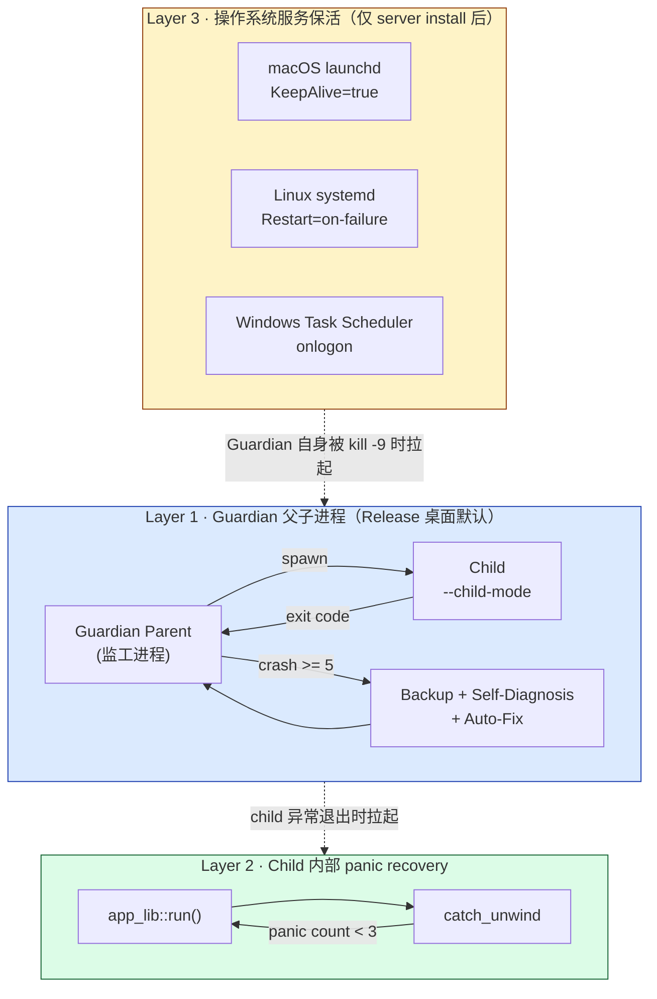
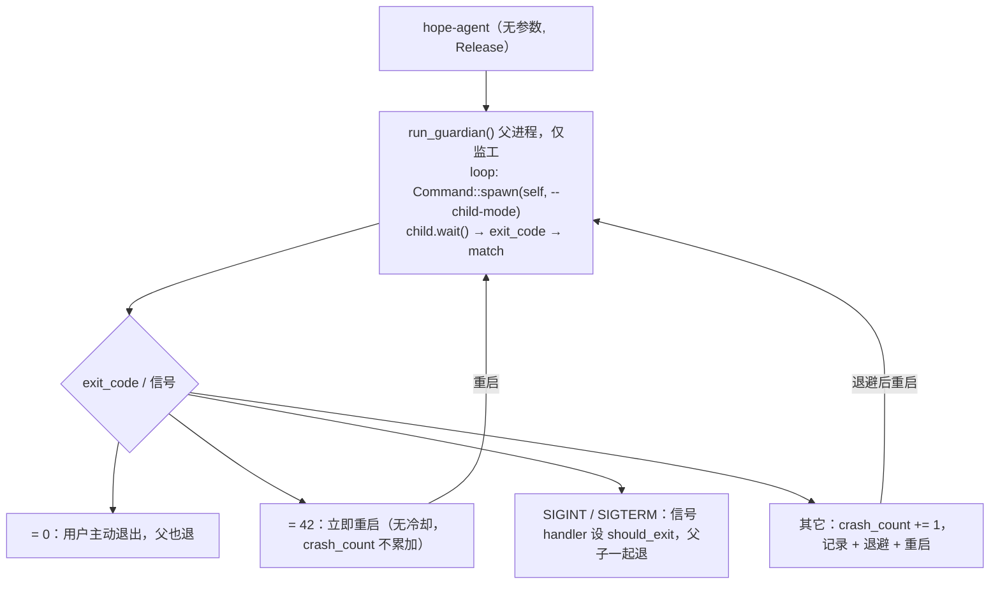
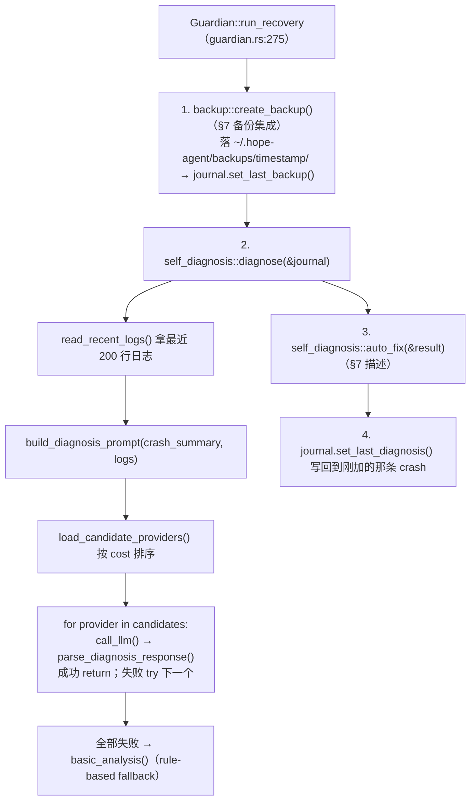

# 可靠性与崩溃自愈

> 返回 [文档索引](../README.md) | 更新时间：2026-04-27 | 关联源码：[`guardian.rs`](../../crates/ha-core/src/guardian.rs)、[`crash_journal.rs`](../../crates/ha-core/src/crash_journal.rs)、[`self_diagnosis.rs`](../../crates/ha-core/src/self_diagnosis.rs)、[`backup.rs`](../../crates/ha-core/src/backup.rs)、[`service_install.rs`](../../crates/ha-core/src/service_install.rs)、[`src-tauri/src/main.rs`](../../src-tauri/src/main.rs)

## 概述

Hope Agent 把"7×24 不掉线"拆成**三层保活 + 一套崩溃自诊断**，互相之间是**冗余而非串联**：任何一层挂了下一层都接得住。设计动机是普通用户场景（NAS、家用服务器、IM bot 长跑），不是只盯 happy path 就走人——所以崩溃次数到阈值会自动跑配置备份 + LLM 诊断 + 安全 auto-fix，而不是单纯指数退避无限重启。

本文聚焦**这条主线**——Guardian 父子进程协议、退出码语义、Crash Journal 数据结构、Self-Diagnosis prompt 与 fallback、Auto-Fix 覆盖范围、系统服务 KeepAlive、子系统级 watchdog。所有并发模型、Primary/Secondary 选举、跨模式后台任务差异在 [process-model.md](process-model.md) 和 [backend-separation.md](backend-separation.md) 已有完整描述，本文只在交叉引用，不复述。

---

## 1. 三层保活总览



| 层级 | 触发条件 | 看护谁 | 响应延迟 | 适用模式 |
|------|----------|--------|----------|----------|
| **L1 · Guardian 父子** | Child 非 0 / 非 42 退出 | Tauri GUI Child | 1s → 3s → 9s → 15s → 30s 指数退避 | 桌面 Release（`config.guardian.enabled=true`，默认开） |
| **L2 · Child panic recovery** | Tauri main 内 Rust panic | `app_lib::run()` | 1s 固定 | 桌面所有构建（含 Dev） |
| **L3 · 操作系统服务保活** | Guardian 自身或 server 进程消失 | 整个 hope-agent 进程组 | OS 决定（launchd 即时；systemd `RestartSec=3`） | `hope-agent server install` 之后 |

**互斥规则**：`hope-agent server` 已经被 launchd / systemd 守护，**不要再给 server 套 Guardian**，两层重启语义会打架（详见 [process-model.md §Guardian 父子模式](process-model.md#guardian-父子模式release-gui)）。`hope-agent acp` 由 IDE 控制生命周期，也绕开 Guardian。

---

## 2. Layer 1 · Guardian 父子进程

### 2.1 启动模型

[`src-tauri/src/main.rs`](../../src-tauri/src/main.rs) 按 argv 分派——Release 桌面无参数启动时进入 `run_guardian()`：父进程 fork 一份自己加 `--child-mode` 作为 child 跑 Tauri GUI，自己只做监工。`HOPE_AGENT_CHILD=1` 环境变量是历史兼容入口，与 `--child-mode` 等价。



**跳过 Guardian 的三种情形**（[`main.rs:36-47`](../../src-tauri/src/main.rs#L36-L47)）：

1. argv 第二位是 `--child-mode` 或环境变量 `HOPE_AGENT_CHILD` 已设置——已经是 child，直接跑 `run_child()`
2. Debug 构建（`cfg!(debug_assertions) == true`）——开发期跳过，省得 IDE 断点调试时父子来回 spawn
3. `config.guardian.enabled = false`——用户在「设置 → 崩溃历史」里手动关闭

### 2.2 退出码协议

Child 通过退出码向 Guardian 传递语义。这是父子之间唯一的信道（除了信号），扩充协议要谨慎。

| 退出码 | 来源 | Guardian 响应 |
|--------|------|---------------|
| `0` | Tauri 正常 quit / 用户菜单退出 | 父进程也退，`crash_count` 不变 |
| `42` (`EXIT_CODE_RESTART`) | Child 主动 `std::process::exit(42)`——典型场景：Self-Diagnosis 跑完 auto-fix 想立即重启、`/restart` 命令、热配置切换 | 立即重启，`crash_count` 清零、`last_crash_time` 清空 |
| 其它非零 | crash / 内部 abort / 非捕获 panic 透出 | 计数 +1，记 crash journal，达阈值跑诊断，指数退避后重启 |
| 信号导致退出（exit_code = 128 + N，Unix） | OS 杀进程（SIGSEGV / SIGKILL / SIGABRT 等） | 同"其它非零"——但崩溃日志额外记 `signal` 字段（见 [§4.3 信号映射](#43-信号映射)） |

**退出码的"哑死区"**：Rust `std::process::exit(N)` 在 Unix 把 N 截到低 8 位（exit status 是 `u8`）。因此 `exit(256)` 实际等于 `exit(0)`，`exit(298)` 等于 `exit(42)`——Guardian 会把 `298` 误判成"请求重启"。当前代码不主动构造大数字 exit code，但要记得这个限制：**不要让业务路径用 ≥ 256 或 ≤ 0 的 exit code**。

### 2.3 信号处理

Unix 和 Windows 路径不同，因为 Windows 没有 POSIX 信号。

**Unix**（[`guardian.rs:96-102`](../../crates/ha-core/src/guardian.rs#L96-L102)）：
```rust
signal_hook::flag::register(SIGTERM, exit_flag.clone());
signal_hook::flag::register(SIGINT,  exit_flag);
```
信号到来时设 `should_exit: AtomicBool`，主循环每次 loop 顶部 + `child.wait()` 回来后都检查；命中即 `std::process::exit(0)`，不再 spawn 新 child。

**Windows**（[`guardian.rs:109-136`](../../crates/ha-core/src/guardian.rs#L109-L136)）：起一条迷你线程跑 `current_thread` tokio runtime 接 `tokio::signal::windows::ctrl_c()` + `ctrl_break()`，捕获后同样设 `should_exit`。这覆盖两个场景：
- 交互式 shell 里 `Ctrl+C` → 走 `ctrl_c`
- `sc stop` / Windows Service Control Manager 关停 → 给进程组发 `CTRL_BREAK_EVENT`

> 没用 `signal-hook` 的 Unix 实现是因为它依赖 POSIX 抽象，Windows 上要么没接、要么语义不一致。Tokio 的 windows signal 是当前 Rust 生态里最稳的方案。

### 2.4 退避与放弃

`GuardianConfig`（[`guardian.rs:53-73`](../../crates/ha-core/src/guardian.rs#L53-L73)）的默认值——目前没有 GUI 入口暴露调参，纯代码常量：

| 字段 | 默认 | 含义 |
|------|------|------|
| `max_crashes` | `8` | 连续崩溃达此值整体放弃，父进程 `exit(1)` |
| `diagnosis_threshold` | `5` | 第 5 次崩溃**当次**触发备份 + Self-Diagnosis（不是"达到 5 次后每次都跑"——见下） |
| `crash_window_secs` | `600` | 距上次崩溃超过 10 分钟无新崩溃，`crash_count` 清零（窗口期外的"上次崩"不算入这一轮） |
| `backoff_delays` | `[1, 3, 9, 15, 30]` | 第 N 次崩溃延迟 `backoff_delays[N-1]` 秒后重启；下标超界时 clamp 到末位（30s） |

**诊断只跑一次**：判断条件是 `crash_count == diagnosis_threshold`，不是 `>=`。第 6、7 次崩溃直接退避重启，不会重复跑诊断浪费 LLM 调用——除非崩溃窗口超时清零计数后再次累积到 5。

**计数清零路径**：
- `crash_window_secs` 内无新崩溃 → 主循环顶部清零（[`guardian.rs:160-165`](../../crates/ha-core/src/guardian.rs#L160-L165)）
- `exit(42)` → 立即重启时清零

### 2.5 恢复标记传递

崩溃恢复重启时，父进程在 spawn child 前通过环境变量传递两个标记（[`guardian.rs:172-175`](../../crates/ha-core/src/guardian.rs#L172-L175)）：

| 环境变量 | 含义 |
|----------|------|
| `HOPE_AGENT_RECOVERED=1` | 这次启动是从崩溃中恢复的（不是首次启动也不是用户重启） |
| `HOPE_AGENT_CRASH_COUNT=N` | 当前是 Guardian 已经记录的第几次连续崩溃 |

Child 用 `get_crash_recovery_info` 命令读这两个变量回显给前端，UI 可据此弹"上次异常退出，已恢复"banner。这条路径同时对 Tauri ([`crash.rs:7-31`](../../src-tauri/src/commands/crash.rs#L7))) 和 HTTP ([`routes/crash.rs:9-32`](../../crates/ha-server/src/routes/crash.rs#L9))) 暴露。

---

## 3. Layer 2 · Child panic recovery

Guardian 解决"子进程异常退出"。但有些 panic 在 Tauri 内部能被 `catch_unwind` 兜住——比如某条 IPC 命令处理函数 panic 但运行时状态还是干净的——这时就近重试比让父进程重启全部 OnceLock + 重新初始化所有 DB 划算。

`run_child()`（[`main.rs:85-126`](../../src-tauri/src/main.rs#L85-L126)）：

```rust
fn run_child() {
    let mut crash_count: u32 = 0;
    loop {
        let result = std::panic::catch_unwind(|| {
            app_lib::run();      // Tauri Builder + .run()
        });
        match result {
            Ok(_) => std::process::exit(0),       // 用户退出
            Err(panic_info) => {
                crash_count += 1;
                if crash_count >= MAX_CHILD_PANICS {  // 3
                    std::process::exit(1);            // 升级到 Guardian
                }
                std::thread::sleep(Duration::from_secs(1));
                // 重新进入 loop, 再 app_lib::run()
            }
        }
    }
}
```

| 参数 | 值 | 来源 |
|------|---|------|
| `MAX_CHILD_PANICS` | `3` | [`main.rs:9`](../../src-tauri/src/main.rs#L9) |
| 重启间隔 | 1 秒固定（不退避） | 假设 panic 恢复期短，无需指数退避 |

**触达条件相当窄**——`catch_unwind` 只能捕 unwinding panic，碰到 abort（`panic = "abort"` 或 `[profile.*.panic = "abort"]`）会直接被 OS 收尾，跳过 L2 直奔 L1。Hope Agent 当前用默认 `panic = "unwind"`，所以 L2 在大多数场景生效。

**与 Layer 1 的关系**：L2 的 `MAX_CHILD_PANICS` 失败后 child `exit(1)`——就到了 Guardian 的"非 0 非 42 退出"分支，crash_count 累积。L1 和 L2 是串联兜底，不是平行：L2 先吃 panic，吃饱了才升级到 L1。

---

## 4. Layer 3 · 操作系统服务保活

`hope-agent server install` 把进程登记给操作系统的服务管理器，让 OS 帮忙拉起。这层和 Guardian 是冗余的——即使 Guardian 自己被 `kill -9` 或机器重启后没启动，OS 仍会按规则拉起 server。源码在 [`service_install.rs`](../../crates/ha-core/src/service_install.rs)。

### 4.1 macOS · launchd LaunchAgent

写 plist 到 `~/Library/LaunchAgents/ai.hopeagent.server.plist`，关键键值：

| Key | Value | 含义 |
|-----|-------|------|
| `Label` | `ai.hopeagent.server` | 服务标识，`launchctl` 操作通过它定位 |
| `ProgramArguments` | `[exe_path, "server", "--bind", addr, ("--api-key", key)?]` | 启动命令；XML escape 防注入（[`service_install.rs:16-29`](../../crates/ha-core/src/service_install.rs#L16-L29)） |
| `KeepAlive` | `true` | **进程消失自动拉起**——这是核心保活键 |
| `RunAtLoad` | `true` | 开机自动启动（用户登录后 LaunchAgent domain 加载） |
| `StandardOutPath` / `StandardErrorPath` | `~/.hope-agent/logs/server.{stdout,stderr}.log` | 标准流落盘，方便事后排查 |

**安装流程**：写 plist → `launchctl bootstrap gui/<uid> <plist>`（macOS 10.10+ API）→ `launchctl enable` → 状态查询走 `launchctl print`。**legacy 标签清理**：`com.hopeagent.server` 是早期标签，安装新版会先 unload 老 plist 防"两个 LaunchAgent 抢同一端口"。

### 4.2 Linux · systemd user unit

写 unit 到 `~/.config/systemd/user/hope-agent.service`：

```ini
[Unit]
Description=Hope Agent Server
After=network.target

[Service]
ExecStart="/path/to/hope-agent" "server" "--bind" "127.0.0.1:8420"
Restart=on-failure
RestartSec=3
StandardOutput=append:/home/.../logs/server.stdout.log
StandardError=append:/home/.../logs/server.stderr.log

[Install]
WantedBy=default.target
```

| 键值 | 含义 |
|------|------|
| `Restart=on-failure` | 仅在非零 exit 或被信号杀时重启；`exit(0)` 不重启 |
| `RestartSec=3` | 重启延迟 3 秒，避免崩溃循环打满 CPU |
| `WantedBy=default.target` | `systemctl --user enable` 后随用户会话启动 |

**ExecStart 转义** ([`service_install.rs:38-54`](../../crates/ha-core/src/service_install.rs#L38-L54))：路径和 api_key 都走 `systemd_escape_arg`——双引号 + 反斜杠转义 + `$` → `$$`，防止 systemd 的 `$VAR` / `${VAR}` 展开把环境变量值塞进命令行。

**用户级而不是系统级**：`systemctl --user` 不需要 root，跟着用户会话起停。代价是机器重启后必须有用户登录才会拉起；要"机器开机即起"得另外配 `loginctl enable-linger <user>`，本文档暂不展开。

### 4.3 Windows · Task Scheduler

不是真正的 Windows Service。Windows Service 需要在二进制里实现 SCM 协议（`StartServiceCtrlDispatcher`），Hope Agent 当前没做这部分。`server install` 在 Windows 上走 `schtasks /create /sc onlogon`：用户登录时拉起进程，崩溃后**不会**自动重启（Task Scheduler 本身没有等价 `KeepAlive` 的开关）。

完整 Windows 部署细节见 [`docs/platform/windows-development.md`](../platform/windows-development.md)。

### 4.4 与 Guardian 的边界

| 部署形态 | L1 Guardian | L3 OS 服务 | 备注 |
|----------|:-----------:|:---------:|------|
| 桌面 GUI 直接打开 | ✓ | ✗ | 父子 + L2 兜底 |
| `hope-agent server start`（前台） | ✗ | ✗ | 用户手动启动，崩了不会自动拉起 |
| `hope-agent server install` 后由 OS 拉起 | ✗ | ✓ | launchd / systemd 接手，**绝对不要再叠 Guardian** |
| 同一台机器：桌面 + 已安装 server | ✓（仅桌面 child） | ✓（仅 server） | 两条独立链路 + Primary/Secondary 选举 |

---

## 5. Crash Journal

崩溃归档落 `~/.hope-agent/crash_journal.json`，**Guardian 父进程负责写**——child 已经死了写不了，必须由还活着的父进程负责落盘。诊断结果由父进程在 backup + diagnosis 完成后回写到"最新一条"上。

### 5.1 文件 schema

源类型在 [`crash_journal.rs`](../../crates/ha-core/src/crash_journal.rs)：

```jsonc
{
  "crashes": [
    {
      "timestamp": "2026-04-25T13:42:11.523Z",   // RFC 3339 UTC
      "exit_code": 139,                            // 原始 exit code（可能是 128+signal）
      "signal": "SIGSEGV",                         // Unix 推断；Windows / 普通退出码为 null
      "crash_count_session": 3,                    // 本轮 Guardian 累积的连续崩溃次数
      "diagnosis_run": true,                       // 这次崩溃是否触发了 self-diagnosis
      "diagnosis_result": {
        "cause": "SIGSEGV in libsqlite3",
        "severity": "critical",                    // low | medium | high | critical | unknown
        "user_actionable": false,
        "recommendations": ["..."],
        "auto_fix_applied": ["Reset compact config to defaults"],
        "provider_used": "Anthropic"               // null = fallback basic_analysis
      }
    }
  ],
  "total_crashes": 47,                             // 累计计数（不会因 trim 减少）
  "last_backup": "2026-04-25T13:42:14.812Z"        // 最近一次 self-diagnosis 触发的备份时间
}
```

| 不变量 | 实现位置 |
|--------|----------|
| `crashes.length <= 50`（`MAX_ENTRIES`），溢出从头部 drain | [`crash_journal.rs:4`](../../crates/ha-core/src/crash_journal.rs#L4) + [`add_crash`](../../crates/ha-core/src/crash_journal.rs#L99) |
| `total_crashes` 单调递增，**不**因为 trim 减少 | [`add_crash:109`](../../crates/ha-core/src/crash_journal.rs#L109) |
| 文件读不到 / 解析失败 → 返回空 journal，不报错（[`load:82-87`](../../crates/ha-core/src/crash_journal.rs#L82-L87)） | 防"日志文件本身坏掉拖死 Guardian 主循环" |
| `diagnosis_result` 总是写到**最后一条** crash 上 | [`set_last_diagnosis`](../../crates/ha-core/src/crash_journal.rs#L119) |

### 5.2 读写路径

| 时机 | 谁 | 操作 |
|------|---|------|
| Child 异常退出，crash_count += 1 | Guardian 父进程 | `journal.add_crash(exit_code, crash_count)` → save |
| crash_count == 5（默认 threshold） | Guardian 父进程 | 跑 `run_recovery`，写 `last_backup` + `set_last_diagnosis` |
| 用户在「设置 → 崩溃历史」查看 | Tauri / HTTP 命令 | `get_crash_history` 读全文返回 |
| 用户点"清空" | 同上 | `clear_crash_history` → `journal.clear()`（保留文件，重置 `crashes` + `total_crashes`） |
| Child 启动后想知道"是否刚从崩溃中恢复" | Tauri / HTTP 命令 | `get_crash_recovery_info` 读 `HOPE_AGENT_RECOVERED` env + journal 末条 diagnosis |

### 5.3 信号映射

Unix 上 `wait()` 拿到的 exit code 是 `128 + signal_number`（如 `139 = 128 + 11 = SIGSEGV`）。`signal_name_from_exit_code`（[`crash_journal.rs:44-68`](../../crates/ha-core/src/crash_journal.rs#L44-L68)）维护小型映射，落盘时把人类可读的信号名一起记下：

| exit_code | signal | 含义 |
|-----------|--------|------|
| 130 | SIGINT | Ctrl+C 退出（一般不会进崩溃路径，因为父进程信号 handler 先消化） |
| 134 | SIGABRT | `abort()` / Rust panic with `panic = "abort"` / glibc detect heap corruption |
| 137 | SIGKILL | 被 `kill -9` 或 OOM killer 杀掉（无 graceful 机会） |
| 139 | SIGSEGV | 段错误——通常是 unsafe 代码或 native 库 bug |
| 143 | SIGTERM | 普通终止信号 |

未列出的 signal_number 落盘为 `"SIG{n}"`（如 `SIG31`）。`exit_code <= 128` 时 `signal` 字段为 `null`。

**Windows**：`signal_name_from_exit_code` 简单返回 `None`——Windows 没有 POSIX 信号语义，崩溃通常以 NTSTATUS 透出（如 `0xC0000005` access violation）但 `wait()` 取到的是低 32 位整数。这块当前不做映射，UI 只显示原始 exit_code。

### 5.4 容量与隐私

- **50 条上限是硬编码**：没必要让用户调，默认就够追溯近期崩溃趋势
- **`total_crashes` 永远递增**：可作"软指标"判断这台机器是否长期不稳——50 条窗口看不出"是否经常崩"
- **不含敏感数据**：journal 只存 exit code / signal / 时间戳 / LLM 诊断结论；recommendation 文本由 LLM 生成，理论上不会回填日志原文，但要意识到 LLM 可能把日志片段引用进 cause 字段（见 [§6.2 Prompt 模板](#62-prompt-模板)）

---

## 6. Self-Diagnosis

第 5 次连续崩溃（`diagnosis_threshold`）触发。**仅这一次**——后续崩溃只走退避重启，不重复跑诊断浪费 LLM 配额。源码在 [`self_diagnosis.rs`](../../crates/ha-core/src/self_diagnosis.rs)。

### 6.1 调用链



整个流程**同步阻塞**——Guardian 在 `run_recovery` 里 block 30 秒（每个 provider 30s timeout，逐个尝试）。这段时间 child 不重启，等诊断给出结果。

### 6.2 Prompt 模板

LLM 拿到的输入 ([`self_diagnosis.rs:405-432`](../../crates/ha-core/src/self_diagnosis.rs#L405-L432))：

````
You are diagnosing why the Hope Agent desktop app (Tauri 2 + Rust + React) keeps crashing.

## Recent Crash History
Total crashes recorded: 7
- 2026-04-25T13:42:11Z | exit_code=139 | signal=SIGSEGV | session_crash_count=1
- 2026-04-25T13:43:12Z | exit_code=139 | signal=SIGSEGV | session_crash_count=2
- ...（最多最近 10 条）

## Recent Log Output (last lines before crash)
```
（最近 200 行日志，从最新修改的 .log 文件取）
```

## Task
Analyze the crash patterns and logs. Identify:
1. The most likely root cause of the crashes
2. Whether this is a configuration issue, code bug, or system-level problem
3. Whether the user can fix this themselves

## Response Format
Respond ONLY with a JSON object (no markdown, no explanation outside JSON):
{
  "cause": "Brief description of the root cause",
  "severity": "low|medium|high|critical",
  "user_actionable": true/false,
  "recommendations": ["Action item 1", "Action item 2"]
}
````

**关键设计**：
- 不让 LLM 调工具——纯文本分析。原因：诊断时 LLM provider 凭据可能就是问题所在（API key 失效），不能假设工具栈完整可用
- `max_tokens=1024`，cost 受控
- Prompt 里把"recent logs"片段直接给 LLM——这是为什么 §5.4 说"理论上不会回填日志原文"是有保留的——LLM 可能引用片段作为 cause/recommendation 的支撑证据

### 6.3 Provider 选择

`load_candidate_providers`（[`self_diagnosis.rs:138-194`](../../crates/ha-core/src/self_diagnosis.rs#L138-L194)）：

1. 直接读 `~/.hope-agent/config.json` 解析 `providers` 数组——**绕过** `config::load_config()` 等高层 API。原因：诊断时整个进程可能就是 config schema 演进出问题，绕开能减少诊断本身崩溃的概率
2. 过滤条件：`enabled && !api_key.is_empty() && api_type != Codex && !models.is_empty()`
3. **Codex 不参与**：Codex 是 OAuth + token refresh，Guardian 的同步上下文跑 OAuth 流太复杂，且 token refresh 失败会引入更多变量
4. 按"模型最低 cost_input + cost_output"升序排——优先用最便宜的模型做诊断，省钱
5. 全部失败 → `basic_analysis()`（[§6.5](#65-basic_analysis-fallback)）

支持的 API 类型 ([`self_diagnosis.rs:216-222`](../../crates/ha-core/src/self_diagnosis.rs#L216-L222))：
- `Anthropic` → `/v1/messages`，`x-api-key` + `anthropic-version: 2023-06-01`
- `OpenaiChat` / `OpenaiResponses` → `/v1/chat/completions`，`Authorization: Bearer`
- `Codex` → 直接返回 Err，不发请求

### 6.4 响应解析

`parse_diagnosis_response`（[`self_diagnosis.rs:308-337`](../../crates/ha-core/src/self_diagnosis.rs#L308-L337)）允许 LLM 不严格守约：

- 找第一个 `{` 和最后一个 `}` 截取——容忍 markdown code fence 包裹（` ```json ... ``` `）
- `serde_json::from_str::<DiagnosisResult>()` 严格解析；命中即返回
- 解析失败 → 不报错，而是把 LLM 原始输出前 500 字符塞进 `cause`，`severity = "unknown"`，`user_actionable = false`，`recommendations = ["Review the full diagnosis output for details."]`

**容错而不是 retry**：LLM 偶尔不守 JSON 格式不是 Guardian 该解决的问题；返回"看起来不结构化但能给用户看"的 result 比反复 retry 更稳。

### 6.5 basic_analysis fallback

所有 LLM provider 都失败 / 没配置 / 全是 Codex → `basic_analysis()` 走规则匹配（[`self_diagnosis.rs:436-515`](../../crates/ha-core/src/self_diagnosis.rs#L436-L515)）：

| 模式 | 触发条件（最近 5 条 crash 中） | severity | recommendations |
|------|--------------------------------|----------|-----------------|
| Segfault | `exit_code == 139` 或 `signal == SIGSEGV` | critical | "likely code bug, update app, report issue" |
| OOM | `exit_code == 137` 或 `signal == SIGKILL` | high | "close other apps, check compaction settings" |
| Abort | `exit_code == 134` 或 `signal == SIGABRT` | high | "internal assertion failed, try resetting config" |
| 同 exit code 重复 | 5 条 exit code 全相同 | high | "check specific config / plugin causing it" |
| 其它（混合） | 上述都不命中 | medium | "intermittent, check system logs" |

`provider_used = None` 表示走的是 fallback 而非 LLM。前端可据此区分诊断质量。

---

## 7. Auto-Fix 与 Backup 集成

诊断给出 `cause` 字符串后，`auto_fix(&result)` 按 cause 关键词触发**安全的就地修复**（[`self_diagnosis.rs:44-132`](../../crates/ha-core/src/self_diagnosis.rs#L44-L132)）。"安全"的标准是：

1. **可逆**：每次写之前都已经在 backup 阶段落了快照
2. **幂等**：同一种损坏检测多次跑结果一致
3. **保守**：只动配置文件和明确损坏的本地 SQLite，**不**动会话、记忆、技能

### 7.1 当前覆盖的修复场景

| 触发条件 | 检测 | 动作 | 来源 |
|----------|------|------|------|
| `config.json` 损坏（任何 cause） | `serde_json::from_str(content).is_err()` | ① `try_restore_config_from_backup()` 用最新 `crash_journal` 阶段备份恢复；② 失败则重置为最小骨架 `{providers: [], activeModel: null, fallbackModels: []}` | [`self_diagnosis.rs:48-71`](../../crates/ha-core/src/self_diagnosis.rs#L48-L71) |
| cause 含 `"database"` / `"sqlite"` / `"SQLite"` | `PRAGMA integrity_check` ≠ `"ok"`，或 `Connection::open` 失败 | 删 `logs.db`（启动时会重建空表） | [`self_diagnosis.rs:73-108`](../../crates/ha-core/src/self_diagnosis.rs#L73-L108) |
| cause 含 `"context"` / `"compact"` / `"overflow"` | config.json 里有 `compact` 字段 | 把 `config.compact` 重置为 `{}`（让所有 compaction 参数走默认值） | [`self_diagnosis.rs:110-129`](../../crates/ha-core/src/self_diagnosis.rs#L110-L129) |

**没覆盖的常见场景**——这些当前**不会**自动修，需要用户介入：
- API key 过期 / 配额耗尽
- 模型名拼写错误（provider 返回 ModelNotFound）
- 系统级崩溃（OOM / SIGSEGV in libsqlite3）
- 磁盘满
- 网络不通导致 LLM provider 无法访问

应用的修复条目会写回 `result.auto_fix_applied`，最终落在 crash journal 末条 entry 里供前端展示。

### 7.2 与备份的关系

`run_recovery` 的执行顺序是固定的——**先备份，再诊断，再 auto_fix**：

```rust
// guardian.rs:275-323
fn run_recovery(journal_path: ...) {
    // Step 1: snapshot 整份 ~/.hope-agent/config.json + 关键 db
    backup::create_backup() → backups_path
    journal.set_last_backup(now);

    // Step 2: LLM / fallback 给出 cause + recommendations
    let result = self_diagnosis::diagnose(&journal);

    // Step 3: 按 cause 关键词跑安全修复
    let fixes = self_diagnosis::auto_fix(&result);
    result.auto_fix_applied = fixes;
    journal.set_last_diagnosis(result);
}
```

**两套 backup 不要混淆**（详见 [config-system.md](config-system.md)）：

| | 触发 | 路径 | 容量 |
|---|------|------|------|
| **崩溃备份**（`backup::create_backup`） | crash threshold 命中时调一次 | `~/.hope-agent/backups/{ISO_timestamp}/` | 5（`MAX_BACKUPS`，[`backup.rs:6`](../../crates/ha-core/src/backup.rs#L6)） |
| **配置 autosave**（`backup::snapshot_before_write`） | 任何 `mutate_config` 写之前 | `~/.hope-agent/backups/autosave/` | 50（`MAX_AUTOSAVES`，[`backup.rs:11`](../../crates/ha-core/src/backup.rs#L11)） |

崩溃备份是**全量快照**（config + 选择性 SQLite + journal），用于"诊断时挂的修不好我能整体回滚"；autosave 是**单文件细粒度**，用于"模型改了某项设置我想撤销"。auto_fix 的"恢复 config"路径用的是**崩溃备份**那个目录（`backup::list_backups()` 取首个），不是 autosave。

### 7.3 安全边界

- **不删用户数据**：会话 `session.db` / 记忆 `memory.db` / 技能 `skills.db` / 附件目录从来不进 auto_fix 视野
- **不改 provider 列表**：即使 cause 含 "auth" / "billing"，auto_fix 也不动 `providers`——api_key 是用户秘密，guardian 不该尝试"修复"
- **不重启**：auto_fix 只是修复磁盘状态，决定何时重启的是 Guardian 主循环。如果用户希望 auto_fix 后立即重试，可以在 `run_child` 末段或 child 自身判断 `HOPE_AGENT_RECOVERED` env 后主动 `exit(42)`

---

## 8. 子系统级 watchdog

Guardian 处理"整个进程崩了"。下一档是"进程活着但**某个子系统**挂了"——单条 IM 长连接断了、MCP server 不响应了、cron tick 漏了、外部 LLM 请求超时了。这些不应该把整个进程拖垮，但必须有自愈能力，否则用户得手动重启服务才能恢复。

### 8.1 MCP watchdog

最复杂的一块——MCP server 是用户/第三方提供的进程，质量参差。详见 [mcp.md](mcp.md)。

| 行为 | 实现 |
|------|------|
| 每个 server 一个 watchdog 任务（Primary-only） | [`mcp/watchdog.rs`](../../crates/ha-core/src/mcp/watchdog.rs) |
| `Disconnected` / `Failed` 状态指数退避重连 | watchdog tick 检查 `ServerState`，触发 `connect_server` |
| `NeedsAuth`（401/403）**不**重试 | 避免死循环烧 OAuth quota；用户需在设置里重新授权 |
| WebSocket 4 MiB / 每 frame 1 MiB 硬上限 | 防恶意 peer 把 axum 任务饿死（`tungstenite` 默认 64/16 MiB 太宽松） |
| `poll_next` 每 64 frame 强制 cooperative-yield | 同上，给 tokio scheduler 喘口气 |

### 8.2 Channel keepalive

12 个 IM 渠道各自有重连策略，但共享一套约定（详见 [im-channel.md](im-channel.md)）：

- 每账户一条 worker tokio 任务，独立失败不影响其它账户
- 长轮询/长连接的渠道（Telegram getUpdates、IRC、WhatsApp）在断连后按渠道实现的退避策略重连，**不**升级到 Guardian 层
- worker 任务 panic 只杀自己，不杀进程；下次"启用账户"按钮或下次 Primary 重新选举时重新 spawn
- 入站 dispatcher 是 EventBus 单订阅者，断了下次启动 spawn 时自动接上

### 8.3 Cron 任务

[`cron/scheduler.rs`](../../crates/ha-core/src/cron/scheduler.rs) 跑在独立 OS 线程 + 独立 tokio runtime（2 worker）。约定：

- **幂等 claim**：原子 SQL `UPDATE ... WHERE status='active' AND running_at IS NULL AND next_run_at <= now`，多 tick 撞同一 job 只有一个能 claim 成功
- **执行失败 → 任务级指数退避**，连续失败 N 次自动 disable 任务（不是 disable 整个 scheduler）
- **scheduler 线程 panic** → tokio runtime 内 `tokio::spawn` 自杀，独立 OS 线程也跟着退；下一次 process 重启（Guardian / launchd）会重新拉起整套

**已知缺口**：cron scheduler 当前**没有**通过 `runtime_lock::is_primary()` 做 Primary/Secondary gate——多进程并存（例如桌面端开着同时 `hope-agent server` 也在跑）时两边 scheduler 都会 tick。靠上面"幂等 claim"的原子 SQL 兜底数据正确性，但 spawn 多次 worker / 重复抢锁是浪费的，远期需要在 scheduler 入口加 `is_primary()` 闸。这是已知缺口、不是已修问题。

### 8.4 tokio 任务 panic 不杀进程

通用约定（[`process-model.md §Layer C`](process-model.md#layer-c--长驻-tokio-任务复用主-runtime)）：

- tokio 任务 panic 只 panic 这一个 task，不杀 runtime、不杀进程
- 但**默认日志会静默吃掉**——所以业务路径必须用 `match` + `app_warn!` 主动记录而非 `unwrap()`
- 长跑循环（dreaming idle、async_jobs retention、daily ask_user purge）在 spawn 处包 `tokio::spawn` 时**不**做外部 supervisor，假设 tick 间隔够长 + 单次 panic 概率小。若哪个循环挂了下次 process 重启自动恢复

**已知缺口**：单条 tokio 任务 panic 后没有"自动 respawn"机制——需要人为重启 process。Layer 1 Guardian 不能感知这种"软挂"，只能靠用户发现"为什么 cron 不跑了"。这是有意识的取舍——为单任务做 supervisor 框架性价比低。

### 8.5 LLM 调用失败 → Failover

[`failover/executor.rs`](../../crates/ha-core/src/failover/executor.rs) 是最高频的"自愈"——按错误分类决定 retry / 切 profile / 切模型 / 上交。详见 [failover.md](failover.md)。这层和 Guardian 完全正交：

- 单次 chat 请求失败 → failover 决策 → 不影响进程
- 一整 chat session 失败 → 错误返回前端 → 不影响进程
- 进程崩 → Guardian 接手 → 重启后所有未完成 chat 视为"中断"，前端拿不到结果但不会数据损坏

### 8.6 runtime_tasks · 统一取消接口

[`runtime_tasks.rs`](../../crates/ha-core/src/runtime_tasks.rs) 把"取消一个跑着的后台任务"抽成单一入口 `cancel_runtime_task(kind, id)`，覆盖 4 种 `RuntimeTaskKind`：

| kind | 含义 | id 语义 |
|------|------|---------|
| `AsyncJob` | async-capable 工具 detach 出去的 job | `background_jobs.db` 里的 `job_id` |
| `Subagent` | sub-agent / team member 子会话运行 | subagent runs 表的 `run_id` |
| `Process` | `exec` 创建的后台 PTY 会话 | `process_sessions` 的 `session_id` |
| `Cron` | 正在执行中的某次 cron tick | `cron_jobs.id` |

调用方包括前端「取消」按钮、`runtime_cancel` 工具（[`crates/ha-core/src/tools/runtime_cancel.rs`](../../crates/ha-core/src/tools/runtime_cancel.rs)，`always_load + internal`）和后端清理路径。取消是 best-effort——已经终态的任务不再二次写入；正在跑的任务通过各子模块自有的 cancel token / kill 信号收尾。把 4 类后台任务的 cancel 收口到一处，前端不用再为每种类型记一套 invoke 名，模型也只需要学一个工具就能管全部 background work。

---

## 9. 前端 / API surface

「设置 → 崩溃历史」面板（[`CrashHistoryPanel.tsx`](../../src/components/settings/CrashHistoryPanel.tsx)）是用户唯一的可视化入口：

- 列出最近 crash entries（severity 用色块标）+ 点开看 cause / recommendations / auto_fix_applied
- 列出可用全量备份，可选"恢复" → 回滚 + 自动重启
- "Guardian 启用" Switch（关闭后下次启动跳过 Guardian，等同 `config.guardian.enabled = false`）
- "清空崩溃历史"按钮 → 重置 journal

### 9.1 后端命令对照

| 用途 | Tauri 命令 | HTTP 端点 |
|------|-----------|-----------|
| 读启动恢复信息（`HOPE_AGENT_RECOVERED` env + 末条 diagnosis） | `get_crash_recovery_info` | `GET /api/crash/recovery-info` |
| 读完整 crash journal | `get_crash_history` | `GET /api/crash/history` |
| 清空 crash journal | `clear_crash_history` | `DELETE /api/crash/history` |
| 列出全量备份 | `list_backups_cmd` | `GET /api/crash/backups` |
| 创建备份（手动触发） | `create_backup_cmd` | `POST /api/crash/backups` |
| 恢复某个备份 | `restore_backup_cmd` | `POST /api/crash/backups/restore` |
| 列出 autosave 快照 | `list_settings_backups_cmd` | `GET /api/settings/backups` |
| 恢复 autosave | `restore_settings_backup_cmd` | `POST /api/settings/backups/restore` |
| 读取 Guardian enable 开关 | `get_guardian_enabled` | `GET /api/crash/guardian` |
| 写 Guardian enable 开关 | `set_guardian_enabled` | `PUT /api/crash/guardian` |
| 请求 child 重启（透传 `exit(42)`） | `request_app_restart` | `POST /api/system/restart` |

### 9.2 配置入口

`guardian.enabled` 不在 `AppConfig` 主体里，是 `config.json` 里的**独立顶级键**——`{"guardian": {"enabled": true}}`。原因：

- Guardian 在父进程读，发生在 `init_runtime` 之前，没有 `cached_config` ArcSwap 可用
- 父进程不依赖 ha-core 的完整初始化（避免循环）

读写走 [`guardian::get_enabled_from_config`](../../crates/ha-core/src/guardian.rs#L16-L25) 和 [`set_enabled_in_config`](../../crates/ha-core/src/guardian.rs#L34-L48)——读时 best-effort（任何错误返回默认 `true`），写时手动调 `backup::snapshot_before_write` 保留 autosave 兜底。**绕过** `mutate_config()` 是有意为之——这个字段独立于 `AppConfig` schema，直接读写 raw JSON 更稳。

---

## 10. 排查指引

| 症状 | 先看哪里 |
|------|----------|
| App 反复一闪而过 | `~/.hope-agent/crash_journal.json`——看 `signal` 字段有没有 SIGSEGV / SIGABRT；看末条 `diagnosis_result.cause` |
| `crash_count` 已经 8，App 不再启动 | 父 Guardian 已 give up 退出。手动启 child（直接双击桌面图标，因为 child 模式会绕开 Guardian，或在终端跑 `hope-agent --child-mode`）；用「设置 → 崩溃历史」清空 journal 后重启 |
| 设置里关掉 Guardian 后想再开 | `~/.hope-agent/config.json` 加 `{"guardian": {"enabled": true}}` 或 GUI 切换 |
| `server install` 后 `launchctl list \| grep hopeagent` 看不到 | macOS 13+ 需要在「系统设置 → 登录项 → 在后台允许」勾选 |
| systemd 服务跑了但 30s 后自杀 | `RestartSec=3 + Restart=on-failure`——30s 内反复崩 5 次后 systemd 进入 `failed` 状态。`journalctl --user -u hope-agent.service` 看真实退出码 |
| 诊断结果总是 `severity: "unknown"` | LLM provider 全失败 → fallback `basic_analysis`。检查 `provider_used` 字段；空 = fallback。可能原因：所有 provider 都是 Codex（不参与诊断）/ API key 都失效 / 网络不通 |
| auto_fix 没修我的问题 | auto_fix 覆盖范围窄（§7.1）。看 `recommendations`——如果 `user_actionable=true` 按建议手动操作；否则可能是 native 库 / OOM，需要更深入排查 |
| 想测试 Guardian 工作正常 | 让 child 主动 panic：临时改一处代码加 `panic!("test")`，观察 `crash_journal.json` 累积；记得测完恢复 |

---

## 11. 关联文档

- [进程与并发模型](process-model.md)——四层进程清单；Guardian 父子的并发上下文、退出路径表、Primary/Secondary 选举
- [前后端分离架构](backend-separation.md)——Guardian 在 main.rs 入口分发中的位置、系统服务安装 flow、启动初始化时序
- [配置系统](config-system.md)——`mutate_config` 写锁串行 + autosave 快照、与崩溃备份的区别
- [Failover 系统](failover.md)——LLM 调用失败的就地自愈，与 Guardian 进程级保活互补
- [MCP 客户端](mcp.md)——MCP server watchdog 重连策略
- [IM 渠道系统](im-channel.md)——12 个 channel worker 的独立失败隔离与重连
- [Cron 调度](cron.md)——任务级失败退避与 scheduler 自身的 panic 恢复
- [日志系统](logging.md)——`app_warn!` / `app_error!` 约定（业务路径必须主动记录而非 `unwrap()`）
- `runtime_lock`（[`crates/ha-core/src/runtime_lock.rs`](../../crates/ha-core/src/runtime_lock.rs)）——Primary/Secondary 选举 + advisory lock，决定哪个进程承担 cron / channel 等单实例后台任务
- `runtime_tasks`（[`crates/ha-core/src/runtime_tasks.rs`](../../crates/ha-core/src/runtime_tasks.rs)）——`RuntimeTaskKind` 4 类（async_job / subagent / process / cron）统一 cancel 入口，前端 / `runtime_cancel` 工具共享同一 dispatch
