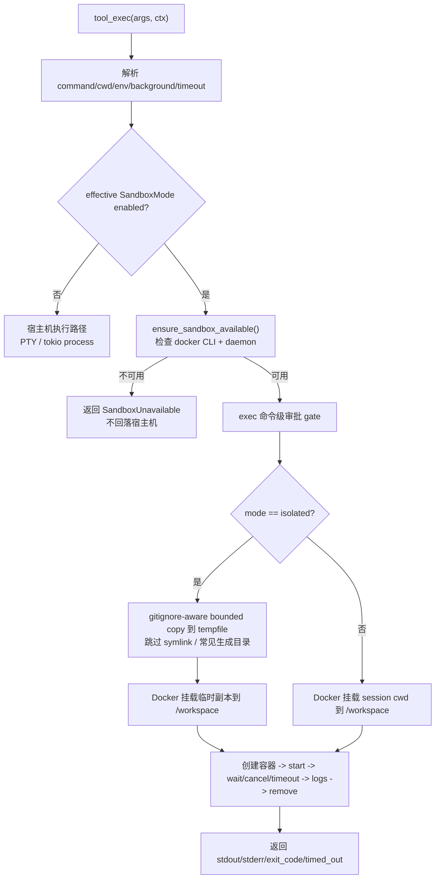
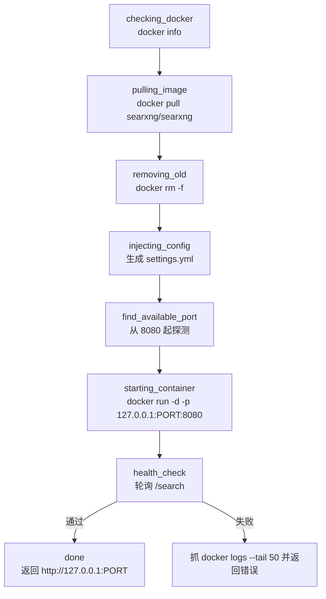

# Sandbox 架构
> 返回 [文档索引](../README.md) | 更新时间：2026-06-26 | 关联：[权限/审批系统](permission-system.md) · [工具系统](tool-system.md) · [配置系统](config-system.md) · [API 参考](api-reference.md)

## 概述

Hope Agent 的 Sandbox 子系统有两条相互独立但共享 Docker 状态引导的能力：

1. **工具执行沙箱**：会话级 `SandboxMode` 控制 `exec` 是否在 Docker 容器内执行，并作为权限引擎输入减少一部分软审批。
2. **SearXNG Docker 管理**：Web Search 设置页托管本地 SearXNG 容器，负责镜像拉取、配置注入、代理转发和生命周期管理。

本文重点定义工具执行沙箱的安全边界、数据流、权限语义和 UI/API 契约；SearXNG Docker 管理见本文后半部分。两者都需要 Docker-compatible CLI/daemon，但不能混为一个安全域：SearXNG 容器服务 Web Search，工具执行沙箱服务 `exec`。

核心原则：

- **沙箱不绕过权限优先级**：`Plan > Internal > YOLO > Protected/Dangerous/Strict > AllowAlways > Sandbox soft allow > Session preset > fallback`。
- **不静默降级**：会话选择非 `off` 但 Docker 不可用时，工具执行返回 `SandboxUnavailable`，绝不回落宿主机执行。
- **strict 永远 strict**：保护路径、危险命令、raw CDP、macOS 高危控制、host escape、Docker socket、敏感路径/secret 等不因沙箱模式消失。
- **Agent 默认与 Session 状态分离**：Agent 配置只决定新会话默认值；会话创建后以 `sessions.sandbox_mode` 为准。
- **Docker 引导平台化复用**：聊天选择器、Agent 设置页、Sandbox 设置页、SearXNG Docker 面板复用同一套 Docker 状态和安装/启动提示。

## 术语

| 名称 | 含义 |
|------|------|
| `SandboxMode` | 会话级沙箱姿态，wire 值固定为 `off` / `standard` / `isolated` / `workspace` / `trusted` |
| `SandboxConfig` | Docker 执行沙箱的容器配置，持久化在 `~/.hope-agent/sandbox.json` |
| `DockerStatus` | Docker CLI/daemon 状态，返回 `installed`、`running`、`hostOs` |
| strict 原因 | `AskReason::forbids_allow_always()` 为 true 的审批原因，不能 AllowAlways、不能超时 proceed、不能被沙箱软放行 |
| soft approval | Default/Smart 层的普通编辑类审批、编辑命令审批等，沙箱可在特定模式下放松 |
| SearXNG Docker | `crates/ha-core/src/docker/` 下的 Web Search 托管容器子系统 |

## 模块与源码

| 模块 | 文件 | 职责 |
|------|------|------|
| Sandbox mode 类型 | `crates/ha-core/src/permission/mode.rs` | 定义 `SandboxMode`、serde wire 值、默认值和软审批放松判定 |
| 权限引擎 | `crates/ha-core/src/permission/engine.rs` | 读取 `ResolveContext.sandbox_mode`，在 strict/AllowAlways 后执行 sandbox soft allow |
| 执行沙箱 runtime | `crates/ha-core/src/sandbox.rs` | Docker 执行、状态检测、配置持久化、隔离副本、容器清理 |
| exec 工具 | `crates/ha-core/src/tools/exec.rs` | 根据会话/legacy 参数决定执行位置，调用 `ensure_sandbox_available()` 和 `exec_in_sandbox_mode()` |
| Tool context | `crates/ha-core/src/tools/execution.rs` | 将 `ToolExecContext.sandbox_mode` 传给权限引擎 |
| Agent 配置 | `crates/ha-core/src/agent_config.rs` | `CapabilitiesConfig.default_sandbox_mode` + legacy `sandbox` 兼容 |
| Session DB | `crates/ha-core/src/session/db.rs` | `sessions.sandbox_mode` 迁移、读写、初始值、兼容回填 |
| Agent runtime | `crates/ha-core/src/agent/mod.rs` | 从 session meta 解析当前 sandbox mode 并注入 tool context |
| Tauri shell | `src-tauri/src/commands/chat.rs` / `src-tauri/src/lib.rs` | `chat(sandbox_mode)`、`set_sandbox_mode`、`check_sandbox_available` |
| HTTP server | `crates/ha-server/src/routes/chat.rs` / `routes/config.rs` / `lib.rs` | `POST /api/chat/sandbox-mode`、`GET /api/config/sandbox/status` |
| Transport | `src/lib/transport.ts` / `src/lib/transport-http.ts` | `ChatStartArgs.sandboxMode`、HTTP command map |
| Chat UI | `src/components/chat/input/SandboxModeSwitcher.tsx` | 会话级模式选择和 Docker 引导 |
| Settings UI | `src/components/settings/agent-panel/tabs/CapabilitiesTab.tsx` / `SandboxPanel.tsx` | Agent 默认沙箱模式、Docker 执行沙箱配置 |
| Docker 引导 | `src/components/settings/DockerSetupHint.tsx` | 平台化安装/启动提示，供多处复用 |
| SearXNG Docker | `crates/ha-core/src/docker/*` | Web Search 本地 SearXNG 容器管理 |

## 数据模型

### `SandboxMode`

Rust 定义在 `permission/mode.rs`：

```rust
#[derive(Debug, Clone, Copy, PartialEq, Eq, Default, Serialize, Deserialize)]
#[serde(rename_all = "snake_case")]
pub enum SandboxMode {
    #[default]
    Off,
    Standard,
    Isolated,
    Workspace,
    Trusted,
}
```

wire 值必须保持稳定：

| Rust | JSON / DB | 说明 |
|------|-----------|------|
| `Off` | `"off"` | 宿主机执行，审批逻辑不变 |
| `Standard` | `"standard"` | Docker 沙箱执行，但审批不放松 |
| `Isolated` | `"isolated"` | Docker + 临时工作区副本执行 |
| `Workspace` | `"workspace"` | Docker 直接挂载当前工作区 |
| `Trusted` | `"trusted"` | 沙箱内 exec 最大自治，strict 仍审批 |

`parse_or_default()` 对未知值 fail-soft 到 `Off`，避免旧版本或手写 DB 值导致 panic。

### Agent 配置

`AgentConfig.capabilities` 新增：

```rust
pub struct CapabilitiesConfig {
    pub sandbox: bool,
    pub default_sandbox_mode: Option<SandboxMode>,
}
```

兼容规则：

```rust
default_sandbox_mode.unwrap_or_else(|| {
    if sandbox { SandboxMode::Standard } else { SandboxMode::Off }
})
```

设计含义：

- `default_sandbox_mode = Some(...)` 是新字段，优先级最高。
- `sandbox: bool` 是旧字段，不删除，只在新字段缺失时参与映射。
- Agent 设置页保存默认沙箱模式时，同时写 `defaultSandboxMode` 和 `sandbox = mode != "off"`，保证旧代码读到尽量等价的行为。
- Agent 配置不是 `AppConfig` category，不进入 `ha-settings` 三件套；它走既有 Agent 设置保存路径 `get_agent_config` / `save_agent_config_cmd`。

### Session DB

`sessions` 表新增：

```sql
ALTER TABLE sessions ADD COLUMN sandbox_mode TEXT NOT NULL DEFAULT 'off';
```

迁移规则：

- 新列默认 `off`。
- 迁移时遍历已有 session 的 `agent_id`，加载对应 Agent 配置。
- 如果该 Agent 的 `effective_default_sandbox_mode()` 非 `off`，回填已有 session 的 `sandbox_mode`，保持旧 `capabilities.sandbox=true` 升级后的行为。

Session 读写 API：

| 函数 | 说明 |
|------|------|
| `SessionDB::update_session_sandbox_mode(session_id, mode)` | 写当前会话模式 |
| `SessionDB::get_session_sandbox_mode(session_id)` | 窄读取当前会话模式 |
| `SessionDB::create_session_full(...)` | 新会话按 Agent effective default 初始化 `sandbox_mode` |
| `SESSION_META_SELECT` | 返回 `SessionMeta.sandbox_mode` 给前端 |

### Docker 执行配置

`SandboxConfig` 持久化在 `~/.hope-agent/sandbox.json`：

| 字段 | 默认 | 说明 |
|------|------|------|
| `image` | `debian:bookworm-slim` | 执行沙箱镜像 |
| `memory_limit` | `512MB` | 容器内存限制，`None` 表示不设 |
| `cpu_limit` | `1.0` | `nano_cpus` 限制 |
| `read_only` | `true` | root filesystem 只读 |
| `network_mode` | `"none"` | 默认无网络 |
| `cap_drop_all` | `true` | drop all Linux capabilities |
| `no_new_privileges` | `true` | `security_opt=no-new-privileges` |
| `pids_limit` | `256` | 容器内进程数限制 |
| `tmpfs` | `/tmp` 64M、`/var/tmp` 32M、`/run` 16M | rootfs 只读时提供临时写入区 |

该配置属于 Sandbox 设置页已有配置，走：

- Tauri：`get_sandbox_config` / `set_sandbox_config`
- HTTP：`GET /api/config/sandbox` / `PUT /api/config/sandbox`

## 模式语义

| 模式 | 执行位置 | 文件写入语义 | 审批放松 | strict 行为 |
|------|----------|--------------|----------|-------------|
| `off` | 宿主机 | 真实宿主机 | 不放松 | 正常审批 |
| `standard` | Docker，挂载当前 cwd 到 `/workspace` | 写入挂载目录会落到真实工作区 | 不放松 | 正常审批 |
| `isolated` | Docker，挂载临时副本到 `/workspace` | 写入只落到临时副本，执行结束删除 | 不放松（v1） | strict 仍审批 |
| `workspace` | Docker，挂载当前 cwd 到 `/workspace` | `exec` 写入挂载目录会落到真实工作区 | 放松 workspace 内 `exec` 编辑命令 | strict 仍审批 |
| `trusted` | Docker，挂载当前 cwd 到 `/workspace` | 同 `workspace` | 同 `workspace`，语义上是沙箱内 exec 最大自治 | strict 仍审批 |

重要边界：

- `isolated` 当前没有自动写回流程。它用于在临时副本中试跑命令；若要把结果应用回真实工作区，仍要通过后续文件工具 / patch 流程并经过相应审批。
- 因为临时副本会在执行结束后删除，`isolated` v1 不放松 `exec` 编辑命令审批，避免命令显示成功但文件变更被静默丢弃。
- `write` / `edit` / `apply_patch` 本身仍在宿主机文件系统执行，不会因为 sandbox mode 自动改写到容器或临时副本。因此 v1 不放松这些直接宿主文件工具的编辑审批。
- `workspace` / `trusted` 放松 `exec` 编辑命令审批时，必须解析有效 `cwd` 并确认它在 `default_path` canonical workspace 内；命令中可识别的目标路径也必须解析到 workspace 内，动态路径或无法证明安全的越界目标继续走审批。
- `standard` 是旧「Docker 沙箱」语义，执行位置变成 Docker，但审批完全不放松。

## 权限引擎集成

`ResolveContext` 新增：

```rust
pub sandbox_mode: SandboxMode
```

同步入口：

```text
SessionMeta.sandbox_mode
  -> Agent::chat / ToolExecContext.sandbox_mode
  -> permission::engine::ResolveContext.sandbox_mode
  -> resolve()
```

决策顺序：

```text
Plan Mode
  -> Internal Tool
  -> YOLO (global or session)
  -> Protected Path
  -> Dangerous Command
  -> strict macOS / raw CDP / browser gates
  -> AllowAlways
  -> non-strict macOS/browser gates
  -> sandbox_relaxed_allow()
  -> SessionMode preset (Default / Smart)
  -> Allow
```

`sandbox_relaxed_allow(ctx)` 只处理软审批：

| 条件 | 结果 |
|------|------|
| `sandbox_mode` 不在 `workspace/trusted` | false |
| `tool_name == "exec"`、命中编辑命令、有效 `cwd` 在 workspace 内、可识别目标路径均在 workspace 内 | true |
| 其它情况 | false |

不会被沙箱放松的场景：

- `PlanModeAsk`
- `ProtectedPath`
- `DangerousCommand`
- `BrowserRawCdp`
- macOS dangerous action
- 浏览器真实 Chrome 高风险操作
- AllowAlways 禁止项
- 任何 `AskReason::forbids_allow_always()` 为 true 的 strict 原因

YOLO 关系：

- session/global YOLO 先于沙箱判定。
- YOLO 已开启时，沙箱只决定执行位置，不额外增加或减少审批。
- YOLO 命中 protected/dangerous/mac/browser strict 仍打 `app_warn!` 审计日志。

## exec 执行链路

`exec` 的有效沙箱模式解析：

```text
if ctx.sandbox_mode.enabled():
    effective = ctx.sandbox_mode
else if ctx.force_sandbox || args.sandbox == true:
    effective = standard
else:
    effective = off
```

执行流程：



Docker 容器属性：

- 镜像来自 `SandboxConfig.image`，缺失时自动 pull。
- `cmd = ["sh", "-c", command]`。
- `working_dir = "/workspace"`。
- Unix 平台以当前用户 `uid:gid` 运行，减少 bind mount 权限问题。
- bind mount 前执行 `validate_bind_mount()`。
- stdout/stderr 通过 Docker logs 收集。
- 正常完成、超时、取消、启动失败都尝试清理容器。

`isolated` 副本准备：

- 复制工作区发生在 `spawn_blocking` 中，避免同步 `std::fs` 递归阻塞 tokio runtime。
- 遍历使用 `ignore::WalkBuilder`；`hidden(false)`，所以 dotfile 不会仅因隐藏而被跳过，是否复制由 ignore 规则和硬编码兜底决定。
- 如果 cwd 位于 Git repo 内，按 Git repo 边界读取父级 `.gitignore`，并尊重 `.ignore`、`.git/info/exclude` 和 git global ignore；如果 cwd 不在 Git repo 内，则只读取 cwd 树内的 `.gitignore` / `.ignore`，避免父目录或全局规则意外影响隔离副本。
- 复制过程检查取消 token 和本次 exec timeout；取消 / 超时会在准备阶段 fail-fast。
- 默认最多复制 512MiB / 50,000 个文件或目录，超过后返回明确错误并建议改用 `workspace` mode 或收窄 cwd。
- 跳过 symlink、特殊文件，以及常见 VCS / 依赖 / 构建缓存目录：`.git`、`.hg`、`.svn`、`node_modules`、`target`、`dist`、`build`、`.next`、`.turbo`、`.cache`、`coverage`、`.pytest_cache`、`__pycache__`。

后台执行：

- `exec(background=true)` 且 sandbox enabled 时，spawn tokio task 调 `exec_in_sandbox_mode()`。
- 结果写回 process registry，用户通过 `process(action="poll")` 查询。
- 显式 async job 的审批 park 仍由 `async_jobs::approval_bridge` 负责；沙箱只改变实际命令执行位置。

## Docker 安全边界

### Mount 限制

`validate_bind_mount()` 会拒绝：

| 路径 | 原因 |
|------|------|
| `/` | 禁止挂载根文件系统 |
| `/etc` | 系统配置 |
| `/proc` | procfs |
| `/sys` | sysfs |
| `/dev` | 设备 |
| `/boot` | boot 文件 |
| `/root` | root home |
| `/var/run/docker.sock` | Docker socket escape |
| `/var/run/docker` | Docker socket/daemon 目录 |
| `/private/var/run/docker.sock` | macOS Docker socket |
| `/run/docker.sock` | Docker socket |

匹配包含路径自身和其子路径。

### 环境变量过滤

传给 `exec` 的 `env` 会过滤敏感 key。匹配规则是对 key upper-case 后包含下列片段：

```text
API_KEY, API_SECRET, TOKEN, SECRET, PASSWORD, PASSWD, CREDENTIAL,
PRIVATE_KEY, ACCESS_KEY, AWS_SECRET, AWS_ACCESS, AWS_SESSION,
OPENAI_API, ANTHROPIC_API, AZURE_, GH_TOKEN, GITHUB_TOKEN,
GITLAB_TOKEN, DATABASE_URL, REDIS_URL, MONGO_URI
```

允许列表：

```text
PATH, HOME, USER, LANG, LC_ALL, LC_CTYPE, TERM, SHELL, TMPDIR,
TZ, HOSTNAME, COLUMNS, LINES
```

过滤只作用于 `args.env`。宿主机登录 shell 环境不会整体透传进 Docker 路径。

### 网络

默认 `network_mode = "none"`。如果用户在 Sandbox 设置页改成 `bridge` 或 `host`，容器具备更大网络能力，但这不改变权限引擎 strict 规则。

### rootfs 与临时目录

默认 `read_only = true`，并挂载 tmpfs：

- `/tmp:size=64M`
- `/var/tmp:size=32M`
- `/run:size=16M`

工作目录 `/workspace` 是 bind mount 或隔离副本 mount，仍可写。

## Docker 状态与引导

状态结构：

```rust
#[derive(Debug, Clone, Serialize, Deserialize)]
#[serde(rename_all = "camelCase")]
pub struct DockerStatus {
    pub installed: bool,
    pub running: bool,
    pub host_os: String,
}
```

检测逻辑：

1. 执行 `docker --version` 判断 CLI 是否存在。
2. 通过 `bollard::Docker::connect_with_local_defaults().ping()` 判断 daemon 是否运行。
3. `host_os()` 返回 `macos` / `windows` / `linux` / `unknown`。

API：

| Surface | 命令 / 路由 | 返回 |
|---------|-------------|------|
| Tauri | `check_sandbox_available` | `DockerStatus` |
| HTTP | `GET /api/config/sandbox/status` | `DockerStatus` |
| Transport | `check_sandbox_available` | Tauri IPC 或 HTTP status route |

UI 复用组件：`DockerSetupHint`。

平台入口：

| `hostOs` | 主入口 | 替代方案 |
|----------|--------|----------|
| `macos` | Docker Desktop | OrbStack、Colima、Rancher Desktop |
| `windows` | Docker Desktop + WSL2 | Rancher Desktop、Docker Engine on WSL |
| `linux` | Docker Engine | Docker Desktop for Linux、Rancher Desktop |
| `unknown` | Docker Desktop | OrbStack、Colima、Rancher Desktop、Linux dockerd |

交互规则：

- Docker 未安装：展示平台主入口和替代方案。
- Docker 已安装但 daemon 未运行：展示启动提示和“重新检测”，不把安装入口作为主按钮。
- server 模式下显示的是服务器宿主机平台，不是浏览器客户端平台。
- 选择非 `off` 时仍允许发送聊天；只有真正执行沙箱工具时 fail-closed。

## UI 流程

### 新会话

新会话没有 session row 时，前端处于草稿态：

1. `useChatStream` 根据当前 Agent 读取 `get_agent_config`。
2. 如果用户没有手动改过 sandbox mode，前端显示 Agent effective default。
3. 首条消息发送时：
   - 用户手动改过：`ChatStartArgs.sandboxMode` 随请求传给后端。
   - 用户没改过：不传，让后端 `create_session_full()` 用 Agent default 初始化。

这种模式和 `permissionMode` 草稿态一致，避免前端异步读取默认值时覆盖用户选择。

### 已有会话

已有会话切换 `SandboxModeSwitcher`：

1. 前端立即更新本地状态。
2. 调用 `set_sandbox_mode` 持久化。
3. 后端广播 `sandbox:mode_changed`，其它窗口或 HTTP event stream 同步会话 meta。
4. 只影响后续工具调用，不重跑已完成工具。

### Agent 设置页

Agent → Capabilities 里 “Sandbox” 从 boolean switch 改成 Select：

- `off`
- `standard`
- `isolated`
- `workspace`
- `trusted`

保存时写：

```ts
capabilities.defaultSandboxMode = mode
capabilities.sandbox = mode !== "off"
```

当选择非 `off` 且 Docker 不可用时，显示 `DockerSetupHint`。

### Sandbox 设置页

Sandbox 设置页仍配置 `SandboxConfig`：

- image
- memory/cpu/pids
- read-only rootfs
- cap drop
- no-new-privileges
- network mode

它不负责设置会话模式；会话模式在聊天输入区和 Agent 默认配置中设置。

## API / Transport 契约

### Chat start

Tauri `chat` command 和 HTTP `POST /api/chat` 都接受：

```json
{
  "sandboxMode": "workspace"
}
```

Rust HTTP body 字段为 `sandbox_mode: Option<SandboxMode>`，serde camelCase 对外为 `sandboxMode`。

后端逻辑：

- 先解析或创建 session。
- 如果请求带 `sandbox_mode`，调用 `update_session_sandbox_mode()`。
- 然后进入 chat engine。

### 更新会话模式

| Surface | API |
|---------|-----|
| Tauri | `set_sandbox_mode({ sessionId, mode })` |
| HTTP | `POST /api/chat/sandbox-mode` |

HTTP body：

```json
{
  "sessionId": "session-id",
  "mode": "workspace"
}
```

返回：

```json
{ "ok": true }
```

### Sandbox config

| Surface | API |
|---------|-----|
| Tauri | `get_sandbox_config` / `set_sandbox_config` |
| HTTP | `GET /api/config/sandbox` / `PUT /api/config/sandbox` |

HTTP `PUT` body：

```json
{
  "config": {
    "image": "debian:bookworm-slim",
    "memoryLimit": 536870912,
    "cpuLimit": 1,
    "readOnly": true,
    "networkMode": "none",
    "capDropAll": true,
    "noNewPrivileges": true,
    "pidsLimit": 256,
    "tmpfs": ["/tmp:size=64M", "/var/tmp:size=32M", "/run:size=16M"]
  }
}
```

### Docker status

| Surface | API |
|---------|-----|
| Tauri | `check_sandbox_available` |
| HTTP | `GET /api/config/sandbox/status` |

返回：

```json
{
  "installed": true,
  "running": true,
  "hostOs": "macos"
}
```

## Prompt 集成

`system_prompt::build()` 在当前 session sandbox mode 非 `off` 时注入 `# Sandbox Mode` 段：

- 告知当前 session sandbox mode 和当前模式的一句话行为。
- 告知 `exec` 会按 session policy 自动路由到 Docker sandbox，无需再传 `sandbox=true`。
- 说明当前 `SandboxConfig` 快照：image、Docker network mode、rootfs 读写状态、capability policy、no-new-privileges、PID limit、tmpfs mounts；不得把默认配置写成永远成立的环境保证。
- 简短列出 `standard` / `isolated` / `workspace` / `trusted` 的模式差异，避免模型只看到 mode 字符串却不知道语义。
- 明确安全边界：sandbox 不是权限绕过；protected path / dangerous command / secret / Docker socket / host escape / raw CDP / privileged / macOS 高危控制等仍会审批或拒绝。
- 明确持久化边界：`write` / `edit` / `apply_patch` 是 host-side durable file tools，不会因 sandbox mode 自动进入容器；`isolated` 中命令创建的文件默认不持久化。
- 按当前 Docker network mode 提醒网络可用性；需要特殊宿主权限时说明限制，不要尝试绕过 sandbox。

注意：

- prompt 里的模式优先来自当前 `sessions.sandbox_mode`；没有 session id 时才回落 Agent effective default。
- 执行层以 `ToolExecContext.sandbox_mode` 为准；prompt 只是模型行为提示，不是安全边界。

## SearXNG Docker 子系统

SearXNG Docker 是 Web Search 的本地搜索引擎部署能力，源码在 `crates/ha-core/src/docker/`。它复用 Docker 平台引导，但不是工具执行沙箱。

### 模块结构

| 文件 | 职责 |
|------|------|
| `mod.rs` | 常量、`DEPLOYING`、`DEPLOY_PROGRESS`、`STATUS_LOCK` |
| `status.rs` | `SearxngDockerStatus` 聚合状态，5 秒 TTL 缓存 |
| `deploy.rs` | 7 步部署流水线 |
| `lifecycle.rs` | start / stop / remove |
| `helpers.rs` | Docker CLI、端口探测、配置生成、健康检查、搜索测试 |
| `proxy.rs` | 代理解析和容器内代理地址重写 |

### 常量

| 常量 | 值 | 说明 |
|------|----|------|
| `CONTAINER_NAME` | `hope-agent-searxng` | 容器名 |
| `IMAGE` | `searxng/searxng` | Docker Hub 镜像 |
| `DEFAULT_HOST_PORT` | `8080` | 默认宿主机端口 |
| `SEARXNG_DIR_NAME` | `searxng` | 配置目录 `~/.hope-agent/searxng/` |
| `STATUS_CACHE_TTL_SECS` | `5` | 状态缓存秒数 |

### 状态结构

`SearxngDockerStatus`：

| 字段 | 说明 |
|------|------|
| `dockerInstalled` | Docker CLI 是否存在 |
| `dockerNotRunning` | CLI 存在但 daemon 不运行 |
| `hostOs` | 后端宿主机平台 |
| `containerExists` | SearXNG 容器是否存在 |
| `containerRunning` | 容器是否运行 |
| `port` | 绑定端口 |
| `healthOk` | `/search` 健康检查是否通过 |
| `deploying` | 是否部署中 |
| `deployStep` | 当前部署步骤 |
| `deployLogs` | 最近部署日志 |
| `searchOk` | 真实搜索是否返回结果 |
| `searchResultCount` | 测试搜索结果数量 |
| `unresponsiveEngines` | 搜索测试中失败的引擎 |

### 部署流程



并发控制：

- `DEPLOYING: AtomicBool` 防止并发 deploy/start/stop/remove。
- `DEPLOY_PROGRESS` 保存部署步骤和最近 100 行日志。
- 状态查询用 `STATUS_LOCK` + 5 秒 TTL，避免高频轮询反复执行搜索测试。

### SearXNG 配置注入

部署时生成 `~/.hope-agent/searxng/settings.yml` 并以只读 volume 注入：

```yaml
use_default_settings: true
server:
  secret_key: "<随机或复用>"
  limiter: false
search:
  formats:
    - html
    - json
```

代理开启时额外写：

```yaml
outgoing:
  proxies:
    all://:
      - http://host.docker.internal:1082
  request_timeout: 10.0
```

关键点：

- `secret_key` 首次随机生成，后续复用旧值。
- `limiter=false`，本地部署不做 SearXNG 限速。
- 必须启用 JSON 格式，供 `web_search` 调用。
- SearXNG 不可靠读取标准环境变量代理，所以必须写 `outgoing.proxies`。

### SearXNG 网络边界

| 层面 | 策略 |
|------|------|
| 端口映射 | 仅映射 `127.0.0.1:PORT -> 8080` |
| 配置挂载 | `settings.yml` 只读挂载 |
| 健康检查 | 使用 `reqwest::Client::no_proxy()` 直连本地 |
| 代理地址 | 容器内把 `localhost/127.0.0.1` 重写成 `host.docker.internal` |
| 端口冲突 | 从 8080 起最多尝试 10 个端口 |

## 红线

1. 非 `off` 的执行沙箱不得静默回落宿主机。
2. `standard` 不得放松审批，只改变执行位置。
3. `isolated` 不得放松 `exec` 编辑命令或宿主文件工具审批，除非隔离 diff 写回 / 文件工具隔离 backend 已落地。
4. `workspace/trusted` 放松 `exec` 编辑命令前必须 canonicalize 并确认有效 `cwd` 在 workspace 内；可识别的绝对路径、相对路径、`/workspace/...` 容器路径、重定向目标、常见文件命令裸操作数都要过 workspace 边界检查，动态展开目标 fail-closed 继续审批。
5. `workspace/trusted` 不得放松直接宿主文件工具审批，除非文件工具有真正的 sandbox backend 或执行前 fail-closed Docker guard。
6. protected path / dangerous command / raw CDP / macOS dangerous action 等 strict 项必须在 sandbox soft allow 之前判定。
7. Docker socket、根目录、系统目录不得 bind mount。
8. 敏感 env 不得传入容器。
9. server 模式 Docker 引导必须反映服务器宿主机，不是浏览器客户端。
10. `SandboxConfig` 是执行沙箱配置；SearXNG Docker 配置和状态不得混用。
11. `ha-settings` 不写 Agent 默认 sandbox mode；Agent 配置走 Agent 设置保存路径。

## 测试矩阵

### Rust

| 场景 | 期望 |
|------|------|
| `SandboxMode` serde / parse round-trip | wire 值稳定 |
| DB migration | `sessions.sandbox_mode` 存在，默认 `off` |
| create session | Agent default 初始化 session sandbox mode |
| update/get session sandbox mode | round-trip |
| `standard` + edit tool | 仍 Ask |
| `workspace` + workspace file edit | 仍 Ask |
| `isolated` + direct file tool | 仍 Ask |
| `isolated` + exec edit command | 仍 Ask |
| `workspace` + exec edit command + cwd 在 workspace 内 + 目标路径在 workspace 内 | Allow |
| `workspace` + exec edit command + cwd 越界 | 仍 Ask |
| `workspace/trusted` + exec edit command + 目标路径越界或动态展开 | 仍 Ask |
| `trusted` + protected path | 仍 Ask strict |
| Docker unavailable + sandbox exec | `SandboxUnavailable`，不进入宿主执行 |

### TypeScript / UI

| 场景 | 期望 |
|------|------|
| 新会话草稿态手动选择 sandbox mode | 首条消息带 `sandboxMode` |
| 新会话未手动选择 | 后端使用 Agent default |
| 已有会话切换 | 调 `set_sandbox_mode` 持久化 |
| Docker 未安装 | 显示平台安装入口 + 替代方案 |
| Docker 已安装未运行 | 显示启动提示 + 重新检测 |
| Agent 默认值兼容 | `defaultSandboxMode ?? (sandbox ? standard : off)` |
| i18n | 所有 locale 无缺 key |

## 后续扩展

- **隔离 diff 写回**：`isolated` 执行结束后比较临时副本和真实 workspace，生成可审阅 patch，由用户确认后应用。
- **per-tool 沙箱执行**：把 `write/edit/apply_patch` 抽象为可切换 backend，使 `isolated` 能真正对文件工具操作隔离副本。
- **Podman 兼容探测**：当前以 Docker-compatible CLI/daemon 为准；Podman 只有提供 Docker 兼容 socket/CLI 时才视为可用。
- **更细的网络策略**：把 `SandboxConfig.network_mode` 和 SSRF policy / tool 需求联动，但不能让模型自行开启网络。
- **容器镜像预热**：在用户选择非 `off` 后可提示预拉镜像，避免首次 exec 变慢。
