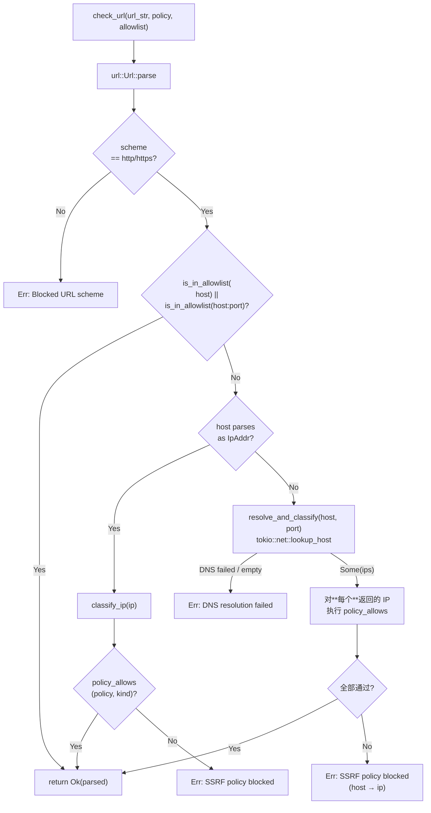

# 安全子系统

> 返回 [文档索引](../README.md) | 关联：[MCP 客户端](mcp.md) · [工具系统](tool-system.md) · [配置系统](config-system.md)

[`security/`](../../crates/ha-core/src/security/) 集中所有跨子系统的安全 contract：

| 模块 | 职责 |
|---|---|
| [`ssrf.rs`](../../crates/ha-core/src/security/ssrf.rs) | 出站 HTTP/WS 的 host 分类 + 三档策略 + 可信主机白名单 |
| [`dangerous.rs`](../../crates/ha-core/src/security/dangerous.rs) | YOLO 进程级跳过所有工具审批的全局开关 |
| [`http_stream.rs`](../../crates/ha-core/src/security/http_stream.rs) | 出站响应体的字节封顶读取（防恶意上游撑爆内存） |

**硬规则**：所有出站 HTTP / WebSocket 入口**必须**走 `security::ssrf::check_url`（异步入口）或 `check_host_blocking_sync`（reqwest redirect callback 同步入口）。新出站入口严禁自写 IP 校验——重复轮子 + 不一致语义 = 易错。

LLM Provider 出站当前是**例外**——`ProviderConfig.allow_private_network` 仅做 UI 标记，不做后端拦截，因为用户的本地 Ollama / vLLM 自部署常驻 `192.168.*` / `10.*`，强约束反而误伤。

## SSRF 三档策略

`SsrfPolicy` 决定一次出站允许命中哪些 IP 类别。`Default` 是默认值，配置层在 [`AppConfig.ssrf`](../../crates/ha-core/src/config/mod.rs) 持久化，由四个 per-tool override + 一个 fallback 组成。

| Policy | Loopback | Private | LinkLocal | Metadata | Public |
|---|---|---|---|---|---|
| `Strict` | ❌ | ❌ | ❌ | ❌ | ✅ |
| `Default` | ✅ | ❌ | ❌ | ❌ | ✅ |
| `AllowPrivate` | ✅ | ✅ | ❌ | ❌ | ✅ |

**Metadata / Unspecified / Broadcast / LinkLocal 任何 policy 都拒**——这四类没有合法对外业务场景，云元数据更是 SSRF 攻击的金标。`Loopback` 在 `Default` 放行是为了让本地 SearXNG / 本地 MCP server 工作；`Private` 在 `AllowPrivate` 放行是为了局域网设备（如局域网 Stable Diffusion / 网关 API）。

### Per-tool override

`SsrfConfig` 字段：

```rust
pub struct SsrfConfig {
    pub default_policy: SsrfPolicy,        // 兜底
    pub trusted_hosts: Vec<String>,        // 用户白名单
    pub browser_policy: Option<SsrfPolicy>,
    pub web_fetch_policy: Option<SsrfPolicy>,
    pub image_generate_policy: Option<SsrfPolicy>,
    pub url_preview_policy: Option<SsrfPolicy>,
}
```

四个 per-tool 字段 `None` 时继承 `default_policy`，由 `SsrfConfig::browser()` / `web_fetch()` / `image_generate()` / `url_preview()` 这组 helper 解析返回 effective policy。新增需要 SSRF 保护的工具时**优先**加 per-tool override 而不是改 `default_policy`——后者牵涉所有工具的安全姿态。

### `trusted_hosts` 白名单

`trusted_hosts` 在 policy 检查**之前**生效——命中即放行，policy 完全跳过。两种语法：

| 语法 | 示例 | 匹配 |
|---|---|---|
| 精确 host | `127.0.0.1:11434` | 仅这一对 host:port |
| 精确 host（无端口） | `ollama.local` | 任何端口的 ollama.local |
| 单层通配 | `*.trusted.example` | `api.trusted.example` / `deep.nested.trusted.example` / `trusted.example` 自身（apex 也匹配） |

匹配 case-insensitive，仅支持单层 `*.` 前缀（不支持 `foo.*` 或多层 `**`）。`is_in_allowlist(host, list)` 同时尝试 bare host 和 `host:port` 两种形态——所以 `127.0.0.1:11434` 命中 `127.0.0.1:11434` 但不命中 `127.0.0.1`（端口必须对齐）。

## 检查入口

### `check_url(url, policy, allowlist) -> Result<Url>`（异步）

主入口。完整流程：



**DNS rebinding 防御**：一个 hostname 可能 resolve 出多个 IP（A 记录 + AAAA 记录 + 攻击者投毒的 mixed public/private）——必须**每个**都过 policy 才放行。攻击者无法用 "首条公网 + 二条 169.254.169.254" 偷渡。

**仅放行 http/https**：`file://` / `gopher://` / `dict://` 等历史 SSRF 高危 scheme 全部拒绝。

### `check_host_blocking_sync(host, policy, allowlist) -> bool`（同步）

reqwest `redirect::Policy::custom` 的 callback 是同步上下文，没法 `.await` DNS。这个函数只能拿到 host 字符串，做的事情：

1. 命中 `allowlist` → 返回 false（不阻断）
2. host 是 `localhost` 或 `*.localhost` → 走 Loopback 分类
3. host 是字面 IP → `classify_ip` 后查 policy
4. **未知 hostname 不阻断**——返回 false 让 reqwest 继续 follow，下一跳由后续业务代码再次 `check_url` 重新做完整 DNS resolve

返回值语义：**true = 应该 block，false = 放行**——和 `check_url` 的 `Result` 语义相反，取名上做了 `_blocking_` 提示。

`web_fetch` 是当前唯一在 redirect callback 里调用它的工具：见 [`tools/web_fetch.rs:398-411`](../../crates/ha-core/src/tools/web_fetch.rs)。

## Host 分类（`classify_ip`）

| `HostKind` | IPv4 判定 | IPv6 判定 |
|---|---|---|
| `Metadata` | `169.254.169.254` (AWS/GCP/Azure IMDS) / `169.254.170.2` (ECS Task Metadata) / `100.100.100.200` (Aliyun) | `fd00:ec2::254` (EC2 IMDSv6) + IPv4-mapped fallback |
| `Unspecified` | `0.0.0.0` 或首字节为 `0`（含 `0.x.y.z`） | `::` |
| `Loopback` | `127.0.0.0/8` | `::1` |
| `Broadcast` | `255.255.255.255` | — |
| `LinkLocal` | `169.254.0.0/16`（除 metadata 段） | `fe80::/10`（首段 `& 0xffc0 == 0xfe80`） |
| `Private` | `10.0.0.0/8` / `172.16.0.0/12` / `192.168.0.0/16` | `fc00::/7`（首段 `& 0xfe00 == 0xfc00`，ULA） |
| `Public` | 上述都不命中 | 上述都不命中 |

**Metadata 分类先于一切**：`is_metadata_ip(ip)` 在 `classify_ip` 第一行调用，命中即返回 `Metadata`，避免被后续 `is_link_local`（169.254 段）抢分类。

**IPv4-mapped IPv6 双重防御**：`::ffff:169.254.169.254` 这种 IPv4-mapped 形态会先 `to_ipv4_mapped()` 转回 v4 再分类，防止攻击者用 v6 字面量绕过 v4 metadata 检查。`is_metadata_ip` 内部和 `classify_ip` 的 v6 分支都做了这一步——defense in depth。

**`0.x.y.z` 算 Unspecified**：标准只规定 `0.0.0.0` 是 unspecified，但 Linux 内核把整个 `0.0.0.0/8` 当作 "本机" 投递；为了不依赖底层路由实现，整个 `0.x.y.z` 都拒。

## 出站响应体封顶（`http_stream`）

`security::http_stream::read_bytes_capped(resp, max_bytes)` 把 `reqwest::Response` 流式读到 `Vec<u8>`，**超过 `max_bytes` 立即截断并返回**。`read_text_capped` 是 lossy UTF-8 包装。

为什么必须封顶：

1. `Content-Length` 可能撒谎或缺失（chunked encoding）
2. 恶意 / 抽风的上游可能持续推送，撑爆进程内存
3. reqwest `bytes()` 等便利方法没有内置上限，调用即裸奔

**当前调用方与上限**：

| 调用方 | 上限 | 文件 |
|---|---|---|
| `web_search/*`（Bocha / Brave / Google / Grok / SearXNG / 通用 helper） | `JSON_RESPONSE_BYTE_CAP = 1_000_000`（1 MB） | [`tools/web_search/helpers.rs`](../../crates/ha-core/src/tools/web_search/helpers.rs) |
| `image_generate` URL 下载 | `MAX_IMAGE_DOWNLOAD_BYTES = 10_485_760`（10 MB） | [`tools/image_generate/helpers.rs`](../../crates/ha-core/src/tools/image_generate/helpers.rs) |

新增"会从外部下载内容"的工具时，**默认走 `read_*_capped`**，不要用 `resp.text()` / `resp.bytes()`。封顶值按业务合理上限选——JSON API 1 MB 已远超合理 payload，图片 10 MB 覆盖 4K 大图。

## Dangerous Mode（YOLO）

进程级跳过**所有工具审批门控**的核弹按钮。两个独立来源用 OR 合并，任一为 true 即激活：

| 来源 | 持久化 | 设置入口 | 典型场景 |
|---|---|---|---|
| CLI flag `--dangerously-skip-all-approvals` | 进程内 `AtomicBool`，重启清零 | [`src-tauri/src/main.rs`](../../src-tauri/src/main.rs) 启动早期 | 一次性脚本调用 / CI 环境 |
| `AppConfig.dangerous_skip_all_approvals` | 持久化到 `config.json` | Settings UI / `update_settings(category="security")` | 高信任本地环境长开 |

唯一判定入口：[`security::dangerous::is_dangerous_skip_active()`](../../crates/ha-core/src/security/dangerous.rs)，禁止业务代码自己读 `cfg.dangerous_skip_all_approvals` 绕开 CLI flag 路径。

`active_source()` 给日志用——CLI 优先标注（"CLI flag"），因为 CLI 来源不可清除、最容易让用户惊讶（点了 Settings 关闭却仍在跳过审批，必然是 CLI 还开着）。

### 与审批门控的交互

[`tools/execution.rs::execute_tool_with_context`](../../crates/ha-core/src/tools/execution.rs) 是唯一的审批 chokepoint。决策表：

```text
if ctx.auto_approve_tools || dangerous_mode {
    needs_approval = false      // 全跳
} else {
    match perm_mode {
        FullApprove   => needs_approval = false   // session 级整体放行
        AskEveryTime  => needs_approval = !is_internal && name != EXEC && !is_skill_read(name, args)
        Auto          => needs_approval = tool_needs_approval(name, args, ctx) && name != EXEC
    }
}
```

跳过时**强制 emit `app_warn!`**：

```text
[WARN] tool / dangerous_mode / Tool 'write' bypassed approval (DANGEROUS MODE active via CLI flag)
```

internal tool 不在 warn 范围内（每轮多次调用，刷屏无意义）。审计 log 是唯一回溯依据——重启清 CLI flag 后无法靠"上次启动用了什么"反查执行历史。

### 与 Plan Mode 正交

Dangerous Mode 只跳**审批门控**，**不**改变 Plan Mode 的工具白名单 / 路径白名单 / `apply_patch` 限制——后者是 [`plan/`](../../crates/ha-core/src/plan/) 在执行层的独立 enforcement。换言之：YOLO 让 `write` 不再弹审批，但 Plan Mode 仍然不允许 `write` 进入；二者的交集才是实际可执行集。

这种正交设计的代价是新增审批旁路时**两个开关都要单独验证**，但收益是 Plan Mode 这种"约束模型行为"的能力不会被一个全局开关瞬间瓦解。

### `DangerousModeStatus` 查询接口

```rust
pub struct DangerousModeStatus {
    pub cli_flag: bool,    // CLI 当前是否激活
    pub config_flag: bool, // config.json 当前是否激活
    pub active: bool,      // OR 合并结果
}

pub fn status() -> DangerousModeStatus;
```

前端 Settings UI 用这个区分"是配置开着还是 CLI 开着"，UI 上对 CLI 激活态显示只读警告（无法 toggle off）。

## SSRF 调用方对照

所有出站入口必须在这张表里登记。新增时同步更新。

| 调用点 | Policy 解析 | 文件 |
|---|---|---|
| `web_fetch` | `ssrf_cfg.web_fetch()`；`ssrf_protection: false` legacy 字段降级到 `AllowPrivate`；redirect callback 走 `check_host_blocking_sync` | [`tools/web_fetch.rs:382-411`](../../crates/ha-core/src/tools/web_fetch.rs) |
| `browser` (navigation / new-page) | `ssrf_cfg.browser()` | [`tools/browser/navigation.rs:12,131`](../../crates/ha-core/src/tools/browser/navigation.rs) |
| `image_generate` URL 下载 | `ssrf_cfg.image_generate()`，封顶 10 MB | [`tools/image_generate/helpers.rs:98,128`](../../crates/ha-core/src/tools/image_generate/helpers.rs) |
| `url_preview` | `ssrf_cfg.url_preview()` | [`url_preview.rs:252`](../../crates/ha-core/src/url_preview.rs) |
| `web_search` (Bocha / Brave / Google / Grok / SearXNG) | `ssrf_cfg.default_policy`（无 per-tool override） | [`tools/web_search/helpers.rs:16`](../../crates/ha-core/src/tools/web_search/helpers.rs) |
| MCP transport (Streamable HTTP / SSE / WebSocket) | 调用方传入的 policy（默认 `Default`）；ws/wss 先 rewrite 成 http/https 再分类 | [`mcp/transport.rs:164,307,604`](../../crates/ha-core/src/mcp/transport.rs) |
| MCP OAuth (discovery / DCR / token / refresh) | 固定 `SsrfPolicy::Default`，走 `provider::apply_proxy` | [`mcp/oauth.rs`](../../crates/ha-core/src/mcp/oauth.rs) |

**LLM Provider 出站**：当前不走 SSRF 检查。`ProviderConfig.allow_private_network` 字段仅做 round-trip 配置，不影响后端拦截——后续如果加入强制策略，应在 [`provider/`](../../crates/ha-core/src/provider/) 内部统一插桩，而不是散落到 4 个 Provider adapter。

## API Key / Token 红线

- **任何日志路径**（包括 `app_*!` / `tracing` / panic backtrace / API 请求体落盘）都必须经 [`logging::file_ops::redact_sensitive`](../../crates/ha-core/src/logging/file_ops.rs) 脱敏。`logging.rs` 的请求体落盘路径已经强制 redact + 32 KB 截断
- OAuth token 持久化在 `~/.hope-agent/credentials/auth.json`（核心 LLM）和 `~/.hope-agent/credentials/mcp/{server_id}.json`（MCP server）；登出 / 删除 server 时**必须** `clear_token()` / `mcp::credentials::clear()`
- **MCP 凭据**走 [`platform::write_secure_file`](../../crates/ha-core/src/platform/) 0600 原子写（temp + fsync + rename）；**主 LLM OAuth `oauth.rs::save_token`** 当前用 `std::fs::write` 直写，没经过 `write_secure_file`——见 [跨平台抽象层](platform.md) 的"已知缺口"，待统一
- `tauri.conf.json` 的 CSP 当前为 `null`，**禁止放行外部域名**——任何远端资源加载请走后端代理

## 单元测试覆盖

`security/ssrf.rs`：

- `classify_ipv4` / `classify_ipv6` 全分类矩阵（含 Metadata 段优先于 LinkLocal）
- IPv4-mapped IPv6 fallback（`::ffff:169.254.169.254` 命中 Metadata）
- `policy_decision_matrix` 三档 × 七类决策矩阵
- `allowlist_exact_and_wildcard`：精确 / wildcard / case-insensitive / 端口对齐 / apex 匹配
- `check_url_*`：literal metadata 拒、private 在 Default 拒、loopback 在 Default 放、loopback 在 Strict 拒、private 在 AllowPrivate 放、`file://` scheme 拒、allowlist 绕过 Strict
- `check_host_blocking_sync`：loopback / localhost / metadata / public / allowlist 决策

`security/dangerous.rs`：当前无单元测试（CLI flag + cached_config 副作用难以纯函数化），由 [`tools/execution.rs`](../../crates/ha-core/src/tools/execution.rs) 集成测试覆盖审批旁路语义。

## 关键源文件

| 文件 | 职责 |
|---|---|
| [`crates/ha-core/src/security/mod.rs`](../../crates/ha-core/src/security/mod.rs) | 三个子模块的 `pub mod` 导出 |
| [`crates/ha-core/src/security/ssrf.rs`](../../crates/ha-core/src/security/ssrf.rs) | `SsrfPolicy` / `HostKind` / `SsrfConfig` / `classify_ip` / `is_metadata_ip` / `is_in_allowlist` / `policy_allows` / `check_url` / `check_host_blocking_sync` / `resolve_and_classify` |
| [`crates/ha-core/src/security/dangerous.rs`](../../crates/ha-core/src/security/dangerous.rs) | `set_cli_flag` / `cli_flag_active` / `is_dangerous_skip_active` / `active_source` / `status` |
| [`crates/ha-core/src/security/http_stream.rs`](../../crates/ha-core/src/security/http_stream.rs) | `read_bytes_capped` / `read_text_capped` |
| [`crates/ha-core/src/config/mod.rs`](../../crates/ha-core/src/config/mod.rs) | `AppConfig.ssrf: SsrfConfig` + `AppConfig.dangerous_skip_all_approvals: bool` 字段定义 |
| [`crates/ha-core/src/tools/execution.rs`](../../crates/ha-core/src/tools/execution.rs) | 审批 chokepoint，消费 `is_dangerous_skip_active` |
| [`crates/ha-core/src/logging/file_ops.rs`](../../crates/ha-core/src/logging/file_ops.rs) | `redact_sensitive` 脱敏函数 |
