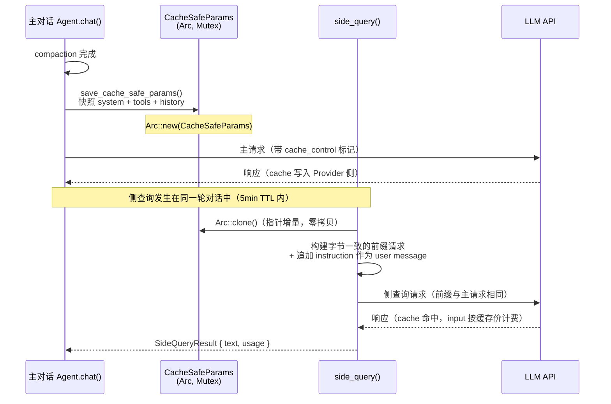
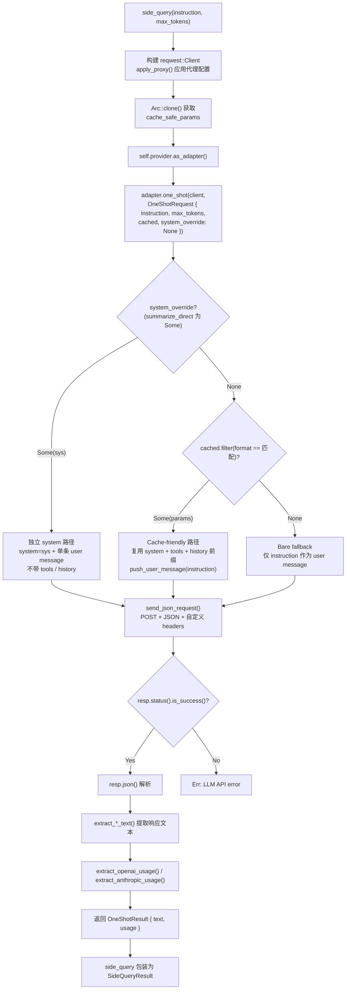

# Side Query 缓存侧查询架构
> 返回 [文档索引](../README.md) | 更新时间：2026-04-19
>
> 关联：本文聚焦 one-shot 侧查询路径（`LlmApiAdapter`，Phase 1）。主对话 streaming + tool loop 路径在 Phase 2 也已抽成 `StreamingChatAdapter` trait + `AssistantAgent::run_streaming_chat` 公共编排，`save_cache_safe_params` 现在由公共编排在 compaction 完成后、第一轮发出前统一调用，4 个 Provider 不再各写一份。详见 [`agent/streaming_adapter.rs`](../../crates/ha-core/src/agent/streaming_adapter.rs) 和 [`agent/streaming_loop.rs`](../../crates/ha-core/src/agent/streaming_loop.rs)。

## 核心原理

Side Query 复用主对话的 `system_prompt + tool_schemas + conversation_history` 作为 API 请求前缀，利用 LLM Provider 的 prompt cache 机制，使侧查询（Tier 3 摘要、记忆提取等）的输入 token 成本降低约 90%。



## CacheSafeParams 结构

```rust
pub struct CacheSafeParams {
    pub system_prompt: String,                // 主对话的完整系统提示词
    pub tool_schemas: Vec<serde_json::Value>,  // 工具 schema 列表（Provider 原生格式）
    pub conversation_history: Vec<serde_json::Value>, // 对话历史（Provider 原生格式）
    pub provider_format: ProviderFormat,        // Anthropic / OpenAIChat / OpenAIResponses / Codex
}
```

### 存储机制

- 存储在 `AssistantAgent.cache_safe_params: Mutex<Option<Arc<CacheSafeParams>>>`
- `save_cache_safe_params()` 在每轮主请求 compaction 后、tool loop 前调用，由 `AssistantAgent::run_streaming_chat`（Phase 2 公共编排）统一注入——4 个 Provider 不再各自调一份
- `Arc::clone()` 只是指针增量(pointer bump)，不深拷贝对话数据
- `ProviderFormat::from(&self.provider)` 自动推断格式，确保侧查询与主请求使用同一 Provider 格式

## side_query() 流程

`side_query()` 自身只做"取快照 + 构 client + 调 adapter"三步——所有 Provider 特异性都在 [`agent/llm_adapter.rs`](../../crates/ha-core/src/agent/llm_adapter.rs) 的 `LlmApiAdapter` trait 实现里。`summarize_direct()` 复用同一组 adapter，仅传不同的 `OneShotRequest`（`system_override` 字段决定走哪条分支）。



### 关键约束

- **非流式**：侧查询始终使用同步 JSON 请求（`stream: false`），不走流式输出
- **单轮**：不执行 tool loop，不做 compaction
- **前缀一致**：工具 schema 即使侧查询不需要执行工具，也必须包含，以保证与主请求的字节级前缀一致
- **连续消息合并**：使用 `push_user_message()` 追加 instruction，自动合并连续 user 消息（兼容 Anthropic role 交替要求）

## Provider 适配

### Anthropic

| 特性 | 实现细节 |
|------|---------|
| 缓存机制 | 显式 `cache_control: { type: "ephemeral" }`（5min TTL） |
| system prompt | `system` 数组包含一个 text block，附加 `cache_control` |
| tools | 克隆 `tool_schemas`，**最后一个** tool 附加 `cache_control` |
| messages | 复用 `conversation_history` + `push_user_message(instruction)` |
| API URL | `build_api_url(base_url, "/v1/messages")` |
| 请求头 | `x-api-key` + `anthropic-version: ANTHROPIC_API_VERSION` |
| 文本提取 | `content[].type=="text"` 的第一个 block 的 `text` 字段 |
| usage 字段 | `input_tokens` + `output_tokens` + `cache_creation_input_tokens` + `cache_read_input_tokens` |

### OpenAI Chat Completions

| 特性 | 实现细节 |
|------|---------|
| 缓存机制 | 自动前缀缓存（无需显式标记，OpenAI 自动匹配相同前缀） |
| system prompt | `messages[0]` 的 `{ role: "system", content: ... }` |
| tools | 每个 schema 包裹为 `{ type: "function", function: schema }` |
| messages | system + history (extend) + `{ role: "user", content: instruction }` |
| API URL | `build_api_url(base_url, "/v1/chat/completions")` |
| 请求头 | `Authorization: Bearer {api_key}` |
| 文本提取 | `choices[0].message.content` |
| usage 字段 | `prompt_tokens` + `completion_tokens` + `prompt_tokens_details.cached_tokens` |

### OpenAI Responses / Codex（共享 `side_query_responses()`）

| 特性 | OpenAI Responses | Codex |
|------|-----------------|-------|
| API URL | `build_api_url(base_url, "/v1/responses")` | `chatgpt.com/backend-api/codex/responses`（复用 `CODEX_API_URL`，与主对话同路径） |
| 认证 | `Authorization: Bearer {api_key}` | `Authorization: Bearer {access_token}` + `X-Account-ID` |
| system prompt | `instructions` 字段 | 同左 |
| input | 复用 `conversation_history` + `push_user_message(instruction)` | 同左 |
| tools | 直接传递 `tool_schemas` | 同左 |
| 额外参数 | `store: false`, `stream: false`, `reasoning: { effort: "low" }`, `max_output_tokens` | `store: false`, `stream: true`（Codex 后端拒绝 false）, `reasoning: { effort: "low" }`，**不**传 `max_output_tokens`（Codex 拒绝） |
| 文本提取 | `output[].type=="message"` -> `content[].type=="output_text"` -> `text` | 同左 |
| usage 字段 | `input_tokens` / `output_tokens` + `prompt_tokens_details.cached_tokens` | 同左 |

## 使用场景

| 场景 | 调用方 | 说明 |
|------|--------|------|
| Tier 3 上下文摘要 | `agent/context.rs` + `context_compact/summarization.rs` | 对话历史超长时，通过 LLM 生成 continuation handoff 摘要替代旧消息 |
| 自动记忆提取 | `memory.rs` | 每轮对话结束后按阈值后台提取用户偏好/事实存入记忆库 |
| LLM 记忆语义选择 | `memory.rs` | 候选记忆数 > 阈值（默认 8）时，LLM 从候选列表选择最相关 <=5 条 |

## 成本分析

### Anthropic Prompt Cache 定价模型

| Token 类型 | 价格倍率 | Side Query 效果 |
|-----------|---------|-----------------|
| 常规 input | 1x | 仅 instruction 部分按此计费 |
| cache 写入 | 1.25x | 由主请求承担（一次性） |
| cache 读取 | 0.1x | 侧查询前缀部分命中此价格 |

以 50K token 对话上下文 + 500 token instruction 为例：

| 操作 | 无缓存成本 | 有缓存成本 | 节省 |
|------|-----------|-----------|------|
| Tier 3 摘要 | ~$0.15 | ~$0.015 | 90% |
| 记忆提取 | ~$0.15 | ~$0.015 | 90% |
| 每会话 3 次侧查询合计 | ~$0.45 | ~$0.045 | 90% |

### OpenAI 自动前缀缓存

OpenAI 对相同前缀的请求自动缓存，cached tokens 按 50% 折扣计费。侧查询的前缀部分自动命中，instruction 部分按原价计费。

## 退化行为

| 条件 | 行为 | 影响 |
|------|------|------|
| `cache_safe_params` 为 `None` | 发送最简请求：仅 `instruction` 作为 user message | 功能正常，无成本优化 |
| `provider_format` 不匹配 | `cached.filter()` 返回 `None`，同上 | 功能正常，无成本优化 |
| API 请求失败（非 2xx） | 返回 `Err(anyhow)` | 调用方处理，通常降级为不使用侧查询结果 |
| 旧会话无快照 | 退化为普通请求 | 功能不受影响，仅缺少缓存优化 |
| Anthropic cache 过期（>5min） | 请求正常但无 cache hit | 按全价计费，功能不受影响 |

## reasoning effort 策略

Side query body 在 OpenAIResponses + Codex dialect **强制** `reasoning: { effort: "low" }`（[`build_responses_body`](../../crates/ha-core/src/agent/llm_adapter.rs)）。理由：

- side_query 是后台增强（active_memory 召回、title gen、auto_extract、recap facets、tier 3 摘要），目标是**快**而非深推理；
- 不传该字段时，Codex / Responses 后端走账号默认 effort（reasoning model 通常是 medium），首 token 常 5–15s，会击穿 active_memory 的 8s timeout、title gen 的 10s timeout；
- 主对话路径继续按用户配置的 effort（[`ResponsesRequest.reasoning`](../../crates/ha-core/src/agent/api_types.rs)）走，不受影响。

后续若有 side_query 调用方需要更高 effort（例如 recap 想给 reasoning model 更多时间想），应扩展 `OneShotRequest` 增加可选 effort 字段，而不是回到"不传"。

## SideQueryResult

```rust
pub struct SideQueryResult {
    pub text: String,       // LLM 响应文本
    pub usage: ChatUsage,   // Token 使用统计（含 cache hit 信息）
}

pub struct ChatUsage {
    pub input_tokens: u64,                  // 总输入 token
    pub output_tokens: u64,                 // 总输出 token
    pub cache_creation_input_tokens: u64,   // Anthropic: 本次写入缓存的 token 数
    pub cache_read_input_tokens: u64,       // 命中缓存的 token 数（Anthropic + OpenAI）
}
```

## 关键源文件

| 文件 | 路径 | 职责 |
|------|------|------|
| Side Query 入口 | `crates/ha-core/src/agent/side_query.rs` | `save_cache_safe_params()` + `side_query()`（薄壳，委托给 adapter） |
| LLM Adapter | `crates/ha-core/src/agent/llm_adapter.rs` | `LlmApiAdapter` trait + 4 个 Provider adapter + 共享 helpers（`send_json_request` / 5 个 `extract_*`）；`LlmProvider::as_adapter()` 入口 |
| 摘要直连 | `crates/ha-core/src/agent/context.rs::summarize_direct()` | Tier 3 fallback 路径，复用同一 adapter 走 `system_override` 分支 |
| 类型定义 | `crates/ha-core/src/agent/types.rs` | `CacheSafeParams` / `ProviderFormat` / `SideQueryResult` / `ChatUsage` |
| Provider 配置 | `crates/ha-core/src/agent/config.rs` | `build_api_url()` / `ANTHROPIC_API_VERSION` / `CODEX_API_URL` |
| 上下文压缩 | `crates/ha-core/src/context_compact/` | 调用方：Tier 3 摘要通过 side_query / summarize_direct 执行 |
| 记忆系统 | `crates/ha-core/src/memory/` | 调用方：记忆提取 + 语义选择通过 side_query 执行 |
| Failover Executor | `crates/ha-core/src/failover/executor.rs` | `execute_with_failover` + `FailoverPolicy::side_query_default` / `summarize_default` —— Phase 3 Step 3-4 让 side_query / DedicatedModelProvider 也享受 profile 轮换 + 退避重试 |

## Failover 行为（Phase 3 Step 3-4）

`AssistantAgent` 通过 builder `with_failover_context(Arc<ProviderConfig>)` 注入源 ProviderConfig 后，`side_query()` 会在 `provider_config + session_id` 都齐备时把 one-shot 调用包到 `failover::execute_with_failover` 里走 `FailoverPolicy::side_query_default`（max_retries=1 + 允许 profile 轮换，低频后台路径不需要长退避）。

每次 retry / 轮换：closure 拿到 `Option<&AuthProfile>` 后用 `AssistantAgent::build_llm_provider_with_profile(config, model_id, profile)` 重建一个临时 `LlmProvider`（owned api_key + base_url），再调 `as_adapter().one_shot(...)`。`cache_safe_params` 在外层 lock 一次 + clone Arc，每次 closure 调用 `Arc::clone` 是 pointer bump 不是 deep copy。Profile 轮换不破坏前缀缓存：单 key 限流时换到下一个 key，新请求按各 provider 的 prompt-cache 规则走（Anthropic 重新创建 cache，OpenAI 重新前缀匹配——这是底层语义，无 workaround）。

未注入 `provider_config` 的旧构造路径（`new_anthropic` 测试 / `new_openai` Codex OAuth）走 fast path —— 单次 direct one_shot，零 failover，行为完全等价改造前。

`DedicatedModelProvider`（Tier 3 dedicated summarize）持自己的 `Arc<ProviderConfig> + model_id + session_id`，走 `FailoverPolicy::summarize_default`（max_retries=2 + **不**允许 profile 轮换）—— 让上层在 Tier 3 真正失败时快速降级到 side_query / emergency_compact，不要在用户等待回复时拖时间换其他 profile 重试。

`ContextOverflow` 在 side_query / summarize 路径不触发 emergency_compact（无主对话上下文可压缩），直接以 error 形式返回让 caller 决定降级策略。Codex defense-in-depth 和 chat_engine 路径一样：`provider.api_type == Codex` 时强制 `allow_profile_rotation=false`，即使 caller 传 `true` 也无效。
