# Hope Agent 技能系统架构文档

> 返回 [文档索引](../README.md)
>
> 更新时间：2026-04-26

## 目录

- [概述](#概述)（含系统架构总览图）
- [核心概念](#核心概念)（含来源优先级图）
- [SKILL.md 格式规范](#skillmd-格式规范)
- [技能发现与加载](#技能发现与加载)（含发现流程图）
- [Requirements 检查](#requirements-检查)（含检查流程图）
- [`skill` 工具与激活路径](#skill-工具与激活路径)（主激活入口 + inline / fork 分发）
- [Fork 执行：`context: fork` + `agent:` + `effort:`](#fork-执行context-fork--agent--effort)
- [`paths:` 条件激活](#paths-条件激活)
- [Prompt 注入与预算管理](#prompt-注入与预算管理)（含三层降级图 + 过滤管道图）
- [调用策略](#调用策略)（含策略矩阵图）
- [安装引导](#安装引导)（含安装时序图 + 状态机图）
- [Skill 与斜杠命令统一](#skill-与斜杠命令统一)（含命令执行时序图）
- [缓存与版本追踪](#缓存与版本追踪)（含缓存状态机图）
- [健康检查](#健康检查)
- [配置项](#配置项)
- [Tauri 命令与 HTTP 路由一览](#tauri-命令与-http-路由一览)
- [前端 UI](#前端-ui)（含组件结构图 + SkillProgressBlock）
- [数据流全景](#数据流全景)（含全链路注入时序图 + fork 时序图）
- [内置技能](#内置技能)
- [生态兼容对比](#生态兼容对比)
- [编写第一个 Skill](#编写第一个-skill)

---

## 概述

技能系统（Skills System）是 Hope Agent 的可扩展能力框架。每个技能是一个目录，包含一个 `SKILL.md` 文件，用 YAML frontmatter 声明元数据，用 Markdown body 提供详细指令。

**核心设计原则：**

1. **渐进式加载 + 上下文隔离**：系统提示词仅注入技能名称 + 描述，LLM 通过**专用 `skill` 工具**按名激活（而不是 `read` SKILL.md）。`context: fork` 的技能在子 Agent 中执行，整个执行链路只把一段摘要字符串塞回主对话 tool_result，主对话不被子链路 tool_use/tool_result 污染
2. **条件激活（`paths:`）**：声明文件模式的技能默认**不进 catalog**，直到本会话触发到匹配文件（read/write/edit/apply_patch）才动态加入 —— 专门照顾"文件类型专属"技能，进一步节省常驻占用
3. **渐进降级（Progressive Degradation）**：当技能数量超过 token 预算时，自动从 Full 格式降级到 Compact 格式再到截断
4. **Channel-Agnostic**：技能命令通过 `CommandAction` 枚举分发，桌面端/Telegram/Discord 等渠道统一处理
5. **Rust 后端驱动**：所有核心逻辑（发现、检查、缓存、prompt 生成、fork 调度）在 Rust 后端完成，前端仅负责展示

**当前语义勘误（2026-04-26）：**

- `always: true` 是 Hope Agent 的扩展字段，语义是**跳过 requirements / 依赖检查**，不是“不可关闭”、不是“始终注入 prompt”、也不是 Skill 标准元字段。全局 Settings、首次引导页和 Agent 级 deny 都允许关闭这类 skill。
- Requirements 目前只影响 **prompt 注入 / 健康状态**。如果用户或模型已经知道 skill 名称，`/skill-name` 或 `skill({ name })` 路径不会在执行前再次强制校验 requirements；这属于当前实现边界。
- `paths:` skill 在 `conditionalSkillsEnabled=false` 时不会被激活，因此仍保持隐藏；该开关是紧急停用条件激活机制，不是“让 paths skill 常驻显示”。

**激活路径对照表：**

| 场景 | 入口 | Inline 行为 | Fork 行为（`context: fork`） |
|------|------|-----------|--------------------------|
| 模型自主激活 | `skill({name, args?})` 工具 | SKILL.md + `$ARGUMENTS` 替换作为 tool_result 返回 | 子 Agent 执行 → 摘要字符串作为 tool_result 返回（主对话只看到 skill 工具一条记录）|
| 用户斜杠命令 | `/skill-name [args]` | **直接内联 SKILL.md 全文**到 PassThrough 消息，带 `[SYSTEM: skill 已激活]` 头部引导 LLM 按内容执行，不走 `read` / `tool_search`（参见[斜杠内联路径](#斜杠命令的-inline-内联路径)） | 复用同一 `skills::spawn_skill_fork` helper，结果通过 EventBus 注入 |
| `read SKILL.md` | `read` 工具 | **已软弃用**：`read` 仍能读取原文（供作者对比 / diff），但系统提示词明确引导走 `skill` 工具 | — |

### 系统架构总览

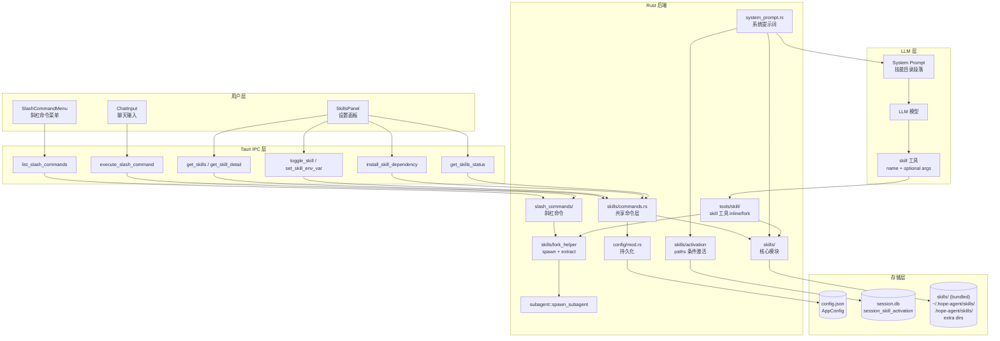

**关键文件：**

| 文件 | 职责 |
|------|------|
| `crates/ha-core/src/skills/` | 核心模块：类型定义、frontmatter 解析、requirements 检查、prompt 生成、缓存、健康检查、draft/auto-review |
| `crates/ha-core/src/skills/fork_helper.rs` | 共享 fork helper：`spawn_skill_fork` + `extract_fork_result`，两个激活入口都走它 |
| `crates/ha-core/src/skills/activation.rs` | `paths:` 条件激活：内存 cache + SQLite 持久化 + gitignore 匹配 |
| `crates/ha-core/src/skills/commands.rs` | Tauri / HTTP 共用 command-layer：列表、详情、启用禁用、env、安装、draft 审核、Quick Import 探测 |
| `crates/ha-core/src/tools/skill/` | `skill` 工具：`mod.rs` 分发 + `inline.rs` 读 SKILL.md + `fork.rs` 子 Agent 执行 |
| `src-tauri/src/commands/skills.rs` | 桌面 Tauri 命令薄壳：参数转换 + 调用 `ha_core::skills::commands` |
| `crates/ha-server/src/routes/skills.rs` | HTTP 路由薄壳：REST API + 远程安装 `allowRemoteInstall` 闸门 |
| `crates/ha-core/src/system_prompt/` | 系统提示词构建，调用 `build_skills_prompt(..., activated_conditional)` 注入技能段落 |
| `crates/ha-core/src/config/mod.rs` | `AppConfig` 持久化技能配置（budget/allowlist/disabled/env/auto-review/remote install） |
| `crates/ha-core/src/slash_commands/` | 斜杠命令系统，动态注册 user-invocable 技能为 `/skillname` 命令；fork 分支复用 `skills::spawn_skill_fork` |
| `crates/ha-core/src/subagent/` | 子 Agent spawn + `SubagentEvent.skill_name` 辨别字段 |
| `src/components/settings/skills-panel/` | 前端技能管理面板（列表 + 详情 + 安装 + env + draft 审核 + Quick Import） |
| `src/components/chat/SkillProgressBlock.tsx` | 对话流中 `skill` 工具的专用渲染器（琥珀 🧩 图标，inline/fork 自动区分） |

---

## 核心概念

### 技能（Skill）

一个技能是一个目录，至少包含一个 `SKILL.md` 文件：

```
~/.hope-agent/skills/
└── github/
    ├── SKILL.md          ← 必需：frontmatter + 指令
    ├── examples.sh       ← 可选：辅助脚本
    └── README.md         ← 可选：文档
```

### 技能来源（Source）

| 来源 | 路径 | 优先级 | 说明 |
|------|------|--------|------|
| Bundled | 应用内 `skills/` 目录 | 最低 | 随应用发行的内置技能 |
| Extra dirs | 用户通过 UI 导入的目录 | 低 | `config.json` 的 `extraSkillsDirs` |
| Managed | `~/.hope-agent/skills/` | 中 | 全局技能目录 |
| Project | `.hope-agent/skills/`（相对于 cwd） | 最高 | 项目级覆盖 |

高优先级来源的同名技能会覆盖低优先级的。

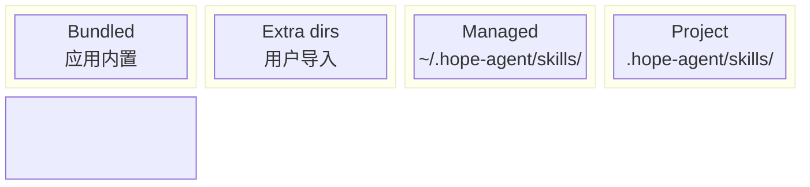

### 技能标识（Skill Key）

每个技能有两个标识：
- `name`：从 frontmatter 解析，用于 prompt 显示和命令名称
- `skill_key`：可选的自定义标识（frontmatter `skillKey:`），用于配置查找。默认等于 `name`

---

## SKILL.md 格式规范

### 基本格式

```markdown
---
name: github
description: "GitHub operations via the gh CLI. Use when working with issues, pull requests, releases, or repository metadata."
---

# GitHub Skill

When the user asks about GitHub operations, use the `gh` CLI.

## Available commands
- `gh pr list` — List pull requests
- `gh issue create` — Create an issue
- ...
```

### 字段来源与标准兼容

本节按 2026-04-26 核对过的上游文档划分字段来源，避免把 Hope Agent 的便利扩展误写成跨生态标准。

| 层级 | 上游来源 | 标准/约定字段 | Hope Agent 处理 |
|------|----------|----------------|-----------------|
| AgentSkills 开放标准 | [AgentSkills Specification](https://agentskills.io/specification) | `name`、`description` 必需；`license`、`compatibility`、`metadata`、实验性的 `allowed-tools` 可选 | `name` / `description` 是核心发现字段；`license` 用于展示；`metadata` 只解析已知 vendor 子集；`compatibility` 当前不参与运行时逻辑 |
| OpenAI Codex | [Codex Skills](https://developers.openai.com/codex/skills)、[openai/skills](https://github.com/openai/skills) | Codex 基于 AgentSkills；`SKILL.md` 里主要读取 `name` + `description` 做触发；`agents/openai.yaml` 承载 UI / policy / dependencies | 为最大可移植性，新 skill 应把触发信息优先写进 `description`。Hope Agent 当前不解析 `agents/openai.yaml` |
| Claude Code | [Claude Code Skills](https://code.claude.com/docs/en/skills) | 在 AgentSkills 上扩展 `when_to_use`、`argument-hint`、`arguments`、`disable-model-invocation`、`user-invocable`、`allowed-tools`、`model`、`effort`、`context`、`agent`、`hooks`、`paths`、`shell` | Hope Agent 实现其中一部分，并保留旧别名：`whenToUse` / `when-to-use` / `when_to_use`，`argumentHint` / `argument-hint` / `argument_hint`。新文档推荐上游 canonical 拼写 |
| OpenClaw | [OpenClaw Skills](https://docs.openclaw.ai/tools/skills) | `metadata.openclaw.requires`、`metadata.openclaw.primaryEnv`、`metadata.openclaw.always`、`metadata.openclaw.os`、`metadata.openclaw.install`、`homepage` 等 | 当前兼容子集：在顶层未声明时提升 `metadata.openclaw.requires` / `install`，读取 `always` / `primaryEnv` / `os` / `emoji`；根级 `always` / `primaryEnv` 是 Hope Agent 历史 shorthand，不是 OpenClaw 标准位置 |
| Hermes Agent | [Hermes Skills System](https://hermes-agent.nousresearch.com/docs/user-guide/features/skills)、[Creating Skills](https://hermes-agent.nousresearch.com/docs/developer-guide/creating-skills) | 顶层 `version` / `author` / `license` / `platforms`，`metadata.hermes.tags` / `related_skills` / toolset 条件 / config，`required_environment_variables` | 当前兼容子集：展示 `version` / `author` / `license`，把 `platforms` 映射到 OS requirements，读取 `metadata.hermes.tags` / `related_skills` / `emoji`，可提升 `requires` / `install`；toolset 条件和 secure setup 尚未实现 |

写新的一方 skill 时，默认遵循 **AgentSkills / OpenAI Codex 最小可移植集**：`name`、`description`、Markdown body，必要时加 `license` / `metadata`。只有确实依赖 Hope Agent 行为时，才使用 `requires`、`install`、`always`、`status` 等 Hope 扩展；只有为了导入兼容时，才依赖 `metadata.openclaw.*` / `metadata.hermes.*`。

### 完整 Frontmatter 字段

| 字段 | 类型 | 必需 | 默认值 | 说明 |
|------|------|------|--------|------|
| `name` | string | **是** | — | AgentSkills 标准必需。技能标识符，全局唯一；为最大兼容性，目录名也应等于 `name`。Hope 解析缺失或为空时整个 skill 不加载 |
| `description` | string | **标准必需** | `""` | AgentSkills / OpenAI Codex / Claude 都把它作为主要发现字段；应同时写清“做什么”和“什么时候用”。Hope 为容错允许缺失但不推荐 |
| `when_to_use` | string | 否 | — | Claude Code 扩展字段；Hope 也接受旧别名 `whenToUse` / `when-to-use`。写了之后 catalog 渲染为 `- name: <desc> — when: <when_to_use>`；不是 AgentSkills / OpenAI Codex 标准，跨生态时优先把触发语义放进 `description` |
| `aliases` | string[] | 否 | `[]` | 附加斜杠命令名（如 `[pr-review, reviewpr]`）。每个 alias 都注册到斜杠 catalog，与其他命令冲突时静默跳过，不覆盖 canonical name 或内置命令 |
| `skillKey` | string | 否 | 等于 `name` | 自定义配置查找键 |
| `always` | bool | 否 | `false` | **Hope Agent 扩展字段**。为 `true` 时跳过所有 requirements 检查；不代表不可关闭、不代表总是注入 prompt。UI 徽标显示为“跳过依赖检查” |
| `primaryEnv` | string | 否 | — | 主环境变量名，可被 skill apiKey 配置满足 |
| `user-invocable` | bool | 否 | `true` | 是否注册为斜杠命令 |
| `disable-model-invocation` | bool | 否 | `false` | 为 `true` 时不注入 prompt（仅用户可调用） |
| `command-dispatch` | string | 否 | — | 命令分发方式：`"tool"`（直接调工具）或 `"prompt"`（模板展开后发给 LLM） |
| `command-tool` | string | 否 | — | 当 `command-dispatch` 为 `"tool"` 时，绑定的工具名 |
| `command-arg-mode` | string | 否 | — | 参数传递模式。`"raw"` = 原样转发给工具；未设 = 尝试解析为 JSON，失败回退 `{"query": ...}` |
| `argument-hint` | string | 否 | `"[args]"` | Claude Code canonical 字段。Hope 兼容 `argumentHint` / `argument_hint` / `command-arg-placeholder` 旧拼写，用于 UI 斜杠菜单参数占位提示 |
| `command-arg-options` | string[] | 否 | — | 固定参数选项（斜杠菜单弹出下拉）|
| `command-prompt-template` | string | 否 | (body) | `command-dispatch: "prompt"` 时的模板字符串，支持 `$ARGUMENTS` 替换。未设时用 SKILL.md body |
| `allowed-tools` / `allowed_tools` | string[] | 否 | `[]` | AgentSkills 标为实验字段，Claude Code 语义是“预批准工具”而非硬禁用其它工具。Hope 当前在 `skill` 工具 fork 路径和子 Agent 中按硬白名单执行，斜杠 inline 和 `command-dispatch: tool` 未强制执行（见已知 Gap） |
| `context` | string | 否 | — | 执行模式。`"fork"` 在子 Agent 中跑，结果只回一段摘要；未设则 inline 执行 |
| `agent` | string | 否 | — | **仅 fork 模式生效**：指定 fork 时使用的 Agent id（`~/.hope-agent/agents/{id}/`）。无效 id 自动 fallback 到父 Agent 并记 warn |
| `effort` | string | 否 | — | **仅 fork 模式生效**：推理强度 `low` / `medium` / `high` / `xhigh` / `none`，映射到 provider 的 `reasoning_effort` 或 `thinking.budget_tokens` |
| `paths` | string[] | 否 | — | gitignore 风格模式（`*.py` / `docs/**/*.md`）。声明后技能**默认不进 catalog**，直到本会话触发到匹配文件才激活 |
| `status` | string | 否 | `"active"` | 生命周期：`active` / `draft` / `archived`；非 active 项对模型完全透明 |
| `authored-by` | string | 否 | `"user"` | 信息字段：`"user"`（人类作者）或 `"auto-review"`（auto_review 管线自动创建） |
| `rationale` | string | 否 | — | 自动创建时记录的理由，供 Draft 审核 UI 展示 |
| `license` | string | 否 | — | AgentSkills 标准可选字段；Hope 用于 UI 展示和 proprietary badge |
| `version` / `author` | string | 否 | — | Hermes / OpenAI skill catalog 常见展示字段；不会影响激活逻辑 |
| `metadata.openclaw.*` / `metadata.hermes.*` | object | 否 | — | 兼容 vendor skill 的子集：可提取 emoji/tags/related_skills，也可在顶层未声明时提升 OpenClaw/Hermes 的 requires/install；OpenClaw `always` / `primaryEnv` / `os` 会进入 requirements。不要把 Hope 的根级扩展误写成上游标准 |

### `requires:` 块

| 字段 | 类型 | 逻辑 | 说明 |
|------|------|------|------|
| `bins` | string[] | AND | 所有列出的二进制必须存在于 PATH |
| `anyBins` | string[] | OR | 至少一个列出的二进制存在即可 |
| `env` | string[] | AND | 所有列出的环境变量必须已设置且非空 |
| `os` | string[] | ANY | 支持的操作系统（`darwin`/`linux`/`windows`/`mac`/`macos`），空 = 全平台 |
| `config` | string[] | AND | 需要为 truthy 的配置路径（如 `webSearch.provider`） |

Hermes 顶层 `platforms: [macos, linux]` 会被映射到同一组 OS requirements；OpenClaw 的 `metadata.openclaw.os` 也会进入该检查。Windows 兼容 `windows` 与 OpenClaw 常见的 `win32`。

**示例 — 复合 requirements：**

```yaml
requires:
  bins: [git]
  anyBins: [rg, grep]
  env: [GITHUB_TOKEN]
  os: [darwin, linux]
  config: [webSearch.provider]
```

含义：需要 `git` 在 PATH，`rg` 或 `grep` 至少一个存在，`GITHUB_TOKEN` 已设置，运行在 macOS 或 Linux，且 webSearch provider 已配置。

### `install:` 块

声明依赖的安装方式，前端 SkillsPanel 会显示安装按钮。当前可执行的 `kind` 是 `brew` / `node` / `go` / `uv`；`download` 在类型注释里保留但执行层会返回 `Unsupported install kind`，不要在新 skill 里使用。

```yaml
install:
  - kind: brew
    formula: gh
    bins: [gh]
    label: "Install GitHub CLI via Homebrew"
    os: [darwin]
  - kind: node
    package: "@anthropic-ai/sdk"
    bins: [anthropic]
  - kind: go
    module: github.com/user/tool@latest
    bins: [tool]
  - kind: uv
    package: my-python-tool
    bins: [my-tool]
```

| `kind` | 必需字段 | 执行命令 |
|--------|---------|---------|
| `brew` | `formula` | `brew install {formula}` |
| `node` | `package` | `npm install -g {package}` |
| `go` | `module` | `go install {module}` |
| `uv` | `package` | `uv tool install {package}` |
| `download` | *(保留，不可执行)* | 当前会被拒绝：`Unsupported install kind: download` |

安装完成后自动验证 `bins` 中列出的二进制是否存在于 PATH。

---

## 技能发现与加载

### 发现流程

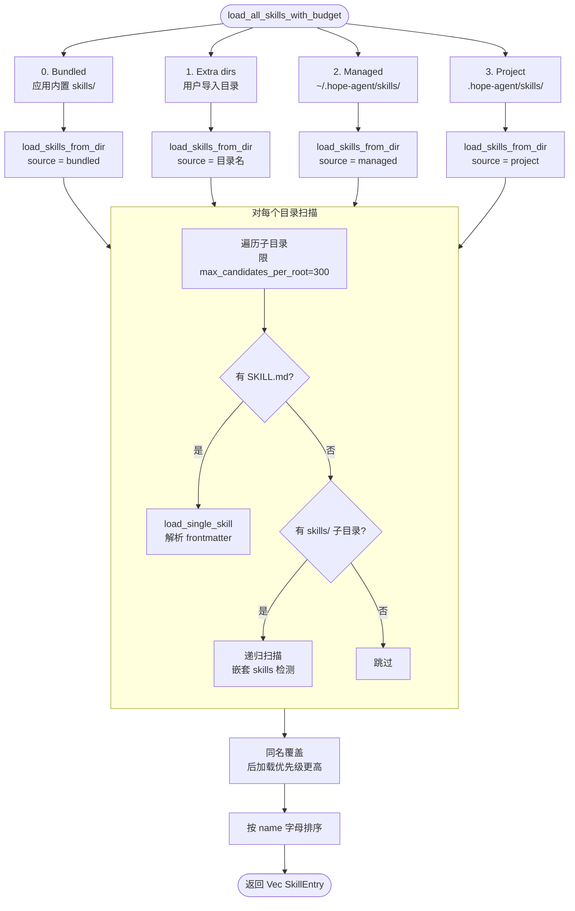

**优先级覆盖规则**：Project > Managed > Extra dirs > Bundled，高优先级的同名技能覆盖低优先级的。

### 嵌套目录检测

自动检测 `dir/skills/*/SKILL.md` 嵌套结构：

```
my-project/
├── plugin-a/
│   └── skills/          ← 自动发现
│       ├── skill-x/SKILL.md
│       └── skill-y/SKILL.md
└── plugin-b/
    └── skills/          ← 自动发现
        └── skill-z/SKILL.md
```

### 安全限制

| 限制 | 默认值 | 说明 |
|------|--------|------|
| `max_candidates_per_root` | 300 | 每个目录最多扫描的子目录数（防 DoS） |
| `max_file_bytes` | 256 KB | 单个 SKILL.md 最大文件大小 |
| `max_count` | 150 | prompt 中最多包含的技能数 |
| `max_chars` | 30,000 | prompt 技能段落最大字符数 |

---

## Requirements 检查

### 检查流程

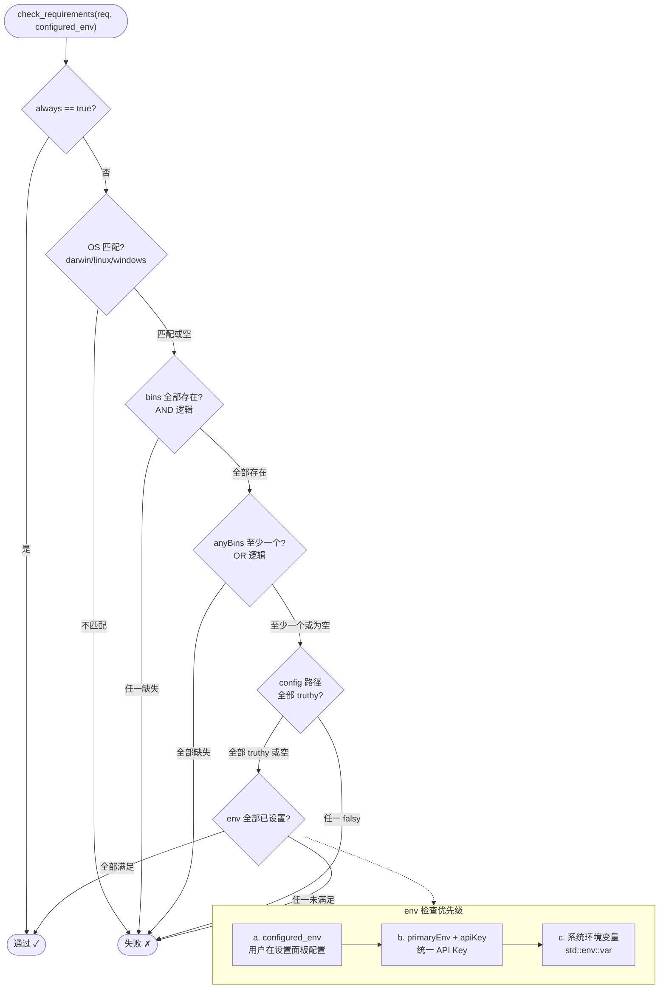

### `primaryEnv` 机制

当技能声明 `primaryEnv: MY_API_KEY` 且在 `requires.env` 中包含 `MY_API_KEY` 时，除了检查常规 env 配置外，还会检查是否通过 `__apiKey__` 字段配置了 API Key。这允许用户在设置面板中统一配置 API Key，而不需要单独设置每个环境变量。

### 详细诊断

```rust
check_requirements_detail(req, configured_env) -> RequirementsDetail {
    eligible: bool,
    missing_bins: Vec<String>,
    missing_any_bins: Vec<String>,
    missing_env: Vec<String>,
    missing_config: Vec<String>,
}
```

用于前端健康检查显示，明确告知用户缺少什么。

### `always: true` 的准确边界

`always` 这个字段历史上名字取得过宽，容易误解。当前实现的唯一强语义是：

```rust
if req.always {
    return true; // 跳过 OS / bins / anyBins / env / config 检查
}
```

它**不会**：

- 阻止用户在 Settings / 首次引导页里全局关闭该 skill
- 绕过 `AppConfig.disabled_skills`
- 绕过 Agent 级 `capabilities.skills.deny`
- 绕过 `status: draft|archived`
- 让声明了 `paths:` 的 skill 在未激活前进入 catalog

因此文案和 UI 统一称为“跳过依赖检查”。如果未来确实需要“不可关闭的系统技能”，应新增独立字段（例如 `locked: true` + 后端 `toggle_skill` 强制校验），不要复用 `always`。

---

## `skill` 工具与激活路径

### 为什么要专用工具

老设计让模型通过 `read SKILL.md` 来激活技能，内容作为 tool_result 堆积在主对话历史。多轮 exec 密集的技能（如 stlc-delivery）会反复 read references + 触发大量 exec tool_result，累加几十 KB 进主 context，`context: fork` 也只在 `/skill-name` 斜杠命令路径生效。

对齐 Claude Code 的 `SkillTool`，Hope Agent 引入**专用 `skill` 工具**作为模型自主激活 skill 的主入口：

- 工具名：`skill`，内置在 [`crates/ha-core/src/tools/skill/`](../../crates/ha-core/src/tools/skill/)
- 入参：`{ name: string, args?: string }`
- 工具执行层统一分发 **inline / fork**，`context: fork` 在斜杠命令和模型自主两条路径**都生效**
- 标记 `internal: true + always_load: true`：跳过审批、deferred_tools 场景也恒定可见
- 系统提示词明确引导"用 `skill` 工具，不要 `read` SKILL.md"；`read` 仍可用于作者查看 / diff 原文

**查找边界**：`skill` 工具内部用 `get_invocable_skills(extra_dirs, disabled_skills)` 查找，这会过滤全局禁用、`user-invocable: false` 和 `status != active`，但不会再次执行 requirements 检查。Requirements 主要在 prompt 注入与健康检查阶段生效。

### 工具 schema

```jsonc
{
  "name": "skill",
  "description": "Activate a skill from the skill catalog by name. Preferred over `read`-ing the SKILL.md file directly ...",
  "parameters": {
    "type": "object",
    "properties": {
      "name": {
        "type": "string",
        "description": "Skill name as shown in the skill catalog"
      },
      "args": {
        "type": "string",
        "description": "Optional arguments. Replaces `$ARGUMENTS` in SKILL.md for inline skills; becomes the task description for fork skills."
      }
    },
    "required": ["name"]
  }
}
```

### Dispatch 流程

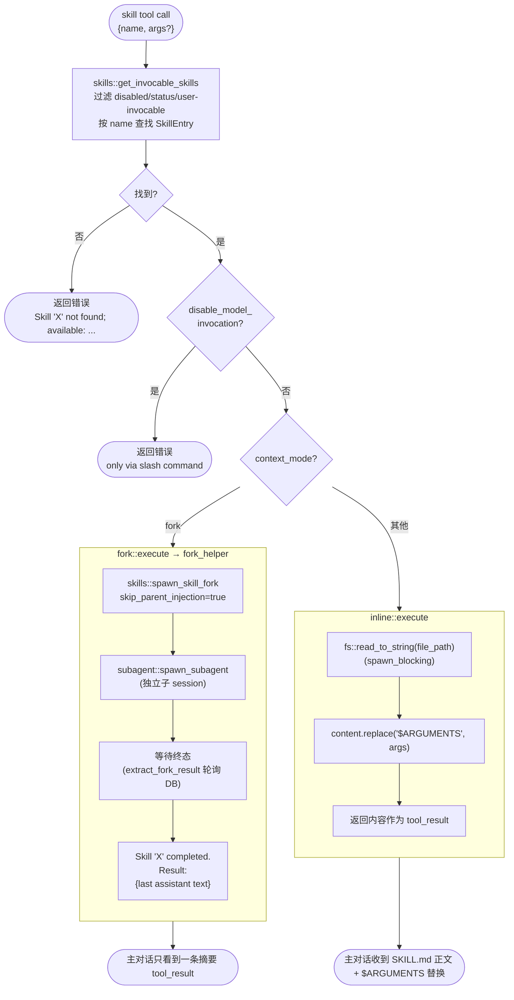

### 两条入口共享 helper

`skills::fork_helper::spawn_skill_fork` 是**唯一的 fork 入口点**，保证斜杠命令路径和 `skill` 工具路径零漂移：

```rust
// crates/ha-core/src/skills/fork_helper.rs
pub async fn spawn_skill_fork(
    skill: &SkillEntry,
    args: &str,
    parent_session_id: &str,
    parent_agent_id: &str,
    skip_parent_injection: bool,  // true for skill tool, false for slash
) -> Result<String>;              // returns run_id

pub async fn extract_fork_result(
    run_id: &str,
    skill_name: &str,
) -> Result<String>;               // polls DB, returns "Skill 'X' completed.\n\n..."
```

- **Skill 工具路径**：`skip_parent_injection=true` + `extract_fork_result` 同步阻塞到终态 → 把摘要作为 tool_result 返回给主对话。整个子 Agent transcript **不**通过 EventBus injection 推回主对话（去污染核心点）
- **斜杠命令路径**：`skip_parent_injection=false` → 通过现有 EventBus injection 机制把结果作为新 user message 注入主对话（保留现有 UX）。`CommandResult.action: SkillFork { run_id, skill_name }` 让前端订阅进度

### Inline 与 Fork 对比

| 维度 | Inline（默认） | Fork（`context: fork`） |
|------|-----------------|--------------------------|
| 执行载体 | 主对话 LLM | 独立子 Agent 会话 |
| 主对话看到 | 完整 SKILL.md 内容 + $ARGUMENTS 替换 | 一条 `Skill 'X' completed.\n\nResult:\n<text>` 摘要字符串 |
| `allowed-tools` | `skill` 工具路径走 `ToolExecContext.skill_allowed_tools` 过滤；**斜杠内联路径目前未过滤**（已知 gap，见下） | 应用到子 Agent 的 `skill_allowed_tools` |
| 适合场景 | 短指令、需用户中途介入、作者希望模型看到完整内容 | 多轮 exec 密集、产出可自包含总结、避免污染主 context |
| tool_result 大小 | 等于 SKILL.md 正文 | ≤ `MAX_RESULT_CHARS = 64 KB`（超长截断） |
| Prompt cache | 复用主对话前缀（无成本开销） | 子 Agent 独立上下文（可能有独立 cache miss） |

### 斜杠命令的 Inline 内联路径

当用户打 `/skillname [args]` 且 skill 不是 `context: fork` 且没有 `command-prompt-template`，走这条路径：[`slash_commands/handlers/mod.rs`](../../crates/ha-core/src/slash_commands/handlers/mod.rs) 的 `_` 分支调 [`tools::skill::inline::execute(&entry, args)`](../../crates/ha-core/src/tools/skill/inline.rs)（与模型调 `skill` 工具完全同一函数）拿到 SKILL.md 全文 + `$ARGUMENTS` 替换后，包进如下格式的 `PassThrough` 消息：

```
[SYSTEM: The user has invoked the '<name>' skill via slash command with arguments: "<args>".
 Follow the instructions in the skill content below without calling `read` or `tool_search` —
 the full skill is already loaded.]

---

<SKILL.md 全文>
```

前端通过 `handleSend(expandedMessage, { displayText: "/skillname args" })` 送出：
- UI user 气泡显示原始 `/skillname args`
- LLM 收到 `expandedMessage`（含 SKILL.md 全文）
- DB `messages.content` 持久化 `displayText`（重载保持原命令显示）
- Agent `save_agent_context` 的 conversation_history JSON 保留 `expandedMessage`（LLM 上下文连贯）

**设计出发点**：老版本发 `"Read the skill file at /path/SKILL.md"`——deferred tools 场景下 `read` 不在初始 schema，LLM 会先调 `tool_search` 找 `read`，多一轮浪费。参照 Claude Code 的 `SkillTool` 直接返回 SKILL.md 内容 + Hermes Agent 的 `[SYSTEM: skill loaded]` 头部标记，Hope Agent 采用同源做法，同时与模型主动调 `skill` 工具路径字节级等价。

**Fallback**：读 SKILL.md 失败时（权限 / 路径错 / IO 故障）降级回老的路径指针 prompt，不阻断聊天。

#### 已知 Gap

1. **`allowed-tools` 未全路径过滤**：`skill` 工具 fork 路径和子 Agent 会把 allowed-tools 通过 `ToolExecContext.skill_allowed_tools` 贯通到执行层收紧工具白名单；斜杠内联路径目前只把 SKILL.md 作为 user message 注入，LLM 后续仍握有 Agent 的全部工具。`command-dispatch: tool` 直接执行绑定工具时也未套用 skill 的 allowed-tools
2. **`requires` 只管注入，不管执行**：prompt 注入和健康检查会 `check_requirements`，但 `skill({name})` 与 `/skillname` 执行路径不会再次校验 env / bins / os / config。通常模型看不到未满足 requirements 的 skill，但用户手输或模型猜中名称时仍可能激活
3. **Learning Tracker 未埋点**：缺 `record_learning_event(SkillUsed)` 调用，Dashboard Top Skills 会低报斜杠触发的激活
4. **SKILL.md 大小无上限**：极端大 skill（≥50KB）内联后会占用相当 token；目前未加保护

更彻底的方案是把斜杠激活的 SKILL.md 作为**一次性 system-prompt 追加**（经 `ChatEngineParams.extra_system_context` 送入，Plan Mode 就是这么用的），同轮结束后不进 conversation_history；同时在 `ChatEngineParams.skill_allowed_tools` 收紧工具。Gap 1 + 2 + 4 可用同一改动一并解决，后续如需优化按此方向走。

---

## Fork 执行：`context: fork` + `agent:` + `effort:`

### 数据流

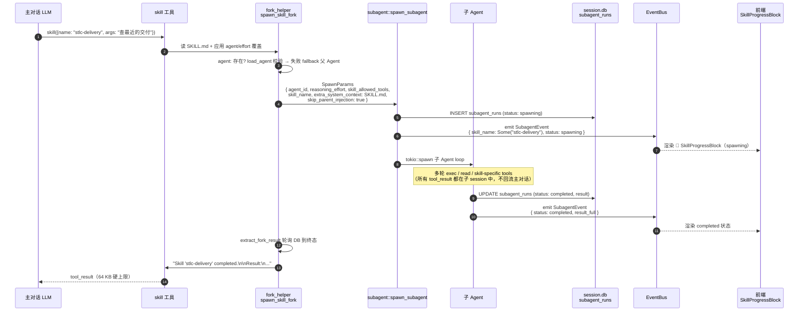

### `agent:` 路由

指定 fork 时使用的子 Agent 身份（含独立 system prompt / SOUL.md / tool filter）。

```rust
// fork_helper.rs::spawn_skill_fork 中
let resolved_agent = match skill.agent.as_deref() {
    Some(id) if !id.is_empty() => match crate::agent_loader::load_agent(id) {
        Ok(_) => id.to_string(),
        Err(e) => {
            app_warn!(
                "skill", "agent",
                "Skill '{}' declares agent '{}' which is not loadable ({}); \
                 falling back to parent agent",
                skill.name, id, e
            );
            parent_agent_id.to_string()
        }
    },
    _ => parent_agent_id.to_string(),
};
```

**关键点：**

- `agent_id` 直接复用现有 `subagent::spawn_subagent` 的 `agent_loader::load_agent` 链路，**无需扩展 SpawnParams**
- 失败 fallback：不阻塞执行，warn 日志提示作者检查 id
- 典型用途：让一个自包含的 skill 跑在专门调校的 Agent 下（如 `code-reviewer` 主打低温度 + 代码审查 persona）

### `effort:` 路由

指定 fork 时的推理 / 思考强度。值域 `low | medium | high | xhigh | none`。

```rust
// SpawnParams.reasoning_effort: Option<String> 透传到子 Agent chat 调用
agent.chat(
    &task,
    &attachments,
    params.reasoning_effort.as_deref(),  // ← fork 时由 skill.effort 填充
    cancel_clone,
    |_delta| {},
).await
```

**Provider 消费点**（零改动，复用现有 `reasoning_effort` 管线）：

| Provider | 消费方式 |
|----------|---------|
| Anthropic | `map_think_anthropic_style` 映射到 `thinking: { type, budget_tokens }` |
| OpenAI Chat | `apply_thinking_to_chat_body` 注入 `reasoning_effort` |
| OpenAI Responses | `reasoning.effort` 字段 |
| Codex | 与 Responses 同构 |

### `skip_parent_injection=true` 的关键意义

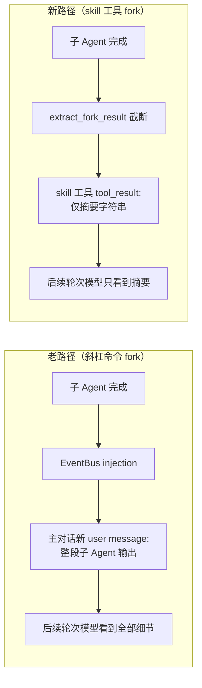

这是 Phase 1 改造的**核心价值**：把 fork skill 从"隔离执行但结果回灌主对话"升级为"隔离执行 + 隔离结果"，让主对话 context 真正只长 1 条 tool_use + 1 条摘要 tool_result。

### 超时与终态

- **子 Agent 超时**：`SpawnParams.timeout_secs = 600`（10 分钟，skill fork 专用值）。超时后状态转 `Timeout`，`extract_fork_result` 返回 `[Skill timed out]`
- **外层轮询硬上限**：`extract_fork_result` 自身 15 分钟兜底，避免 DB race / 子任务异常导致无限阻塞；超过时返回提示字符串 + 不阻塞主对话
- **终态映射到 tool_result**：

| 子 Agent 状态 | 主对话看到的 tool_result |
|--------------|-------------------------|
| `Completed` | `Skill 'X' completed.\n\nResult:\n<assistant text>` |
| `Error` | `[Skill failed: <reason>]` |
| `Timeout` | `[Skill timed out]` |
| `Killed` | `[Skill cancelled]` |

---

## `paths:` 条件激活

### 设计动机

某些 skill 只在特定文件类型的任务里有用（如"py-helper"只在触发 `*.py` 时需要）。把它们**常驻**在 catalog 里浪费系统提示词 tokens，移出又让模型发现不到。

对标 Claude Code 的 `paths:` frontmatter：**声明模式 → 默认隐藏 → 本会话触发匹配文件后动态加入**，一旦激活就保留整会话（压缩免疫），不同会话互不干扰。

### 数据模型

**两层存储：**

| 层 | 位置 | 用途 |
|----|------|------|
| 进程内热缓存 | `static ACTIVATED_CONDITIONAL: Mutex<HashMap<String, HashSet<String>>>` | key=session_id，value=已激活 skill 名集合；每轮 prompt 构建读 |
| SQLite 持久化 | `session.db` 表 `session_skill_activation(session_id, skill_name, activated_at)` | App 重启恢复；session 删除级联清理 |

启动时懒加载（首次访问某 session_id 才从 DB 读入内存），写入同时持久化 DB + 更新 hot cache。

**API**（在 [`crates/ha-core/src/skills/activation.rs`](../../crates/ha-core/src/skills/activation.rs)）：

```rust
pub fn activate_skills_for_paths(
    session_id: &str,
    touched: &[String],   // 本次工具调用触发的路径
    cwd: &str,
    skills: &[SkillEntry],
) -> Vec<String>;          // 返回本次新激活的 skill 名

pub fn activated_skill_names(session_id: &str) -> HashSet<String>;

pub fn clear_session_activation(session_id: &str);   // session 删除时调
pub fn reset_activation_cache();                     // skill 目录变更时保守清空
```

### 激活触发时机

钩子挂在 `tools/execution.rs::maybe_activate_conditional_skills`，dispatch 前执行：

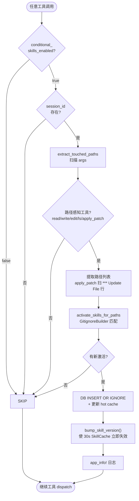

**关键点：**

- 每次**路径感知工具**调用都会扫描 args 里的 `path` / `file_path` / patch 正文 `*** Update File: xxx` 行
- 多条路径批量匹配；一次触发可同时激活多个 `paths:` 命中的 skill
- `bump_skill_version()` 让下一轮系统提示词立即包含新激活的 skill（不等 30s TTL 过期）
- 未激活的 `paths:` skill 仍在 `SkillCache.entries` 里，只是 `build_skills_prompt` 过滤掉；激活后同一份数据直接可见

### Prompt 注入过滤

`build_skills_prompt` 签名加了 `activated_conditional: &HashSet<String>` 参数，新增一层过滤：

```rust
.filter(|s| match &s.paths {
    Some(p) if !p.is_empty() => activated_conditional.contains(&s.name),
    _ => true,  // 无 paths 字段 = 全局可见（行为不变）
})
```

系统提示词装配链全链路透传 session_id：

```
build_system_prompt_with_session(..., session_id)
    → system_prompt::build(..., session_id)
      → build_skills_section(filter, env_check, session_id)
        → skills::activated_skill_names(session_id)
          → build_skills_prompt(..., &activated_set)
```

Legacy / breakdown 路径（无 session 上下文）传 `None`，对应空集——`paths:` skill 永远不在 legacy prompt 里显示。

### 匹配引擎

使用已是 workspace 依赖的 `ignore = "0.4.25"` 的 `GitignoreBuilder`，与 Claude Code 的 `ignore()` 行为一致：

```rust
let matcher = GitignoreBuilder::new(base)
    .add_line(None, "*.py")
    .add_line(None, "docs/**/*.md")
    .build()?;
```

**路径归一化：**

- 相对路径：拼到 `cwd`（从 `ctx.home_dir` 或 `.`）作为绝对路径
- 绝对路径：先 `strip_prefix(base)` 尝试转相对；若在 cwd 之外，走 `matcher.matched(abs, false)` 直接匹配（避免 `matched_path_or_any_parents` 对不在 base 下的路径 panic）
- 目录 / 文件：hook 点永远传 `is_dir=false`（read/write/edit/apply_patch/ls 都是文件级操作）

### 清理时机

| 事件 | 动作 |
|------|------|
| Session 删除 | `delete_session()` 里调 `DELETE FROM session_skill_activation WHERE session_id = ?` + `clear_session_activation()` |
| Skill 目录变动（`bump_skill_version()` 被其他原因触发） | `reset_activation_cache()` 清空 hot cache（保守策略，避免引用已删除的 skill）；下次读时从 DB 重新 hydrate |
| App 重启 | DB 行保留，hot cache 空，首次访问 session 懒加载 |
| 压缩（Tier 2/3/4） | **不影响**——激活集合按 session_id 存，压缩只改 messages，不触这张表（压缩免疫语义） |

### Kill switch

`AppConfig.conditional_skills_enabled: bool`（默认 `true`）。设为 `false` 时 `maybe_activate_conditional_skills` 直接 no-op，所有 `paths:` skill 保持"默认隐藏"状态（不会激活、不会常驻注入）——这是紧急停用条件激活机制的开关，不是把 `paths:` 技能改成全局可见。

### 用法示例

```yaml
---
name: py-type-helper
description: Python type annotation guidance
context: fork
paths:
  - "*.py"
  - "pyproject.toml"
allowed-tools: [read, grep, edit]
---
```

- 全新会话启动：系统提示词 **不包含** `py-type-helper`
- 用户问"帮我重构这个函数" + 模型调 `read({ path: "src/main.py" })`
- `maybe_activate_conditional_skills` 匹配 `*.py` → 激活 `py-type-helper`
- 下一轮 prompt 包含 `py-type-helper` 的条目；模型可调 `skill({ name: "py-type-helper" })` 进入 fork


### 懒加载模式

系统提示词中仅注入技能**目录**（名称 + 描述），激活方式从 `read SKILL.md` 升级为**专用 `skill` 工具**：

```
The following skills provide specialized instructions for specific tasks.
Use the `skill` tool to activate a skill by name — e.g.
`skill({ name: "<skill-name>", args: "<optional>" })`.
Do NOT `read` SKILL.md files to activate a skill; the `skill` tool handles loading,
argument substitution, and (for `context: fork` skills) sub-agent isolation.
Only activate the skill most relevant to the current task — do not activate more than one up front.

- github: GitHub operations via gh CLI — when: user mentions PR status, CI checks, issues
- docker: Container management
- ...
```

当 skill 声明了 `when_to_use` frontmatter 字段时，catalog 行渲染为
`- name: <description> — when: <when_to_use>`；未声明则回退到 `- name: <description>`。
拆分的好处：`description` 可以保持短（"这是什么"），触发判断落在 `when_to_use` 里。注意：这是 Claude Code 扩展，不是 AgentSkills / OpenAI Codex 标准；写跨生态 skill 时仍应把关键触发语义前置到 `description`。
（"什么时候用"），不需要为了触发率把两件事塞进同一句，也能减小 full format 超出
`max_chars` 触发降级的概率。

**为什么不再在 catalog 里暴露文件路径：**

1. `skill` 工具按 name 查找，不需要模型知道磁盘路径
2. 每个条目节省约 5–6 tokens × 150 技能 = ~750-900 tokens
3. 避免模型把路径当成参数传到其他工具里（曾经的一类幻觉）

LLM 根据用户请求和 description 判断需要哪个技能，调 `skill` 工具激活；inline 模式返回 SKILL.md 内容作为 tool_result，fork 模式返回摘要字符串（详见 [`skill` 工具章节](#skill-工具与激活路径)）。

### 三层渐进降级

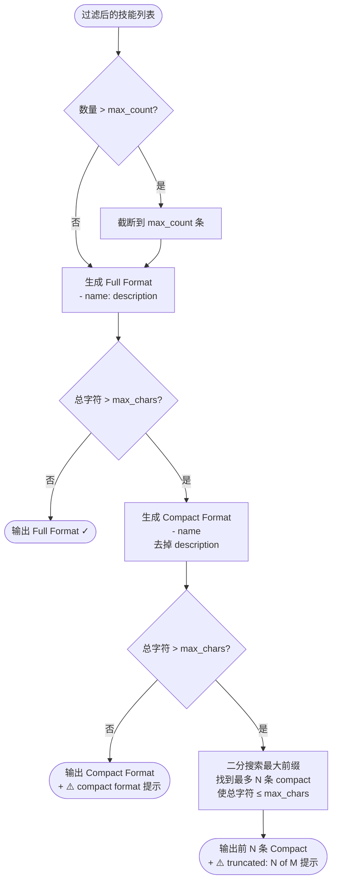

**路径不再注入：**`compact_path()` 辅助函数仍保留（日志 / 调试 / 测试用，标记 `#[allow(dead_code)]`），但 catalog 条目已改为 `- name: description`（full）或 `- name`（compact），不含 `(read: path)` 后缀。

### 过滤管道

技能从发现到注入 prompt 经过多层过滤。实现上 Agent 过滤发生在 `system_prompt::sections::build_skills_section`，其余过滤发生在 `skills::prompt::build_skills_prompt`：

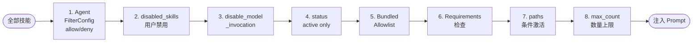

**每层语义：**

| 层 | 过滤规则 |
|----|----------|
| 1. Agent FilterConfig | 当前 Agent `capabilities.skills.allow/deny` |
| 2. disabled_skills | `AppConfig.disabled_skills` 显式禁用列表 |
| 3. disable_model_invocation | `disable-model-invocation: true` 只允许用户 `/command` |
| 4. status | 只保留 `SkillStatus::Active`；`Draft` / `Archived` 对模型透明（Draft 由用户在设置面板审核后转 Active）|
| 5. Bundled Allowlist | `AppConfig.skill_allow_bundled` 非空时限制 bundled 来源 |
| 6. Requirements | `bins` / `anyBins` / `env` / `os` / `config`；`always: true` 表示跳过本层检查 |
| 7. paths 条件激活 | 声明 `paths:` 的 skill 必须在 `activated_skill_names(session_id)` 里 |
| 8. max_count | `skillPromptBudget.maxCount` 数量上限（默认 150）|

剩余的技能进入三层降级格式化（full → compact → truncated）。

---

## 调用策略

每个技能有两个独立的调用控制开关：

| 字段 | 默认值 | 作用 |
|------|--------|------|
| `user-invocable` | `true` | 控制是否注册为斜杠命令（`/skillname`） |
| `disable-model-invocation` | `false` | 控制是否从 prompt 中隐藏 |

**四种组合：**

| user-invocable | disable-model-invocation | 效果 |
|----------------|--------------------------|------|
| `true` | `false` | 默认：用户可 `/command`，模型也能看到 |
| `true` | `true` | 仅用户可调用，模型看不到 |
| `false` | `false` | 仅模型可用，不注册为命令 |
| `false` | `true` | 完全不可用（相当于禁用） |

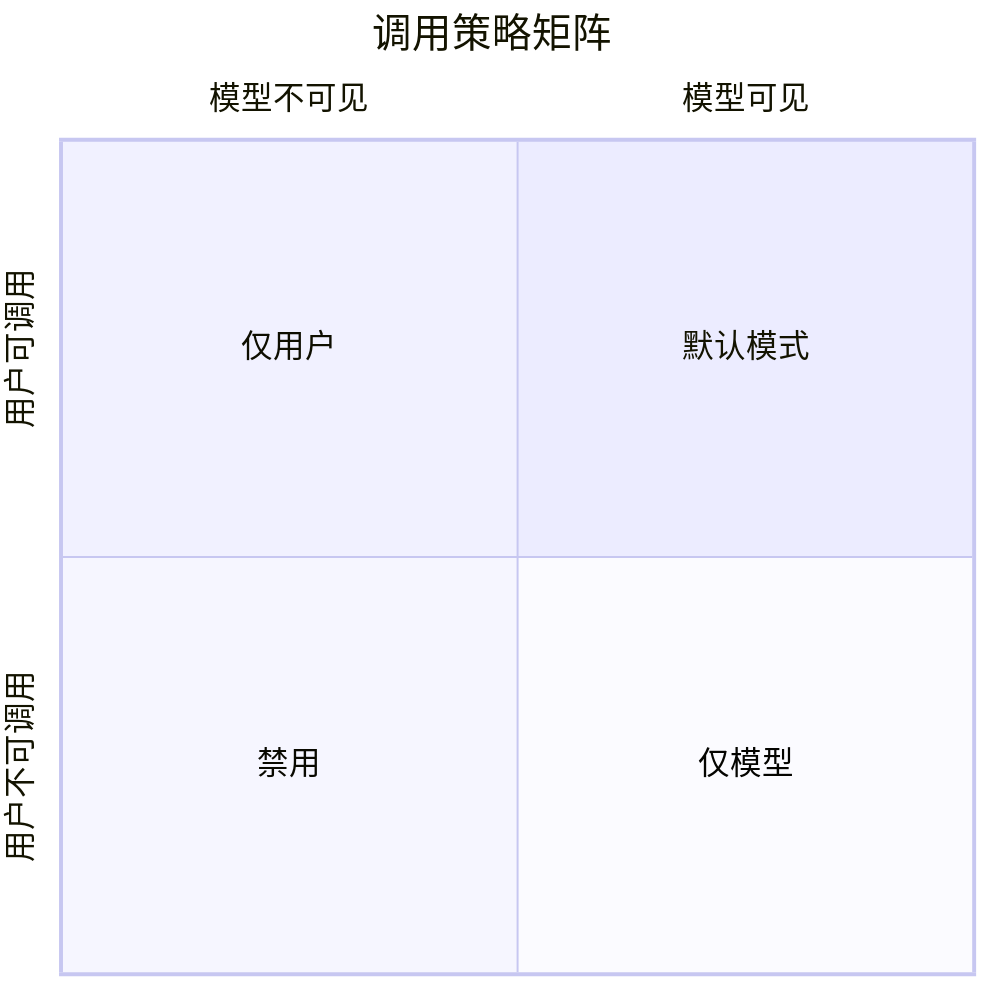

---

## 安装引导

### 后端执行

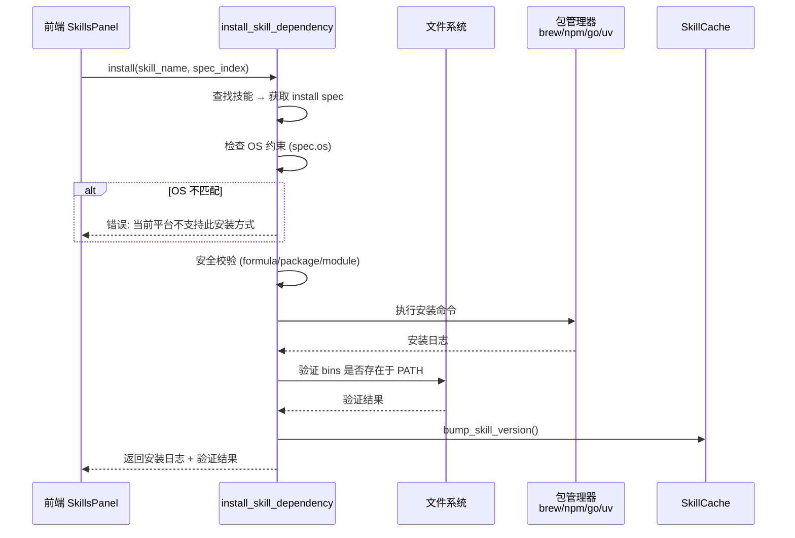

### 安全校验

- Brew formula：不允许 `..`、`\`、以 `-` 开头
- npm package：不允许 `..`、`\`
- Go module：不允许 `..`、`\`
- OS 约束：只在匹配当前平台时执行

### 前端 InstallSpecRow 组件

每个安装 spec 显示为一行：

```
[brew] Install GitHub CLI via Homebrew     [安装]
[node] @anthropic-ai/sdk                   [安装成功 ✓]
```

按钮有三态：默认 → 安装中(旋转) → 成功(绿色)/失败(红色)。

---

## Skill 与斜杠命令统一

### 动态注册

所有 `user-invocable` 的技能自动注册为 Skill 分类的斜杠命令：

```
/github [args]     ← 技能 "github" 自动注册
/slack [args]      ← 技能 "slack" 自动注册
```

声明了 `aliases: [...]` 的技能会额外注册 alias 条目，每个 alias 都是同一个 skill 的独立入口：

```yaml
# skill frontmatter
name: review-pr
aliases: [pr-review, reviewpr]
```

```
/review-pr   ← canonical
/pr-review   ← alias 1
/reviewpr    ← alias 2
```

三个命令任何一个触发都跑同一个 skill，`SkillsPanel` 显示一次，斜杠菜单显示三条。

### 命令名称规范化

```
原始名称          →  命令名称
github            →  github
my-cool-skill     →  my_cool_skill
My Cool Skill!    →  my_cool_skill
---test---        →  test
(空)              →  skill
abcde...(50字符)  →  截断到 32 字符
```

Alias 走**完全相同**的 normalize 函数，所以 `pr-review` 和 `pr_review` 在 catalog 里会冲撞——后到者静默跳过。

### 冲突解决

```
canonical name 与内置命令冲突 → 加 _skill 后缀：  model → model_skill
canonical name 与其他 skill 冲突 → 加数字后缀：  test → test_2 → test_3
alias 与已有任何命令冲突 → 静默跳过（不覆盖，不报错）
```

Alias 设计为"锦上添花"，不抢 canonical 的坑位；如果 alias 冲撞，作者应该改名或删除，系统不会自动重命名。

### 命令执行流程

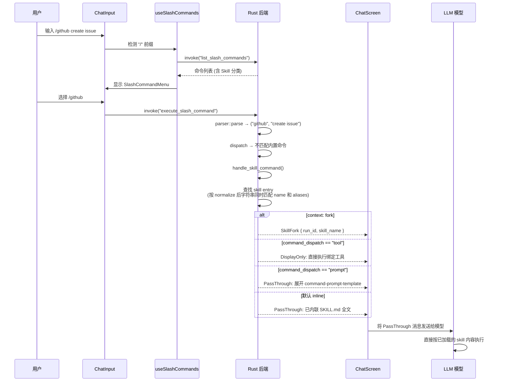

当 `command-dispatch: tool` + `command-tool: exec` 时，后端直接执行绑定工具并返回 `DisplayOnly`，不再多走一轮 LLM。`command-arg-mode: raw` 会把原始参数包装成 `{ "command": "<args>" }`；否则先尝试把参数解析为 JSON，失败后包装成 `{ "query": "<args>" }`。

### 前端菜单

`SlashCommandMenu` 在 `CATEGORY_ORDER` 末尾显示 Skill 分类：

```
── Session ──
/new          Start a new chat
/clear        Clear conversation
── Model ──
/model        Switch model
── Skill ──                    ← 新增分类
/github       GitHub operations via gh CLI
/slack        Slack messaging
```

技能命令使用 `descriptionRaw` 直接展示描述（无需 i18n key）。

---

## 缓存与版本追踪

### 版本机制

```rust
static SKILL_CACHE_VERSION: AtomicU64 = AtomicU64::new(0);

pub fn bump_skill_version() {
    SKILL_CACHE_VERSION.fetch_add(1, Ordering::Relaxed);
}
```

以下操作会触发版本递增：
- `toggle_skill` — 启用/禁用技能
- `set_skill_env_var` / `remove_skill_env_var` — 修改环境变量
- `add_extra_skills_dir` / `remove_extra_skills_dir` — 修改技能目录
- `set_skill_env_check` — 修改环境检查开关
- `install_skill_dependency` — 安装依赖
- **`activate_skills_for_paths` 命中新 `paths:` skill** — 让新激活的技能立即出现在下一轮 prompt 中（不等 30s TTL）

### SkillCache

```rust
pub struct SkillCache {
    pub entries: Vec<SkillEntry>,
    pub version: u64,
    pub loaded_at: Instant,
    pub extra_dirs: Vec<String>,
}
```

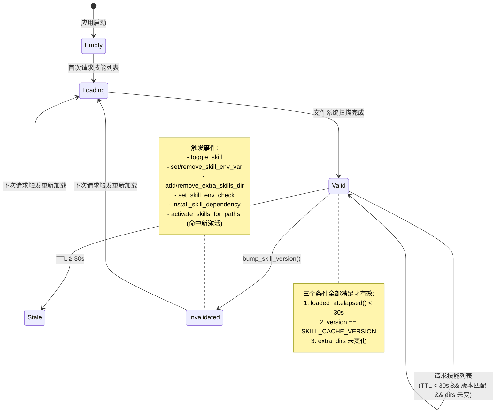

### 两套缓存并行

Phase 4 起，skill 系统同时维护两套独立缓存，互不污染：

| 缓存 | 键 | TTL / 失效条件 | 存储位置 |
|------|----|---------------|---------|
| `SkillCache` | 全局单实例 | 30s TTL + `SKILL_CACHE_VERSION` + `extra_dirs` hash | 进程内存 |
| `ACTIVATED_CONDITIONAL` | `session_id` | 无 TTL；session 删除 / skill 目录变动时清理 | 进程内存 + `session.db.session_skill_activation` 表持久化 |

**为什么不共用**：`SkillCache` 是全局目录扫描结果（所有 session 共享），`ACTIVATED_CONDITIONAL` 是 per-session 动态激活状态（每个 session 独立）。合并会让 TTL 语义模糊 + 多 session 互相污染。

---

## 健康检查

### SkillStatusEntry

```rust
pub struct SkillStatusEntry {
    pub name: String,
    pub source: String,
    pub eligible: bool,          // 综合判断：可用
    pub disabled: bool,          // 被用户禁用
    pub blocked_by_allowlist: bool, // 被 bundled allowlist 阻止
    pub missing_bins: Vec<String>,  // 缺失的 bins
    pub missing_any_bins: Vec<String>, // anyBins 全部缺失时列出
    pub missing_env: Vec<String>,   // 缺失的环境变量
    pub missing_config: Vec<String>, // 缺失的配置路径
    pub has_install: bool,       // 是否有安装引导
    pub always: bool,            // 是否跳过依赖检查
}
```

### 前端状态徽章

SkillsPanel 列表中每个技能显示状态标签：

| 条件 | 标签 | 颜色 |
|------|------|------|
| `always == true` | "跳过依赖检查" | 绿色 |
| `has_install == true` | "安装" | 蓝色 |
| `disable_model_invocation == true` | "模型可调用: ✗" | 橙色 |
| env 未配置 | ⚠️ 图标 | 橙色 |

---

## 配置项

### config.json（AppConfig）

```jsonc
{
  // 技能目录
  "extraSkillsDirs": ["/path/to/extra/skills"],
  // 禁用的技能名列表
  "disabledSkills": ["skill-name"],
  // 是否检查 requirements（默认 true）
  "skillEnvCheck": true,
  // paths: 条件激活 kill switch（默认 true）
  // false 时不再根据文件路径激活 paths: skill；它们会保持隐藏
  "conditionalSkillsEnabled": true,
  // 用户配置的技能环境变量
  "skillEnv": {
    "github": {
      "GITHUB_TOKEN": "ghp_xxxx..."
    }
  },
  // Prompt 预算配置
  "skillPromptBudget": {
    "maxCount": 150,
    "maxChars": 30000,
    "maxFileBytes": 262144,
    "maxCandidatesPerRoot": 300
  },
  // Bundled 技能允许列表（空 = 全部允许）
  "skillAllowBundled": [],
  // Skills 子配置：自动 review / HTTP 远程安装闸门
  "skills": {
    "allowRemoteInstall": false,
    "autoReview": {
      "enabled": true,
      "promotion": "draft",
      // Gate 1 — trigger
      "cooldownSecs": 900,
      "tokenThreshold": 12000,
      "messageThreshold": 20,
      "toolUseThreshold": 3,
      "correctionSignalEnabled": true,
      "requireToolUse": true,
      // Gate 2 — pre-LLM heuristics
      "minMessageCount": 4,
      "discardBlacklistDays": 30,
      // Gate 3 — LLM review
      "topKForDedup": 5,
      "reviewModel": null,
      "candidateLimit": 24,
      "timeoutSecs": 90,
      "reviewSystemOverride": null,
      "extraRejectCategories": [],
      // Gate 4 — self-score floor
      "minReuseProbability": 0.7,
      // Gate 5 — post-LLM lint
      "sessionRecapThreshold": 2,
      "minSteps": 2,
      "maxSteps": 12,
      // Curator (manual + optional periodic)
      "autoCuratorEnabled": false,
      "autoCuratorIntervalDays": 7,
      // Learning-event retention
      "retentionDays": 180
    }
  }
}
```

### 自动审核：五道瀑布过滤

每次 chat 收尾后，auto-review 管线按下面五道闸串行处理；任意一道判 skip 都会写入 `learning_events.kind='skill_review_skipped'`，UI 的 "最近的拒绝原因" 卡片就靠这条流。

```
[闸 1 触发器] → [闸 2 启发式 gate] → [闸 3 LLM 审核 + dedup] → [闸 4 自评分硬阈值] → [闸 5 后置 lint] → 落盘 draft / patch existing
```

- **闸 1（[`triggers.rs`](../../crates/ha-core/src/skills/auto_review/triggers.rs)）**：[`TriggerSignals { turn_tokens, new_messages, tool_use_count, user_correction }`](../../crates/ha-core/src/skills/auto_review/triggers.rs)。默认 `requireToolUse=true` —— 纯聊天对话 `tool_use_count=0` 永远不触发；`tool_use_count ≥ toolUseThreshold` 是主入口；`correctionSignalEnabled=true` 时连发两条用户消息（< 30s）也独立触发。
- **闸 2（[`heuristics::pre_gate`](../../crates/ha-core/src/skills/auto_review/heuristics.rs)）**：消息条数低于 `minMessageCount` 直接 skip；最近 `discardBlacklistDays` 天内被用户 discard 的草稿主题（按 description 做 overlap-coefficient 相似度匹配）直接 skip。`delete_skill` 会把当时的 description 写到 `learning_events.meta_json`，所以中英文题目都能匹配。
- **闸 3（[`pipeline.rs`](../../crates/ha-core/src/skills/auto_review/pipeline.rs) + [`prompts.rs`](../../crates/ha-core/src/skills/auto_review/prompts.rs)）**：内置 prompt 列出 6 类禁拍（`ENV-FAILURE` / `NEGATIVE-CLAIM` / `TRANSIENT-ERROR` / `ONE-OFF-TASK` / `PERSONAL-LIFE-DECISION` / `ECHO-OF-USER-INPUT`），用户 `extraRejectCategories` 追加进去；按 Jaccard 选 `topKForDedup` 条现有 skill，**注入完整 body** 让模型优先 `patch` 而非 `create`；用户也可整段覆盖 `reviewSystemOverride`，但闸 4 / 5 不受影响。
- **闸 4（pipeline `apply_create` 内）**：要求模型在 create 决策里返回 `reuse_scenarios: [string; 3]`（每条 ≥ 20 字、互相 Jaccard < 0.8）+ `reuse_probability ≥ minReuseProbability` + `class_level_name = true`，否则强制 skip。
- **闸 5（[`heuristics::post_lint`](../../crates/ha-core/src/skills/auto_review/heuristics.rs)）**：会话化词阈值（"今天 / this conversation / 上面" 等）≥ `sessionRecapThreshold`、步骤数不在 `[minSteps, maxSteps]`、缺少具体命令 / 路径 / 代码、命名含 `fix-issue` / `-today` / 末尾纯数字等"会话产物"特征任一命中即 skip。

### Curator（草稿合并）

[`curator.rs`](../../crates/ha-core/src/skills/auto_review/curator.rs) 提供一次性扫描：用 Jaccard 把 `status=draft` 的 managed skill 聚类（默认阈值 0.4），输出 `MergeProposal { members, min_similarity }`。**不调用 LLM、不落盘**；前端展示给用户选择保留哪一个，调用 `apply_skills_curator_merge` 时通过 `delete_skill` 删除其余成员（同时进 gate 2 黑名单）。`autoCuratorEnabled=true` 时由独立后台任务按 `autoCuratorIntervalDays` 周期触发（默认关）。

### 命令一览

| 用途 | Tauri 命令 | HTTP 路由 |
|---|---|---|
| 读取 sanitize 后整个 auto-review 配置 | `get_skills_auto_review_config` | `GET /api/skills/auto-review/config` |
| 深合并 patch（任意字段子集） | `set_skills_auto_review_config` | `PATCH /api/skills/auto-review/config` |
| 按字段名重置（不传字段即整组重置） | `reset_skills_auto_review_config` | `POST /api/skills/auto-review/config/reset` |
| 最近被拒原因（默认 20 条，7 天窗口） | `get_skills_auto_review_recent_rejects` | `GET /api/skills/auto-review/recent-rejects` |
| Curator 扫描 | `run_skills_curator_now` | `POST /api/skills/curator/run` |
| Curator 合并应用 | `apply_skills_curator_merge` | `POST /api/skills/curator/apply` |

### Agent 级过滤（agent.json）

```jsonc
{
  "capabilities": {
    "skills": {
      "allow": ["github", "docker"],  // 白名单（非空时仅允许这些）
      "deny": ["dangerous-skill"]     // 黑名单
    },
    "skillEnvCheck": true             // 是否做 requirements 检查（默认 true）
  }
}
```

Agent 设置页只展示“全局已启用”的 skill；Agent 级开关只能继续收紧，不能重新打开全局关闭的 skill。

---

## Tauri 命令与 HTTP 路由一览

Tauri 与 HTTP 都只做薄适配，核心逻辑在 `ha_core::skills::commands`。HTTP 路由挂在 `/api` 前缀下；除健康检查外受 server Bearer Token 鉴权保护。

| 命令 | 参数 | 返回 | 说明 |
|------|------|------|------|
| `get_skills` | — | `Vec<SkillSummary>` | 获取技能列表（含扩展字段） |
| `get_skill_detail` | `name` | `SkillDetail` | 获取技能详情（含 SKILL.md 内容） |
| `get_extra_skills_dirs` | — | `Vec<String>` | 获取额外技能目录列表 |
| `add_extra_skills_dir` | `dir` | — | 添加技能目录 |
| `remove_extra_skills_dir` | `dir` | — | 移除技能目录 |
| `discover_preset_skill_sources` | — | `Vec<PresetSkillSource>` | Quick Import：探测 Claude Code / Anthropic marketplace / OpenClaw / Hermes 等已安装 skill 目录 |
| `toggle_skill` | `name, enabled` | — | 启用/禁用技能 |
| `get_skill_env_check` | — | `bool` | 获取环境检查开关 |
| `set_skill_env_check` | `enabled` | — | 设置环境检查开关 |
| `get_skill_env` | `name` | `HashMap<String, String>` | 获取技能环境变量（值已掩码） |
| `set_skill_env_var` | `skill, key, value` | — | 设置技能环境变量 |
| `remove_skill_env_var` | `skill, key` | — | 移除技能环境变量 |
| `get_skills_env_status` | — | `HashMap<String, HashMap<String, bool>>` | 批量获取所有技能的环境变量配置状态 |
| `get_skills_status` | — | `Vec<SkillStatusEntry>` | 获取所有技能的健康状态 |
| `install_skill_dependency` | `skill_name, spec_index` | `String` | 安装技能依赖（返回日志）。Spawn 核心在 [`ha_core::skills::commands::install_skill_dependency`](../../crates/ha-core/src/skills/commands.rs)，两端共享。HTTP 等价路由 `POST /api/skills/{name}/install` 需要 `skills.allowRemoteInstall = true` 才不会返 403 —— 该开关默认关闭，因为它在 API Key 视角下等价于远程 RCE。Tauri 桌面不受开关限制 |
| `list_draft_skills` | — | `Vec<SkillSummary>` | 列出 `status: draft` 的技能，供人工审核 |
| `activate_draft_skill` | `name` | — | 把 managed draft 提升为 `active` |
| `discard_draft_skill` | `name` | — | 删除 managed draft skill |
| `trigger_skill_review_now` | `session_id` | JSON report | 手动触发 auto-review 管线 |

对应 HTTP 路由：

| 路由 | 方法 | 说明 |
|------|------|------|
| `/api/skills` | GET | 列表 |
| `/api/skills/{name}` | GET | 详情 |
| `/api/skills/{name}/toggle` | POST | 启用/禁用 |
| `/api/skills/extra-dirs` | GET/POST/DELETE | 额外目录 |
| `/api/skills/preset-sources` | GET | Quick Import 探测 |
| `/api/skills/env-check` | GET/PUT | requirements 检查开关 |
| `/api/skills/env-status` | GET | env 批量状态 |
| `/api/skills/status` | GET | 健康状态 |
| `/api/skills/{name}/env` | GET/POST/DELETE | 单 skill env |
| `/api/skills/{name}/install` | POST | 依赖安装，需 `skills.allowRemoteInstall=true` |
| `/api/skills/drafts` | GET | draft 列表 |
| `/api/skills/{name}/activate` | POST | 激活 draft |
| `/api/skills/{name}/draft` | DELETE | 丢弃 draft |
| `/api/skills/review/run` | POST | 手动 auto-review |

---

## 前端 UI

### SkillsPanel 组件结构

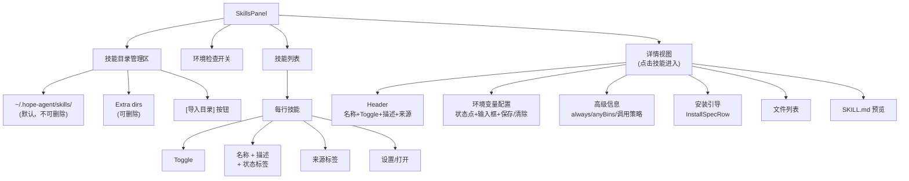

### InstallSpecRow 组件

```
[brew]  Install GitHub CLI via Homebrew    [安装]
```

安装按钮状态流转：

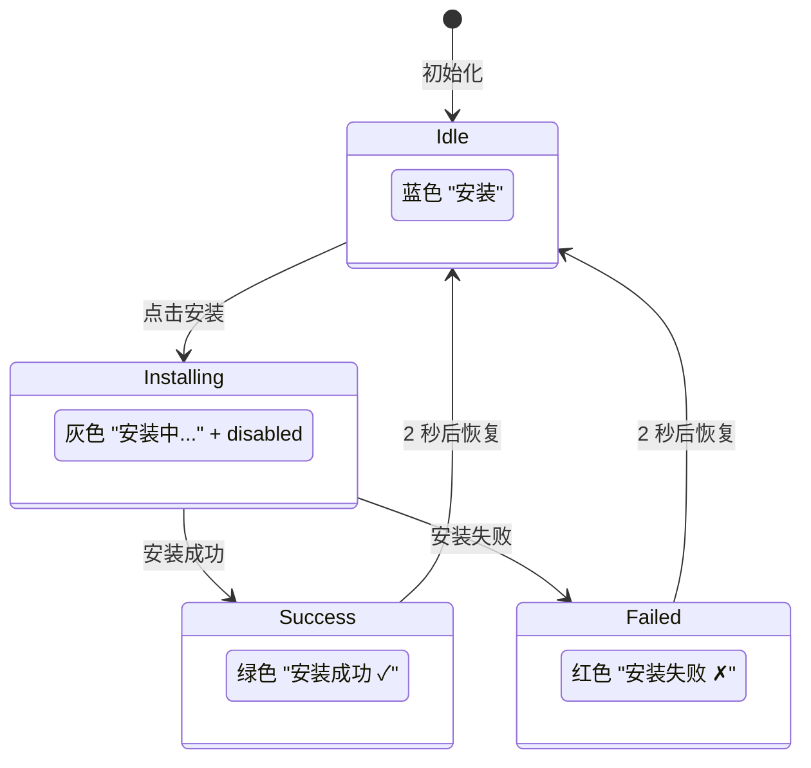

### SkillProgressBlock（对话流 skill 工具渲染器）

每次模型调 `skill` 工具时，对话流挂载独立的 [`src/components/chat/SkillProgressBlock.tsx`](../../src/components/chat/SkillProgressBlock.tsx) 而不是通用 `ToolCallBlock`，视觉上区别于 read/exec 等普通工具调用。

**关键点：**

| 特性 | 实现 |
|------|------|
| 路由 | [`MessageContent.tsx`](../../src/components/chat/message/MessageContent.tsx) 中 `block.tool.name === "skill"` 分支，独占渲染 |
| 不被分组 | `NO_GROUP_TOOLS` 加入 `"skill"`，避免被其他连续 tool call 合并 |
| 图标 | `Puzzle` 🧩（lucide）+ 琥珀色调（`border-amber-500/30 bg-amber-500/5`），与 subagent 的 `Users` 灰蓝区分 |
| Inline / Fork 辨别 | 检查 tool_result 前缀 `Skill 'X' completed.`——只有 fork 路径会带此格式 |
| 运行中 | `tool.result` 为空 → 显示旋转 Loader，标题行禁用点击 |
| 展开 | 点击标题栏 → 折叠区显示 markdown 渲染的 tool_result（fork 模式自动去掉 `Skill '...' completed.\n\nResult:\n` 信封） |
| 流程识别 | 标签显示 `skill · fork` 或 `skill · inline`，让用户一眼看到这次激活是否走了隔离执行 |

**子 Agent 进度联动**（未来迭代接入）：`SubagentEvent.skill_name` 字段已就绪，前端可在 `SkillProgressBlock` 内订阅 `subagent_event`、按 `skillName === args.name` 过滤拉到子 Agent tool call 流，在展开区内嵌 mini-transcript。当前版本先不做，避免和 `SubagentGroup` 的渲染路径撞车。

---

## 数据流全景

### 技能注入到 LLM（全链路）

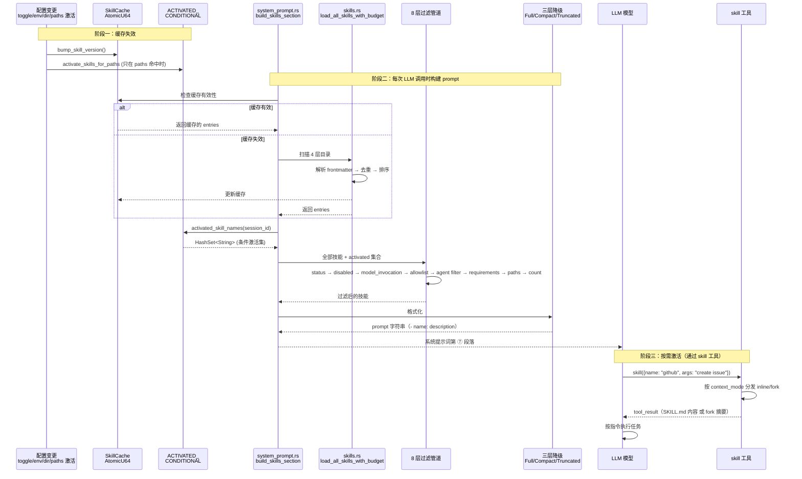

### 用户通过斜杠命令调用技能

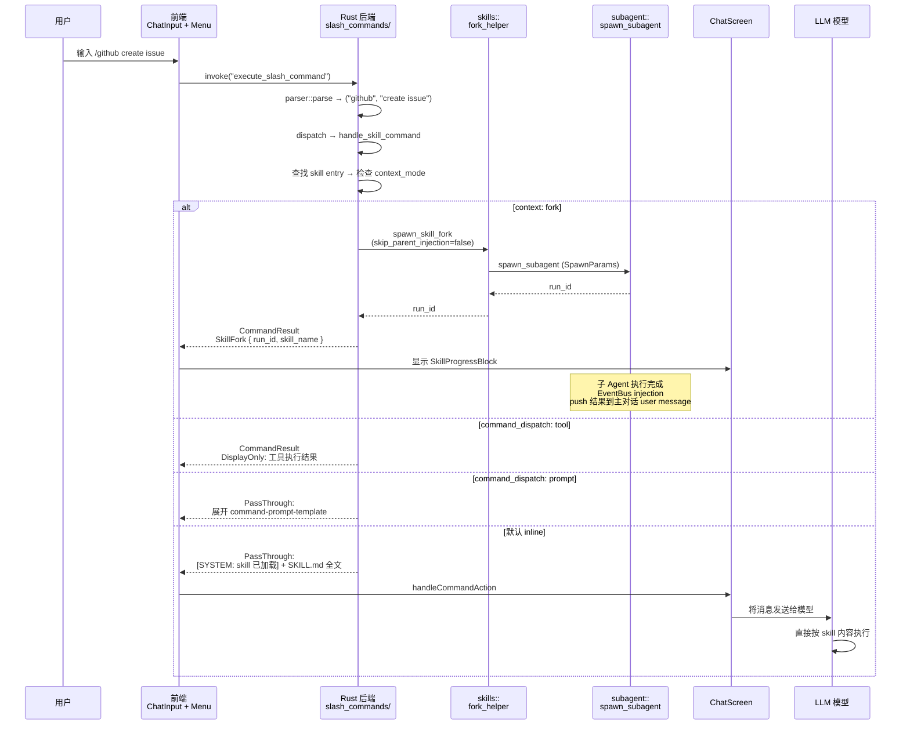

---

## 内置技能

内置技能（Bundled Skills）随应用发行，位于项目根目录 `skills/`，优先级最低。`discovery.rs` 中的 `resolve_bundled_skills_dir()` 按以下顺序定位内置技能目录：

1. 环境变量 `HOPE_AGENT_BUNDLED_SKILLS_DIR`
2. 可执行文件同级 / 上级 `skills/` 目录（release 打包）
3. `CARGO_MANIFEST_DIR` 向上两级的 `skills/`（仅 debug 构建）

同名技能会被高优先级来源（extra/managed/project）覆盖。

### 当前内置技能列表

| 技能 | 类别 | 可见性 | 说明 |
|------|------|--------|------|
| `ha-settings` | meta | `always: true`（跳过依赖检查） | 通过自然语言查看 / 修改 Hope Agent 设置，指导模型使用 `get_settings` / `update_settings` / settings backup 工具，不直接编辑配置文件 |
| `ha-skill-creator` | meta | `always: true`（跳过依赖检查） | 创建、编辑、改进、审核 Hope Agent skill；包含格式规范、评估思路和 frontmatter 指南 |
| `ha-find-skills` | meta | `always: true`（跳过依赖检查） | 当当前 catalog 没有合适能力时，指导模型发现并安装第三方 skill；安装第三方代码必须先显式确认 |
| `systematic-debugging` | 编程方法论 | `paths:` 代码文件触发 | Debug / test failure / 异常行为的 4 阶段根因调查流程 |
| `test-driven-development` | 编程方法论 | `paths:` 代码文件触发 | Feature / bugfix 的 RED-GREEN-REFACTOR test-first 流程 |
| `writing-plans` | 编程方法论 | `paths:` 代码文件触发 | 多步骤实现计划，要求拆成小任务、明确文件路径和验证方式 |
| `subagent-driven-development` | 编程方法论 | `paths:` 代码文件触发 | 把独立实现任务拆给子 Agent，并做 spec compliance / code quality 两段 review |
| `code-review` | 编程方法论 | `paths:` 代码文件触发 | 提交前质量门、静态安全扫描、独立 reviewer subagent、auto-fix loop |
| `meeting-notes` | 办公方法论 | 全局可见 | 会议记录 / standup / 1:1 纪要模板：议程、决策、行动项、开放问题 |
| `email-draft` | 办公方法论 | 全局可见 | 邮件起草、润色、翻译和回复，输出 subject / greeting / body / sign-off |
| `status-report` | 办公方法论 | 全局可见 | 周报 / 月报 / 项目进展，覆盖 shipped / in-flight / blocked / metrics |
| `mermaid-diagram` | 办公方法论 | 全局可见 | Mermaid flowchart / sequence / ER / state / gantt 等图表，聊天端可原生渲染 |

### settings 技能工具

`get_settings` / `update_settings` / settings backup 工具是 deferred 工具（通过 `tool_search` 发现），`ha-settings` 只提供何时、如何安全调用它们的工作流：

- **`get_settings(category)`**：读取指定分类的当前设置，返回 JSON。`category: "all"` 返回所有分类概览
- **`update_settings(category, values)`**：更新指定分类的设置，采用 partial merge 语义（递归深合并），只传需要修改的字段
- **`list_settings_backups()` / `restore_settings_backup(id)`**：查看和回滚自动设置快照。回滚属于高风险操作，必须显式确认

安全限制：
- `active_model` / `fallback_models` 为只读分类
- 不允许修改 Provider 列表 / API Key 等涉及凭据的设置；高风险分类（例如 Channel / Dangerous Mode / remote install）必须二次确认

---

## 生态兼容对比

字段级来源以 [字段来源与标准兼容](#字段来源与标准兼容) 为准；下表只比较运行时行为和管理能力。

| 维度 | Hope Agent | Claude Code | OpenClaw |
|------|-------------|-------------|----------|
| **激活入口** | 专用 `skill` 工具（`{name, args?}`）| 专用 `SkillTool`（`{skill, args?}`）| 模型 `read SKILL.md`（无专用工具）|
| **Inline / Fork 统一分发** | ✓（工具执行层）| ✓（SkillTool.call）| ✗（无 fork 概念）|
| **Fork 自动生效** | ✓（模型调用和斜杠命令都生效）| ✓ | — |
| **`context: fork`** | ✓ | ✓（Claude Code 原创）| — |
| **`agent:` 路由** | ✓（`agent_loader::load_agent` + fallback 父 Agent）| ✓（built-in agent types）| — |
| **`effort:` 路由** | ✓（`SpawnParams.reasoning_effort` → 4 provider）| ✓（`low`/`medium`/`high`/int）| — |
| **`aliases:` 多 slash 入口** | ✓（canonical + alias 同查找函数；alias 冲突静默跳过）| ✓（`aliases` 字段）| — |
| **`when_to_use:` 独立字段** | ✓（也兼容旧拼写 `whenToUse` / `when-to-use`）| ✓（Claude Code 扩展字段）| — |
| **`argument-hint` 统一命名** | ✓（也兼容 `argumentHint` / `command-arg-placeholder`）| ✓（Claude Code canonical 字段）| — |
| **`paths:` 条件激活** | ✓（`ignore::GitignoreBuilder` + SQLite 持久化）| ✓（`paths:` frontmatter）| — |
| **Prompt 注入** | 懒加载：名称+描述，`skill` 工具激活 | 懒加载：名称+描述，SkillTool 激活 | 懒加载：名称+路径，`read` 加载 |
| **预算管理** | 三层降级 Full → Compact → 二分截断 | 1% context window 硬限 | 三层降级 Full → Compact → 二分截断 |
| **Requirements** | bins/anyBins/env/os/config/primaryEnv；`always` 为 HA 扩展（跳过检查） | 无通用 requirements 标准 | 同 Hope Agent（兼容导入） |
| **调用策略** | user-invocable + disable-model-invocation | user-invocable + disable-model-invocation | 同 Hope Agent |
| **安装引导** | brew/node/go/uv + **GUI 一键安装**（`download` 保留但不可执行） | 无内置 | brew/node/go/uv/download + CLI |
| **健康检查** | `get_skills_status` + **GUI 状态徽章** | 无系统性检查 | `openclaw skills check` CLI |
| **缓存** | AtomicU64 版本 + 30s TTL + per-session activation | Skill search（实验特性）| chokidar 文件 watcher |
| **Skill 命令** | 动态注册为斜杠命令（**Channel-Agnostic**）| 动态注册为 `/skill` | 动态注册为斜杠命令 |
| **Skill 来源** | 4 层（bundled/extra/managed/project）| 5 层（bundled/managed/user/project/legacy commands）| 6 层（extra/bundled/managed/personal/project/workspace）|
| **插件集成** | 嵌套 `skills/` 检测 | 无 | Plugin manifest 声明 |
| **Skill 进度 UI** | `SkillProgressBlock` 🧩 独立渲染 | `SkillTool/UI.tsx` 子 Agent 内嵌 | — |
| **Draft 审核** | ✓（`status: draft` + auto_review 管线）| — | — |
| **Skill Marketplace / Import** | Quick Import 探测本机 Claude Code / Anthropic marketplace / OpenClaw / Hermes 目录；`ha-find-skills` 可指导外部查找 | Skill Search（实验特性）| ClawHub 集成 |

**Hope Agent 独有或优于 Claude Code 的点：**

1. **GUI 安装引导**（设置面板一键安装 + 实时日志）
2. **可视化健康检查**（GUI 状态徽章 + hover 详情）
3. **Rust 原生缓存**（AtomicU64，无 chokidar 额外进程）
4. **Channel-Agnostic skill 命令**（CommandAction 统一分发到桌面 / Telegram / Discord）
5. **SQLite 持久化的 `paths:` 激活**（App 重启恢复，Claude Code 只在内存）
6. **Draft 审核管线**（自主创建的 skill 进 `status: draft` 等用户审核，不直接生效）
7. **跨生态 Quick Import**（只探测路径，真正添加仍走 `extraSkillsDirs` 的显式用户操作）

**Claude Code 领先的点（未来可借鉴）：**

1. **Skill search**（ant 内部实验）—— 基于语义相似度的 skill 推荐，进一步降低 catalog 常驻占用
2. **Fork 子 Agent UI 内嵌**—— 在 skill 块展开区直接渲染子 Agent 的 tool call 流，Hope Agent 的 `SkillProgressBlock` 当前只显示最终摘要
3. **`${CLAUDE_SKILL_DIR}` / `${CLAUDE_SESSION_ID}` / 反引号 shell 替换**—— 更强的 SKILL.md 模板能力（涉及注入安全评估，Hope Agent 下一迭代评估）

---

## 编写第一个 Skill

### 1. 创建目录

推荐用脚手架脚本一键生成骨架——带全部 frontmatter 字段 stub + 按需的 `scripts/` / `references/` / `assets/` 子目录：

```bash
python skills/ha-skill-creator/scripts/init_skill.py my-tool \
  --resources scripts,references \
  --context fork \
  --examples
```

`--path` 缺省时：cwd 在 git 仓库内 → `.hope-agent/skills/<name>/`（项目级），否则 `~/.hope-agent/skills/<name>/`（用户级）。

也可以手动：`mkdir -p ~/.hope-agent/skills/my-tool`，然后按下节模板写 SKILL.md。

### 2. 编写 SKILL.md

```markdown
---
name: my-tool
description: "Interact with my custom tool via CLI"
requires:
  bins: [my-tool]
  os: [darwin, linux]
install:
  - kind: brew
    formula: my-org/tap/my-tool
    bins: [my-tool]
    label: "Install via Homebrew"
---

# My Tool Skill

When the user asks about my-tool operations, use the `my-tool` CLI.

## Usage
- `my-tool status` — Show current status
- `my-tool deploy --env production` — Deploy to production
- `my-tool logs --tail 100` — View recent logs

## Important Notes
- Always confirm destructive operations with the user
- Use `--dry-run` flag for safety when available
```

### 3. 验证

1. 打开设置面板 → Skills
2. 确认 "my-tool" 出现在列表中
3. 如果显示黄色警告，点击进入配置环境变量
4. 在聊天中输入 "/" 查看是否出现 `/my_tool` 命令
5. 对话中测试："帮我查看 my-tool 的状态"

### 4. 高级选项

**仅用户可调用（隐藏于模型）：**
```yaml
user-invocable: true
disable-model-invocation: true
```

**绑定到特定工具：**
```yaml
command-dispatch: tool
command-tool: exec
```

**跳过依赖检查（不代表不可关闭）：**
```yaml
always: true
```

**Fork 模式（多轮 exec 密集型 skill 推荐）：**
```yaml
context: fork
allowed-tools: [read, exec, grep]   # 限定子 Agent 工具范围
agent: code-reviewer                # 可选：指定子 Agent 身份
effort: high                        # 可选：提高推理强度
```

主对话只会看到一条 `Skill 'X' completed.\n\nResult:\n<text>` 摘要，子 Agent 的多轮 exec / tool call 不会污染主 context。

**条件激活（文件类型专属 skill）：**
```yaml
paths:
  - "*.py"
  - "pyproject.toml"
```

新会话启动时此 skill **不在** catalog 中；模型或用户 `read/write/edit` 一个 `.py` 文件后自动加入。

**Draft 审核（auto-review 创建的 skill）：**
```yaml
status: draft           # 用户在设置面板审核后转 active
authored-by: auto-review
rationale: "Detected reusable git workflow during recent session"
```

---

## 附录：类型定义速查

### Rust 核心类型

```rust
// 技能条目
pub struct SkillEntry {
    pub name: String,
    pub aliases: Vec<String>,             // 额外斜杠命令名（与其他命令冲突时 skip）
    pub description: String,              // "这是什么" —— 技能用途
    pub when_to_use: Option<String>,      // "什么时候用" —— 独立触发提示，catalog 渲染 "— when: ..."
    pub source: String,                   // "managed" | "project" | "bundled" | 目录名
    pub file_path: String,
    pub base_dir: String,
    pub requires: SkillRequires,
    pub skill_key: Option<String>,
    pub user_invocable: Option<bool>,
    pub disable_model_invocation: Option<bool>,
    pub command_dispatch: Option<String>,
    pub command_tool: Option<String>,
    pub command_arg_mode: Option<String>,          // "raw" 等
    pub command_arg_placeholder: Option<String>,   // == argument-hint / argumentHint
    pub command_arg_options: Option<Vec<String>>,
    pub command_prompt_template: Option<String>,
    pub install: Vec<SkillInstallSpec>,
    pub allowed_tools: Vec<String>,       // 工具白名单（空 = 全部可用）
    pub context_mode: Option<String>,     // "fork" 或 None（inline）
    pub agent: Option<String>,            // fork 时的子 Agent id
    pub effort: Option<String>,           // low/medium/high/xhigh/none
    pub paths: Option<Vec<String>>,       // gitignore 模式；声明后默认隐藏
    pub status: SkillStatus,              // Active / Draft / Archived
    pub authored_by: Option<String>,      // "user" | "auto-review"
    pub rationale: Option<String>,        // auto-review 记录理由
}

// SpawnParams 的 skill 相关字段（fork_helper 内填充）
pub struct SpawnParams {
    // ... 其他字段
    pub skill_allowed_tools: Vec<String>,  // SKILL.md 的 allowed-tools
    pub skip_parent_injection: bool,       // skill 工具 fork 路径为 true
    pub extra_system_context: Option<String>, // 注入整段 SKILL.md 到子 Agent
    pub reasoning_effort: Option<String>,  // SKILL.md 的 effort
    pub skill_name: Option<String>,        // 让 SubagentEvent 能辨别
}

// SubagentEvent 新增字段
pub struct SubagentEvent {
    // ... 其他字段
    pub skill_name: Option<String>,        // 仅 skill fork 路径 emit
}

// 环境要求
pub struct SkillRequires {
    pub bins: Vec<String>,        // AND
    pub any_bins: Vec<String>,    // OR
    pub env: Vec<String>,         // AND
    pub os: Vec<String>,          // ANY
    pub config: Vec<String>,      // AND
    pub always: bool,                    // 跳过 requirements 检查；不是 locked
    pub primary_env: Option<String>,
}

// 安装规格
pub struct SkillInstallSpec {
    pub kind: String,             // brew | node | go | uv；download 保留但不可执行
    pub formula: Option<String>,
    pub package: Option<String>,
    pub go_module: Option<String>,
    pub bins: Vec<String>,
    pub label: Option<String>,
    pub os: Vec<String>,
}

// Prompt 预算
pub struct SkillPromptBudget {
    pub max_count: usize,         // 默认 150
    pub max_chars: usize,         // 默认 30,000
    pub max_file_bytes: u64,      // 默认 256 KB
    pub max_candidates_per_root: usize, // 默认 300
}

// 健康状态
pub struct SkillStatusEntry {
    pub name: String,
    pub source: String,
    pub eligible: bool,
    pub disabled: bool,
    pub blocked_by_allowlist: bool,
    pub missing_bins: Vec<String>,
    pub missing_any_bins: Vec<String>,
    pub missing_env: Vec<String>,
    pub missing_config: Vec<String>,
    pub has_install: bool,
    pub always: bool,             // 跳过 requirements 检查；不是 locked
}
```

### TypeScript 核心类型

```typescript
// 技能摘要（列表用）
interface SkillSummary {
  name: string
  description: string
  source: string
  base_dir: string
  enabled: boolean
  requires_env: string[]
  skill_key?: string
  user_invocable?: boolean
  disable_model_invocation?: boolean
  has_install?: boolean
  any_bins?: string[]
  always?: boolean                // 跳过 requirements 检查；不是 locked
  allowed_tools?: string[]
  context_mode?: string           // "fork" | undefined
  agent?: string
  effort?: string                 // "low" | "medium" | "high" | "xhigh" | "none"
  paths?: string[]
  status?: "active" | "draft" | "archived"
  authored_by?: string
}

// 斜杠命令分类
type CommandCategory = "session" | "model" | "memory" | "agent" | "utility" | "skill"

// 斜杠命令定义
interface SlashCommandDef {
  name: string
  category: CommandCategory
  descriptionKey: string
  hasArgs: boolean
  argPlaceholder?: string
  argOptions?: string[]
  descriptionRaw?: string  // skill 命令的原始描述
}
```
