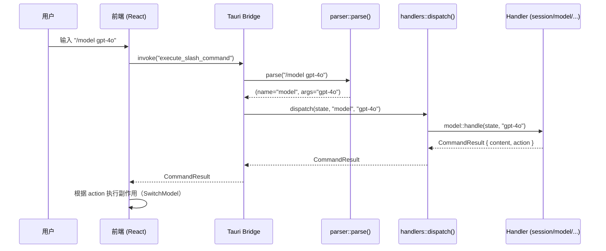
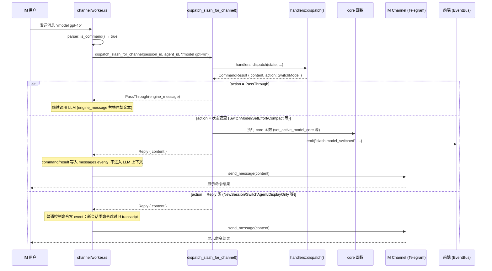
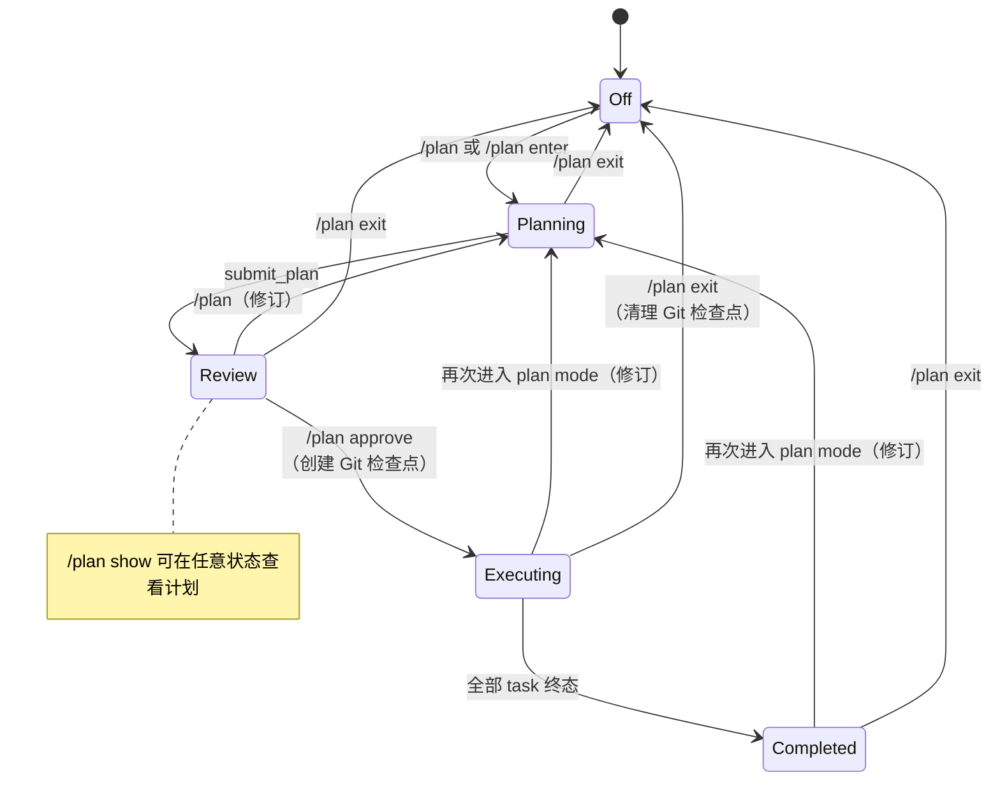

# 斜杠命令系统 (Slash Commands)

> 返回 [文档索引](../README.md)

Hope Agent 内置斜杠命令系统，用户在**聊天输入框**或**任意 IM 渠道**（Telegram 等）中输入 `/` 前缀即可触发。命令按类别分组，支持参数、模糊匹配和动态技能扩展。

## 架构概述

```
crates/ha-core/src/slash_commands/
├── mod.rs          # Tauri 命令入口（list / execute / is_slash_command）
├── types.rs        # 数据结构（SlashCommandDef / CommandResult / CommandAction）
├── parser.rs       # 解析器（"/" 前缀 → 命令名 + 参数）
├── registry.rs     # 命令注册表（所有内置命令定义）
└── handlers/       # 命令处理器（15 个子文件）
    ├── mod.rs      # dispatch 分发入口
    ├── session.rs  # 会话类命令（含 /sessions / /session / /handover）
    ├── model.rs    # 模型类命令
    ├── memory.rs   # 记忆类命令
    ├── agent.rs    # Agent 类命令
    ├── team.rs     # /team 子命令（create/status/pause/resume/dissolve）
    ├── plan.rs     # 计划模式命令
    ├── recap.rs    # /recap 深度复盘
    ├── context.rs  # /context 上下文窗口明细
    ├── workflow.rs # /workflow run 控制与 /mode 执行模式
    ├── goal.rs     # /goal active goal 控制面
    ├── loop_control.rs # /loop 长任务循环控制面
    ├── review.rs   # /review 本地代码审查控制面
    ├── awareness.rs # /awareness 行为感知开关
    ├── project.rs  # /project / /projects 项目切换 / 选择
    └── utility.rs  # 工具类命令（含 /imreply / /reason）
```

> **命令规模**：内置 38 条 + 动态技能命令（运行时合并）。

### 处理流程

斜杠命令有两条分发路径，共用同一套 `handlers::dispatch()`：

**路径 A — UI 前端（聊天输入框）**



**路径 B — IM 渠道（Telegram 等）**



### 前端通信（UI 路径专用）

| Tauri 命令 | 功能 |
|---|---|
| `list_slash_commands` | 列出所有可用命令（含动态技能命令），用于 UI 菜单渲染 |
| `execute_slash_command` | 执行斜杠命令，返回 `CommandResult` |
| `is_slash_command` | 快速判断文本是否为斜杠命令 |

---

## 命令分类

### 📋 Session — 会话管理

| 命令 | 参数 | 说明 | 副作用 (Action) |
|---|---|---|---|
| `/new` | 无 | 创建新会话 | `NewSession` |
| `/clear` | 无 | 删除当前会话所有消息 | `SessionCleared` |
| `/compact` | 无 | 压缩当前会话上下文（触发渐进式压缩） | `Compact` |
| `/stop` | 无 | 停止当前流式回复 | `StopStream` |
| `/rename` | `<title>` 必需 | 重命名当前会话标题 | `DisplayOnly` |
| `/plan` | `[enter\|exit\|show\|approve]` | 进入/管理计划模式（详见下方） | 多种 |
| `/project` | `[name]` 可选 | 无参：弹出项目选择器（桌面端 markdown 列表 + sidebar 项目树）；有参：模糊匹配项目名进入并在该项目下新建会话。**IM 渠道**：`AssignProject`（不创建新 session，UPDATE 当前 chat 的 `sessions.project_id`） | `ShowProjectPicker` / `EnterProject` / `AssignProject` |
| `/projects` | 无 | 列出所有未归档项目（与 `/project` 无参等价，独立条目方便记忆） | `ShowProjectPicker` |
| `/sessions` | `[query]` 可选 | 弹出会话选择器（用户对话 session，过滤 cron / subagent / incognito）。带参时模糊匹配标题 + 命中消息内容 FTS 高亮片段；最近活跃排序 | `ShowSessionPicker` |
| `/session` | `[<id>\|exit]` 可选 | **桌面**：无参/`<id>` 切换会话（`EnterSession`）；**IM**：无参显示当前 attach 状态、`<id>` 把当前 chat 物理 attach 到目标 session（旧 chat 收 `channel:session_evicted` 通知）、`exit` detach | `EnterSession` / `AttachToSession` / `DetachFromSession` |
| `/handover` | `[channel:account:chat[:thread]]` 可选 | **GUI 专用**：把当前 session push 到指定 IM chat（1:1 attach；目标 chat 上的旧 session 被驱逐）。无参时弹 Handover 选择器；IM 渠道菜单不展示也拒绝执行 | `HandoverToChannel` |

### 🤖 Model — 模型控制

| 命令 | 参数 | 说明 | 副作用 (Action) |
|---|---|---|---|
| `/model` | `[name]` 可选 | 无参数：列出所有可用模型（标记当前活跃模型）；有参数：模糊匹配切换模型 | `SwitchModel` 或 `DisplayOnly` |
| `/models` | 无 | 列出所有可用模型（与 `/model` 无参等价，独立条目方便记忆） | `DisplayOnly` |
| `/thinking` | `<level>` 必需 | 设置推理思考强度。`/think` 是静默别名（仅 dispatch 接受，菜单不展示，详见下方） | `SetEffort` |

**`/model` 模糊匹配优先级**：精确 ID → 精确名称 → 前缀匹配 → 包含匹配。歧义时列出所有候选项。

**`/thinking` 可选值**：

| 值 | 说明 |
|---|---|
| `off` / `none` | 关闭思考模式 |
| `low` | 低强度思考 |
| `medium` | 中等强度思考 |
| `high` | 高强度思考 |
| `xhigh` | 超高强度思考 |

### 🧠 Memory — 记忆管理

| 命令 | 参数 | 说明 | 副作用 (Action) |
|---|---|---|---|
| `/remember` | `<text>` 必需 | 保存一条记忆（Global 作用域，User 类型） | `DisplayOnly` |
| `/forget` | `<query>` 必需 | 搜索并删除最匹配的一条记忆 | `DisplayOnly` |
| `/memories` | 无 | 列出所有记忆（最多 20 条），显示类型、ID 和内容预览 | `DisplayOnly` |

### 🕵️ Agent — Agent 管理

| 命令 | 参数 | 说明 | 副作用 (Action) |
|---|---|---|---|
| `/agent` | `<name>` 必需 | 模糊匹配切换 Agent（自动创建新会话）。**IM 渠道禁用**——IM 的运行 agent 由 channel-account / topic / group 配置决定，每条入站消息重算，如果允许 `/agent` 会出现「会话标签是新 agent、实际跑的是 channel 配置 agent」的幻觉切换 | `SwitchAgent` |
| `/agents` | 无 | 列出所有可用 Agent（含 emoji、名称、描述） | `DisplayOnly` |
| `/team` | `[create\|status\|pause\|resume\|dissolve]` 可选 | Agent Team 管理：无参 = `status`；`create` 实例化模板；`pause` / `resume` 暂停/恢复运行中 team；`dissolve` 解散并清理子会话 | `DisplayOnly` |

### 🔧 Utility — 实用工具

| 命令 | 参数 | 说明 | 副作用 (Action) |
|---|---|---|---|
| `/help` | 无 | 显示所有命令列表（按类别分组） | `DisplayOnly` |
| `/status` | 无 | 显示当前会话状态（Agent、模型、会话 ID、消息数） | `DisplayOnly` |
| `/export` | 无 | 将当前会话导出为 Markdown 文件 | `ExportFile` |
| `/usage` | 无 | 显示当前会话的 Token 用量统计（输入/输出/总数/轮数） | `DisplayOnly` |
| `/permission` | `<mode>` 必需 | 设置工具权限模式 | `SetToolPermission` |
| `/search` | `<query>` 必需 | 将搜索请求传递给 LLM 处理 | `PassThrough` |
| `/prompts` | 无 | 查看当前 Agent 的完整 system prompt | `ViewSystemPrompt` |
| `/context` | 无 | 查看上下文窗口使用明细（分类 token 占比、压缩状态） | `ShowContextBreakdown` |
| `/goal` | `[status\|pause\|resume\|evaluate\|clear]` 或 `<objective> --criteria <criteria>` | 创建、更新、查看、暂停、恢复、审计或清除当前会话的 active Goal；创建/更新后把目标内容作为普通模型 turn 继续执行 | `DisplayOnly` / `PassThrough` |
| `/workflow` | `[on\|off\|ultracode\|status\|runs\|trace\|approve\|pause\|resume\|cancel] [run_id]` | 开关当前会话的 Workflow Mode，并查看/控制 durable workflow runs；`run_id` 可用唯一短前缀 | `DisplayOnly` / `SetWorkflowMode` |
| `/review` | `[run\|status\|resolved\|dismissed\|false_positive\|open] [id]` | 对当前会话工作区的未提交改动运行本地 Review Engine；可查看 run/finding 并更新 finding 状态 | `DisplayOnly` |
| `/loop` | 无参数 / `<duration> <prompt>` / `<prompt> every <duration>` / `<prompt>` / `[every\|until\|status\|pause\|resume\|stop]` | 创建或控制当前会话的 durable loop；无参数会创建 dynamic maintenance Loop 并读取可选 `loop.md`，无 interval 的 prompt-only 写法会创建 dynamic self-paced Loop，创建型命令后端会立即触发第一轮，详见 [Loop 控制平面](loop.md) | `DisplayOnly` |
| `/mode` | `[off\|guarded\|deep\|autonomous\|status]` | 查看或设置当前会话的 Execution Mode，影响后续 system prompt 中的长任务策略段 | `DisplayOnly` |
| `/recap` | `[--full\|--range=7d\|--range=30d]` | 生成深度复盘报告（后台流式），`--full` 跳转 Dashboard | `RecapCard` 或 `OpenDashboardTab` |
| `/awareness` | `[on\|off\|mode <x>\|status]` | 控制行为感知功能的全局开关与模式（详见下方） | `DisplayOnly` |
| `/imreply` | `[split\|final\|preview]` 可选 | **IM 专用**：设置当前 channel-account 的回复模式（每 round 拆分 / 仅最终 / 流式合并预览）。无参打印当前值与三态说明。详见 [im-channel.md §IM 回复模式](im-channel.md) | `DisplayOnly` |
| `/reason` | `[on\|off]` 可选 | **IM 专用**：开关 thinking_delta 在 IM 消息里渲染为 markdown blockquote（默认 off）。无参打印当前值。`/reasoning` 是静默别名（仅 dispatch 接受，菜单不展示，详见下方）。详见 [im-channel.md §Thinking 显示](im-channel.md) | `DisplayOnly` |
| `/kb` | `[on\|off]` 可选 | **IM 专用**：群聊内 per-chat 确认 / 关闭当前 chat 的 KB 访问（WS8，需账号级 `kbAccessOptIn` 已在桌面 Settings 开启）；DM 仅报状态；无参 / `status` 报当前生效态。详见 [knowledge-base.md](knowledge-base.md) | `DisplayOnly` |

**`/permission` 可选值**（与 `permission/engine.rs` 的三档 `SessionMode` 对齐）：

| 值 | 说明 |
|---|---|
| `default` | 标准审批：保护路径 / 危险命令永远弹窗，其余按 AllowAlways / Smart preset |
| `smart` | 自动放行 LLM 自报"高置信度"的工具调用，必要时跑 judge model 二次确认（详见 [permission-system.md](permission-system.md)） |
| `yolo` | 跳过所有审批（仍受 Plan Mode、保护路径硬闸约束） |

### 🎯 Skill — 动态技能命令

技能命令不在注册表中硬编码，而是在运行时从技能系统动态加载。通过 `list_slash_commands` 接口合并返回。

- 技能名称通过 `normalize_skill_command_name()` 规范化为命令名
- **命名冲突处理**：[`slash_commands::resolve_skill_command_names`](../../crates/ha-core/src/slash_commands/mod.rs) 是 listing 与 dispatch 共用的 collision-aware 解析器：
  - 技能 canonical 名与内置命令（`new` / `model` / `plan` / `team` / ...）冲突 → 追加 `_skill` 后缀（skill `new` → `/new_skill`）
  - 进一步与其他已分配名冲突 → 再追加 `_2` / `_3` / ... 直到唯一
  - 冲突的 **alias** 直接丢弃（alias 是补充入口，不允许压过已占用名）
  - 菜单显示的名称就是用户键入时的名称；dispatch 走同一张解析表，`/new_skill` 键入可达，不再出现"菜单显示但执行找不到"的断裂
  - **内置命令永远优先**：用户键入 `/new` 时，built-in match arm 先命中，skill `new` 本身不可达——若要触发自家 skill，请用 UI 菜单里显示的 `/new_skill`
- 分发优先级（`handlers/mod.rs::handle_skill_command`）：

  | 条件（SKILL.md frontmatter） | 分发路径 | CommandAction |
  |---|---|---|
  | `context: fork` | `dispatch_skill_fork` → `skills::spawn_skill_fork` 启子 Agent，结果通过 EventBus injection 作为 user message 推回主对话 | `SkillFork { run_id, skill_name }` |
  | `command-dispatch: tool` + `command-tool: <name>` | 后端直接执行指定工具（零 LLM 往返），截断 4096 字节后展示 | `DisplayOnly` |
  | `command-dispatch: prompt` 或带 `command-prompt-template` | 模板展开 `$ARGUMENTS` / 尾附 `User input:` 段 | `PassThrough { message }` |
  | 默认（inline skill，无 template 无 fork） | **读 SKILL.md 全文 + `$ARGUMENTS` 替换**，包进 `[SYSTEM: skill 已激活]` 头部的 `PassThrough` 消息直接送给 LLM | `PassThrough { message }` |

- 前端 UI：斜杠 skill 命令的 passThrough 通过 `handleSend(expandedMessage, { displayText: commandText })` 送出：
  - User 气泡显示原始 `/skillname args`，DB `messages.content` 也持久化这个（重载保持）
  - LLM 收到内联了 SKILL.md 的 `expandedMessage`，不经过 `read` / `tool_search`
  - 详见 [技能系统 §斜杠命令的 Inline 内联路径](skill-system.md#斜杠命令的-inline-内联路径)

---

## `/plan` 子命令详解

计划模式（Plan Mode）是一个五态状态机，`/plan` 命令控制状态转换（详见 [Plan Mode 架构文档](plan-mode.md)）：



> **没有 Paused 状态**——长时间挂起就 `/plan exit` 退出，需要时再 re-entry。详见 [plan-mode.md](plan-mode.md)。

| 子命令 | 说明 | 前置状态 | Action |
|---|---|---|---|
| `/plan` 或 `/plan enter` | 进入计划模式 | 任意 | `EnterPlanMode` |
| `/plan show` | 显示当前计划内容 | 任意 | `ShowPlan` |
| `/plan approve` | 批准计划，开始执行（创建 Git 检查点） | Review | `ApprovePlan` |
| `/plan exit` | 退出计划模式，清理 Git 检查点 | 任意 | `ExitPlanMode` |

---

## `/context` 上下文窗口明细

`/context` 计算当前会话的上下文窗口占用，按类别拆出 token 数与占比，供用户判断是否需要 `/compact`。桌面端返回结构化 `ShowContextBreakdown { breakdown }` action，由 [`ContextBreakdownCard`](../../src/components/chat/context-view/ContextBreakdownCard.tsx) 渲染为分段条形图 + 分类明细 + 一键 Compact/System Prompt 按钮；IM 渠道降级为 `content` 字段的 Unicode 条形图 + 分类列表 markdown。

**分类维度**（全部使用 `context_compact::estimation` 的 `char / 4` 口径，与实际 API 计费可能相差 10–20%）：

| 类别 | 含义 | 计算方式 |
|---|---|---|
| System prompt | 基础系统提示词（扣除 memory/skill/tool-descriptions 三段后） | [`system_prompt::compute_breakdown`](../../crates/ha-core/src/system_prompt/breakdown.rs) 的总 char − 其他 3 段 |
| Tool schemas | JSON 工具 schema（API 请求的 `tools:` 数组） | `AssistantAgent::build_tool_schemas(Anthropic)` 序列化后 char 数 |
| Tool descriptions | system prompt 中的工具说明段（`# Available Tools`） | `build_tools_section(filter)` 产物 char |
| Memory | 注入的记忆段（Core Memory + SQLite 候选 + Guidelines） | `build(…, memory_ctx, …)` − `build(…, None, …)` 的 diff |
| Skills | system prompt 中的技能说明段 | `build_skills_section(filter, env_check)` 产物 char |
| Messages | 会话历史（含 tool_use/tool_result） | `AssistantAgent::get_conversation_history()` 全量 JSON 序列化 char |
| Reserved output | 预留输出 budget | 常量 `16_384`，对齐 `run_compaction` |
| Free space | 剩余空间 | `context_window − sum(上述)`，饱和到 0 |

**压缩状态**：读取 `AssistantAgent.last_tier2_compaction_at` 和 `CompactConfig.cache_ttl_secs` 算出 `last_compact_secs_ago` 与 `next_compact_allowed_in_secs`，卡片内显示倒计时并在 cache TTL 未过期时禁用 "Compact now" 按钮（与 `agent/context.rs::run_compaction` 的节流策略一致）。

**入口**：
- 聊天输入框 `/context`（与其他命令同构）
- 右上角「会话状态」弹层 → 「📊 View context」按钮 → 调 `execute_slash_command` 后把 action 交给 `ChatScreen.handleCommandAction` 统一分发
- IM 渠道（Telegram bot menu 通过 `description_en()` 自动同步）

---

## `/workflow` 与 `/mode` 子命令详解

`/workflow` 首先是当前会话的 Workflow Mode 开关：开启后，模型会看到 `workflow` 控制工具，并在任何适合动态编排的任务里自行判断是否创建 durable workflow run。它不是 coding-only，也不要求用户先进入 coding 模式。除此之外，`/workflow` 还是 workflow run 的轻量命令面，适合在聊天里快速查看长任务状态；完整创建、预览、审批详情和控制中心 UI 走 [Workflow Mode、Workflow Run 与 Execution Mode](workflow.md) 的 owner API / Workspace 面板。

| 用法 | 行为 |
|---|---|
| `/workflow` / `/workflow status` | 展示当前 Workflow Mode、模型是否可自主创建 workflow run，以及最近 run 摘要 |
| `/workflow on` | 开启 Workflow Mode；模型后续可在调研、文档、数据、编码、运营等通用任务中按需调用 `workflow_run` |
| `/workflow ultracode` | 开启更强的 Workflow Mode；模型会更倾向于用多阶段、并行审查、交叉验证的 workflow 处理实质任务 |
| `/workflow off` | 关闭 Workflow Mode；后续不向模型暴露 `workflow_run` 工具 |
| `/workflow runs` / `/workflow list` | 列出当前 session 最近 12 条 workflow run，标注 active 数量、短 id、state、kind、execution mode、更新时间、op 完成摘要 |
| `/workflow trace [run_id]` | 展示某条 run 的状态、script hash、budget、blocked reason、最近 ops 和最近 events；不传 id 时优先选 active run，否则选最近一条 |
| `/workflow approve [run_id]` | 将 `awaiting_approval` run 转为 `running`；完整 owner API 的 approve 路径会额外 kick primary runtime |
| `/workflow pause [run_id]` | 将 `running` run 标记为 `paused`；runtime 在下一次状态检查点停止继续执行 |
| `/workflow resume [run_id]` | 将 `paused` run 转回 `running`；完整 owner API 的 resume 路径会额外 kick primary runtime |
| `/workflow cancel [run_id]` | 将 draft/live run 标记为 `cancelled`；真正的 child job / subagent 取消由 workflow owner API 的 cancel 路径兜底 |

`run_id` 支持唯一短前缀。未传 id 时，状态转换命令会按目标状态选择唯一 run；如果存在多个候选，直接要求用户传更长 id，避免误操作。

`/mode` 是会话级 Execution Mode 控制面，写入 `sessions.execution_mode`：

| 用法 | 行为 |
|---|---|
| `/mode` / `/mode status` | 显示当前 mode 和可选值 |
| `/mode off` | 清除额外执行策略段，后续 prompt 不注入 `# Execution Mode` |
| `/mode guarded` | 注入 Guarded 策略：普通长任务走观察、计划、编辑、定向验证、一次修复 |
| `/mode deep` | 注入 Deep 策略：更重侦察、风险判断和验证，最多两次定向修复 |
| `/mode autonomous` | 注入 Autonomous 策略：在权限和安全边界内持续推进，但不绕过审批 / sandbox / hooks |

两者都是 `DisplayOnly` action：命令结果作为 event 消息显示，不进入 LLM 上下文。`/mode` 改的是后续 turn 的 prompt 策略；它不是 `/loop`，不负责定时、轮询或自动重触发。

---

## `/goal` 子命令详解

`/goal` 是当前会话 active Goal 的轻量控制面；完整状态、证据指标和操作按钮在 [Goal 控制平面](goal.md) 的 Workspace 独立 Goal section 中展示。

| 用法 | 行为 |
|---|---|
| `/goal <objective> --criteria <criteria>` | 创建或更新当前 active Goal。无 active Goal 时创建；已有 active Goal 时更新目标和完成标准，并清空旧 final audit，`blocked` / `evaluating` 回到 `active`。 |
| `/goal` / `/goal status` | 展示 active Goal 的目标、完成标准、workflow 数、task 完成数、final audit 与 blocked reason。 |
| `/goal pause` | 将 active Goal 置为 `paused`。 |
| `/goal resume` | 将 `paused` / `blocked` Goal 恢复为 `active`。 |
| `/goal evaluate` / `/goal audit` | 基于 linked workflow runs、tasks 和 validation ops 运行保守 final audit。 |
| `/goal clear` | 将 active Goal 置为 `cancelled` 并从 active 查询中移除。 |

`/goal` 是通用长任务语义，不限定 coding 场景。无痕会话拒绝创建 durable Goal。桌面输入框的“目标模式”也是这一命令面的 GUI 包装：用户气泡保留 Goal 标记，但不显示 `/goal` 前缀。

---

## `/awareness` 子命令详解

行为感知的全局控制命令。修改的是 `config.json` 的 `awareness` 字段，全局生效。会话级覆盖通过输入栏的眼睛图标或 API 设置。

| 子命令 | 说明 |
|---|---|
| （无参数） | 显示当前状态（enabled / mode / max_sessions / lookback / 活跃会话数等） |
| `on` / `enable` | 全局启用 |
| `off` / `disable` | 全局禁用（硬闸，忽略所有会话级覆盖） |
| `mode off` | 设置模式为 Off（等同 disable） |
| `mode structured` | 结构化模式（零 LLM 成本，默认） |
| `mode llm` / `llm_digest` / `digest` | LLM 摘要模式（额外 side_query 开销） |
| `status` | 等同无参数，显示详细运行时状态 |

**示例**：

```
/awareness                → 显示状态
/awareness off            → 全局关闭
/awareness mode llm       → 切换到 LLM Digest 模式
/awareness status         → 显示状态
```

> 详见 [行为感知架构文档](behavior-awareness.md)

---

## `/project` 子命令详解

`/project` 在桌面端用于把当前对话从「散会话」切到「项目下的会话」。命令处理器：[`handlers/project.rs`](../../crates/ha-core/src/slash_commands/handlers/project.rs)。

| 用法 | 行为 | Action |
|---|---|---|
| `/project` | 列出全部未归档项目，桌面端弹「项目选择器」（markdown 列表 + 项目名 / emoji / 会话数 / 描述），用户继续键入 `/project <name>` 进入；同时 sidebar 项目树本来就可视，可选直接点 | `ShowProjectPicker { projects }` |
| `/project <name>` | 模糊匹配（精确名 → 精确 id → 前缀 → 包含；歧义/无果直接报错） | 桌面/HTTP: `EnterProject { project_id }`；IM: `AssignProject { project_id }` |

**前端处理**（[ChatScreen.tsx](../../src/components/chat/ChatScreen.tsx) `handleCommandAction`）：

- `ShowProjectPicker`：渲染为 event 气泡 markdown 列表，附 `> /project <项目名>` 提示框
- `EnterProject`：调 `handleNewChatInProject(project_id)` —— 在该项目下**新建会话**（agent 走 7 级解析链，详见 AGENTS.md「Agent 解析链」）；同步把 `draftIncognito` 关掉（项目与无痕互斥）

**IM 渠道行为（Phase A1 后）**：

- `/project` **不再** 在 `IM_DISABLED_COMMANDS` 里（仅 `/agent` / `/handover` 仍然禁用）。`handler` 检测 `session.channel_info.is_some()` 后切换分支：发 `AssignProject` action,channel slash dispatcher 调 `SessionDB::set_session_project` UPDATE 现有 `sessions.project_id`，**不创建新 session**
- 项目反向认领（旧 `Project.bound_channel`）已删除：IM 入站消息不再自动归项目，路由由 IM 端 `/project` 显式触发

---

## IM 渠道禁用清单

部分桌面专属命令在 IM 渠道里既不显示菜单也不响应执行。**入口**：`crates/ha-core/src/slash_commands/registry.rs::IM_DISABLED_COMMANDS`，目前 = `["agent", "handover"]`。

| 命令 | 禁用原因 |
|---|---|
| `/agent` | IM dispatcher 每条入站消息从 channel-account / topic / group 配置重算 agent_id（[`channel/worker/dispatcher.rs::resolved_agent_id`](../../crates/ha-core/src/channel/worker/dispatcher.rs)），不读 `sessions.agent_id`。允许 `/agent` 会让会话标签和实际运行 agent 永久漂移——`/agent` 切完后回复「Switched to X」，下一轮入站消息又被 channel-account 配置拉回原 agent，是幻觉切换。改 IM agent 应去「设置 → IM Channel → account → Agent」或 topic/group override |
| `/handover` | 「把当前 session 推到 IM chat」是 GUI 专属语义。在 IM 内部触发只会把 chat 自己的 session 推回自己，无意义。IM 端要切会话用 `/session <id>`（attach 已存在 session）或 `/sessions` 选择 |

> **`/project` 已不在此列**——Phase A1 把 Project ↔ IM 反向认领删除后，IM 内 `/project <id>` 改走 `AssignProject` action 直接 UPDATE 当前 session 的 `project_id`，语义合理因此放行。

新增此类命令时同时改两处：(1) `IM_DISABLED_COMMANDS` 常量 让 IM 同步阶段不下发菜单；(2) handler 内自检 `session.channel_info`，处理用户绕过菜单硬键入的情况。

---

## IM 专用命令 vs 静默别名

部分命令的语义只在 IM session 上下文里成立，handler 入口自检 `session.channel_info`，桌面 / Web session 直接报错「only works inside an IM channel session」：

| 命令 | 写入位置 | 备注 |
|---|---|---|
| `/imreply [split\|final\|preview]` | `ChannelAccountConfig.settings.imReplyMode` | 详见 [im-channel.md §IM 回复模式](im-channel.md) |
| `/reason [on\|off]` | `ChannelAccountConfig.settings.showThinking` | 详见 [im-channel.md §Thinking 显示](im-channel.md) |
| `/kb [on\|off]` | `ChannelAccountConfig.settings.kbAccessChats`（群聊 per-chat 确认；DM 仅报状态） | 群内 per-chat 确认 KB 访问，需账号级 `kbAccessOptIn` 开启；查不到 / 不匹配 fail closed。详见 [knowledge-base.md](knowledge-base.md) |

**静默 dispatch 别名**：`handlers::dispatch` match arm 接受多个名字（如 `"thinking" \| "think"`、`"reason" \| "reasoning"`），但只有 canonical name 进 [`registry::all_commands`](../../crates/ha-core/src/slash_commands/registry.rs) 与 IM 菜单。`/think` 是 `/thinking` 的别名，`/reasoning` 是 `/reason` 的别名 —— 用户输入两者都能触发，但菜单只展示 canonical 命令，避免视觉冗余。

**reserved 集合契约**：所有静默别名必须登记进 [`slash_commands::SILENT_BUILTIN_ALIASES`](../../crates/ha-core/src/slash_commands/mod.rs)；`builtin_command_names()` 把别名一并塞进 `HashSet<String>`，[`resolve_skill_command_names`](../../crates/ha-core/src/slash_commands/mod.rs) 用这个集合判断 skill 是否需要 `_skill` 后缀。漏登记 → 同名 skill 会被 dispatch 静默遮蔽（match arm 优先于 `_ => handle_skill_command`）。新增静默别名时务必更新 `SILENT_BUILTIN_ALIASES`。

---

## IM 渠道菜单同步时机

Telegram (`setMyCommands`) 和 Discord (Application Commands API) 的命令菜单需要主动推送，下面三个时机覆盖全部场景：

1. **`start_account` 第一次拉起**——`telegram/mod.rs::sync_commands_to_menu` / `discord/mod.rs::sync_commands_to_discord` 在认证成功后立即同步一次
2. **EventBus 自动 re-sync**——`app_init::spawn_channel_menu_resync_listener` 订阅以下事件，命中后 **2s 防抖**触发 `ChannelRegistry::sync_commands_for_all`：
   - `skills:catalog_changed`：[`skills::types::bump_skill_version`](../../crates/ha-core/src/skills/types.rs) 在每次 skill 增删 / 启停后 emit
   - `config:changed`（仅 `category` ∈ `skill` / `skills` / `extra_skills_dirs` / `disabled_skills`）
3. **手动触发**——`channel_sync_commands(account_id?)` Tauri 命令 / `POST /api/channel/sync-commands`，可针对单 account 或全量 running，给设置页「同步命令」按钮 + 运维兜底用

`ChannelPlugin` trait 用 `async fn sync_commands(&self, account: &ChannelAccountConfig) -> Result<()>` 默认 no-op，只有 Telegram / Discord override（其他渠道如 IRC / WhatsApp / iMessage 没有 slash 菜单概念，默认实现就够）。

**菜单内容**与 GUI / `/help` 完全一致——走同一个 [`slash_commands::im_menu_entries`](../../crates/ha-core/src/slash_commands/mod.rs) 入口，包含：

- `registry::all_commands()` 内置命令，过滤 `IM_DISABLED_COMMANDS`（`/agent` / `/handover`）
- 用户可调用 skill 命令（`get_invocable_skills` + `resolve_skill_command_names`，命名冲突走 `_skill` / `_N` 后缀）
- 100 条硬上限：Telegram 和 Discord 都把全局命令上限定在 100，超出尾部截断（仍可硬键入触发，只是不进菜单），并 `app_warn!`

> **失败语义**：单个 account 同步失败是 warn 级别（典型场景：Bot token 过期、网络暂时不通），不影响其它 account；菜单保留旧版本直到下次成功。

---

## CommandAction 类型一览

`CommandResult.action` 字段告诉前端需要执行什么副作用：

| Action | 说明 | 触发命令 | IM 渠道行为 | 前端事件 |
|---|---|---|---|---|
| `NewSession` | 切换到新创建的会话 | `/new` | ✅ 更新 channel_db 映射到新 session | — |
| `SessionCleared` | 会话消息已清空 | `/clear` | ✅ DB 已清理 + 回复确认 | `slash:session_cleared` |
| `SwitchAgent` | 切换 Agent 并创建新会话 | `/agent <name>` | 🚫 命令 IM 禁用，不会到达此 action | — |
| `PassThrough` | 将消息传递给 LLM 处理 | `/search`, 技能命令 | ✅ 以转换后的指令作为 LLM 输入；原始 slash 作为用户可见 user turn 落库 | — |
| `DisplayOnly` | 仅显示内容，无副作用 | `/help`, `/status`, `/usage`, `/memories`, `/workflow`, `/mode` 等 | ✅ command/result 落 `event`，直接回复 content，不进入 LLM 上下文 | — |
| `SwitchModel` | 切换活跃模型 | `/model <name>` | ✅ 调用 `set_active_model_core` 持久化切换 | `slash:model_switched` |
| `SetEffort` | 设置推理强度 | `/thinking <level>`（别名 `/think <level>`） | ✅ 调用 `set_reasoning_effort_core` 写入 AppState | `slash:effort_changed` |
| `SetToolPermission` | 设置工具权限模式 | `/permission <mode>` | ⚡ 返回"不适用"提示（Channel 固定 auto-approve） | — |
| `ExportFile` | 下载导出文件 | `/export` | ✅ 自动写入 `~/.hope-agent/exports/` 并回复路径 | — |
| `StopStream` | 停止流式输出 | `/stop` | ✅ 通过 `ChannelCancelRegistry` 取消活跃流 | — |
| `Compact` | 触发上下文压缩 | `/compact` | ✅ 调用 `compact_context_now_core` 执行压缩 | — |
| `ViewSystemPrompt` | 查看系统提示词 | `/prompts` | ✅ 构建完整 system prompt 作为回复返回 | — |
| `ShowContextBreakdown` | 显示上下文窗口分类占比卡片 | `/context` | ⚡ 降级为 `content` 文本（Unicode 条形 + 分类列表 + 压缩状态） | — |
| `RecapCard` | 渲染 `/recap` 流式生成卡片 | `/recap [--range=Nd]` | ⚡ 降级为提示文本（IM 不订阅 `recap_progress` 事件） | `recap_progress` |
| `OpenDashboardTab` | 切换到指定 Dashboard Tab | `/recap --full` | ⚡ 降级为提示文本（IM 无 Dashboard UI） | — |
| `EnterPlanMode` | 进入计划模式 | `/plan` | ✅ DB 状态已持久化 + 回复确认 | `slash:plan_changed` |
| `ExitPlanMode` | 退出计划模式 | `/plan exit` | ✅ DB 状态已持久化 + Git 检查点清理 | `slash:plan_changed` |
| `ApprovePlan` | 批准并开始执行计划 | `/plan approve` | ✅ DB 状态已持久化 + Git 检查点创建 | `slash:plan_changed` |
| `ShowPlan` | 在面板中显示计划 | `/plan show` | ✅ 将 plan 内容作为回复返回 | `slash:plan_changed` |
| `ShowProjectPicker` | 渲染项目选择器（markdown 列表） | `/project`（无参）/ `/projects` | ✅ IM 渠道渲染为 inline buttons（一项目一行） | — |
| `EnterProject` | 进入项目并在该项目下**新建会话** | `/project <name>` | ⚡ IM 改用 `AssignProject`，不会到达此 action | — |
| `AssignProject` | 把当前 chat 的 session UPDATE `project_id` 到目标项目（不创建新 session） | `/project <name>`（IM 渠道） | ✅ 直接调用 `SessionDB::set_session_project` | — |
| `ShowSessionPicker` | 渲染会话选择器（用户对话 session，过滤 cron / subagent / incognito） | `/sessions [query]` | ✅ IM 渠道渲染为 inline buttons | — |
| `EnterSession` | 切换桌面活跃会话；IM 上等价 `AttachToSession` | `/session <id>` | ⚡ IM 改用 `AttachToSession`，不会到达此 action | — |
| `AttachToSession` | 把当前 IM chat 物理 attach 到目标 session（旧 attach 驱逐 + 发 `channel:session_evicted` 通知） | `/session <id>`（IM 渠道） | ✅ 写 `channel_conversations` 表 | — |
| `DetachFromSession` | 把当前 IM chat 从其 session detach（桌面 no-op） | `/session exit` | ✅ 删 `channel_conversations` 行 | — |
| `HandoverToChannel` | 把当前 session push 到指定 IM chat（1:1 attach；目标 chat 旧 session 驱逐） | `/handover <ch:acc:chat[:thread]>` | 🚫 命令 IM 禁用，不会到达此 action | — |

> **前端事件说明**：Channel 执行状态变更类命令后，会通过 `EventBus` 发送 `slash:*` 事件通知前端 UI 同步更新（如模型选择器、effort 指示器、消息列表等）。桌面模式通过 Tauri `handle.emit()` 转发到 WebView，HTTP 模式通过 WebSocket 推送。前端在 `ChatScreen.tsx` 中统一监听这些事件。
>
> **⚡ 标注说明**：(1) `/permission` 在 Channel 中不适用，Channel 对话固定使用 auto-approve；(2) `EnterProject` / `EnterSession` 在 IM 中被替换为 `AssignProject` / `AttachToSession`（语义不同），不会到达原 action。
>
> **🚫 标注说明**：`HandoverToChannel` 的源命令 `/handover` 在 `IM_DISABLED_COMMANDS` 列表里，slash 同步阶段就被剔除；handler 还会再用 `session.channel_info` 自检兜底。

---

## 参数选项 (arg_options)

部分命令定义了 `arg_options`——预设的可选参数列表。在不同端有不同的交互方式：

### 前端 UI

`SlashCommandMenu` 对 `arg_options` 命令渲染可展开子菜单：

- 用户输入 `/<cmd>` 后回车或点击命令 → 展开选项子菜单
- 键盘方向键在选项间导航，回车执行选定选项
- Escape / 左箭头 返回命令列表
- 仍可手动输入参数（如 `/thinking high`）跳过子菜单

### IM 渠道（按 `supports_buttons` 分流）

入口 [`channel/worker/slash.rs::dispatch_slash_for_channel`](../../crates/ha-core/src/channel/worker/slash.rs)，无参短路按 `supports_buttons × args_optional` 矩阵分流：

**支持按钮的 7 个渠道**（Telegram / Feishu / Discord / Slack / QQ Bot / LINE / Google Chat）—— inline keyboard：

- 用户发送无参数的命令（如 `/thinking`）→ 返回选项按钮，每个选项一行
- 按钮 `callback_data` 格式：`slash:<command> <option>`（如 `slash:thinking high`）
- 用户点击按钮 → 各渠道走自己的 button-callback 入口 → 统一 helper `inject_slash_callback` 把 `slash:cmd arg` 翻成 inbound `/cmd arg` 消息
- `dispatch_slash_for_channel` 正常执行命令

**不支持按钮的 5 个渠道**（WeChat / iMessage / IRC / Signal / WhatsApp）—— 文本 Usage hint：

- `args_optional=false` + 有 `arg_options`（`/thinking` / `/permission` / `/plan`）：回 `Usage: /<cmd> <placeholder>` + `Options:` 列表（`render_options_help_text`），用户复制粘贴选项作为下一条消息。代替 handler 默认的 `Invalid X: \`\`` 错误。
- `args_optional=true` 命令（`/imreply` / `/sessions` / `/recap` / `/team` / `/awareness` / `/reason` 等）：fall-through 到 handler 自带的"无参 = 显示当前状态 / picker"分支，**不**插入 Usage hint（避免覆盖 handler 的自定义无参语义）。
- skill 命令：统一按 `args_optional=true` 处理（skill 默认无参可跑，不拦）。

**特殊处理 — `/model` 无参数**：

- 返回所有可用模型的 inline keyboard 按钮（每行最多 2 个）
- 当前活跃模型标记 `✓` 前缀
- 按钮 `callback_data` 格式：`slash:model <model_name>`
- 最多展示 20 个模型

### 有 arg_options 的命令

| 命令 | 选项 |
|---|---|
| `/thinking` | `off`, `low`, `medium`, `high`, `xhigh` |
| `/plan` | `enter`, `exit`, `show`, `approve` |
| `/permission` | `default`, `smart`, `yolo` |
| `/workflow` | `on`, `off`, `ultracode`, `status`, `runs`, `trace`, `approve`, `pause`, `resume`, `cancel` |
| `/review` | `run`, `status`, `resolved`, `dismissed`, `false_positive`, `open` |
| `/loop` | `every`, `until`, `status`, `pause`, `resume`, `stop` |
| `/mode` | `off`, `guarded`, `deep`, `autonomous`, `status` |
| `/awareness` | `on`, `off`, `mode structured`, `mode llm`, `mode off`, `status` |
| `/team` | `create`, `status`, `pause`, `resume`, `dissolve` |
| `/recap` | `--full`, `--range=7d`, `--range=30d` |
| `/imreply` | `split`, `final`, `preview` |
| `/reason` | `on`, `off` |
| `/kb` | `on`, `off` |
| `/session` | `exit`（只有 `exit` 是固定字面量；`<id>` 是任意 session id） |

---

## 命令快速参考表

| 命令 | 分类 | 参数 | 需要活跃会话 | 说明 |
|---|---|---|---|---|
| `/new` | Session | 无 | 否 | 开始新对话 |
| `/clear` | Session | 无 | 是 | 清空当前对话 |
| `/compact` | Session | 无 | 否 | 压缩上下文 |
| `/stop` | Session | 无 | 否 | 停止当前回复 |
| `/rename` | Session | `<title>` | 是 | 重命名对话 |
| `/plan` | Session | `[enter\|exit\|show\|approve]` | 是 | 计划模式 |
| `/project` | Session | `[name]` | 否 | 进入/选择项目（IM 改走 `AssignProject`） |
| `/projects` | Session | 无 | 否 | 列出所有项目（≡ `/project` 无参） |
| `/sessions` | Session | `[query]` | 否 | 弹出会话选择器（可选搜索） |
| `/session` | Session | `[<id>\|exit]` | 否 | 显示/切换/退出当前会话（IM: attach/detach） |
| `/handover` | Session | `[ch:acc:chat[:thread]]` | 是 | 把当前 session 推到 IM chat（**GUI 专用**） |
| `/model` | Model | `[name]` | 否 | 切换/列出模型 |
| `/models` | Model | 无 | 否 | 列出所有可用模型 |
| `/thinking` | Model | `<level>` | 否 | 设置思考强度（`/think` 静默别名） |
| `/remember` | Memory | `<text>` | 否 | 保存记忆 |
| `/forget` | Memory | `<query>` | 否 | 删除记忆 |
| `/memories` | Memory | 无 | 否 | 列出记忆 |
| `/agent` | Agent | `<name>` | 否 | 切换 Agent（IM 禁用） |
| `/agents` | Agent | 无 | 否 | 列出 Agent |
| `/team` | Agent | `[子命令]` | 否 | Agent Team 管理（create/status/pause/resume/dissolve） |
| `/help` | Utility | 无 | 否 | 显示所有命令 |
| `/status` | Utility | 无 | 否 | 会话状态 |
| `/export` | Utility | 无 | 是 | 导出 Markdown |
| `/usage` | Utility | 无 | 是 | Token 用量 |
| `/permission` | Utility | `<mode>` | 否 | 工具权限模式 |
| `/search` | Utility | `<query>` | 否 | 搜索网络 |
| `/prompts` | Utility | 无 | 否 | 查看系统提示词 |
| `/context` | Utility | 无 | 是 | 上下文窗口占用明细 |
| `/goal` | Session | `[status\|pause\|resume\|evaluate\|clear]` 或 `<objective>` | 是 | 创建/更新/查看/控制当前会话 active Goal |
| `/workflow` | Utility | `[on\|off\|ultracode\|status\|runs\|trace\|approve\|pause\|resume\|cancel] [run_id]` | 是 | 开关 Workflow Mode，并查看/控制当前会话 workflow runs |
| `/review` | Utility | `[run\|status\|resolved\|dismissed\|false_positive\|open] [id]` | 是 | 运行/查看本地代码审查并更新 finding 状态 |
| `/loop` | Utility | 无参数、`<prompt>` 或 `[every\|until\|status\|pause\|resume\|stop]` | 是 | 创建/查看/控制当前会话 durable loop；无参数为维护 loop，prompt-only 为模型自定间隔 |
| `/mode` | Utility | `[off\|guarded\|deep\|autonomous\|status]` | 是 | 查看/设置当前会话 Execution Mode |
| `/recap` | Utility | `[--full\|--range=Nd]` | 否 | 生成深度复盘报告 |
| `/awareness` | Utility | `[on\|off\|mode <x>\|status]` | 否 | 行为感知开关 |
| `/imreply` | Utility | `[split\|final\|preview]` | 是（IM） | 设置 IM 回复模式（**IM 专用**） |
| `/reason` | Utility | `[on\|off]` | 是（IM） | IM 输出是否包含模型 thinking（**IM 专用**） |
| `/kb` | Utility | `[on\|off]` | 是（IM） | 群聊 per-chat 确认 KB 访问（**IM 专用**） |
