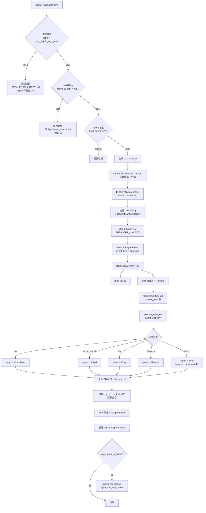
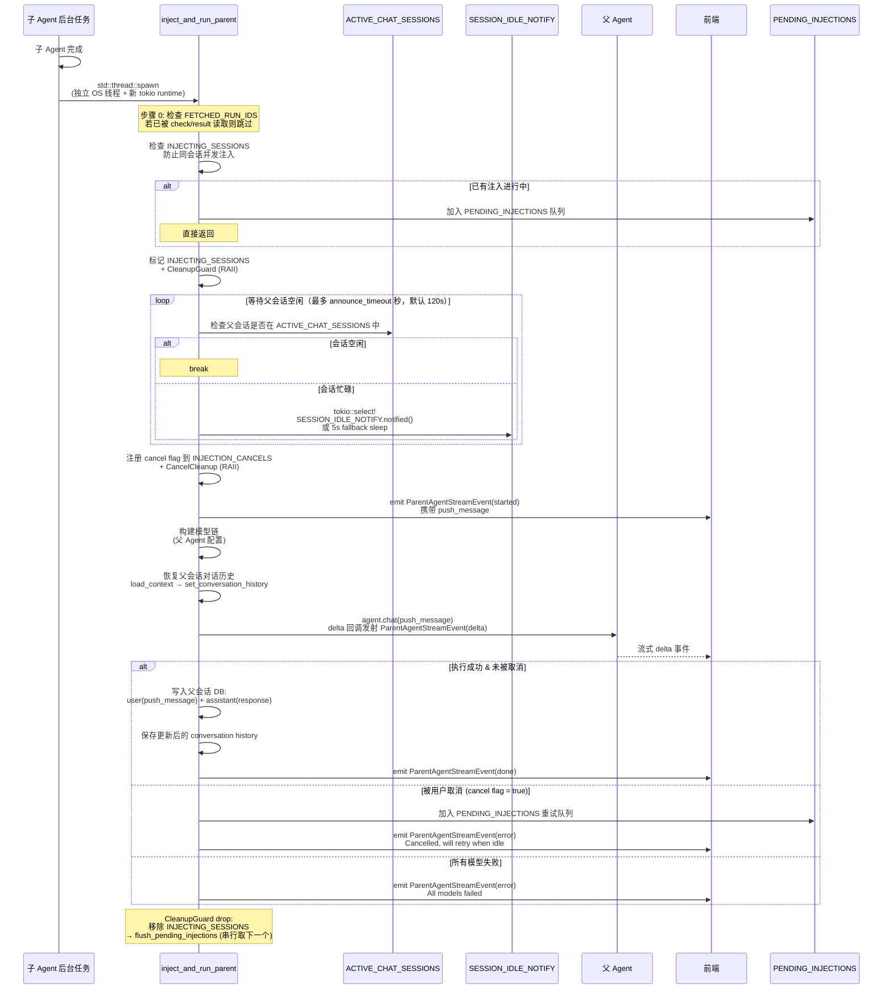

# 子 Agent 系统架构
> 返回 [文档索引](../README.md) | 更新时间：2026-04-05

## 概述

子 Agent 系统允许主 Agent 异步调用子 Agent 执行独立任务。子 Agent 运行在隔离会话中，完成后结果自动注入父会话触发父 Agent 继续对话。系统支持多级嵌套（默认最大深度 3，Agent 可覆盖至 5）、并发限制（单会话默认 8 个，可按 Agent 经 `subagents.maxConcurrent` 配置，clamp 1–50）、实时引导（Steer Mailbox）、取消机制、以及前台等待自动转后台的 `spawn_and_wait` 模式。

注入机制采用事件驱动设计：通过 `SESSION_IDLE_NOTIFY`（tokio::Notify）等待父会话空闲，结合 `ChatSessionGuard` RAII 守卫实现用户消息优先级高于自动注入的语义，被取消的注入任务进入 `PENDING_INJECTIONS` 队列在父会话空闲后串行重试。

## 模块结构

| 文件 | 职责 |
|------|------|
| `subagent/mod.rs` | 模块入口、常量定义（深度/并发/超时/截断）、7 个全局静态量、re-exports |
| `subagent/types.rs` | SubagentRun、SpawnParams、SubagentStatus、SubagentEvent、ParentAgentStreamEvent |
| `subagent/spawn.rs` | `spawn_subagent()` 入口 + `execute_subagent()` 后台执行逻辑 |
| `subagent/injection.rs` | `inject_and_run_parent()` 结果注入 + `PendingInjection` 队列 + `flush_pending_injections()` |
| `subagent/cancel.rs` | `SubagentCancelRegistry`（AtomicBool cancel flag 注册表） |
| `subagent/mailbox.rs` | `SubagentMailbox`（per-run 消息队列）+ `ChatSessionGuard`（RAII 守卫） |
| `subagent/helpers.rs` | 事件发射、字符串截断、`CleanupGuard`、`cleanup_orphan_runs`、`mark_run_fetched` |
| `tools/subagent.rs` | 工具接口层：10 种 action 的参数解析与调度 |

## 数据模型

### SubagentStatus（六态枚举）

```
Spawning → Running → Completed
                   → Error
                   → Timeout
                   → Killed
```

终态判定：`Completed | Error | Timeout | Killed` 均为 `is_terminal() = true`。

### SubagentRun（SQLite 持久化记录）

| 字段 | 类型 | 说明 |
|------|------|------|
| `run_id` | `String` | UUID v4，运行唯一标识 |
| `parent_session_id` | `String` | 父会话 ID |
| `parent_agent_id` | `String` | 父 Agent ID |
| `child_agent_id` | `String` | 子 Agent ID（如 `"ha-main"`） |
| `child_session_id` | `String` | 隔离子会话 ID（通过 `create_session_with_parent` 创建，关联父会话） |
| `task` | `String` | 任务描述原文 |
| `status` | `SubagentStatus` | 六态状态枚举 |
| `result` | `Option<String>` | 执行结果文本（截断至 `MAX_RESULT_CHARS = 10,000` 字符） |
| `error` | `Option<String>` | 错误信息 |
| `depth` | `u32` | 嵌套深度（从 1 开始，每级 +1） |
| `model_used` | `Option<String>` | 实际使用的模型标识（如 `"provider_id::model_id"`） |
| `started_at` | `String` | 创建时间（RFC 3339） |
| `finished_at` | `Option<String>` | 完成时间（RFC 3339） |
| `duration_ms` | `Option<u64>` | 执行耗时（毫秒） |
| `label` | `Option<String>` | 可选显示标签，用于前端追踪 |
| `attachment_count` | `u32` | 传入附件数量 |
| `input_tokens` | `Option<u64>` | 输入 token 用量（预留，当前为 None） |
| `output_tokens` | `Option<u64>` | 输出 token 用量（预留，当前为 None） |

### SpawnParams（调用参数）

| 字段 | 类型 | 说明 |
|------|------|------|
| `task` | `String` | 任务描述 |
| `agent_id` | `String` | 目标 Agent ID |
| `parent_session_id` | `String` | 父会话 ID |
| `parent_agent_id` | `String` | 父 Agent ID |
| `depth` | `u32` | 当前嵌套深度 |
| `timeout_secs` | `Option<u64>` | 执行超时秒数（默认 300，工具层 cap 1800） |
| `model_override` | `Option<String>` | 模型覆盖（优先级最高） |
| `label` | `Option<String>` | 显示标签 |
| `attachments` | `Vec<Attachment>` | 文件附件列表（支持 base64 和 UTF-8 文本） |
| `plan_agent_mode` | `Option<PlanAgentMode>` | Plan 模式配置（用于 Plan 创建子 Agent） |
| `plan_mode_allow_paths` | `Vec<String>` | Plan 模式文件写入白名单 |
| `skip_parent_injection` | `bool` | 是否跳过自动结果注入 |
| `extra_system_context` | `Option<String>` | 额外系统上下文（如 `PLAN_MODE_SYSTEM_PROMPT`） |
| `skill_allowed_tools` | `Vec<String>` | Skill fork 模式继承的工具白名单 |

### SubagentEvent（前端事件）

| 字段 | 类型 | 说明 |
|------|------|------|
| `event_type` | `String` | `"spawned"` / `"running"` / `"completed"` / `"error"` / `"timeout"` / `"killed"` |
| `run_id` | `String` | 运行 ID |
| `parent_session_id` | `String` | 父会话 ID |
| `child_agent_id` | `String` | 子 Agent ID |
| `child_session_id` | `String` | 子会话 ID |
| `task_preview` | `String` | 任务预览（截断至 50 字符） |
| `status` | `SubagentStatus` | 当前状态 |
| `result_preview` | `Option<String>` | 结果预览（截断至 200 字符） |
| `error` | `Option<String>` | 错误信息 |
| `duration_ms` | `Option<u64>` | 执行耗时 |
| `label` | `Option<String>` | 显示标签（`skip_serializing_if = None`） |
| `input_tokens` | `Option<u64>` | 输入 token（终态事件，`skip_serializing_if = None`） |
| `output_tokens` | `Option<u64>` | 输出 token（终态事件，`skip_serializing_if = None`） |
| `result_full` | `Option<String>` | 完整结果文本（仅终态事件携带，用于前端 push 交付） |

### ParentAgentStreamEvent（注入流式事件）

| 字段 | 类型 | 说明 |
|------|------|------|
| `event_type` | `String` | `"started"` / `"delta"` / `"done"` / `"error"` |
| `parent_session_id` | `String` | 父会话 ID |
| `run_id` | `String` | 关联的子 Agent run ID |
| `push_message` | `Option<String>` | 仅 `"started"` 事件携带，注入的用户消息内容 |
| `delta` | `Option<String>` | 仅 `"delta"` 事件携带，父 Agent 的流式响应增量（raw JSON） |
| `error` | `Option<String>` | 仅 `"error"` 事件携带 |

## Spawn 流程



### execute_subagent 内部逻辑

1. 加载 Agent 配置，解析模型链（model_override > subagents.model > agent.model.primary）
2. 构建 `AssistantAgent`，注入执行上下文（深度信息、任务描述、隔离声明）
3. 若有 `plan_agent_mode`，配置 Plan 模式 + allow_paths
4. 若有 `skill_allowed_tools`，配置工具白名单
5. 继承父 Agent 的 `denied_tools` + Plan 模式限制（防止子 Agent 绕过 Plan 安全）
6. Failover 逻辑：遍历 model_chain，每个模型重试 `MAX_RETRIES=2` 次（指数退避 1s-10s）
7. 每次 attempt 前检查 cancel flag，支持即时取消
8. `catch_unwind` 包裹整个执行，保证 panic 不会导致事件丢失

## 结果注入机制



### 注入流程关键设计

- **独立线程**：注入在 `std::thread::spawn` + 独立 `current_thread` tokio runtime 中运行，避免 `inject_and_run_parent → agent.chat() → spawn_subagent → tokio::spawn` 的 Send 循环依赖
- **串行注入**：同一父会话同时只有一个注入在执行（`INJECTING_SESSIONS` 互斥），多个完成的子 Agent 排队
- **用户优先**：`ChatSessionGuard::new()` 立即设置 `INJECTION_CANCELS` 取消正在进行的注入，用户消息永远优先
- **重试保证**：被取消的注入进入 `PENDING_INJECTIONS`，`ChatSessionGuard::drop()` 时 `flush_pending_injections` 每次只取一个重试（串行），下一个在 `CleanupGuard::drop()` 时触发
- **跳过已读**：`mark_run_fetched(run_id)` 在 check/result 工具中调用，注入前和等待中均检查 `FETCHED_RUN_IDS`

### 异步工具任务复用注入管道

异步工具任务（`async_jobs`，覆盖 `exec` / `web_search` / `image_generate` 等被标记 `async_capable=true` 的工具的后台化执行）作为该注入管道的**第二个消费者**：finished tool job 完成后由 `crates/ha-core/src/async_jobs/injection.rs::dispatch_injection` 把任务结果格式化为 push message，并把 `job_id` 当作伪 `run_id` 传给 `subagent::injection::inject_and_run_parent`，复用同一套 idle-wait / 取消 / 重试机制。

| 维度 | SubagentRun | 异步工具任务（async_jobs） |
|------|------|------|
| 注入入口 | `spawn::execute_subagent` 完成后 spawn 注入 | `async_jobs::injection::dispatch_injection` |
| 传入的 `run_id` | 真实 `SubagentRun.run_id`（UUID v4） | `AsyncJob.job_id`（伪 run_id） |
| `child_agent_id` 标签 | 子 Agent 的真实 ID | `tool_job:<tool_name>`，前端据此区分 |
| 共享机制 | `inject_and_run_parent` / `INJECTING_SESSIONS` / `PENDING_INJECTIONS` / `SESSION_IDLE_NOTIFY` / `INJECTION_CANCELS` |
| 进程内去重 | `FETCHED_RUN_IDS`（check/result 标记） | `dispatching_set()`（in-flight HashSet）+ `mark_injected` DB flag |

设计要点：

- **零重复**：注入路径只此一处，`subagent::injection::inject_and_run_parent` 不感知调用方是 SubagentRun 还是 async_jobs，所有"等空闲 → 取消 cancel → 串行重试"语义自动继承
- **前端识别**：`child_agent_id` 前缀 `tool_job:` 让前端可以按 prefix 区分两类来源（真实子 Agent vs 异步工具任务）展示不同 UI
- **持久化分离**：SubagentRun 落 `session.db.subagent_runs`，async_jobs 落独立 `~/.hope-agent/async_jobs.db` + spool 目录；只有"注入"这一段共享代码

来源：`crates/ha-core/src/async_jobs/injection.rs`、`crates/ha-core/src/subagent/injection.rs`。

## 取消注册表

`SubagentCancelRegistry` 基于 `HashMap<String, Arc<AtomicBool>>` 的内存注册表（`Mutex` 保护）。

| 方法 | 行为 |
|------|------|
| `register(run_id)` | 创建 `AtomicBool(false)` 并返回 `Arc`，spawn 时调用 |
| `cancel(run_id)` | 设置 flag 为 `true`（SeqCst），返回是否找到 |
| `cancel_all_for_session(parent_session_id, db)` | 查询 DB `list_active_subagent_runs` 获取活跃 run_id 列表，批量设置 cancel flag |
| `remove(run_id)` | 运行终止后清理，防止内存泄漏 |

子 Agent 的 `agent.chat()` 接收 `cancel: Arc<AtomicBool>`，在每次 tool loop 迭代和 API 调用前检查。

## Mailbox 系统

`SubagentMailbox` 是 per-run 的消息队列，用于父 Agent 在子 Agent 运行期间实时推送引导指令。

| 方法 | 行为 | 调用方 |
|------|------|--------|
| `register(run_id)` | 创建空 `Vec<String>` 队列 | `spawn_subagent` |
| `push(run_id, msg)` | 推送消息到队列，返回 `false` 若 run_id 不存在 | `subagent_steer` 工具 |
| `drain(run_id)` | 取出并清空所有待处理消息 | 子 Agent 的 tool loop 每轮 |
| `remove(run_id)` | 清理队列 | 后台任务完成时 |

全局静态实例 `SUBAGENT_MAILBOX`（`LazyLock<SubagentMailbox>`），底层用 `Mutex<HashMap<String, Vec<String>>>` 保护。

消息流向：父 Agent → `steer` action → `SUBAGENT_MAILBOX.push()` → 子 Agent tool loop `drain()` → 消息注入为用户消息继续对话。

## ChatSessionGuard（RAII）

标记会话正在进行用户发起的 `chat()` 调用：

**构造时 (`new`)**：
1. 将 `session_id` 插入 `ACTIVE_CHAT_SESSIONS`（全局 `HashSet`）
2. 检查 `INJECTION_CANCELS`，若该会话有正在进行的注入则设置 cancel flag 为 `true`

**Drop 时**：
1. 从 `ACTIVE_CHAT_SESSIONS` 移除 `session_id`
2. `SESSION_IDLE_NOTIFY.notify_waiters()` —— 唤醒所有等待该会话空闲的注入任务
3. `flush_pending_injections(session_id)` —— 从 `PENDING_INJECTIONS` 队列取出该会话的待重试注入，跳过已 fetch 的，每次只触发一个（串行保证）

## 深度与并发控制

| 常量 | 值 | 说明 |
|------|------|------|
| `DEFAULT_MAX_DEPTH` | 3 | 默认最大嵌套深度 |
| `DEFAULT_MAX_CONCURRENT_PER_SESSION` | 8 | 单会话并发子 Agent 默认/兜底上限（实际按 Agent `subagents.maxConcurrent` 配置，clamp 1–50，经 `max_concurrent_for_agent` 解析）|
| `DEFAULT_TIMEOUT_SECS` | 300 | 子 Agent 默认执行超时（5 分钟） |
| `MAX_RESULT_CHARS` | 10,000 | DB 中结果文本最大字符数 |

**深度覆盖**：Agent 级别可通过 `agent.json` 的 `subagents.max_spawn_depth` 字段覆盖，`clamp(1, 5)` 限制范围。`max_depth_for_agent(agent_id)` 函数加载 Agent 配置获取有效值。

**模型选择优先级**：
1. `model_override` 参数（工具调用时指定）
2. `agent.config.subagents.model`（Agent 配置中子 Agent 专用模型）
3. `agent.config.model.primary`（Agent 主模型配置）

## 全局静态量

| 名称 | 类型 | 用途 |
|------|------|------|
| `ACTIVE_CHAT_SESSIONS` | `LazyLock<Mutex<HashSet<String>>>` | 当前正在用户 chat 的会话集合 |
| `INJECTING_SESSIONS` | `LazyLock<Mutex<HashSet<String>>>` | 当前正在注入的父会话集合（互斥） |
| `INJECTION_CANCELS` | `LazyLock<Mutex<HashMap<String, Arc<AtomicBool>>>>` | 每会话的注入取消 flag |
| `FETCHED_RUN_IDS` | `LazyLock<Mutex<HashSet<String>>>` | 已被 check/result 读取的 run_id |
| `PENDING_INJECTIONS` | `LazyLock<Mutex<Vec<PendingInjection>>>` | 被取消的注入重试队列 |
| `SESSION_IDLE_NOTIFY` | `LazyLock<tokio::sync::Notify>` | 会话空闲通知信号 |
| `SUBAGENT_MAILBOX` | `LazyLock<SubagentMailbox>` | 全局 steer 邮箱 |

## 工具接口

`subagent` 工具通过 `action` 字段分发，支持 10 种操作：

| Action | 必需参数 | 说明 |
|--------|----------|------|
| `spawn` | `task` | 异步调用子 Agent，返回 `run_id` |
| `spawn_and_wait` | `task`, `foreground_timeout`(可选,默认30s,上限120s) | 前台等待，超时自动转后台 |
| `check` | `run_id`, `wait`(可选), `wait_timeout`(可选,默认60s,上限300s) | 查询运行状态，`wait=true` 轮询等待完成 |
| `result` | `run_id` | 获取完整结果（终态时标记 fetched 跳过自动注入） |
| `list` | 无 | 列出当前会话所有子 Agent 运行记录 |
| `steer` | `run_id`, `message` | 向运行中的子 Agent 推送引导消息 |
| `kill` | `run_id` | 取消指定子 Agent |
| `kill_all` | 无 | 取消当前会话所有活跃子 Agent |
| `batch_spawn` | `tasks`(数组,最多10个) | 批量调用子 Agent |
| `wait_all` | `run_ids`(数组), `wait_timeout`(可选,默认120s,上限600s) | 等待多个子 Agent 全部完成 |

**权限校验**（`do_spawn` 内部）：
- `agent.config.subagents.enabled` 必须为 `true`
- 目标 Agent 必须在 `agent.config.subagents` 的允许列表中（`is_agent_allowed`）

## 关键源文件索引

| 文件 | 职责 |
|------|------|
| `crates/ha-core/src/subagent/mod.rs` | 模块入口、常量（DEFAULT_MAX_DEPTH/DEFAULT_MAX_CONCURRENT_PER_SESSION 等）、7 个全局 LazyLock 静态量、re-exports |
| `crates/ha-core/src/subagent/types.rs` | SubagentRun / SpawnParams / SubagentStatus / SubagentEvent / ParentAgentStreamEvent 定义 |
| `crates/ha-core/src/subagent/spawn.rs` | `spawn_subagent()` 校验+调用入口、`execute_subagent()` 含 failover 重试和 plan mode 继承 |
| `crates/ha-core/src/subagent/injection.rs` | `inject_and_run_parent()` 等待空闲+恢复历史+流式注入、`PendingInjection` 队列、`flush_pending_injections()` 串行重试、`build_subagent_push_message()` 格式化 |
| `crates/ha-core/src/subagent/cancel.rs` | `SubagentCancelRegistry`：register / cancel / cancel_all_for_session / remove |
| `crates/ha-core/src/subagent/mailbox.rs` | `SubagentMailbox`（register / push / drain / remove）、`ChatSessionGuard`（RAII：ACTIVE_CHAT_SESSIONS + INJECTION_CANCELS + flush） |
| `crates/ha-core/src/subagent/helpers.rs` | `emit_subagent_event` / `emit_parent_stream_event` / `truncate_str` / `CleanupGuard`（RAII：移除 INJECTING_SESSIONS + flush）/ `cleanup_orphan_runs` / `mark_run_fetched` |
| `crates/ha-core/src/tools/subagent.rs` | 工具接口层：10 种 action（spawn / spawn_and_wait / check / result / list / steer / kill / kill_all / batch_spawn / wait_all）、`do_spawn` 共享逻辑、权限校验 |
