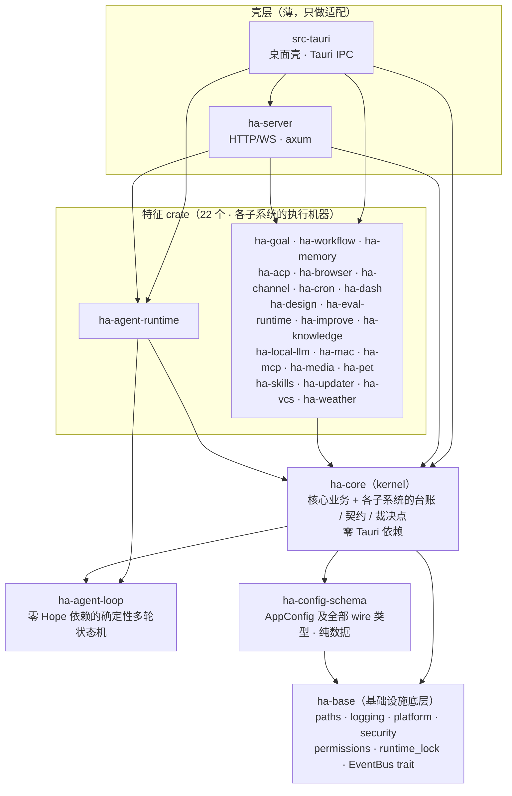
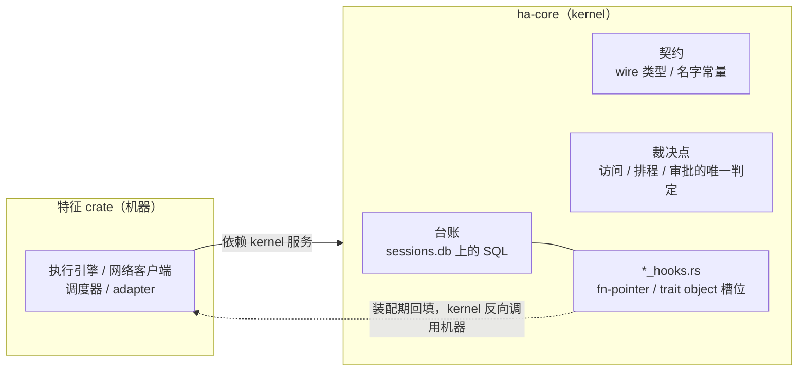
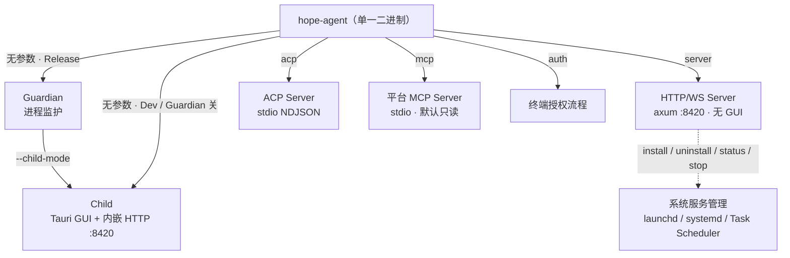
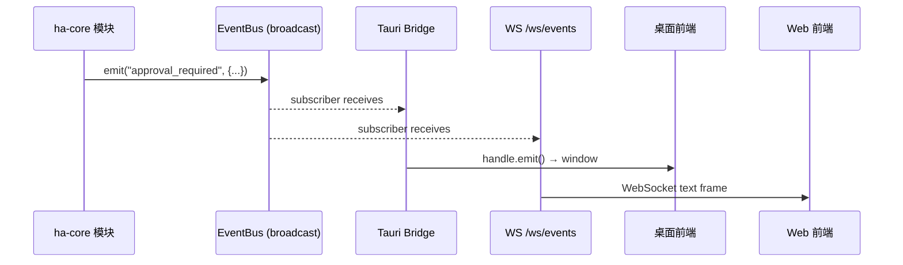
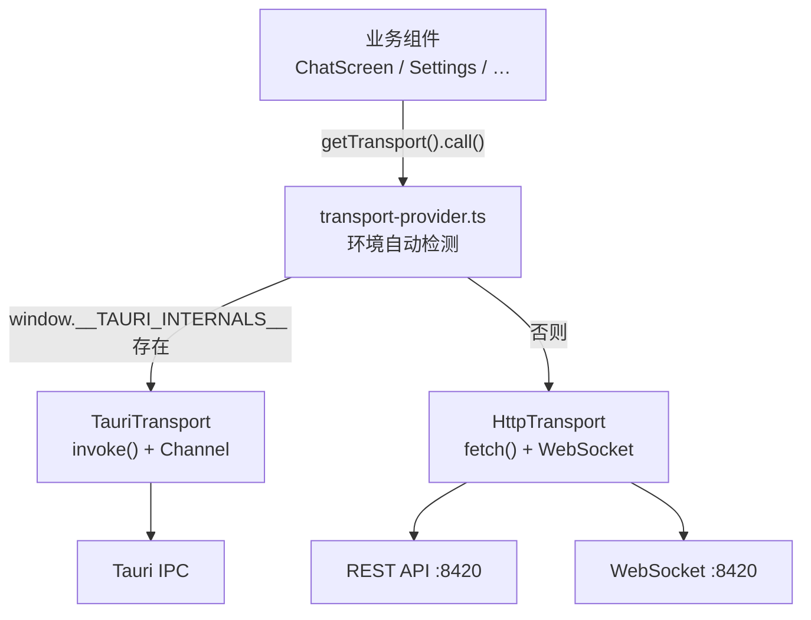
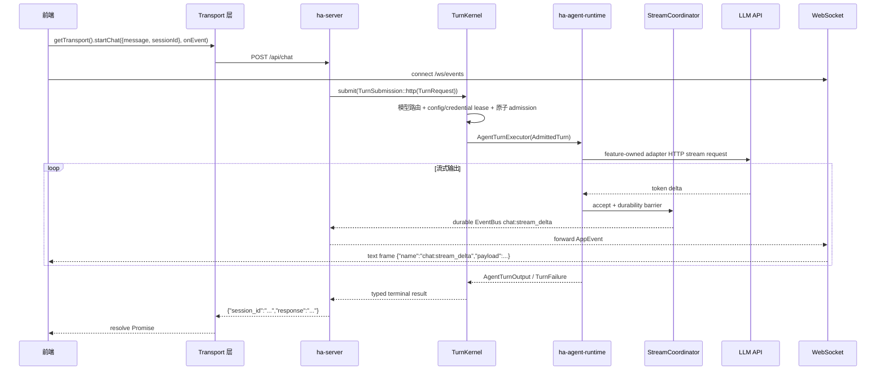

# 前后端分离与分层架构

> 返回 [文档索引](../../README.md) | 更新时间：2026-08-23 | 关联源码：`Cargo.toml`, `crates/ha-base/`, `crates/ha-config-schema/`, `crates/ha-core/`, `crates/ha-server/`, `src-tauri/`

## 核心思想

Hope Agent 的内核裁决与特征执行机器——TurnKernel、Agent runtime、工具循环、Memory、审批、Cron——不应该和「桌面窗口」绑死。一个把逻辑写在 Tauri 命令里的单体应用，天然只能是桌面 App：想让它当后台守护进程、当 CLI、被 IDE 直连，都得把逻辑重抄一遍。

解法是一条**单向的 crate 依赖图**，配合一层**前端 Transport 抽象**，同时兑现三件事：

1. **内核与特征逻辑框架无关** —— kernel 和 feature execution machines 全部沉进不依赖任何 Tauri 符号的库；任何 Rust 程序都能按固定 wiring 复用。
2. **一套核心，多个入口** —— 桌面 GUI、HTTP/WS 守护进程、ACP stdio 三种运行形态共享同一份核心，各自只是薄薄一层壳。
3. **一套前端，两种宿主** —— 同一份 React 前端既能跑在 Tauri WebView 里（走 IPC），也能跑在普通浏览器里（走 HTTP + WebSocket），运行时自动选路。

下面先讲这张依赖图长什么样、为什么这么分层，再讲把一个大 crate 拆成 31 个 workspace crate 时贯穿始终的那条设计原则，最后是各层职责、运行模式、事件系统、全局状态等具体契约。

---

## 分层依赖图

整个 workspace 是一张严格无环的 DAG，从底层基础设施到顶层壳一共五层：



除两层壳、22 个特征 crate、kernel/schema/base 与 `ha-agent-loop` 外，workspace 里还有三个旁支：`ha-browser-host`（浏览器辅助进程）、`ha-eval-spec`（评测协议，刻意不依赖 ha-core）、`ha-eval`（评测 CLI）。合计 31 个 crate。

**三条铁律**（`node scripts/analyze-crate-deps.mjs` 与 CI 门禁强制）：

1. **零 Tauri 依赖上溯到底层**：`ha-agent-loop` / `ha-core` / `ha-config-schema` / `ha-base` 与全部 22 个特征 crate 的 `Cargo.toml` 都不得出现 `tauri` 或 Tauri 插件依赖。只有两个壳（`src-tauri` / `ha-server`）碰框架。
2. **`ha-base` 不依赖任何 `ha-*` 业务 crate**：它是依赖图最底层。需要上层数据（如读 `AppConfig` 的某个字段）时，留一个**注册钩子**，由 `ha-core` 在启动早期注入，绝不反向 `use`（见 [ha-base 小节](#ha-base基础设施底层)）。
3. **`ha-config-schema` 只放数据定义**：类型、`Default`、只碰自身字段的 impl、serde helper。任何需要子系统服务的行为（`cached_config` / `mutate_config` / 脱敏 / 校验 / SSRF）都留在 `ha-core`。

### 为什么方向是「依赖方先拆」

把功能从 kernel 里拆成独立 crate 时有一条反直觉的顺序规则。假设模块 A 依赖模块 B，那么**先拆 A**：A 变成 kernel 之上的 crate，它引用的 B 还在 kernel 里，于是 `A → ha-core`，合法；等 B 也拆出来，`A → B` 仍合法。反过来先拆 B，残留在 kernel 里的 A 就要引用已经拆出去的 B，形成 `ha-core → B`，而 `B → ha-core` 本来就成立——Cargo 直接拒绝这个环。

这也解释了铁律里的一句话：**ha-core 永远不依赖任何特征 crate**。kernel 需要特征行为的每一个点，都倒转成了注册钩子。

---

## 贯穿全局的原则：台账留核，机器上浮

把一个几十万行的 kernel 拆成 22 个特征 crate，靠的不是「按目录切」，而是一条能反复套用的分界线：

> **每个子系统的「执行机器」上浮到特征 crate；对 `sessions.db` 的 SQL 台账、跨模块的 wire 类型、以及全局唯一的裁决点，恒留 kernel。**

「机器」是那些真正干活的部分——网络客户端、编译器、调度器、执行引擎、provider adapter。它们体量大、变化频繁、只被壳层调用，最适合独立成 crate。而留在 kernel 的那三类东西，一旦跟着机器搬走就会出事：



三类东西留 kernel 各有硬理由：

1. **固有 impl 的物理约束**。`impl SessionDB { … }` 这样的固有实现块，Rust 只允许待在**定义 `SessionDB` 的 crate** 里。像托管 `/loop` 的那个几十方法的大 impl 块、学习闭环的上百个 SQL 访问方法，物理上搬不出去——只能整块留 kernel，把顶层入口改成 `fn f(db: &SessionDB, …)` 的自由函数暴露给壳层。

2. **唯一裁决点不能藏在可选钩子后面**。「知识库访问默认 deny」的唯一裁决 `effective_kb_access`、排程合法性的唯一裁决 `validate_schedule`、全局审批跳过的配置来源——这些点一旦挪到「未装配即失效」的钩子后面，就等于凭空多出一条 fail-open 旁路。所以裁决点本身留 kernel，钩子只负责运行时查表和执行行为。

3. **wire 类型跟机器走会成环**。工具契约、slash 命令表、cron 行类型、评测报告类型、IM 渠道 wire 类型这些**契约物**，被 kernel 深度引用。若让它们跟着机器上浮，kernel 就要反向依赖特征 crate，构成 Cargo 环。所以契约留 kernel（多数在 `ha-config-schema` 里定义、kernel 再导出），特征 crate 用 `pub use` glob 原名再导出，全仓既有路径逐字不变。

还有一条相关红线：**`sessions.db` 的可写连接不对特征 crate 开放**。`SessionDB::with_conn_internal` 是 `pub(crate)`，特征 crate 一律走类型化方法访问。最能体现这条的是大盘：它要跑七十多条只读聚合，既不能把 7k 行 SQL 搬回 kernel，也不能拿到能写的裸连接，于是自开一条 `SQLITE_OPEN_READ_ONLY` 连接——句柄在物理层面就写不了，把「大盘只读」从约定变成了强制。

### 反向依赖钩子：kernel 怎么调用它不认识的机器

kernel 不 `use` 任何特征 crate，但它确实需要特征的行为（IM 撤窗、浏览器抓页、天气 prompt 段）。桥梁是各个 `*_hooks.rs` 模块里的**槽位**：一个 `OnceLock<fn(...)>` 或 `OnceLock<Arc<dyn Trait>>`，特征 crate 在装配期把自己的实现填进去，kernel 调用槽位而非具体类型。

设计一个钩子，最关键的判断是**「没人填这个槽时该返回什么」**。语义按动作性质分三类，不能一刀切：

| 动作性质 | 未装配语义 | 理由 |
|---------|-----------|------|
| 观察性 / 撤窗类（emit 通知、撤审批窗） | **no-op** | headless / ACP 进程本就没有 UI 窗口，无窗可撤不是错误；这里 fail loud 会让每次审批决议都告警 |
| 只读检索类（笔记召回、facet 查询、工具快照） | **返空 / None** | 逐位等价于「该设施缺席」的既有分支，调用方走既有降级路径 |
| 用户显式写动作（重建索引、创建技能、开关账号） | **返 `Err`** | 静默成功会骗用户——slash 命令回一段空正文、promotion 记下一条根本没落盘的产物 |

这也是为什么把安全裁决点或用户写入口做成钩子是危险的：它们天然属于第三类，一旦漏装配又没 fail loud，就成了静默旁路。

### 装配入口与启动任务

- **单一装配入口**：每个调 `init_runtime` 的二进制在 init 前调 [`ha_server::wire_features()`](../../../crates/ha-server/src/lib.rs)，它按固定顺序调用各特征 crate 的 `wire()`。**别在壳里内联这串 `wire()`**——多处各抄一份，新增特征 crate 时漏改任一处就静默丢 handler（最后由 `registry_freeze` 的 warn 兜底）。新增一个全局装配 feature = 改 `wire_features()` + `ha-server/Cargo.toml`；其它壳经 `ha-server` 复用，只有直接调用该 feature API 时才增加自身 path dependency。
- **`ha-eval-runtime` 是唯一没有 `wire()` 的特征 crate**：kernel 对它零引用，能力面全部经壳层直接暴露。不要为对齐补一个空 `wire()`，那只会让「漏调 `wire()`」的真问题更难暴露。
- **装配任务分三档**（[`app_init.rs`](../../../crates/ha-core/src/app_init.rs)）：
  - `register_init_task(fn)`：`init_runtime` 主体内消费，**所有运行形态**都执行，且 tokio runtime 不保证已存在——用于无条件的子系统装配。
  - `register_startup_task(StartupStage::PrimaryOnly, fn)`：只有抢到 runtime lock 的 Primary 进程跑（如 updater 自动更新循环、cron 调度器）。
  - `register_startup_task(StartupStage::EveryProcess, fn)`：每个进程都跑（如天气桌面刷新，desktop 判定在闭包内做）。

---

## 各层职责

### ha-base（基础设施底层）

依赖图最底层，只放**与业务无关的原语**：路径、日志、跨平台 shim、安全守卫、系统权限、内嵌终端、阻塞 IO helper、TTL 缓存、EventBus trait。

| 职责 | 模块 |
|------|------|
| 路径单一来源 | `paths.rs` —— 所有 `~/.hope-agent/` 下路径的入口 |
| 日志 | `logging/` —— `AppLogger` / `LogDB` / `app_info!` 系列宏，及 `APP_LOGGER` / `LOG_DB` 全局 |
| 跨平台原语 | `platform/` —— 进程树终止、代理探测、原子替换、keep-awake、WSL |
| 安全守卫 | `security/` —— SSRF 检查、Dangerous Mode 判定、HTTP 流式读取上限 |
| 系统权限 | `permissions.rs` —— macOS / Windows 系统权限目录与请求 |
| 运行模式与版本 | `runtime_role.rs` —— `RUNTIME_ROLE` / `APP_VERSION` 全局 + `is_desktop()` / `is_acp()` / `app_version()`（角色由 `init_runtime` 经 `set_runtime_role` 写入） |
| 多进程选举 | `runtime_lock.rs` —— `~/.hope-agent/runtime.lock` 上的 OS advisory 锁，Primary / Secondary 判定 |
| 进程簿记 | `process_registry.rs` —— 后台进程会话表；退出 / 输出通知由上层经钩子注入 |
| 系统服务 | `service_install.rs` —— launchd / systemd / Task Scheduler 注册原语 |
| 其它原语 | `blocking.rs` / `ttl_cache.rs` / `event_bus.rs` / `terminal.rs` / `crash_journal.rs` / `execution_mode.rs` / `workflow_mode.rs` / `util.rs` |

**日志全局为什么必须住在 ha-base**：`app_info!` 展开为 `$crate::get_logger()`，`$crate` 解析到**定义宏的 crate**。所以 `APP_LOGGER` / `LOG_DB` 及其访问器必须与宏同住 ha-base；kernel 的 `globals.rs` 只是把它们再导出，保持 `crate::globals::APP_LOGGER` 等既有路径不变。

**反向依赖靠注册钩子解决**（ha-base 不能 `use` `AppConfig`），现有三处：

| 钩子 | 未注册时的行为 | 重复注册时 |
|------|---------------|-----------|
| `paths::register_plans_dir_source` | 回落 `~/.hope-agent/plans/` | 记 `app_error!`，保留首次注册，继续启动 |
| `process_registry::register_notifiers` | 不发进程退出 / 输出通知（簿记不受影响） | 记 `app_error!`，继续启动 |
| `security::dangerous::register_config_flag_source` | 返回 `false`（**fail-closed**，Dangerous Mode 配置来源视为未开启） | **调用方 `panic!`**——它控制全局审批跳过，来源被悄悄顶替不可接受 |

三条的钩子函数本身都只返回 `Result`；差别在调用方（`app_init` 的 `REGISTER_BASE_HOOKS` 块）对返回 `Err` 的处置：前两条记日志继续，第三条直接终止进程。这个不对称是刻意的——安全边界的来源被替换，宁可起不来。

**ha-core 对下游完全透明**：kernel 的 `lib.rs` 用 `pub use ha_base::*` + `#[macro_use] extern crate ha_base` 全量再导出，所以 kernel 内部的 `crate::paths::…` 与下游的 `ha_core::platform::…` / `ha_core::app_warn` 路径全部不变，这层拆分对调用方零改动。

### ha-config-schema（配置 wire 类型）

`AppConfig` 及其全部传递类型闭包——各子系统的 `*Config`、枚举、serde helper、只碰自身字段的自包含 impl，还有 `DEFAULT_AGENT_ID` 这类纯常量。**模块路径镜像 ha-core**（`memory` / `config` / `tools::web_search` / `knowledge::maintenance` …），根部同样 `pub use ha_base::*`，因此被搬进来的代码里 `crate::memory::X`、`crate::security::ssrf::SsrfConfig` 这类内部引用原样成立。

ha-core 各子系统在原定义文件里用 `pub use ha_config_schema::<mod>::{…};` 顶替被搬走的定义，既有 re-export 链不动，全仓 `crate::config::AppConfig` / `ha_core::mcp::McpServerConfig` 等路径零改动。

**新增字段时最常踩的归属线**：

| 归属 | 内容 |
|------|------|
| schema | 类型定义、`Default`、clamp / effective 等只碰自身字段的 impl、serde default helper、纯常量 |
| ha-core | `cached_config` / `mutate_config`（持久化）、redact 脱敏接线、`validate_server_config` / `check_ssrf` 等子系统自由函数、方法引用未下沉类型时的扩展 trait |

一个例外值得记住：`context_compact` 的默认工具策略在 schema 侧用工具名字面量（wire 格式的 key，schema 不能反向依赖 ha-core 的 `TOOL_*` 常量），由 ha-core 的一条测试锁死两者一致性。config 模块的纯类型测试（默认值 / 钳制 / serde 兼容）随类型住在 schema，`cargo test -p ha-config-schema` 已进门禁。

### ha-core（kernel）

kernel 是这张图的中枢：所有核心业务逻辑，加上各子系统留守的台账、契约与裁决点。

| 职责 | 说明 |
|------|------|
| 核心编排与裁决 | TurnKernel 准入/终态、Chat Engine durability/finalize、permission、Stop/Continue、Plan Mode、Subagent/Project/Team 共享裁决；Provider/tool loop、Goal/Workflow/Memory 执行机在特征 crate |
| 数据台账 | `sessions.db` 是 kernel 独占的真相源（会话 / 消息 / Cron / Channel / Project / 知识库注册表 / 异步任务 / 本地模型任务等表都在其中或共享其连接）；Memory 后端、日志库也由 kernel 持有 |
| 全局状态 | `AppState` + `OnceLock` 全局单例 + accessor 函数（见[全局状态管理](#全局状态管理)） |
| 事件系统 | `EventBus` trait —— 取代原本的 Tauri `APP_HANDLE.emit()` |
| 子系统契约 | 各特征 crate 留守的 wire 类型 / 台账 / 裁决点，以及连接它们的 `*_hooks.rs` |

kernel 顶层约五十个模块，随着功能持续上浮为特征 crate 而缩减。这里只挑两条最容易踩的边界讲清楚。

#### 工具契约层 `tool_defs/` 与分发层 `tools/`

kernel 的 agent / async_jobs / permission / system_prompt / context_compact 都要用到「工具的契约物」——工具名常量、schema 类型、执行上下文。但真正认识每个工具**实现**的 `tools/`（分发注册表 + adapter 目录）会指向全部特征，把它当中间层就等于让「人人依赖的层」焊死整张依赖图。

所以契约物归位 [`tool_defs/`](../../../crates/ha-core/src/tool_defs/)：`names.rs`（`TOOL_*` 名字常量）、`types.rs` / `metadata.rs`（`ToolDefinition` 家族）、`context.rs`（`ToolExecContext`）、`scope.rs`（`ToolScope` 与可见性谓词）、`rejection.rs`（`ToolRejection`）。

**方向红线**：`tool_defs` 的**生产代码绝不**依赖 `tools::dispatch` / `tools::registry` / 任何 adapter。需要分发层行为的方法一律改成挂在分发侧的扩展 trait。这条边由 [`scripts/analyze-crate-deps.mjs`](../../../scripts/analyze-crate-deps.mjs) **零容忍**守护（生产边一条即失败），已接入 pre-push 与 CI——因为「同 crate 内加一条回边照样编译」，光靠 review 守不住。

kernel 新代码一律 `crate::tool_defs::…`；`crate::tools` 门面全量再导出 `tool_defs`，所以特征 crate 与壳层的 `ha_core::tools::…` 既有路径全部不变。

#### 契约层的其它成员

同一模式复制到了多个子系统，它们都是「类型 / 静态表 / 纯谓词留 kernel，行为随机器上浮」：

- **`slash_defs/`**：命令静态表、`CommandAction` / `CommandResult`、parser、fuzzy、转录落库。装配层 `slash_commands/`（各命令 handler）位于依赖图顶端，通过 `slash_hooks.rs` 的三个槽（`dispatch` / `menu_entries` / `skill_command_help`）被 kernel 与 IM 渠道回调。
- **`cron_defs/` / `coding_eval_defs.rs`**：cron 行类型、评测报告 wire 类型——kernel 的持久化存的就是这些类型的 JSON，故类型不能跟机器走。
- **`learning_events.rs`**：Learning 埋点的**发布面**留 kernel。生产者遍布 kernel、ha-skills、ha-knowledge、ha-mcp 四处；若发布面留在 dashboard，这些生产者全要反向依赖 ha-dash。发布与消费之间本无代码耦合，只共享表名与 kind 字符串，所以 `emit` 留 kernel，`dashboard::learning` 退化为纯订阅方。

### 特征 crate（22 个）

每个特征 crate 遵循同一份共同契约：**依赖方向恒为「特征 → ha-core」**（借用 kernel 的 tools registry / config / EventBus 等服务），**特征之间允许单向依赖**（无环即可），而 ha-core 不认识任何特征 crate。实时依赖以 `node scripts/analyze-crate-deps.mjs` 输出为准。

下表按「拥有的机器」「kernel 留守的台账 / 契约」「kernel↔特征边界钩子」三列展开。留守项之所以留 kernel，逐条都能对应到上面那条原则的某一款（固有 impl / 唯一裁决 / wire 类型 / 只读连接）。

| 特征 crate | 拥有的机器（上浮部分） | kernel 留守 | 边界钩子 |
|-----------|----------------------|-------------|---------|
| **ha-agent-runtime** | 主 turn engine、四 Provider adapter、one-shot HTTP/body/SSE、Hope round/tool-batch driver、vision bridge | `TurnKernel`、turn/stream ledger、durability/finalize、permission/tool contract、model/config/credential contract、`AssistantAgent` state 与 context capability | required `AgentTurnExecutor` + required `OneShotRuntime`；重复注册 panic，缺失执行 fail-explicit |
| **ha-goal** | Goal runner、continuation/resume/预算/terminal policy、Goal tool handlers | Goal wire/status 与 `SessionDB` typed ledger、Stop/Eval/Wakeup 裁决 | required `GoalRuntime` + external tool entries |
| **ha-workflow** | parser/preview/typed-result、QuickJS step machine、resume/compensation/cancellation、Workflow tool handler | Workflow wire/status 与 typed ledger、permission/Stop/Eval contract | required preview/typed-result/machine runtimes + external tool entries |
| **ha-memory** | extract/reembed/recall summary、embedding/external provider、Fast/Deep Retrieval Planner、Dreaming/Deep Resolver 全流水线 | config/wire、effective budget、incognito/access verdict、Core snapshot、claims review、typed ledger 与 captured single-model `MemoryExtractModel` 能力 | retrieval/provider/maintenance/Dreaming required-or-optional ports（按动作语义 fail-explicit 或 no-op）；Memory Extract 专用端口禁接 `automation::run` |
| **ha-updater** | manifest 检查 / 签名校验 / 下载续传 / atomic swap / 服务重启 / `app_update` 工具 | —— | 桌面路径经 `UpdaterBridge` 反向注册（详见 [self-update](../infra/self-update.md)） |
| **ha-weather** | Open-Meteo 取数 / 缓存 / 桌面后台刷新 / `get_weather` 工具 | —— | `register_weather_prompt_source`（天气 prompt 段）+ `register_weather_settings_refresh`（设置热刷新） |
| **ha-mac** | Accessibility / 截屏 / 焦点 / `mac_control` 工具 | `MacControlFocusAnchor`、`normalize_perform_ax_action`（审批分类代码，permission engine 消费，不外迁） | `register_mac_control_exec_hooks` 四件套原子注册（焦点 capture/restore + args sanitize/preflight） |
| **ha-design** | design 服务层 / durable Artifact 注册表 / canvas_db / ffmpeg / `design`·`canvas`·`artifact` 三工具 | Artifact 隐私切换锁（`session::privacy`，与 incognito 切换共享同一把锁） | `session::design_hooks` 三钩子（工作目录派生 / 会话清理级联 / incognito 守卫） |
| **ha-browser** | Chrome Extension backend / CDP backend / loopback broker / 观察缓冲 / `browser` 工具 | `IMAGE_BASE64_PREFIX` / `MEDIA_ITEMS_PREFIX` 等结果格式契约常量 | `browser_hooks` 四件套（broker spawn / 轮末 finalize / 会话清理 / 网页捕获） |
| **ha-vcs** | git 控制平面操作面（index/branch/commit/push/PR/handoff）/ Docker·WSL 沙箱执行机器 / SearXNG Docker 部署 | `git_operation_runs` 簿记与 `repository_revision` 指纹（`git_control.rs`）、沙箱配置面（`sandbox.rs`） | `vcs_hooks` 四件套（沙箱 check/ensure/exec + git 对账）；未接线 fail-closed（ensure/exec 即 `Err`，落沙箱红线「不可用即终止」） |
| **ha-mcp** | McpManager 注册表 / client / 四种 transport / OAuth（PKCE，凭据 0600）/ watchdog / `mcp_resource`·`mcp_prompt` 工具 / owner API | `mcp` facade：wire 类型再导出、`mcp__` 前缀单一来源、auto-approve 信任谓词（安全语义留 kernel） | `mcp_hooks` 九件套（init/watchdog 起动 + 工具快照 / lazy catalog 自举 / 目录就绪信号 / 配置查表 / call_tool / prompt 段 / 设置 reconcile） |
| **ha-media** | 图/音生成执行机器（provider adapters / execute / probe / catalog）、STT 执行机器（provider 协议 / 流式会话 / failover 转写）、`image_generate`·`audio_generate` 工具 | `media_gen`（crud / resolve 纯配置面）、`stt`（crud / 链解析 / 本地 catalog） | `stt::register_stt_transcriber`（未接线返 `NoActiveModel` 终态，调用方走既有降级） |
| **ha-pet** | sprite 包格式与校验 / 库 store / 导入 / creator / 活动投影 | `ChatUiSurface`（chat_turns 表列 wire 类型）、`emit_activity_changed`（`pet.rs`） | `register_pet_config_updater`（选择校验 + 跨进程库锁 + mutate_config；未接线 `Err` fail-explicit） |
| **ha-channel** | 12 个聊天平台插件、入站 worker 分发与媒体管道、账号生命周期与启动重试 watchdog、主对话 IM 实时镜像、飞书业务 API 与其工具 adapter | `channel/db.rs`（`ChannelDB`，「一 chat ↔ 一 session 双向 1:1」的执行点）、`cancel.rs`、`traits.rs` + `registry.rs`（契约与持有者，非机器）、wire 类型 | `channel_hooks` 十六槽（撤窗 5 / IM 镜像 2 / 账号开关 1 / watchdog 2 / 装配 6）；未装配语义按撤窗 no-op、镜像 `None`、开关 `Err` 分档 |
| **ha-knowledge** | `index.db` 笔记缓存与检索、Markdown 解析 / 导入 / 编译、embedding 与重建、`[[note]]` 注入与被动召回、图谱与重命名、自主维护流水线、24 个知识空间工具 | `registry.rs`（`knowledge_bases` + 访问绑定真相源，撞「写连接不对特征开放」）、`access.rs`（`effective_kb_access` 唯一裁决点）、wire 类型 | `knowledge_hooks` 十槽（检索 / 注入 / embedding 重载 / 重建 + 6 装配）；重建任务未装配返 `Err`（用户显式写不能静默成功） |
| **ha-improve** | Coding 改进提案队列（生成 / 蒸馏 / 预览 / 落盘 / 提升）、领域评测 fixture 与 campaign、领域质量复核，及其上的四道确定性闸与 soak 报表 | 上百个直接摸连接的 SQL 访问方法（固有 `impl SessionDB` + 写连接红线，只有不碰连接的顶层入口上浮） | `improve_hooks` 一槽 `ensure_coding_workflow_retro_for_run`（终态转移时记 coding retro；未装配返 `Ok(None)`，retro 是观察性副产物，刻意不 `Err`） |
| **ha-skills** | 内置技能编译期嵌入与解包、SKILL.md 扫描与 frontmatter 解析、技能创作（create/update/patch，全过 `security_scan`）、自动复盘流水线与 draft curator、`@skill` 注入、`context: fork`、`skill` 工具 | `types.rs`（`SkillEntry` 等契约 + 目录版本计数器）、`activation.rs`（`session_skill_activation` 台账）、`requirements`/`prompt`/`slash`（纯谓词） | `skills_hooks` 九槽（两条目录链 / `@skill` / 内联 / fork / 复盘 / 创建 / 改状态 + curator 循环）；目录链返空目录、写动作返 `Err` |
| **ha-cron** | 调度器 / 执行器 / 投递 / 失败分类 / 时间线 / `manage_cron` 工具 | `cron/db.rs`（`CronDB`）、`schedule.rs`（`validate_schedule` 唯一裁决）、`cancel.rs`、`cron_defs` wire 类型；`loop_control` 与 `wakeup` 亦整体留 kernel | `cron_hooks` 三槽（起任务 / 取消 / subagent 注入回投）+ `manage_cron` 分发 + 调度器 PrimaryOnly startup task |
| **ha-dash** | 用量总账聚合与 Insights、控制面（Goal / Workflow / Loop / Task / Plan）只读聚合、Coding 学习聚合、`/recap` 深度复盘 | `activity.rs`（`impl SessionDB` 扩展，Core 工具 `tools::goal` 消费，minimal/ACP 也须有数据） | 自开 `SQLITE_OPEN_READ_ONLY` 只读连接；`awareness::register_session_facet_lookup` + `recap_hooks::run_slash_recap` + facet 保留期清理 PrimaryOnly task |
| **ha-eval-runtime** | coding 评测 fixture runner / gold task pack / strategy 对照、评测编排与制品仓（自带 `evals.db`）、任务感知只读上下文排序 | `coding_eval_defs`（契约层，kernel 的 coding_improvement 存的就是这些报告 JSON） | **零钩子**（kernel 对它零引用，能力面全经壳层）——因此**唯一没有 `wire()`** 的特征 crate |
| **ha-local-llm** | Ollama 生命周期（检测 / 安装 / 启动 / 拉取 / 预载）、模型目录与硬件预算推荐、Library 元数据抓取、默认模型 watchdog、本地 embedding 后端与下载执行器 | `local_model_jobs`（通用后台任务台账，memory reembed 与知识库 reembed 共用，故留 kernel 才不让 knowledge 为记账依赖本 crate） | 只注册一个 PrimaryOnly 启动任务（watchdog）；kernel 对它没有任何反向回调钩子——启动任务是特征往 kernel 注册，不是 kernel 回调特征 |
| **ha-acp** | Hope 自身作 ACP stdio server（`hope-agent acp`）+ 外部 ACP agent 控制面（注册表 / 健康探测 / SessionManager / `acp_spawn` 工具） | `AgentAcpConfig`（下沉 `agent_config.rs`）、`AcpRun` / `AcpRunStatus`（下沉 `session/acp_db.rs`），特征侧原路径再导出 | `system_prompt::register_acp_binary_resolver`（prompt 段 binary 可用性）；`ACP_MANAGER` 全局随迁特征侧，kernel 的 `globals` 不再持有 |

**特征之间的单向边**（无环）：ha-design → ha-browser / ha-media / ha-knowledge、ha-pet → ha-media、ha-local-llm → ha-knowledge、ha-eval-runtime → ha-improve；`ha-agent-runtime → ha-agent-loop` 是到独立机制层的边，不是 feature-to-feature 边。新增任何特征间边前先跑一次分析器脚本——成环会让后续拆分整个卡住。

### ha-server（HTTP/WS 服务）

| 职责 | 说明 |
|------|------|
| REST API | 数百个端点（完整清单与 Tauri 命令对照见 [api-reference.md](api-reference.md)） |
| WebSocket | `/ws/events`——全局事件广播，含聊天流 `chat:stream_delta`、`channel:stream_delta` 等 |
| 路由框架 | axum + tower-http CORS |
| Owner Token 鉴权 | `middleware.rs`——自动化用 Bearer；浏览器用 Root Token 换签名 HttpOnly Cookie；仅 health、Auth bootstrap 与显式分享公开，`server status` 需鉴权 |
| 内嵌 Web GUI | `web_assets.rs` 用 `rust-embed` 把 Vite `dist/` 打进二进制，axum `fallback_service` 直返；`HA_WEB_ROOT` 可指向本地 `dist/` 做 dev override |
| 错误处理 | axum 风格 `Result<Json<T>, (StatusCode, String)>`，显式 status code |

**关键类型 `AppContext`**（[`ha-server/src/lib.rs`](../../../crates/ha-server/src/lib.rs)）：

```rust
pub struct AppContext {
    pub session_db: Arc<SessionDB>,
    pub project_db: Arc<ProjectDB>,
    pub event_bus: Arc<dyn EventBus>,
    pub terminal_manager: Arc<TerminalManager>,
    pub chat_cancels: Arc<RwLock<HashMap<String, Arc<AtomicBool>>>>,  // per-session 取消
}
```

### src-tauri（桌面壳）

| 职责 | 说明 |
|------|------|
| Tauri IPC | 数百个 `#[tauri::command]` 处理函数（完整清单与 HTTP 对照见 [api-reference.md](api-reference.md)） |
| 桌面集成 | 系统托盘、全局快捷键、窗口管理、macOS 菜单 |
| 薄封装 | `tauri_wrappers.rs` 为 ha-core 无 `#[tauri::command]` 的函数补属性 |
| 内嵌服务 | `setup.rs` 中 spawn ha-server，配置从 `config.json` 的 `server` 字段读取 |
| 入口管理 | Guardian / Child / Server / ACP 等模式分发 |
| 错误边界 | 命令统一返回 `Result<T, CmdError>`（见[错误处理 Contract](#错误处理-contractsrc-tauri-命令边界)） |

顶层文件：`lib.rs`（Tauri Builder + `invoke_handler!` 注册）、`main.rs`（入口分发）、`app_init.rs`（薄封装 → `ha_core::init_app_state()`）、`setup.rs`、`tauri_wrappers.rs`、`shortcuts.rs`、`tray.rs`，加 `commands/` 子目录（按功能域拆分的 IPC 命令实现，含统一错误类型 `commands/error.rs`）。

---

## 运行模式

同一个二进制按第一个参数分发到不同运行形态（[`main.rs`](../../../src-tauri/src/main.rs)）：



### 1. 桌面模式（默认）

Release 下无参数启动进 Guardian，它 spawn 一个 `--child-mode` 子进程跑 Tauri GUI；Debug 构建或用户关掉 Guardian 时直接跑 Child。

- Guardian 监护子进程，崩溃按指数退避重启（`1 → 3 → 9 → 15 → 30` 秒），第 5 次崩溃触发备份 + Self-Diagnosis + Auto-Fix，第 8 次放弃（详见 [Guardian 保活机制](#guardian-保活机制)）。
- 子进程启动 Tauri GUI，`setup.rs` 中同时 spawn ha-server；前端可走 Tauri IPC，也可走内嵌 HTTP。
- 内嵌服务器的非敏感配置从 `config.json` 的 `server` 字段读，Owner Token 独立落 `credentials/server-auth.json`（0600）。`bindAddr` 默认 `127.0.0.1:8420`，设为 `0.0.0.0:8420` 可对外暴露；修改后需重启生效。

### 2. 服务器模式

```
HA_API_KEY_FILE=/run/secrets/hope-token hope-agent server --bind 0.0.0.0:8420
```

- 无 GUI，纯 HTTP/WS 守护进程，初始化 ha-core 全部子系统。
- Root Token 优先级：`--api-key-file` / `HA_API_KEY_FILE` → `HA_API_KEY` → 0600 凭据文件；**禁止放入 argv / config.json**。
- 写 PID 文件到 `~/.hope-agent/server.pid`。
- 支持系统服务注册：`server install` / `uninstall` / `status` / `stop`（详见[系统服务注册](#系统服务注册)）。

### 3. ACP 模式

```
hope-agent acp [--agent-id ha-main] [--verbose]
```

stdio NDJSON JSON-RPC 协议，用于 IDE 直连（Zed、VS Code 等）。

### 4. 其它子命令

`hope-agent mcp` 把 Hope Agent 子系统（design 优先）暴露成 stdio MCP server，默认只读、`--allow-writes` 才开写工具（详见 [mcp-server](../integration/mcp-server.md)）；`hope-agent auth codex …` 是终端里的授权流程。

---

## 事件系统

kernel 模块通过 `EventBus` trait 广播事件，各宿主各自订阅并转发到自己的前端：



### EventBus 架构

| 层 | 组件 | 说明 |
|----|------|------|
| 定义 | `ha_base::event_bus::EventBus` trait | `emit()` + `subscribe()` |
| 实现 | `BroadcastEventBus` | 基于 `tokio::sync::broadcast` channel |
| 桥接（Tauri） | `setup.rs` 的 subscriber → `handle.emit()` | 转发到 Tauri WebView |
| 桥接（HTTP） | `ws/events.rs` 的 subscriber → WS frame | 转发到 WebSocket 客户端 |
| 桥接（IM） | `ChannelStreamSink` → EventBus + mpsc | 转发到 IM 渠道 |

### 事件清单

> 随着子系统上浮为特征 crate，事件的 `emit` 点分散在多个 crate；下表「来源」列标注了当前所在 crate。常量定义集中在各子系统的事件模块（如 `chat_engine/stream_broadcast.rs`、`local_model_jobs.rs`、ha-mcp 的 `events.rs`、ha-vcs 的 `git_control.rs` 等）。

#### 聊天 / 流式

| 事件名 | 来源 | 用途 |
|--------|------|------|
| `chat:stream_delta` | chat_engine/stream_broadcast.rs | 主对话流式 token，带 `{sessionId, seq}` |
| `chat:stream_end` | chat_engine/stream_broadcast.rs | 主对话流式结束 |
| `channel:stream_delta` | chat_engine/stream_broadcast.rs | IM 渠道流式 token |
| `channel:stream_start` / `channel:stream_end` | ha-channel worker | IM 流式状态变更 |
| `channel:message_update` | ha-channel worker | IM 会话有新消息 |

#### 工具 / 审批 / 交互

| 事件名 | 来源 | 用途 |
|--------|------|------|
| `approval_required` | tools/approval.rs | 工具执行需要用户审批 |
| `session_pending_interactions_changed` | tools/approval.rs | session 待响应交互（审批 + ask_user）数量变化，前端防抖刷新 |
| `ask_user_request` | tools/ask_user_question.rs | 向用户发起结构化问答 |
| `agent:send_notification` | tools/notification.rs | 桌面通知 |
| `tool_call_narration` 等 | tools/* | 内置工具调用相关事件 |

#### Subagent / Team / Plan

| 事件名 | 来源 | 用途 |
|--------|------|------|
| `subagent_event` | subagent/helpers.rs | 子 Agent 生命周期 |
| `parent_agent_stream` | subagent/helpers.rs | 子 Agent 结果注入主对话 |
| `team_event` | team/* | Agent Team 生命周期 |
| `plan_mode_changed` / `plan_submitted` / `plan_amended` / `plan_step_updated` / `plan_subagent_status` | plan/*, tools/plan_step.rs, tools/submit_plan.rs, tools/amend_plan.rs | Plan Mode 状态机 |

#### 记忆 / Recap / Dashboard

| 事件名 | 来源 | 用途 |
|--------|------|------|
| `core_memory_updated` | tools/memory.rs | 记忆变更（save / update / delete） |
| `memory_extracted` | memory_extract.rs | 自动提取写库后通知前端 |
| `recall_hit` / `recall_summary_used` | 发布 tools/memory.rs（kernel `learning_events.rs`）· 消费 ha-dash `dashboard/learning.rs` | Learning 埋点 |
| `dreaming:cycle_complete` | memory/dreaming/pipeline.rs | Dreaming 离线固化完成 |
| `recap_progress` | ha-dash `recap/api.rs` · `recap/slash.rs`（装配层 handler 是 `recap_hooks` trampoline） | /recap 章节进度 |
| `session:title_updated` | session_title.rs | 会话标题生成完毕 |

#### Skills / MCP

| 事件名 | 来源 | 用途 |
|--------|------|------|
| `skill_activated` / `skill_used` / `skill_created` / `skill_patched` / `skill_discarded` | ha-skills（author.rs · auto_review/） | Skill 生命周期与 Learning 埋点 |
| `skills:auto_review_complete` | ha-skills（auto_review/） | Draft 审核完成 |
| `skills:curator_proposals_ready` | ha-skills（auto_review/curator.rs） | Auto-curator 周期扫描产出草稿合并建议 |
| `mcp:servers_changed` | ha-mcp（events.rs） | MCP 服务器列表变更 |
| `mcp:server_status_changed` | ha-mcp（events.rs） | MCP 单个 server 状态切换 |
| `mcp:catalog_refreshed` | ha-mcp（events.rs） | MCP tool catalog 重建 |
| `mcp:server_log` | ha-mcp（events.rs） | MCP server 日志推送 |
| `mcp:auth_required` / `mcp:auth_completed` | ha-mcp（events.rs） | MCP OAuth 流程信号 |
| `mcp_tool_called` / `mcp_tool_failed` | 常量 kernel（learning_events.rs），emit ha-mcp（invoke.rs） | Dashboard Learning 埋点 |

#### 项目 / Channel / 系统

| 事件名 | 来源 | 用途 |
|--------|------|------|
| `project:created` / `project:updated` / `project:deleted` | src-tauri / ha-server projects 路由 | 项目 CRUD |
| `project:file_uploaded` / `project:file_deleted` | projects 路由 | 项目附件变更 |
| `agents:changed` | agent_mgmt | Agent 列表变更 |
| `config:changed` | config/persistence.rs, tools/settings.rs, backup.rs | 任何 `mutate_config` 写入自动 emit，带 `{category, source}` |
| `weather-cache-updated` | ha-weather（lib.rs） | 天气缓存刷新 |
| `mac_control:frame` | ha-mac（lib.rs） | mutating 动作后的屏幕帧关联（见 [macos-control](../core/macos-control.md)） |
| `mac_control:action` | tool_actions.rs | mac_control 动作时间线事件 |
| `session:git_progress` / `session:git_completed` | ha-vcs（git_control.rs） | 长 Git 操作（push/PR/handoff）阶段进度与完结 |
| `session:git_changed` | ha-vcs（git_control.rs） | Git 状态变更后前端刷新 snapshot |
| `searxng:deploy_progress` | ha-vcs（docker/mod.rs） | SearXNG Docker 部署进度 |
| `acp_control_event` | ha-acp（acp_control/events.rs） | ACP 运行生命周期 |
| `cron:run_completed` | ha-cron（cron/executor.rs） | 定时任务完成 |

#### 异步任务 / 本地模型

| 事件名 | 来源 | 用途 |
|--------|------|------|
| `job:created` / `:updated` / `:progress` / `:completed` / `:mark_injected_failed` | async_jobs/* | 后台工具与 group 任务生命周期（subagent 仍走 `subagent:*` 流） |
| `local_model_job:created` / `:updated` / `:log` / `:completed` | 台账 kernel（local_model_jobs.rs）· 执行器进度 ha-local-llm（local_llm/jobs.rs） | Ollama 安装 / pull / 模型加载等后台任务，进度自带节流 |

#### 斜杠 / Canvas / Session

| 事件名 | 来源 | 用途 |
|--------|------|------|
| `slash:effort_changed` / `slash:plan_changed` / `slash:session_cleared` / `slash:model_switched` | ha-channel worker/slash.rs, slash_commands | 斜杠命令副作用通知 |
| `canvas_show` / `canvas_hide` / `canvas_reload` / `canvas_deleted` / `canvas_snapshot_request` / `canvas_eval_request` | ha-design（tool_canvas/mod.rs） | Canvas 面板控制 |
| `artifact:created` / `:updated` / `:verified` / `:archived` / `:deleted` | ha-design（artifacts/mod.rs） | Artifact 版本、验证与生命周期刷新 |
| `artifact:export_running` / `:export_ready` / `:export_failed` | ha-design（artifacts/mod.rs） | owner 导出 receipt 生命周期；PDF 缺 runtime 时另发 `browser:runtime_required` |
| `session_message_injected` | sessions / subagent | 子任务结果注入主会话消息流 |

#### 桌面专属（Tauri 直发，不进 EventBus 抽象层）

| 事件名 | 来源 | 用途 |
|--------|------|------|
| `new-session` / `open-settings` | shortcuts / tray | 全局快捷键 + 托盘菜单触发 |
| `shortcut-triggered` / `chord-first-pressed` / `chord-timeout` | shortcuts.rs | 快捷键交互反馈 |
| `openclaw-import` | agents | 历史 OpenClaw 导入进度 |

---

## 前端 Transport 抽象层

同一份 React 前端要能跑在两种宿主里，靠的是一层 `Transport` 抽象：业务组件永远只调 `getTransport()`，由它按运行环境自动选具体实现。



### Transport 接口

```typescript
interface Transport {
  call<T>(command: string, args?: Record<string, unknown>): Promise<T>;
  startChat(args: ChatStartArgs, onEvent: (event: string) => void): Promise<string>;
  listen(eventName: string, handler: (payload: unknown) => void): () => void;
}
```

### 运行时切换

```typescript
getTransport()   // 自动检测：isTauriMode() → TauriTransport，否则 HttpTransport
switchToRemote("https://my-server.com")  // 手动连接远程服务
switchToEmbedded()                       // 切回本地
```

### 命令映射表

`transport-http.ts` 内部维护一张 `COMMAND_MAP`，把每个命令名映射到 REST 端点（method + path）：

```typescript
const COMMAND_MAP = {
  list_sessions_cmd:  { method: "GET",    path: "/api/sessions" },
  create_session_cmd: { method: "POST",   path: "/api/sessions" },
  delete_session_cmd: { method: "DELETE", path: "/api/sessions/{sessionId}" },
  chat:               { method: "POST",   path: "/api/chat" },
  get_providers:      { method: "GET",    path: "/api/providers" },
  // ... 数百个命令省略
};
```

**新增 invoke 时必须同步在 `COMMAND_MAP` 里登记一条**，否则该命令在浏览器宿主下无路由。Tauri ↔ HTTP 的完整对照见 [api-reference.md](api-reference.md)。

---

## 初始化流程

三种运行形态共享 `ha_core::init_runtime(role)` 这一个全局单例 setter。它第一步就调 [`runtime_lock::acquire_or_secondary`](../../../crates/ha-base/src/runtime_lock.rs)，在 `~/.hope-agent/runtime.lock` 上抢一把 OS 级 advisory exclusive lock：

- **第一个抢到的进程是 Primary**——做所有 startup cleanup + 跑独占性后台循环。
- **其余进程是 Secondary**——照常 init 全部 OnceLock，但跳过清扫与独占循环。

选举是先到先得（FCFS），与运行形态无关；单独跑 ACP 时它自然成为 Primary。锁在进程退出 / panic / SIGKILL / 断电时由 OS 自动释放。后台任务变体按模式选 `start_background_tasks`（桌面 + server）或 `start_minimal_background_tasks`（acp），两者内部各自再按 `runtime_lock::is_primary()` gate 掉 Primary-only 部分。

三种模式的完整启动入口、Primary 跑哪些 cleanup、tier-agnostic 与 Primary-only 后台任务清单，统一维护在 **[process-model.md](process-model.md)**（见 [§ 启动入口](process-model.md#启动入口与两档后台任务)、[§ Primary / Secondary 协作](process-model.md#primary--secondary-协作多进程并存)、[§ 跨模式能力对照](process-model.md#跨模式能力对照)）。

**这套选举解决的问题**：多个进程并存（如桌面 App + ACP daemon）时，若每个进程都跑一遍 startup cleanup，会互相踩踏——把对方活着的 subagent 标成失败、让 cron 双跑、把活的异步工具标成 Interrupted，最严重的是硬删对方的无痕会话。用 OS file lock 选出唯一 Primary，cleanup 就只由它做一次。

---

## 全局状态管理

### OnceLock 单例

kernel 里凡是「任何运行形态、任何模块都可能需要」的跨运行时单例，都以 `OnceLock<Arc<…>>` 存在 [`globals.rs`](../../../crates/ha-core/src/globals.rs)，三种模式下全部被 populate，配 `get_*()` / `require_*()` 访问器。

| 静态变量 | 类型 | 用途 |
|---------|------|------|
| `EVENT_BUS` | `Arc<dyn EventBus>` | 事件广播 |
| `MEMORY_BACKEND` | `Arc<dyn MemoryBackend>` | 记忆存储 |
| `SESSION_DB` | `Arc<SessionDB>` | 会话数据库（`sessions.db`，多个子系统共享此连接） |
| `PROJECT_DB` | `Arc<ProjectDB>` | 项目容器 |
| `KNOWLEDGE_DB` | `Arc<KnowledgeRegistry>` | 知识库注册表 + 访问绑定（共享 `SessionDB` 连接） |
| `CRON_DB` | `Arc<CronDB>` | 定时任务 |
| `CHANNEL_DB` | `Arc<ChannelDB>` | IM 会话映射 |
| `CHANNEL_REGISTRY` | `Arc<ChannelRegistry>` | IM 插件注册表 |
| `TERMINAL_MANAGER` | `Arc<TerminalManager>` | 内嵌终端会话 |
| `SUBAGENT_CANCELS` | `Arc<SubagentCancelRegistry>` | 子 Agent 取消 |
| `CHANNEL_CANCELS` | `Arc<ChannelCancelRegistry>` | IM 渠道取消（桌面 / HTTP / Channel 共读同一 Arc） |
| `CODEX_TOKEN_CACHE` | `Arc<Mutex<Option<(String, String)>>>` | Codex OAuth in-memory 快照（磁盘为真相源） |
| `REASONING_EFFORT` | `Arc<Mutex<String>>` | 运行时推理强度 |
| `CACHED_AGENT` | `Arc<Mutex<Option<AssistantAgent>>>` | best-effort 缓存 Agent（fallback 路径 + `/compact` / `/model` 操作对象） |
| `IDLE_EXTRACT_HANDLES` | `Mutex<HashMap<…>>` | 空闲提取延迟任务的 AbortHandle 表 |

日志全局 `APP_LOGGER` / `LOG_DB` 定义在 ha-base，kernel 的 `globals.rs` 再导出（原因见 [ha-base 小节](#ha-base基础设施底层)）。`ACP_MANAGER` 已随 ha-acp 迁出，由 `acp_control::get_acp_manager` 持有，不再在 kernel 的 globals 里。

### AppState 字段

`AppState` 是桌面壳注入 Tauri 命令的载体（`State<'_, AppState>`）。ha-core 内部路径**不**通过它读写跨运行时状态——每个有对应 OnceLock 的 `Arc<…>` 字段都是同一份数据的 `.clone()`，Tauri 命令和 OnceLock 访问器看到的是同一个 allocation。`init_app_state()` 用 `debug_assert!` 强制这个不变量，一旦漂移立即 panic。

| 字段 | 类型 | 说明 |
|------|------|------|
| `agent` | `Arc<Mutex<Option<AssistantAgent>>>` | 与 `CACHED_AGENT` 共享 |
| `auth_result` | `Arc<Mutex<Option<anyhow::Result<TokenData>>>>` | 桌面 OAuth 登录 rendezvous，无跨运行时需求 |
| `reasoning_effort` | `Arc<Mutex<String>>` | 与 `REASONING_EFFORT` 共享 |
| `codex_token` | `Arc<Mutex<Option<(String, String)>>>` | 与 `CODEX_TOKEN_CACHE` 共享 |
| `current_agent_id` | `Mutex<String>` | 桌面专属 |
| `session_db` / `project_db` / `knowledge_db` / `cron_db` / `log_db` | `Arc<…>` | 与对应 OnceLock 共享 |
| `chat_cancel` | `Arc<AtomicBool>` | 桌面专属（IM 渠道取消走 `CHANNEL_CANCELS`） |
| `logger` | `AppLogger` | 与 `APP_LOGGER` 共享 |
| `subagent_cancels` | `Arc<SubagentCancelRegistry>` | 与 `SUBAGENT_CANCELS` 共享 |
| `channel_cancels` | `Arc<ChannelCancelRegistry>` | 与 `CHANNEL_CANCELS` 共享 |
| `terminal_manager` | `Arc<TerminalManager>` | 与 `TERMINAL_MANAGER` 共享 |

### Tauri 专属全局（src-tauri）

| 静态变量 | 类型 | 用途 |
|---------|------|------|
| `APP_HANDLE` | `tauri::AppHandle` | Tauri 事件发射、窗口管理（仅桌面壳，kernel 不可见） |

---

## 错误处理 Contract（src-tauri 命令边界）

src-tauri 命令统一返回 `Result<T, CmdError>`（[`src-tauri/src/commands/error.rs`](../../../src-tauri/src/commands/error.rs)）。`CmdError` 内部只包一个 `String`，在 IPC wire 上就是一个普通字符串（前端零迁移，与历史 `Result<T, String>` 命令兼容），但它实现了从任何 `Into<anyhow::Error>` 的 `From`，让命令体内部可以直接 `?` 透传：

```rust
pub struct CmdError(String);

impl<E: Into<anyhow::Error>> From<E> for CmdError {
    fn from(err: E) -> Self {
        // 用 alternate Display 输出 cause chain，让 .context("…") 加的上下文不丢
        Self(format!("{:#}", err.into()))
    }
}

impl Serialize for CmdError {
    fn serialize<S: Serializer>(&self, ser: S) -> Result<S::Ok, S::Error> {
        ser.serialize_str(&self.0)
    }
}
```

**硬规则**：

- 命令体内部 `?` 直接传播 `anyhow::Error` / `std::io::Error` / `serde_json::Error` / 任何 `Into<anyhow::Error>`，**不要再写 `.map_err(|e| e.to_string())`**（既丢 context chain 又是样板代码）。
- 用户可见的纯文本错误用 `CmdError::msg("…")` 构造，取代散落的 `Err("msg".to_string())`。
- HTTP 路由侧仍用 axum 习惯的 `Result<Json<T>, (StatusCode, String)>`，错误语义由 `routes/*` 自行映射到 status code。

---

## Provider 写入集中化

所有 Provider 列表与 `active_model` 写入**必须**经过 [`crates/ha-core/src/provider/crud.rs`](../../../crates/ha-core/src/provider/crud.rs) 的 helper（本地 LLM 安装路径专用的 `upsert_known_local_provider_model` 在同目录的 `provider/local.rs`）：

| Helper | 语义 |
|--------|------|
| `add_provider` | 生成新 id 并 append（保持前端「新增后取最后一项」流程） |
| `add_and_activate_provider` | 复合：append + 立即激活 |
| `add_many_providers` | 批量导入 |
| `update_provider` | 按 id 更新 |
| `delete_provider` / `delete_providers_by_api_type` | 删除 |
| `reorder_providers` | 排序 |
| `set_active_model` | 切换 active model |
| `ensure_codex_provider_persisted` | Codex OAuth 兜底持久化 |
| `upsert_known_local_provider_model`（`provider/local.rs`） | 本地 LLM 安装专用：按 known backend host/port 去重、补模型、启用 provider、`allow_private_network=true`、切 active model |

**禁止**在 Tauri / server / onboarding / importer / local_llm 任何路径里直接 `cfg.providers.push(...)` / `.retain(...)` / 手写 `cfg.active_model = ...`。Tauri 命令和 HTTP 路由只做薄壳与运行时 agent 重建，业务逻辑全在这里。详细流程（id 生成、唯一性、active_model 联动、known backend 匹配规则）见 [provider-system.md](../core/provider-system.md)。

---

## 配置读写 Contract

详细规范见 [config-system.md](../infra/config-system.md)，本节列硬规则：

- **读** 走 `ha_core::config::cached_config()`，返回 `Arc<AppConfig>` 快照（[`config/persistence.rs`](../../../crates/ha-core/src/config/persistence.rs)）；禁止重新引入 `Mutex<AppConfig>` 或本地克隆。
- **写** 走 `ha_core::config::mutate_config((category, source), |cfg| { … })`：读最新快照 → 应用 closure → 原子写盘 → 自动 emit `config:changed` → 自动落 autosave 备份。
- **禁止** `load_config()` + 修改 + `save_config()` 的手动克隆-改-存模式——无法防并发 lost-update。

GUI 设置面板、`ha-settings` 技能、Tauri / HTTP 命令对配置的所有写入都走这一个入口，否则会跟前端 `config:changed` 监听、autosave 备份、CLI sync-version 这些副作用脱节。

---

## Guardian 保活机制

桌面 Release 默认启用：父进程监工，child 以 `--child-mode` 跑 Tauri。默认策略（[`guardian.rs`](../../../crates/ha-core/src/guardian.rs) 的 `GuardianConfig::default()`）：

- **退避序列** `1 → 3 → 9 → 15 → 30` 秒（按连续崩溃次数取，超出用最后一档）；
- **第 5 次崩溃** 触发备份 + LLM Self-Diagnosis + Auto-Fix；
- **第 8 次崩溃** 彻底放弃；
- **10 分钟无崩溃** 则重置计数器。

完整状态图、退出码协议、Crash Journal schema、Self-Diagnosis prompt 与 Auto-Fix 覆盖范围归档在 **[reliability.md](../infra/reliability.md)**。

`hope-agent server` 由 launchd / systemd 托管重启，**不要再叠 Guardian**；`hope-agent acp` 由 IDE 控制生命周期，也不走 Guardian。

---

## 系统服务注册

`hope-agent server install` 把进程登记给 OS 服务管理器：macOS launchd LaunchAgent（`KeepAlive=true`）、Linux systemd user unit（`Restart=on-failure`）、Windows Task Scheduler（`onlogon`，无自动重启）。完整 plist / unit 键值、ExecStart 转义规则、和 Guardian 的互斥关系见 **[reliability.md § Layer 3](../infra/reliability.md#4-layer-3--操作系统服务保活)**。

---

## HTTP API 端点一览

完整清单（数百个 REST 端点 + `/ws/events`）与对应 Tauri 命令对照见 **[api-reference.md](api-reference.md)**，本节只保留顶层结构索引：

| 功能域 | HTTP 前缀 | WebSocket |
|---|---|---|
| Sessions / Chat | `/api/sessions/*`、`/api/chat/*`、`/api/runtime-tasks/*` | `chat:stream_delta` / `chat:stream_end` |
| Projects | `/api/projects/*`（CRUD + `/files`、`/sessions`、`/memories`、`/archive`） | `project:*` |
| Providers / Models / Agents | `/api/providers/*`、`/api/models/*`、`/api/agents/*`（含 OpenClaw scan / import） | `agents:changed` |
| MCP | `/api/mcp/servers/*`、`/api/mcp/global`、`/api/mcp/import/claude-desktop` | `mcp:*` |
| Memory | `/api/memory/*`（CRUD / search / reembed / import-export / global-md） | `core_memory_updated` / `memory_extracted` / `recall_hit` |
| Config | `/api/config/*`（数十个分项：embedding / mmr / multimodal / ssrf / shortcuts / theme / language / autostart / server / default-agent / sandbox 等） | `config:changed` |
| Plan / Ask User | `/api/plan/*`、`/api/ask_user/respond` | `plan_*` / `ask_user_request` |
| Dashboard / Recap / Logging | `/api/dashboard/*`（含 `learning/*`、`insights`）、`/api/recap/*`、`/api/logs/*` | `recap_progress` |
| Cron / Subagent / Team | `/api/cron/*`、`/api/subagent/*`、`/api/teams/*`、`/api/team-templates/*` | `cron:run_completed` / `subagent_event` / `team_event` |
| Channels (IM) | `/api/channel/*`（含 wechat 登录二维码、validate、test-message） | `channel:*` |
| Artifacts / Canvas / Browser / Weather | `/api/artifacts/*`、`/api/artifact-exports/*`、`/api/canvas/*`、`/api/browser/*`、`/api/weather/*` | `artifact:*` / `canvas_*` / `browser:runtime_required` / `weather-cache-updated` |
| Skills / Slash | `/api/skills/*`（drafts / env / extra-dirs / preset-sources）、`/api/slash-commands/*` | `skill_*` / `slash:*` |
| Auth / ACP | `/api/auth/codex/*`、`/api/auth/session/restore`、`/api/acp/*`（backends / runs / config） | `acp_control_event` |
| Onboarding | `/api/onboarding/*`、`/api/server/{generate-api-key,local-ips}` | — |
| Local LLM 助手 | `/api/local-llm/*`（hardware / recommendation / ollama-status / library / preload / models / …） | — |
| Local Model Jobs | `/api/local-model-jobs/*`（list / ollama-{install,pull,preload} / cancel / pause / retry / logs） | `local_model_job:*` |
| Local Embedding | `/api/local-embedding/*` | — |
| Filesystem（远程目录浏览） | `/api/filesystem/list-dir`、`/api/filesystem/search-files` | — |
| URL Preview / SearXNG Docker | `/api/url-preview`、`/api/searxng/{status,deploy,start,stop}`、`DELETE /api/searxng` | `searxng:deploy_progress` |
| Crash / Backup | `/api/crash/*`、`/api/settings/backups/*`、`/api/crash/guardian` | — |
| Dreaming | `/api/dreaming/{run,diaries,status}` | `dreaming:cycle_complete` |
| Misc / Security / System / Desktop | `/api/misc/*`、`/api/security/*`、`/api/system/*`、`/api/desktop/*` | — |
| Dev tools | `/api/dev/{clear-sessions,clear-cron,clear-memory,reset-config,clear-all}` | — |
| 静态资源 | `/api/attachments/*`、`/api/avatars/*`、`/api/generated-images/*`、`/api/canvas/projects/{pid}/{*rest}` | — |
| 全局事件推送 | — | `/ws/events`（EventBus → 文本帧 `{name, payload}`，可附 `missed`） |
| 免鉴权 | `/api/health`、`/api/server/status` | — |

---

## 数据流：一次完整对话



注意：主对话的执行由服务端持有，页面 / WebSocket 断开不取消 turn；前端以 durable `turnId` 重连终态（见 [chat-engine](../core/chat-engine.md)）。

---

## 多客户端支持

| 层面 | 机制 | 说明 |
|------|------|------|
| 全局事件 | `BroadcastEventBus` | 每个 WS 连接独立 Receiver，所有客户端同步收到 |
| 会话流式 | `BroadcastEventBus` 上的 `chat:stream_delta` | 多端可按 `sessionId` 过滤并实时观看 |
| 并发对话 | per-session `AtomicBool` cancel map | 不同客户端不同会话互不干扰 |
| 审批系统 | EventBus 广播 + oneshot 响应 | 任何客户端都可响应审批请求 |
