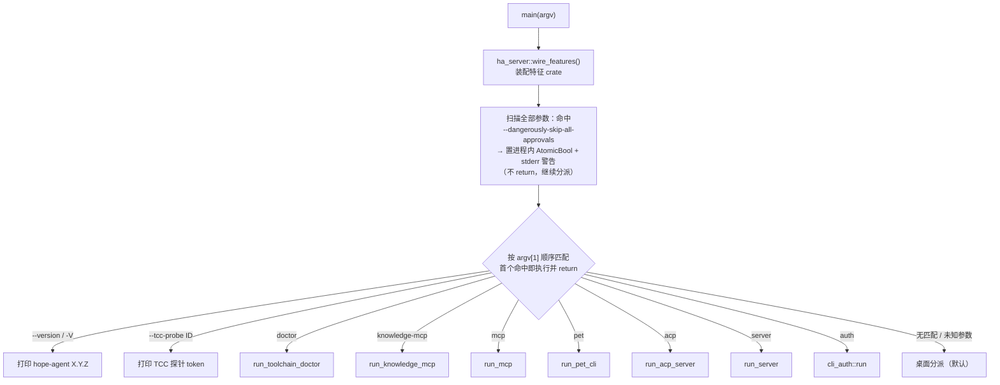
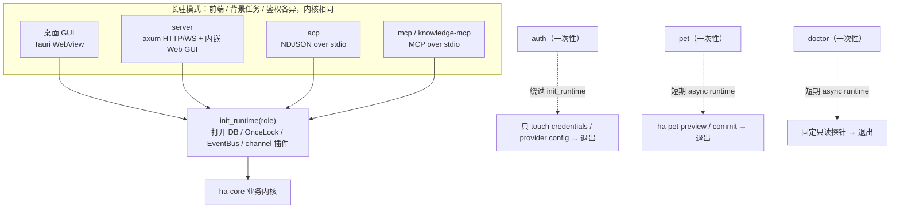
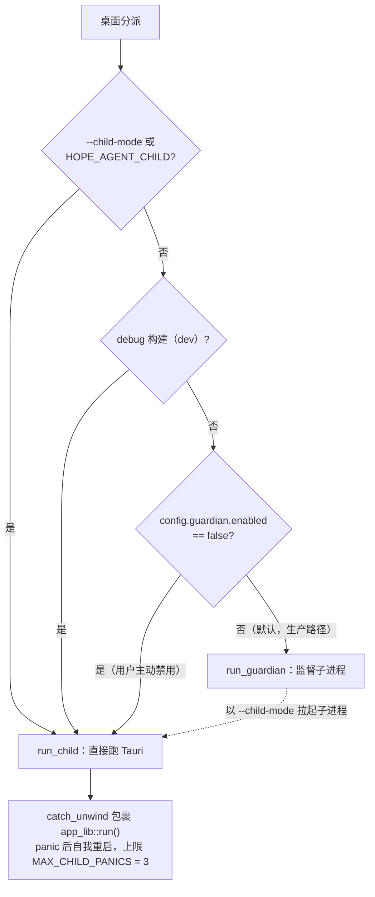
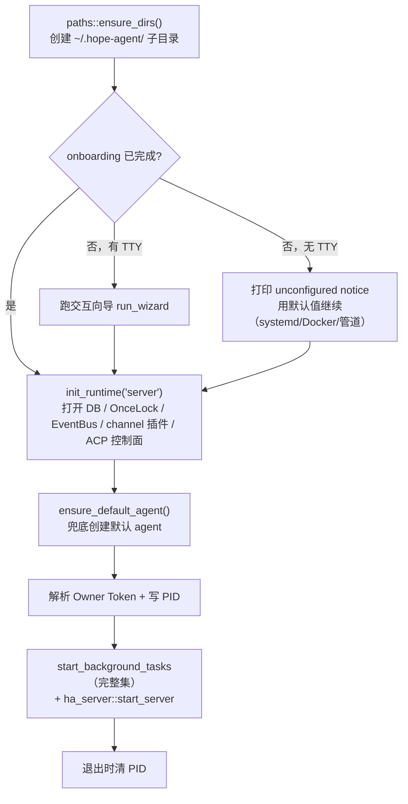
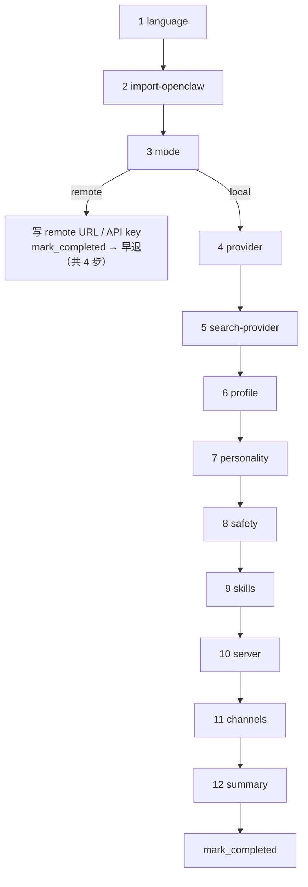
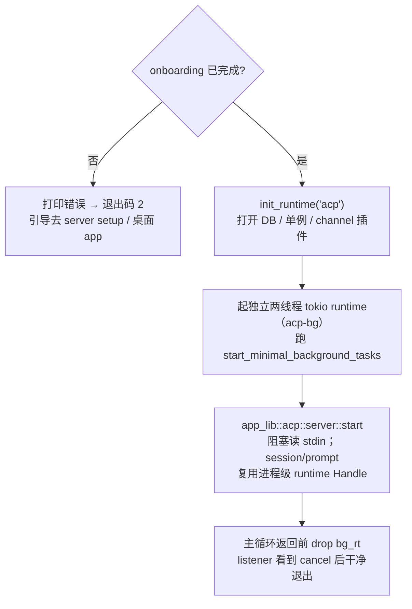

# 命令行接口（CLI）

> 返回 [文档索引](../../README.md) | 关联文档：[Transport 运行模式](transport-modes.md) · [前后端分离架构](backend-separation.md) · [进程与并发模型](process-model.md) · [可靠性与崩溃自愈](../infra/reliability.md) · [ACP 协议](../integration/acp.md) | 关联源码：[`src-tauri/src/main.rs`](../../../src-tauri/src/main.rs)（分发） · [`src-tauri/src/cli_auth.rs`](../../../src-tauri/src/cli_auth.rs)（auth） · [`crates/ha-pet/src/cli.rs`](../../../crates/ha-pet/src/cli.rs)（pet） · [`src-tauri/src/cli_onboarding/`](../../../src-tauri/src/cli_onboarding/)（向导） · [`crates/ha-base/src/platform/service.rs`](../../../crates/ha-base/src/platform/service.rs)（系统服务） · [`crates/ha-base/src/paths.rs`](../../../crates/ha-base/src/paths.rs)（数据目录）

## 核心思想：一个二进制，多种形态

Hope Agent 只编译出一个可执行文件 `hope-agent`。它要同时扮演几种完全不同的角色：桌面 GUI、后台 HTTP/WS 守护进程、给 IDE 用的 ACP stdio 协议服务、给外部 AI host 用的 MCP stdio 服务，以及一次性的 OAuth 登录与宠物包管理工具。CLI 层做的事情只有一件——**看第一个非全局参数，决定这次启动进入哪种形态**。

这里有三条贯穿全文的设计取舍：

- **手写解析、顺序敏感、首个命中即止。** 参数解析不用 clap，而是直接遍历 `std::env::args()`，按固定顺序逐个匹配子命令；匹配到就执行并 `return`，绝不继续往下走。好处是分发路径极短、可预测、零依赖；代价是没有 shell 补全、没有统一 `--help`，而且**未知子命令不会报错，会静默落到桌面启动路径**（`hope-agent typo` 会当成「开桌面」）。
- **长驻模式共享同一个内核。** 桌面 / server / acp / mcp / knowledge-mcp 五种长驻形态跑的是同一套 `ha-core` 业务逻辑，都经过 `init_runtime(role)` 打开数据库、单例、`EventBus`、channel 插件。它们的区别只在三处：**前端入口**（Tauri WebView / axum / stdio 协议）、**背景任务集合**（完整集 vs 精简集）、**鉴权方式**。
- **`doctor`、`auth` 与 `pet` 是一次性命令。** 三者都不进 `init_runtime`、不开 sessions.db 或长跑后台任务；`doctor` 只创建短期 async runtime 执行固定只读探针，`auth` 跑完 OAuth、写下凭据与 Provider 配置就退出，`pet` 只创建短期 async runtime，复用 ha-pet 的读取 / preview / commit 管线后退出。



## 子命令总览

```
hope-agent [GLOBAL_FLAGS] [SUBCOMMAND] [OPTIONS]
```

分发顺序即上图从上到下：**全局 flag → `--version` → `--tcc-probe` → `doctor` → `knowledge-mcp` → `mcp` → `pet` → `acp` → `server` → `auth` → 桌面 / Guardian / 子进程**。

| 子命令 | 性质 | 触发 | 入口函数 | 说明 |
| --- | --- | --- | --- | --- |
| **桌面 GUI** | 长驻进程 | 无子命令（默认） | `run_child` / `run_guardian` | Tauri WebView。生产构建经 Guardian 监督子进程；dev 或用户禁用 Guardian 时直接跑 |
| **工具链诊断** | 短命令 | `hope-agent doctor [--json]` | `run_toolchain_doctor` | 固定只读探针；输出版本与脱敏诊断码，不安装/升级/启动/改配置 |
| **HTTP/WS 服务器** | 长驻进程 | `hope-agent server [...]` | `run_server` | axum 守护进程，内嵌 Web GUI；浏览器访问 `http://<bind>` 即得完整 React UI |
| **Knowledge MCP stdio** | 长驻进程 | `hope-agent knowledge-mcp [...]` | `run_knowledge_mcp` | 把知识空间的模型侧访问 API 暴露为 stdio MCP 工具，供外部 AI host 调用 |
| **平台 MCP stdio** | 长驻进程 | `hope-agent mcp [...]` | `run_mcp` | 平台级 MCP server（设计空间是首个 provider），把子系统暴露为 stdio MCP 工具；默认只读，`--allow-writes` 才开写。见 [mcp-server](../integration/mcp-server.md) |
| **Pet 包管理** | 短命令 | `hope-agent pet <capabilities\|list\|preview\|import\|activate> [...]` | `run_pet_cli` | 探测导入协议、列出 Hope 宠物库、用 preview + expected package hash 两阶段导入本机 / HTTPS 宠物包，或经运行中桌面的鉴权 API 激活已安装宠物 |
| **ACP stdio** | 长驻进程 | `hope-agent acp [...]` | `run_acp_server` | NDJSON over stdio，给 IDE / 外部客户端直连核心协议 |
| **Auth 一次性命令** | 短命令 | `hope-agent auth <provider> [...]` | `cli_auth::run` | 终端环境下完成 OAuth（目前仅 Codex / ChatGPT），登录成功落 token、写 Provider 后退出 |

四种长驻模式（桌面、server、acp、两类 mcp）共享 `ha-core` 业务逻辑、`init_runtime(role)` 初始化路径与 `EventBus`；`doctor`、`auth` 与 `pet` 不进 `init_runtime`，只执行一次性业务后退出。



## `hope-agent doctor` 子命令

`hope-agent doctor` 输出适合终端阅读的单项状态，`hope-agent doctor --json` 输出与设置页、Tauri 和 HTTP 完全相同的 `ToolchainDoctorReport`。探针覆盖操作系统、Docker、Chrome/Chromium、FFmpeg、GitHub CLI、Ollama、Python、LSP 与可选 Office/PDF 工具；固定参数、无 shell、单项超时和输出上限，以及 ANSI/control 清理与凭据脱敏规则见 [可靠性与崩溃自愈](../infra/reliability.md#93-只读工具链诊断)。该命令不初始化 Hope 数据目录，也不安装、升级、启动或重新配置任何系统组件。

## 全局参数

在 `main()` 顶层处理，先于子命令分发，因此对桌面 / server / knowledge-mcp / mcp / acp 都生效。

| 参数 | 类型 | 默认 | 说明 |
| --- | --- | --- | --- |
| `--dangerously-skip-all-approvals` | flag | off | 跳过所有工具审批（**仅本次启动**，不写 config）。顶层扫描全部参数命中后，经 `security::dangerous::set_cli_flag(true)` 落进程内 `AtomicBool` 并向 stderr 打一行警告，**不 return**——随后仍照常分发子命令；各子命令解析器再次遇到它会静默 consume。与 `AppConfig.permission.global_yolo` 是 OR 关系，详见 [权限/审批系统](../agent/permission-system.md) |
| `--version` / `-V` | flag | — | `hope-agent --version`（或 `-V`，不带子命令）在子命令分发前打印 `hope-agent X.Y.Z`（取自 `CARGO_PKG_VERSION`）后退出，**不会**落到桌面启动路径。子命令各自的 `acp --version` / `server --version` 等走自己的解析器（在此分支之后由各子命令匹配） |
| `--tcc-probe <permission-id>` | flag | — | **内部用**：macOS TCC 权限探针进程。打印一行 `hope-agent-tcc-probe:granted=1\|0\|unknown` 后退出，由 [系统权限](../infra/macos-permissions.md) 子系统 spawn（新进程才能看到运行期新授的录屏权限）。**判据是 stdout token 而非退出码**；此分支**必须早于 guardian / 子进程分派**（否则每次探针会拉起一个完整 GUI），且不初始化任何运行时状态（不 `ensure_dirs`、不 `init_runtime`、不建日志） |

> Plan Mode 仍能压过 YOLO 的限制工具集：YOLO 只跳审批门控，不放行 protected paths / dangerous commands 之外本就被禁的工具。

## 桌面模式

```
hope-agent [--child-mode] [--dangerously-skip-all-approvals]
```

| 参数 | 类型 | 默认 | 说明 |
| --- | --- | --- | --- |
| `--child-mode` | flag | off | **内部使用**——Guardian 拉起子进程时附带的标记。等价环境变量 `HOPE_AGENT_CHILD`（任意非空值）保留给旧路径。终端用户不应直接指定 |

桌面模式是「无匹配」时的默认落点。是否套一层 Guardian 监督，由下面这棵决策树决定：



`is_guardian_enabled()` 读 `config.json` 的 `guardian.enabled`，**配置缺失或不可读时默认 true**（保守地开启监督）。`run_child` 用 `std::panic::catch_unwind` 包裹 `app_lib::run()`，单个进程最多自我重启三次；超过即退出码 1，由 Guardian 接管下一轮。Guardian 父子协议、退出码语义详见 [可靠性与崩溃自愈](../infra/reliability.md)。

## `hope-agent server` 子命令

```
hope-agent server [SUBCOMMAND] [OPTIONS]
```

不带子命令时等价于 `start`，前台启动 HTTP/WS 服务。

### 服务管理子命令

| 子命令 | 行为 | 入口 |
| --- | --- | --- |
| _（默认）_ | 前台启动服务，写 PID 文件 `~/.hope-agent/server.pid`，跑完整 `start_background_tasks` 集 | `run_server` |
| `install` | 注册系统服务（macOS launchd / Linux systemd-user / Windows Task Scheduler），Owner Token 只写 0600 凭据文件、不进服务 argv | `run_server_install` |
| `uninstall` | 卸载系统服务 | `service_install::uninstall_service` |
| `status` | 查询服务运行状态（launchd load / systemd unit active / 计划任务状态） | `service_install::service_status` |
| `stop` | 停止运行中的服务（读 PID 后 Unix 发 SIGTERM、Windows 发优雅停止信号） | `service_install::stop_server` |
| `setup` | 仅运行一次首次启动向导，不启动 HTTP，给运维「先配置后开服」用 | `run_server_setup` |
| `token show/rotate` | 显示或写入新的单一 Owner Root Token | `run_server_token` |

### `start` / `install` 选项

两者都由 `parse_server_args` 解析，选项集合相同，但**对已废弃的命令行密钥 `--api-key` 处置不同**：`start` 保留一条兼容路径，接受它仅用于把旧版服务定义里的 argv 密钥迁进凭据存储；`install` 则一律拒绝（命令行密钥对其它进程可见）。两条路径都推荐改用 `HA_API_KEY` 或 `--api-key-file`。

| 参数 | 短选项 | 类型 | 默认 | 说明 |
| --- | --- | --- | --- | --- |
| `--bind ADDR` | `-b` | host:port | `127.0.0.1:8420` | 绑定地址。非回环监听且无 Token 时 fail-closed 拒启，除非显式传危险开关 |
| `--api-key-file PATH` | — | path | _（未设）_ | 从文件读 Owner Token；优先级高于 `HA_API_KEY`（两个环境变量读取后都立即从进程环境移除，不传给工具子进程） |
| `--allow-unauthenticated-network` | — | flag | off | 危险逃生口：允许非回环地址无鉴权启动；等价环境变量 `HA_ALLOW_UNAUTHENTICATED_NETWORK` |
| `--dangerously-skip-all-approvals` | — | flag | off | 顶层已生效，server 解析器再次遇到时静默 consume |
| `--version` | — | flag | — | 打印 `hope-agent-server X.Y.Z` 后退出 |
| `--help` / `-h` | — | flag | — | 打印帮助后退出 |

`start` 启动序列（注意 `init_runtime` 必须早于 `ensure_default_agent`）：



`init_runtime` 里含 legacy `"default"` → `"ha-main"` 的一次性 agent-id 迁移，必须先跑；否则 `ensure_default_agent` 会抢先预建一个空的 `agents/ha-main/` 模板，把用户定制的旧数据顶掉。完整的启动分层见 [前后端分离架构](backend-separation.md) 与 [进程与并发模型](process-model.md)。

### `setup` 选项

`hope-agent server setup [--reset]`，跑首次启动向导但不随后开 HTTP，适合运维在开服前先配置。

| 参数 | 说明 |
| --- | --- |
| `--reset` | 跑向导前先调 `onboarding::state::reset()` 清除 onboarding 状态。**Provider / config 不删**，仅重放向导 |
| `--help` / `-h` | 打印帮助后退出 |

#### 首次启动向导

向导编排在 [`cli_onboarding/wizard.rs`](../../../src-tauri/src/cli_onboarding/wizard.rs)，每步一个独立模块在 [`steps/`](../../../src-tauri/src/cli_onboarding/steps/)。它是一条自成体系的 12 步 CLI 流程；在 mode 步选 remote 会短路早退。



| 序号 | 步骤 | 行为 |
| --- | --- | --- |
| 1 | language | 从界面语言列表（含「跟随系统」，及简体/繁体中文、英日韩、西葡俄阿等）选一种，写 `config.language` + `user.language` |
| 2 | import-openclaw | 扫 `~/.openclaw/`；检测到则单次 yes/no 一并导入所有 provider / agent / 全局记忆 / agent 记忆，没装或选跳过则静默略过 |
| 3 | mode | local 还是 remote。**Remote 分支**：提示 URL + 可选 API key，HTTP 探一下 `<url>/api/health`（10s 超时，可选 Bearer），写 `user.server_mode/remote_server_url/remote_api_key` 后 `mark_completed` **早退**——后续 4–12 步全跳过 |
| 4 | provider | 主 LLM provider 配置（OAuth / API key），复用 [`oauth.rs`](../../../crates/ha-core/src/oauth.rs) |
| 5 | search-provider | 网页搜索 Provider：DuckDuckGo / SearXNG / Tavily / Bocha / Brave / Perplexity / Google / Grok / Kimi，或「跳过」；空密钥不覆盖已有值 |
| 6 | profile | 用户名 / 时区 / AI 经验 / 回复偏好 |
| 7 | personality | Personality preset（default / engineer / creative / companion） |
| 8 | safety | 工具审批开关（关 = 写 `global_yolo=true`，权限引擎对工具调用直接返回 Allow、不再弹审批；protected paths / dangerous commands 也一并放行，只在日志留一行警告） |
| 9 | skills | bundled skills 多选（默认全开，取消勾选写进 `disabled_skills`） |
| 10 | server | 内嵌 HTTP 的 bind 地址 + 单一 Owner Token（本机 `127.0.0.1:8420` 下 Token 可选，LAN `0.0.0.0:8420` 强制；`generate_api_key()` 生成高熵 `hope_...` Token） |
| 11 | channels | 列出 13 种 IM channel（Telegram / Discord / Slack / Feishu / Google Chat / LINE / QQ Bot / WhatsApp / WeChat / Signal / IRC / iMessage / Email），提示去 Web GUI 配凭据，CLI 不收集 |
| 12 | summary | 反读所有持久化设置打印 recap：server 只打印 URL 与 Token 是否已设，Root Token 永不拼进 URL；bind 是 `0.0.0.0` 时附 LAN IP 列表 |

**Remote 模式短路**：一旦这台机器只是指向远程 server，本机就没有 provider / agent / channels 要配（那些都在远程那台上），所以向导在 mode 步直接 `mark_completed()` 并结束。

**与 GUI 的关系**：桌面 / Web GUI 有自己独立的引导 UI，步骤组织方式与 CLI 不同（语言 / 主题选择、远程连接都收在欢迎页里，流程更短）。两侧真正共享的是同一份持久化 `OnboardingState`——**任意一边走完并 `mark_completed()`（即 `completed_version` 追上 `CURRENT_ONBOARDING_VERSION`），下次启动就跳过引导**，不必两边都跑一遍。CLI 侧几个固有特点：它是 headless，没有主题选择；channels 步只列名不收凭据；OpenClaw 导入是单 yes/no 的批量收纳（要 per-provider / per-agent 细粒度选择与重命名请走 GUI）。

### `install` 平台行为

系统服务的 OS 差异实现在 [`platform/service.rs`](../../../crates/ha-base/src/platform/service.rs)，`service_install.rs` 只是对外的兼容包装。三平台都装的是**用户级、登录自启**的后台单元，语义对齐：

| 平台 | 服务管理器 | 位置 / 标识 | 说明 |
| --- | --- | --- | --- |
| macOS | launchd | `~/Library/LaunchAgents/ai.hopeagent.server.plist` | 登录时自动启动 |
| Linux | systemd (user) | `~/.config/systemd/user/hope-agent.service` | 通过 `systemctl --user` 管理 |
| Windows | Task Scheduler | 计划任务 `Hope Agent`（`schtasks /Create /SC ONLOGON /RL LIMITED`） | 登录时以当前用户、受限令牌自启。**不是**真正的 Windows Service（那需要 SCM 协议），但对「每用户后台代理」这一用途，计划任务比系统级服务更贴近 launchd LaunchAgent / `systemctl --user` 的行为 |

### `token show/rotate`

`hope-agent server token <show|rotate>`：

- `show`——把当前有效的 Owner Token 打到 stdout（外部通过 `HA_API_KEY` / `HA_API_KEY_FILE` 管理时打印那份，否则打印本地凭据存储里的）。没有配置 Token 则报错退出码 1。
- `rotate`——生成、存储并打印一枚新 Owner Token。**若 Token 由 `HA_API_KEY` / `HA_API_KEY_FILE` 外部托管，则拒绝轮换**（请在源头改）。轮换只写凭据文件；**运行中的服务需重启才激活新 Token 并让旧会话失效**。

## `hope-agent acp` 子命令

```
hope-agent acp [OPTIONS]
```

NDJSON over stdio，给 IDE / 外部 ACP 客户端直连核心协议用。

| 参数 | 短选项 | 类型 | 默认 | 说明 |
| --- | --- | --- | --- | --- |
| `--verbose` / `-v` | `-v` | flag | off | 在 stderr 打印启动 banner（版本 / agent id / 协议） |
| `--agent-id ID` / `-a ID` | `-a` | string | `ha-main` | 指定使用哪个 agent（默认取 `agent_loader::DEFAULT_AGENT_ID`）。**不存在时不会兜底**，会在 ACP 会话内拿到错误 |
| `--dangerously-skip-all-approvals` | — | flag | off | 同全局，被 acp 解析器静默 consume |
| `--version` | — | flag | — | 打印 `hope-agent-acp X.Y.Z` 后退出 |
| `--help` / `-h` | — | flag | — | 打印帮助后退出 |

ACP 的启动比 server 多两个约束：**stdio 就是协议通道，不能弹向导**，所以未配置只能硬失败退出；而且它的后台任务集是**精简的**，不跑定时器、cron、dreaming、watchdog。



`start_minimal_background_tasks` 起的是一套贴近完整档、只砍掉守护进程专属项的进程内任务：channel 的审批 / ask_user 监听、hooks 配置加载与热重载（ACP 同样跑 hooks）、embedding 初始化、session 清理、浏览器 broker、后台 job 调度器、subagent 队列调度器、审批状态投影，以及 MCP `init_global`（外加 crash-flush 信号处理）；Primary 进程再补上 async_jobs / workflow / 本地模型 / wakeup 等重放。真正刻意跳过的只有定时器、channel 自启、cron、dreaming、MCP watchdog——ACP 是短交互的协议通道，不需要守护进程那一整套。ACP 主循环留在主线程同步读 stdio，但 prompt 经外层进程级 multi-thread runtime 的 `Handle::block_on` 执行；该 runtime 同时承载 turn 派生的后处理，不能退回函数级 current-thread runtime。详见 [ACP 协议](../integration/acp.md)。

## `hope-agent knowledge-mcp` 子命令

```
hope-agent knowledge-mcp [OPTIONS]
```

给 Claude Desktop / Cursor / Codex / Claude Code 等外部 MCP host 的**知识空间出口**。协议是 newline-delimited JSON-RPC over stdio：stdout 只输出 MCP 消息，日志和错误走 stderr。

| 参数 | 类型 | 默认 | 说明 |
| --- | --- | --- | --- |
| `--allow-proposals` | flag | off | 默认只暴露只读工具；打开后额外暴露 `knowledge_compile_propose`，但它仍只创建 Review Diff proposal，不直接写 `.md` |
| `--version` | flag | — | 打印 `hope-agent-knowledge-mcp X.Y.Z` 后退出 |
| `--help` / `-h` | flag | — | 打印帮助后退出 |

工具集：

- 默认（只读）：`knowledge_search`、`knowledge_read`、`knowledge_expand`、`knowledge_sources`
- 加 `--allow-proposals`：额外 `knowledge_compile_propose`

启动序列 `ensure_dirs → set_app_version → init_runtime("knowledge-mcp") → agent_mcp::run_stdio()`。MCP 层只做协议包装，所有行为复用知识空间的模型侧访问 API，因此 raw source 隔离、Review Diff、外部 root 只读与 stale-write guard 都与 HTTP / Tauri 出口一致。详见 [knowledge-base](../core/knowledge-base.md)。

## `hope-agent mcp` 子命令

```
hope-agent mcp [--allow-writes]
```

**平台级** MCP server：共享 host（`mcp_server::`）+ `ToolProvider` 注册表，**设计空间是首个 provider**。它与 `knowledge-mcp`（独立子命令、保持原样）互补——`mcp` 是「Hope Agent as MCP server」的统一入口，后续 memory 等子系统挂同一 host。协议同为 NDJSON JSON-RPC over stdio、本机信任无 token。

| 参数 | 类型 | 默认 | 说明 |
| --- | --- | --- | --- |
| `--allow-writes` | flag | off | 默认只读（项目 / 卡片 / 系统 / 版本 / 评论的列表与读取，加 active-context）；打开后额外暴露写工具（`design_generate_artifact` / `design_update_artifact` / `design_edit_element` / `design_restyle` / `design_restore_version` / `design_add_comment` / `design_resolve_comment`）。**恒不暴露** implement / 代码绑定写 / deploy / share / delete / export（外部 agent 不得写用户代码仓库、对外发布或删除） |
| `--version` | flag | — | 打印 `hope-agent-mcp X.Y.Z` 后退出 |
| `--help` / `-h` | flag | — | 打印帮助后退出 |

启动序列 `ensure_dirs → set_app_version → init_runtime("mcp") → mcp_server::run_stdio(options, [DesignToolProvider])`。host 用 multi-thread runtime——设计生成工具内部会 `tokio::spawn`，需要在 `block_on` 之外存活。工具表 / active-context / 写门细节见 [mcp-server](../integration/mcp-server.md)。

## `hope-agent pet` 子命令

```text
hope-agent pet capabilities [--json]
hope-agent pet activate --pet-ref <PET_REF> [--json]
hope-agent pet list [--json]
hope-agent pet preview --source <PATH|URL> [--source <PATH> ...] [--display-name NAME] [--json]
hope-agent pet import --source <PATH|URL> [--source <PATH> ...] --expected-package-hash <BLAKE3> [--display-name NAME] [--json]
```

Pet 是本机一次性资源管理入口，桌面与 headless binary 都接线；它不启动 GUI、HTTP listener、sessions.db 或后台任务。`capabilities --json` 输出带 `status=capabilities`、`schemaVersion` 与 `activateInstalled` 的稳定握手，调用方不得只凭退出码判断 CLI 存在。`list` 每次重扫 `~/.hope-agent/pets/`，`preview` / `import` 直接复用 [`ha-pet` 导入管线](../core/pet.md#导入管线preview--validate--commit)，支持本机目录、zip、manifest、PNG/WebP、deep link，以及任意公网 origin 上的直接 HTTPS zip / manifest / atlas；同目录的 loose manifest + sprite 可用重复 `--source` 作为一个包交付。普通网页须先解析出实际下载物，CLI 不执行站点安装器、不把 HTML 当包。

`activate` 不在短进程里直接改 enabled：它从本机 0600 credential store 内部读取托管 Owner Token，按当前 `server.bindAddr` 的端口调用运行中桌面的 loopback `POST /api/pets/activate`，由 desktop runtime 原子校验并写入 `selectedPetRef + enabled=true`、再驱动 PetWindow。客户端禁用代理与重定向，非 loopback / unspecified bind fail closed；Token 不进 argv、stdout 或错误消息。桌面未运行、版本不支持、认证不匹配或 endpoint 属 headless 时命令非零退出，不以离线配置写伪造成功。

Agent 的 bundled Pet skill 固定通过 `exec` 调 `hope-agent pet …`。exec 只在整条命令能解析为无 shell 运算/展开的 Pet CLI argv 时，才以参数数组直调当前运行实例的精确二进制；这条 sealed host-control handoff 仍先过普通 exec 审批，但不受会话 shell sandbox 的容器 PATH / 平台格式限制，也不把桌面二进制或 Owner Token 下放进容器。该旁路只接受前台、非 PTY、无自定义 env；其它命令继续按原 sandbox 语义执行。

CLI 刻意不把 preview token 跨进程持久化。`preview` 输出 manifest、尺寸、校验问题、duplicate、`assetHash`、`packageHash` 与 `canCommit`，随后销毁自己的临时 token；调用方把这些信息展示给用户并等待明确确认。`import` 要求传回那个 `packageHash`，重新读取 / 下载同一来源、重新校验，hash 不一致则报 `pet_cli_source_changed`，绝不提交新字节。`--display-name` 参与 canonical package hash，故两步必须传相同值。

成功提交只写 Hope 的内容寻址宠物库并返回 `petRef` / `imported`；它恒 `enable_after_import=false`，不会选择宠物、唤醒 overlay，也不会调用 `npx codex-pet-installer` 或写 `~/.codex/pets`。若桌面设置页已打开，独立 CLI 进程的 EventBus 不跨进程；下次 `pet list` / 打开或刷新 Pets 设置时会从磁盘权威目录重扫。需要即时进程内通知的客户端应使用 Bearer-auth HTTP preview / commit。

## `hope-agent auth` 子命令

```
hope-agent auth <provider> <action> [OPTIONS]
```

当前唯一的**一次性**子命令——不进 `init_runtime`、不起后台 runtime、不开 `EventBus`，只为终端用户跑完主 LLM Provider 的 OAuth 后退出。设计上与 [MCP OAuth](../integration/mcp.md) 各自独立（`oauth.rs` vs `mcp/oauth.rs`，互不共用）。

### Provider

| Provider | 状态 | 入口 | 说明 |
| --- | --- | --- | --- |
| `codex` | 已支持 | `hope-agent auth codex <action>` | ChatGPT / Codex OAuth。token 落 `~/.hope-agent/credentials/auth.json` |

扩展新 Provider 时在 `cli_auth::run` 的 match 分支里加即可。

### `auth codex` 动作

| 动作 | 说明 |
| --- | --- |
| `login` | OAuth 浏览器登录，成功后保存 token + 通过 `provider::ensure_codex_provider_persisted` 把 Codex Provider 写进 `config.json`。**不带动作时默认就是 `login`** |
| `status` | 打印 token 状态：`authenticated` / `expired` / `not authenticated`，附 account id、token 路径、refresh token 是否存在 |
| `logout` | 调 `provider::delete_providers_by_api_type(Codex, "cli")` 清掉所有 Codex Provider 行，再调 `oauth::clear_token()` 删 `auth.json` |

### `auth codex login` 选项

| 参数 | 类型 | 默认 | 说明 |
| --- | --- | --- | --- |
| `--no-open` | flag | `--open` | 只打印 auth URL 不自动开浏览器。SSH / headless 环境必备 |
| `--open` | flag | （默认） | 显式启用浏览器自动打开 |
| `--model MODEL` | string | `gpt-5.6-terra` | 登录成功后切到该 Codex 模型作为 active model（默认值跟随 `agent::DEFAULT_CODEX_MODEL_ID`，随版本 bump 变化）。模型名经 `agent::is_valid_codex_model` 校验，未知模型会列出可选项后报错 |
| `--no-active` | flag | off | 登录成功后**不**切 active model。`make_active=true` 时实际写 `ActiveModelUpdate::Always(model)`，否则写 `Never` |
| `--help` / `-h` | flag | — | 打印帮助后退出 |

OAuth 回调走本机 loopback `http://localhost:1455/auth/callback`，远端 SSH 场景需先在客户端建端口转发：

```
ssh -L 1455:127.0.0.1:1455 <host>
```

`login` 内部新建独立 tokio runtime 跑 `oauth::start_oauth_flow_with_auth_url`，500ms 轮询一次共享 slot 直到拿到 token 或用户 Ctrl-C；结束后 runtime drop、进程退出。

### `auth codex status` / `logout` 选项

两个动作都只接受 `--help` / `-h`；多余参数会报 `unknown status option` / `unknown logout option` 并退出码 1。

### 几个易踩的细节

- **`logout` 是破坏性的**：会真正从 `config.json` 删 Codex Provider 行，不只是清 token。重新登录会重建 Provider。
- **`login` 与向导共用 OAuth 实现**：`oauth.rs` 的 `start_oauth_flow_with_auth_url` 同时给 `cli_auth` 和向导的 provider 步用——首次启动向导里选 Codex 走的就是同一条路径。
- **`--version`**：`hope-agent auth --version` 打印 `hope-agent-auth X.Y.Z` 后退出。
- **未知 provider 退出码 2**：`hope-agent auth foo` 报错并退出码 2，与 ACP onboarding 的退出码 2 语义不同但共享数字。

## 退出码语义

| 退出码 | 触发 |
| --- | --- |
| 0 | 正常退出（用户关窗 / Ctrl-C / `--version` / `--help` / `auth codex login` 成功 / `auth codex status` 完成） |
| 1 | 通用错误：服务管理失败 / 向导失败 / server 启动失败 / 子进程超过 `MAX_CHILD_PANICS` / `auth codex` 任意动作失败 / `token show` 无 Token |
| 2 | 前置条件失败：ACP 模式 onboarding 未完成（无法在 stdio 上交互）/ `hope-agent auth <未知 provider>` / server 侧 Owner Token 加载失败或拒绝无鉴权的非回环监听 / 拒绝命令行明文密钥 |

Guardian 父子层之间还有自定义退出码协议（崩溃 vs 用户主动退出 vs 重启请求），详见 [可靠性与崩溃自愈](../infra/reliability.md)。

## 环境变量

CLI 直接消费或路径相关的环境变量。完整跨子系统列表分散在各架构文档中。

| 变量 | 角色 | 说明 |
| --- | --- | --- |
| `HA_DATA_DIR` | 用户 | 覆盖数据根目录（默认 `~/.hope-agent/`）。**值整体当作根目录用**，不会再追加 `.hope-agent` 后缀；适合便携模式 / 集成测试。详见 [`paths.rs`](../../../crates/ha-base/src/paths.rs) |
| `HA_API_KEY` | 用户（server） | server 的 Owner Token 来源之一。读取后立即从进程环境移除，不传给工具子进程；优先级低于 `--api-key-file` / `HA_API_KEY_FILE` |
| `HA_API_KEY_FILE` | 用户（server） | 从文件读 Owner Token，等价 `--api-key-file`；优先于 `HA_API_KEY`，读取后立即移除 |
| `HA_ALLOW_UNAUTHENTICATED_NETWORK` | 用户（server） | 等价 `--allow-unauthenticated-network`：允许无 Token 的非回环监听（危险） |
| `HA_WEB_ROOT` | 用户（开发） | server 模式下让 axum 静态托管指向本地 `dist/` 而非嵌入产物——改前端不用每次重打包。设置后检查 `index.html` 是否存在，缺失则降级回嵌入产物 |
| `HOPE_AGENT_CHILD` | 内部（兼容） | 等价 `--child-mode`，给旧 Guardian 路径留的兼容入口 |
| `HOPE_AGENT_RECOVERED` | 内部（Guardian） | Guardian 在 panic 重启子进程时设为 `"1"`，提示这是恢复启动 |
| `HOPE_AGENT_CRASH_COUNT` | 内部（Guardian） | Guardian 重启子进程时把累计崩溃次数（数字字符串）传给子进程 |
| `HOPE_AGENT_BUNDLED_SKILLS_DIR` | 用户/打包者 | 覆盖 bundled skills 目录。优先级 `env > CARGO_MANIFEST_DIR（仅 debug）> 二进制内嵌解压`（内置技能已编译进二进制，正常部署无需设置） |

## 数据目录速查

完整路径管理在 [`paths.rs`](../../../crates/ha-base/src/paths.rs)。所有路径相对 `HA_DATA_DIR` 或默认 `~/.hope-agent/`。

| 路径 | 用途 |
| --- | --- |
| `config.json` | 主配置（详见 [配置系统](../infra/config-system.md)） |
| `agents/` | 每 Agent 状态、`memory/MEMORY.md`、soul.md |
| `credentials/` | OAuth token、MCP 凭据（0600 原子写） |
| `channels/` | IM 渠道插件状态 |
| `permission/` | 保护路径 / 危险命令 / 编辑命令 / AllowAlways 列表 |
| `skills/` | 用户自定义 skill |
| `bundled-skills/<hash>/` | 二进制内嵌技能的解压缓存（可删，下次启动重建） |
| `extension/browser/` | Chrome 扩展稳定镜像（Load unpacked 指向此处；`extension/.browser-synced` marker 记录源指纹） |
| `plans/<agent_id>/<session_id>/` | Plan Mode 设计契约文件，按 agent、session 两级隔离（根目录可经 `plansDirectory` 配置覆盖；详见 [Plan Mode](../agent/plan-mode.md)） |
| `tool_results/<session_id>/` | 受管媒体与遗留大结果目录；新普通文本 ResultStore 正文能力当前关闭，不再向模型发布这里的路径 |
| `attachments/<session_id>/` | IM / 多模态附件归档 |
| `background_jobs/` + `background_jobs.db` | 后台异步工具任务的结果 spool 与状态库（纯可重建缓存；模块 / 日志仍叫 `async_jobs`，磁盘与 DB 是 `background_jobs`） |
| `local_model_jobs.db` | 本地模型后台任务（Ollama 安装、模型拉取） |
| `recap/recap.db` | 深度复盘缓存 |
| `memory/dreams/` | Dreaming diary markdown |
| `server.pid` | server 模式运行时 PID |

## 其它入口

下面这些 CLI 在 `pnpm` 脚本里调用，不是 `hope-agent` 二进制的子命令，但同样属于「项目命令行接口」：

| 命令 | 用途 | 来源 |
| --- | --- | --- |
| `pnpm desktop` | 交互选择下面四种桌面 dev 模式 | [`package.json`](../../../package.json) |
| `pnpm dev:desktop` | 默认桌面 dev，不构建 Browser Host / Eval Sidecar | 同上 |
| `pnpm dev:desktop:browser` | Chrome 插件联调，仅构建 Browser Host | 同上 |
| `pnpm dev:desktop:eval` | 评测功能开发，仅构建 Eval Sidecar | 同上 |
| `pnpm dev:desktop:full` | 完整桌面能力验证，构建 Browser Host 与 Eval Sidecar | 同上 |
| `pnpm tauri dev` | 兼容旧入口，构建两个可选二进制后启动桌面 dev | 同上 |
| `pnpm dev` | 仅前端 Vite 开发服务器 | 同上 |
| `pnpm tauri build` | 构建桌面生产包 | 同上 |
| `pnpm sync:version` | 把 `package.json` 版本同步到 `src-tauri` | [`scripts/sync-version.mjs`](../../../scripts/sync-version.mjs) |
| `pnpm release:verify` | 校验 `package.json` / `src-tauri` 版本一致 | [`scripts/verify-release-version.mjs`](../../../scripts/verify-release-version.mjs) |
| `pnpm typecheck` / `lint` / `test` | 前端类型检查 / lint / Vitest | [`package.json`](../../../package.json) |
| `node scripts/sync-i18n.mjs --check` | 检查各语言翻译缺失 | [`scripts/sync-i18n.mjs`](../../../scripts/sync-i18n.mjs) |
| `node scripts/sync-i18n.mjs --apply` | 从基础语言补齐缺失翻译 | 同上 |

提交前自查由 [`.husky/pre-push`](../../../.husky/pre-push) 钩子在 `git push` 时跑：`cargo fmt --all --check`、clippy / cargo test（覆盖非 Tauri 的 Rust crate，精确清单以 `.husky/pre-push` 为准，新增 crate 只改那里）、`pnpm typecheck`、`pnpm lint`、`pnpm test`。

## 已知边界

- **没有 clap 也没有 shell 补全**：参数解析手写 `std::env::args()`，未知参数只 stderr 警告不报错。引入新参数时要么继续手写并维护本文档，要么切到 clap-derive。
- **未知子命令静默落到桌面**：`hope-agent typo` 不报错，会被当成「桌面模式」启动 Tauri——手写 arg 解析的副作用。
- **桌面模式无顶层 `--help`**：`hope-agent --version` / `-V`（不带子命令）在分发前打印版本退出（不落 Tauri 路径），但顶层 `--help` 尚未实现，会被当成未知参数进入桌面启动流程。子命令级 `--version` / `--help` 在各子命令解析器里都有。
- **`server install` 不持久化 `--dangerously-skip-all-approvals`**：YOLO 是进程内 `AtomicBool`，不进 plist / unit / 计划任务；想让服务永远 YOLO 必须改 `AppConfig.permission.global_yolo`。
- **命令行明文密钥 `--api-key` 已弃用**：命令行参数对其它进程可见。`server install` 一律拒绝；`server start` 仅保留一条把旧服务定义里的 argv 密钥迁进凭据存储的兼容路径。请改用 `HA_API_KEY` 或 `--api-key-file`。
- **`server setup` OpenClaw 导入是单 yes/no 粒度**：CLI 一次性收纳所有可导入项（target_id = source_id、`vibe = None`、所有可用文件全导）。要 per-provider / per-agent 多选 + 重命名 + emoji 编辑请走 GUI。
- **`server setup` 没有主题选择**：CLI headless 跳过——主题在桌面 GUI / 浏览器 Web GUI 自己设。
