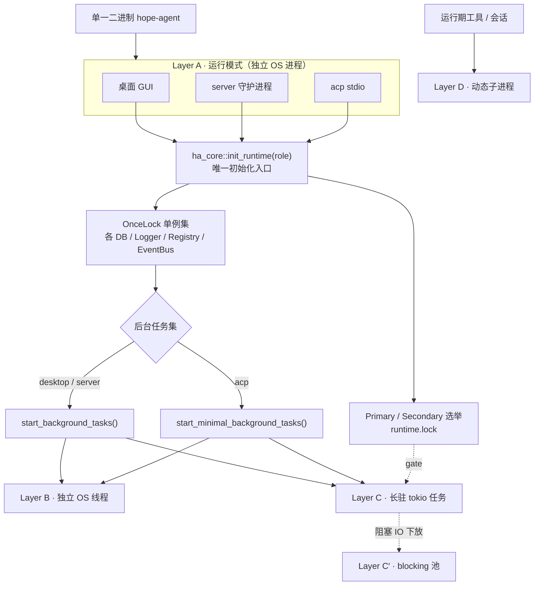
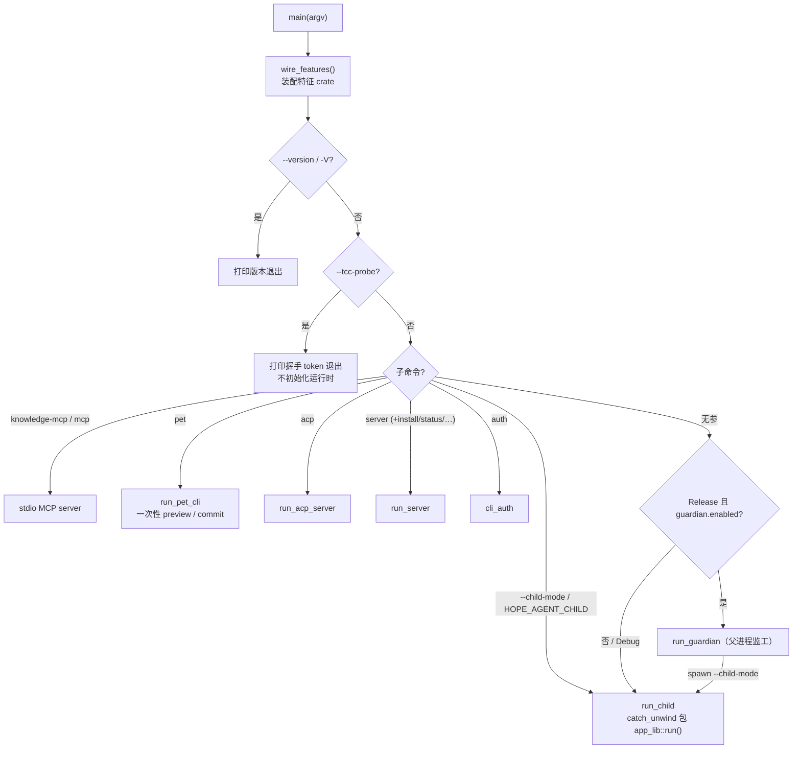
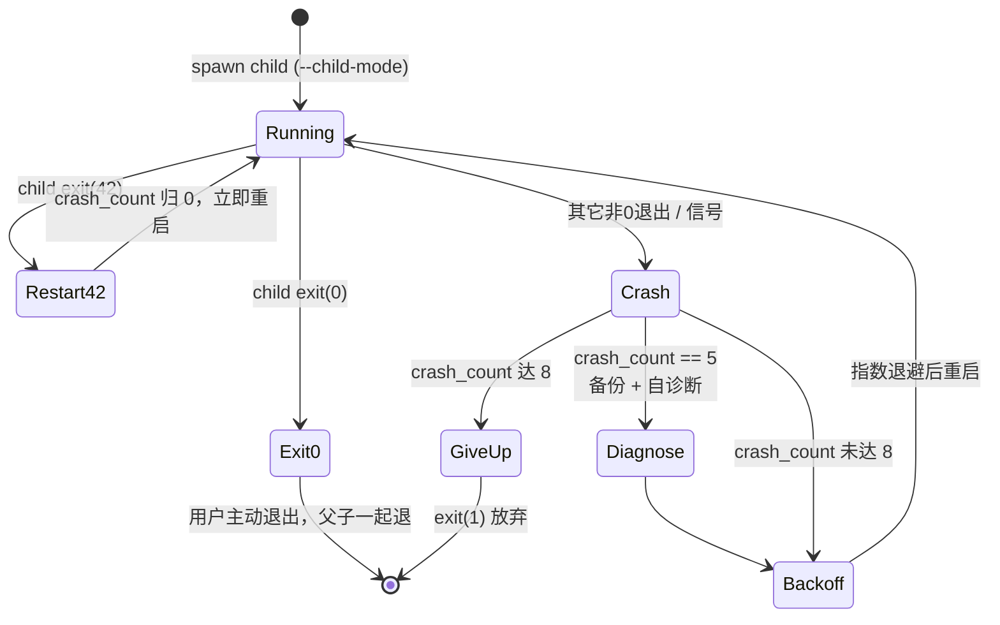
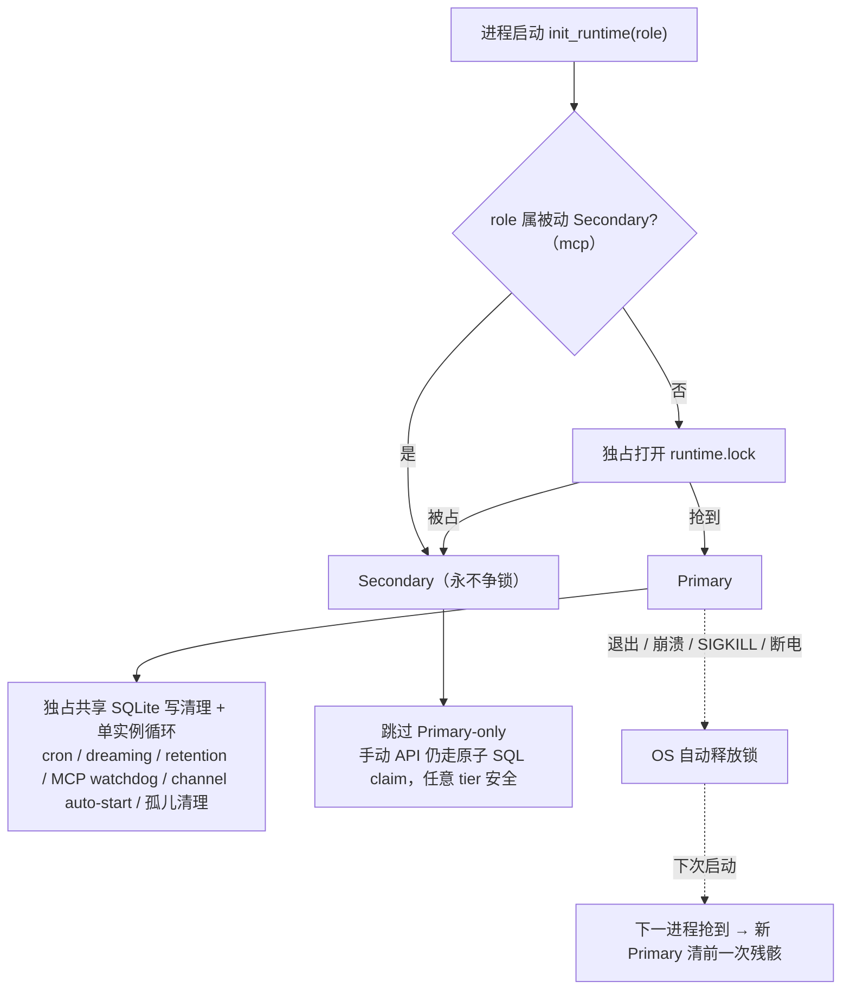
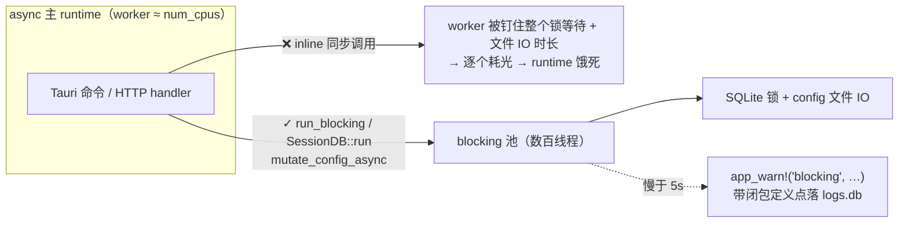
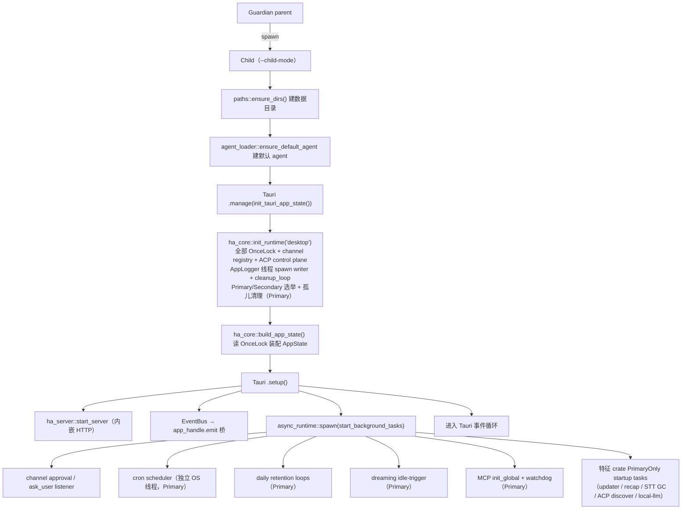
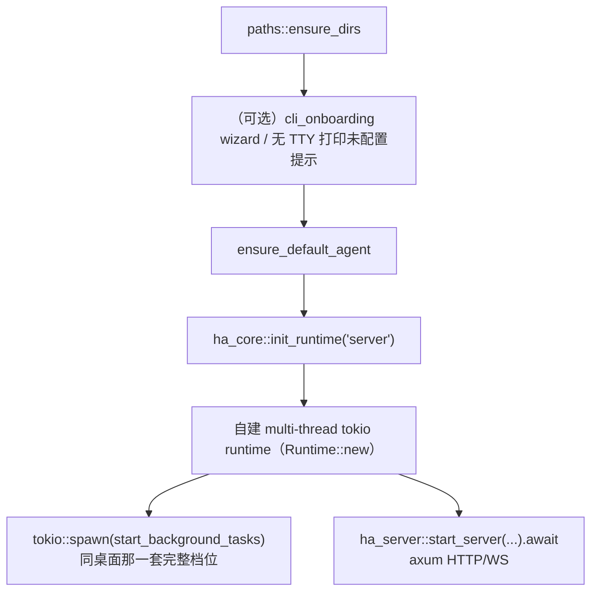
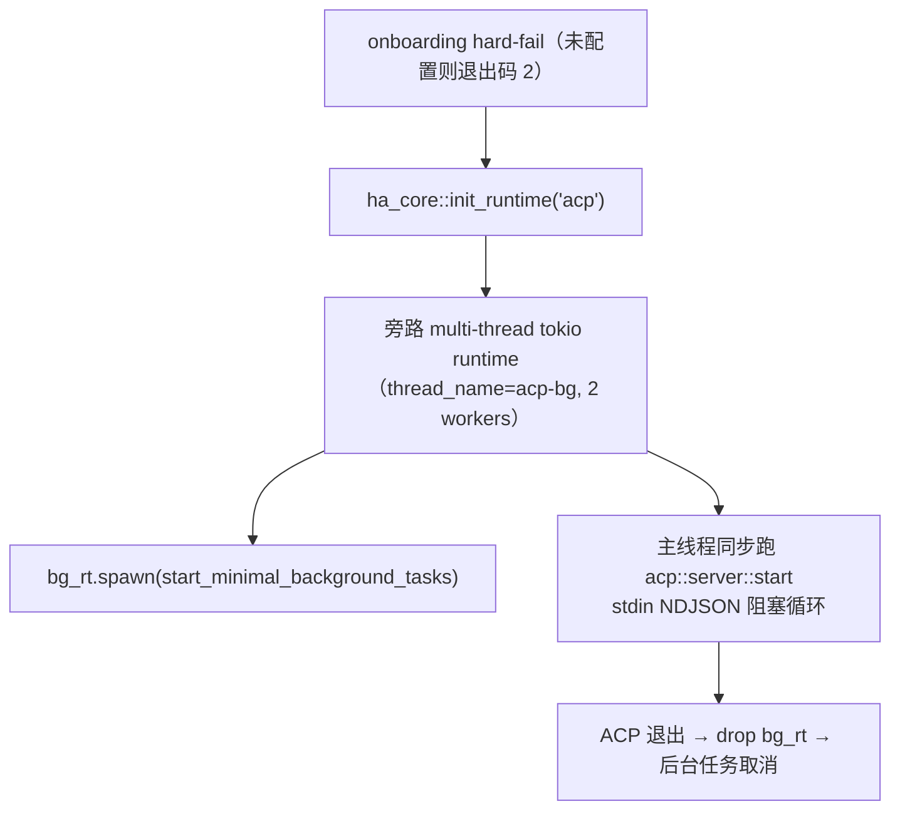

# 进程与并发模型

> 返回 [文档索引](../../README.md) | 更新时间：2026-08-13
> 关联源码：[`src-tauri/src/main.rs`](../../../src-tauri/src/main.rs)、[`app_init.rs`](../../../crates/ha-core/src/app_init.rs)、[`guardian.rs`](../../../crates/ha-core/src/guardian.rs)、[`runtime_lock.rs`](../../../crates/ha-base/src/runtime_lock.rs)、[`blocking.rs`](../../../crates/ha-base/src/blocking.rs)、[`logging/app_logger.rs`](../../../crates/ha-base/src/logging/app_logger.rs)、[`cron/scheduler.rs`](../../../crates/ha-cron/src/cron/scheduler.rs)

## 核心思想

Hope Agent 是**一个二进制、三种运行模式**：桌面 GUI、HTTP/WS 守护进程（`hope-agent server`）、ACP stdio（`hope-agent acp`）。三种模式共享同一个 `ha-core` 业务库、同一个初始化入口 `init_runtime()`——Provider、工具循环、记忆、会话这些**业务机器**在三种模式下是同一份代码。三者的差异只落在两个地方：**要不要启用图形外壳**，以及**要不要拉起长跑后台任务**。

后台工作单元按**隔离成本**从重到轻分成四层。这个分层不是分类学游戏，而是排查线索：几乎每个"为什么重启才生效""哪个任务悄悄挂了、日志看不出来""关了窗口进程不退"的问题，都能先定位到某一层，再往下查。

| 层级 | 载体 | 谁创建 | 典型代表 |
|------|------|--------|----------|
| **A · 二进制运行模式** | 真·独立 OS 进程 | `main()` 按 argv 分派 | `hope-agent` GUI / `hope-agent server` / `hope-agent acp` |
| **B · 独立 OS 线程** | `std::thread::spawn` + 各带独立 tokio Runtime | 需要 `Send` 豁免或绕开 Tauri reactor 时序时 | AppLogger writer、Cron 调度器、Channel 入站 dispatcher |
| **C · 长驻 tokio 任务** | `tokio::spawn` 复用当前模式的主 runtime | `start_background_tasks()` + 各子系统 spawn | Channel worker、ask_user 清理、retention 循环、dreaming 触发 |
| **D · 动态子进程** | `Command::spawn` / `tokio::process` | 工具 / ACP / Docker / 系统服务安装 | `exec` 工具、Codex CLI 运行时、launchd/systemd 单元 |

分层之外还有两条**横切关注点**，它们不属于某一层，而是贯穿全局：

- **Layer C′ · 阻塞工作隔离**——把同步阻塞 IO 下放到 tokio blocking 池，防止它把 async 主 runtime 拖垮。
- **Primary / Secondary 选举**——多进程并存时，用一把 OS advisory lock 决定谁负责写共享状态的清理与"全局只一份"的循环，避免两个进程互相破坏。

**一句话记住**：`init_runtime()` 无差别地打开所有 DB、注入所有 OnceLock 单例（SessionDB / ProjectDB / KnowledgeRegistry / LogDB / AppLogger / MemoryBackend / CronDB / ChannelRegistry / ChannelDB / TerminalManager / EventBus 等）；模式之间的真正分叉在**后台任务那一层**——桌面与 server 跑完整的 `start_background_tasks()`，ACP 跑精简的 `start_minimal_background_tasks()`。

---

## Layer A · 二进制运行模式

`hope-agent` 是单一可执行文件，入口在 [`src-tauri/src/main.rs`](../../../src-tauri/src/main.rs)。`main()` 先调 `ha_server::wire_features()` 装配所有特征 crate（必须早于任何 `init_runtime`，否则工具注册表冻结后再挂工具会 panic），随后按 argv 逐条分派：

| argv 模式 | 处理入口 | 含义 |
|-----------|----------|------|
| `--version` / `-V` | `main()` 内联 | 打印版本即退，早于一切子命令与 GUI 分派（自升级的裸二进制冷烟测试靠它，落到 GUI 会超时误判） |
| `--tcc-probe <id>` | `main()` 内联 | macOS TCC 探针短命进程：打印一行握手 token 后退出，**不初始化任何运行时**。由系统权限子系统 spawn（新进程才看得到运行期新授的录屏权限），详见 [系统权限](../infra/macos-permissions.md)。**分派须早于 Guardian / `--child-mode`**——落到 Guardian 会每次探针拉起一整个 GUI |
| `knowledge-mcp [...]` | `run_knowledge_mcp` | 把知识空间 Agent Access API 暴露成 stdio MCP server |
| `mcp [...]` | `run_mcp` | 把平台子系统（当前为设计空间）暴露成 stdio MCP server；默认只读，`--allow-writes` 才注册写工具 |
| `pet <capabilities\|activate\|list\|preview\|import> [...]` | `run_pet_cli` | 宠物库一次性 CLI：短期 async runtime 复用 ha-pet preview / commit，activate 转发当前 desktop Pet API；不进 `init_runtime`、不开 sessions.db 或后台任务 |
| `acp [...]` | `run_acp_server` | stdio ACP 子进程（被 IDE / Claude Code 等拉起） |
| `server [...]` | `run_server` | 前台 HTTP/WS 守护进程；`install` / `uninstall` / `status` / `stop` / `setup` / `token` 走同入口分派子命令 |
| `auth [...]` | `cli_auth::run` | 终端里的授权流程（如 `auth codex`） |
| `--child-mode` 或 `HOPE_AGENT_CHILD=1` | `run_child` | Guardian 派生的子进程，真正加载 Tauri GUI |
| 其它（含无参） | `run_guardian` / `run_child` | Release 默认走 Guardian 父子；Dev 构建或 `config.guardian.enabled=false` 直接 `run_child` |

### Guardian 父子模式（Release GUI）

Release 桌面默认启用 [`guardian::run_guardian`](../../../crates/ha-core/src/guardian.rs)：父进程不跑 Tauri、只做监工，child 以 `--child-mode` 加载 GUI。父进程 `wait()` 子进程退出码，按码决定重启策略；child 自身还有一层 `catch_unwind` + `MAX_CHILD_PANICS = 3`（1s 间隔重启，定义在 [`main.rs`](../../../src-tauri/src/main.rs)）兜底非致命 panic，多数情况不必惊动父 Guardian。

Guardian 的重启决策（`GuardianConfig` 默认值：`diagnosis_threshold = 5`、`max_crashes = 8`）：

两条并发视角必须知道的协议：

- **`exit(42)` = 立即重启**：child 主动 `std::process::exit(EXIT_CODE_RESTART)` 请求无冷却重启（crash_count 归零、不累加），用于 auto-fix、配置热切换等场景
- **恢复标记传递**：崩溃恢复重启前，父 `Command` 注入 `HOPE_AGENT_RECOVERED=1` + `HOPE_AGENT_CRASH_COUNT=N`，child 可据此做"上次是崩溃恢复"的 UI 提示

> 完整参数表、退出码协议细节、Self-Diagnosis prompt 与 Auto-Fix 覆盖范围、Crash Journal schema 见 [reliability.md](../infra/reliability.md)。

**不适用范围**：`hope-agent server` 由 launchd / systemd 托管重启，`hope-agent acp` 由 IDE 控制生命周期，两者都绕开 Guardian；`config.guardian.enabled = false` 或 Debug 构建也跳过父子分离。

### 多进程数据共享

三种模式可能同时运行（例如桌面开着、IDE 又拉起一个 ACP），共用 `~/.hope-agent/` 下的文件：

- **`config.json`**：进程**内**用 [`cached_config()`](../../../crates/ha-core/src/config/) 的 ArcSwap 快照读 + [`mutate_config()`](../../../crates/ha-core/src/config/persistence.rs) 写锁串行；跨进程**无锁**——A 进程改了，B 进程要等文件级事件或重启才感知
- **SQLite**（`session.db` / `logs.db` / `memory.db` / `cron.db` / `channels.db` 等）：全部 `PRAGMA journal_mode=WAL`，多进程并发读、单 writer 串行
- **EventBus**：进程**内**广播总线；跨进程通信必须走 HTTP/WS 或 stdio
- **OAuth 凭据**（`credentials/auth.json`）：读时按需 refresh，写时 best-effort；多进程同时 refresh 可能互相覆盖，靠 token 长有效期容忍这种竞态

**跨进程互斥的空白**：GUI 和 server 两种模式**不要**同时起同一套 Channel worker——IM 长轮询两边都跑会对上游 double-poll。当前靠部署习惯规避（server 模式独立起 worker，GUI 内嵌 server 共进程），Cron 同理；无代码级跨进程互斥锁，真正的兜底是下文的 Primary/Secondary 选举。

---

## Layer B · 独立 OS 线程（各带独立 tokio Runtime）

固定模式：`std::thread::spawn(|| Runtime::new().block_on(...))`。走这条重路径只有两个动机：

1. **Tauri `.manage()` 时机**：桌面 GUI 启动时，`init_runtime()` 要在 Tauri reactor 就绪**之前**就建好 `AppLogger` 等全局单例，此时 `tokio::spawn` 会 panic "no reactor"——必须自带 runtime 的线程
2. **`Send` 豁免**：有些内层持有非 `Send` 借用（典型是跨 `.await` 的 `MutexGuard`），用独立 current-thread runtime 把整段 future 包住，父 async 上下文只 `join()` 线程句柄

### 长驻型

| 线程 | 位置 | 职责 |
|------|------|------|
| **AppLogger writer** | [`logging/app_logger.rs`](../../../crates/ha-base/src/logging/app_logger.rs) | `std::thread::spawn` 起独立 `Runtime`，mpsc channel（容量 10000）收 `PendingLog` → 批量写 SQLite + 纯文本文件；cleanup_loop 作为同 runtime 内 `tokio::spawn` 任务附着 |
| **Cron 调度器** | [`cron/scheduler.rs`](../../../crates/ha-cron/src/cron/scheduler.rs) | 独立线程 `cron-scheduler` + `new_multi_thread` runtime（2 worker threads）跑 tick 循环；由 `cron_hooks` 转发启动 |
| **Channel 入站 dispatcher** | `channel_hooks::spawn_dispatcher`（实现随 [`ha-channel`](../../../crates/ha-channel/) 上浮） | `init_runtime` 内 spawn，自带独立 OS 线程 + 独立 runtime，从而不依赖调用方是否处于 async 上下文（server / acp 从同步栈调 `init_runtime` 也安全） |
| **Guardian Windows 信号监听** | [`guardian.rs`](../../../crates/ha-core/src/guardian.rs) | Windows 无 POSIX 信号，用一条迷你线程跑 current-thread runtime 接 `ctrl_c` / `ctrl_break`（仅 `#[cfg(windows)]`） |

### 每次调用 spawn 一次（任务完成线程即回收）

在业务路径里按需创建，线程寿命 = 目标任务寿命，不是后台守护，只是 runtime 豁免门票：

| 入口 | 位置 | 触发时机 |
|------|------|----------|
| Subagent spawn | [`subagent/spawn.rs`](../../../crates/ha-core/src/subagent/spawn.rs) | 模型调 `subagent(action="spawn_and_wait" / "spawn")`，子会话独立跑 |
| Subagent injection | [`subagent/injection.rs`](../../../crates/ha-core/src/subagent/injection.rs) | 子会话结果注入回父会话 |
| Async Jobs spawn | [`async_jobs/spawn.rs`](../../../crates/ha-core/src/async_jobs/spawn.rs) | `exec` / `web_search` / `image_generate` 异步化执行 |
| Async Jobs injection | [`async_jobs/injection.rs`](../../../crates/ha-core/src/async_jobs/injection.rs) | 异步 job 完成后结果注入主对话 |
| Agent context 构造 | [`agent/context.rs`](../../../crates/ha-core/src/agent/context.rs) | 特定跨 `.await` 借用路径用独立线程规避 `Send` 问题 |

> **识别技巧**：`grep new_current_thread` 就能定位所有走这条路径的地方，集中在 subagent / async_jobs / agent context / wakeup / workflow / 进程通知等少数几个模块。

---

## Layer C · 长驻 tokio 任务（复用主 runtime）

相对 Layer B，这里直接 `tokio::spawn` 挂到**当前模式的主 runtime**，不再开新线程。绝大多数周期性维护、监听、后台循环都在这一层。

### 启动入口与两档后台任务

后台任务集有两个入口，都要求身处 tokio async 上下文：

- **`start_background_tasks()`**（完整版）——桌面 GUI 与 `hope-agent server` 都跑。桌面在 Tauri `.setup()` 里 `tauri::async_runtime::spawn` 它；server 在自建的 tokio runtime 里 `tokio::spawn` 它。两者拿到的是同一套后台驱动。
- **`start_minimal_background_tasks()`**（精简版）——只有 `hope-agent acp` 跑。ACP 是 IDE 拉起的单会话短命进程，装 daily 定时器会漏文件句柄，channel auto-start 没有 IM 出口，dreaming / cron 也没意义。它**刻意排除**：daily ask_user 清理、daily async_jobs retention、daily recap retention、dreaming idle 触发、channel auto-start、cron 调度器、ACP backend 自动发现、MCP watchdog。

### 特征 crate 如何挂进后台任务

后台任务的**机器**很多已迁到特征 crate（ha-updater / ha-weather / ha-dash / ha-media / ha-acp / ha-local-llm 等），但**调用时序留在 kernel**。做法：特征 crate 在装配期经 `register_startup_task(stage, task)` 把闭包登进一个队列，`start_background_tasks()` 到对应档位时统一消费：

| 档位 | 谁执行 | 典型登记者 |
|------|--------|------------|
| `StartupStage::EveryProcess` | 每个跑完整后台任务的进程都执行（更细的门由任务闭包自判） | ha-weather 后台刷新（内部再判 `is_desktop`） |
| `StartupStage::PrimaryOnly` | 仅 Primary 进程执行 | ha-updater headless 自动更新、ha-dash recap 保留期清理、ha-media STT 流式会话 GC、ha-acp backend 自动发现、ha-local-llm 默认模型自维护 watchdog |

消费后队列关闭，之后再注册返回 `Err`（fail-loud）——静默丢弃等于该特征的后台行为在运行期直接消失。

### 清单（代表性，非穷举）

| 任务 | 周期 | 位置 |
|------|------|------|
| ask_user 启动清理 + 每日定时清理 | 启动一次 + `SECS_PER_DAY` | [`app_init.rs`](../../../crates/ha-core/src/app_init.rs) `start_background_tasks` 内 |
| Channel 自动启动已启用账户 + start watchdog | 启动一次 + 失败后台重试 | [`app_init.rs`](../../../crates/ha-core/src/app_init.rs) → [`channel/start_watchdog.rs`](../../../crates/ha-channel/src/channel/start_watchdog.rs) |
| Async Jobs 残留回放 | 启动一次 | `async_jobs::JobManager::replay_pending` |
| Async Jobs retention 轮询 | 启动一次 + 每日 | [`async_jobs/retention.rs`](../../../crates/ha-core/src/async_jobs/retention.rs) |
| Dreaming 空闲触发 | 每 60s 检查（`MissedTickBehavior::Skip`） | [`app_init.rs`](../../../crates/ha-core/src/app_init.rs) 调 kernel trigger port → [`ha-memory::dreaming_triggers`](../../../crates/ha-memory/src/dreaming_triggers.rs) |
| **Channel worker 主循环**（每账户一条） | 轮询 / 长连接取决于渠道协议 | [`channel/worker/`](../../../crates/ha-channel/src/channel/worker/) |
| Weather 后台刷新（登记为 EveryProcess，内部 desktop-gated） | 启动一次 + 周期 | [`ha_weather::start_background_refresh`](../../../crates/ha-weather/src/lib.rs) |
| **ACP 健康检查**（仅内嵌 ACP runtime） | 周期 ping | [`acp_control/health.rs`](../../../crates/ha-acp/src/acp_control/health.rs) |

模式无关的两类：

| 任务 | 模式 | 位置 |
|------|------|------|
| Server HTTP listener | 桌面内嵌 + `hope-agent server` 独立 | [`ha_server::start_server`](../../../crates/ha-server/src/lib.rs) |
| AppLogger cleanup（挂在 logger 自己的 runtime，不是主 runtime） | 三种模式（`init_runtime` 注入） | [`logging/app_logger.rs`](../../../crates/ha-base/src/logging/app_logger.rs) `cleanup_loop` |

### 设计约定

- **一律用 `tokio::time::interval(...)`** 而非 `loop { sleep }`——可以精确控制首 tick 是否立即 fire、是否 `MissedTickBehavior::Skip` 跳过堆积 tick
- **幂等**：任何任务都可能因 Guardian 重启而重跑；启动一次性的清理（如 ask_user 过期）都要写成"重复跑 no-op"，不假设前一次残留
- **失败不 panic**：tokio 任务 panic 只杀自身不杀 runtime，但依旧要用 `match` + `app_warn!` 记录而非 `unwrap()`——否则日志静默消失
- **共享 AtomicBool 串行化**：Dreaming 等"可能被多路触发"的任务在入口拿全局 `AtomicBool` 做进程内互斥，防 idle-trigger 和手动触发叠跑

### Primary / Secondary 协作（多进程并存）

`init_runtime()` 起手就调 [`runtime_lock::acquire_or_secondary_for(role)`](../../../crates/ha-base/src/runtime_lock.rs)，在 `~/.hope-agent/runtime.lock` 上抢一把 OS 级 advisory exclusive lock（底层原语在 [`platform`](../../../crates/ha-base/src/platform/)）：

- **Unix**：`flock(LOCK_EX | LOCK_NB)`，文件 fd 带 `O_CLOEXEC` 防 Guardian fork 的 child 继承
- **Windows**：`OpenOptions::share_mode(FILE_SHARE_READ)` 写独占（挡其它 writer 的 ERROR_SHARING_VIOLATION，但放行同进程只读诊断 `current_holder()`，故不用 `FILE_SHARE_NONE`）+ `FILE_FLAG_NO_INHERIT_HANDLE`
- **共同**：进程退出 / panic / SIGKILL / 断电时 OS 自动释放，无 heartbeat、无"上一个持有者真死了吗"的时间判断

第一个抢到锁的进程是 **Primary**，其余是 **Secondary**；tier 一进程一决、决了不变（Secondary 不会因为观察到 Primary 死了而被提拔，靠下一个新进程接任）。**模式不参与**选举（first-come-first-served）：单跑 ACP 时 ACP 自然成为 Primary；桌面 + ACP 共存时桌面通常先抢，ACP 退让 Secondary。**唯一例外**：平台 `mcp` role 在 `PASSIVE_SECONDARY_ROLES` 里，**永不争锁、恒 Secondary**——IDE 拉起的 `hope-agent mcp` 可能比桌面活得久，若它抢到 Primary 就会永久占着却从不跑 Primary-only 工作，把桌面卡在 Secondary。

**Primary-only 子系统**——写共享 SQLite 状态或竞争外部资源，多进程并发会互相破坏（代表性）：

| 子系统 | Primary-only 原因 |
|--------|------------------|
| `subagent::cleanup_orphan_runs` | 否则会把另一进程的 live runs 误标失败 |
| `team::cleanup::cleanup_orphan_teams` | 同上的级联 |
| `session::cleanup_orphan_incognito` | **硬 DELETE incognito 会话** + cascade messages |
| `cron::start_scheduler` | 两个 scheduler tick 会双 claim 同一 cron job |
| `async_jobs::JobManager::replay_pending` | 否则把另一进程还在跑的 async 工具标 Interrupted |
| async_jobs / recap retention 循环 | 跨进程并行扫 spool 文件会互相删 |
| Daily ask_user purge 循环 | 撞同一 SQLite |
| Dreaming idle-trigger 循环 | `DREAMING_RUNNING` AtomicBool 仅进程内互斥，跨进程要靠 tier |
| Channel auto-start | 同一 Telegram bot 账户被两个进程抢 webhook |
| MCP watchdog 循环 | 两个 watchdog 重复重连同一 MCP server |
| ACP backend 自动发现 | 抢 `acp_runs` 行 |

**Tier-agnostic（所有 tier 都跑）**：

| 子系统 | 理由 |
|--------|------|
| `init_runtime()`（DB / OnceLock 注入） | 进程内单例，各持各的引用 |
| `build_app_state()` | 仅桌面调用（构造 Tauri `AppState`） |
| Channel 入站 dispatcher（自带独立线程） | EventBus 单订阅者 |
| Channel approval / ask_user listener | EventBus 多订阅者无害，按 `channel_account_id` 路由 |
| async_jobs / subagent queue 调度器 | 队列 process-local（钉住本进程活着的 ctx），各调各的 |
| MCP `init_global`（仅 catalog 注册） | 幂等；catalog snippet 所有模式都要看到 |
| 手动 API（`run-now` / `dreaming::manual_run` / `start_account` 按钮） | 走原子 SQL claim 等 race-safe 入口 |

**incognito 双重防御**：除 `runtime_lock::is_primary()` 这道 gate 外，`purge_orphan_incognito_sessions` 的 SQL 还过滤 `WHERE incognito = 1 AND updated_at < now-60s`——即便锁逻辑回归，刚刚创建或写入的活会话（60 秒内）也不会被删。

**合法 cleanup 场景仍正常工作**：Guardian 重启 child / launchd 重启 daemon / 断电后下次启动 / `kill -9` 后下次启动——这些场景下"上一进程"的 fd 已被 OS 关闭，锁自动释放，下次启动的进程抢到锁成为新 Primary，跑 cleanup 清前一次残骸。

### 跨模式能力对照

| 子系统 / 调用 | 桌面 GUI | `hope-agent server` | `hope-agent acp` |
|---------------|:-------:|:-------------------:|:----------------:|
| `init_runtime(role)`（DB + OnceLock + lock 选举） | ✓ | ✓ | ✓ |
| `build_app_state()`（构造 Tauri `AppState`） | ✓ | ✗ | ✗ |
| `start_background_tasks()` | ✓ | ✓ | ✗ |
| `start_minimal_background_tasks()` | ✗ | ✗ | ✓ |
| Channel 入站 dispatcher | ✓ | ✓ | ✓ |
| Channel approval / ask_user listener | ✓ | ✓ | ✓ |
| MCP `init_global`（catalog） | ✓ | ✓ | ✓ |
| **Primary-only 长跑循环**（cron / channel auto-start / dreaming idle / retention / MCP watchdog / ACP discover） | 抢到 lock 时 ✓ | 抢到 lock 时 ✓ | ✗（minimal 档不 spawn，即便 Primary 也不跑） |
| **Primary-only 一次性清理**（async_jobs replay / incognito purge / 三件套 cleanup） | 抢到 lock 时 ✓ | 抢到 lock 时 ✓ | 抢到 lock 时 ✓ |
| EventBus → Tauri 前端桥 | ✓ | ✗ | ✗ |
| 内嵌 HTTP server（`ha_server::start_server`） | ✓ | ✓（独立运行而非内嵌） | ✗ |
| ACP stdio 主循环 | ✗ | ✗ | ✓ |

ACP minimal 的"少做"落在长跑循环上：cron / dreaming idle / channel auto-start / retention / MCP watchdog / ACP discover 一概不 spawn，抢到 lock 也不例外。它抢到 lock 后仍会跑的，只有一次性清理——async_jobs replay、incognito purge、`init_runtime` 里的三件套孤儿清理。

---

## Layer C′ · 阻塞工作隔离（`spawn_blocking` 池）

四层之外的一条横切约定，专治"同步阻塞把 async runtime 拖垮"。

**问题的抽象形态**：全 app 每个 SQLite 库（`sessions` / `cron` / `channel` / `logs`）都是同步 rusqlite 藏在 `Mutex<Connection>` 后面；config 持久化在全局写锁内做同步文件 IO（写前校验读 + autosave 拷贝 + sibling temp fsync + 原子替换及 durability barrier）。若直接从 `async fn` 里 inline 调用，就会把一个 tokio worker 钉住整个"锁等待 + IO"时长。而桌面默认 runtime 的 worker 只有 `num_cpus` 个（Windows 笔记本常 2–4）；一旦底层文件 IO 卡住（杀软实时扫描、云同步的 home 目录、慢盘），worker 被逐个吃光直到整个 runtime 饿死——表现为"进程还活着，但发消息永久转圈、设置页全部加载中"。

**单一入口**：[`run_blocking(f)`](../../../crates/ha-base/src/blocking.rs)（定义在 ha-base，经 `ha_core` 再导出）——把同步闭包丢到 tokio 的 blocking 池（数百条可挥霍的线程）并 `await`，卡住的库 / config 写只降级该功能，不再冻结全 app。慢于 5s 的 op 会 `app_warn!("blocking", ...)` 带闭包定义点落进 `logs.db`，把下次现场的卡死 IO 从 heisenbug 变成可 grep 的证据。

**两个便捷包装**（调用方优先用它们）：

| 包装 | 位置 | 用途 |
|------|------|------|
| `SessionDB::run(\|db\| ...)` | [`session/db.rs`](../../../crates/ha-core/src/session/db.rs) | `Arc<SessionDB>` 上所有同步方法（读 + 写）在 async 上下文里的唯一调用姿势 |
| `config::mutate_config_async(reason, f)` | [`config/persistence.rs`](../../../crates/ha-core/src/config/persistence.rs) | `mutate_config` 的 spawn_blocking 版；async 上下文改配置走它 |

**红线（新增 async 路径必守）**：`src-tauri` 命令与 `ha-server` handler 里，任何 SessionDB / CronDB / ChannelDB / ProjectDB / LogDB 的同步调用、以及 `mutate_config` / provider crud 等走同步文件 IO 的 helper，**一律经 `run_blocking` / `SessionDB::run` / `mutate_config_async` 下放到 blocking 池，禁止 inline 在 async fn 里直接调**。例外：`cached_config()` / `load_config()` 是 lock-free 快照读，无需下放；已在独立 OS 线程 / 自建 runtime（Layer B）里跑的同步代码不重复包裹。相邻的多个同步调用应合并进**一个** `run_blocking` 闭包（保持原有顺序与错误语义），避免每调一次跳一次线程。

**附带加固**：config 的 load-failure 恢复读盘（`recover_from_load_failure`）带 2s 冷却——`config.json` 短暂不可读时，设置页一次打开会在短时间内触发一批 `load_config()` 读盘，冷却把这波"文件闹脾气时的读 IO 风暴"压成每 2s 至多一次；用户可见的 Retry 路径（`config_health`）不受节流。

---

## Layer D · 动态子进程（`Command::spawn`）

按需拉起的外部二进制，分三类。

### D1 · 长驻式子进程（生命周期跟上层状态绑定）

| 场景 | 位置 | 生命周期 |
|------|------|----------|
| **ACP 运行时**（Codex CLI / Claude Code 等） | [`acp_control/runtime_stdio.rs`](../../../crates/ha-acp/src/acp_control/runtime_stdio.rs) | 会话存活期间，配 [`acp_control/health.rs`](../../../crates/ha-acp/src/acp_control/health.rs) 健康检查 |
| **IM Channel 子进程**（部分协议实现） | [`channel/process_manager.rs`](../../../crates/ha-channel/src/channel/process_manager.rs) | 账户启用期间 |
| **Docker 容器**（SearXNG / 部署目标） | [`docker/lifecycle.rs`](../../../crates/ha-vcs/src/docker/lifecycle.rs)、[`docker/deploy.rs`](../../../crates/ha-vcs/src/docker/deploy.rs) | 容器自身生命周期；Hope Agent 退出不一定 kill |

### D2 · 单次调用型（短命，完成即回收）

| 场景 | 位置 |
|------|------|
| `exec` 工具（用户命令执行 + PTY） | [`tools/exec.rs`](../../../crates/ha-core/src/tools/exec.rs) |
| Sandbox 隔离执行 | [`sandbox.rs`](../../../crates/ha-vcs/src/sandbox.rs) |
| Plan Mode git 调用 | [`plan/git.rs`](../../../crates/ha-core/src/plan/git.rs) |
| Skill 依赖安装（brew / npm / go / uv） | [`skills/commands.rs`](../../../crates/ha-skills/src/skills/commands.rs) |
| Provider / Docker 代理探测 | [`provider/proxy.rs`](../../../crates/ha-core/src/provider/proxy.rs)、[`docker/proxy.rs`](../../../crates/ha-vcs/src/docker/proxy.rs) |
| 跨平台原语（打开终端 / 检测环境） | [`platform/`](../../../crates/ha-base/src/platform/) |
| Agent loader 初始化（git clone 默认模板） | [`agent_loader.rs`](../../../crates/ha-core/src/agent_loader.rs) |
| 托盘（macOS 打开 URL / 通知） | [`src-tauri/src/tray.rs`](../../../src-tauri/src/tray.rs) |

`exec` 转为后台进程会话时把创建它的聊天会话写入 `ProcessSession.parent_session_id`。模型 schema 只暴露 `process(list/poll/log/kill/clear/remove)`，并全部执行精确的 `parent_session_id == ToolExecContext.session_id` 校验：列表只枚举当前会话，带 id 的读取和控制对不存在、跨会话及 ownerless 行统一 fail closed，错误不得泄露真实 owner 或进程状态。尚未真正实现 stdin 的历史 `write` handler 只保留协议兼容，同样执行 owner 校验，但不向模型暴露。`runtime_cancel(kind=process)` 复用同一归属边界，校验后仍路由到 canonical process termination；它只有终止，没有 pause/resume。Owner/Stop 等受信任清理链继续使用其已捕获的精确运行身份，不通过模型提供的裸 id 扩权。

`process(kill)` 与 `runtime_cancel(kind=process)` 的 `terminate_process_tree(pid)` 是 void best-effort 请求，不是退出证明：非终态会话没有 pid（包括部分 sandbox background 运行）时必须返回 `termination_unavailable` / 明确失败；有 pid 时只发送信号并重读 registry，调用方不得自行 `mark_exited` 或伪造 `Failed`。普通 exec waiter、PTY wait 或 sandbox 完成任务观察到真实退出后才写 terminal truth；在此之前返回 requested/pending 且不带 `finalStatus`，也不得提前 `mark_observed` 抑制稍后的真实完成投递，模型可用 `process(poll)` 主动确认。

### D3 · 一次性系统注册（不拉起进程，只落配置）

`hope-agent server install` 把 [`platform/service.rs`](../../../crates/ha-base/src/platform/service.rs) 生成的 plist / unit 写入系统（`service_install` 是转发到 `platform::service` 的薄壳），由 launchd / systemd 真正去执行 `hope-agent server`：

- macOS：`~/Library/LaunchAgents/ai.hopeagent.server.plist`（label = `SERVICE_LABEL` 常量 `ai.hopeagent.server`）
- Linux：`~/.config/systemd/user/hope-agent.service`
- Windows：暂不支持 `server install`，走 Task Scheduler 手动方案，见 [`windows-development.md`](../../platform/windows-development.md)

文件格式与参数细节见 [backend-separation.md](backend-separation.md)。安装后 `hope-agent server` 作为 Layer A 的独立进程被 launchd / systemd 守护，和 Guardian 无关——**不要给 server 再套 Guardian**，两层重启语义会打架。

---

## 生命周期与清理

### 启动顺序

桌面 GUI（child 模式）：

`hope-agent server`：

`hope-agent acp`：

ACP 主线程同步读取 stdio；每个 `session/prompt` 通过进程级 multi-thread runtime 的 `Handle::block_on` 进入 `TurnKernel`。这条 runtime 与 `start_minimal_background_tasks()` 同寿命，直到 ACP server 退出才销毁，因此 turn 结束时派生的 Memory Extract、idle extraction、标题等后处理不会随函数级 runtime 一起被取消。

### 退出路径

| 退出源 | 行为 |
|--------|------|
| Guardian 收到 SIGTERM / SIGINT / CTRL_BREAK | 不再重启 child，父子一起退 |
| Child 正常 `exit(0)` | Guardian 认为是用户主动退出，父进程也退 |
| Child `exit(42)` | Guardian 视为"请求立即重启"（如自诊断 auto-fix 后），crash_count 归零不累加 |
| Child 非 0 非 42 退出 | 崩溃计数 +1，指数退避后重启；到 `diagnosis_threshold`（5）跑备份 + 自诊断，到 `max_crashes`（8）放弃 |
| tokio 任务 panic | 只杀任务自身，不杀进程；靠 `app_warn!` 记录 |
| 独立线程 panic | 只杀该线程；AppLogger writer 若 panic，消息积压到 mpsc 满后靠 `eprintln!` 兜底 |

### 已知空白

- **Layer B 长驻线程无统一 join**：AppLogger / Cron / Channel dispatcher 在进程退出时被 OS 回收，没有显式 `shutdown()`。正常退出靠 mpsc channel 关闭 → loop 自然退出；`std::process::exit()` 强退不走这条路
- **ACP / Docker / Channel 子进程无统一终止钩子**：各自实现 `Drop` / `shutdown()`，退出时是否 kill 子进程取决于模块；Guardian 强杀 child 可能留 orphan 子进程——已知代价
- **Cron / Channel 跨进程重复触发**：靠 Primary/Secondary 选举与部署习惯规避，无代码级跨进程互斥锁（见上文多进程数据共享）
- **ACP `acp::server::start` 仍是同步签名**：外层 main 持有进程级 runtime 并把 `Handle` 注入 Agent，主线程同步 stdin；完全 async 化是后续工作

---

## 排查指引

| 症状 | 先看 |
|------|------|
| UI 保存配置没生效 | `cached_config()` vs `mutate_config()`——见 [config-system.md](../infra/config-system.md) |
| Cron / Channel 任务停了 | 桌面 / server 模式都应该跑（共享 `start_background_tasks`）；ACP 模式的 cron / channel auto-start 按设计跳过。若不是 Primary（另一进程占着 lock）Primary-only 循环也不跑——看 `runtime` / `tier` 日志。Guardian 反复重启看 `~/.hope-agent/crash_journal.json` |
| 日志 DB 不缩 / 膨胀 | AppLogger cleanup_loop 是否存活（grep `logging` / `cleanup` 日志）；`max_size_mb` 是否设了 0。三种模式都通过 `init_runtime` 初始化 AppLogger |
| 进程还活着但全 app 转圈 | 大概率 Layer C′ 问题：某个同步 IO inline 在 async fn 里钉住 worker——grep `app_warn!("blocking", ...)` 找慢 op |
| server install 后 "No such service" | 检查 `~/Library/LaunchAgents/ai.hopeagent.server.plist`（macOS）或 `~/.config/systemd/user/hope-agent.service`（Linux）；`hope-agent server status` 能否拿到真实 PID |
| ACP 连接后无响应 | `acp_control/health.rs` ping 是否超时；Codex CLI 子进程是否僵死 |
| 关 GUI 窗口进程不退 | 正常——桌面 GUI 默认"关闭 = 隐藏到托盘"，走 `Quit` 菜单项才真正退出 |

## 关联文档

- [可靠性与崩溃自愈](../infra/reliability.md)——Guardian 三层保活全景、Crash Journal、Self-Diagnosis、Auto-Fix、子系统 watchdog
- [前后端分离架构](backend-separation.md)——分层 crate 职责切分（ha-base / ha-config-schema / ha-core / 薄壳）、系统服务安装细节
- [Cron 调度](../infra/cron.md)——Layer B 独立线程 + 2 worker threads runtime
- [IM 渠道系统](../integration/im-channel.md)——Layer C worker + Layer B dispatcher + Layer D 子进程混合
- [ACP 协议](../integration/acp.md)——Layer A `acp` 模式 + Layer D ACP runtime 上下游
- [配置系统](../infra/config-system.md)——多进程共享的 `config.json` 读写 contract
- [日志系统](../infra/logging.md)——AppLogger 独立线程 + cleanup_loop 细节
