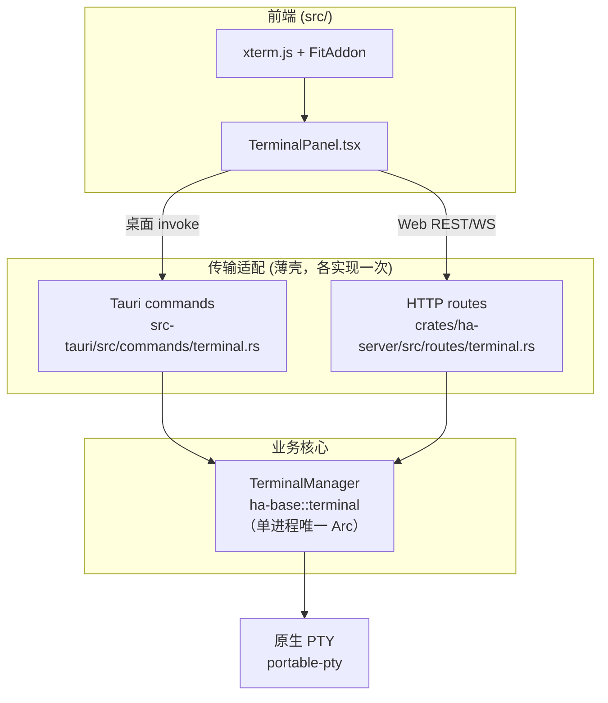
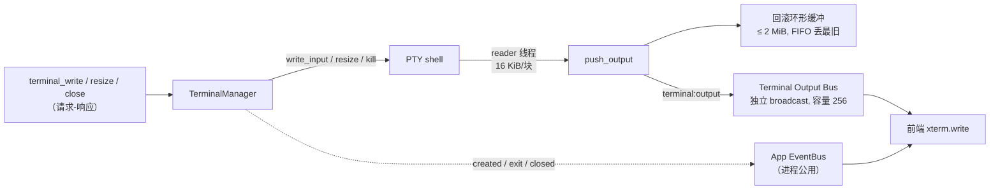
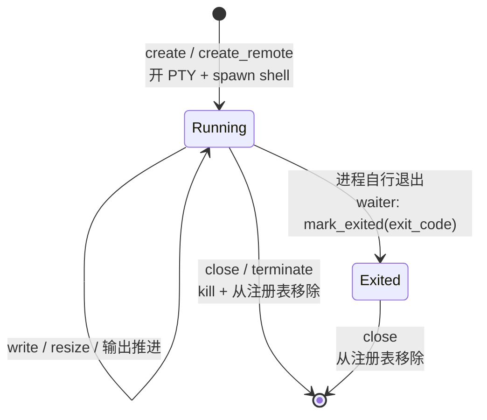
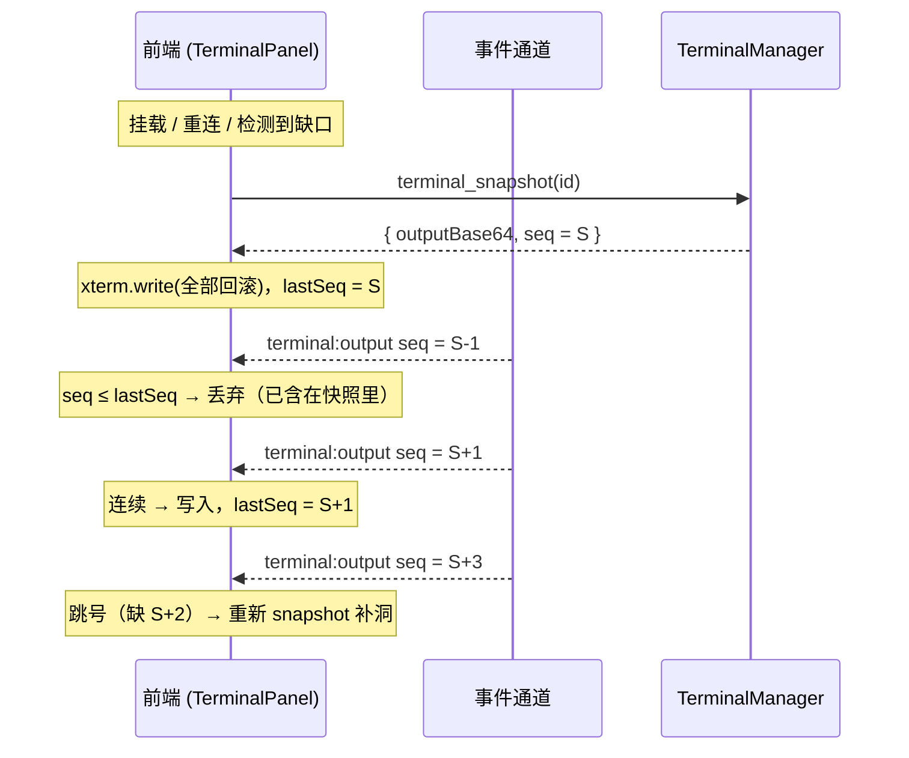
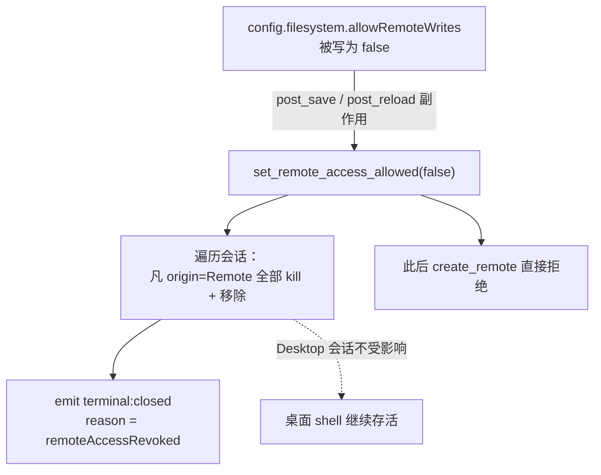

# 内嵌终端

底部那个可以拉起来的终端，是一个**进程级、内存态、交互式的 PTY 控制面**：一个真正的本机 shell，跑在 App 所在进程里，通过 xterm.js 呈现在界面上。它同时服务两种前端——桌面 GUI 与 HTTP/Web GUI——但底层只有**一套**终端注册表。

**关联源码**

- `crates/ha-base/src/terminal.rs` —— 传输无关的 PTY 会话管理器（`TerminalManager`），全部业务逻辑所在
- `src-tauri/src/commands/terminal.rs` —— 桌面 Tauri 适配（薄壳）
- `crates/ha-server/src/routes/terminal.rs` —— HTTP 适配（薄壳）
- `crates/ha-server/src/ws/events.rs` —— WebSocket 事件桥与远程访问门
- `src/components/chat/terminal/TerminalPanel.tsx` —— 前端 xterm.js 面板
- `src/lib/transport-http.ts` —— HTTP 端点映射

## 核心思想

一个内嵌终端要解决的问题是：让用户在不离开 App 的情况下，得到一个**功能完整、有滚屏、能改尺寸、支持 ANSI 颜色**的交互式 shell，而且桌面与浏览器两种入口体验一致。

关键设计有三条：

1. **业务下沉到一个传输无关的管理器。** 真正干活的是 `ha-base` 里的 `TerminalManager`——它开 PTY、起 shell、读写字节、维护回滚缓冲、发事件。Tauri 命令和 axum 路由都只是薄薄的适配层，把请求转给同一个管理器。这样"再开一个终端""改尺寸""关闭"这类语义只需实现一次。

2. **单进程唯一注册表。** 整个进程里只有一个 `TerminalManager` 实例，包在 `Arc` 里。桌面的 `AppState` 与内嵌/独立 server 的 `AppContext` 持有的是**同一个** `Arc`——不会出现"两套终端各记各的"。

3. **会话纯内存、进程随生随灭。** 终端会话不落盘、不进任何数据库。隐藏面板不杀 shell；关标签或进程自己退出才杀 shell。这既让终端保持"轻"，也让它天然随 App 生命周期收敛。

因为它是**真交互式本机 shell**，等价于把一个本机 shell 直接交到对面手里（可执行任意代码），所以远程（HTTP）一侧的准入被卡得很死——见[远程访问门](#远程访问门)。

## 分层与归属

`TerminalManager` 由 `init_runtime()` 在启动时创建，存进全局 `TERMINAL_MANAGER` OnceLock；装配 `AppState` / `AppContext` 时把同一个 `Arc` 克隆进去（启动期有断言校验二者指针相等）。因此不论请求从 Tauri 还是 HTTP 进来，操作的都是同一份会话表。

> `TerminalManager` 的物理归属在 `ha-base`；`ha-core` 通过 `pub use ha_base::*` 再导出，所以代码里常见的 `ha_core::terminal::TerminalManager` 只是同一类型的再导出路径。所有非壳 crate 都"零 Tauri 依赖"，终端也不例外。

## 数据流：两条通道、两个事件总线

终端有两类流量，走两条独立路径：

- **控制/输入**（`write` / `resize` / `close`）是**请求-响应**式的，前端调用后同步拿到结果。
- **输出**是**广播**式的：PTY 吐字节 → 后台 reader 线程读走 → 推进回滚缓冲 → 以 `terminal:output` 事件广播给所有挂载了该终端的前端。

这里有一个刻意的隔离：**高频的 `terminal:output` 走一条独立的 broadcast 通道，不占用进程公用的 App EventBus**。一个刷屏的 PTY（比如 `yes`）不应该把聊天流、审批、会话事件挤出总线。生命周期事件（`created` / `exit` / `closed`）因为低频且与其它 UI 事件同域，仍走 App EventBus。

**输出编码为 base64 原始字节传输**。终端输出是任意字节流——UTF-8 多字节字符、ANSI 转义序列都可能跨读取块边界断开，直接当字符串传会损坏；base64 保证前端拿到的是逐字节精确的原始流，由 xterm.js 自己去解析终端语义。

## 会话生命周期

每个会话持有：一个 PTY master、一个 writer、一个 child killer、一段回滚缓冲、一个单调递增的 `seq`、当前状态与退出码、当前尺寸。创建时后台起两个线程——一个**输出 reader**（循环读 PTY，每读到就 `push_output`），一个**child waiter**（阻塞 `wait()`，进程退出时标记 `Exited`）。

注意 **`Exited` 并不等于消失**：进程退出后会话仍留在注册表里（状态为 `exited`、带退出码），`terminal_list` 依旧能列出它；只有显式 `close` 才把它从表里删掉。对已退出的会话再 `write_input` 会报错。

回滚缓冲是个字节 `VecDeque`：`push_output` 追加新字节，一旦超过 2 MiB 就从头 `drain` 掉溢出部分——只保留最近的 2 MiB 原始 PTY 字节。这既是 UI 重连时能"重放看到的内容"的来源，也给内存占用设了硬上限。

## 输出重放与去重

UI 重新挂载、WebSocket 重连、或事件序列出现缺口时，前端不能靠"从头累积增量"来重建画面——它需要一个**权威快照**，再在其上续接增量。`seq` 就是把两者对齐的游标。

`terminal_snapshot` 返回：会话元数据 + 当前完整回滚缓冲（base64）+ 当时的 `seq` 值。每条 `terminal:output` 也带自己的 `seq`。前端据此去重与补洞：

去重规则：`seq ≤ lastSeq` 一律丢弃；`seq == lastSeq + 1` 连续则写入；`seq > lastSeq + 1` 说明中间丢了事件，重新拉一次 snapshot。快照返回前到达的 output 会先入队，snapshot 落地后按 seq 排序、只重放大于快照 seq 的部分。

**通道 lag 也必须靠 snapshot 兜底。** WebSocket 侧的广播接收器如果跟不上，会收到 `Lagged(n)`：服务端先发一条 `_lagged` 通知（`stream` 标 `app` 或 `terminal`），连续 lag 达到上限（3 次）就断开连接，逼客户端重连并重新 snapshot；单帧发送超过 5 秒也直接断开。丢事件不会导致画面永久错位，因为下一次 snapshot 会重建全部可见回滚。

## 远程访问门

终端是**面向用户本人的高权限写平面**——它等价于一个交互式本机 shell。因此 HTTP 一侧有一整套 fail-closed 的准入：

- 所有 HTTP 终端端点都在 Bearer 鉴权保护的 `/api` 路由内，且统一要求 `filesystem.allowRemoteWrites=true`（默认关闭）。关闭时任何 `create/list/snapshot/write/resize/close` 都返回 403。
- 禁止把这些端点挪到公开路由或只读 token 路由，也不得绕过远程写入门。桌面一侧（Tauri）不受此门约束——本机即信任。

关键在于 **`allowRemoteWrites` 是一个实时能力，而不仅是创建时的一次性检查**：

每个会话记录自己的来源（`Desktop` / `Remote`）。当配置把 `allowRemoteWrites` 关掉时，配置写路径的副作用会立刻调用 `set_remote_access_allowed(false)`，**当场终止并移除所有 HTTP 创建的 shell**，桌面创建的不动。

这里有两处不显然的正确性保证：

- **撤权与创建同锁竞争。** `create_remote` 的准入检查和撤权时移除会话，持的是**同一把** sessions 锁。所以要么撤权先赢（后续创建被拒），要么创建先赢（撤权随后把这个新会话一并移除）——不会漏掉一个"卡在中间"的远程 shell。
- **撤权期间 WS 静默 `terminal:*`。** WebSocket 事件桥在转发前查 `allowRemoteWrites`：关闭时，无论是走 App 总线的 `created/exit/closed`，还是走独立总线的 `output`，只要是终端事件一律不转发给 HTTP 客户端。

## 工作目录与 shell 解析

- **cwd**：请求给了非空目录就用它，否则退用户主目录，主目录不可用才退进程当前目录；解析后必须 `canonicalize` 成一个**真实存在的目录**，否则创建失败。新终端继承的是"创建那一瞬间"的有效工作目录。
- **shell**：Unix 用 `$SHELL`（缺失回退 `/bin/sh`），Windows 用 `%COMSPEC%`（缺失回退 `cmd.exe`）；标签标题取 shell 路径的文件名。
- **环境变量**：统一注入下表三项，让 shell 与常见工具知道自己在一个支持真彩色的 xterm 里。

| 变量 | 值 |
| --- | --- |
| `TERM` | `xterm-256color` |
| `COLORTERM` | `truecolor` |
| `TERM_PROGRAM` | `HopeAgent` |

## 前端交互

- **面板开合**：标题栏按钮或 `⌘/Ctrl+J` 显示/隐藏。隐藏不杀 shell。
- **多标签**：支持新建/关闭、拖拽调高、最大化；每个标签一个独立会话。
- **与分栏工作台正交**：Terminal 继续位于会话内容区底部，不迁成普通工作台标签；右侧 [Docked Workbench](../agent/docked-workbench.md) 的展开、切页、stage 与 resize 不得卸载 `TerminalPanel` 或重建 PTY。
- **尺寸自适应**：xterm 的 `FitAddon` 把容器像素尺寸换算成行列，`onResize` 把新行列**去抖后**回传 PTY（`terminal_resize`）。
- **输入合并**：逐按键会在 HTTP 模式下变成逐请求，太浪费。前端把击键攒进缓冲，遇回车或缓冲满即刻 flush，否则 16 ms 空闲后 flush；写请求还串成 FIFO promise 链，保证顺序不乱。

## 参考表

### 上限与常量

| 名称 | 值 | 含义 |
| --- | --- | --- |
| `MAX_TERMINAL_SESSIONS` | 12 | 每进程最多并存会话数 |
| `MAX_TERMINAL_INPUT_BYTES` | 64 KiB | 单次 `write_input` 上限，超出报错 |
| `MAX_TERMINAL_SCROLLBACK_BYTES` | 2 MiB | 每会话回滚缓冲上限，FIFO 丢弃最旧字节 |
| `READ_CHUNK_BYTES` | 16 KiB | 输出 reader 单次读取块大小 |
| `TERMINAL_OUTPUT_EVENT_CAPACITY` | 256 | 输出独立 broadcast 通道容量 |
| 默认 `cols × rows` | 100 × 28 | 创建请求缺省尺寸 |
| `cols` / `rows` 钳位 | 2 – 500 | 尺寸上下限（含 resize） |
| WS `MAX_LAG_COUNT` | 3 | 连续 lag 达此值即断开连接 |
| WS `SEND_TIMEOUT` | 5 s | 单帧发送超时即断开 |

### 接口（Tauri ↔ HTTP）

| Tauri 命令 | HTTP 端点 | 说明 |
| --- | --- | --- |
| `terminal_create` | `POST /api/terminals` | 创建 PTY，body `{ request: { cwd?, cols, rows } }` |
| `terminal_list` | `GET /api/terminals` | 列出会话元数据（**不含输出**） |
| `terminal_snapshot` | `GET /api/terminals/{terminalId}` | 单会话快照：元数据 + 回滚 + `seq` |
| `terminal_write` | `POST /api/terminals/{terminalId}/input` | 写 stdin |
| `terminal_resize` | `POST /api/terminals/{terminalId}/resize` | 更新 PTY 行列 |
| `terminal_close` | `DELETE /api/terminals/{terminalId}` | 终止 shell 并移除会话 |

`terminal_list` 刻意只回元数据；原始输出只由单会话 `terminal_snapshot` 返回，避免多标签挂载时重复编码并传输全部回滚缓冲。所有 HTTP 端点均受 Bearer 鉴权 + `allowRemoteWrites` 双重约束。完整对照见 [api-reference.md](api-reference.md) 的 Terminal 小节。

### 事件

| 事件 | 总线 | payload |
| --- | --- | --- |
| `terminal:created` | App EventBus | `{ terminal: <snapshot> }` |
| `terminal:output` | Terminal Output Bus（独立） | `{ terminalId, seq, dataBase64 }` |
| `terminal:exit` | App EventBus | `{ terminalId, exitCode, error }` |
| `terminal:closed` | App EventBus | `{ terminalId }`；撤权时附 `reason: "remoteAccessRevoked"` |

---

新增终端生命周期操作时，须同时更新核心管理器、两套传输适配、`COMMAND_MAP`，并回到本文件与 [api-reference.md](api-reference.md) 补上对照。
