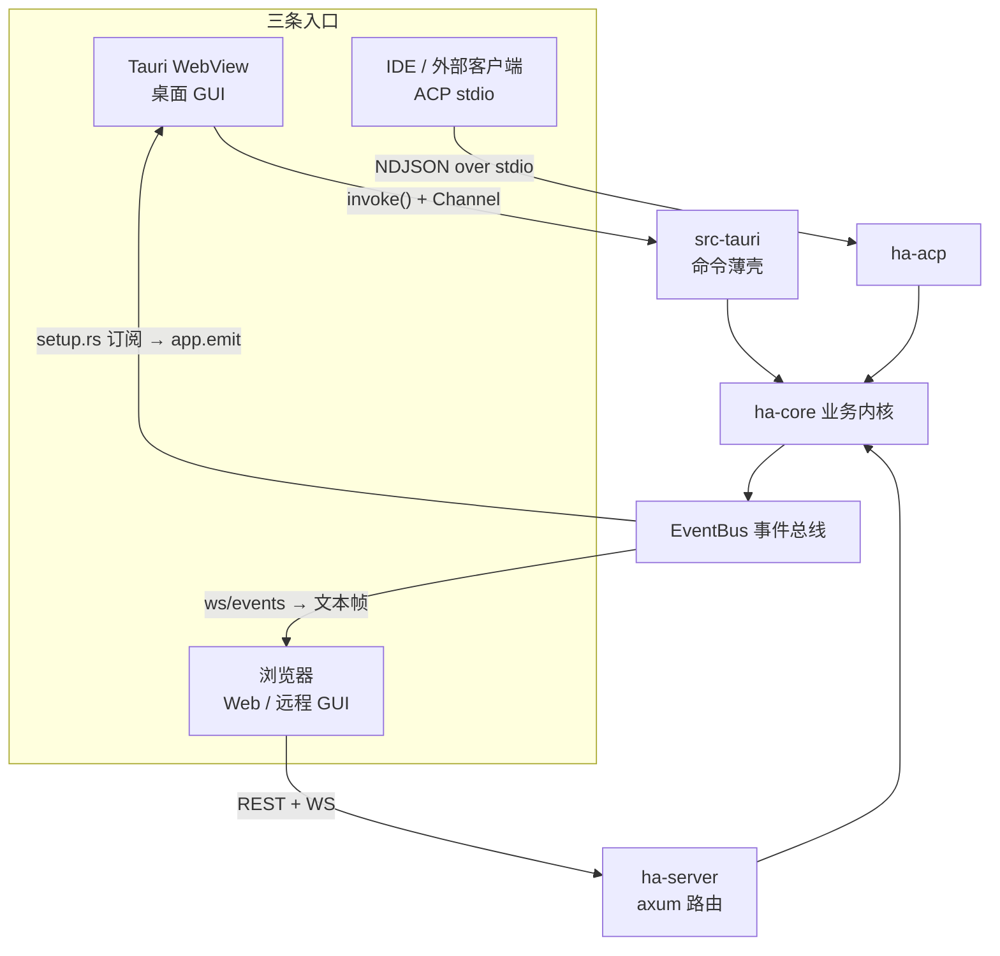
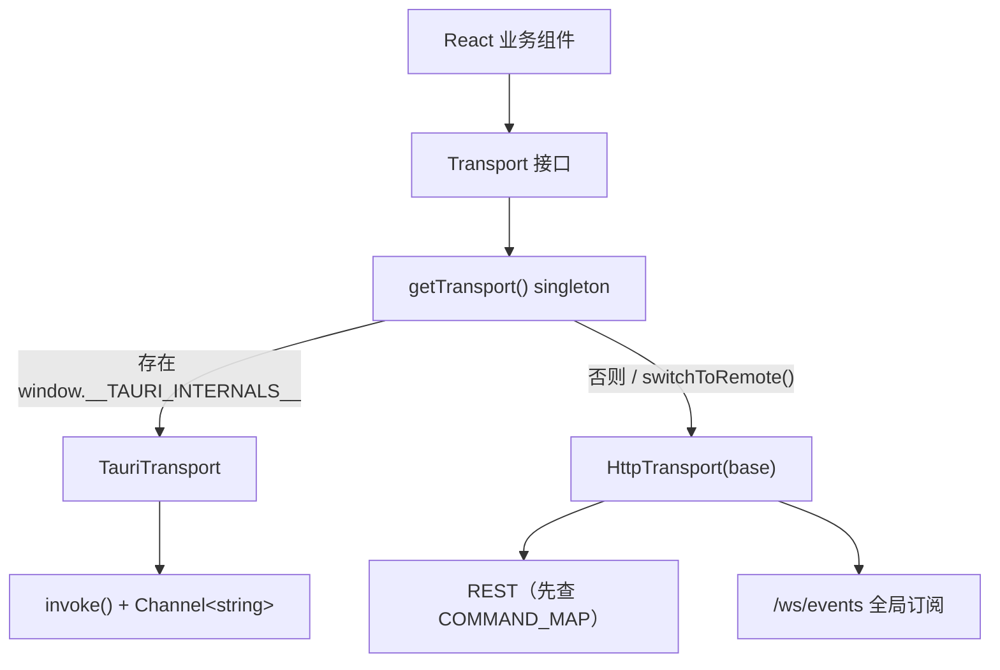
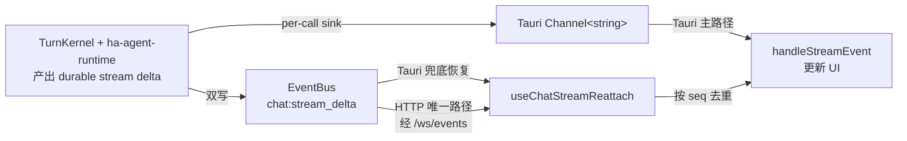
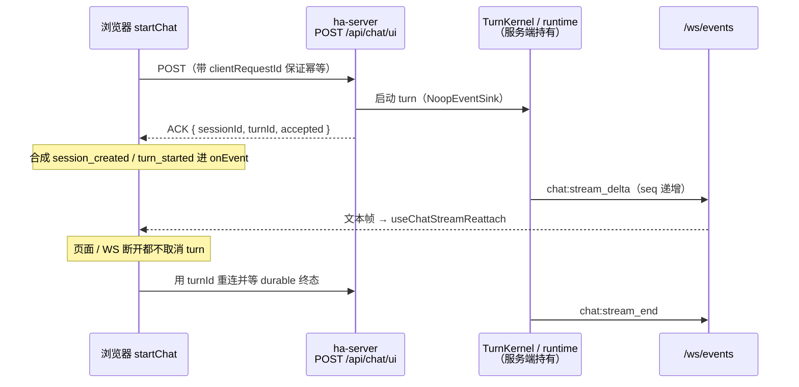
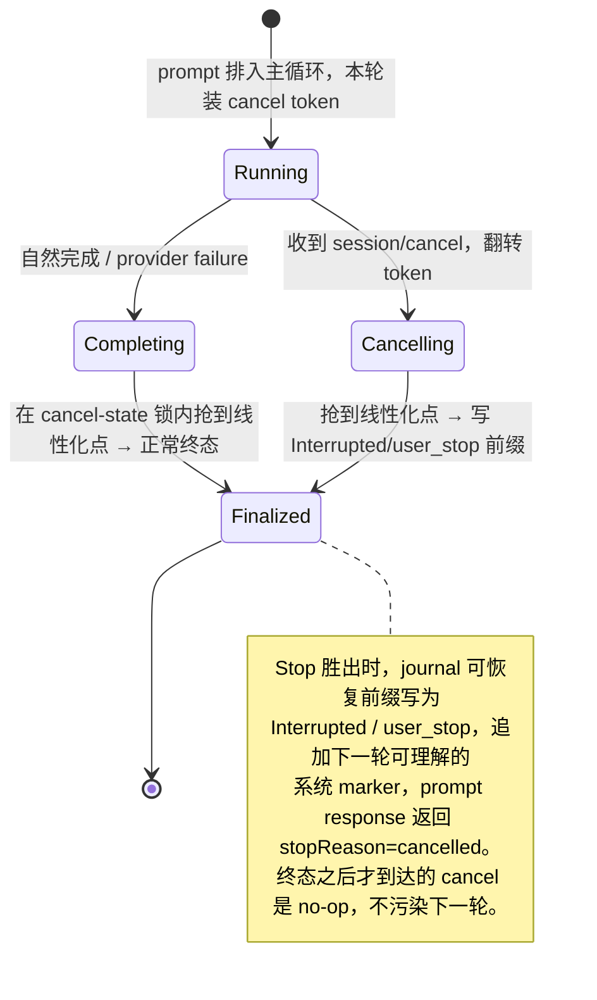

# Transport 运行模式与事件流

> 返回 [文档索引](../../README.md) | 关联文档：[前后端分离架构](backend-separation.md) · [进程模型](process-model.md) · [API 参考](api-reference.md) · [Chat Engine](../core/chat-engine.md)

## 核心思想

Hope Agent 只有一个与界面无关的业务内核（`ha-core`），却要同时服务三种截然不同的入口：装在 Tauri WebView 里的桌面 GUI、跑在浏览器里的 Web GUI、以及 IDE 直连的 ACP stdio。让内核为每种入口各写一套逻辑，代价是三份分叉、三处漂移。Transport 层的设计避开了这一点，它建立在两条约定上：

1. **一个业务核，多条协议入口。** 桌面把内核桥接成 Tauri IPC，Web 把它桥接成 REST + WebSocket，ACP 把它桥接成 NDJSON over stdio。三者调用的是同一批 `ha-core` 能力，入口只是薄薄的协议翻译层，不重复业务逻辑。

2. **前端只认一个 `Transport` 接口。** React 业务组件永远不直接拼 `invoke()`、`fetch()` 或 WebSocket——它们只调用 `Transport` 上的三个原语（请求/响应、跑一次聊天、订阅事件）。运行时按环境选一个实现（`TauriTransport` 或 `HttpTransport`），组件感知不到底下是 IPC 还是 HTTP。

事件同样统一：所有后端主动推送都经过一个 `EventBus`。两座桥——桌面侧 `app.emit`、Web 侧 `/ws/events` 文本帧——把同一批事件送进同一个前端 `transport.listen()` API。于是「后端发生了什么、前端怎么收」这件事在两种模式下写法完全一致，差异被封在桥里。

这样一来，新增一个前端能力时只需回答一个问题：**它在 Tauri 与 HTTP 两侧分别怎么实现？** 只适合其中一侧的能力（比如「在文件管理器里定位文件」），靠 `Transport` 的能力查询（`supportsLocalFileOps()` 等）在 UI 上优雅降级，而不是让业务组件去判断自己跑在哪种协议上。

## 三种运行模式

| 模式 | 用户入口 | 前端通信 | 后端入口 | 说明 |
| --- | --- | --- | --- | --- |
| Tauri 桌面 GUI | `pnpm dev:desktop` / 桌面 App | `TauriTransport` | `src-tauri` 命令薄壳 | React 跑在 Tauri WebView 里，请求走 `invoke()`，聊天流的主路径走 per-call 的 Tauri `Channel<string>`。 |
| HTTP/WS Web GUI | `hope-agent server start` + 浏览器 | `HttpTransport` | `ha-server` axum 路由 | 请求走 REST，后端事件与聊天流都走全局 `/ws/events`。内嵌 Web GUI 与远程浏览器共用这套路径。 |
| ACP stdio | `hope-agent acp` | 不经过前端 `Transport` | `ha-acp`（`ha_acp::acp`） | IDE / 外部客户端通过 ACP NDJSON over stdio 直连核心协议，不加载 React，也不使用 `src/lib/transport.ts`。 |

三种模式共享 `ha-core` 业务逻辑与 `EventBus`。Tauri 与 HTTP 只是把同一批核心能力分别桥接成 IPC 或 REST/WS；ACP 是另一条协议入口，不参与前端 Transport 选择（它自己维护 stdin/stdout 协议循环，见下文的 Stop 并发一节）。

## 前端 Transport 抽象

`src/lib/transport-provider.ts` 持有一个应用级 singleton，决定「这次运行到底用哪套实现」：

- `getTransport()` 首次调用时检查 `isTauriMode()`。
- `isTauriMode()` 只看 `window.__TAURI_INTERNALS__`——这是 Tauri 在任何用户脚本执行前注入的运行时标记，存在即桌面模式。
- 桌面模式创建 `new TauriTransport()`。
- 非桌面模式创建 `new HttpTransport(base)`，`base` 取 `VITE_SERVER_URL`，否则取 `window.location.origin`（Docker / 反向代理场景下自然指向浏览器加载页面的那台 server）；只有无浏览器环境的测试 / SSR 才回退硬编码的 `http://localhost:8420`。
- 设置页可用 `switchToRemote(baseUrl, apiKey)` 把 singleton 切到远程 `HttpTransport`，也可用 `switchToEmbedded()` 切回默认入口。切换会走脏文件确认，避免丢弃未保存的编辑。

业务组件只依赖 `Transport` 接口，不直接判断 IPC / REST / WebSocket。少数 UI 需要按能力调整交互——比如 HTTP 模式无法 reveal 本地文件、工作目录选择要改用 server-side 目录浏览器——这些一律通过 `Transport` 的能力查询降级，而不是让组件拼底层协议。

### 凭据与跨源边界

Transport 的另一层职责是把 Owner Token 关在浏览器可见 URL 之外。

- **同源** 部署把 Owner Token 换成签名的 HttpOnly Cookie（`POST /api/auth/session`），此后 REST 与 WebSocket 握手自动携带 Cookie，Token 不再出现在前端代码里。
- **跨源** 部署只把 Bearer 保留在内存中的 `HttpTransport`，并用它换取短时、scope 受限的票据；Token 不落任何浏览器存储。
- 打包桌面 WebView 的 `tauri://localhost` 与 `http://tauri.localhost` 默认在 CORS allowlist 内。把 Web GUI 部署到其他 origin 时，服务端须设置逗号分隔的 `HA_CORS_ORIGINS`；同源内嵌不需要设置，服务端也不提供 `*` 通配放行。
- 跨源 Fetch 用 Bearer；WebSocket / iframe / 下载改用短时 scope 票据。根 Token 永不进入 URL。

## Transport 方法矩阵

`Transport` 接口的每个方法都有两套实现。下表是最能体现两种协议差异的部分（完整方法清单见 `src/lib/transport.ts`）：

| 方法 / 能力 | TauriTransport | HttpTransport |
| --- | --- | --- |
| `call<T>(command, args)` | 直接 `invoke(command, args)`。 | 查 `COMMAND_MAP` 后发 REST；GET/DELETE 参数进 query，POST/PUT/PATCH 参数进 JSON body。 |
| `prepareFileData(buffer, mime)` | 转 `number[]`，经 IPC JSON 序列化。 | 转 `Blob`，供 multipart 上传零拷贝使用。 |
| 文件上传 | `save_attachment` 等命令仍走 `invoke()`。 | `save_attachment`、`upload_project_file_cmd`、`save_avatar` 走 multipart/form-data 特例（原始字节不被 JSON/base64 包裹）。 |
| `startChat(args, onEvent)` | 创建 `Channel<string>`，调用 `invoke("chat", { ...args, onEvent })`，每个 stream event 直接进 `onEvent`。 | 调 `chat` 命令（映射到 `POST /api/chat/ui`）。stream delta 不进 `onEvent`，改由 `/ws/events` 的 `chat:stream_delta` 送达；`onEvent` 只用于合成 `session_created` / `turn_started` / 阻断提示，详见下节。 |
| `listen(eventName, handler)` | `@tauri-apps/api/event.listen(eventName, ...)`。 | 复用全局 `/ws/events`，按 `{ name, payload }` 的 `name` 过滤。 |
| 媒体 URL | 用 `convertFileSrc(localPath)` 暴露本地文件。 | 只接受 `http(s)://` 或后端逻辑 URL（如 `/api/attachments/...`）；绝对本地路径返回 `null`。 |
| 资产 URL | data / http(s) 透传，绝对路径走 `convertFileSrc`。 | 识别 avatar / 附件等已知资产目录并改写到 HTTP server route（如 `/api/avatars/{file}`）；同源靠 HttpOnly Cookie，跨源换短时 resource 票据。 |
| 打开 / 定位文件 | `openMedia` 调 OS 默认处理器，`revealMedia` 调文件管理器。 | `openMedia` 触发浏览器下载或新标签打开，`revealMedia` no-op，`supportsLocalFileOps()` 返回 `false`。 |
| 图片选择 | 原生文件选择器，返回 Tauri asset URL。 | 隐藏 `<input type="file">`，返回 `blob:` URL 和 `File`。 |
| 目录选择 / 浏览 | `pickLocalDirectory()` 用原生目录选择器；`listServerDirectory()` 也可走 Tauri 命令供 `@` mention 使用。 | 浏览器不能选 server 文件系统，UI 应显示 `ServerDirectoryBrowser`，由 `listServerDirectory()` 调 `/api/filesystem/list-dir`。 |
| 文件搜索 | `fs_search_files` Tauri 命令。 | `/api/filesystem/search-files`。 |
| 浏览器扩展 owner 操作 | `browser_extension_status` / `browser_install_native_host_manifest` / `browser_extension_stop_control`。 | `/api/browser/extension/status` / `install-native-host` / `stop-control`。 |

新增前端能力时必须同时补上两套实现。若能力只适合桌面或只适合 HTTP，须在 UI 上按 `Transport` 能力降级，而不是让业务组件直接拼底层协议。

## 聊天流式事件

聊天是 Transport 抽象里最不平凡的一块：两种模式的 delta 主路径截然不同，但对上层 hook 必须呈现同一份合约。

### 两条 delta 路径

共享 turn runtime 产出的每个 stream delta 都经 kernel durability 协调器**双写**：一份写进本轮调用专属的 sink，一份写进 `EventBus` 的 `chat:stream_delta`（带 `{ sessionId, seq, streamId, event }`）。哪一份是「主路径」取决于模式。

**Tauri 模式**——主路径是 per-call 的 `Channel<string>`：

1. `useChatStream` 调 `transport.startChat(args, onEvent)`。
2. `TauriTransport.startChat` 创建 `Channel<string>`、把它作为 `onEvent` 传给 Tauri `chat` 命令。
3. `src-tauri` 提交 Desktop submission，TurnKernel 准入后由共享 runtime 执行，delta 直接写入这个 Channel。
4. `useChatStream` 的 `onEvent` 解析事件、更新消息、处理 `session_created`、工具块、think 块与错误。

同一批 delta 双写到的 EventBus 路径在 Tauri 里不是主路径，而是 `useChatStreamReattach` 的恢复保险：当前端重载、Channel 断开、或另一个窗口正在看同一会话时，UI 可从 EventBus 接上。

**HTTP 模式**——没有 per-call 的浏览器 Channel，主路径就是 EventBus：

1. `HttpTransport.startChat` 调 `chat` 命令（`POST /api/chat/ui`）。
2. `ha-server` 的 chat 路由传入 `NoopEventSink`，完全依赖共享 durability/EventBus 双写。
3. runtime 经 kernel 协调器发 `chat:stream_delta`，`ha-server` 的 `ws/events` 把它转成 `/ws/events` 文本帧。
4. `HttpTransport.listen("chat:stream_delta", ...)` 收到 `{ name, payload }` 后分发给 `useChatStreamReattach`。
5. `useChatStreamReattach` 解析 `payload.event`、按 `seq` 去重，再调用同一套 `handleStreamEvent` 更新 UI。

两条路径最终汇入同一个 `handleStreamEvent`，靠 `seq` 去重共存——这正是「不同 delta 主路径、同一 hook 合约」的实现方式。

### HTTP 是所有权移交，不是长连接

HTTP 的 `startChat` 不再是「一直等着 HTTP 响应把整段回答带回来」。它是一次**执行所有权的移交**：POST 返回的只是一个 ACK，真正的 turn 由服务端持有并跑到底，前端凭 durable 的 `turnId` 观察终态。这样页面刷新、WebSocket 断开、反向代理超时都不会取消一个进行中的 turn。

`HttpTransport.startChat` 用 `onEvent` 合成几种前端专用事件，让 HTTP 模式和 Tauri 模式共用同一个 hook 合约：

- **新会话** 时合成 `{ "type": "session_created", "session_id": "..." }`，服务于 `useChatStream` 内部的 `__pending__` cache rename（把乐观创建的临时会话就地改名成真实 id）。若首条消息在 design/knowledge 惰性会话上被阻断并连带删掉了该会话（`sessionDeleted`），则抑制此合成，避免 UI 切到一个已不存在的 id。
- **turn 被接受** 时合成 `{ "type": "turn_started", session_id, turn_id }`，因为 EventBus 的 start 帧可能与 HTTP 响应竞速；合成后 `waitForDetachedChatTurn` 在客户端等待 durable 终态。
- **被 `UserPromptSubmit` hook 短路** 时（`blockedReason`），合成一个 `{ "type": "text" }` delta，把阻断原因像桌面路径那样呈现——因为此时根本不会有 `stream_delta` / `stream_end`。

这些合成事件都不承载 token delta，也不是通用 streaming 机制。

### 去重与恢复

聊天流可能同时从两条路径抵达、可能在切换会话时与 DB 快照重叠、也可能有旧 turn 的迟到帧。去重与恢复靠一个共享游标：

- `chat:stream_delta` payload 的 `seq` 是 session/stream 内递增的游标。
- 前端 `lastSeqRef` 由 `useChatStream` 与 `useChatStreamReattach` 共享，哪条路径先处理事件就推进游标。
- 切换会话时，前端读 `get_session_stream_state`，用后端游标给 `lastSeqRef` 播种，避免把 DB 快照里已有的 delta 再播一遍。
- `chat:stream_end` 清理 loading 状态、记录已结束的 stream id，并在当前会话上重拉最新消息兜底。已结束集合与 rAF delta buffer 都按 `sessionId + streamId` 隔离；旧 turn 的迟到 end/delta 只能封存旧 stream，不能清空或写入新 turn 的占位消息。

## `/ws/events` EventBus 桥

`/ws/events` 是 HTTP/Web 模式唯一的全局事件 WebSocket，由 `ha-server` 的 `ws/events` 实现：

- 帧格式固定为 `{"name": string, "payload": unknown}`。
- **鉴权**：同源浏览器先用 Owner Token 换 HttpOnly Cookie，WS 握手自动携带；跨源客户端用 Bearer 调 `/api/auth/transport-tickets`，把 15 分钟（`900` 秒）有效的 `events` scope 票据放进 `Sec-WebSocket-Protocol`。两种模式的 URL 都不含根凭据。
- **只读资源前缀**：跨源 iframe / 图片 / 下载走 `/api/resource/{ticket}/...`，只分派到显式只读的静态资源路由。workspace / session raw preview 分别先经 Owner 保护的 `/api/fs/raw-ticket` 与 `/api/sessions/{id}/files/by-path-ticket` 把 capability 绑定到单个 canonical file，不能复用通用 resource 票据去改 `path`。该前缀响应允许远程 GUI 的 sandbox iframe 嵌入，其余 owner 页面保持 `frame-ancestors 'self'` + `X-Frame-Options: SAMEORIGIN`。
- **连接生命周期**：`HttpTransport.listen()` 在第一个 listener 注册时建连、最后一个取消时断连。断线后只要仍有 listener，就按 1s、2s、4s、8s… 指数退避（上限 30s）重连。
- **凭据不能被越过**：Owner Token 变更会主动断开既有连接；服务端每 30s 复验 Cookie / scope 票据，连接不能无限越过凭据有效期。scope 票据刷新会推进 transport revision，所有缓存的资源 URL 必须绑定该 revision，旧票据对应的 URL 不得在组件重挂后复用。
- **多客户端隔离**：每个 WebSocket 连接持有独立的 broadcast receiver，多客户端互不抢消息。
- **慢客户端保护**：单帧发送超过 5s 断开慢客户端；同一流连续 lag 时先发 `_lagged` 告警帧，累计达 3 次即直接断开，避免阻塞 EventBus。
- **本地路径剥离**：`chat:stream_delta` 与 `channel:stream_delta` 在桥接时重写内层 `media_items`，去掉本地绝对路径。同源资源靠 HttpOnly Cookie，跨源非执行型 UI 资源由 `HttpTransport` 换短时 `resources` scope 前缀或用 Bearer Fetch 转 Blob。可执行的 Canvas / Design iframe 必须另换绑定到单个 project / artifact 子树的票据，iframe 即便泄露自己的 URL 也读不到别的资源；根 Token 不进入媒体 URL。

Tauri 桌面没有 `/ws/events`，但同一个 EventBus 会在 `src-tauri/src/setup.rs` 中被订阅并转成 `app_handle.emit(name, payload)`，所以前端仍用同一个 `transport.listen(eventName, handler)` API。

## EventBus 事件目录

这张表记录前端可通过 `transport.listen()` 看到的主要事件（并非穷举）。新增事件时优先在所属模块定义常量；完整命令 / 路由对齐见 [API 参考](api-reference.md)。

| 分类 | 事件名 | 用途 |
| --- | --- | --- |
| Chat | `chat:stream_delta` | UI chat token/tool/think 等流式增量，payload 含 `sessionId`、`seq`、`streamId`、`event`。 |
| Chat | `chat:stream_end` | UI chat 结束，前端清 loading 并重拉当前会话消息。 |
| Channel | `channel:stream_start` / `channel:stream_delta` / `channel:stream_end` | IM 渠道会话的流式状态与增量。 |
| Channel | `channel:message_update` | IM 渠道消息落库后通知 UI 刷新。 |
| Approval | `approval_required` | 工具审批请求。 |
| Approval | `approval_timed_out` | 审批 5 分钟超时通知。IM 渠道侧用来给用户发「已超时被拒」；桌面 UI 自身有倒计时圆环，不依赖此事件。 |
| Approval | `session_pending_interactions_changed` | 会话 pending 审批和 ask_user 数量变化。 |
| Ask User | `ask_user_request` | 结构化问答请求，Plan Mode 与普通工具路径共用。 |
| Plan Mode | `plan_mode_changed` / `plan_content_updated` / `plan_step_updated` | 计划状态、内容、步骤变化。 |
| Plan Mode | `plan_submitted` / `plan_amended` / `plan_subagent_status` | 计划提交、修订、子 Agent 状态。 |
| Agents | `agents:changed` | Agent 保存或删除后通知设置页重拉。 |
| Subagent | `subagent_event` | 子 Agent 生命周期事件。 |
| Subagent | `parent_agent_stream` | 子 Agent 结果注入主对话的 started/delta/done/error。 |
| Team | `team_event` | Team 创建、暂停、恢复、成员、消息、任务、模板等变化。 |
| Project | `project:created` / `project:updated` / `project:deleted` | Project CRUD 后刷新项目列表与会话归属。 |
| Project | `project:file_uploaded` / `project:file_deleted` | Project 文件变化。 |
| Memory | `core_memory_updated` / `memory_extracted` | 手动或自动记忆变更。 |
| Memory | `dreaming:cycle_complete` | Dreaming 离线固化周期完成。 |
| Cron | `cron:run_completed` | 定时任务运行完成。 |
| Background Jobs | `job:created` / `job:updated` / `job:progress` / `job:completed` | 后台工具与 group 任务生命周期；subagent 仍走独立 `subagent:*` 流。 |
| Config | `config:changed` | `mutate_config()` 或 user config 写入后广播。 |
| Notifications | `agent:send_notification` | Agent 触发系统通知。 |
| Browser | `browser:frame` | BrowserPanel 实时帧；payload 可带 `sessionId`，ExtensionBackend 优先当前会话真实 claimed tab，CDP fallback 保持旧路径。 |
| Browser | `browser:extension_required` | 某次真实 Chrome 相关动作需要扩展但扩展不可用，UI 显示安装引导。 |
| Browser | `browser:control_stopped` | 用户 Stop、lease 被 steal、tab 关闭或 session cleanup 导致停止控制某 tab。 |
| Browser | `browser:chromium_download_progress` | CDP fallback Chromium runtime 下载进度。 |
| ACP | `acp_control_event` | ACP 运行生命周期。 |
| Skills | `skills:auto_review_complete` / `skills:curator_proposals_ready` | Skill draft 自动审核完成；auto-curator 周期扫描产出草稿合并建议。 |
| Recap | `recap_progress` | 深度复盘进度。 |
| Local model jobs | `local_model_job:created` / `:updated` / `:log` / `:completed` | 后台本地模型任务（Ollama 安装、模型拉取、Embedding 拉取）全生命周期。 |
| Docker | `searxng:deploy_progress` | SearXNG Docker 部署进度。 |
| Weather | `weather-cache-updated` | 天气缓存刷新。 |
| Canvas | `canvas_show` / `canvas_hide` / `canvas_reload` / `canvas_deleted` | Canvas 面板生命周期。 |
| Canvas | `canvas_snapshot_request` / `canvas_eval_request` | Canvas 工具请求前端截图或评估。 |
| MCP | `mcp:server_status_changed` / `mcp:catalog_refreshed` / `mcp:auth_required` / `mcp:auth_completed` / `mcp:servers_changed` / `mcp:server_log` | MCP 服务器状态、catalog、OAuth 与日志。 |
| Slash | `slash:effort_changed` / `slash:plan_changed` / `slash:session_cleared` | Slash 命令副作用广播。 |

以下事件由 Tauri shell 直接发给 WebView，不经过 `ha-core::EventBus`，HTTP 模式收不到：

| 事件名 | 用途 |
| --- | --- |
| `new-session` / `open-settings` | 托盘、菜单或系统入口触发 UI 导航。 |
| `chord-first-pressed` / `chord-timeout` / `shortcut-triggered` | 全局快捷键状态。 |
| `_event_bus_lagged` | Tauri EventBus 桥发现接收端落后。 |

## 专题一：Server 模式的工具审批

HTTP 入口由 `TurnSubmission::http` 封印 `auto_approve_tools`；桌面 Web GUI 客户端默认 `false`（与桌面 GUI 一致），审批通过 EventBus `approval_required` 事件让浏览器侧 UI 响应。但 headless 客户端（curl / pipeline / Docker entrypoint）通常不订阅这个事件，工具调用会一路卡到 5 分钟超时后被 deny——对调用方的表现就是「模型一个 shell 命令都跑不了」。`ChatEngineParams` 是 TurnKernel 与 runtime 之间的内部载荷，HTTP 壳不能直接构造。

为 headless 部署提供两个 opt-in 开关：

- **CLI flag** `hope-agent server start --auto-approve-tools`
- **Env var** `HA_SERVER_AUTO_APPROVE_TOOLS=1`（Docker 友好；接受 `1` / `true` / `yes` / `on`，大小写不敏感）

任一启用后，[`ha_server::auto_approve::is_active()`](../../../crates/ha-server/src/auto_approve.rs) 返回 `true`，HTTP chat 路由把这一 trusted deployment intent 交给 `TurnSubmission::http`——等同于 IM 渠道账号勾上「auto-approve tools」，最终仍由 TurnKernel 与权限引擎裁决。

**这是「全自动放行」，不是「只跳工具确认弹窗」。** `auto_approve_tools=true` 是 IM 账户级语义，会跳过**所有**审批闸门：dangerous-commands 列表、protected-paths 列表、edit-command 审计、Plan Mode ask、Smart 模式 judge——全部跳过。LLM 触发的任何 `exec` / `write` / `edit` 都直接执行，没有拦截。**不要把这个 flag 用在不可信租户。**

[`security::dangerous`](../../../crates/ha-base/src/security/dangerous.rs)（`--dangerously-skip-all-approvals`）是更严格的超集：除了上面全跳，还会让 dispatcher 层的 `app_warn!` 审计日志静默——也就是 `~/.hope-agent/logs.db` 里看不到「这条危险命令被自动放行」的记录。常规 headless 推荐用 `--auto-approve-tools` 即可，保留 dispatcher 层审计便于事后排查。同时启用两个 flag 不会叠加保护，只是两条 banner 都打。

开关是进程态、不持久化。启动时 stderr 打一行红字 banner（触达 `docker logs` / journalctl），`init_runtime` 之后再写一条 category=`permission`、source=`server_startup` 的 `app_warn!` 进 `~/.hope-agent/logs.db`，便于事后 agent 自主排查时看到本次启动是否开了 auto-approve。

## 专题二：ACP Stop 与 stdin 并发

ACP 的 `session/prompt` 业务处理保持单线程串行，但 NDJSON stdin 必须由独立 reader 持续读取；否则主线程在同步等待 provider / tool 时，看不见同一条流上到达的 `session/cancel`。

reader 在把 prompt 排入主循环前，为该轮安装一个独立的 cancel token；收到 cancel 后立即翻转 token，并异步调用共享的 `chat_engine::stop::stop_session` 清理该 session 的审批、`ask_user` 与 runtime。`UserPromptSubmit`、TurnKernel admission、SessionStart hook、provider 请求、重试退避与 round/tool checkpoint 都观察同一 token；ACP 不再包一层独立 Agent chat race 或私有协作宽限。

每轮 token 不复用：旧 provider/tool future 即使在停止响应后迟到，也不能因为下一轮把同一 flag 重置而「复活」。自然完成 / provider failure 与 Stop 在 cancel-state 锁内竞争唯一的线性化终点：

## 专题三：浏览器扩展与 Native Host

Chrome Extension + Native Messaging Host 是面向用户本人的浏览器控制能力（不是模型能自行调用的工具面）。Tauri 桌面与 HTTP/WS server 共用同一套 `ha-core` broker，只是 UI 入口不同：

| 能力 | Tauri 桌面 | HTTP/WS server |
| --- | --- | --- |
| 扩展状态 | `browser_extension_status` | `GET /api/browser/extension/status` |
| 安装/修复 native host manifest | `browser_install_native_host_manifest` | `POST /api/browser/extension/install-native-host` |
| 停止 Hope-controlled tabs | `browser_extension_stop_control` | `POST /api/browser/extension/stop-control` |
| BrowserPanel frame | `browser_capture_frame` | `POST /api/browser/capture-frame`，body 可带 `{ sessionId? }` |

这些入口只服务本机用户 / API key 信任的控制面；模型能调用的工具面不会静默安装扩展或 native host。扩展本身也不能由 App 静默安装——Settings 只能打开 Chrome Web Store 或 `chrome://extensions` unpacked 向导，用户必须在 Chrome UI 中亲自确认。

运行模式差异：

- **桌面 GUI**：Settings 可安装/修复 user-level native host、打开扩展安装页、复制 unpacked extension 路径，并通过 Tauri EventBus 桥接收 `browser:*` 事件。
- **Server Web GUI**：同样暴露 HTTP owner route，适合本机 server；远程 server 只能控制那台既装了 native host、又能连上该 server broker 的机器上的 Chrome。
- **Docker / headless**：默认不能控制宿主 Chrome；真实 Chrome tab 能力通常不可用，普通浏览任务走 CDP / headless Chromium fallback。
- **ACP stdio**：不经过前端 Transport；浏览器安装操作不应由模型自行触发，除非用户明确要求并通过权限引擎。

## 设计取舍

### 为什么 `startChat` 不是通用 `streamCall`

`startChat` 承载的是一次 TurnKernel-admitted turn，而不是任意后端长任务：

- 它要处理新会话创建、`__pending__` cache rename、session title、attachments、工具审批、停止生成、`chat:stream_end` 等一整套 chat 专属状态。
- Tauri 模式需要 per-call `Channel<string>`、HTTP 模式需要全局 EventBus，二者 delta 主路径不同，但 hook 合约必须一致。
- 其它长任务进度已有「`transport.listen(event)` + 普通 `call()`」的成熟模式（local LLM、local embedding、SearXNG deploy 等）。把它们塞进 `startChat` 只会混淆会话语义。

因此 `startChat` 保持 chat 专用。新增非 chat 长任务时，优先用「先订阅事件、再调用命令、finally 取消订阅」的 `withEventListener` 模式。

### 为什么 HTTP chat 统一走 `/ws/events` 而非 per-session WebSocket

一个直觉的做法是给 HTTP 模式配一条和 Tauri Channel 对称的 per-session 流式通道（`/ws/chat/{session_id}`）。它解决的抽象问题是「让浏览器收到自己这一轮的 delta」，但代价是一套独立维护的 stream registry。统一到全局 `/ws/events` 后：

- kernel durability 已经双写 EventBus，HTTP 不需要第二套 stream registry。
- 全局事件流天然支持多客户端、后台会话、重载恢复与跨窗口观看同一流。
- `seq` 去重让 Tauri Channel 与 EventBus 兜底可以共存，也让 HTTP 主路径能从 DB 游标恢复。
- 所有后端主动事件都走同一个 listener API，前端不必为 chat 单独维护一条 WebSocket 生命周期。

配合服务端持有 turn 的所有权移交模型，HTTP chat 路由可以直接传 `NoopEventSink`，把真正的浏览器流式交付交给 EventBus 桥。
