# 工具系统架构

> 返回 [文档索引](../README.md)

本文档完整涵盖 Hope Agent 工具系统的定义、分层模型、执行流程、结果持久化和权限控制。

---

## 分层模型（4 层 + 2 特殊路径）

工具系统的概念模型沿用户的"控制粒度"切分，**不是**按内部 flag 组合切。每个工具在定义时声明 `ToolTier`，所有注入决策（schema 是否进 LLM 请求、是否在 system prompt 中描述、是否进 tool_search 检索池）由 [`tools::dispatch::resolve_tool_fate`](../../crates/ha-core/src/tools/dispatch.rs) 单入口派生。

### Tier 1: Core（核心基础）

强制注入，UI 不显示开关。包含 5 个子类，子类只决定注入路径分发，不影响"对用户可见性"：

- **Core::FileSystem** — 文件 / shell：`exec`, `process`, `read`, `project_read_file`, `write`, `edit`, `ls`, `grep`, `find`, `apply_patch`
- **Core::Interaction** — 交互：`ask_user_question`, `send_attachment`, `task_create`, `task_update`, `task_list`
- **Core::SessionAware** — 跨会话（用户决定不可配置）：`sessions_list`, `session_status`, `sessions_history`, `sessions_send`, `peek_sessions`, `agents_list`
- **Core::Meta** — 框架元工具：`tool_search`（`deferredTools.enabled=true` 且 `toolNames` 非空，或存在 `McpServerConfig.deferredTools=true` 的 server 时注入）, `job_status`（仅 `asyncTools.enabled` 时注入）, `runtime_cancel`, `skill`
- **Core::PlanMode** — Plan Mode 触发：`submit_plan`, `update_plan_step`, `amend_plan`（dispatcher 永远返回 Hidden，由 `apply_plan_tools` 按 PlanAgentMode 单独注入）

### Tier 2: Standard（标准工具）

Agent 默认开启、用户可在 Agent 设置里关闭。每个工具在定义时声明 `default_for_main` / `default_for_others` 两个默认值——前者作用于硬编码主 agent（`agent_id == "ha-main"`，即 `agent_loader::DEFAULT_AGENT_ID`），后者作用于其他新建 agent：

| 工具 | main | others | defer_capable |
|---|---|---|---|
| `web_fetch` / `browser` / `manage_cron` | ✓ | ✓ | false |
| `team` / `pdf` / `image` / `get_weather` | ✓ | ✓ | **true** |
| `get_settings` / `update_settings` | ✓ | ✗ | false |
| `mac_control` | ✓ | ✗ | **true** |
| `list_settings_backups` / `restore_settings_backup` | ✓ | ✗ | **true** |

设置类工具是唯一的"主 agent 默认开 / 新 agent 默认关"子类。`defer_capable=true` 表示该工具支持被用户放入 deferred 池；默认仍直接注入。

### Tier 3: Configured（需要全局配置）

Agent 层有开关，但即使开了，全局 provider 没配也不真正注入；此时在系统提示词的 `# Unconfigured Capabilities` 段提示用户去配置：

| 工具 | main | others | defer_capable | config_hint |
|---|---|---|---|---|
| `web_search` | ✓ | ✓ | false | Settings → Tools → Web Search |
| `image_generate` | ✓ | ✓ | false | Settings → Tools → Image Generation |
| `canvas` | ✓ | ✓ | false | Settings → Tools → Canvas |
| `send_notification` | ✓ | ✓ | false | Settings → Tools → Notifications |
| `subagent` | ✓ | ✓ | false | Settings → Agents |
| `acp_spawn` | ✓ | ✗ | **true** | Settings → Agents → ACP |

### 特殊路径 1: Memory

记忆工具（`save_memory`, `recall_memory`, `update_memory`, `delete_memory`, `memory_get`, `update_core_memory`）由 agent 级 `memory.enabled` 控制——开启 → 6 个工具全部注入；关闭 → 全部不注入。UI 不显示这 6 个工具的单独开关，记忆能力作为整体管理。

### 特殊路径 2: MCP

`agent.json` `capabilities.mcpEnabled`（默认 `true`）控制：开启时 MCP 内置元工具（`mcp_resource` / `mcp_prompt`）注入，动态 `mcp__<server>__<tool>` 默认 eager 注入；若单个 MCP server 设置 `deferredTools=true`，该 server 的动态工具改由 `tool_search` 按需发现。关闭时 dispatcher 把这些工具一并 `Hidden`（不注入、不进 `tool_search` 池、不生成 `# Unconfigured Capabilities` 提示）；同时 `agent::build_tool_schemas` / `tool_search` 跳过整个 `mcp_tool_definitions()` 动态目录。

---

## 工具定义

每个工具由 `ToolDefinition` 结构体定义（[`tools/definitions/types.rs`](../../crates/ha-core/src/tools/definitions/types.rs)）：

```rust
pub struct ToolDefinition {
    pub name: String,
    pub description: String,
    pub parameters: Value,    // JSON Schema
    pub tier: ToolTier,       // 单一真相源（Core / Standard / Configured / Memory / Mcp）
    pub internal: bool,       // 与 tier 正交：是否豁免审批
    pub concurrent_safe: bool,// 同轮可并行
    pub async_capable: bool,  // 可被 detach 成后台 job（schema 自动注入 run_in_background）
}
```

`tier` 是注入决策的单一真相源。`internal` 与 tier **正交**——`exec` / `write` 是 Tier 1 Core::FileSystem 但 `internal=false`（修改系统、需用户确认审批），`recall_memory` / `task_list` 也是 Tier 1 但 `internal=true`（自治只读能力）。

### 决策表（dispatch::resolve_tool_fate）

| Tier | 用户开关 | 全局配置 | 派生命运 |
|---|---|---|---|
| Core (FileSystem/Interaction/SessionAware) | — | — | InjectEager |
| Core::Meta `tool_search` | — | (`deferredTools.enabled=true` 且 `toolNames` 非空) 或 deferred MCP server | InjectEager / Hidden |
| Core::Meta `job_status` | — | `asyncTools.enabled` | InjectEager / Hidden |
| Core::Meta `skill` / `runtime_cancel` | — | — | InjectEager |
| Core::PlanMode | — | — | Hidden（由 PlanAgentMode 二次注入）|
| Memory | `agent.memory.enabled` | — | InjectEager / Hidden |
| Mcp | `agent.capabilities.mcpEnabled` | — | InjectEager / Hidden |
| Standard | `tools.allow` 显式开 / `tools.deny` 显式关 | `deferredTools.enabled && toolNames contains name` | InjectEager / InjectDeferred / Hidden |
| Configured | `tools.allow` 显式开 / `tools.deny` 显式关 | provider 是否就绪 + `deferredTools.enabled && toolNames contains name` | InjectEager / InjectDeferred / HintOnly / Hidden |

### 派生方法（不再有独立 bool）

旧的 `deferred` / `always_load` 字段已删除，由 tier + `AppConfig.deferredTools` 派生：

```rust
impl ToolDefinition {
    pub fn is_internal(&self) -> bool { self.internal }
    /// Standard/Configured 中 `default_deferred=true` 的工具；表示该工具
    /// 允许在 `deferredTools.toolNames` 列入后进入 deferred 池。
    pub fn supports_deferred(&self) -> bool { /* tier::Standard/Configured 的 default_deferred 字段 */ }
    pub fn is_always_load(&self) -> bool { !self.supports_deferred() }
    pub fn is_core(&self) -> bool { matches!(self.tier, ToolTier::Core { .. }) }
}
```

注：`to_api_metadata()`（供前端 settings UI 使用）会把 `default_deferred` 渲染为 `defer_capable` 字段。

### 并发安全标记

`concurrent_safe: bool` 决定工具是否可在同一轮次内与其他工具并行执行：

| 并发安全（parallel） | 串行执行（sequential） |
|---------------------|----------------------|
| read, ls, grep, find | exec, write, edit, apply_patch |
| project_read_file, peek_sessions | process, send_attachment |
| recall_memory, memory_get | save_memory, update_memory, delete_memory |
| web_search, web_fetch | browser, subagent, canvas |
| agents_list, sessions_list | image_generate, sessions_send |
| session_status, sessions_history | update_core_memory, manage_cron |
| image, pdf, get_weather | send_notification, acp_spawn, team |
| ask_user_question, task_list | task_create, task_update |
| mcp_resource, mcp_prompt | submit_plan, amend_plan, update_plan_step |
| | tool_search, job_status, skill, runtime_cancel, get_settings, update_settings, list_settings_backups, restore_settings_backup |

> 这个表只是常见示例。每个工具的并发安全性是 `ToolDefinition.concurrent_safe` 字段——`tools::is_concurrent_safe(name)` 是单一查询入口，由 `dispatch::all_dispatchable_tools()` 派生缓存。

---

## 内置工具清单

本节枚举 Hope Agent 当前内置的全部工具（源码：`crates/ha-core/src/tools/definitions/`）。

标记含义：

- **always_load**：一定会加载到 tool schema，不受 `deferredTools.toolNames` 影响（Tier 1 Core 全部、Memory / Mcp 在各自 gate 打开时、以及 `supports_deferred()=false` 的 Tier 2/3 工具）
- **deferred**：`ToolDefinition::supports_deferred()=true`，**允许**被用户放进 deferred 池——只有当 `deferredTools.enabled=true` 且工具名出现在 `deferredTools.toolNames` 时才真延迟，schema 不发送给 LLM，需通过 `tool_search` 元工具按需发现
- **internal**：`is_internal_tool()` 返回 true，**永不弹审批**（条件注入时依然遵守 Agent 权限过滤）
- **concurrent_safe**：同一轮 tool_call 可与其他安全工具并行执行（见上一节表格）
- **async_capable**：支持 `run_in_background: true` 参数把整轮调用 detach 成后台 job，并支持 `job_timeout_secs` 单次收紧后台 job 外层超时；详见 [异步 Tool 执行](#异步-tool-执行async_capable) 小节
- **条件注入**：只有在对应能力开关/全局配置/上下文（Tier 3 / Memory / Mcp / PlanMode 等）满足时才加入 tool schema

### 1. Shell 执行与进程管理

| 工具 | 类别 | 标记 | 说明 |
|------|------|------|------|
| `exec` | Shell | always_load, **async_capable** | 执行 shell 命令，返回 stdout/stderr。参数：`command` (必填)、`cwd`、`timeout`（秒，默认 1800，正数上限 7200，`0` = 不限制 exec 命令超时）、`env`、`background`（exec 自身的 PTY 后台会话）、`yield_ms`、`pty`、`sandbox`（Docker 沙箱）、`run_in_background`（detach 整轮 tool call 成 async job，与 `background` 互斥语义见下文）、`job_timeout_secs`（单次收紧 async job 外层超时）。有独立的命令级审批流程（见 exec 流程图）。 |
| `process` | Shell | always_load | 管理 `exec` 创建的后台会话。`action`：`list` / `poll`（按 timeout 等待）/ `log`（含 offset/limit 分页）/ `write`（向 stdin 写入）/ `kill` / `clear` / `remove`。除 `list` 外均需 `session_id`。 |

### 2. 文件系统

Path-aware 工具统一使用 `ToolExecContext` 解析默认路径：显式绝对路径保持不变；相对路径先落到当前 session 的 `working_dir`，没有时落到 Agent home，再没有时使用进程当前目录。`exec` 的默认 cwd 同样优先使用 session `working_dir` / Agent home，但最后一层回退是用户 home，保持 shell 命令的历史行为。

| 工具 | 标记 | 说明 |
|------|------|------|
| `read` | always_load, concurrent_safe | 读取文件内容。支持行号分页（`offset` / `limit`），自动识别图片文件并以 base64 返回。兼容 `file_path` 别名。 |
| `write` | always_load | 写入文件（覆盖/创建），自动建父目录。兼容 `file_path` 别名。 |
| `edit` | always_load | 精确字符串替换。`old_text` 必须在文件中唯一匹配。兼容 `file_path` / `oldText` / `old_string` / `newText` / `new_string` 别名。 |
| `ls` | always_load, concurrent_safe | 列目录，返回排序条目（`/` 标记目录、`@` 标记符号链接）。支持 `~` 展开、`limit`（默认 500）。 |
| `grep` | always_load, concurrent_safe | 正则/字面量内容搜索，尊重 `.gitignore`。支持 `glob` 过滤、`ignore_case`、`literal`、`context`（上下文行数）、`limit`（默认 100）。 |
| `find` | always_load, concurrent_safe | 按 glob 模式查找文件，尊重 `.gitignore`。`limit` 默认 1000。 |
| `apply_patch` | always_load | 使用 `*** Begin Patch / *** End Patch` 格式批量创建/修改/删除/移动文件。支持 `Add File` / `Update File`（`@@` 上下文 + `-/+` 行）/ `Delete File` / `Move to` hunk。 |
| `project_read_file` | always_load, internal | 读取挂在当前会话所属 Project 下的上传文件（`file_id` 或 `name`）。强制沙箱在 `~/.hope-agent/projects/{id}/extracted/` 下，返回行号分页文本。仅当会话绑定 Project 时生效；非项目文件改用 `read`。 |

### 3. Web

| 工具 | 标记 | 说明 |
|------|------|------|
| `web_fetch` | deferred, concurrent_safe | 抓取 URL 并用 Mozilla Readability 提取正文。`extract_mode`：`markdown`（默认，保留链接/标题/列表）或 `text`。`max_chars` 受服务器端上限约束。 |
| `web_search` | 条件注入, concurrent_safe, **async_capable** | 网络搜索（需在设置中启用 Web Search）。参数：`query` (必填)、`count`、`country`（ISO 3166-1 alpha-2）、`language`（ISO 639-1）、`freshness`（`day`/`week`/`month`/`year`）、`run_in_background`、`job_timeout_secs`。不同 provider（Bocha / Brave / SearXNG / Perplexity / Google / Tavily）支持的过滤参数不同。 |

### 4. 记忆系统

均为 internal（永不审批），在 SQLite + FTS5 + 向量检索后端上操作。

| 工具 | 标记 | 说明 |
|------|------|------|
| `save_memory` | deferred, internal | 保存长期记忆。`type`：`user` / `feedback` / `project` / `reference`。`scope`：`global`（默认）或 `agent`。`pinned=true` 时始终进入系统提示不受年龄排序影响。支持 `tags`。 |
| `recall_memory` | deferred, internal, concurrent_safe | 关键词/语义检索。可按 `type` 过滤，`include_history=true` 同时搜索历史对话消息。 |
| `memory_get` | deferred, internal, concurrent_safe | 按 ID 获取单条记忆的完整内容与元数据。 |
| `update_memory` | deferred, internal | 按 ID 更新记忆 `content` 与 `tags`（tags 省略即清空）。 |
| `delete_memory` | deferred, internal | 按 ID 删除记忆。 |
| `update_core_memory` | deferred, internal | 更新常驻系统提示的 core memory 文件（`memory.md`）。`action`：`append` / `replace`；`scope`：`global` / `agent`（默认 `agent`）。 |

### 5. 定时任务

| 工具 | 标记 | 说明 |
|------|------|------|
| `manage_cron` | deferred, internal | 管理 Cron/Scheduled Tasks。`action`：`create` / `list` / `get` / `delete` / `pause` / `resume` / `run_now`。调度类型：`at`（ISO8601 单次）/ `every`（毫秒间隔，最小 60000；可选 `start_at` 指定首个触发时间，省略时后端自动锚定到“当前时刻 + interval”）/ `cron`（cron 表达式 + 可选 `timezone`）。`prompt` 为触发时执行的 agent 指令（隔离会话、无历史）；`agent_id` 默认当前 agent。 |

### 6. 浏览器控制

| 工具 | 标记 | 说明 |
|------|------|------|
| `browser` | deferred | 通过 Chrome DevTools Protocol 驱动浏览器。`action` 覆盖：`connect` / `launch`（可指定 `executable_path` / `headless` / `profile`）/ `disconnect`，页面管理（`list_pages` / `new_page` / `select_page` / `close_page`）、导航（`navigate` / `go_back` / `go_forward`）、快照（`take_snapshot` 返回元素 ref、`take_screenshot` 支持 `full_page`）、交互（`click`/`double_click`/`fill`/`fill_form`/`hover`/`drag`/`press_key`/`upload_file`）、脚本（`evaluate` / `wait_for`）、对话框（`handle_dialog`）、视口（`resize` / `scroll`）、Profile 隔离（`list_profiles`）、`save_pdf`（含 paper_format / landscape / print_background）。`new_page` 现在是默认入口：复用当前显式连接（`connect` / `profile=user_attach`）或自动托管启动 `managed`，不会隐式接管 `127.0.0.1:9222` 上的随机 Chrome。托管启动默认关闭 chromiumoxide 固定 `800x600` viewport 仿真，并以 `1440x960` 大窗口起步，所以首次开页更接近真实浏览器，用户手动拖拽窗口时页面也能自然自适应；`resize` 只在需要固定 viewport 时使用。 |

### 6b. macOS 控制

| 工具 | 标记 | 说明 |
|------|------|------|
| `mac_control` | deferred | 原生 macOS 桌面控制能力。当前支持 `action=status|permissions|diagnostics|snapshot|visual|elements|wait|apps|dock|spaces|windows|act|menu|clipboard|dialog`；`diagnostics.summary/export` 只读返回 readiness、snapshot cache 摘要、recent errors 和 focus anchor，export 写入 `~/.hope-agent/mac-control/diagnostics/`；`snapshot` 返回前台 App / 窗口 / AX 元素摘要，`visual.observe annotate=true` 可生成标注截图和紧凑 `uiMap`，`elements.find` 只读返回排序 AX 候选、score 和 reasons，`wait` 支持 `present|gone` 轮询 AX snapshot。`apps` 支持 list/frontmost/installed/search/activate/launch/quit；`dock` 支持 list/launch/hide/show/menu/select_menu；`spaces` 支持 list/switch/move_window（SkyLight/CGS 私有 API）；`windows` 支持 frontmost/all 窗口发现与 list/focus/move/resize/minimize/close；`act` 支持 dry_run/perform_action/click/click_point/move_cursor/double_click/right_click/type/paste/set_value/hotkey/press/scroll/drag/swipe，其中 dry_run 可用 `dryRunOp` 返回结构化 preview，perform_action 只做 action 名称格式校验，系统不支持时返回 AX error；`menu` 支持 app/system 两种 scope 的 list/click/popover；`clipboard` 支持 get/set/clear UTF-8 文本且需审批；`dialog` 支持 list/inspect/click/input/file/accept/dismiss。桌面 Tauri 注册 bridge，server/headless/HTTP 返回 `supported=false`。 |

`mac_control` 的 schema 是单工具多 `action/op` 形态，因此执行层必须按 op 契约解释参数，而不是让共享字段互相串味：

- 执行层会在权限判断和审批前做 action/op 级 sanitize + preflight；无效参数直接失败，不弹审批；Provider 默认填入的共享字段不能覆盖显式 op 意图。
- `act.click` 只接受 AX `target`，裸坐标必须用 `act.click_point`；`(0, 0)` 是合法坐标，靠 op 区分意图。
- `act.dry_run` 只解析 target，不产生 UI 副作用；`dryRunOp` 指明要预演的真实 act op，返回 `preview.executionPlan/fallbackPlan/verificationPlan/warnings`，用于 mutation 前确认目标元素、fallback 和验证策略。
- `target.elementId` 最好和产生它的 `target.snapshotId` 一起传；mutation 会用旧 snapshot 中的 role/label/value/window/bounds 指纹在当前 AX 树重定位，并在无显式 app filter 时绑定旧前台 App，过期、跨 App 或歧义时拒绝执行。
- `act.type/paste/set_value`、`act.move_cursor/drag/swipe` 和 `windows.focus/move/resize/close` 会尽量返回结构化 `verification`，区分 `verified`、`failed`、`unverified`；模型不能把无业务期望的普通点击自动当作已完成。
- 关键动作有受控 fallback：`act.click` / dialog 按钮优先 `AXPress`，失败且有 bounds 时回退中心点点击；`act.type/set_value` 和 dialog 替换式输入优先 `AXValue`，失败后聚焦、全选并用 pasteboard 替换；`menu.click` 优先 `AXShowMenu -> AXPress -> CGEvent`。
- `act.perform_action` 需要 `target` + `axAction`；常用别名会规范化，其它合法 AX action 名称直接交给 Accessibility 执行，不再依赖目标 `actions[]` 广告。
- `dock.launch/menu/select_menu` 优先用 `dockItemId` 或 `bundleId`；`dock.select_menu` 同时收到 `menuItem` 和 `menuIndex` 时以 `menuItem` 为准，index-only 选择走严格审批；`dock.hide/show` 会写 `com.apple.dock autohide` 并重启 Dock。
- `spaces.switch` 支持 `direction=left|right` 或 1-based `spaceIndex` / `spaceId`，`direction` 和相邻目标优先走 Mission Control `Control+Left/Right`；非相邻精确目标再 fallback 到 Control+数字或 SkyLight/CGS。
- `appNameMatch` 默认 `exact`，`contains` 只用于发现或明确的模糊匹配；有副作用操作优先使用 `bundleId`。
- `target.windowTitleMatch` 默认 `exact`，多个相似窗口时优先使用最新 `windows.list` / `snapshot` 里的 `windowId`。
- `dialog.inspect/list` 返回当前前台 App 的 dialog/sheet 摘要，包含按钮和字段；`dialog.click/accept/dismiss/file` 可用 `buttonText` / `selectButton` 精确按钮，`dialog.input` 用 `field` / `fieldIndex` / `target.elementId` 精确字段。
- 只读 op：`status`、`permissions`、`diagnostics.summary/export`、`snapshot`、`elements.find`、`wait`、`apps.list/frontmost/installed/search`、`dock.list`、`spaces.list`、`windows.list`、`act.dry_run`、`menu.list/popover`、`dialog.inspect/list`。
- 普通突变 op 进入审批：`apps.activate/launch`、`dock.launch/hide/show/menu`、安全 `dock.select_menu menuItem`、`spaces.switch/move_window`、`windows.focus/move/resize/minimize`、除 `dry_run` 外的 `act.*`、普通 `menu.click`、普通 `dialog.click/input/file/dismiss`。
- 高风险突变 op 进入严格审批且禁用 Allow Always：`apps.quit`、`windows.close`、`dialog.accept`、`act.perform_action axAction=AXConfirm`、危险菜单路径或 dialog 按钮（delete / trash / reset / discard 等中英文关键词）、危险或 index-only `dock.select_menu`。
- 审批前会捕获当前 frontmost App 和 focused window；审批通过或超时继续时，执行层会在真正执行 `mac_control` 前 best-effort 恢复该 App，并按 pid-scoped window id / 窗口标题恢复原窗口，避免审批 UI 抢焦点后把 frontmost 依赖动作送到 Hope Agent。

### 7. 多模态（分析/生成）

| 工具 | 标记 | 说明 |
|------|------|------|
| `image` | deferred, internal, concurrent_safe | 图像视觉分析。单图 shorthand：`path` 或 `url`；多图走 `images: [{type, ...}]`（最多 10 张，type 可为 `file`/`url`/`clipboard`/`screenshot`，screenshot 可指定 `monitor`）。支持 PNG/JPEG/GIF/WebP/BMP/TIFF，自动缩放过大图片，原始像素直接送模型。`prompt` 描述分析意图。 |
| `pdf` | deferred, internal, concurrent_safe | PDF 文本提取或视觉解析。`mode`：`auto`（默认，优先文本提取，扫描件自动回退 vision）/ `text` / `vision`。支持 `path`/`url` 单文件或 `pdfs` 数组（默认最多 5，上限 10）。`pages` 支持 `1-5,7,10-12` 语法，`max_chars` 控制文本模式输出长度。 |
| `image_generate` | 条件注入, **async_capable** | 文生图 / 图生图。`action`：`generate`（默认）/ `list`（列出已启用 provider 与能力）。参数（随启用 provider 动态）：`prompt`、`image`/`images`（参考图）、`size`、`aspectRatio`、`resolution`（`1K`/`2K`/`4K`）、`n`、`model`、`run_in_background`、`job_timeout_secs`。默认 `auto`，按优先级顺序失败自动降级。图片落盘并附到消息。 |

### 8. 会话与跨会话通信

| 工具 | 标记 | 说明 |
|------|------|------|
| `agents_list` | deferred, internal, concurrent_safe | 列出全部可用 Agent 及描述/能力。用于选 target agent 下发 subagent。 |
| `sessions_list` | deferred, internal, concurrent_safe | 列出会话（title / agent / model / 消息数）。可按 `agent_id` 过滤，`include_cron=true` 包含 cron 触发会话。默认 limit 20，上限 100。 |
| `session_status` | deferred, internal, concurrent_safe | 查询单个会话的 agent / model / 消息数 / 时间戳。 |
| `sessions_history` | deferred, internal, concurrent_safe | 分页读取某会话的历史消息。`limit` 默认 50（上限 200），`before_id` 游标，`include_tools=false` 默认剔除 tool 细节以降噪。 |
| `sessions_send` | deferred, internal | 向其他会话发送 user 消息。`wait=true` 时阻塞直到目标 agent 回复（`timeout_secs` 默认 60，上限 300）。 |
| `peek_sessions` | deferred, internal, concurrent_safe | 跨会话感知窥探。返回其它会话的紧凑 markdown 列表（title / agent / kind / 相对时间 / goal/summary）。参数：`query`（可选子串过滤 title/goal）、`limit`（默认 6，上限 20）。只读。 |

### 9. Agent 调用

| 工具 | 标记 | 说明 |
|------|------|------|
| `subagent` | 条件注入 | 调用并管理子 Agent。`action`：`spawn` / `check`（可 `wait=true` + `wait_timeout` 阻塞）/ `list` / `result` / `kill` / `kill_all` / `steer`（向运行中子 Agent 注入 user 消息纠偏）/ `batch_spawn`（数组 `tasks`）/ `wait_all`（数组 `run_ids`）/ `spawn_and_wait`（`foreground_timeout` 默认 30s，超时自动转后台）。支持 `model` 覆盖、`label` 追踪、`files` 文件附件（UTF-8 / base64）。`timeout_secs` 默认 300，上限 1800。子 Agent 完成结果自动推送回父会话。 |
| `team` | deferred, internal | Agent Team 多成员协作。`action`：`list_templates`（发现用户预配的模板）/ `create`（支持 `template="<id>"` 一键实例化或 `members=[{name, task, agent_id?, role?, description?}]` 内联）/ `dissolve` / `add_member` / `remove_member` / `send_message` / `create_task` / `update_task` / `list_tasks` / `list_members` / `status` / `pause` / `resume`。成员底层复用 subagent 执行，每个成员可绑定独立 Agent + 模型 + role identity；共享任务板和跨成员消息。 |
| `acp_spawn` | 条件注入 | 调用外部 ACP Agent（Claude Code / Codex CLI / Gemini CLI 等）。`action`：`spawn` / `check` / `list` / `result` / `kill` / `kill_all` / `steer` / `backends`。参数：`backend`（必填）、`task`、`cwd`、`model`、`timeout_secs`（默认 600，上限 3600）、`label`。外部进程有独立工具集与上下文。 |

### 10. Plan Mode

详见 [Plan Mode 文档](plan-mode.md)。这些工具均为 internal（不审批），且根据 Plan 状态条件注入。

| 工具 | 标记 | 注入时机 | 说明 |
|------|------|---------|------|
| `submit_plan` | internal | Planning/Review Agent | 提交最终计划，触发进入 Review 状态。参数：`title`、`content`（markdown：`## Background` + 若干 `### Phase N: <title>` + `- [ ]` 清单）。 |
| `update_plan_step` | internal | Executing/Paused Agent | 执行期更新单步状态。`step_index` 零基 + `status`（`in_progress`/`completed`/`skipped`/`failed`）。 |
| `amend_plan` | internal | Executing/Paused Agent | 执行期修改计划。`action`：`insert`（可指定 `after_index`）/ `delete` / `update`，支持 `title` / `description` / `phase`。 |

### 11. 通用结构化问答

| 工具 | 标记 | 说明 |
|------|------|------|
| `ask_user_question` | always_load, internal, concurrent_safe | 任意对话内向用户发起结构化问答。参数：`questions[]`（建议 1–4 条，每条含 `question_id`、`text`、`header` chip 标签、`options`（2–4 条，每项可选 `recommended`、`description`、`preview` + `previewKind`=`markdown`/`image`/`mermaid`）、`allow_custom`（默认 true，当前运行时强制覆盖为 true）、`multi_select`（默认 false）、`template`（`scope`/`tech_choice`/`priority`）、`timeout_secs`、`default_values`）、`context`。Pending 持久化到 session SQLite，App 重启后重放；IM 渠道按 `supports_buttons` 发送原生按钮或 `1a`/`done`/`cancel` 文本 fallback。 |

### 12. 会话级任务追踪（TODO）

均为 internal（不审批），作用域为当前会话。

| 工具 | 标记 | 说明 |
|------|------|------|
| `task_create` | always_load, internal | 创建可追踪的任务，返回完整任务列表。参数：`content`（祈使句描述）。 |
| `task_update` | always_load, internal | 按 `id` 更新任务。`status`：`pending`/`in_progress`/`completed`；可更新 `content`。返回完整列表。 |
| `task_list` | always_load, internal, concurrent_safe | 返回当前会话所有任务的 JSON。 |

### 13. Canvas 画布

| 工具 | 标记 | 说明 |
|------|------|------|
| `canvas` | 条件注入, internal | 在沙箱预览面板创建/管理可视化项目。`action`：`create` / `update` / `show` / `hide` / `snapshot`（截图当前渲染状态供模型分析）/ `eval_js`（执行 JS）/ `list` / `delete` / `versions` / `restore` / `export`。`content_type`：`html` / `markdown` / `code` / `svg` / `mermaid` / `chart`（Chart.js）/ `slides`。支持 `html` / `css` / `js` / `content` / `language` / `version_id` / `version_message` / 导出 `format`（`html`/`markdown`/`png`）。Plan Mode 默认禁用（在 `PLAN_MODE_DENIED_TOOLS`）。 |

持久化：[`crates/ha-core/src/canvas_db.rs`](../../crates/ha-core/src/canvas_db.rs)（`Versions` 表 + `restore` 走版本历史）。

### 14. 桌面集成

| 工具 | 标记 | 说明 |
|------|------|------|
| `send_notification` | 条件注入, internal | 发送系统原生桌面通知。参数：`title`、`body`（必填）。用于主动提醒任务完成或需要用户注意的事件。 |
| `send_attachment` | always_load, internal | 把生成的文件以可下载卡片形式推送到桌面 UI（PDF / 压缩包 / 日志等二进制）。参数：`path`（必填，绝对路径，上限 20 MB）、`display_name`、`description`。自动复制到 `~/.hope-agent/attachments/{session_id}/`，卡片支持打开 / 文件管理器定位。IM 渠道会话不可用（由渠道插件的原生媒体发送代替）。 |
| `get_weather` | deferred, internal, concurrent_safe | 通过 Open-Meteo 获取天气（免 API key）。`location` 支持城市名或 `latitude,longitude`，省略时使用用户配置位置。`forecast_days` 1–16（默认 1）。 |

### 15. 元工具

| 工具 | 标记 | 说明 |
|------|------|------|
| `tool_search` | always_load, internal | 延迟工具发现（存在内置 deferred 工具或 deferred MCP server 时启用）。`query`：`select:name1,name2` 精确选取或关键词模糊检索。`max_results` 默认 5，上限 20。返回 deferred 工具完整 schema 以便后续直接调用。 |
| `job_status` | always_load, internal | 查询 async tool job 快照。模型可见 schema 仅暴露 `job_id`（对应 async-capable 工具返回的 synthetic id）；完成结果主要依赖 `<task-notification>` 自动注入。实现仍兼容隐藏 `block=true` / `timeout_ms` 旧参数，但只作为短等待逃生口：默认 5s，最大 10s，且仍受 `AsyncToolsConfig::job_status_ceiling_secs()` 的运行时上限约束。阻塞模式下向 per-job `tokio::sync::Notify` 注册表登记等待者，`tokio::select!` 于 `notified()` 与指数退避轮询（`INITIAL_BACKOFF=100ms` → ×1.5 → `MAX_BACKOFF=2s`）之间择一触发；`finalize_job` 写完 DB 后 `notify_waiters()` 唤醒所有等待者。`register_waiter` 之后强制 recheck DB 关闭"register 之前已 commit"和"重启回放后 in-memory registry 空"两个 race。结果从独立的 `async_jobs.db` 读出预览/磁盘路径/错误。仅当 `asyncTools.enabled = true` 时注入。 |

---

## 延迟工具加载（Deferred Tools）

`deferredTools.enabled` 是 opt-in 总开关（默认 **false**）。打开它只启用 `tool_search` 机制，不会自动延迟任何内置工具；真正进入 deferred 池的内置工具由 `deferredTools.toolNames` 显式列出。因此默认行为始终是：所有可注入工具直接发送给 LLM，用户再逐个把高成本/低频工具改成按需发现。

### Core（always_load，始终发送 schema）

Tier 1 Core 工具不支持 `deferredTools.toolNames` 延迟；它们由 tier 子类直接决定可见性。Memory / MCP 内置元工具是单独的 tier（不是 Core），但只要对应 agent 开关 `memory.enabled` / `capabilities.mcpEnabled` 打开，它们也始终 eager。

| 类别 | 工具 |
|------|------|
| 文件操作 | `read`, `write`, `edit`, `apply_patch`, `ls`, `grep`, `find` |
| Shell 执行 | `exec`, `process` |
| 项目文件 | `project_read_file` |
| 人机交互 | `ask_user_question`, `send_attachment` |
| 任务跟踪 | `task_create`, `task_update`, `task_list` |
| 跨会话 | `agents_list`, `sessions_list`, `session_status`, `sessions_history`, `sessions_send`, `peek_sessions` |
| 技能入口 | `skill`（`Core::Meta`，恒注入） |
| 运行时控制 | `runtime_cancel`（`Core::Meta` + `internal = true`，async_job / subagent / process / cron 统一取消入口） |

此外 `tool_search` 和 `job_status` 两个 `Core::Meta` 元工具按 feature flag 条件注入：前者只在 (`deferredTools.enabled=true` 且 `toolNames` 非空) 或存在 deferred MCP server 时注入，后者只在 `asyncTools.enabled` 打开时注入。

### Deferred（按需通过 `tool_search` 发现）

支持 deferred 的内置工具由 `ToolDefinition::supports_deferred()` 标记，当前主要是低频/高 schema 成本的 Standard / Configured 工具。只有当 `deferredTools.enabled=true` 且工具名出现在 `deferredTools.toolNames` 时，dispatcher 才返回 `InjectDeferred`。

| 子域 | 工具 |
|------|------|
| 设置备份 | `list_settings_backups`, `restore_settings_backup`（`get_settings` / `update_settings` 不在 deferred 候选——为了主 agent 主动改配置时随时可用）|
| 子 Agent / Team | `team`, `acp_spawn` |
| 多模态 | `image`, `pdf` |
| 天气 | `get_weather` |
| MCP 动态工具 | 按 MCP server 的 `deferredTools=true` 设置整台 server 延迟 |

### 发现机制

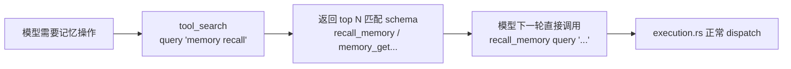

`query` 支持两种形式：
- `select:name1,name2`：按名字精确挑选（`max_results` 上限 20）
- 关键词：在 name + description 上做模糊检索，返回 top N（默认 5）

### 判定与标记

单一真源是 [`tools::dispatch::resolve_tool_fate`](../../crates/ha-core/src/tools/dispatch.rs)：它同时读取 tier、agent capability、全局 provider 配置、`deferredTools.enabled` 和 `deferredTools.toolNames`，决定 `InjectEager` / `InjectDeferred` / `HintOnly` / `Hidden`。

### 配置

`AppConfig.deferred_tools`（`config.json` → `deferredTools`）：

| 字段 | 默认 | 含义 |
|------|------|------|
| `enabled` | `false` | 总开关。关闭时内置工具不走 deferred |
| `toolNames` | `[]` | 显式延迟的内置工具名列表；默认空，因此即使总开关打开也不会自动延迟内置工具 |

UI 入口：设置 → 工具 → Deferred Tools。`ha-settings` 技能：`update_settings(category="deferred_tools", values={enabled: true, toolNames: ["pdf"]})`。

---

## Schema 组装流程

每轮 LLM 请求前，[`AssistantAgent::build_tool_schemas(provider)`](../../crates/ha-core/src/agent/mod.rs) 重新组装 `tools[]` 数组。结果直接进 Anthropic / OpenAI / Codex 的 API 请求体，**模型只能调用最终留在数组里的工具**。

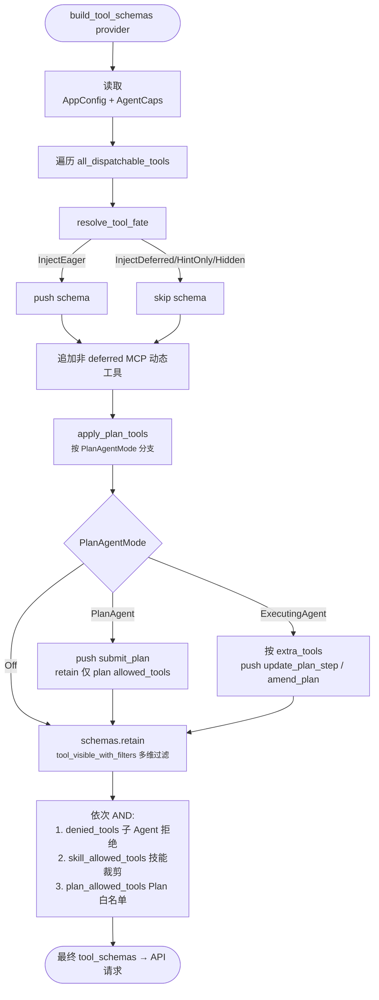

### 三个易混淆的"开关"对比

| 维度 | 控制谁 | 决策位置 |
|------|--------|----------|
| `supports_deferred()` | 工具是否**允许**被用户放进 deferred 池 | 由 tier `Standard`/`Configured` 的 `default_deferred` 字段派生 |
| `deferredTools.enabled` + `toolNames` | 哪些内置工具**本轮**变成 `InjectDeferred`（两者 AND）| `dispatch::resolve_tool_fate` |
| `tools.allow` / `tools.deny` + provider 配置 | 非 Core 工具是否 eager / hint-only / hidden | `dispatch::resolve_tool_fate` |
| MCP server `deferredTools` | 某台 server 的动态 MCP 工具是否走 `tool_search` | `agent::build_tool_schemas` + `tool_search` |

**规律**：是否"用户能开关启用"决定它走哪条路径——
- Core / Memory / MCP 元工具有自己的注入闸门，不由内置 deferred 总开关自动裁掉
- 支持 deferred 的内置工具默认仍 eager，只有进入 `deferredTools.toolNames` 后才延迟
- MCP 动态工具默认 eager，按 server 设置 `deferredTools=true` 后整台 server 延迟

### 与系统提示词的关系

两条系统提示词路径共享 `dispatch::resolve_tool_fate`：

- [`system_prompt/sections.rs`](../../crates/ha-core/src/system_prompt/sections.rs)：`build_tools_section` 把 `InjectEager` 工具的详细描述写入 `# Available Tools`；`build_deferred_tools_section` 把 `InjectDeferred` 工具 + deferred MCP server 写成 `# Additional Tools (use tool_search to discover)` 的一行目录。
- [`agent/mod.rs::build_full_system_prompt`](../../crates/ha-core/src/agent/mod.rs)：单趟遍历目录，`HintOnly` 累积到 `# Unconfigured Capabilities` 提示段（按 tool 名排序保证 prompt cache 命中），同时把 `send_notification` / `image_generate` / `canvas` 三类工具的额外指引段拼到提示词末尾。

### 与 tool_search 的关系

`tool_search` 的候选池同样由 `dispatch::resolve_tool_fate` 过滤：只包含 `InjectEager` / `InjectDeferred` 的工具，`Hidden` 和 `HintOnly` 不可发现。动态 MCP 工具额外按 server 的 `deferredTools` 设置计入 deferred 发现池。

---

## Tool Loop 执行流程

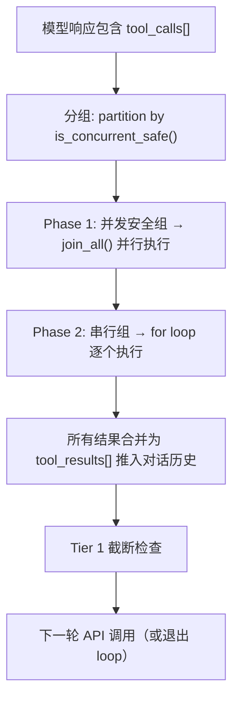

每个工具执行都通过 `tokio::select!` 与 cancel flag 竞争，支持用户随时取消。`async_capable` 工具调用进入 `execute_tool_with_context` 后会先经过下文的“异步决策”三道闸；显式后台或自动后台化时**会立即把 synthetic `{job_id, status: "started"}` 当作合法 tool_result 写回**，对话不阻塞继续推进，真实结果走异步注入回流。

---

## 异步 Tool 执行（async_capable）

长耗时工具（`exec` / `web_search` / `image_generate`）支持把整轮 tool call detach 成后台 job，立即返回 synthetic 结果，让 LLM 可以继续推进对话；真实结果完成后通过会话注入回流，模型靠 `job_id` 关联回去。这条机制完全不改 Anthropic / OpenAI 的 tool_use ↔ tool_result 配对协议，只是把"真实输出"和"配对响应"在时间上解耦。

### 决策三道闸

`tools/execution.rs:decide_async_path()` 在通过可见性 / 审批 / Plan-mode 路径门后立即决策。`bypass_async_dispatch=true` 的 ctx（递归再入路径）整段跳过，保证不会无限套娃。

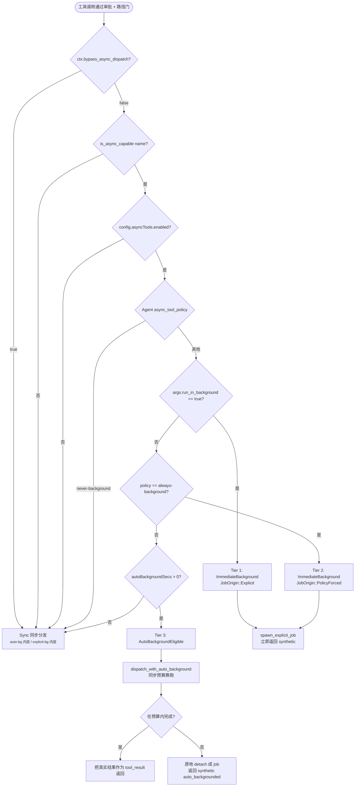

| Tier | 触发 | 行为 |
|------|------|------|
| **1. Explicit** | `args.run_in_background = true` | 立即 detach，模型主动 opt-in |
| **2. Policy Forced** | `AgentConfig.capabilities.async_tool_policy = "always-background"` | 立即 detach，无视 args |
| **3. Auto-Background** | `model-decide` 策略 + `asyncTools.autoBackgroundSecs > 0`（默认 30s） | 先同步跑，超预算再 detach，结果不丢 |

`job_timeout_secs` 是 async-capable 工具 schema 自动注入的可选单次参数：只控制外层 async job 的最长运行时长，只能比用户配置的 `asyncTools.maxJobSecs` 更短，不能放宽它。`0` 或省略表示不设置单次收紧；当 `asyncTools.maxJobSecs = 0` 时，正数 `job_timeout_secs` 仍可给单次 job 加上模型侧的更短上限。该字段在递归执行真实工具前会被剥离，不会传给 `exec` / `web_search` / `image_generate` 本体。

### Auto-Background 的相位机

Tier 3 是最微妙的一档。`async_jobs::spawn::dispatch_with_auto_background` 用 OS 线程 + `tokio::current_thread` 运行 dispatch（避免对工具 future 的 Send 约束），主线程通过共享 `Arc<Mutex<Phase>>` + `Notify` 等待结果，原子状态转换防止"主线程已超时但 OS 线程刚好完成"的双终结竞态：

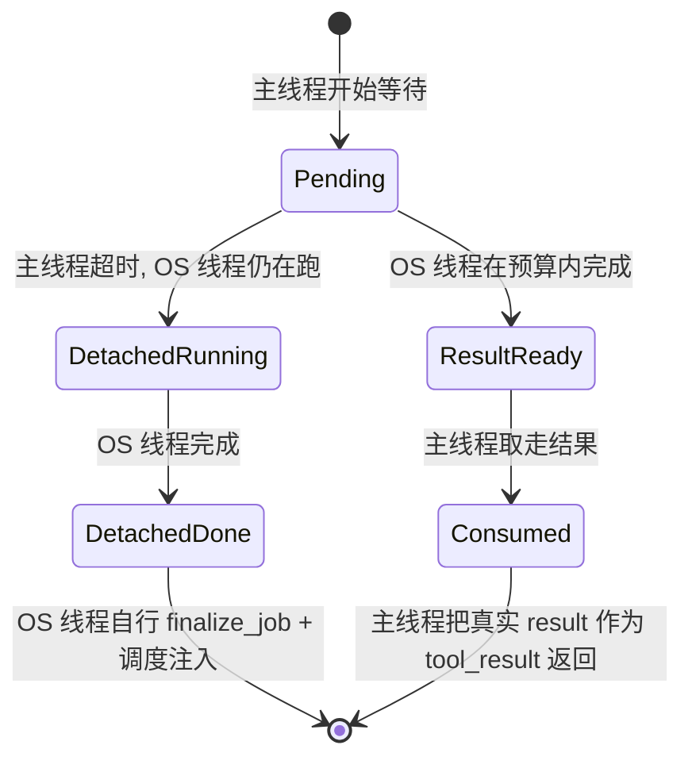

- `Pending → ResultReady → Consumed`：预算内完成，跟同步执行没区别
- `Pending → DetachedRunning → DetachedDone`：主线程预算到，原子转移所有权；OS 线程检测到 `DetachedRunning`，独立写 DB + 触发注入
- 这条相位机是为了避免简单的 `oneshot::timeout` 模式在边界情况下丢结果 —— oneshot 在 timeout 触发瞬间被 drop，OS 线程的 `tx.send` 静默失败，结果消失

### Wait Registry（隐藏短等待唤醒机制）

`async_jobs::wait` 维护一个进程级 `LazyLock<Mutex<HashMap<job_id, Arc<Notify>>>>`，给 `job_status` 的隐藏 `block=true` 兼容路径使用。模型可见 schema 不再暴露阻塞参数；生产者 `finalize_job` 写完 terminal 行后调 `notify_completion`，消费者 `tool_job_status` 走 `tokio::select!` 在 `Notify::notified()` 与指数退避轮询（100ms → ×1.5 → 2s 上限，作为兜底）之间择一触发。

| 函数 | 调用方 | 职责 |
|---|---|---|
| `register_waiter(job_id) -> Arc<Notify>` | `tool_job_status` 入口 | 懒插入或克隆现有 `Arc<Notify>`；多 waiter 共享同一 `Notify`（`Arc::ptr_eq` 验证） |
| `notify_completion(job_id)` | `finalize_job` 写完 DB 之后 | `notify_waiters()` 唤醒所有 parked + `map.remove(job_id)` 在同一临界区内完成；幂等 |
| `cleanup_if_last_waiter(job_id, my_arc)` | `tool_job_status` 返回路径（终态 / 超时 / 错误） | 持锁检查 `Arc::strong_count <= 2`（map + caller）才 `map.remove`；其他 waiter 仍 parked 时不动 |
| `waiter_count(job_id)`（test-only） | 单元测试 | 返回 `Arc::strong_count` |

**关键不变量**：

1. **Lazy insertion**：从不在 job 创建时预插，避免无人 poll 的 job 留 registry slot
2. **Producer 一次性 remove**：`notify_completion` 在临界区内 `notify_waiters` + `remove`，保证后到 waiter 不会拿到一个已经被 fire 过的 stale `Notify`（`Notify::notify_waiters` 不留 permit）
3. **Late waiter 自愈**：`notify_completion` 之后才到的 waiter 会拿到一个**全新**的 `Notify`；`tool_job_status` 强制在 register 后再读一次 DB，看到 terminal 行直接返回，不会 park——orphan `Notify` 在返回路径上由 `cleanup_if_last_waiter` 清理
4. **Multi-waiter 共生**：同一 job_id 多个 `register_waiter` 调用 `Arc::clone` 同一 `Notify`；其中某个 waiter 超时退出时 `cleanup_if_last_waiter` 因 `strong_count > 2` 不删 entry，不影响其他仍 parked 的 waiter

EventBus `async_tool_job:completed` 事件仍由 `finalize_job` emit，但 `job_status` 不再消费——保留只为给未来前端 UI 订阅用。

### Job 持久化

独立 SQLite 文件 `~/.hope-agent/async_jobs.db`（`async_jobs/db.rs`），不和 session DB 共享锁，避免热路径阻塞：

```sql
CREATE TABLE async_tool_jobs (
    job_id          TEXT PRIMARY KEY,        -- "job_<uuid simple>"
    session_id      TEXT,
    agent_id        TEXT,
    tool_name       TEXT NOT NULL,
    tool_call_id    TEXT,
    args_json       TEXT NOT NULL,
    status          TEXT NOT NULL,           -- running / completed / failed / interrupted / timed_out
    result_preview  TEXT,                    -- inline 预览（head + tail）
    result_path     TEXT,                    -- 大结果 spool 磁盘路径
    error           TEXT,
    created_at      INTEGER NOT NULL,
    completed_at    INTEGER,
    injected        INTEGER NOT NULL DEFAULT 0,
    origin          TEXT NOT NULL DEFAULT 'explicit'  -- explicit / policy_forced / auto_backgrounded
);
```

**大结果 spool**：超过 `asyncTools.inlineResultBytes`（默认 4096）的输出写到 `~/.hope-agent/async_jobs/{job_id}.txt`，DB 只存 head/tail 预览 + 路径。后续 `job_status` / 注入消息引用磁盘路径，模型可以用 `read` 工具拉全文。

### Synthetic 响应格式

模型在 tool_result 里看到的（任何 origin 通用）：

```json
{
  "job_id": "job_4f9bd1...",
  "status": "started",
  "tool": "exec",
  "origin": "explicit",
  "hint": "The tool is running in the background. Continue with other work; the result will be auto-injected as a `<task-notification>` user message when ready. Use `job_status` only for a quick non-blocking snapshot. Detailed output is saved to the notification's `output-file` when available."
}
```

`origin = "auto_backgrounded"` 的 hint 会换成强调"超过同步预算被自动后台化"的措辞，便于模型追溯发生了什么。

### 结果回流（注入）

job 终态后，`async_jobs::spawn::finalize_job` 经 `async_jobs::injection::dispatch_injection` 把结果注入回父会话。这条路复用 `subagent::injection::inject_and_run_parent`，共享 `ACTIVE_CHAT_SESSIONS` / `SESSION_IDLE_NOTIFY` / `PENDING_INJECTIONS` 的会话空闲检测和重试队列：

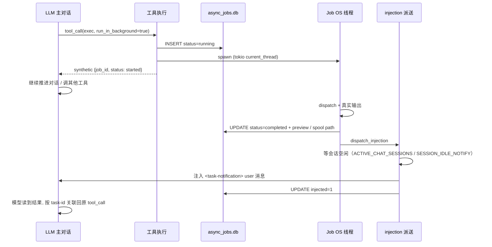

注入消息结构（XML 包裹便于模型解析）：

```xml
<task-notification>
<task-id>job_4f9bd1...</task-id>
<tool-use-id>call_xxx</tool-use-id>
<tool>exec</tool>
<status>completed</status>
<output-file>~/.hope-agent/async_jobs/job_4f9bd1....txt</output-file>
<summary>Async tool "exec" completed; full output is saved in output-file.</summary>
</task-notification>
```

当结果文件不可用时，completed 通知可带 `<output-preview>`；媒体结果可带 `<media-items-json>`。失败 / 超时 / 中断走 `<error>` 子标签。注入时若父会话忙，请求进 `PENDING_INJECTIONS` 队列等下次空闲（与子 Agent 注入完全同源）。

### 重启回放

`app_init::start_background_tasks` 启动时调用 `async_jobs::replay_pending_jobs()`：

1. 扫描 `status='running'` 行：本地进程已死，无法续跑 → 改为 `interrupted`，附 error 文案后入注入队列
2. 扫描 `status in (completed/failed/timed_out/interrupted) AND injected=0`：上次进程崩在注入之前 → 重新派送

### Retention / Orphan 清扫

长跑实例（数周到数月）会持续累积 terminal job 行 + spool 文件。`async_jobs::retention` 用一个 daily background loop 主动清扫，避免 `~/.hope-agent/async_jobs.db` 和 `~/.hope-agent/async_jobs/` 无界增长。

- **入口**：`app_init::start_background_tasks` 调 `retention::spawn_background_loop()`——内部 `tokio::spawn` 一个 24h ticker，启动时立即跑一次 + 之后每天一次
- **彻底关闭路径**：`retention_secs == 0 && orphan_grace_secs == 0` 时 `spawn_background_loop` 直接 return，不留永久空跑的 ticker
- **Row 清扫**（`retention_secs > 0`）：`db.purge_terminal_older_than(now - retention_secs)` 删 `completed_at` 早于 cutoff 的 terminal 行 + 关联 spool 文件，单事务原子提交
- **Orphan 清扫**（`orphan_grace_secs > 0`）：扫 `~/.hope-agent/async_jobs/*.txt`，跳过任何 DB 行 `result_path` 引用过的文件，剩下的若 mtime 早于 `now - orphan_grace_secs` 就删；`grace` 防误杀刚 spawn 但 DB 行尚未 commit 的 job 写入
- **单次 sweep 上限**：`MAX_ORPHANS_PER_SWEEP = 10_000` 防一个堆积 100k+ 文件的病态目录把 blocking pool 堵死几分钟，超出阈值后 `app_warn!` 退出，剩余下次 daily tick 继续清
- **运行 context**：`run_once()` 是同步函数，loop 用 `tokio::task::spawn_blocking` 派进 blocking pool，避免阻塞主 runtime

每次清到东西都落 `app_info!("async_jobs", "retention", ...)` 日志：`Purged N row(s), M spool file(s), B byte(s) freed (cutoff=Xs ago)`。

### 配置

`AppConfig.async_tools`（`config.json` → `asyncTools`）：

| 字段 | 默认 | 含义 |
|------|------|------|
| `enabled` | `true` | 总开关，关闭后所有 async-capable 工具退化为纯同步执行，`job_status` 工具也不注入 |
| `autoBackgroundSecs` | `30` | Tier 3 同步预算。`0` 关闭自动后台化，仅保留 Tier 1/2 |
| `maxJobSecs` | `1800`（30 min） | 后台 job 的用户硬上限；超时 → status=`timed_out` 并注入失败消息。`0` = async job 层不限时；具体工具仍可有自己的内部超时（如正数 `exec.timeout`；`exec.timeout=0` 也表示不限）。模型单次 `job_timeout_secs` 只能收紧这个上限，不能放宽 |
| `inlineResultBytes` | `4096` | 注入消息内联 preview 上限；超过时 spool 到磁盘并注入路径引用 |
| `retentionSecs` | `30 * SECS_PER_DAY`（30 天） | 终态行 + spool 文件 TTL；超期由 daily background loop 清扫。`0` = 永不清理（长跑实例累积风险，仅极端调试用） |
| `orphanGraceSecs` | `24 * SECS_PER_HOUR`（24h） | 孤儿 spool 文件 TTL：`~/.hope-agent/async_jobs/` 下名字未被任何 DB 行引用、且 mtime 超过这个 grace 的文件被删（grace 防与新写入 race）。`0` 关闭孤儿清扫 |
| `jobStatusMaxWaitSecs` | `7200`（2h） | 隐藏 `job_status(block=true)` 兼容路径的运行时上限。`max_job_secs > 0` 时由 `max_job_secs` 取代（`job_status_ceiling_secs()` 解析）；工具实现还会额外套 10s UI-safety cap，模型可见 schema 不暴露阻塞等待 |

`AgentConfig.capabilities.async_tool_policy`（`agent.json`）：

- `model-decide`（默认）：尊重 `args.run_in_background`，未指定时走 Tier 3 自动后台化
- `always-background`：所有 async-capable 工具一律 detach
- `never-background`：禁用 async 路径（Tier 1/2/3 全不触发）

### 递归再入与权限

显式后台 + 自动后台 都通过把工具的 `execute_tool_with_context` 在新线程上**递归再入**完成实际工作。再入时必须设置：

- `bypass_async_dispatch = true`：跳过 async 决策，直奔 sync dispatch，避免 `always-background` 策略触发死循环
- `auto_approve_tools = true`：外层已经过审批门，内层不能再弹（背景线程没有 UI 接驳的审批 channel）

可见性 / Plan-mode 路径检查仍会在内层走一遍，作为 belt-and-suspenders。

### 关键源文件

| 文件 | 职责 |
|------|------|
| `crates/ha-core/src/async_jobs/mod.rs` | `set_async_jobs_db` / `replay_pending_jobs` 入口 |
| `crates/ha-core/src/async_jobs/types.rs` | `AsyncJob` / `AsyncJobStatus` / `JobOrigin` |
| `crates/ha-core/src/async_jobs/db.rs` | 独立 SQLite 表 + CRUD |
| `crates/ha-core/src/async_jobs/spawn.rs` | `spawn_explicit_job`、`dispatch_with_auto_background`、相位机、result spool |
| `crates/ha-core/src/async_jobs/injection.rs` | 注入消息构造 + 复用 `subagent::injection::inject_and_run_parent` |
| `crates/ha-core/src/async_jobs/wait.rs` | per-job `Notify` 注册表：`register_waiter` / `notify_completion` / `cleanup_if_last_waiter`，由 `Arc::strong_count` 管理生命周期 |
| `crates/ha-core/src/async_jobs/retention.rs` | `run_once` 单次清扫 + `spawn_background_loop` daily ticker，删 terminal 行 + 孤儿 spool 文件，`MAX_ORPHANS_PER_SWEEP=10_000` 兜底 |
| `crates/ha-core/src/tools/job_status.rs` | `job_status` 工具实现（模型可见 snapshot；隐藏短 blocking 兼容路径走 `wait::register_waiter`） |
| `crates/ha-core/src/tools/execution.rs` | `decide_async_path` + 三道闸路由 + `bypass_async_dispatch` 递归保护 |
| `crates/ha-core/src/tools/definitions/types.rs` | `ToolDefinition.async_capable` + schema 自动注入 `run_in_background` / `job_timeout_secs` |
| `crates/ha-core/src/system_prompt/sections.rs` | `build_async_tools_section` 教模型何时使用 async tool / 怎么解析 `<task-notification>` |
| `crates/ha-core/src/config/mod.rs` | `AsyncToolsConfig` |
| `crates/ha-core/src/agent_config.rs` | `AsyncToolPolicy` 枚举 + `CapabilitiesConfig.async_tool_policy` |
| `crates/ha-core/src/paths.rs` | `async_jobs_db_path` / `async_jobs_dir` / `async_job_result_path` |

---

## 工具结果磁盘持久化

当工具返回结果超过阈值时，自动写入磁盘：

- **阈值**：默认 50KB，通过 `config.json` → `toolResultDiskThreshold` 配置（0 = 禁用）
- **存储路径**：`~/.hope-agent/tool_results/{session_id}/{tool_name}_{timestamp}.txt`
- **上下文内容**：head 2KB + `[...N bytes omitted...]` + tail 1KB + 路径引用
- **访问方式**：模型可通过 read 工具读取完整文件
- **视觉输出例外**：包含图片 marker 的工具结果不能按普通文本 head/tail 截断；合法图片 marker 保持完整交给 Provider 视觉输入，非法/损坏 marker 只返回纯文本落盘引用，避免把半截 base64 当图片发送

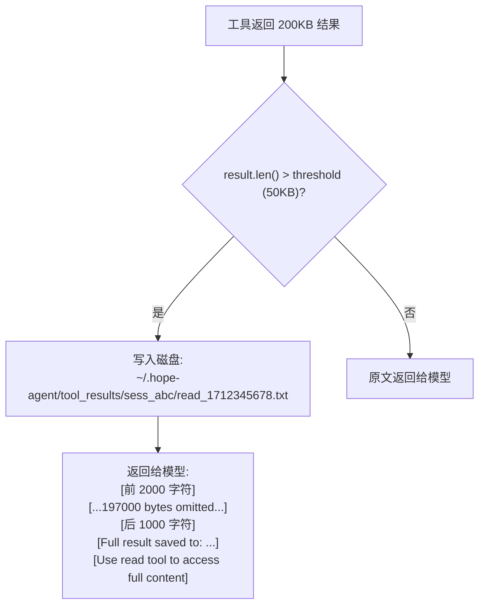

## 视觉工具输出协议

视觉工具输出分两条通道，职责不能混用：

| 通道 | 协议 | 消费方 | 作用 |
| --- | --- | --- | --- |
| UI / IM 文件资产 | `__MEDIA_ITEMS__[...]` | 前端、HTTP 资源路由、IM channel worker | 展示图片/文件卡片、下载、转发；包含 logical `url`、本地 `localPath`、MIME、大小、kind |
| Provider 视觉输入 | `__IMAGE_BASE64__...` / `__IMAGE_FILE__...` | `agent/events.rs` → 各 Provider adapter | 在发 API 前转换成 Anthropic/OpenAI/Codex 支持的标准图片输入 |

### `__MEDIA_ITEMS__`

工具结果可以用 `__MEDIA_ITEMS__` 前缀携带结构化附件元数据：

```text
__MEDIA_ITEMS__[{"url":"/api/attachments/<session>/<file>","localPath":"/abs/path","name":"...","mimeType":"image/png","sizeBytes":123,"kind":"image"}]
普通 tool_result 文本
```

`agent/events.rs::extract_media_items()` 会把该前缀从 tool_result 文本里剥离，并把 `media_items[]` 挂到 `tool_result` 流式事件上。Tauri 前端可以使用 `localPath`，HTTP/Web 模式的 EventBus 桥会去掉 `localPath` 并给 `/api/attachments/...` 补 token。

`__MEDIA_ITEMS__` 只服务 UI / IM / 文件下载。它不会自动让模型“看见图片”；模型视觉输入必须走下面的图片 marker。

### `__IMAGE_BASE64__`

旧的内联图片协议：

```text
__IMAGE_BASE64__image/png__<base64>__
Screenshot captured (...)
```

`agent/events.rs` 在写入 Provider 历史时识别该 marker，并转换为：

- Anthropic：`{ type: "image", source: { type: "base64", media_type, data } }`
- OpenAI Chat：`{ type: "image_url", image_url: { url: "data:image/...;base64,..." } }`
- OpenAI Responses / Codex：追加 `{ type: "input_image", image_url: "data:image/...;base64,..." }`

约束：

- MIME 必须是 `image/*`
- base64 必须完整且可解码
- marker 一旦被截断、混入 `[...bytes omitted...]`、缺少分隔符，必须降级为普通文本，不得生成 Provider 图片输入

### `__IMAGE_FILE__`

新的文件引用图片协议：

```text
__IMAGE_FILE__{"mime":"image/png","path":"/Users/.../.hope-agent/attachments/<session>/browser_screenshot.png"}
Screenshot captured (...)
```

它解决“图片原始文件要保存，但 Provider 不能直接读取本地路径”的问题：工具先把图片 bytes 保存为受管文件，再把路径 marker 写入 tool_result；Provider 发送前由 Hope Agent 读取该路径、校验、编码为 base64，再转换成标准图片输入。

安全边界：

- 只允许 Hope Agent 受管媒体目录下的路径，例如 `~/.hope-agent/attachments/`、`~/.hope-agent/tool_results/` 和 `~/.hope-agent/mac-control/snapshots/`
- 路径必须 canonicalize 后仍在允许目录内，防止 `../` 或 symlink 逃逸
- 文件 MIME 必须由魔数校验为图片，且与 marker 声明 MIME 一致
- 文件大小必须受上限保护，避免把超大本地文件读入 Provider 请求
- 任意工具结果伪造的普通 `/Users/...` 路径不得被自动读取

### 与落盘/压缩的关系

图片 marker 是机器可解析载荷，不是普通文本：

- 大结果落盘不能对 marker 做 head/tail 截断后再保留 marker 前缀
- 合法图片 marker 要么完整保留给 Provider 转换，要么迁移为 `__IMAGE_FILE__` 文件引用
- 非法图片 marker 或包含 marker 的普通落盘预览只允许返回纯文本路径引用，不能再生成 `image_url`
- Tier 1/2 上下文压缩同样不得制造“半截 marker”；如果要裁剪视觉结果，应移除图片载荷并保留文本说明/文件路径

关键实现：

| 文件 | 职责 |
| --- | --- |
| `crates/ha-core/src/tools/image_markers.rs` | 解析/校验 `__IMAGE_BASE64__` 与 `__IMAGE_FILE__`，文件路径安全检查，按需读取并编码图片 |
| `crates/ha-core/src/agent/events.rs` | 把图片 marker 转换为各 Provider 的标准图片输入；解析失败时降级普通文本 |
| `crates/ha-core/src/tools/execution.rs` | 大工具结果落盘；对图片 marker 做完整性保护，避免截断后继续作为图片发送 |
| `crates/ha-core/src/context_compact/truncation.rs` | Tier 1 截断时保护图片 marker，避免压缩阶段制造半截图片载荷 |
| `crates/ha-core/src/tools/browser/snapshot.rs` | browser 截图保存为 session attachment，并用 `__MEDIA_ITEMS__` + `__IMAGE_FILE__` 同时服务 UI 和模型视觉 |
| `crates/ha-core/src/tools/mac_control.rs` | `visual.observe` 把 macOS 受管截图包装为 `__IMAGE_FILE__`，供模型视觉定位 |

### 端到端流程图

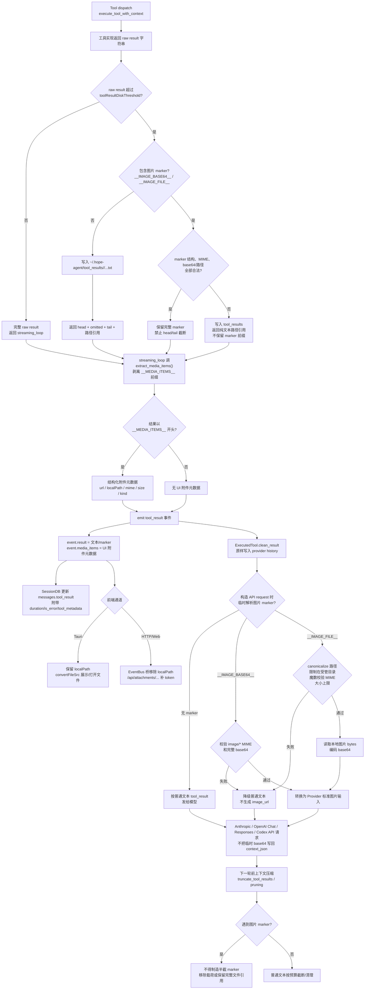

---

## 上下文压缩

工具结果的上下文压缩采用 5 层渐进式策略，完整架构见 [上下文压缩文档](context-compact.md)。

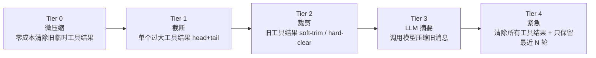

---

## 权限控制架构

系统中存在 **四个独立的工具控制维度**，按生效层级分为三大类：

| 类别 | 维度 | 作用 | 配置位置 |
|------|------|------|----------|
| **Agent 工具开关** | 非 Core 工具开关（FilterConfig） | 通过 `dispatch::resolve_tool_fate` 统一决定 system prompt、tool schema、`tool_search` 和执行层兜底 | Agent 设置 → 能力 → 工具 → 工具注入 |
| **Schema 可见性** | 子 Agent 工具拒绝（denied_tools） | 从实际发送给 LLM API 的 tool schema 中移除 | Agent 设置 → 子 Agent |
| **执行审批** | 会话权限模式（ToolPermissionMode） | 决定工具执行前**是否弹审批** | 输入框盾牌按钮 |
| **执行审批** | Agent 审批列表（require_approval） | 指定哪些工具需要审批 | Agent 设置 → 能力 → 工具 → 工具审批 |

此外还有 **Plan Mode 路径限制** 和 **exec 命令级 Allowlist** 两个特殊机制。

---

### 1. Agent 工具开关（FilterConfig）

**源码**：`agent_config.rs` → `AgentConfig.capabilities.tools: FilterConfig`
**UI**：Agent 设置面板 → 能力 → 工具子 tab → 工具注入折叠段落
**生效位置**：

- `dispatch::resolve_tool_fate()` — 决定 Standard / Configured 工具的 enabled 状态
- `system_prompt/build.rs:build_tools_section()` — 只描述当前 eager 工具
- `agent/mod.rs:build_tool_schemas()` — 只发送当前 eager schema
- `tools/tool_search.rs` — 只发现当前 eager/deferred 工具
- `tools/execution.rs:execute_tool_with_context()` — 执行层按同一 fate 兜底拒绝

```rust
pub struct FilterConfig {
    pub allow: Vec<String>,  // 非 Core 工具：显式打开
    pub deny: Vec<String>,   // 非 Core 工具：显式关闭
}
```

**判断逻辑**（仅 Standard / Configured 工具）：

```
工具在 deny 中 → 关闭
工具在 allow 中 → 打开
其他 → 使用 ToolTier 的 default_for_main / default_for_others
```

- 默认值：`allow=[]`, `deny=[]`（即不覆盖代码默认值）
- **作用范围**：只控制非 Core 内置工具的开关覆盖。Core 工具不受该字段影响；Memory / MCP 仍走各自 master switch
- **执行层兜底**：执行前重新解析 `resolve_tool_fate()`，避免旧上下文或异常 provider 输出绕过开关

**这样设计的理由**：

- **UI 语义一致**：设置面板的开关只记录用户对默认值的覆盖，不把默认开启工具展开写进 agent.json
- **避免 deferred tools 绕过**：如果只裁剪 prompt 或主 schema，模型仍可能通过 `tool_search` 发现被禁用工具；统一过滤后不会出现这类旁路
- **执行层防绕过**：即使未来某个 Provider 解析异常、历史消息注入异常，执行层仍会按同一规则拒绝被禁用工具
- **保持层次分工**：`FilterConfig` 负责 Agent 级工具开关；`denied_tools`、skill allowlist 和 Plan Mode 负责更强的上下文级收紧

### 2. 子 Agent 工具拒绝（denied_tools）

**源码**：`agent_config.rs` → `SubagentConfig.denied_tools: Vec<String>`
**生效位置**：`agent/mod.rs:build_tool_schemas()` — 在统一 schema 过滤阶段移除

```rust
schemas.retain(|t| {
    let name = extract_tool_name(t);
    tools::tool_visible_with_filters(
        name,
        &agent_tool_filter,
        &self.denied_tools,
        &self.skill_allowed_tools,
        plan_allowed_tools,
    )
});
```

- **作用范围**：从实际发送给 LLM API 的 tool schema 中移除，LLM 完全不知道这些工具的存在
- **使用场景**：子 Agent 深度分层工具策略，防止子 Agent 调用特定危险工具

---

### 3. 会话权限模式（ToolPermissionMode）— 最高优先级

**源码**：`tools/approval.rs` → `ToolPermissionMode` 枚举
**UI**：输入框左侧盾牌按钮（三态切换）
**生效位置**：`tools/execution.rs:execute_tool_with_context()` — 工具执行入口

```rust
pub enum ToolPermissionMode {
    Auto,           // 默认：由 Agent 配置决定
    AskEveryTime,   // 所有工具都弹审批
    FullApprove,    // 全部自动放行
}
```

**存储**：进程级全局单例（`OnceLock<TokioMutex>`），每次发消息时由前端通过 `chat` 命令参数设置。

> ⚠️ **注意**：这是进程级全局状态，多窗口/多会话共享同一个值。

### 4. Agent 审批列表（require_approval）

**源码**：`agent_config.rs` → `CapabilitiesConfig.require_approval: Vec<String>`
**UI**：Agent 设置面板 → 能力 → 工具 → 工具审批（三种模式：全部/无/自定义）
**生效位置**：`tools/execution.rs:tool_needs_approval()`

| 配置值 | 效果 |
|--------|------|
| `["*"]`（默认） | 所有非内部工具需审批 |
| `[]` | 所有工具自动放行 |
| `["exec", "web_fetch"]` | 仅指定工具需审批 |

**仅在 `ToolPermissionMode::Auto` 时生效**。

---

## 完整决策流程

> **说明**：下图描述的是“schema 可见性 + 执行审批”的硬控制链路。非 Core 工具开关先由 `resolve_tool_fate` 决定 schema / `tool_search` 可见性，并在执行层再次兜底校验。

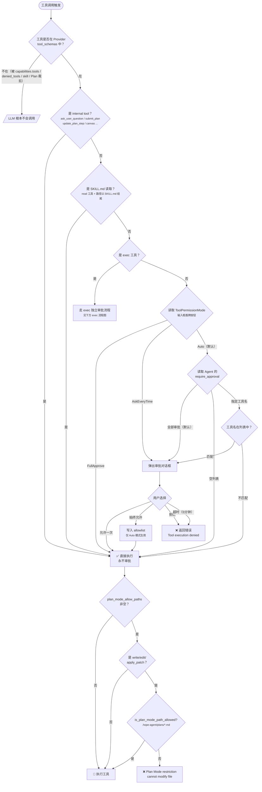

### 审批对话框交互

当判定需要审批时，后端发射 `approval_required` 事件，前端 `ApprovalDialog` 显示三个选项：

| 选项 | 行为 |
|------|------|
| **允许一次**（AllowOnce） | 本次放行，下次同样弹出 |
| **始终允许**（AllowAlways） | Auto 模式：写入 `exec-approvals.json` allowlist；AskEveryTime 模式：等同于 AllowOnce（不写 allowlist） |
| **拒绝**（Deny） | 工具返回类型化错误 [`ToolRejection::DeniedByUser`](../../crates/ha-core/src/tools/rejection.rs)，由 [`streaming_loop`](../../crates/ha-core/src/agent/streaming_loop.rs) 出口渲染为 `Tool error: Tool '<name>' execution denied by user. The tool did not execute and no side effects occurred. STOP what you are doing and wait for the user to tell you how to proceed.`；带 `Tool error:` 前缀触发 `is_error` 通道（UI 标红、warn 日志）|

审批等待超时默认 5 分钟，可通过 `config.json` 的 `approvalTimeoutSecs` 配置，`0` 表示不限时。超时后的行为由 `approvalTimeoutAction` 控制：默认 `deny`，阻止工具执行；可选 `proceed`，记录 warning 后继续执行工具。

### IM Channel 审批交互

当工具审批发生在 IM 渠道（Telegram/Discord/Slack 等）对话中时，`channel/worker/approval.rs` 监听 EventBus 的 `approval_required` 事件，通过 `ApprovalRequest.session_id` 反查 `ChannelDB` 关联的渠道信息，将审批提示发送到 IM 渠道本身：

- **支持按钮的渠道**（`ChannelCapabilities.supports_buttons = true`）：Telegram InlineKeyboard / Discord Action Row Button / Slack Block Kit / 飞书 Interactive Card / QQ Bot Keyboard / LINE Buttons Template / Google Chat Card v2
- **不支持按钮的渠道**：发送文本提示，用户回复 "1"（允许一次）/ "2"（始终允许）/ "3"（拒绝）

按钮回调通过各渠道原生机制（callback_query / INTERACTION_CREATE / interactive envelope / card.action.trigger / postback / CARD_CLICKED）路由回 `submit_approval_response()`。

### IM Channel 自动审批

`ChannelAccountConfig.auto_approve_tools: bool`（默认 `false`）可在设置中开启。开启后该渠道的所有工具调用自动审批，通过 `ChatEngineParams.auto_approve_tools` → `AssistantAgent.auto_approve_tools` → `ToolExecContext.auto_approve_tools` 传递到执行层，在审批门控和 exec 命令审批中均直接跳过。

---

## exec 工具的独立审批流程

exec 被排除在通用审批门（`name != TOOL_EXEC`）之外，在 `tools/exec.rs` 内部实现自己的命令级审批逻辑：

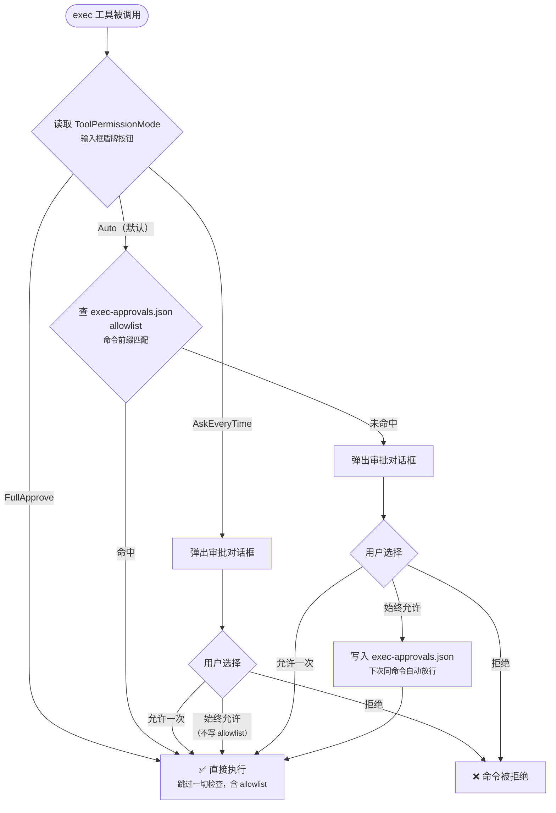

**Allowlist 持久化文件**：`~/.hope-agent/exec-approvals.json`
**匹配规则**：`extract_command_prefix()` 提取命令首个空格前的单词作为 pattern，前缀匹配。

---

## Plan Mode 工具限制

Plan Mode 在权限控制层面引入了**两层独立限制**：工具可见性裁剪 + 路径级硬限制。详见 [Plan Mode 文档](plan-mode.md)。

### 常量定义（`plan.rs`）

```rust
pub const PLAN_MODE_DENIED_TOOLS: &[&str] = &["write", "edit", "apply_patch", "canvas"];
pub const PLAN_MODE_ASK_TOOLS: &[&str] = &["exec"];
pub const PLAN_MODE_PATH_AWARE_TOOLS: &[&str] = &["write", "edit"];
```

### 1. 工具可见性裁剪（Planning/Review 阶段）

**源码**：`plan.rs` → `PlanAgentConfig` + `commands/chat.rs`
**生效位置**：chat 入口根据 `get_plan_state()` 动态修改 Agent 的 `denied_tools` 和工具注入

| 配置项 | 值 | 效果 |
|--------|-----|------|
| `PlanAgentConfig.allowed_tools` | `["read", "ls", "grep", "find", "glob", "web_search", "web_fetch", "exec", "ask_user_question", "submit_plan", "write", "edit", "recall_memory", "memory_get", "subagent"]` | Plan Agent 白名单，仅这些工具对 LLM 可见 |
| `PLAN_MODE_DENIED_TOOLS` | `["write", "edit", "apply_patch", "canvas"]` | 追加到 `denied_tools`，从 LLM tool schema 中移除 |
| `PLAN_MODE_ASK_TOOLS` | `["exec"]` | 追加到 `ask_tools`，exec 在 Planning 阶段始终弹审批 |

**双 Agent 模式**（`PlanAgentMode` 枚举）：

| 状态 | Agent 模式 | 工具集 |
|------|-----------|--------|
| Off | 正常 | Agent 配置的完整工具集 |
| Planning / Review | PlanAgent | 白名单工具 + path-restricted `write`/`edit` + 条件注入 `ask_user_question`/`submit_plan` |
| Executing / Paused | ExecutingAgent | 全量工具 + 条件注入 `update_plan_step`/`amend_plan` |
| Completed | ExecutingAgent | 全量工具 + 注入 `PLAN_COMPLETED_SYSTEM_PROMPT` |

### 2. 路径级硬限制（Planning 阶段文件写入）

**源码**：`tools/execution.rs`（执行守卫）+ `plan.rs` → `is_plan_mode_path_allowed()`
**触发条件**：`ToolExecContext.plan_mode_allow_paths` 非空时（Planning 阶段由 `PlanAgentConfig.plan_mode_allow_paths = ["plans"]` 自动设置）

在审批门**之后**、实际执行**之前**做路径检查：

```rust
// tools/execution.rs
if !ctx.plan_mode_allow_paths.is_empty() {
    let is_path_aware = matches!(name, TOOL_WRITE | TOOL_EDIT | TOOL_APPLY_PATCH);
    if is_path_aware {
        let target_path = args.get("file_path")
            .or_else(|| args.get("path"))
            .and_then(|v| v.as_str()).unwrap_or("");
        if !target_path.is_empty()
            && !crate::plan::is_plan_mode_path_allowed(target_path) {
            return Err("Plan Mode restriction: cannot modify '{path}'");
        }
    }
}
```

**`is_plan_mode_path_allowed()` 判断逻辑**：

```
文件扩展名不是 .md → 拒绝
路径包含 ".hope-agent/plans/" → 允许
路径以 plans_dir()（解析后的绝对路径）开头 → 允许
其他 → 拒绝
```

允许的路径范围：
- 项目本地：`<project>/.hope-agent/plans/*.md`
- 全局目录：`~/.hope-agent/plans/*.md`
- 自定义：`plansDirectory` 配置覆盖的目录下 `*.md`

这是一个**独立于审批的硬限制**，即使审批通过也会被拦截。

### 3. 子 Agent 安全继承

**源码**：`subagent/spawn.rs`

Planning/Review 状态下 spawn 的子 Agent 自动继承 `PLAN_MODE_DENIED_TOOLS`：

```
子 Agent denied_tools = SubagentConfig.deniedTools ∪ PLAN_MODE_DENIED_TOOLS
```

防止子 Agent 绕过 Plan Mode 的工具限制（如通过子 Agent 修改文件）。

---

## 特殊豁免规则

### Internal Tools（永不审批）

通过 `ToolDefinition.internal = true` 标记，`is_internal_tool()` 检查。包括：

- Plan Mode 工具：`ask_user_question` / `submit_plan` / `update_plan_step` / `amend_plan`
- 记忆 / Cron：`save_memory` / `recall_memory` / `memory_get` / `update_memory` / `delete_memory` / `update_core_memory` / `manage_cron`
- 跨会话通信：`agents_list` / `sessions_list` / `session_status` / `sessions_history` / `sessions_send` / `peek_sessions`
- 任务追踪：`task_create` / `task_update` / `task_list`
- 项目文件 / 附件：`project_read_file` / `send_attachment`
- 多 Agent 协作：`team` / `canvas` / `send_notification`
- 技能入口：`skill`
- 元工具 / 设置：`tool_search` / `job_status` / `runtime_cancel` / `get_settings` / `update_settings` / `list_settings_backups` / `restore_settings_backup`
- 多模态分析：`image` / `pdf` / `get_weather`

> 注意：以下工具**不在 internal 列表**，默认会被 `require_approval=["*"]` 拦入审批门——
> - 文件操作：`read` / `write` / `edit` / `apply_patch` / `ls` / `grep` / `find`
> - Shell / 进程：`exec`（命令级独立审批） / `process`
> - 网络：`web_fetch` / `web_search` / `browser`
> - 外部服务 / 调用：`image_generate` / `subagent` / `acp_spawn`
> - MCP 内置元工具：`mcp_resource` / `mcp_prompt`（被 `Tier::Mcp` gate 整体管控；未在 internal 列表，故仍走审批）

### SKILL.md 读取（技能预授权）

`is_skill_read()` 检查 — 当 `read` 工具的路径以 `/SKILL.md` 结尾时，在 `AskEveryTime` 和 `Auto` 模式下均跳过审批。

---

## 优先级总结

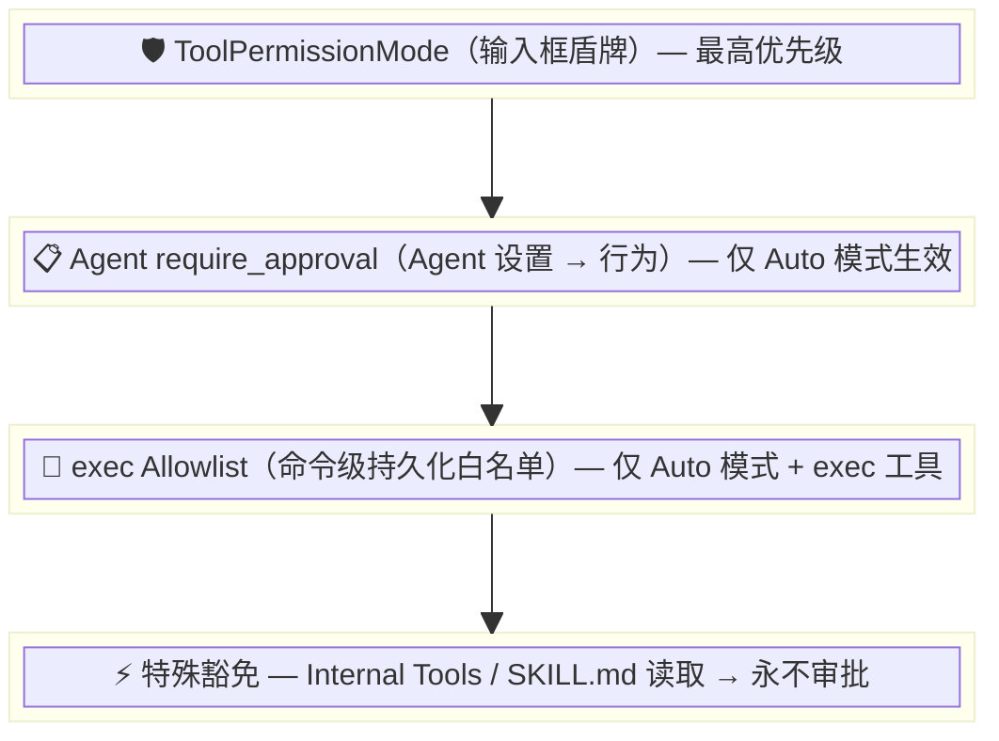

> **关键理解**：输入框的盾牌（ToolPermissionMode）是全局最高优先级开关，它能完全覆盖 Agent 设置中的 `require_approval` 配置。Agent 设置中的审批配置只在盾牌为 Auto（默认）时才参与决策。

---

## 飞书业务 toolset

v0.2.0 起把飞书除 IM 之外的核心业务 API（云文档 / 多维表格 / 云盘 / 知识库 / 审批 / 日历 / 联系人 / 招聘）做成 internal tools。设计与 PR 切分见 [`docs/plans/feishu-business-tools.md`](../plans/feishu-business-tools.md)；本节只列**对工具系统的契约**。

**凭据复用**：所有 `feishu_*` tool 共享 [`tools::feishu::resolve_feishu_api`](../../crates/ha-core/src/tools/feishu/mod.rs)，从 [`cached_config().channels.accounts`](../../crates/ha-core/src/config/persistence.rs) 找出已配置的飞书账号，按账号 ID 缓存 [`FeishuAuth`](../../crates/ha-core/src/channel/feishu/auth.rs) —— 与 IM 渠道是否 `start_account` 解耦，**即使没有运行 WS 网关，业务 tool 也能用**（[`feishu-business-tools.md` §6.5`](../plans/feishu-business-tools.md) Option B）。token mutex 共享，7200s 内不会双登。

**多账号路由**：每个 tool schema 都有可选 `account` 参数；零账号报错引导用户去 Settings → Channels；单账号自动选；多账号且未指定 `account` 时报错列出可选 ID。

**Tier 与默认值**：全部 Tier 3 Configured，`default_for_main = false / default_for_others = false`（用户主动开），`default_deferred = true`（飞书工具鼓励放进 deferred 池）。`is_globally_configured` 用 `n.starts_with("feishu_")` 通配——所有飞书 tool 共享一个全局配置门：「至少一个飞书账号已配」。未配但 agent 已开 → `HintOnly`，system prompt `# Unconfigured Capabilities` 段引导。

**SSRF 豁免**：飞书域名（feishu.cn / larksuite.com / 自部署）按既有 `channel/feishu/api.rs::authorized_request` 惯例豁免 `security::ssrf::check_url`。每个 `api_<module>.rs` 顶部 doc 注明此豁免，新增非飞书出站 tool 仍必走 SSRF。

**风险等级**：所有飞书业务 tool 标 **MEDIUM**（影响范围限于飞书租户内，不涉及本机文件 / 全局键位 / 凭据）。例外：
- 审批 `feishu_approval_create` / `feishu_approval_cancel` 标 **HIGH**（创建审批实例影响审批流；C6 PR 落地）
- 联系人 `feishu_contact_*` 仍是 MEDIUM 但 doc 必须警示「读取员工个人信息」（C8 PR 落地）

**当前已实现 tool**：

| PR | tool | 用途 |
|---|---|---|
| C1 | `feishu_docx_create` | 新建空文档，返回 `document_id` |
| C1 | `feishu_docx_get_blocks` | 列文档全部 block（分页） |
| C1 | `feishu_docx_append_block` | 在指定 parent 下追加 block |
| C1 | `feishu_docx_update_block_text` | 覆盖式改 block 文本 |
| C2 | `feishu_bitable_list_records` | 列多维表格记录（view + filter expression + 分页） |
| C2 | `feishu_bitable_search_records` | 结构化查询（field projection + sort + filter object DSL） |
| C2 | `feishu_bitable_create_record` | 单条新增记录 |
| C2 | `feishu_bitable_batch_update_records` | 批量更新记录（≤1000/请求） |
| C3 | `feishu_drive_list_files` | 列云盘文件夹内容（含 doc / sheet / bitable / file / folder） |
| C3 | `feishu_drive_upload_media` | 上传本地文件到云盘（≤20MB；走 protected-path 审批） |
| C3 | `feishu_drive_download_media` | 按 file_token 下载到本地（走 protected-path 审批） |
| C4 | `feishu_wiki_get_node` | 由 wiki token 反查节点元信息（space_id / obj_token / obj_type 等） |
| C5 | `feishu_bitable_list_views` | 列多维表格表的所有视图（grid / kanban / gantt / calendar / gallery / form） |
| C5 | `feishu_bitable_get_view` | 取单个视图完整配置（filter / sort / hidden_fields / 等） |
| C5 | `feishu_bitable_list_dashboards` | 列多维表格 app 下所有看板（dashboard_id + name） |
| C6 | `feishu_approval_create_instance` | **HIGH** 提交新审批实例 |
| C6 | `feishu_approval_get_instance` | 查审批实例状态 / 表单 / 时间线 |
| C6 | `feishu_approval_cancel_instance` | **HIGH** 撤销实例 |
| C6 | `feishu_approval_list_instances` | 按 approval_code + 时间区间列实例码 |
| C6 | `feishu_approval_subscribe` | 启用审批事件推送（v0.2.0 仅 log；行为留 v0.3+ B.2） |
| C7 | `feishu_calendar_list` | 列日历 |
| C7 | `feishu_calendar_create_event` | 建会议 / 事件 |
| C7 | `feishu_calendar_list_events` | 列事件（time range） |
| C7 | `feishu_calendar_update_event` | 改会议（patch） |
| C7 | `feishu_calendar_delete_event` | 删会议 |
| C7 | `feishu_calendar_attendees_create` | 邀人（user / chat / resource / third_party） |
| C8 | `feishu_contact_get_user` | 查用户 profile（敏感数据） |
| C8 | `feishu_contact_batch_get_users` | 批量查用户（≤50；敏感） |
| C8 | `feishu_contact_get_department` | 查部门 info |
| C8 | `feishu_contact_search_users_by_department` | 列部门下用户（敏感） |
| C9 | `feishu_hire_list_jobs` | 列招聘岗位（需 hire 模块开通） |
| C9 | `feishu_hire_get_job` | 查岗位详情 |
| C9 | `feishu_hire_list_talents` | 列人才库（敏感） |
| C9 | `feishu_hire_get_talent` | 查候选人详情（敏感） |
| C9 | `feishu_hire_list_applications` | 列投递记录 |

C2-C9 PR 各自往 [`tools::feishu::get_feishu_tools`](../../crates/ha-core/src/tools/feishu/mod.rs) 追加自己的 tool 定义，本表持续 grow。

**测试基线**：每个 `api_<module>.rs` 用 [`wiremock`](https://crates.io/crates/wiremock) 启动 mock HTTP server，覆盖 happy path + 飞书 envelope 错误码（如 `99991672` 权限不足）+ HTTP 5xx。`tools::feishu::*::execute_*` 单测验证参数缺失/类型错误的早期 `anyhow::Error` 路径。

**配套技能**（v0.2.0 收尾）：[`skills/feishu/SKILL.md`](../../skills/feishu/SKILL.md) wrapper skill，`paths: ["飞书","feishu","lark"]` 条件激活，包含常见工作流剧本（OKR 周报 / 审批 / 会议邀请）+ scope 速查表 + 错误码翻译。

---

## 关键源文件索引

| 文件 | 职责 |
|------|------|
| `crates/ha-core/src/tools/approval.rs` | ToolPermissionMode 定义、审批请求/响应、Allowlist 管理 |
| `crates/ha-core/src/tools/execution.rs` | 统一审批门（`execute_tool_with_context`）、Plan Mode 路径检查 |
| `crates/ha-core/src/tools/exec.rs` | exec 独立命令级审批逻辑 |
| `crates/ha-core/src/tools/dispatch.rs` | **注入决策单一入口**：`resolve_tool_fate()` / `DispatchContext` / `ToolFate`、`all_dispatchable_tools()` LazyLock 静态目录、`is_globally_configured()` Tier 3 配置探针 |
| `crates/ha-core/src/tools/definitions/types.rs` | `ToolDefinition` / `ToolTier` / `CoreSubclass` 定义；`to_api_metadata()` 渲染前端 settings UI 元数据 |
| `crates/ha-core/src/tools/definitions/registry.rs` | `is_internal_tool()` / `is_async_capable()` / `is_concurrent_safe()` —— 由 `dispatch::all_dispatchable_tools()` 派生的 LazyLock 缓存 |
| `crates/ha-core/src/async_jobs/` | 异步 Tool 执行（types/db/spawn/injection），独立 `~/.hope-agent/async_jobs.db` |
| `crates/ha-core/src/tools/job_status.rs` | `job_status` 工具：snapshot / 阻塞等待 per-job `Notify` + 100ms→×1.5→2s 退避轮询兜底 |
| `crates/ha-core/src/agent_config.rs` | `FilterConfig`（非 Core 工具 allow/deny 开关覆盖）、`CapabilitiesConfig.require_approval` / `mcp_enabled`、`SubagentConfig.denied_tools` |
| `crates/ha-core/src/agent/mod.rs` | `build_tool_schemas()` / `build_full_system_prompt()` 共享 `dispatch::resolve_tool_fate` 单一注入决策；`tool_context()` 构建 ToolExecContext |
| `crates/ha-core/src/agent/providers/*.rs` | 消费已过滤后的 `tool_schemas` 并发送 API 请求 |
| `crates/ha-core/src/system_prompt/sections.rs` | `build_tools_section()` / `build_deferred_tools_section()` 由 `dispatch::resolve_tool_fate` 驱动，分别渲染 eager 描述段落 / deferred 一行索引 |
| `crates/ha-core/src/tools/tool_search.rs` | `tool_search` 按当前 Agent/Skill/Plan 限制过滤可发现工具 |
| `crates/ha-core/src/tools/execution.rs` | 工具执行前按当前限制做 defense-in-depth 校验 |
| `src-tauri/src/commands/chat.rs` | Tauri 命令层：解析前端 tool_permission_mode 参数并设置全局模式 |
| `crates/ha-server/src/routes/chat.rs` | HTTP 路由层：REST API + WebSocket 流式推送 |
| `src/components/chat/ChatInput.tsx` | 盾牌按钮 UI（三态切换） |
| `src/components/chat/ApprovalDialog.tsx` | 审批弹窗 UI |
| `src/components/settings/agent-panel/tabs/CapabilitiesTab.tsx` | Agent 能力配置 UI（工具注入 / 审批 / 技能） |
| `crates/ha-core/src/channel/worker/approval.rs` | IM Channel 审批交互（EventBus 监听、按钮/文本发送、回调处理） |
| `src/components/settings/channel-panel/EditAccountDialog.tsx` | Channel 设置中的 auto_approve_tools 开关 |
