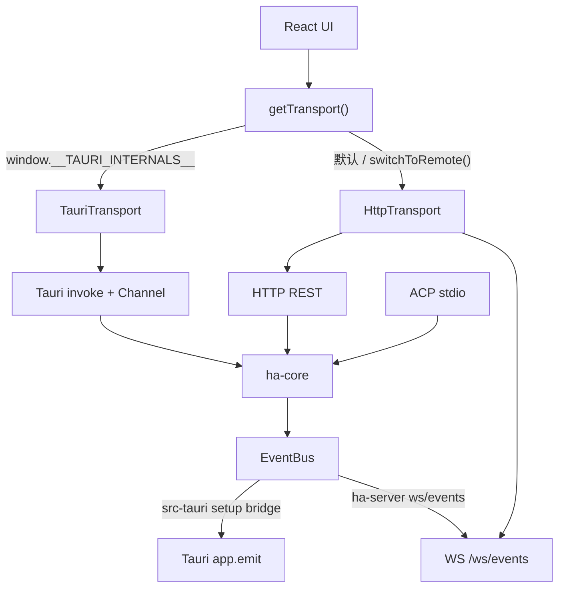

# Transport 运行模式与事件流

> 返回 [文档索引](../README.md) | 关联文档：[前后端分离架构](backend-separation.md) · [API 参考](api-reference.md) · [Chat Engine](chat-engine.md)

本文是前端 `Transport` 运行模式的中心化说明，解释 Hope Agent 在桌面、HTTP/Web、ACP 三种入口下如何通信、如何传递流式聊天事件，以及 EventBus 事件应该从哪里进入 UI。完整的 Tauri 命令、HTTP 路由、`COMMAND_MAP` 对照表仍以 [API 参考](api-reference.md) 为准。

## 运行模式

| 模式 | 用户入口 | 前端通信 | 后端入口 | 说明 |
| --- | --- | --- | --- | --- |
| Tauri 桌面 GUI | `pnpm tauri dev` / 桌面 App | `TauriTransport` | `src-tauri` 命令薄壳 | React 运行在 Tauri WebView 中，请求走 `invoke()`，流式聊天主路径走 Tauri `Channel<string>`。 |
| HTTP/WS server Web GUI | `hope-agent server start` + 浏览器 | `HttpTransport` | `ha-server` axum 路由 | 请求走 REST，后端事件和聊天流走 `/ws/events`。内嵌 Web GUI 和远程浏览器使用同一套路径。 |
| ACP stdio | `hope-agent acp` | 不经过前端 `Transport` | `ha-core::acp` | IDE/外部客户端通过 ACP NDJSON over stdio 直连核心协议，不加载 React，也不使用 `src/lib/transport.ts`。 |

三种模式共享 `ha-core` 业务逻辑和 `EventBus` 抽象。Tauri 与 HTTP 只是把同一批核心能力分别桥接成 IPC 或 REST/WS；ACP 是另一条协议入口，不参与前端 Transport 选择。

### Server 模式的工具审批

HTTP 入口的 `ChatEngineParams.auto_approve_tools` 在桌面 Web GUI 客户端下默认 `false`（跟桌面 GUI 一致），审批通过 EventBus `approval_required` 事件等浏览器侧 UI 响应。但 headless 客户端（curl / pipeline / Docker entrypoint）通常不会订阅这个事件，工具调用会卡到 5 分钟超时再被 deny —— 表现就是「模型一个 shell 命令都跑不了」。

提供两个 opt-in 开关给 headless 部署：

- **CLI flag** `hope-agent server start --auto-approve-tools`
- **Env var** `HA_SERVER_AUTO_APPROVE_TOOLS=1`（Docker 友好；接受 `1` / `true` / `yes` / `on` 任一值）

任一启用后，[`ha_server::auto_approve::is_active()`](../../crates/ha-server/src/auto_approve.rs) 返回 `true`，HTTP chat 路由把 `auto_approve_tools=true` 透传给 chat engine —— 等同于 IM 渠道账号勾上「auto-approve tools」。

**注意：是「全自动放行」，不是「只跳工具确认弹窗」**。`auto_approve_tools=true` 是 IM 账户级语义，会跳过**所有**审批闸门：dangerous-commands 列表、protected-paths 列表、edit-command 审计、Plan Mode ask、Smart 模式 judge —— 全部跳过。LLM 触发的任何 `exec` / `write` / `edit` 都直接执行，没有任何拦截。**不要把这个 flag 用在不可信租户**。

[`security::dangerous`](../../crates/ha-core/src/security/dangerous.rs)（`--dangerously-skip-all-approvals`）是更严格的超集：除了上面的全跳，还会让 dispatcher 层的 `app_warn!` 审计日志静默（也就是说 `~/.hope-agent/logs.db` 看不到「这条危险命令被自动放行」的记录）。常规 headless 推荐 `--auto-approve-tools` 即可——保留 dispatcher 层审计便于事后排查。同时启用两个 flag 不会叠加保护，只是两条 banner 都会打。

进程态、不持久化。启动时 stderr 打一行红字 banner，同时 `init_runtime` 后会再写一条 `app_warn!` 进 `~/.hope-agent/logs.db`，便于事后 agent 自主排查时看到此次启动是否开了 auto-approve。



## 前端选择逻辑

`src/lib/transport-provider.ts` 持有应用级 singleton：

- `getTransport()` 第一次调用时检查 `isTauriMode()`。
- `isTauriMode()` 只看 `window.__TAURI_INTERNALS__`，这是 Tauri 在用户脚本前注入的运行时标记。
- Tauri 模式创建 `new TauriTransport()`。
- 非 Tauri 模式创建 `new HttpTransport(import.meta.env.VITE_SERVER_URL || "http://localhost:8420")`。
- 设置页可用 `switchToRemote(baseUrl, apiKey)` 把 singleton 切到远程 `HttpTransport`，也可用 `switchToEmbedded()` 切回默认入口。

业务组件只依赖 `Transport` 接口，不直接判断 IPC、REST 或 WebSocket。例外是少量 UI 需要根据能力调整交互，例如 HTTP 模式不能 reveal 本地文件，工作目录选择需要显示 server-side directory browser。

## Transport 方法矩阵

| 方法 / 能力 | TauriTransport | HttpTransport |
| --- | --- | --- |
| `call<T>(command, args)` | 直接 `invoke(command, args)`。 | 查 `COMMAND_MAP` 后发 REST；GET/DELETE 参数进 query，POST/PUT/PATCH 参数进 JSON body。 |
| `prepareFileData(buffer, mime)` | 转 `number[]`，通过 IPC JSON 序列化。 | 转 `Blob`，供 multipart 上传零拷贝使用。 |
| 文件上传 | `save_attachment` 等命令仍走 `invoke()`。 | `save_attachment`、`upload_project_file_cmd`、`save_avatar` 走 multipart/form-data 特例。 |
| `startChat(args, onEvent)` | 创建 `Channel<string>`，调用 `invoke("chat", { ...args, onEvent })`，每个 stream event 直接进 `onEvent`。 | 调 `POST /api/chat`。stream delta 不进 `onEvent`，而是由 `/ws/events` 的 `chat:stream_delta` 送达；只在新会话时合成 `session_created` 给 `onEvent`。 |
| `listen(eventName, handler)` | `@tauri-apps/api/event.listen(eventName, ...)`。 | 复用全局 `/ws/events`，按 `{ name, payload }` 的 `name` 过滤。 |
| 媒体 URL | 用 `convertFileSrc(localPath)` 暴露本地文件。 | 只接受 `http(s)://` 或后端逻辑 URL，如 `/api/attachments/...`；绝对本地路径返回 `null`。 |
| 资产 URL | data/http(s) 透传，绝对路径走 `convertFileSrc`。 | 识别 avatars、image_generate、canvas 路径并改写到对应 `/api/...` route，必要时追加 `?token=`。 |
| 打开 / 定位文件 | `openMedia` 调 OS 默认处理器，`revealMedia` 调文件管理器。 | `openMedia` 触发浏览器下载或打开，`revealMedia` no-op，`supportsLocalFileOps()` 返回 `false`。 |
| 图片选择 | 原生文件选择器，返回 Tauri asset URL。 | 隐藏 `<input type="file">`，返回 `blob:` URL 和 `File`。 |
| 目录选择 / 浏览 | `pickLocalDirectory()` 用原生目录选择器；`listServerDirectory()` 也可走 Tauri 命令供 `@` mention 使用。 | 浏览器不能选 server 文件系统，UI 应显示 `ServerDirectoryBrowser`，由 `listServerDirectory()` 调 `/api/filesystem/list-dir`。 |
| 文件搜索 | `fs_search_files` Tauri 命令。 | `/api/filesystem/search-files`。 |

新增前端能力时必须同时检查两套实现。如果能力只适合桌面或只适合 HTTP，需要在 UI 上按 `Transport` 能力降级，而不是让业务组件直接拼底层协议。

## 聊天流式事件

### Tauri 模式

Tauri 的主流式路径是 per-call `Channel<string>`：

1. `useChatStream` 调 `transport.startChat(args, onEvent)`。
2. `TauriTransport.startChat` 创建 `Channel<string>` 并把它作为 `onEvent` 传给 Tauri `chat` 命令。
3. `src-tauri` 运行 Chat Engine，stream delta 直接写入这个 Channel。
4. `useChatStream` 的 `onEvent` 解析事件、更新消息、处理 `session_created`、工具块、think 块和错误状态。

Chat Engine 同时把每个 delta 双写到 EventBus 的 `chat:stream_delta`，并带 `{ sessionId, seq, streamId, event }`。在 Tauri 模式里，这条 EventBus 路径不是主路径，而是 `useChatStreamReattach` 的恢复保险：当前端重载、Channel 断开、或另一个窗口正在看同一会话时，UI 可以从 EventBus 继续接上。

### HTTP 模式

HTTP 模式没有 per-call browser Channel，主流式路径就是 EventBus：

1. `HttpTransport.startChat` 发 `POST /api/chat`。
2. `ha-server` 的 chat route 传入 `NoopSink`，依赖 Chat Engine 的 EventBus 双写。
3. Chat Engine 发 `chat:stream_delta`，`crates/ha-server/src/ws/events.rs` 转成 `/ws/events` 文本帧。
4. `HttpTransport.listen("chat:stream_delta", ...)` 收到 `{ name, payload }` 后分发给 `useChatStreamReattach`。
5. `useChatStreamReattach` 解析 `payload.event`，按 `_oc_seq` / `seq` 去重，然后调用同一套 `handleStreamEvent` 更新 UI。

`HttpTransport.startChat` 在 `POST /api/chat` 返回后，只在新会话场景合成：

```json
{ "type": "session_created", "session_id": "..." }
```

这个合成事件只服务 `useChatStream` 内部的 `__pending__` cache rename，让 HTTP 模式和 Tauri 模式保持同一个 hook 合约。它不承载 token delta，也不是通用 streaming 机制。

### 去重与恢复

- `chat:stream_delta` payload 的 `seq` 是 session/stream 内递增游标。
- 前端 `lastSeqRef` 由 `useChatStream` 与 `useChatStreamReattach` 共享，哪个路径先处理事件就推进 cursor。
- 切换会话时，前端会读 `get_session_stream_state`，用后端 cursor 给 `lastSeqRef` 播种，避免把 DB 快照里已有的 delta 再播一遍。
- `chat:stream_end` 用于清理 loading 状态、记录 ended stream id，并在当前会话上重拉最新消息兜底。

## `/ws/events` EventBus 桥

`/ws/events` 是 HTTP/Web 模式唯一的全局事件 WebSocket：

- 消息格式固定为 `{"name": string, "payload": unknown}`。
- 鉴权用 `?token=<api_key>` query 参数，因为浏览器 WebSocket 不能设置自定义 `Authorization` header。
- `HttpTransport.listen()` 在第一个 listener 注册时建立连接，最后一个 listener 取消时关闭连接。
- 断线后只要仍有 listener，就按 1s、2s、4s 递增到 30s 上限的退避策略重连。
- server 端每个 WebSocket 连接持有独立 broadcast receiver，多客户端互不抢消息。
- 发送单帧超过 5s 会断开慢客户端；连续 lag 超过阈值会发送 `_lagged` 并最终断开，避免阻塞 EventBus。
- `chat:stream_delta` 与 `channel:stream_delta` 会在 server 桥接时重写内层 `media_items`，去掉本地绝对路径并给 HTTP 资源 URL 补 token。

Tauri 桌面没有 `/ws/events`，但同一个 EventBus 会在 `src-tauri/src/setup.rs` 中订阅并转成 `app_handle.emit(name, payload)`，所以前端仍用同一个 `transport.listen(eventName, handler)` API。

## EventBus 事件目录

这张表记录前端可通过 `transport.listen()` 看到的主要事件。新增事件时优先在所属模块定义常量；完整命令/路由对齐仍看 [API 参考](api-reference.md)。

| 分类 | 事件名 | 用途 |
| --- | --- | --- |
| Chat | `chat:stream_delta` | UI chat token/tool/think 等流式增量，payload 包含 `sessionId`、`seq`、`streamId`、`event`。 |
| Chat | `chat:stream_end` | UI chat 结束，前端清 loading 并重拉当前会话消息。 |
| Channel | `channel:stream_start` / `channel:stream_delta` / `channel:stream_end` | IM 渠道会话的流式状态和增量。 |
| Channel | `channel:message_update` | IM 渠道消息落库后通知 UI 刷新。 |
| Approval | `approval_required` | 工具审批请求。 |
| Approval | `approval_timed_out` | 审批 5 分钟超时通知。IM 渠道侧用来给用户发「已超时被拒」消息；桌面 UI 自身有倒计时圆环，不依赖此事件。 |
| Approval | `session_pending_interactions_changed` | 会话 pending 审批和 ask_user 数量变化。 |
| Ask User | `ask_user_request` | 结构化问答请求，Plan Mode 和普通工具路径共用。 |
| Plan Mode | `plan_mode_changed` / `plan_content_updated` / `plan_step_updated` | 计划状态、内容、步骤变化。 |
| Plan Mode | `plan_submitted` / `plan_amended` / `plan_subagent_status` | 计划提交、修订、子 Agent 状态。 |
| Agents | `agents:changed` | Agent 保存或删除后通知设置页重拉。 |
| Subagent | `subagent_event` | 子 Agent 生命周期事件。 |
| Subagent | `parent_agent_stream` | 子 Agent 结果注入主对话的 started/delta/done/error。 |
| Team | `team_event` | Team 创建、暂停、恢复、成员、消息、任务、模板等变化。 |
| Project | `project:created` / `project:updated` / `project:deleted` | Project CRUD 后刷新项目列表和会话归属。 |
| Project | `project:file_uploaded` / `project:file_deleted` | Project 文件变化。 |
| Memory | `core_memory_updated` / `memory_extracted` | 手动或自动记忆变更。 |
| Memory | `dreaming:cycle_complete` | Dreaming 离线固化周期完成。 |
| Cron | `cron:run_completed` | 定时任务运行完成。 |
| Async Tools | `async_tool_job:completed` / `async_tool_job:updated` / `async_tool_job:mark_injected_failed` | 后台工具任务完成、状态变化或结果注入失败。 |
| Config | `config:changed` | `mutate_config()` 或 user config 写入后广播。 |
| Notifications | `agent:send_notification` | Agent 触发系统通知。 |
| ACP | `acp_control_event` | ACP 运行生命周期。 |
| Skills | `skills:auto_review_complete` / `skills:curator_proposals_ready` | Skill draft 自动审核完成；auto-curator 周期扫描产出草稿合并建议。 |
| Recap | `recap_progress` | 深度复盘进度。 |
| Local model jobs | `local_model_job:created` / `:updated` / `:log` / `:completed` | 后台本地模型任务（Ollama 安装、模型拉取、Embedding 拉取）的全生命周期事件。 |
| Docker | `searxng:deploy_progress` | SearXNG Docker 部署进度。 |
| Weather | `weather-cache-updated` | 天气缓存刷新。 |
| Canvas | `canvas_show` / `canvas_hide` / `canvas_reload` / `canvas_deleted` | Canvas 面板生命周期。 |
| Canvas | `canvas_snapshot_request` / `canvas_eval_request` | Canvas 工具请求前端截图或评估。 |
| MCP | `mcp:server_status_changed` / `mcp:catalog_refreshed` / `mcp:auth_required` / `mcp:auth_completed` / `mcp:servers_changed` / `mcp:server_log` | MCP 服务器状态、catalog、OAuth 和日志。 |
| Slash | `slash:model_switched` / `slash:effort_changed` / `slash:plan_changed` / `slash:session_cleared` | Slash 命令副作用广播。 |

以下事件是 Tauri shell 直接发给 WebView 的桌面事件，不经过 `ha-core::EventBus`，HTTP 模式不会收到：

| 事件名 | 用途 |
| --- | --- |
| `new-session` / `open-settings` | 托盘、菜单或系统入口触发 UI 导航。 |
| `chord-first-pressed` / `chord-timeout` / `shortcut-triggered` | 全局快捷键状态。 |
| `_event_bus_lagged` | Tauri EventBus bridge 发现接收端落后。 |

## 决策记录

### 为什么 `startChat` 不是通用 `streamCall`

`startChat` 承载的是一次 Chat Engine turn，而不是任意后端长任务：

- 它需要处理新会话创建、`__pending__` cache rename、session title、attachments、工具审批、停止生成、`chat:stream_end` 等 chat 专属状态。
- Tauri 模式需要 per-call `Channel<string>`，HTTP 模式需要全局 EventBus，二者的 delta 主路径不同，但 hook 合约必须一致。
- 其它长任务进度已经有 `transport.listen(event)` + 普通 `call()` 的模式，例如 local LLM、local embedding、SearXNG deploy。把它们塞进 `startChat` 会混淆会话语义。

因此 `startChat` 保持 chat 专用。新增非 chat 长任务时，优先使用“先订阅事件，再调用命令，finally 取消订阅”的 `withEventListener` 模式。

### 为什么 HTTP 删除 `/ws/chat/{session_id}` 后仍依赖 EventBus

旧的 per-session `/ws/chat/{session_id}` 会让 HTTP 模式拥有一条和 Tauri Channel 类似但独立维护的流式路径。现在 HTTP 统一使用 `/ws/events`：

- Chat Engine 已经双写 EventBus，HTTP 不需要第二套 stream registry。
- `/ws/events` 天然支持多客户端、后台会话、重载恢复和跨窗口观看同一流。
- `seq` 去重让 Tauri Channel 与 EventBus 兜底可以共存，也让 HTTP 主路径能从 DB cursor 恢复。
- 所有后端主动事件都走同一个 listener API，前端不用为 chat 单独维护 WebSocket 生命周期。

因此 HTTP chat route 可以传 `NoopSink`，把真正的浏览器流式交付交给 EventBus bridge。
