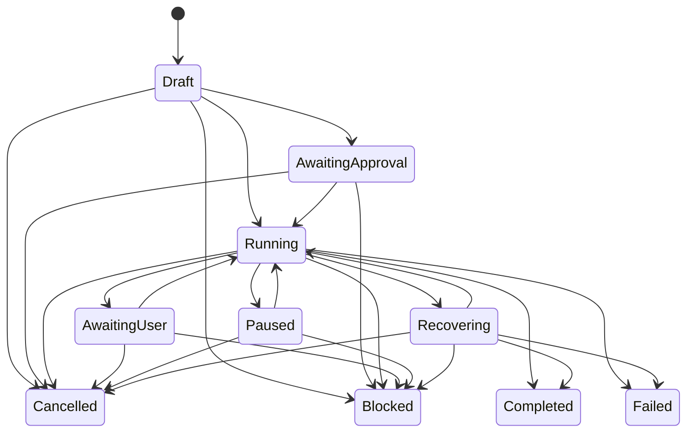

# Workflow Mode、Workflow Run 与 Execution Mode

> 返回 [文档索引](../README.md) | 更新时间：2026-07-04

本文记录已经实现的 durable workflow 子系统。Workflow Mode 是会话级“允许模型自主动态编排”的开关；Workflow Run 是一次具体、可观察、可恢复、可审批、可暂停/恢复/取消的脚本执行；Execution Mode 是会话级推进强度策略。Goal 已作为顶层目标与证据链落地，详见 [Goal 控制平面](goal.md)；定时/重复触发由 [Loop 控制平面](loop.md) 承载。

## 1. 定位

Workflow 解决的是长任务执行面的可控性和模型自主编排的产品化边界：

```text
session workflow_mode
  -> system prompt 注入 Workflow Mode policy
  -> 模型按需调用 workflow_run
  -> workflow.js
  -> Script Gate / permission preview
  -> WorkflowRun durable store
  -> QuickJS host API
  -> workflow_ops replay
  -> workflow_events trace
  -> Workspace / Workflow Control Center
```

它不负责长期目标本身。长期目标由 Goal 承载，workflow run 可绑定 `goal_id` 并在终态后回写 evidence；`/loop` 只负责定时、重复触发或条件轮询，不改变 workflow 的执行语义。

Loop 可以选择 `executionStrategy=workflow`：interval tick 会读取绑定 Goal 的 domain workflow template/version/task type，生成通过 Script Gate 的 workflow draft，创建 `origin=loop:<loop_id>` 的 WorkflowRun 并请求 Primary runtime 启动。Loop 仍只负责触发和预算门禁；真正执行、审批、恢复、trace、Goal evidence 仍归 Workflow run。

Workflow 不是 coding-only。coding 的迁移、审查、验证是重要模板，但同一能力也服务调研、写作、数据分析、会议准备、知识整理、项目运营等需要并行探索、交叉验证、阶段化执行或长任务追踪的场景。

与 Claude Code dynamic workflows 的对齐边界（参考 [Claude Code Dynamic workflows](https://code.claude.com/docs/en/workflows)，复核日期：2026-07-03）：

- Claude Code 当前公开文档把 workflow 定义为 Claude 写出的 JavaScript orchestration script，由 runtime 在后台执行，并通过 `/workflows`/任务面板观察；`/effort ultracode` 会让 Claude 对每个实质任务自行判断是否规划 workflow。Hope 对齐这个“模型生成脚本 + 后台 runtime + 用户观察/审批”的主路径，但命令面采用自己的 `/workflow on|ultracode` 会话开关。
- Hope 额外保留更强 durable store、Goal evidence、permission preview、repair run、pause/resume/cancel、worktree、review/verify host API 等本地控制面。手动创建 workflow run 是高级 owner/control-plane 能力，不是普通用户的唯一入口。

## 2. 用户视角用法

普通用户不需要先手写 `workflow.js`，也不需要切到 coding mode。Workflow 的主路径是“打开会话级 Workflow Mode，然后正常提需求”：

1. 在输入框工具条 / `+` 菜单点击“工作流”，或输入 `/workflow on`。
2. 输入正常任务，例如“调研这三个方案并给出推荐”“整理这批会议材料”“做一次完整代码迁移”。
3. 下一轮模型会看到 `workflow_run` 工具和 Workflow Mode prompt。模型自行判断是否值得创建 durable workflow run；简单任务会继续 inline 完成。
4. 一旦模型创建 run，Workspace / Workflow Control Center 会出现该 run：可看状态、当前焦点、Trace、Validation、Agents、授权清单、失败原因和修复入口。
5. 用户可在 GUI 或 slash command 里控制 run：
   - `/workflow status`：看当前模式和最近 run。
   - `/workflow runs`：列出当前会话最近 run。
   - `/workflow trace [run_id]`：查看 ops/events。
   - `/workflow approve|pause|resume|cancel [run_id]`：审批、暂停、恢复、取消。
6. 任务结束或不希望模型再自主编排时，用 `/workflow off` 或输入框状态条的一键关闭。

`/workflow ultracode` 是更强的 Workflow Mode：它仍然不是 coding-only，而是让模型对任何实质任务默认考虑多阶段、并行审查、交叉验证和长任务恢复。适合“质量优先、成本次要”的任务。

高级用户仍可在 Workspace 里手动创建 workflow run：从目标生成草稿、预检 Script Gate 和权限清单、编辑 `workflow.js`、选择 Execution Mode 和运行位置。这是 owner/control-plane 入口，不是普通主路径。

## 3. 模块边界

| 层 | 代码 | 责任 |
| --- | --- | --- |
| 核心类型 | `crates/ha-core/src/workflow/types.rs` | `WorkflowRun` / `WorkflowOp` / `WorkflowEvent` / 状态枚举。 |
| 持久化 | `crates/ha-core/src/workflow/db.rs` | 三表建表、run/op/event CRUD、状态转换、replay 决策。 |
| 预检 | `crates/ha-core/src/workflow/preview.rs` | Script Gate + permission preview + create/run 可行性判定。 |
| runtime | `crates/ha-core/src/workflow/runtime.rs` | QuickJS runtime、host API、durable replay、budget、repair guard、恢复 runner。 |
| Workflow Mode | `crates/ha-core/src/workflow_mode.rs` | `off` / `on` / `ultracode` 解析、prompt 动态段与 session 开关语义。 |
| Execution Mode | `crates/ha-core/src/execution_mode.rs` | `off` / `guarded` / `deep` / `autonomous` 解析与 prompt 动态段。 |
| 模型工具面 | `crates/ha-core/src/tools/workflow_tool.rs` | `workflow_run` 工具，模型只在 Workflow Mode 开启时可见，用于创建 durable run 并请求 primary runtime 启动。 |
| Managed Worktree | `crates/ha-core/src/worktree.rs` | 可选隔离执行目录，run 绑定 `worktree_id` 后 runtime 自动 restore 并切换 cwd。 |
| Tauri owner API | `src-tauri/src/commands/workflow.rs`、`execution_mode.rs` | 桌面 owner 平面命令。 |
| HTTP owner API | `crates/ha-server/src/routes/workflow.rs`、`execution_mode.rs` | Server/Web owner 平面端点。 |
| GUI | `src/components/chat/input/ChatInput.tsx`、`src/components/chat/workspace/WorkspacePanel.tsx`、`useWorkflowRuns.ts` | 输入框 Workflow Mode 入口与常驻状态、Workflow Control Center、run 详情、审批/恢复/取消、Execution Mode 控件。 |
| 斜杠命令 | `crates/ha-core/src/slash_commands/handlers/workflow.rs` | `/workflow` 与 `/mode` 的文本控制面。 |

红线：

- Workflow 逻辑必须在 `ha-core`；Tauri 和 HTTP 只做薄适配。
- owner 平面 API 负责管理 run；模型不能直接拥有绕过 Gate 的内部入口。
- 模型只能在非 incognito 且 `sessions.workflow_mode != off` 时看到和调用 `workflow_run`。
- runtime 只能暴露受控 host API；脚本没有 raw fs/network/process/env 能力。
- Workflow durable run 禁止用于 incognito session。
- 反向也必须成立：会话开启 Workflow Mode 或已有 WorkflowRun 后，`update_session_incognito(..., true)` 必须拒绝，避免 durable workflow 控制面和“关闭即焚”语义并存。

## 4. 数据模型

Workflow 数据落在 `sessions.db`，跟随会话级联删除。

### `workflow_runs`

| 字段 | 说明 |
| --- | --- |
| `id` | `wfr_*` run id。 |
| `session_id` | 所属会话，外键到 `sessions(id)`。 |
| `kind` | run 类型，默认 `general.workflow`；coding workflow 只是其中一种模板。 |
| `state` | `draft` / `awaiting_approval` / `running` / `awaiting_user` / `paused` / `recovering` / `completed` / `failed` / `cancelled` / `blocked`。 |
| `execution_mode` | 创建 run 时的 Execution Mode 快照。 |
| `script_hash` | `workflow.js` 源码 BLAKE3 hash。 |
| `script_source` | 原始 `workflow.js`。 |
| `budget_json` | runtime / op / token 预算。 |
| `cursor_seq` | op 完成时递增，用于进度观察。 |
| `primary_owner` | Primary process claim owner。 |
| `blocked_reason` | `blocked` 终态原因。 |
| `parent_run_id` | 修复 run 来源，外键到 `workflow_runs(id)`，删除父 run 时置空。 |
| `origin` | run 来源，例如 `repair`。 |
| `goal_id` | 可选 Goal 归属；不显式传时自动绑定当前 session 的 open Goal。 |
| `worktree_id` | 可选 Managed Worktree 归属；绑定后本 run 的工具、读取、校验、diff 默认在 worktree 路径执行。 |
| `created_at` / `updated_at` / `completed_at` | 时间戳。 |

### `workflow_ops`

| 字段 | 说明 |
| --- | --- |
| `id` | `wfo_*` op row id。 |
| `run_id` | 所属 run。 |
| `op_key` | runtime 派生的位置化 op 身份，`UNIQUE(run_id, op_key)`。 |
| `op_type` | `task.create`、`tool:exec`、`spawnAgent`、`validate` 等。 |
| `effect_class` | `pure` / `idempotent` / `non_idempotent`。 |
| `input_hash` | 稳定 JSON 输入 hash；同一 `op_key` 输入变化会 block run。 |
| `input_json` | op 输入快照。 |
| `state` | `pending` / `started` / `completed` / `failed`。 |
| `output_json` / `error_json` | op 输出或错误。 |
| `child_handle` | 子任务句柄：subagent run id、async job id、validation child handle。 |
| `started_at` / `completed_at` | 时间戳。 |

### `workflow_events`

| 字段 | 说明 |
| --- | --- |
| `id` | 自增 row id。 |
| `run_id` | 所属 run。 |
| `seq` | run 内单调序号，`UNIQUE(run_id, seq)`。 |
| `type` | `run_created`、`run_state_changed`、`op_started`、`op_completed`、`trace` 等。 |
| `payload_json` | 事件载荷，超过 64KB 会被截断成 preview。 |
| `created_at` | 时间戳。 |

## 5. 状态机

`WorkflowRunState::can_transition_to()` 是 run 状态转换单一真相源。



`completed` / `failed` / `cancelled` / `blocked` 是终态。进入终态、`awaiting_approval`、`awaiting_user` 或 `paused` 时会清空 `primary_owner`，因为这些状态没有 runtime 正在推进；进入 `blocked` 时写 `blocked_reason`。

## 6. Workflow Mode

Workflow Mode 是 session 级持久开关，入口是输入框 `+` 菜单/工具条、Workspace / Workflow Control Center 和 `/workflow`。

| Mode | 数据值 | 模型工具面 | Prompt 行为 | 用户语义 |
| --- | --- | --- | --- | --- |
| Off | `off` | 不注入 `workflow_run`。执行层也拒绝模型调用。 | 不注入 Workflow Mode 段。 | 普通对话/任务推进，用户仍可在 owner 控制面查看历史 run。 |
| On | `on` | 注入 `workflow_run`。 | 告诉模型可在多步骤、fan-out、研究、迁移、验证、长任务场景按需创建 workflow。 | 用户允许模型自主动态编排，但模型仍需判断是否值得。 |
| Ultracode | `ultracode` | 注入 `workflow_run`。 | 强化为“实质任务默认考虑 workflow”，鼓励多阶段、独立审查、交叉验证。 | 对齐 Claude Code `ultracode` 心智：质量/覆盖优先，成本和耗时更高。 |

存储：

- session 当前模式：`sessions.workflow_mode`。
- Tauri / HTTP owner API：`get_workflow_mode` / `set_workflow_mode`。
- HTTP：`GET|POST /api/sessions/{sessionId}/workflow-mode`。
- `SessionMeta.workflowMode` 暴露给前端。

模型工具面：

- `workflow_run` 是 Core Meta Tool，但不进入静态工具目录；schema 构建后只在当前 session `workflow_mode.enabled()` 且非 incognito 时追加。
- 执行层再次校验 session、incognito、DB、`workflow_mode`，所以即使旧 schema 或外部请求绕进来也 fail-closed。
- `SessionDB` 还会拒绝把已开启 Workflow Mode 或已有 WorkflowRun 的普通会话切成 incognito。
- 模型侧 `workflow_run` schema 只要求 canonical `script`，且不展示 `scriptSource` / `script_source` alias，避免脚本入口分裂；执行层仍兼容这些历史输入别名。其它可选元数据参数为 `kind`、`executionMode`、`budget`、`runImmediately`、`parentRunId`、`origin`、`goalId`、`worktreeId`，创建层会校验 parent/goal/worktree 均属于同一 session。
- `runImmediately` 默认 `true`：模型创建 run 后直接进入 preflight / approval / runtime；如果需要用户先看脚本，可显式创建 draft。
- `executionMode` 未传时继承当前 session execution mode；若 session execution mode 是 `off`，run 默认使用 `guarded`，避免有 workflow 却没有基础 stop guard。
- `executionMode=autonomous` 必须显式提供 runtime budget 和 output token budget。

用户交互：

- 输入框工作流按钮循环 `off -> on -> ultracode -> off`；开启后输入框上方常驻显示当前 Workflow Mode。
- Workspace / Workflow Control Center 顶部有同一个 Workflow Mode segmented control；两个入口用 `hope-agent:workflow-mode-changed` 前端事件同步。
- `/workflow on|off|ultracode|status` 是文本入口；`/workflow runs|trace|approve|pause|resume|cancel` 是 run 管理入口。
- 开启 Workflow Mode 不等于立即运行。它改变的是下一轮模型可见能力和决策策略；真正是否创建 run 由模型根据任务复杂度判断。
- 手动创建 run 仍保留在 Workspace 高级区，用于用户或高级自动化直接提交脚本，但不是普通主路径。

## 7. Execution Mode

Execution Mode 是 session 级持久策略，入口是 `/mode` 与 Workspace/Workflow Control Center。

| Mode | 数据值 | Prompt 行为 | runtime 行为 |
| --- | --- | --- | --- |
| Off | `off` | 不注入 Execution Mode 段。 | `validate` 失败不触发 guarded repair stop guard。 |
| Guarded | `guarded` | 注入 guarded 推进策略。 | validation failure 记录 repair event，并可因重复失败/无 diff 进展 block。 |
| Deep | `deep` | 注入 deep 推进策略。 | repair guard 同 guarded；prompt 允许更深入探索与验证。 |
| Autonomous | `autonomous` | 注入 autonomous 推进策略。 | 创建/运行 autonomous run 必须有明确 runtime + output token budget，否则 block。 |

存储：

- session 当前模式：`sessions.execution_mode`。
- workflow 创建时快照：`workflow_runs.execution_mode`。

Execution Mode 不是 `/loop`。它只描述推进强度，不负责定时、重复触发或条件轮询。

## 8. Script Gate 与 Permission Preview

创建 workflow run 前，Tauri / HTTP owner API 都会调用：

```text
preview_workflow_script_for_session()
ensure_workflow_script_can_create()
```

预检输出 `WorkflowScriptPreview`：

| 字段 | 说明 |
| --- | --- |
| `gate` / `gatePassed` / `gateFeedback` | Script Gate 报告。 |
| `permission` | 静态 permission preview。 |
| `canCreate` | Gate 通过且没有确定 deny。 |
| `canRunImmediately` | 第一版与 `canCreate` 同步。 |
| `requiresApproval` | preview 中存在 ask 或 dynamic call。 |
| `hasDenials` | preview 中存在 deny。 |

执行规则：

- Gate 不通过：create 直接拒绝。
- permission preview 有 deny：create 拒绝。
- draft run 运行时若 preview 需要用户批准，run 转 `awaiting_approval`，写 `script_permission_approval_required`，必须 owner approve 后继续。
- 动态参数无法静态判定时记为 dynamic；运行时仍走真实工具权限引擎兜底。

## 9. Runtime

runtime 使用 `rquickjs`：

- 内存限制：64MB。
- 栈限制：1MB。
- 默认脚本超时：30s，上限 300s。
- `Date.now()` / `new Date()` / `Math.random()` 等非确定性入口被 runtime guard 禁用。
- 脚本必须 `export default async function main(workflow)`，并且最终调用 `workflow.finish(...)`。

执行入口：

```text
run_workflow_script_async(db, run_id)
  -> 检查 run 状态
  -> Script Gate
  -> autonomous budget gate
  -> Draft permission preview
  -> transition Running
  -> spawn_blocking QuickJS runtime
  -> workflow.finish -> Completed
```

Worktree 绑定：

- `create_workflow_run` 可接收 `worktreeId`，创建时校验 worktree 属于同一 session 且处于 `active` / `handoff`。
- `workflow_runs.worktree_id` 是执行期真相源；创建 run 后会 best-effort 回填空的 `managed_worktrees.workflow_run_id` 作为反向索引，并 emit `worktree:updated` 供 Workspace 刷新。已有非空反向绑定不覆盖。
- 若 run 绑定 Goal，创建后会写 `worktree_attached` Goal evidence；Worktree 后续 archive / restore / handoff 会刷新这条 evidence 的 state、path、dirty snapshot 和 handoff 时间。
- runtime 构造 `WorkflowSessionContext` 时，如果 run 绑定 `worktree_id`，会先读取 managed worktree；路径缺失或状态归档时自动 `restore_managed_worktree`。
- restore 失败或 worktree 不可用时，run 转 `blocked(worktree_unavailable)`，不能静默回退到父会话 working dir。
- 绑定成功后写 `run_worktree_attached` trace event，`workflow.fileSearch` / `read` / `grep` / `tool` / `validate` / `diff` 默认 cwd 都是 worktree path。

Primary-only 启动：

- `spawn_workflow_run_if_primary()` 只在 primary process 启动 run。
- 每次启动请求都会追加 `run_runtime_launch` 审计事件，记录 `accepted`、`owner`、`reason`、`pid`；非 Primary 记录 `accepted=false` / `reason=not_primary`。
- runtime spawn 后追加 `run_runtime_result` 审计事件，记录 `status=finished|error|skipped|rejected`、最终状态、错误摘要或跳过原因。
- runtime 启动前必须先 claim `primary_owner`。`Draft` launch claim 保持 `draft` 状态以便权限预览仍会执行；通过预览后再转 `running` 并保留 owner。
- 重复启动同一个 `running` / owner-alive run 会被 claim CAS 拒绝，避免同一 workflow 并发执行两份 runtime。
- `spawn_startup_recovery_if_primary()` 启动时恢复 owner 为空或 stale 的 `running` / `recovering` run；若进程在 Draft 预检前崩溃，只有带 stale `primary_owner` 的 `draft` run 会被恢复，普通手动 draft 不会自动启动。
- recovery 通过 `claim_workflow_run_for_recovery(run, owner)` CAS 抢占：`running` / `recovering` 转 `recovering`；stale-owner `draft` 保持 `draft`，让 permission preview 重新执行。
- 所有会启动 runtime 的入口（模型 `workflow_run` 默认启动、owner `run`、`resume`、`approve`、`create runImmediately=true`）必须先过 `ensure_workflow_launcher_primary()`；非 Primary fail-fast，禁止先创建/改成 running 再启动失败，避免留下无人推进的 Draft/Running run。
- API / GUI / slash 对用户表达的是 **launch accepted / 启动请求已接收**，不是承诺同步进入 `running`。真实状态仍以 `workflow_runs.state`、`workflow:*` 事件和 snapshot 刷新为准；若 permission preview 需要确认，下一状态预期是 `awaiting_approval`。

## 10. Host API

脚本只能通过 `workflow` host object 产生副作用。

| API | effect | 说明 |
| --- | --- | --- |
| `workflow.task.create({ title, label? })` | idempotent | 创建 session task，返回 task handle。 |
| `workflow.task.update({ task, status?, title?, content?, activeForm? })` | idempotent | 按 `task.create` 返回 handle 更新 task。 |
| `workflow.fileSearch({ query, root?, limit?, label? })` | pure | 调 `filesystem::search_files`，默认 root 为 session working dir。 |
| `workflow.tool({ name, args, label? })` | 取决于工具 | 走 `tools::execute_tool_with_context`，继承权限、hooks、working dir；`lsp` 的 `diagnostics` / `sync_file` 结果会写入 `diagnostic_result` Goal evidence。 |
| `workflow.read(args)` | pure | `read` 工具快捷入口。 |
| `workflow.grep(args)` | pure | `grep` 工具快捷入口。 |
| `workflow.spawnAgent(args)` | non-idempotent | 走 `subagent` 工具，预分配 child run id。 |
| `workflow.waitAll(handles, { timeout?, label? })` | pure | 走 `subagent` 工具等待子 Agent，汇总结果。 |
| `workflow.validate({ commands, reason?, label? })` | non-idempotent | 预分配 async exec job，等待终态，返回结构化 validation 结果。 |
| `workflow.review({ scope?, baseRef?, focusPaths?, profiles?, ideContext?, label? })` | idempotent | 运行 durable Review run，默认 `scope=local`，继承当前 workflow 的 `goal_id`，返回摘要、finding 数和 blocking finding 数。 |
| `workflow.verify({ scope?, focusPaths?, maxCommands?, label? })` | idempotent | 创建 Smart Verification 计划，默认 `scope=local`，继承当前 workflow 的 `goal_id`；只规划不执行命令。 |
| `workflow.repairLoop({ label?, maxAttempts?, validationCommands?, focusPaths?, reviewProfiles?, review?, verify?, maxVerificationCommands? }, fn)` | helper | 脚本级 bounded repair loop；每轮调用 callback 执行动态修复动作，然后自动 validate / profile-aware review / verify / trace。 |
| `workflow.evidence.record({ domain, evidenceType, title, summary?, sourceMetadata?, confidence?, accessScope?, redactionStatus?, label? })` | non-idempotent | 写入通用 `domain_evidence_items`，scope 强制绑定当前 session / workflow goal / project，并在 `sourceMetadata.workflow` 记录 run id 与 op key；若 run 绑定 Goal，会同步进入 Goal evidence。 |
| `workflow.block({ reason?, label?, payload? })` | idempotent | 受控停机出口；写 `workflow_block_requested` event，将 run 转 `blocked` 并让 runtime 停止。 |
| `workflow.askUser({ question, context?, label? })` / `workflow.askUser({ questions, context? })` | non-idempotent | 复用 `ask_user_question`；支持单问题快捷形态或最多 4 个问题数组；无人值守 surface 先按 unattended 策略处理。 |
| `workflow.diff({ label? })` | pure | 返回 session working dir 的 git diff snapshot。 |
| `workflow.trace({ label?, payload? })` | pure | 写入 `workflow_events(type='trace')`。 |
| `workflow.now()` | pure | 返回 run 创建时间的 epoch milliseconds，替代 `Date.now()` / 无参 `new Date()`。 |
| `workflow.random(seed)` | pure | 按 run id、当前执行位置和 seed 派生 `[0,1)` 稳定随机数，替代 `Math.random()`。 |
| `workflow.finish(result)` | pure | 设置 runtime 输出并把 run 转 `completed`；`result.artifact` / `result.artifacts[]` 会写入 `artifact_created` Goal evidence。 |
| `workflow.map(label, list, fn)` | pure/materialized | 先物化 fan-out 列表，再给每个 item 建嵌套 op scope。 |

身份规则：

- 模型不提供稳定 op id。
- op identity 由 runtime 执行位置派生：`main/op#N(api)`。
- `workflow.map` 内部 op key 形如 `main/op#N(map)/item#i/op#M(api)`。
- `label` 只用于展示，不参与 replay 身份。

Review / Verify 语义：

- `workflow.review()` 复用 Review Engine owner API，读取 session workspace 的 local diff，可用 `focusPaths` 收窄范围。它不改代码，不执行命令。
- `workflow.review()` 可传 `profiles[]` 和 `ideContext`；profiles 写入 review stats 并决定 deterministic/Deep Review surface，`ideContext` 用于 finding evidence 与 Context Retrieval 对齐。非空 `baseRef` 仍会拒绝。
- `workflow.verify()` 复用 Smart Verification selector，生成 durable verification run/steps，但不运行 step；真正执行命令仍由 `workflow.validate()` 或 owner 面板的 run verification 承担。
- 两者都属于 permission-neutral workflow control-plane host API：Script Gate 允许静态调用，permission preview 不要求额外审批；底层仍受 incognito、session workspace、HTTP path scope 等子系统红线约束。
- run 绑定 `goal_id` 时，两者默认继承 goal：review 写 `review_passed` / `review_completed` / `review_finding` evidence；verify plan 写 `validation_completed` evidence，表示“验证计划已生成”，不冒充命令已通过。

Repair Loop 语义：

- `workflow.repairLoop(...)` 不是结构化 DSL；真正的修复动作仍由 callback 内的动态脚本决定，可以继续调用 `spawnAgent`、`tool`、`read`、`grep` 等 host API。
- runtime 负责产品级循环骨架：每轮创建用户可见 task、记录 `repair_loop_started` / `repair_loop_attempt` / `repair_loop_completed` / `repair_loop_exhausted` trace、执行 `validationCommands`、可选 focused profile-aware `review` / `verify`，并返回结构化 attempts。
- `reviewProfiles` / `review_profiles` / `profiles` 是 repairLoop 的 review profile 输入，会传给每轮 `workflow.review()`；GUI 生成的默认草稿会启用 correctness / security / maintainability / tests / frontend / accessibility。
- `maxAttempts` 默认 2，运行时 clamp 到 1-5。attempts 耗尽时 helper 调用 `workflow.block({ reason: "repair_loop_attempts_exhausted" })`，run 进入 `blocked`，不会伪装成 completed。
- `workflow.validate()` 原有 guarded repair stop guard 仍然生效；重复验证失败 fingerprint 或无有效 diff 进展会优先 block。
- `workflow.block()` 是显式失败收口，适合脚本在预算耗尽、风险超界、需要人工介入时使用。它写入 durable op/event，并通过 Goal evidence 形成 `workflow_blocked`。

## 11. Durable Replay

每个 host call 都通过 `execute_op*` 包裹：

1. runtime 生成下一个 `op_key`。
2. `upsert_workflow_op_started()` 写 `started`，并校验同 op key 的 `input_hash`。
3. 若已有 `completed` op，直接返回持久化 output，标记为 replay。
4. 若已有 `failed` op，直接报错。
5. 若已有 `started` op，根据 effect class 和 child handle 决策恢复。
6. 执行 host call。
7. 成功写 `completed`，失败写 `failed`。

Started op 恢复规则：

| effect / op | 恢复动作 |
| --- | --- |
| `pure` | 可重跑。 |
| `idempotent` | 可重新检查/重跑。 |
| `non_idempotent` 且 `op_type in spawnAgent / validate / tool:*` 且有 `child_handle` | attach child handle，查询已有 child。 |
| `non_idempotent` 且无法 attach | run 转 `blocked(reason=started_non_idempotent_op:<op_key>)`。 |

这保证了崩溃/重启后不会盲目重复不可判定副作用。

Primary owner 恢复规则：

- `primary_owner` 为空的 `running` / `recovering` run 可被当前 Primary claim。
- `primary_owner` 形如 `...:pid:<n>` 且 `<n>` 已不存活时视为 stale，可被当前 Primary CAS 接管；这覆盖进程在 `Recovering` 或 claim 后重新进入 `Running` 时崩溃的场景。
- `draft` 只有在 `primary_owner` 非空且 stale 时才会被 startup recovery 接管；这代表上一次 launch 已经被接收但在预检完成前崩溃。无 owner 的普通 draft 永不自动运行。
- 不含 pid 的 `primary_owner` 不自动视为 stale，避免在缺少可验证 owner 身份时误抢仍在执行的 run。

## 12. Validation、Budget 与 Repair Guard

`workflow.validate`：

- `commands` 支持字符串或数组，最多 8 条。
- 每条命令通过 async exec job 执行。
- job id 预先写入 validation child handle。
- `suppress_completion_injection=true`，结果展示在 Workflow UI / Background Jobs，不再自动注入聊天区。
- 返回 `{ ok, summary, reason, results }`。

Output token budget：

- `maxOutputTokens` / `max_output_tokens` 读取自 `workflow_runs.budget_json`。
- `waitAll` 后统计 workflow-owned subagent 的 output tokens。
- 超限后写 `budget_usage` event，并在下一次 LLM op 前 block run，原因 `workflow_budget_output_tokens_exhausted`。
- `autonomous` run 还必须显式提供 runtime budget 与 output token budget，否则 `Blocked(reason=autonomous_budget_required)`。

Guarded repair stop guard：

- `execution_mode != off` 时启用。
- validation 失败写 `guarded_repair_validation_failed`。
- validation 通过写 `guarded_repair_validation_passed`。
- 若连续失败 fingerprint 相同，run 转 `blocked(reason=guarded_repair_same_validation_fingerprint)`。
- 若当前 diff hash 与上次失败时相同，run 转 `blocked(reason=guarded_repair_no_effective_diff)`。

## 13. Pause / Resume / Cancel

Pause：

- `pause_workflow_run()` 只做状态转换到 `paused`，同时清空 owner。
- 成功后追加 `run_control_action(action='pause', resultState='paused')` 审计事件。
- `ensure_workflow_run_allows_new_op()` 会拒绝 paused run 启动新 op。

Resume：

- `resume_workflow_run()` 转回 `running`。
- Tauri / HTTP owner API 会调用 `spawn_workflow_run_if_primary()` 重新启动 runtime。
- 成功后追加 `run_control_action(action='resume', resultState='running')` 审计事件。

Approve：

- 只允许 `awaiting_approval -> running`。
- approve 后同样 kick runtime。
- 成功后追加 `run_control_action(action='approve', resultState='running')` 审计事件。

Cancel：

- `cancel_workflow_run_with_children()` 先把 run 转 `cancelled`。
- 再 best-effort 取消 workflow-owned async tool / validation / subagent child。
- 子任务取消请求写 `run_child_cancel_requested` event。
- 状态转换成功后追加 `run_control_action(action='cancel', resultState='cancelled')` 审计事件。

## 14. Owner API 与事件

Tauri 与 HTTP 形态保持对齐：

| Tauri command | HTTP |
| --- | --- |
| `list_workflow_runs` | `GET /api/sessions/{sessionId}/workflow-runs` |
| `preview_workflow_script` | `POST /api/sessions/{sessionId}/workflow-runs/preview` |
| `create_workflow_run` | `POST /api/sessions/{sessionId}/workflow-runs` |
| `get_workflow_run` | `GET /api/workflow-runs/{runId}` |
| `run_workflow_run` | `POST /api/workflow-runs/{runId}/run` |
| `pause_workflow_run` | `POST /api/workflow-runs/{runId}/pause` |
| `resume_workflow_run` | `POST /api/workflow-runs/{runId}/resume` |
| `approve_workflow_run` | `POST /api/workflow-runs/{runId}/approve` |
| `cancel_workflow_run` | `POST /api/workflow-runs/{runId}/cancel` |
| `get_workflow_mode` | `GET /api/sessions/{sessionId}/workflow-mode` |
| `set_workflow_mode` | `POST /api/sessions/{sessionId}/workflow-mode` |
| `get_execution_mode` | `GET /api/sessions/{sessionId}/execution-mode` |
| `set_execution_mode` | `POST /api/sessions/{sessionId}/execution-mode` |

EventBus：

| 事件 | 来源 |
| --- | --- |
| `workflow:created` | run 创建。 |
| `workflow:updated` | run 状态或 owner 变化。 |
| `workflow:op_updated` | op started/completed/failed。 |
| `workflow:event` | workflow event append。 |

前端 `useWorkflowRuns` 同时监听这些事件，并在 active run 存在时低频 polling 兜底。

Goal 集成：

- `create_workflow_run` 可接收 `goalId`；省略时自动绑定当前 open Goal。
- 创建 run 前检查绑定 Goal 的 token/time/turn budget；已耗尽则拒绝新 run。
- 创建 run 时写 `goal_links(relation='execution_run' | 'repair_run')`。
- run 进入 `completed` / `failed` / `blocked` 后 best-effort 触发 Goal final audit。
- run 进入任一终态都会写 workflow terminal relation，供 Goal 证据链展示。
- `workflow.validate` op 写 `validation_passed` / `validation_failed` evidence；`workflow.diff` op 写 `diff_snapshot` 和 `file_changed` evidence。

## 15. GUI

Workspace / Workflow Control Center 是主要用户面，不要求用户记 slash command。

当前实现：

- 输入框 `+` / 工具条提供 Workflow Mode 入口；开启后输入框上方常驻显示“工作流模式 / Ultracode”状态，并可一键关闭。
- 若当前仍是草稿新会话，输入框和 Workspace / Workflow Control Center 的 Workflow Mode / Execution Mode 控件都会先走 ChatScreen 的会话物化路径创建真实 session，再写入 session-scoped mode，避免用户必须先发送一条占位消息。
- 输入框内直接执行 `/workflow on`、`/mode guarded` 或 `/goal <objective>` 这类会写 session 状态的 slash command 时，也复用同一物化路径。
- Workspace / Workflow Control Center 顶部提供 Workflow Mode 控制；与输入框入口实时同步。
- 标题栏 `Workflow`/Workspace 入口与 active / waiting / failed badge。
- Workflow 创建区提供“运行位置”：当前目录、新隔离工作树、已有 managed worktree。默认当前目录，用户显式选择后才创建或绑定 worktree。
- Run 列表会标记已绑定 `worktreeId` 的 workflow，便于用户区分普通运行和隔离运行。
- Run overview 会展示绑定 worktree 的运行位置卡片：优先读取 managed worktree live row，缺失时从 `run_worktree_attached` trace event 兜底显示 path/state/source，避免历史 run 失去执行环境上下文。
- Run overview 会展示“运行时间线”卡片：从已有 trace event 中浮出最近关键事件（审批、权限预览、恢复、验证、预算、派生 run、worktree 绑定等），用户无需切到 Trace tab 也能快速判断长任务当前卡点和最近动作。
- Run overview 会展示“审批审计”卡片：串联权限预检、等待批准、批准恢复、阻塞/取消等事件，用户能直接看出审批链路当前状态和历史结果。
- Run overview 时间线会显示 `run_control_action`，用于追踪 approve / pause / resume / cancel 的请求已接收、结果状态和原因。
- Run overview 时间线会显示 `run_runtime_launch` / `run_runtime_result`，用于追踪 create / run / approve / resume 等启动请求是否被 Primary runtime 接收，以及 runtime 实际返回结果。
- Goal strip：创建 active Goal、可选 domain workflow template/task type、展示目标摘要/状态/领域模板/证据指标、手动 audit、暂停/恢复/清除。
- Execution Mode 常驻控制。
- 无 run 空态展示 execution mode / working dir，并提供创建入口。
- 目标驱动草稿：生成可预检 `workflow.js`，脚本编辑放高级区。coding 只是可选领域模板之一。
- 领域模板草稿：创建器可直接选择 Research / Writing / Data Analysis / Meeting Prep / Knowledge Curation / Inbox / Project Ops 等 domain workflow template，调用 `preview_domain_workflow` 生成标准 `workflow.js`、证据要求、审批门、验证策略和预检结果，再走同一 `create_workflow_run` 链路。
- Loop 自动工作流：Loop 创建区在 active Goal 已绑定领域模板时可选择“创建工作流”，后续每次 interval tick 都创建并启动一个 `origin=loop:<loop_id>` 的 WorkflowRun；Loop 列表会标记 `Workflow`，并把最近派生 run 的 kind/state/time 直接露出。点击“查看工作流”会选中对应 Workflow run detail，具体执行进度、审批、恢复、验证、agents 和取消仍在 Workflow 控制面处理。
- 创建前展示 Script Gate 与 permission preview。
- run list、历史展开、总览、当前焦点、下一步跳转。
- Trace / Validation / Agents 三视图；Validation 命令行可展开完整输出并复制详情，失败恢复不依赖截断预览。
- blocked / failed 恢复建议、复制修复提示、生成 repair draft。
- repair draft 默认继承原 run 的 `worktreeId`（若有），创建修复 run 时继续落在同一个隔离运行位置。
- draft / approve / pause / resume / cancel 操作；cancel 前确认。
- 窄屏内部面板走 overlay，不被桌面 split-pane 挤出视口。

## 16. Slash Commands

`/workflow` 同时承担 Workflow Mode 开关和 run 管理：

```text
/workflow
/workflow status
/workflow on
/workflow off
/workflow ultracode
/workflow runs
/workflow trace [run_id]
/workflow approve [run_id]
/workflow pause [run_id]
/workflow resume [run_id]
/workflow cancel [run_id]
```

`run_id` 可省略；省略时 handler 会按状态选择当前 active run 或最近 run。短 id prefix 在唯一时可用。

`/workflow status` 会显示当前 active Goal；`/workflow runs` 会在每条 run 后显示已绑定 Goal；`/workflow trace` 会显示当前 run 的 Linked Goal。命令面因此和 Workspace / Workflow Control Center 一样，不把 workflow run 从最终目标语义里拆开。

`/mode` 控制 session execution mode：

```text
/mode
/mode status
/mode off
/mode guarded
/mode deep
/mode autonomous
```

`/mode` 写 `sessions.execution_mode`，影响后续 system prompt 与新建 workflow run 的默认策略。

`/workflow approve` 与 `/workflow resume` 和 GUI/HTTP owner API 一样会启动 runtime，因此同样先走 `ensure_workflow_launcher_primary()`；非 Primary 直接报错且不改变 run 状态。命令返回会标注 runtime launch 是否 accepted，真实进度仍看 trace / snapshot。`/workflow pause` / `cancel` 只做状态变更与子任务取消，不需要启动 runtime。

## 17. 非目标与子系统边界

当前已实现 workflow 不拥有这些能力本身：

- `/loop` 的定时 / 重复 / 轮询调度，详见 [Loop 控制平面](loop.md)。Workflow 负责一次动态执行；Loop 负责持续推进策略和触发时机。
- LSP diagnostics 服务本身。Workflow 可通过 Context Retrieval / Review / Verification 等已实现子系统消费代码诊断、文件上下文和验证证据，但不定义 LSP 服务生命周期。
- 独立 Review Engine 的判定逻辑本身。Workflow 通过 `workflow.review()` 调用 Review Engine，并把 review 结果纳入 trace / evidence；Review 的规则、证据模型和展示仍归 Review 子系统维护。
- Workflow marketplace 或外部 npm workflow ecosystem。

仍处于 `docs/roadmap/` 的规划项不能在 architecture 中描述为已实现事实；已经由 Workflow 调用但不归 Workflow 拥有的能力，应在对应子系统架构文档中维护实现细节。
