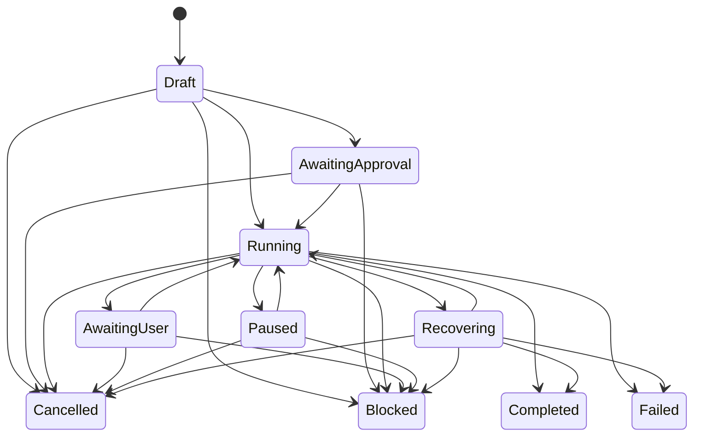

# Workflow 与 Execution Mode

> 返回 [文档索引](../README.md) | 更新时间：2026-07-01

本文记录已经实现的 durable workflow 子系统。Workflow 是一次具体、可观察、可恢复、可审批、可暂停/恢复/取消的执行编排；Execution Mode 是会话级推进策略。Goal 已作为顶层目标与证据链落地，详见 [Goal 控制平面](goal.md)；定时/重复触发由 [Loop 控制平面](loop.md) 承载。

## 1. 定位

Workflow 解决的是长任务执行面的可控性：

```text
workflow.js
  -> Script Gate / permission preview
  -> WorkflowRun durable store
  -> QuickJS host API
  -> workflow_ops replay
  -> workflow_events trace
  -> Workspace / Workflow Control Center
```

它不负责长期目标本身。长期目标由 Goal 承载，workflow run 可绑定 `goal_id` 并在终态后回写 evidence；`/loop` 只负责定时、重复触发或条件轮询，不改变 workflow 的执行语义。

## 2. 模块边界

| 层 | 代码 | 责任 |
| --- | --- | --- |
| 核心类型 | `crates/ha-core/src/workflow/types.rs` | `WorkflowRun` / `WorkflowOp` / `WorkflowEvent` / 状态枚举。 |
| 持久化 | `crates/ha-core/src/workflow/db.rs` | 三表建表、run/op/event CRUD、状态转换、replay 决策。 |
| 预检 | `crates/ha-core/src/workflow/preview.rs` | Script Gate + permission preview + create/run 可行性判定。 |
| runtime | `crates/ha-core/src/workflow/runtime.rs` | QuickJS runtime、host API、durable replay、budget、repair guard、恢复 runner。 |
| Execution Mode | `crates/ha-core/src/execution_mode.rs` | `off` / `guarded` / `deep` / `autonomous` 解析与 prompt 动态段。 |
| Tauri owner API | `src-tauri/src/commands/workflow.rs`、`execution_mode.rs` | 桌面 owner 平面命令。 |
| HTTP owner API | `crates/ha-server/src/routes/workflow.rs`、`execution_mode.rs` | Server/Web owner 平面端点。 |
| GUI | `src/components/chat/workspace/WorkspacePanel.tsx`、`useWorkflowRuns.ts` | Workflow Control Center、run 详情、审批/恢复/取消、Execution Mode 控件。 |
| 斜杠命令 | `crates/ha-core/src/slash_commands/handlers/workflow.rs` | `/workflow` 与 `/mode` 的文本控制面。 |

红线：

- Workflow 逻辑必须在 `ha-core`；Tauri 和 HTTP 只做薄适配。
- owner 平面 API 负责管理 run；模型不能直接拥有绕过 Gate 的内部入口。
- runtime 只能暴露受控 host API；脚本没有 raw fs/network/process/env 能力。
- Workflow durable run 禁止用于 incognito session。

## 3. 数据模型

Workflow 数据落在 `sessions.db`，跟随会话级联删除。

### `workflow_runs`

| 字段 | 说明 |
| --- | --- |
| `id` | `wfr_*` run id。 |
| `session_id` | 所属会话，外键到 `sessions(id)`。 |
| `kind` | run 类型，默认 `coding.workflow`。 |
| `state` | `draft` / `awaiting_approval` / `running` / `awaiting_user` / `paused` / `recovering` / `completed` / `failed` / `cancelled` / `blocked`。 |
| `execution_mode` | 创建 run 时的 Execution Mode 快照。 |
| `script_hash` | `workflow.js` 源码 BLAKE3 hash。 |
| `script_source` | 原始 `workflow.js`。 |
| `budget_json` | runtime / op / token 预算。 |
| `cursor_seq` | op 完成时递增，用于进度观察。 |
| `primary_owner` | Primary process claim owner。 |
| `blocked_reason` | `blocked` 终态原因。 |
| `parent_run_id` | 修复 run 来源，外键到 `workflow_runs(id)`，删除父 run 时置空。 |
| `origin` | run 来源，例如 `repair`。 |
| `goal_id` | 可选 Goal 归属；不显式传时自动绑定当前 session 的 open Goal。 |
| `created_at` / `updated_at` / `completed_at` | 时间戳。 |

### `workflow_ops`

| 字段 | 说明 |
| --- | --- |
| `id` | `wfo_*` op row id。 |
| `run_id` | 所属 run。 |
| `op_key` | runtime 派生的位置化 op 身份，`UNIQUE(run_id, op_key)`。 |
| `op_type` | `task.create`、`tool:exec`、`spawnAgent`、`validate` 等。 |
| `effect_class` | `pure` / `idempotent` / `non_idempotent`。 |
| `input_hash` | 稳定 JSON 输入 hash；同一 `op_key` 输入变化会 block run。 |
| `input_json` | op 输入快照。 |
| `state` | `pending` / `started` / `completed` / `failed`。 |
| `output_json` / `error_json` | op 输出或错误。 |
| `child_handle` | 子任务句柄：subagent run id、async job id、validation child handle。 |
| `started_at` / `completed_at` | 时间戳。 |

### `workflow_events`

| 字段 | 说明 |
| --- | --- |
| `id` | 自增 row id。 |
| `run_id` | 所属 run。 |
| `seq` | run 内单调序号，`UNIQUE(run_id, seq)`。 |
| `type` | `run_created`、`run_state_changed`、`op_started`、`op_completed`、`trace` 等。 |
| `payload_json` | 事件载荷，超过 64KB 会被截断成 preview。 |
| `created_at` | 时间戳。 |

## 4. 状态机

`WorkflowRunState::can_transition_to()` 是 run 状态转换单一真相源。



`completed` / `failed` / `cancelled` / `blocked` 是终态。进入终态或 `paused` 时会清空 `primary_owner`。进入 `blocked` 时写 `blocked_reason`。

## 5. Execution Mode

Execution Mode 是 session 级持久策略，入口是 `/mode` 与 Workspace/Workflow Control Center。

| Mode | 数据值 | Prompt 行为 | runtime 行为 |
| --- | --- | --- | --- |
| Off | `off` | 不注入 Execution Mode 段。 | `validate` 失败不触发 guarded repair stop guard。 |
| Guarded | `guarded` | 注入 guarded 推进策略。 | validation failure 记录 repair event，并可因重复失败/无 diff 进展 block。 |
| Deep | `deep` | 注入 deep 推进策略。 | repair guard 同 guarded；prompt 允许更深入探索与验证。 |
| Autonomous | `autonomous` | 注入 autonomous 推进策略。 | 创建/运行 autonomous run 必须有明确 runtime + output token budget，否则 block。 |

存储：

- session 当前模式：`sessions.execution_mode`。
- workflow 创建时快照：`workflow_runs.execution_mode`。

Execution Mode 不是 `/loop`。它只描述推进强度，不负责定时、重复触发或条件轮询。

## 6. Script Gate 与 Permission Preview

创建 workflow run 前，Tauri / HTTP owner API 都会调用：

```text
preview_workflow_script_for_session()
ensure_workflow_script_can_create()
```

预检输出 `WorkflowScriptPreview`：

| 字段 | 说明 |
| --- | --- |
| `gate` / `gatePassed` / `gateFeedback` | Script Gate 报告。 |
| `permission` | 静态 permission preview。 |
| `canCreate` | Gate 通过且没有确定 deny。 |
| `canRunImmediately` | 第一版与 `canCreate` 同步。 |
| `requiresApproval` | preview 中存在 ask 或 dynamic call。 |
| `hasDenials` | preview 中存在 deny。 |

执行规则：

- Gate 不通过：create 直接拒绝。
- permission preview 有 deny：create 拒绝。
- draft run 运行时若 preview 需要用户批准，run 转 `awaiting_approval`，写 `script_permission_approval_required`，必须 owner approve 后继续。
- 动态参数无法静态判定时记为 dynamic；运行时仍走真实工具权限引擎兜底。

## 7. Runtime

runtime 使用 `rquickjs`：

- 内存限制：64MB。
- 栈限制：1MB。
- 默认脚本超时：30s，上限 300s。
- `Date.now()` / `new Date()` / `Math.random()` 等非确定性入口被 runtime guard 禁用。
- 脚本必须 `export default async function main(workflow)`，并且最终调用 `workflow.finish(...)`。

执行入口：

```text
run_workflow_script_async(db, run_id)
  -> 检查 run 状态
  -> Script Gate
  -> autonomous budget gate
  -> Draft permission preview
  -> transition Running
  -> spawn_blocking QuickJS runtime
  -> workflow.finish -> Completed
```

Primary-only 启动：

- `spawn_workflow_run_if_primary()` 只在 primary process 启动 run。
- `spawn_startup_recovery_if_primary()` 启动时恢复无 owner 的 running run。
- recovery 通过 `claim_workflow_run_for_recovery(run, owner)` CAS 抢占，把 run 置为 `recovering`。

## 8. Host API

脚本只能通过 `workflow` host object 产生副作用。

| API | effect | 说明 |
| --- | --- | --- |
| `workflow.task.create({ title, label? })` | idempotent | 创建 session task，返回 task handle。 |
| `workflow.task.update({ task, status?, title?, content?, activeForm? })` | idempotent | 按 `task.create` 返回 handle 更新 task。 |
| `workflow.fileSearch({ query, root?, limit?, label? })` | pure | 调 `filesystem::search_files`，默认 root 为 session working dir。 |
| `workflow.tool({ name, args, label? })` | 取决于工具 | 走 `tools::execute_tool_with_context`，继承权限、hooks、working dir。 |
| `workflow.read(args)` | pure | `read` 工具快捷入口。 |
| `workflow.grep(args)` | pure | `grep` 工具快捷入口。 |
| `workflow.spawnAgent(args)` | non-idempotent | 走 `subagent` 工具，预分配 child run id。 |
| `workflow.waitAll(handles, options?)` | pure | 走 `subagent` 工具等待子 Agent，汇总结果。 |
| `workflow.validate({ commands, reason?, label? })` | non-idempotent | 预分配 async exec job，等待终态，返回结构化 validation 结果。 |
| `workflow.askUser(args)` | non-idempotent | 复用 `ask_user_question`；无人值守 surface 先按 unattended 策略处理。 |
| `workflow.diff({ label? })` | pure | 返回 session working dir 的 git diff snapshot。 |
| `workflow.trace({ label?, payload? })` | pure | 写入 `workflow_events(type='trace')`。 |
| `workflow.finish(result)` | pure | 设置 runtime 输出并把 run 转 `completed`。 |
| `workflow.map(label, list, fn)` | pure/materialized | 先物化 fan-out 列表，再给每个 item 建嵌套 op scope。 |

身份规则：

- 模型不提供稳定 op id。
- op identity 由 runtime 执行位置派生：`main/op#N(api)`。
- `workflow.map` 内部 op key 形如 `main/op#N(map)/item#i/op#M(api)`。
- `label` 只用于展示，不参与 replay 身份。

## 9. Durable Replay

每个 host call 都通过 `execute_op*` 包裹：

1. runtime 生成下一个 `op_key`。
2. `upsert_workflow_op_started()` 写 `started`，并校验同 op key 的 `input_hash`。
3. 若已有 `completed` op，直接返回持久化 output，标记为 replay。
4. 若已有 `failed` op，直接报错。
5. 若已有 `started` op，根据 effect class 和 child handle 决策恢复。
6. 执行 host call。
7. 成功写 `completed`，失败写 `failed`。

Started op 恢复规则：

| effect / op | 恢复动作 |
| --- | --- |
| `pure` | 可重跑。 |
| `idempotent` | 可重新检查/重跑。 |
| `non_idempotent` 且 `op_type in spawnAgent / validate / tool:*` 且有 `child_handle` | attach child handle，查询已有 child。 |
| `non_idempotent` 且无法 attach | run 转 `blocked(reason=started_non_idempotent_op:<op_key>)`。 |

这保证了崩溃/重启后不会盲目重复不可判定副作用。

## 10. Validation、Budget 与 Repair Guard

`workflow.validate`：

- `commands` 支持字符串或数组，最多 8 条。
- 每条命令通过 async exec job 执行。
- job id 预先写入 validation child handle。
- `suppress_completion_injection=true`，结果展示在 Workflow UI / Background Jobs，不再自动注入聊天区。
- 返回 `{ ok, summary, reason, results }`。

Output token budget：

- `maxOutputTokens` / `max_output_tokens` 读取自 `workflow_runs.budget_json`。
- `waitAll` 后统计 workflow-owned subagent 的 output tokens。
- 超限后写 `budget_usage` event，并在下一次 LLM op 前 block run，原因 `workflow_budget_output_tokens_exhausted`。
- `autonomous` run 还必须显式提供 runtime budget 与 output token budget，否则 `Blocked(reason=autonomous_budget_required)`。

Guarded repair stop guard：

- `execution_mode != off` 时启用。
- validation 失败写 `guarded_repair_validation_failed`。
- validation 通过写 `guarded_repair_validation_passed`。
- 若连续失败 fingerprint 相同，run 转 `blocked(reason=guarded_repair_same_validation_fingerprint)`。
- 若当前 diff hash 与上次失败时相同，run 转 `blocked(reason=guarded_repair_no_effective_diff)`。

## 11. Pause / Resume / Cancel

Pause：

- `pause_workflow_run()` 只做状态转换到 `paused`，同时清空 owner。
- `ensure_workflow_run_allows_new_op()` 会拒绝 paused run 启动新 op。

Resume：

- `resume_workflow_run()` 转回 `running`。
- Tauri / HTTP owner API 会调用 `spawn_workflow_run_if_primary()` 重新启动 runtime。

Approve：

- 只允许 `awaiting_approval -> running`。
- approve 后同样 kick runtime。

Cancel：

- `cancel_workflow_run_with_children()` 先把 run 转 `cancelled`。
- 再 best-effort 取消 workflow-owned async tool / validation / subagent child。
- 子任务取消请求写 `run_child_cancel_requested` event。

## 12. Owner API 与事件

Tauri 与 HTTP 形态保持对齐：

| Tauri command | HTTP |
| --- | --- |
| `list_workflow_runs` | `GET /api/sessions/{sessionId}/workflow-runs` |
| `preview_workflow_script` | `POST /api/sessions/{sessionId}/workflow-runs/preview` |
| `create_workflow_run` | `POST /api/sessions/{sessionId}/workflow-runs` |
| `get_workflow_run` | `GET /api/workflow-runs/{runId}` |
| `run_workflow_run` | `POST /api/workflow-runs/{runId}/run` |
| `pause_workflow_run` | `POST /api/workflow-runs/{runId}/pause` |
| `resume_workflow_run` | `POST /api/workflow-runs/{runId}/resume` |
| `approve_workflow_run` | `POST /api/workflow-runs/{runId}/approve` |
| `cancel_workflow_run` | `POST /api/workflow-runs/{runId}/cancel` |
| `get_execution_mode` | `GET /api/sessions/{sessionId}/execution-mode` |
| `set_execution_mode` | `POST /api/sessions/{sessionId}/execution-mode` |

EventBus：

| 事件 | 来源 |
| --- | --- |
| `workflow:created` | run 创建。 |
| `workflow:updated` | run 状态或 owner 变化。 |
| `workflow:op_updated` | op started/completed/failed。 |
| `workflow:event` | workflow event append。 |

前端 `useWorkflowRuns` 同时监听这些事件，并在 active run 存在时低频 polling 兜底。

Goal 集成：

- `create_workflow_run` 可接收 `goalId`；省略时自动绑定当前 open Goal。
- 创建 run 前检查绑定 Goal 的 token/time/turn budget；已耗尽则拒绝新 run。
- 创建 run 时写 `goal_links(relation='execution_run' | 'repair_run')`。
- run 进入 `completed` / `failed` / `blocked` 后 best-effort 触发 Goal final audit。
- run 进入任一终态都会写 workflow terminal relation，供 Goal 证据链展示。
- `workflow.validate` op 写 `validation_passed` / `validation_failed` evidence；`workflow.diff` op 写 `diff_snapshot` 和 `file_changed` evidence。

## 13. GUI

Workspace / Workflow Control Center 是主要用户面，不要求用户记 slash command。

当前实现：

- 标题栏 `Coding` 入口与 active / waiting / failed badge。
- Goal strip：创建 active Goal、展示目标摘要/状态/证据指标、手动 audit、暂停/恢复/清除。
- Execution Mode 常驻控制。
- 无 run 空态展示 execution mode / working dir，并提供创建入口。
- coding 目标驱动草稿：生成可预检 `workflow.js`，脚本编辑放高级区。
- 创建前展示 Script Gate 与 permission preview。
- run list、历史展开、总览、当前焦点、下一步跳转。
- Trace / Validation / Agents 三视图。
- blocked / failed 恢复建议、复制修复提示、生成 repair draft。
- draft / approve / pause / resume / cancel 操作；cancel 前确认。
- 窄屏内部面板走 overlay，不被桌面 split-pane 挤出视口。

## 14. Slash Commands

`/workflow` 是高级文本控制面：

```text
/workflow
/workflow status
/workflow trace [run_id]
/workflow approve [run_id]
/workflow pause [run_id]
/workflow resume [run_id]
/workflow cancel [run_id]
```

`run_id` 可省略；省略时 handler 会按状态选择当前 active run 或最近 run。短 id prefix 在唯一时可用。

`/mode` 控制 session execution mode：

```text
/mode
/mode status
/mode off
/mode guarded
/mode deep
/mode autonomous
```

`/mode` 写 `sessions.execution_mode`，影响后续 system prompt 与新建 workflow run 的默认策略。

## 15. 非目标

当前已实现 workflow 不包含：

- `/loop` 的定时/重复/轮询调度，详见 [Loop 控制平面](loop.md)。
- Managed worktree。
- LSP diagnostics。
- 独立 review engine。
- Workflow marketplace 或外部 npm workflow ecosystem。

这些仍在 `docs/roadmap/` 规划中，不能在 architecture 中描述为已实现事实。
