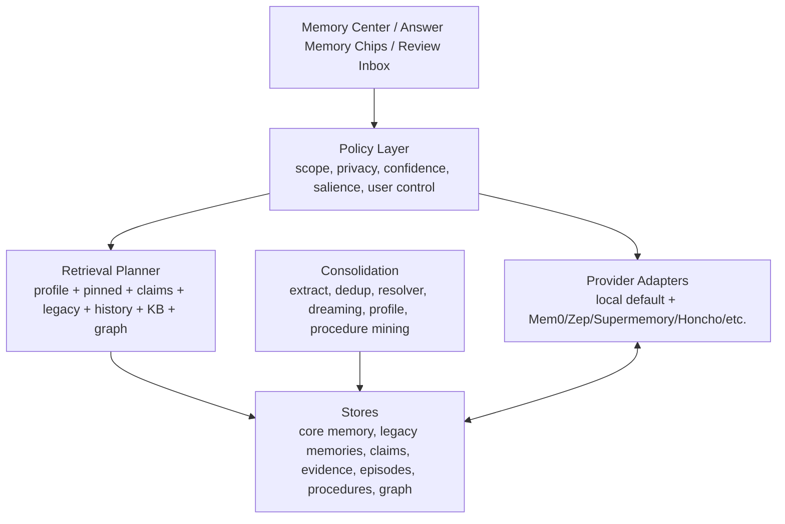

# 下一代记忆系统调研分析与升级计划

更新时间：2026-07-10

> 阅读说明：第 3-13 节保留立项时的现状、竞品差距和决策依据，便于追溯“为什么做”；第 14 节是逐步实施账本，第 15 节是 2026-07-10 的最终现状。立项时写出的“尚未实现”不代表最终仍是缺口。

## 1. 背景与目标

Hope Agent 已经拥有一套比较完整的本地记忆系统：SQLite + FTS5 + sqlite-vec 的混合检索、Global / Agent / Project 三级作用域、自动提取、Active Memory、Dreaming、结构化 claim、evidence、Lucid Review、incognito fail-closed 和确定性评测。底座不是短板，短板主要在产品化组合：普通用户还不能自然感到“它真的懂我、而且我能控制它”，高级用户也还缺少一套统一、可诊断、可调参的记忆控制台。

本计划的目标不是重写现有系统，而是在现有契约上演进成下一代记忆体验：

- 普通用户默认好用：少配置、少术语、少打断，但能稳定记住偏好、项目事实和长期上下文。
- 高级用户高度可调：能调整召回、提取、scope、审核、provider、预算、隐私与性能策略。
- 高可用、稳定：本地优先、可备份、可恢复、可诊断、失败可降级。
- 可解释、可纠错：每次记忆被使用都有来源；用户能一键改、忘、降权、迁移作用域。
- 未来可扩展：保留本地 claim / evidence 作为默认真相源，同时允许接入 Mem0、Zep、Supermemory、Honcho、Hindsight 等外部 provider。

## 2. 调研范围与资料来源

### 2.1 本项目内部资料

- 记忆系统架构：[docs/architecture/memory.md](../architecture/memory.md)
- Dreaming / claim / evidence / Lucid Review：[docs/architecture/dreaming.md](../architecture/dreaming.md)
- 行为感知：[docs/architecture/behavior-awareness.md](../architecture/behavior-awareness.md)
- 自动提取实现：[crates/ha-core/src/memory_extract.rs](../../crates/ha-core/src/memory_extract.rs)
- Active Memory 实现：[crates/ha-core/src/agent/active_memory.rs](../../crates/ha-core/src/agent/active_memory.rs)
- 记忆工具实现：[crates/ha-core/src/tools/memory.rs](../../crates/ha-core/src/tools/memory.rs)
- 记忆配置类型：[crates/ha-core/src/memory/types.rs](../../crates/ha-core/src/memory/types.rs)、[crates/ha-core/src/agent_config.rs](../../crates/ha-core/src/agent_config.rs)
- 前端记忆面板：[src/components/settings/memory-panel/](../../src/components/settings/memory-panel/)

### 2.2 外部系统资料

| 系统                | 资料                                                                                                                                                                                                                                                                               | 重点                                                                                          |
| ------------------- | ---------------------------------------------------------------------------------------------------------------------------------------------------------------------------------------------------------------------------------------------------------------------------------- | --------------------------------------------------------------------------------------------- |
| OpenClaw            | [Memory overview](https://docs.openclaw.ai/concepts/memory)、[Active memory](https://docs.openclaw.ai/concepts/active-memory)、[CLI memory](https://docs.openclaw.ai/cli/memory)                                                                                                   | Markdown core memory、Active Memory blocking sub-agent、Dreaming、reviewable diary、plugin 化 |
| Hermes Agent        | [Persistent Memory](https://hermes-agent.nousresearch.com/docs/user-guide/features/memory)、[Memory Providers](https://github.com/NousResearch/hermes-agent/blob/main/website/docs/user-guide/features/memory-providers.md)                                                        | 极简 curated memory、`MEMORY.md` / `USER.md`、外部 provider 插槽                              |
| Mem0                | [How Mem0 Works](https://docs.mem0.ai/core-concepts/how-it-works)、[Memory Types](https://docs.mem0.ai/core-concepts/memory-types)、[Memory Evaluation](https://docs.mem0.ai/core-concepts/memory-evaluation)、[Graph Memory](https://docs.mem0.ai/platform/features/graph-memory) | 托管 / OSS 记忆层、ADD-only extraction、entity linking、graph memory、评测                    |
| Zep / Graphiti      | [Graphiti GitHub](https://github.com/getzep/graphiti)、[Graphiti product page](https://www.getzep.com/platform/graphiti/)、[Zep paper](https://arxiv.org/html/2501.13956v1)                                                                                                        | temporal context graph、validity window、provenance、hybrid retrieval + graph traversal       |
| Letta / MemGPT      | [Stateful Agents](https://docs.letta.com/guides/core-concepts/stateful-agents/)、[Archival Memory](https://docs.letta.com/guides/core-concepts/memory/archival-memory/)                                                                                                            | core memory + archival memory、stateful agent、tool-driven memory                             |
| LangGraph / LangMem | [Memory concepts](https://docs.langchain.com/oss/python/concepts/memory)、[Memory for agents](https://www.langchain.com/blog/memory-for-agents)                                                                                                                                    | semantic / episodic / procedural memory 分类                                                  |
| Supermemory         | [Overview](https://supermemory.ai/docs/intro)、[How it works](https://supermemory.ai/docs/concepts/how-it-works)                                                                                                                                                                   | context stack API、knowledge graph、connectors、profile / RAG / memory 一体化                 |
| ChatGPT Memory      | [OpenAI Memory FAQ](https://help.openai.com/articles/8590148-memory-faq)、[Reference saved memories](https://help.openai.com/en/articles/11146739-how-does-reference-saved-memories-work)                                                                                          | 面向普通用户的 saved memories / reference chat history / temporary chat 心智                  |

## 3. Hope Agent 当前记忆系统分析

### 3.1 当前能力总览

| 层级                | 当前状态                                                                                                   | 价值                                 | 主要源文件 / 文档                                            |
| ------------------- | ---------------------------------------------------------------------------------------------------------- | ------------------------------------ | ------------------------------------------------------------ |
| Core Memory         | Global / Agent `memory.md`，始终优先注入                                                                   | 适合用户明确写入的长期规则和身份偏好 | `tools/memory.rs`、`CoreMemoryEditor`                        |
| Legacy Memory Store | `memories` 表，类型为 user / feedback / project / reference，支持 pinned、tag、attachment                  | 简单可靠的长期记忆列表               | `memory/types.rs`、`memory/sqlite/*`                         |
| 混合检索            | FTS5 + sqlite-vec + RRF，MMR 默认开，temporal decay 可选                                                   | 兼顾关键词、语义和多样性             | `memory/sqlite/trait_impl.rs`、`memory/mmr.rs`               |
| 自动提取            | 阈值触发、idle 兜底、compact 前 flush；一次 side_query 可输出 facts / profile / claims                     | 用户无需手动说“记住”                 | `memory_extract.rs`                                          |
| Active Memory       | 每轮前置召回，side_query 从候选里选最多一条；默认关；claim 候选可选                                        | 让相关记忆在回答前自然浮出           | `agent/active_memory.rs`                                     |
| Dreaming Light      | idle / cron / manual 扫近期记忆，提名并 pin 高价值项，写 diary                                             | 聊天热路径外做整理                   | `memory/dreaming/pipeline.rs`                                |
| 结构化 Claim        | `memory_claims` + `memory_evidence` + `memory_claim_links`，SPO、confidence、salience、status、valid_until | 从平铺文本升级到可治理事实           | `memory/claims/*`                                            |
| Context Pack        | 高 salience active claims 静态注入为 `## Pinned Memory`，profile snapshot 注入                             | 更稳定、更省 token 的长期上下文      | `memory/dreaming/context_pack.rs`、`memory/sqlite/prompt.rs` |
| Lucid Review        | 用户可 approve / edit / reject / expire / move scope / pin / forget claim                                  | 用户拥有最终纠错权                   | `memory/claims/review.rs`                                    |
| 隐私安全            | incognito 短路自动提取、注入、Active Memory；手动写入工具也拒绝；prompt 注入清洗                           | 防止无痕泄漏和 prompt injection      | `tools/memory.rs`、`memory/sqlite/prompt.rs`                 |
| UI                  | Settings Memory tabs、Dreaming、Profile、Claims beta、Agent Memory tab、Chat memory toast                  | 能管理，但入口较分散                 | `src/components/settings/memory-panel/`                      |

### 3.2 现有优势

1. **工程底座强**
   多数 Agent 的内置记忆仍停留在 Markdown 文件、简单 vector store 或外部 provider 插槽。Hope Agent 已经有本地数据库、向量检索、scope、claim、evidence、审计和评测。

2. **隐私与作用域治理强**
   Project / Agent / Global 隔离是 Agent 产品里很重要的边界；incognito fail-closed 设计也比“只是不自动提取”更安全。

3. **可审计性强**
   Claim + evidence + decision log 的设计让用户纠错、冲突处理、来源追溯有落点。这是和 OpenClaw / Hermes built-in memory 相比最明显的强项。

4. **本地优先，适合桌面产品**
   本地 SQLite + 可选本地 embedding 符合桌面助手的隐私和离线预期。外部系统如 Mem0 / Zep / Supermemory 更适合基础设施产品，默认依赖托管服务。

5. **已经具备下一代基础结构**
   Claim 层、Profile Snapshot、Deep Resolver、Lucid Review、Active Memory v2 都已经有设计和部分实现，升级更多是“产品化组合 + 深化图谱/评测”，不是从零开始。

### 3.3 当前痛点与风险

1. **用户心智碎片化**
   普通用户会看到“记忆列表、Core Memory、Profile、Claims beta、Dreaming、Active Memory、Embedding、Budget”等多个概念。它们各自正确，但没有被包装成一个统一体验。

2. **默认智能保守**
   `memoryExtract.extractClaims` 默认开启，但 Active Memory 默认关闭，`includeClaims` 也默认关闭。结果是系统会积累结构化记忆，但不一定在回答前主动用上。

3. **“本次回答用了什么记忆”不可见**
   现在有 toast 告诉用户提取了记忆，也有 Dashboard / Settings 可以看 claim，但答案侧缺一个轻量证据层。用户很难知道模型是不是因为某条记忆才这么回答，也很难就地纠错。

4. **Deep Resolver 尚未成为自动治理闭环**
   Deep resolver 当前偏手动触发；自动周期主要跑 Light + Profile。冲突、过期、重复治理还没有持续自维护的默认体验。

5. **中文关键词检索可继续加强**
   当前 FTS tokenizer 是 `unicode61`。中文用户实际会依赖向量兜底，但关键词、标识符、短词、多语言混合检索可能不如带 trigram / CJK 分词的方案稳定。

6. **scope 默认行为存在心智不一致**
   自动提取无项目时默认写 Agent scope；`save_memory` 工具在非项目会话默认写 Global scope。代码注释说是 pre-project 行为，但对用户来说“自动记住”和“手动保存”作用域不一致，容易产生隐性困惑。

7. **无痕边界需要持续防回归**
   当前架构文档与实现已对齐：无痕会话不注入记忆、不自动提取，`save_memory` / `update_core_memory` 等写入路径 fail-closed，`recall_memory` / `memory_get` 读取工具也由执行层归零。后续改动重点是保持这一红线，并用测试覆盖新入口。

8. **缺少 episodic / procedural memory**
   当前系统主要是 semantic memory：事实、偏好、项目上下文。对“上次怎么解决这个问题”“这个用户通常怎么推进 PR”“这个项目 release 流程的习惯动作”等经验型记忆支持不足。

9. **外部生态接入缺位**
   Hermes 的 provider 模式说明用户会希望把 Honcho / Mem0 / Hindsight / Supermemory 这类专业记忆服务挂上来。Hope Agent 当前有强本地记忆，但缺 provider adapter 层。

## 4. 外部系统对比

### 4.1 OpenClaw

OpenClaw 的记忆系统更强调文件可见性和插件化。公开文档显示它的 Dreaming 是可选后台 consolidation，会根据 score、recall-frequency、query-diversity 等门槛将合格项目提升到长期 `MEMORY.md`，并写 `DREAMS.md` 方便用户审阅。Active Memory 是一个回复前运行的 blocking recall sub-agent，用来避免主 Agent 忘记主动查记忆。

**值得借鉴**

- Active Memory 的“只在用户可感知的 persistent chat 里运行”的 eligibility gate。
- prompt style / query mode / toolsAllow 等可调策略，适合高级用户调召回积极度。
- Dreaming diary 面向人类审阅，用户能看到后台整理了什么。
- 文件 / Markdown 作为核心记忆入口，解释性强。
- CJK / lexical search 能力值得对中文体验做专项对齐。

**Hope Agent 已领先**

- Claim + evidence + decision log 比 `MEMORY.md` promotion 更可审计。
- Project scope 隔离和 incognito fail-closed 更系统。
- 不需要把长期事实都提升到一个 Markdown 文件；可保留结构化生命周期。

### 4.2 Hermes Agent

Hermes 内置记忆非常克制：`MEMORY.md` 和 `USER.md` 两个 bounded 文件组成 curated memory，分别用于 Agent 学到的事实和用户画像，且字符限制很小。外部 memory provider 是加法层，内置记忆始终保留；provider 会在每轮前预取相关记忆、回复后同步 conversation、会话结束提取、镜像 built-in writes，并提供 provider-specific tools。

**值得借鉴**

- 普通用户心智极清楚：一个 Agent 笔记、一个用户画像。
- 文件硬预算强迫记忆保持短、准、可读。
- `hermes memory setup/status/off` 这种运维面非常简单。
- 外部 provider 是 additive，而不是替换 built-in memory。
- provider failure 不应拖垮 built-in memory。

**Hope Agent 已领先**

- 检索、scope、claim、review、Dreaming 都比 Hermes built-in 更强。
- Hermes 的 provider 模式可以作为生态启发，但 Hope 不应牺牲本地真相源。

### 4.3 Mem0

Mem0 把记忆做成独立基础设施，强调 add / search / update / delete API、用户 / session / organization 分层、ADD-only extraction、hybrid search、entity linking、graph memory 和评测。其核心价值是“应用不需要自己维护记忆管线”。

**值得借鉴**

- Memory Types 分层清晰：conversation / session / user / organization。
- ADD-only extraction 降低自动覆盖旧事实的风险。
- Entity linking 和 graph memory 解决跨记忆关联。
- Memory Evaluation 明确区分 extraction 和 retrieval，并以有限 token 预算评测。
- API surface 友好，便于第三方集成。

**Hope Agent 已领先或不同**

- Hope 有本地-first、桌面隐私和 owner 平面；Mem0 更偏服务化 API。
- Hope 的 evidence / Lucid Review 可做得比通用 API 更贴近终端用户。

### 4.4 Zep / Graphiti

Zep / Graphiti 的核心是 temporal context graph：实体、关系、事实都有时间窗口和 provenance，新事实可以让旧事实失效，检索时结合 vector、full-text、graph traversal。Zep 论文还强调 episode subgraph、semantic entity subgraph、community subgraph 三层。

**值得借鉴**

- temporal validity 是长期记忆准确性的关键，不只是“最近优先”。
- graph traversal 能回答跨事实、多跳、实体中心的问题。
- provenance 和 episode anchoring 让事实可追溯。
- graph 可增量更新，不需要每次全图重算。

**Hope Agent 已具备的基础**

- Claim 已有 SPO、valid_until、evidence、status、supersedes。
- 下一步可在 claim 层之上补实体、关系、episode 和图遍历，而不是推倒重来。

### 4.5 Letta / LangGraph / LangMem

Letta 区分 core memory 和 archival memory：重要 core memory 直接进上下文，archival memory 需要按需查询。LangGraph / LangMem 把 AI Agent memory 分为 semantic、episodic、procedural，这个分类对产品规划很有用。

**值得借鉴**

- semantic memory：事实和偏好。
- episodic memory：过去事件 / 行动序列，用于动态 few-shot。
- procedural memory：规则、流程、技能、用户或项目惯例。
- core vs archival 的心智清楚：什么常驻，什么按需查。

**Hope Agent 的缺口**

- 已有 semantic memory，episodic / procedural 还不成体系。
- 当前 `memory.md` 像 core，SQLite / claim 像 archival，但 UI 没有这样解释。

### 4.6 Supermemory / ChatGPT Memory

Supermemory 是一体化 context stack：memory、RAG、user profiles、connectors、file processing。ChatGPT Memory 的启发更多在普通用户体验：saved memories、reference chat history、temporary chat、manage memories。

**值得借鉴**

- 对普通用户，记忆入口应该少而清晰：开关、管理、临时会话、忘记。
- 记忆不是单独功能，而是 personalization / continuity 的基础体验。
- connector / file processing / profile / memory / RAG 最终会被用户视为一个“它知道什么”的系统。

**Hope Agent 的机会**

- Hope 同时有 Knowledge Base、Memory、Awareness、Recap，可以做成统一的“上下文与记忆中心”。
- 本地桌面可以提供比闭源产品更强的导出、审计、离线和迁移能力。

## 5. 功能矩阵对比

| 能力           | Hope Agent 当前              | OpenClaw                               | Hermes built-in           | Mem0                      | Zep / Graphiti                | Supermemory         |
| -------------- | ---------------------------- | -------------------------------------- | ------------------------- | ------------------------- | ----------------------------- | ------------------- |
| 本地长期记忆   | 强，SQLite + Markdown        | 强，Markdown + backend                 | 中，两个 bounded files    | OSS 可本地，平台托管      | Graphiti OSS，本体偏服务 / 图 | 平台为主            |
| 自动提取       | 有，facts / profile / claims | 有，Dreaming / import / promotion      | 有，偏 curated / provider | 强，pipeline 化           | 强，图谱抽取                  | 强                  |
| 回复前主动召回 | 有，但默认关                 | 有，Active Memory 插件                 | provider 预取             | 应用自行 search           | 低延迟 context assembly       | memory router / API |
| 结构化事实     | 强，claim SPO                | 部分，memory-wiki 有 structured claims | 弱                        | 中，entity / memory       | 强，temporal graph            | 强，knowledge graph |
| 证据追溯       | 强，evidence 表              | diary / wiki 可审                      | 文件可读但弱              | 部分                      | 强，provenance                | 强                  |
| 冲突 / 过期    | 有 resolver，偏手动          | promotion gate                         | 手工 curated              | update / temporal scoring | 强，validity window           | graph 演化          |
| 用户纠错       | 强，Lucid Review             | reviewable diary                       | 直接编辑文件              | update / delete API       | 依赖产品层                    | 产品 / API          |
| 普通用户简单性 | 中，入口多                   | 中，配置偏工程                         | 强                        | 中，面向开发者            | 中，偏基础设施                | 强，API / app       |
| 高级可调       | 强但分散                     | 强，插件配置多                         | 中，provider 选项         | 强                        | 强                            | 强                  |
| 中文检索       | 可用，需加强 CJK lexical     | 文档强调 CJK 支持                      | 取决 provider             | 取决配置                  | 取决配置                      | 取决平台            |
| 外部 provider  | 暂缺统一 adapter             | 插件 slot                              | 强，8 provider            | 自身 provider             | 自身 provider                 | 自身 provider       |
| 评测           | 有 deterministic fixtures    | 不详                                   | 不详                      | 强调 memory eval          | 有论文 benchmark              | 强调 benchmark      |

## 6. 下一代设计原则

### 6.1 产品原则

1. **默认少术语**
   普通用户不应被要求理解 claim、RRF、MMR、embedding signature、Dreaming phase。默认界面只展示“记住什么、为什么记、能不能用、怎么改”。

2. **用户拥有最终事实权**
   自动提取只能建议或低风险生效；用户确认永远最高权重。用户的 edit / reject / forget 必须立即影响下一轮召回。

3. **记忆使用要可解释**
   任何被用于回答的显著记忆都应该能在 UI 中显示来源和状态；至少支持“本次使用的记忆 chips”。

4. **热路径不被记忆拖垮**
   Active Memory 应从 blocking 走向“有预算则增强、超时则跳过”的非阻塞 / 预取策略。主回复不能因为记忆服务异常挂死。

5. **本地真相源优先**
   外部 provider 可以增强召回和同步，但本地 claim / evidence / core memory 应保留为默认真相源，避免服务迁移或离线时失忆。

6. **从平铺事实走向多类型记忆**
   semantic、episodic、procedural 三类要明确建模，分别服务“知道什么”“过去怎么做”“以后怎么做”。

### 6.2 技术原则

1. **不破坏现有数据**
   legacy `memories`、core memory、claim 层继续可用；新结构以增量表和投影方式加入。

2. **读路径统一**
   召回、prompt 注入、工具搜索、UI 诊断应共享同一套 access / scope / effective-status / freshness 逻辑，避免多套规则漂移。

3. **写路径可审计**
   所有自动 consolidation、用户纠错、外部 provider 同步都落 decision / event，能解释“谁在什么时候改了什么”。

4. **失败可降级**
   embedding 不可用 → FTS；Active Memory 超时 → passive memory；external provider 不可用 → local memory；graph 不可用 → claim search。

5. **评测先行**
   新召回策略、图谱、episode、procedure 都要有 deterministic fixture + 人工 golden set，避免“感觉更聪明但其实乱记”。

## 7. 目标架构：Memory OS

下一代可以把记忆系统抽象成 “Memory OS”，由六层组成：



### 7.1 Store 层

- **Core Memory**：用户明确维护的常驻规则 / 身份 / 高优先级偏好。
- **Semantic Claims**：现有 `memory_claims`，继续作为事实主表。
- **Evidence**：现有 `memory_evidence`，继续负责来源和可信度。
- **Legacy Memories**：继续兼容现有 memory 列表和导入。
- **Episodes**：新增，记录“场景 → 动作 → 结果 → 经验”的可检索案例。
- **Procedures**：新增，记录用户 / 项目 / Agent 的工作流规则、偏好流程、常用命令、失败规避。
- **Graph Projection**：新增，基于 claim / evidence / episode 生成实体和关系投影。

### 7.2 Policy 层

统一处理：

- scope：Session / Project / Agent / Global / Organization / External Provider。
- privacy：incognito、temporary chat、IM opt-in、external sync opt-in。
- confidence：manual_correction > user_confirmed > explicit_user_statement > project_artifact_fact > assistant_inferred > behavioral_pattern。
- salience：是否进入 Pinned Memory、是否进入 Active Memory、是否进 review。
- freshness：valid_until、superseded、last_seen、last_used、temporal decay。
- user control：approve、reject、edit、forget、pin、move scope、export。

### 7.3 Retrieval Planner

替代“各处自己查记忆”的分散逻辑，提供一个统一 API：

```text
plan_memory_context(session, user_message, budget, mode) -> MemoryContextBundle
```

输出：

- `always_on`：Core Memory、high-salience pinned claims、profile snapshot。
- `active`：与当前消息相关的 claims / memories / episodes / procedures。
- `diagnostics`：候选数、命中源、被过滤原因、latency、token 预算。
- `used_memory_refs`：给前端渲染 chips 和证据面板。

当前落地分两步推进：第一步 `used_memory_refs` 记录实际进入或被考虑的来源；第二步 `retrieval_planner` 诊断 trace 记录各 retrieval layer 的 `used / empty / skipped / disabled` 状态、引用数、候选数、latency、cache 和跳过原因。它先作为只读观测层，不改变 prompt 构造和排序，避免一次性重排导致现有能力退化。

### 7.4 UI 层

面向普通用户：

- “记忆：开 / 关 / 需我确认 / 临时对话”
- “它知道我的什么”
- “最近学到”
- “待确认”
- “本次回答用了什么”
- “忘记这个 / 改成这样 / 只在这个项目使用”

面向高级用户：

- 检索策略、embedding、MMR、RRF、time decay、Active Memory、Dreaming、provider、导入导出、备份恢复、评测报告、日志诊断。

## 8. 升级路线图

### P0：记忆中心与心智统一

**目标**
把分散的 Memory / Claims / Dreaming / Profile / Active Memory 入口整合成一个“记忆中心”，普通用户用自然概念管理记忆，高级配置折叠在 Expert 区。

**用户价值**

- 用户第一次打开就知道：AI 记住了什么、为什么、能不能改。
- 降低 “Claims beta 是什么 / Dreaming 是什么 / Profile 和 Memory 有什么区别” 的认知负担。

**实现要点**

- 新增 Memory Center 页面或重构 Settings → Memory：
  - Overview：记忆总数、active claims、pending review、last dreaming、embedding health、最近提取。
  - Knows About Me：聚合 Global / Agent user_profile + preference claims。
  - Project Memory：按 project 查看 project facts。
  - Review Inbox：待确认 / 冲突 / 低置信 / 新发现。
  - Advanced：Embedding、Budget、Hybrid Search、Dreaming、Active Memory、Import/Export。
- Claims 不再以 “beta” 作为用户主入口，而是作为“结构化记忆详情”。
- Profile Snapshot 不单独暴露为一页，合入 “用户画像”。
- Dreaming diary 合入“后台整理记录”。

**验收标准**

- 普通用户在一个页面完成：查看、搜索、编辑、删除、确认、忽略、移动 scope。
- Claim / legacy memory / profile snapshot 至少能统一搜索和统一展示来源。
- 现有高级功能仍可找到，但默认折叠。

**风险**

- UI 信息量大，容易变成另一个复杂面板。需要先做信息架构，再迁移组件。

### P1：默认可感知的智能召回

**目标**
让相关记忆在回答前自然浮出，同时不明显拖慢主回复。

**用户价值**

- 用户不必说“你还记得吗”，Agent 也能在合适场景主动用上长期上下文。
- 回答侧能看到“用了哪些记忆”，建立信任。

**实现要点**

- 将 Active Memory 从 per-agent 高级 opt-in 逐步升级为默认智能策略：
  - 默认只启用低延迟 shortlist + high-confidence claims。
  - side_query 超时直接跳过，不阻塞主回复。
  - 对持续会话可在用户输入停顿时预取。
  - `includeClaims` 对高置信 active claims 默认打开。
- 新增 Answer Memory Chips：
  - 展示本次注入或显著使用的 memory / claim ref。
  - 点击可看 content、scope、confidence、evidence、last updated。
  - 支持“错了”“别再用”“只在本项目用”“改成...”。
- Retrieval Planner 记录 `used_memory_refs`，供前端展示。

**验收标准**

- Active Memory 超时不影响主回答首 token。
- 本次注入的记忆能在 UI 中追溯到 claim / memory / evidence。
- 用户纠错后下一轮不再使用被 reject / archived 的 claim。

**风险**

- 默认开启可能造成隐私惊讶。需要结合 Temporary / Incognito / IM opt-in，且首次启用有清楚提示。

### P2：Memory Inbox 与信任分级

**目标**
把自动提取从“后台悄悄记住”升级为“低风险自动生效 + 高风险待确认”的治理模型。

**用户价值**

- 用户不用审核每条普通事实，但对敏感、推断、冲突、跨 scope 的内容有控制权。

**实现要点**

- 新增 Review Inbox 规则：
  - `explicit_user_statement` + 高 salience + 非敏感：可自动 active。
  - `assistant_inferred` / `behavioral_pattern`：默认进入 pending review 或低权重 active。
  - 冲突 claim：进入 needs_review。
  - 可能敏感字段：默认 pending review。
  - 跨 scope 迁移：必须用户确认。
- 支持记忆模式：
  - `automatic`：低风险自动记。
  - `review_first`：新 claim 默认进 inbox。
  - `manual_only`：只接受显式 `save_memory` / 用户按钮。
  - `off`：不写长期记忆。
- 为 claim 增加 review reason / risk flags 投影，方便 UI 分组。

**验收标准**

- 用户能在 Inbox 批量 approve / reject / edit。
- 自动提取的每条待审 claim 有明确原因：低置信、推断、冲突、敏感、scope 不确定等。
- Memory Center 显示“过去 7 天学到 / 待确认 / 已拒绝”。

**风险**

- 过多待审会造成疲劳。需要默认只展示高影响项，低价值项可自动丢弃或折叠。

### P3：检索质量升级

**目标**
让中文、短词、标识符、项目术语和多跳问题召回更稳。

**用户价值**

- “之前那个 bug / 上次 CI / 某个变量名 / 中文偏好”能更准召回。

**实现要点**

- FTS 升级：
  - 评估 `trigram` tokenizer 或独立 CJK shadow index。
  - 对英文 / code identifier / 中文分别做 query rewrite。
  - 保留 `unicode61` 兼容，增量 rebuild。
- 多源融合：
  - legacy memory、claim、profile、episode、procedure、history、knowledge notes 分源检索，不直接混排。
  - 先源内排序，再由 Retrieval Planner 按任务意图融合。
- 召回解释：
  - 返回命中来源、score 组件、scope、过滤原因。
  - 增加 “Why this memory?” 调试面板。
- Recall Summary 默认策略：
  - 多条高相关命中时生成短摘要，但仍保留原始 refs 给 UI。

**验收标准**

- 中文短 query fixture 召回稳定。
- code identifier / snake_case 前缀 query fixture 召回稳定，短标识符不会只依赖向量兜底。
- 检索诊断能解释一条记忆为什么入选或为什么被过滤。

**风险**

- tokenizer / index 迁移可能影响旧数据。必须有 reindex job、回滚开关和 fixture。

### P4：Temporal Graph Projection

**目标**
在现有 claim 层之上建立实体和关系投影，支持时间变化、冲突治理和多跳召回。

**用户价值**

- Agent 不只记一堆句子，而是知道“谁 / 什么项目 / 哪个偏好 / 什么时候变了 / 当前哪个是真的”。

**建议数据模型**

```text
memory_entities
- id
- scope_type / scope_id
- canonical_name
- entity_type: user | project | repo | tool | person | org | concept | file | url | custom
- aliases_json
- summary
- created_at / updated_at

memory_relationships
- id
- scope_type / scope_id
- subject_entity_id
- predicate
- object_entity_id or object_literal
- source_claim_id
- confidence
- status
- valid_from / valid_until
- created_at / updated_at

memory_episodes
- id
- scope_type / scope_id
- title
- situation
- actions_json
- outcome
- lesson
- source_session_id
- source_message_ids_json
- success_score
- tags_json
- created_at / updated_at

memory_procedures
- id
- scope_type / scope_id
- title
- trigger
- steps_markdown
- constraints_markdown
- confidence
- status
- source_episode_ids_json
- created_at / updated_at
```

**实现要点**

- 当前 v0：先做 read-only projection，不建新表、不改变 claim 主表语义、不参与 prompt 注入；从同一 scope 内 active / needs_review claims 临时投影 entity node 和 relationship edge，服务 owner 审计与详情解释。
- Phase 1：从 active claims 规则式抽 entity 和 relationship。
- Phase 2：LLM 辅助 entity canonicalization / alias merge，结果进 review。
- Phase 3：Graph retrieval 加入 Retrieval Planner。
- Phase 4：Deep Resolver 使用 graph 判断 supersede / conflict。

**验收标准**

- 同一实体的多条 claim 能被聚合展示。
- 新偏好能 supersede 旧偏好，旧事实保留历史但不进入当前 prompt。
- 能回答“关于这个项目我之前决定过什么”这类实体中心问题。

**风险**

- 图谱容易过度复杂。必须先做 projection，不改变 claim 主表语义。

### P5：Episodic / Procedural Memory

**目标**
让 Agent 记住“过去怎么解决问题”和“以后应该按什么流程做”，而不只是事实。

**用户价值**

- 编程、发布、调试、写作等重复任务会越来越顺手。
- Agent 能避免重复犯错，复用成功路径。

**实现要点**

- 当前 v0：新增 owner-only Episode / Procedure 基座，先支持手动记录、列表、归档和从 episode 提升 procedure；不自动抽取、不注入 prompt、不暴露 agent 工具，先把数据契约和普通用户入口稳住。
- 当前 v0 已纳入高可用面：backup / preview / structured restore 会携带 episodes / procedures；Memory Health 会统计经验资产总量，并发现 procedure 指向已缺失 episode 的断链。
- 当前 v0.1：Retrieval Planner trace 已能按 Project > Agent > Global scope 优先级检索相关 Episode / Procedure 候选，并通过 `used_memory_refs` 暴露给回答侧记忆 chips。候选排序已从“整句 SQL LIKE + 最近更新”升级为 bounded active pool 内的确定性词面相关性 + success / confidence 质量分，降低自然语言长句 query 漏召回风险。
- 当前 v0.2：Procedure Memory soft guidance 第一版已接入 prompt 动态块；只注入用户保存 / 提升过、active、高于 per-agent `minConfidence` 的 Procedure，默认最多 1 条 / 800 字符，并声明为软指导而非硬规则。Episode 仍只做 trace，不自动注入。
- Episode extraction：
  - 在任务完成、PR 合并、测试跑通、用户明确评价后提取。
  - 记录 situation / actions / outcome / lesson。
  - 失败案例也要记录，用于 premortem 和风险提示。
- Procedure mining：
  - 从多个成功 episodes 中总结流程。
  - 用户确认后成为 project / agent procedural memory。
  - 与 skills / project instructions / hooks 区分：procedure 是软记忆，不是强制执行脚本。
- Dynamic few-shot：
  - Retrieval Planner 在相似任务前注入最相关 episode 的短版。

**验收标准**

- 对重复项目任务，能召回过去成功案例。
- 用户可把 episode 提升为 procedure，或把 procedure 降级 / 删除。
- procedure 注入有明确 scope 和来源。

**风险**

- 错误 workflow 被固化会放大问题。必须默认进入 review 或低权重。

### P6：高可用、备份、生态 provider

**目标**
把记忆系统从“本地功能”升级成“可长期信赖的数据资产”。

**用户价值**

- 换机器、升级模型、重建索引、外部服务失败，都不会让用户失忆。

**实现要点**

- Memory Health：
  - embedding model mismatch、needs reembed、FTS corruption、claim vec missing、orphan evidence、stale locks。
  - 一键 repair / reindex / backup。
- Backup / Restore：
  - 导出 memory bundle：core memory、legacy memories、claims、evidence、profile snapshots、episodes、procedures、config manifest。
  - 支持加密导出。
- Import：
  - OpenClaw、Hermes、ChatGPT exported memory、Claude memory / custom instructions、Markdown / JSON。
  - 导入先进入 preview + backfill plan。
- Provider Adapter：
  - `MemoryProvider` trait：`prefetch` / `sync_turn` / `extract_on_end` / `search` / `write` / `health`。
  - 外部 provider additive，不能替代本地 safety policy。
  - 支持 Mem0 / Zep / Supermemory / Honcho / Hindsight / OpenViking 等。

**验收标准**

- 用户能导出完整记忆并恢复到新环境。
- 外部 provider 不可用时，本地记忆仍正常工作。
- provider sync 有状态、错误、重试、上次同步时间。

**风险**

- Provider 接入会引入隐私和成本问题。必须默认关闭，且每个 provider 有清楚的数据出站说明。

## 9. 配置分层建议

### 9.1 普通用户模式

只保留少数开关：

| 配置                       | 默认建议                  | 说明                                   |
| -------------------------- | ------------------------- | -------------------------------------- |
| Memory                     | 开                        | 启用长期记忆                           |
| Memory Mode                | Automatic 或 Review First | 首次用户可选择                         |
| Temporary Chat / Incognito | 明显入口                  | 不写、不读、不同步                     |
| Use memories in replies    | 开                        | 控制 Active Memory / passive injection |
| Review learned memories    | 有待审时提示              | 不常驻打扰                             |

### 9.2 高级用户模式

折叠展示：

- Extraction：模型、阈值、reflection、claim extraction。
- Retrieval：Active Memory、candidate limit、timeout、include claims、RRF、MMR、temporal decay、Recall Summary。
- Budget：Core / Profile / Pinned / SQLite / Active Memory 字符预算。
- Dreaming：idle、cron、manual、promotion threshold、resolver。
- Embedding：provider、model、reembed、cache。
- Provider：external memory providers、sync policy、privacy policy。
- Debug：retrieval traces、decision log、health check。

## 10. 评测与验收体系

### 10.1 Deterministic fixtures

继续扩展现有 `tests/fixtures/dreaming/*.json`：

- scope isolation：Project A 不召回 Project B。
- incognito：不写、不注入、不出现在 evidence。
- temporal supersede：旧事实失效，新事实 active。
- conflict：冲突进 needs_review，不自动覆盖。
- user correction：reject / edit / forget 立即影响下一轮。
- legacy sync：managed link 隐藏，user_pinned 不隐藏。
- CJK retrieval：中文短词、混合英文标识符。
- active memory timeout：超时降级，不阻塞主回复。
- provider failure：外部 provider 失败，本地记忆仍可用。

### 10.2 Golden human set

建立匿名真实样本：

- 100 个用户偏好 / 个人画像样本。
- 100 个项目事实样本。
- 100 个“上次 / 之前 / 另一个会话”召回样本。
- 100 个冲突 / 过期样本。
- 50 个 episode / procedure 样本。

指标：

- extraction precision / recall。
- retrieval hit@k。
- answer helpfulness with memory vs without memory。
- false personalization rate。
- user correction success rate。
- latency p50 / p95。

### 10.3 产品指标

- 用户打开 Memory Center 后能在 30 秒内找到“它记住了什么”。
- 待审记忆一键处理率。
- 记忆纠错后重复错误率。
- Active Memory 命中后用户追问“你怎么知道”的比例下降。
- memory-related support / issue 数下降。

## 11. 建议拆分 Epic

| Epic                    | 优先级 | 主要内容                                                        | 依赖                    |
| ----------------------- | ------ | --------------------------------------------------------------- | ----------------------- |
| Memory Center IA        | P0     | 重组 Settings Memory，统一 Overview / Knows / Review / Advanced | 无                      |
| Answer Memory Chips     | P1     | 回复侧展示 used memory refs，支持纠错入口                       | Retrieval Planner trace |
| Retrieval Planner v1    | P1     | 统一 passive / active / claim / legacy 召回输出                 | 现有 backend            |
| Memory Inbox            | P2     | review reason、risk flags、批量审核                             | Claim review            |
| CJK / lexical retrieval | P3     | trigram shadow index、reindex job、fixtures                     | SQLite migration        |
| Graph Projection v1     | P4     | entity / relationship projection，不改 claim 主表               | Claim store             |
| Episode Store           | P5     | episode extraction、UI、dynamic few-shot                        | Retrieval Planner       |
| Procedure Memory        | P5     | workflow mining、review、注入                                   | Episode Store           |
| Backup / Restore        | P6     | memory bundle、import preview                                   | Store manifest          |
| Provider Adapter        | P6     | Mem0 / Zep / Supermemory 等 additive provider                   | Policy layer            |

## 12. 推荐执行顺序

第一阶段应优先做 **P0 + P1 + P2**。

原因：

- 当前底座已经够强，最缺的是让用户感知、信任、纠错。
- Active Memory / claim / evidence 已有基础，实现 Answer Memory Chips 和 Review Inbox 的收益最高。
- 先统一体验，再做图谱，否则会把复杂度暴露给用户。

建议 6 周拆法：

1. 第 1-2 周：Memory Center 信息架构 + 现有页面重组。
2. 第 2-3 周：Retrieval Planner v1 + used memory refs。
3. 第 3-4 周：Answer Memory Chips + 就地纠错。
4. 第 4-5 周：Memory Inbox + trust/risk 分级。
5. 第 5-6 周：CJK retrieval fixture、Active Memory 默认策略灰度、文档同步。

第二阶段做 **P3 + P4**：

- 检索质量和 temporal graph 是长期智能的核心。
- 先把中文、短词、标识符、diagnostics 做稳，再引入 graph traversal。

第三阶段做 **P5 + P6**：

- episodic / procedural memory 提升“越用越顺手”的体验。
- provider / backup / restore 把记忆变成长期可信资产。

## 13. 实施进展记录

### 2026-07-06：P1 可解释主动召回第一批落地

已完成：

- Active Memory side-query 输出从纯文本升级为结构化 JSON，包含 `selected` 候选编号和 `summary`，并保留旧纯文本 fallback，避免模型不按格式输出时能力回退。
- Active Memory cache 从只缓存 suffix 文本升级为缓存 `ActiveMemoryRecall` trace，cache hit 也能向前端发出同样的解释事件。
- 后端新增 `memory:active_recall` EventBus 事件，payload 包含 session、agent、query hash、summary、selected candidate、candidate shortlist、latency、cached。
- 前端聊天页新增主动召回 toast：本轮引用了记忆时，用户能立刻感知系统正在使用长期上下文。
- Assistant 气泡新增 memory trace：展示“已使用记忆”，可展开查看本轮摘要和最多 4 条候选来源。
- 展开的 memory trace 底部新增“管理记忆”入口，主聊天里可直接打开 Settings → Memory Center。
- 成功完成的 assistant 行会把 `active_memory` 写入 `attachments_meta`；刷新 / 重新打开会话后仍能还原引用 trace。
- stream placeholder → DB finalized row 合并时保留 `activeMemory` 运行态字段，避免流结束瞬间引用 chip 消失。
- 增加 `reloadAndMergeSessionMessages` 单测，覆盖 active memory trace 在 assistant placeholder finalized 后不丢失。

当前状态与后续：

- 当前 Answer Memory Chips 已能持久化 Active Memory trace，并已扩展到 Pinned claim、legacy `# Memory`、Profile Snapshot、Knowledge passive recall。
- chip 已能打开对应来源：legacy memory 定位到记忆编辑页，claim 定位到结构化记忆详情，profile 打开画像页，Knowledge note 打开知识空间并定位到 note；memory / claim 来源在回答旁显示明确的“编辑这条记忆”入口，claim 来源支持就地“别再用”归档纠错。移动 scope / 改写内容等完整纠错仍在 Memory Center 详情页完成，后续可再评估是否搬到聊天气泡内。
- 召回 trace 已覆盖核心 prompt 来源的第一版；下一步重点转向可点击详情、就地纠错和 Retrieval Planner 的统一决策层。
- Agent 记忆设置页已新增 Active Memory “推荐档”显式按钮：用户点击后开启主动召回，使用较短 4.5s 超时、60s cache、12 个候选，并纳入结构化 claim 候选；高级用户仍可继续手动调参或关闭。真正“默认灰度打开”仍需结合 incognito、IM opt-in、latency budget、首次提示和回滚开关做产品化配置。

### 2026-07-06：P0 Memory Center 第一屏落地

已完成：

- Memory Settings 默认入口从“高级设置页”调整为 Overview，总览展示记忆总数、类型分布、自动提取状态、Embedding/向量覆盖率、结构化记忆开关。
- Overview 接入 Memory Health 摘要：展示存储健康状态、待重嵌入数量、FTS 缺口、claim graph 孤立行和前两条可操作问题。
- Overview 提供面向普通用户的直接操作：添加记忆、进入记忆管理、查看结构化记忆、画像、Dreaming、搜索调优 / 高级设置。
- Overview 已接入最近 Dreaming run 摘要：读取 durable `dreaming_runs`，展示最近 3 次后台整理的触发方式、状态、时间、扫描/提名/决策数量，并监听 `dreaming:cycle_started` / `dreaming:cycle_complete` 自动刷新。
- Overview 新增最近 7 天记忆来源细分：优先读取 durable `memory_history` 的 add/import/update 事件，按统一 source filter 聚合；旧库无 history 时退回 recent memories，帮助用户知道最近记忆主要来自对话、手动添加、导入还是其它来源。
- 保留原有 Settings / Manage / Dreaming / Profile / Structured Memory tabs，高级用户仍能直接调整抽取、预算、Embedding、搜索和后台整理。

当前状态与后续：

- Overview 目前使用现有 `memory_stats` 和本地配置状态，并已接入 pending review 数、最近学到、最近纠错、Knows About Me、Project Memory、最近 Dreaming run、最近来源细分；后续还可补最近自动提取的会话 / Agent / Project 细粒度来源、提取成功率和低风险自动生效率。
- “Knows About Me / Project Memory / Review Inbox” 已有首页第一版入口；结构化记忆详情仍使用内部 claim 术语较多，后续还要继续做面向普通用户的信息架构收敛。

### 2026-07-06：P0 Knows About Me / Project Memory 第一版落地

已完成：

- Memory Overview 新增“它知道我的什么”摘要卡，聚合 active `user_profile` / `preference` 结构化记忆，按重要度、置信度、更新时间排序展示前 4 条。
- Memory Overview 新增“项目相关记忆”摘要卡，聚合 active `project_fact` 结构化记忆，帮助用户直接看到 AI 对项目/工作上下文记住了哪些事实。
- 每条摘要都可点击跳转到结构化记忆详情；摘要元信息展示友好的 claim 类型、作用域名称和置信度。
- 作用域名称复用现有 Agent / Project 列表，优先显示可读名称，加载失败时降级为 `agent:<id>` / `project:<id>`。
- “它知道我的什么”入口会直接打开 active `user_profile` / `preference` 组合筛选；“项目相关记忆”入口会直接打开 active `project_fact` 筛选，避免用户落到全量结构化记忆列表后迷路。
- “它知道我的什么”卡片融合 Profile Snapshot：优先展示 global snapshot 的前 3 条浓缩画像，没有 global 时展示最新 snapshot；点击可进入画像页查看完整 Markdown。
- “项目相关记忆”卡片从平铺列表升级为按作用域 / 项目分组展示，每组最多露出两条高价值事实，首页仍保持轻量摘要。
- “项目相关记忆”分组标题新增打开项目入口：Project scope 可直接切回聊天页并打开对应项目概览，用户能从“AI 记住了项目什么”继续追到项目上下文。
- 结构化记忆关闭时展示明确空态，不额外请求 claim 数据。
- Profile 页按 scope 展示所有最新 snapshot，并把 `global` / `agent:<id>` / `project:<id>` 升级为友好的全局 / Agent 名 / Project 名；Agent / Project snapshot 可直接打开对应作用域管理面。
- Profile Snapshot 新增可追溯来源第一版：profile synthesis 持久化每条 rule-based bullet 对应的 claim id / claim type / content / confidence / salience；Profile 页在每条 bullet 下展示来源 chip，点击可直接跳到结构化记忆详情。
- Profile provenance 走独立 `memory_profile_snapshot_sources` sidecar 表；旧 snapshot / 旧 backup 没有来源字段时继续显示原 Markdown，不影响注入与备份恢复兼容性。手动 LLM rewrite 后若无法稳定逐行映射，会降级为 snapshot-level 来源，不伪装精确 bullet provenance。
- Profile provenance 扩展到 evidence quote 级：新 snapshot source row 会保存最佳 evidence id / class / source type / redacted quote，Profile 页在来源 chip 内直接展示“证据摘录”，普通用户不用点进 claim 详情也能看到画像从何而来。
- Profile evidence source 支持直接打开：新 snapshot source row 会保存 evidence 的 session / message、file path、url 锚点；Profile 页来源 chip 旁的小图标可跳回聊天证据、打开文件证据或外部 URL，主 chip 仍打开结构化记忆详情。
- 12 种语言文案已补齐。

当前状态与后续：

- Profile Snapshot 已能反向定位到来源 claim，展示 evidence quote 摘录，并从 evidence source 直接跳回会话 / 文件 / URL；后续重点是优化手动 LLM rewrite 后的逐行 provenance 映射。

### 2026-07-06：P2 结构化记忆类型筛选第一版落地

已完成：

- 结构化记忆页在状态筛选之外新增 claim type 筛选：全部、用户画像与偏好、用户画像、偏好、项目事实、固定规则、参考资料、任务模式。
- 普通类型筛选直接复用现有 `claim_list(claimType=...)` owner 接口；“用户画像与偏好”作为前端组合筛选，分别读取 `user_profile` / `preference` 后按更新时间合并，避免新增后端 API。
- 结构化记忆页新增作用域筛选：全部作用域、Global、Agent、Project；Agent / Project 选项复用现有名称列表，名称加载失败时降级为 `agent:<id>` / `project:<id>`。
- 结构化记忆页新增证据类型筛选，支持按 `manual_correction`、`user_confirmed`、`explicit_user_statement`、`project_artifact_fact`、`assistant_inferred`、`behavioral_pattern` 精确过滤；后端 `claim_list` 通过 `EXISTS(memory_evidence)` 过滤，避免前端只筛当前页造成漏数据。
- 结构化记忆页新增证据来源通道筛选：聊天消息、已保存记忆、手动纠错；和证据类型组合时使用同一个 evidence row 的 `source_type + evidence_class` 条件，避免跨 evidence 行误匹配。
- 结构化记忆页新增 `confidence_source` 筛选：支持全部、系统推导、用户确认；Tauri / HTTP owner `claim_list` 透传 `confidenceSource`，SQLite 列表 SQL 在 claim 本体层做等值过滤，和 evidence 筛选可组合。
- Memory Overview 的摘要卡点击会带上状态、类型、作用域和选中 claim 进行定位；具体摘要项打开后会保留在对应类型与作用域上下文里。
- 前端 claim type 白名单从 Claims 页 / Overview 分散常量收敛到 `claimTypes.ts`，作为 schema registry 落地前的单一前端来源，减少入口之间的类型漂移。
- 新增 owner-only `claim_schema_metadata`：ha-core 暴露 claim types、profile claim types、project claim type、evidence classes、evidence source types、confidence sources、statuses；Tauri / HTTP 同步提供，Claims 页与 Memory Overview 优先读取后端 schema，失败时才退回前端默认值。
- 结构化记忆筛选下拉改为 schema-driven：claim type、evidence class、evidence source、confidence source 都由 metadata 生成；Review Inbox 的“个人信息与偏好”分组也使用 metadata 的 `profileClaimTypes`，避免 core 扩展类型后 UI 漂移。
- 筛选只影响 owner UI 的列表查询和定位，不改变 claim 状态、注入资格、Lucid Review 写路径或安全边界。
- 12 种语言文案已补齐。

当前状态与后续：

- 当前 schema metadata 仍是 core 内置静态表；后续如果引入用户自定义 claim schema，需要把 `claim_schema_metadata` 接到真正的 schema registry / project profile，并明确迁移、校验和回退策略。
- `confidence_source` / evidence source 已由 metadata 驱动；后续当 resolver / profile / manual score 引入更多来源时，应先扩展 core schema 元数据和 i18n label，再进入写路径。

### 2026-07-06：P0 Memory Center 最近动态第一版落地

已完成：

- Memory Overview 新增“最近学到”轻量时间线，展示最近新增 / 更新的普通记忆，用户点开可直接进入记忆编辑。
- 为避免 `memory_list` 默认 pinned 优先影响“最近”语义，前端拉取较宽候选后按 `updatedAt` 重排，只展示最新 4 条。
- Memory Overview 新增“最近纠错”轻量时间线，优先读取 durable `dreaming_runs` / `dreaming_decisions` 决策日志，展示用户纠错与后台整理产生的 claim 决策；旧库或日志读取失败时降级到 `claim_list(status=archived|expired|superseded)` 近似列表。
- 最近纠错项会显示决策类型、来源 trigger / phase、时间和 rationale；claim target 可直接跳转到结构化记忆详情，结构化记忆关闭时明确显示降级空态，不请求纠错列表。
- 时间线复用现有 `memory_list` / `claim_list` owner 接口，不新增后端 API，不改变 memory / claim 审计语义。
- 新增普通记忆变更 EventBus 事件 `memory:changed`：Tauri / HTTP owner 平面的 add、update、pin/unpin、delete、batch delete、import 成功后统一发出，Memory Overview 监听后刷新统计和最近动态。
- 12 种语言文案已补齐。

已补齐 / 当前边界：

- 普通 legacy memory 已补 durable `memory_history`，覆盖 add / import / update / pin / unpin / delete，并已接入 Overview 最近动态、审计搜索、加载更多、当前视图导出、全部匹配导出、backup / restore 和统一 `memory_audit_page` 聚合查询。
- `memory:changed` 现在只保留为刷新通知；完整追溯以 durable history / decision log / experience history 为准，避免把瞬时事件当成审计真相源。
- 最近动态仍优先放在独立 Memory Center，不放进 Agent 内嵌记忆面板，避免无 scope 的全局审计流误显示其它 Agent 活动。

### 2026-07-06：P0 Review Inbox 首页入口落地

已完成：

- Memory Overview 直接读取 `claim_list(status=needs_review, limit=100)`，把结构化记忆待确认队列提升到记忆中心首页。
- 首页显示待确认数量、最多 4 条内容预览、结构化记忆入口；有待确认项时突出显示，空队列时展示完成状态。
- 首页顶部新增 7 天活动状态条：最近学到、待确认、最近纠错 / 归档类变更；普通用户不用进入列表也能判断记忆系统最近做了什么。
- Memory Overview 近期动态区接入 durable Dreaming run history：展示最近 3 次后台整理的触发来源、状态、扫描 / 提名 / 晋升数量，并监听 `dreaming:cycle_started` / `dreaming:cycle_complete` 刷新；用户可从总览直接进入 Dreaming 面板查看完整历史。
- Overview 监听 `memory:claim_changed`，用户在结构化记忆页批准 / 编辑 / 驳回 / 忘记后，首页队列自动刷新。
- 从首页点击待确认入口会直接打开结构化记忆页的 `needs_review` 筛选；点击具体预览会尽量自动选中该条详情。
- 抽出前端共享 `ClaimRecord` 类型，避免 Overview 和 Claims 页面各自维护一份 wire 类型。
- 结构化记忆关闭或 Agent 专属设置模式下保持降级：不额外请求 claim 队列，也不阻塞记忆设置页。

已补齐 / 当前边界：

- Review Inbox 已有入口、批量审核、风险分组、后端风险 summary、durable review reason snapshot、审核历史 page 查询、筛选、加载更多、导出、保存筛选视图，以及冲突 evidence diff / matrix / deterministic Resolver signal。
- 首页预览和结构化记忆详情已有具体 memory / claim / profile hash deep-link 第一版；结构化记忆页的状态、筛选组合、搜索词、排序、已加载深度和 Review Inbox 历史折叠 / 决策 / 时间 / scope / 搜索状态已写入 hash。
- 结构化记忆详情页已完成用户化第一版，并已补齐 Evidence 可信解释、来源跳转和 scope 名称映射；后续只需随新增 evidence source 类型补专用预览。

### 2026-07-07：P2 Review Inbox 审核历史视图第一版落地

已完成：

- 结构化记忆页在 `needs_review` 筛选下新增可折叠“审核历史”区域，普通用户可以在处理待确认队列时直接看到最近的记忆处理决策。
- 审核历史复用 durable `dreaming_runs` / `dreaming_decisions`；第一版通过 `dreaming_list_runs` / `dreaming_get_run` owner API 读取，后续已升级为 `dreaming_list_decisions` 直接查 decision log，不新增表或写路径。
- 每条历史展示处理时间、决策类型、Dreaming trigger / phase / status、content / rationale，帮助用户理解“这条记忆最近被批准、编辑、归档、过期或移动过吗”。
- 带有 claim target 的历史项可直接打开对应结构化记忆详情；即使该 claim 已离开当前 `needs_review` 列表，也能通过 `claim_get` 查看详情和 evidence。
- 单条 Lucid Review 操作、批量确认 / 归档后会刷新历史区域，避免用户处理队列后看到过期审计状态。
- 审核历史只读展示，不改变 claim 状态、注入资格、Lucid Review 审计语义或安全边界；失败时降级为空态，不阻塞待审核列表。

当前状态与后续：

- 当前历史视图优先通过 owner-only page 查询 claim 决策，支持 limit / offset / query / decision type / since / scope，并返回 total / totalTruncated；旧数组接口与 run fan-out 只作为失败 fallback。UI 已支持“加载更多”、后端 total count、当前视图 Markdown 导出、当前筛选条件下的全量匹配导出，以及最多 6 个本地保存筛选视图。
- 历史项可打开 claim 详情并生成 claim deep-link；决策类型 / 时间 / scope 过滤已经同步写入 URL，便于复现同一个审计视图。
- 冲突类历史目前只显示 rationale，后续应接入 Deep Resolver / evidence diff，展示“为什么选择归档 A、启用 B”的更细审计解释。

### 2026-07-07：P2 Review Inbox 历史筛选与 URL 状态落地

已完成：

- Review Inbox 的审核历史区域新增轻量筛选：决策类型（approve / edit / reject / expire / move_scope / forget 等）、时间范围（全部 / 近 7 天 / 近 30 天）、scope（全部 / global / agent / project）和本地搜索。
- 历史项从 durable decision 的 before / after JSON 中解析 claim scope；第一版前端解析不需要新表，后端查询版复用同一 durable log 增加只读端点，读取失败、缺失 scope 的旧记录只影响筛选命中，不影响原始审计展示。
- `memoryFocus` hash schema 扩展 `historyDecision`、`historyRange`、`historyScope`、`historyQ`，当前结构化记忆筛选、搜索词、历史展开和历史内部筛选 / 搜索可以一起复制给他人或用于排障复现。
- URL 状态只服务 owner UI 定位和审计视图复现，不改变 claim 状态、注入资格、Lucid Review 写路径、Dreaming decision log 或安全边界。
- 新增 owner-only `dreaming_list_decisions` / `GET /api/dreaming/decisions`：直接查询 durable decision log，支持 Review History 的决策类型、时间、scope 和字面量搜索；LIKE 搜索会转义 `%` / `_` / `\`，避免用户输入被当作通配符。
- 前端 Review History 改为新 API 优先，搜索输入 180ms debounce，失败时自动回退旧 `dreaming_list_runs` + `dreaming_get_run` fan-out，保证 server / desktop 异常时 UI 不空掉。

当前状态与后续：

- 审核历史已有后端查询、offset、后端 total count、UI “加载更多”、当前视图导出、当前筛选条件下的全量匹配导出和本地保存筛选视图基础。
- 如果后续把普通 legacy memory 的 `memory_history` 和 claim decision log 合并成统一审计中心，需要在 owner API 层继续统一 action/type/source/query 等全库筛选，而不是回退到前端本地过滤。

### 2026-07-07：P2 Review History 后端审计查询第一版落地

已完成：

- 新增 `DreamingDecisionListFilter` / `DreamingDecisionListItem`，把 durable `dreaming_decisions` 与 `dreaming_runs` metadata 扁平成 Review History 可直接消费的一页审计记录。
- 新增 owner-only `dreaming_list_decisions` / `GET /api/dreaming/decisions`，支持 `limit`、`offset`、`query`、`decisionType`、`scopeType/scopeId`、`since` 和 `targetType`；默认 target type 为 `claim`。
- 后端搜索按词 AND、字段 OR 匹配，并对 `%` / `_` / `\` 做 LIKE 字面量转义；scope/content 从 before/after JSON best-effort 解析，旧记录缺字段时只影响该过滤命中，不影响原始决策展示。
- 前端 Review History 从 “list runs → N 次 get run” 升级为单次 decision query；本地即时过滤仍保留，作为 debounce 前反馈和旧 API fallback 的防御层。
- Review History UI 增加“加载更多历史”：刷新会重置第一页，加载更多用 offset 追加下一页；新 API 追加失败时保留已加载历史，旧 run fan-out fallback 只用于第一页。
- Review History 后端新增不破坏旧数组接口的 page 查询，返回 `items`、`total`、`totalTruncated`；无 scope post-filter 时走 SQL 精确 `COUNT(*)`，scope 过滤保持与列表一致的 bounded scan 语义，前端计数和“加载更多”改由后端 total 驱动。
- Review History UI 增加“导出”按钮：复制当前已加载且当前筛选可见的审计视图为 Markdown，包含生成时间、筛选摘要、决策类型、时间、scope、claim id 与 rationale，便于用户复盘或粘贴给支持人员。
- Review History UI 增加“导出全部”按钮：按当前筛选条件分页拉取全部匹配审计记录并复制为 Markdown；导出使用输入框当前搜索词，不等待 debounce，后端 `totalTruncated` 会写入导出摘要。
- Review History 每条审计记录新增“复制决策”按钮：单条复制 decision id、decision type、时间、trigger / phase / status、scope、claim id 和 rationale。整页导出复用同一单条 Markdown 生成逻辑，避免单条和批量导出格式漂移。
- Review History UI 增加本地保存筛选视图：保存当前决策类型 / 时间 / scope / 搜索词，最多保留 6 个最近视图，chip 一键恢复或删除；仅写 localStorage，失败静默降级，不改变 owner/agent 安全平面。
- API 只读、owner-plane，不进入 agent 工具面，不改变 Dreaming / Lucid Review 的写入、状态迁移、prompt 注入或审计语义。

已补齐 / 当前边界：

- 统一审计中心已通过 `memory_audit_page` 聚合 legacy `memory_history`、Experience / Workflow history 和 claim decision log，并支持跨源分页、summary、稳定排序、搜索 / 加载更多 / 导出优先接入；profile / backup / health repair 事件仍作为后续可扩展审计源，不阻塞当前记忆可解释与治理闭环。

### 2026-07-07：P2 结构化记忆 Deep Link 第一版落地

已完成：

- `memoryFocus` 增加 hash 编码 / 解析：`#memory/claim/<id>`、`#memory/memory/<id>`、`#memory/profile` 可表达具体记忆目标。
- `memoryFocus` 扩展 `#memory/claims?...` 与 `#memory/claim/<id>?...`：支持 `status`、claim type、scope、confidence source、evidence class/source、搜索词、Review Inbox history 展开状态，以及历史内部的决策类型 / 时间 / scope / 搜索筛选。
- App 在启动后和 `hashchange` 时解析 memory deep-link，自动打开 Settings → Memory，并把目标交给现有 pending focus 机制；如果 MemoryPanel 尚未挂载，目标会先放入 `sessionStorage`，挂载后再消费。
- `requestMemoryFocus` 默认同步更新 URL，因此从聊天回答的 memory chip、Profile Snapshot 来源 chip 跳转到记忆中心时，地址栏会留下可复制的定位。
- 结构化记忆列表手动选择 claim、Review Inbox 审核历史项打开 claim、Overview 跳转并异步选中 claim、筛选/搜索变化时，都会更新 URL hash，但不重复派发 focus 事件，避免 UI 回环。
- 结构化记忆详情新增“复制链接”按钮：用户无需理解地址栏 hash，也能复制当前 claim 的可分享定位；复制成功 / 失败都有 toast 反馈。
- 增加前端纯函数测试锁定 memory focus hash schema，覆盖带筛选的 claim deep-link、claims 列表 deep-link 和旧 memory/profile 链接兼容。
- Deep-link 只影响 owner UI 定位，不改变 claim 查询权限、状态、注入资格或任何写路径。

已补齐 / 当前边界：

- 结构化记忆排序、已加载深度、Review History 筛选，以及 Memory Overview 审计搜索的 `audit / auditAction / auditQ` 已纳入 hash / URL 状态；若后续增加跨源 `source` 下拉或 profile / backup 审计源，再把新状态纳入同一白名单 schema。
- Agent 内嵌 Memory tab 仍不响应全局 claim deep-link，避免把全局结构化记忆入口错误映射到某个 Agent 专属设置页。

### 2026-07-06：P2 Review Inbox 批量审核第一版落地

已完成：

- 结构化记忆页在 `needs_review` 筛选下进入 Review Inbox 批处理模式，普通用户可以直接全选 / 取消选择待审核记忆。
- 待审核列表新增多选状态与批量工具条：支持批量确认、批量归档；操作中有 loading 态，完成后显示成功 / 部分失败提示。
- 批量确认走 `claim_update(status=active)`，批量归档走 `claim_forget(permanent=false)`，保持和单条 Lucid Review 忘记链路一致的审计语义。
- 批量操作顺序执行、逐条容错，不对本地 / HTTP owner plane 打突发并发；部分失败时保留成功项并提示失败数量。
- 成功处理的条目会从选择集中移除；如果当前详情正好被批处理，会自动关闭详情，避免展示已离队的旧 claim。
- 批量操作仅在待审核队列显示，不影响 active / expired / archived 等精细管理视图；12 种语言文案已补齐。

### 2026-07-06：P2 Review Inbox 风险 / 冲突分组第一版落地

已完成：

- `needs_review` 队列从平铺列表升级为收件箱分组：可能冲突、低置信、高影响、个人信息与偏好、其他待审核。
- 每条待审记忆只进入一个最高优先组，避免重复展示；可能冲突优先，其次低置信（`confidence < 0.6`）、高影响（`salience >= 0.7`）、用户画像 / 偏好。
- 可能冲突第一版用确定性轻量规则：同 scope / claim type / subject / predicate 下，待审 claim 与已生效 claim（或同批待审 claim）object 不同时归入冲突组。
- Claim 详情会列出最多 5 条冲突对象：已生效记忆优先，其次同批待审核记忆；点击可直接打开对方详情进行比较 / 纠错。
- 分组仅改变 Review Inbox 的浏览和审核顺序，不改变后端 claim 状态、注入资格或安全边界。
- 列表元信息同时展示 confidence 与 salience，用户能更快判断“为什么这条需要看一眼”。
- 每条待审记忆现在都会直接显示审核原因标签和一句解释；详情页的“审核原因”也补充同样解释，用户不必只靠分组标题推断风险。
- 批量归档和“保留现有”归档后会展示可操作 toast，用户可在短时间内把已归档 claim 恢复到 `needs_review` 队列，降低误点成本；恢复走 `claim_update(status=needs_review)` owner 修正路径。

当前边界与后续增强：

- 冲突解释已有 deterministic UI first pass、后端 conflict query / summary、详情页 evidence diff / matrix，以及写入 Lucid Review decision log 的 durable rationale / Resolver signal；后续可接入 LLM Deep Resolver / graph resolver，提供更高置信的语义裁决，但不再缺少可追溯处理理由。
- 恢复动作不会宣称完全回滚 `claim_forget` 对 legacy-link 的附带处理；后续若要做真正 undo，需要后端提供显式 reversible archive transaction。

### 2026-07-06：P2 Review Inbox 冲突处理动作第一版落地

已完成：

- 冲突详情从“只能看见”升级为“可直接处理”：在可能冲突列表下新增两个普通用户可理解的动作。
- “保留现有”会把当前待审 claim 走 `claim_forget(permanent=false)` 归档，保留已生效 / 其他冲突记忆，复用 Lucid Review 的归档审计语义。
- “启用这条”会先弹确认框，说明会把当前待审 claim 激活，并归档当前可见的冲突项，避免用户误触造成多条记忆状态变化。
- 启用当前 claim 走 `claim_update(status=active)`；冲突项归档走 `claim_forget(permanent=false)`，不绕过现有 owner plane、evidence / decision log 和 legacy-link 处理链路。
- 冲突项逐条顺序归档、逐条容错；当前 claim 激活成功但部分冲突项归档失败时，给出部分成功 toast，不把整个操作误报为成功。
- 操作完成后刷新 Review Inbox 列表和 active conflict index；当前详情关闭，避免 `needs_review` 筛选下继续展示已离队 claim。
- 批量选择集会同步移除已处理 claim，减少下一次批量操作误带旧状态。
- “保留现有”成功后会提供“恢复待审核”toast action，可将当前被归档 claim 拉回待审核队列，方便用户处理误点。
- “启用这条”处理范围从前 5 条预览扩展为全部已加载冲突：详情仍只预览前 5 条保持轻量，超出部分明确提示会在确认弹窗展示；确认弹窗列出全部已加载冲突后才逐条归档，避免静默批量操作。
- 12 种语言文案已补齐；按钮文案避免使用 claim / resolver 等内部术语。

当前边界与后续增强：

- 当前冲突动作会处理已加载冲突全集（active claim 当前最多 500、review 列表当前页最多 200）；如果未来要跨分页处理全部冲突，需要后端提供专门 conflict query / bulk transaction，并在确认框显示完整数量。
- 已有后端 `claim_conflicts` / `claim_conflict_summaries` / `claim_conflict_details`，详情和列表不再只依赖当前分页；deterministic “为什么冲突 / 建议下一步”、evidence diff / matrix 和持久 rationale 已完成。LLM Deep Resolver / graph resolver 的高置信解释仍是后续增强。
- 当前恢复动作是“回到待审核”而非完整事务级 undo；归档仍可通过结构化记忆归档视图找回。

### 2026-07-06：P2 Review Inbox 冲突解释 / 建议第一版落地

已完成：

- 冲突详情新增“为什么冲突”解释块：说明这些记忆处在同一 scope / topic 下，但 object 值不同，用户不用理解 triple 也能知道冲突原因。
- 展示当前值与冲突值，让用户可以直接比较“系统记住了哪两个不同答案”。
- 新增 deterministic decision signals：当前 claim 与最强冲突项的 confidence、salience，以及有多少冲突项已处于 active 状态。
- 新增“建议下一步”：根据 active 状态、置信度差、重要度差和更新时间，给出“启用这条 / 保留现有 / 先比较证据”的轻量建议。
- 建议只影响 UI 解释，不自动改写 claim 状态；真正状态变化仍必须经过用户点击“保留现有 / 启用这条”或 Lucid Review 操作。
- 12 种语言文案已补齐，继续避免把 resolver、claim triple 等内部概念暴露给普通用户。

当前边界与后续增强：

- 这仍是 deterministic resolver，不调用 LLM Deep Resolver / graph resolver；但详情页已补 evidence diff / matrix，冲突处理会写 durable rationale 和 Resolver signal，Review History 可追溯“为什么这么选”。
- 当前建议已覆盖已加载冲突全集；后续如果支持跨分页全部冲突，应同时扩展解释范围。
- 冲突操作已有 durable rationale 第一版；后续还需要把 LLM Deep Resolver / graph resolver 的更高置信解释接进同一条 decision log。

### 2026-07-07：P2 Review Inbox 冲突证据对比第一版落地

已完成：

- 冲突详情在 deterministic “为什么冲突 / 建议下一步”下新增 evidence diff 卡片，自动读取最强现有冲突 claim 的 detail。
- 对比当前待审 claim 与最强现有冲突 claim 的可信信号、证据数量、已确认证据、可追溯来源证据、推断证据和 object 值。
- 每侧展示一条最强 evidence 预览：优先用户纠错 / 用户确认，其次可追溯来源，再到推断；有 quote 显示 quote，没有 quote 时降级到 file / url / source id。
- 加载冲突 evidence 失败时仅显示对比不可用空态，不影响 Review Inbox 列表、单条审核、批量审核或冲突处理动作。
- 对比只读展示，不改变 claim 状态、注入资格、Lucid Review 审计语义或安全边界；真正状态变化仍必须由用户操作触发。
- 12 种语言文案已补齐。

当前边界与后续增强：

- evidence diff 已从最强冲突扩展到 bounded conflict details evidence matrix，并有后端 conflict query / summary 支持跨分页冲突发现；后续可继续做更完整的排序解释和批量 conflict summary。
- 证据强度排序是确定性 UI 规则，不是 LLM Deep Resolver / graph resolver；后续如果要生成“为什么归档 A、启用 B”的决策说明，应写入 durable decision log。

### 2026-07-07：P2 Review Inbox 冲突决策持久解释第一版落地

已完成：

- “保留现有”与“启用当前”冲突处理动作不再写固定短句 note，而是生成 bounded durable rationale，随 `claim_forget` / `claim_update` 进入 Lucid Review 的 manual evidence 与 Dreaming decision log。
- rationale 记录用户选择动作、当前待审 claim、最强现有冲突 claim、object、status、confidence、salience、可信等级、证据数量、已确认 / 可追溯来源 / 推断证据小计、active 冲突数量和目标归档数量。
- 对每个被归档的 superseded 冲突 claim 单独写入“因当前 claim 启用而归档”的 rationale，避免只在当前 claim 上留一条孤立审计。
- rationale 只使用短摘要和统计信号，不复制大段 evidence quote；即使 evidence diff 加载失败，仍会写入 claim id / object / confidence / salience 等基础决策上下文。
- Review History 渲染改为卡片 + 可展开详情：短 rationale 直接展示，长 rationale 先显示摘要，用户需要时再展开完整审计文本。
- 没有新增后端 API 或 schema，复用现有 `note -> record_user_action(rationale)` 审计链路，降低对注入、召回、dedup、budget 和状态机的扰动。

影响：

- Review History 现在能看到冲突处理“为什么这么选”的持久解释，而不是只知道用户点了 archive / approve。
- Backup restore 进入 Review Inbox 的冲突项被处理后，审计日志可以保留当时的冲突上下文，后续迁移 / 排障 / 用户复盘更可靠。

当前边界与后续增强：

- 当前 rationale 仍是 deterministic UI 摘要，不是 LLM Deep Resolver / graph resolver 的语义推理。
- rationale 已可基于后端冲突查询覆盖跨分页冲突，并复用 bounded evidence matrix / summary 信号；后续如引入 LLM / graph resolver，应继续写入同一条 decision log，而不是另建审计平面。

### 2026-07-07：P2 Review Inbox 后端冲突查询第一版落地

已完成：

- 新增 owner-plane `claim_conflicts` / `GET /api/claims/{id}/conflicts` 只读查询：按同 scope、claim type、subject、predicate、不同 object 找冲突候选，未知 id 返回空列表。
- 查询只返回 effective-active 与 `needs_review` claim；`archived` / `superseded` / 显式 `expired` / `valid_until` 已过期的 active claim 不会重新进入冲突集合。
- 结果排序优先 active，再按 confidence、salience、updated_at，给 Review Inbox 一个稳定的“最强冲突”候选顺序。
- Tauri / HTTP 两套 owner 适配已补齐，前端详情页优先使用后端完整冲突集合，当前页已加载 claim 只作为兜底。
- 新增 deterministic SQLite 回归，覆盖同 fact key 不同 object 命中、同 object 不命中、不同 scope 不命中、归档 / 过期不命中和未知 id 空结果。

影响：

- Review Inbox 详情不再依赖当前分页 / 当前筛选已加载的 claim 才能发现冲突，backup restore 或大库场景下的冲突解释更稳定。
- 该接口不暴露给 agent 工具面，不改变 prompt 注入、召回、dedup、预算或 Lucid Review 状态迁移。

当前边界与后续增强：

- `claim_conflicts` 只返回 claim 摘要；详情页的多冲突 evidence matrix 已由后续 `claim_conflict_details` 补齐。该摘要接口仍保留为轻量发现层，避免列表和初始详情请求携带完整 evidence payload。
- Review Inbox 列表分组已有批量 conflict summary 第一版；列表层继续只显示对象 / 状态等轻量预览，完整证据矩阵仍放在详情页，避免普通列表泄漏过多 provenance。

### 2026-07-07：P2 Review Inbox 批量冲突 Summary 第一版落地

已完成：

- 新增 owner-plane `claim_conflict_summaries` / `POST /api/claims/conflict-summaries`：批量输入 claim ids，返回每条 claim 的冲突总数、active 冲突数、`needs_review` 冲突数和最多 3 条列表安全的冲突对象预览。
- summary 与 `claim_conflicts` 使用同一套冲突定义：同 scope、claim type、subject、predicate、不同 object，且只统计 effective-active 或 `needs_review` claim。
- 空 id / 重复 id 会被忽略，未知 id 返回 0 计数；批量上限钳到 500，避免 UI 一次请求无限放大。
- Tauri / HTTP 两套 owner 适配已补齐，前端 Review Inbox 列表和详情审核原因优先使用 summary 判断“可能冲突”，当前页本地索引只作为失败 / 未返回时兜底。
- Review Inbox 列表在冲突项下直接展示 bounded examples：冲突 object + active / needs_review 标签；用户不用点进详情也能看出“冲突在哪里”。
- 新增 deterministic SQLite 回归：同一 fixture 覆盖 summary 计数、active / needs_review 拆分、去重、unknown id 和 examples 排序。

影响：

- Review Inbox 列表不再只能依赖当前分页 / 当前已加载 active index 才能把待审项分到“可能冲突”，大库和 backup restore 场景下风险排序更稳定，普通用户也能在列表层快速判断冲突对象。
- Structured Claim List / Review Inbox 列表新增 owner-only `claim_evidence_summaries` 批量证据可信小计：每行可直接看到最高可信信号、证据总数、已确认 / 可追溯 / 推断数量，不需要点进详情才判断证据强弱；summary 不携带 quote / file / url，完整来源仍在详情页。
- 接口只服务 owner UI，不进入 agent 工具面，不改变 claim 状态、prompt 注入、召回、dedup 或 Lucid Review 审计语义。

当前边界与后续增强：

- summary examples 只展示对象 / 状态 / 内容等轻量字段，不携带 evidence；详情页已有 bounded conflict details evidence matrix 第一版，完整证据仍需点进详情查看。
- 列表层 evidence summary 已有小计；后续如果要把具体 evidence quote / 来源预览前移到列表，应继续保持 bounded、只读、owner-only，并避免泄漏详情页才展示的完整 provenance。

### 2026-07-07：P2 Review Inbox 冲突 Evidence Matrix 第一版落地

已完成：

- 新增 owner-plane `claim_conflict_details` / `GET /api/claims/{id}/conflict-details`：按与 `claim_conflicts` 相同的冲突定义返回 bounded `ClaimDetail[]`，默认 5 条、最大 25 条。
- Tauri / HTTP 两套 owner 适配已补齐，前端详情页用它一次性获得冲突 claim + evidence，避免逐条 `claim_get` fan-out。
- Review Inbox 冲突详情保留原有“当前 vs 最强现有冲突”的双列 evidence diff，同时在多条冲突时展示 compact evidence matrix：每条冲突的 object、可信等级、证据总数、已确认 / 可追溯来源 / 推断证据小计和最佳 evidence 预览。
- durable rationale 生成复用 matrix 已加载的 evidence stats：启用当前并归档多条冲突时，每条 superseded claim 的审计说明都能带对应 evidence 小计。
- 新增 deterministic SQLite 回归：同一冲突 fixture 验证 conflict details 按冲突排序返回，并携带对应 evidence。

影响：

- 用户处理多条冲突时不再只能看到“最强一条”的证据；普通用户能快速比较多条候选，高级用户能看到每条候选的证据构成。
- 该接口只服务 owner UI，不进入 agent 工具面，不改变 claim 状态、prompt 注入、召回、dedup 或 Lucid Review 审计语义。

当前边界与后续增强：

- matrix 第一版只在详情页显示最多 5 条冲突详情；列表级冲突对象预览已由 summary examples 覆盖，完整 Deep Resolver 语义解释仍待后续。
- evidence 强度仍是确定性 UI 排序，不是 LLM / graph resolver 的最终裁决。

### 2026-07-06：P2 Claim 详情用户化第一版落地

已完成：

- Claim 详情页从内部字段堆叠改成用户问题导向：这条记忆是什么、使用范围是什么、可信度 / 重要度如何、为什么需要审核。
- `needs_review` 详情直接展示审核原因，复用收件箱风险分组，让用户不用理解 claim / evidence / triple 也能做判断。
- Evidence 列表展示原文摘录 `quote`，把“为什么记住”从纯 source/evidence class 元数据变成用户能直接读懂的证据。
- Evidence class 映射为用户可读可信信号：手动纠正、用户确认、明确说过、项目资料、AI 推断、行为模式。
- Claim 详情新增“可信信号”解释：按用户纠正 > 用户确认 > 可追溯来源 > AI 推断 > 弱证据的确定性优先级，为普通用户解释为什么系统相信 / 暂不应强信这条记忆。
- 每条 Evidence 现在也会显示一句可信解释，并把证据数量拆成已确认、可追溯来源、推断等小计，让 Review Inbox 不再只露出工程字段。
- Evidence source 支持打开来源：有 `messageId` 时跳回对应会话并定位 / 高亮消息；只有 `sessionId` 时打开来源会话；文件证据走统一文件打开；URL 证据走外链打开。
- Evidence source 的操作按钮改为明确文案：打开对话来源 / 打开文件 / 打开链接，减少普通用户判断成本；打开失败仍走统一 toast。
- Evidence 列表新增“复制证据”兜底动作：把 claim id、记忆内容、scope、可信信号、source type / evidence class、source id、session / message / file / url 定位字段、创建时间和 quote 复制为 Markdown。即使来源暂时打不开，用户和支持人员也能带着完整证据上下文复盘。
- 使用范围从底层 `scopeType:scopeId` 升级为 Agent / Project 友好名称；列表加载失败时保留原 id 降级显示。
- 使用范围详情新增人话说明：全局可跨 Agent / 项目使用，Agent 只在该 Agent 内生效，Project 只在该项目内生效；高级用户仍可在技术字段查看原始类型。
- Agent / Project 使用范围新增跳转入口：Agent scope 直接打开对应 Agent 设置，Project scope 切回聊天并打开项目概览，用户能从“这条记忆在哪里生效”继续追到具体配置和项目上下文。
- 技术字段（claim type、subject / predicate / object、confidence source、validUntil）保留在折叠区，满足高级用户排查和调试。
- 单条操作栏保持不变：批准、编辑、移动作用域、驳回、忘记仍走 Lucid Review owner plane，不改变审计语义。

当前边界与后续增强：

- 未来如果 evidence source 类型继续扩展（例如外部 provider / connector），还应补专用预览；当前 chat/file/url/manual 已有明确入口和解释。

### 2026-07-06：P2 结构化记忆搜索第一版落地

已完成：

- `claim_list` owner 接口新增只读 `query` 过滤：Tauri command 与 HTTP `GET /api/claims?query=` 均透传到 `ClaimListFilter`，不进入 agent 工具面。
- SQLite 列表查询支持跨 claim 本体（content、claim type、status、scope type/id、subject / predicate / object、confidence source、tags*json）和 evidence 元数据（source type/class/id、session/message/file/url、quote）的字面量匹配；`%` / `*`/`\` 会转义为普通字符，避免用户输入被当作 LIKE 通配符。
- 结构化记忆页新增搜索框，输入时先即时过滤当前结果，180ms 后用后端 query 刷新搜索结果；搜索状态下 owner list limit 从 200 提升到 500。
- Review Inbox 分组在搜索后只展示匹配项，但冲突判定仍使用已加载全集的 review conflict keys 与 active conflict index，避免因为搜索隐藏另一条冲突项而误把风险降级。
- Review Inbox 的“全选”只作用于当前搜索可见结果；搜索隐藏的已选项会自动移出批量选择集，批量确认 / 归档不会悄悄处理用户看不见的项。
- 结构化记忆列表新增本地保存筛选视图：保存 status / claim type / scope / confidence source / evidence class / evidence source / 搜索词组合，最多 6 个最近视图，chip 一键恢复或删除；恢复时重新查询 owner API，不缓存结果，也不改变 Lucid Review 写路径。
- 结构化记忆列表新增“加载更多”：首屏仍保持 200 条（搜索态 500 条）的快速返回，普通 claim type 用 owner API 既有 `limit / offset` 追加下一页，profile 组合筛选用扩大窗口后重排保持跨类型排序稳定；追加页按 claim id 去重，且不重置右侧详情和当前选择。
- owner API 新增不破坏旧数组接口的 `claim_list_page` / `GET /api/claims/page`，返回 `items / total / totalTruncated`；SQLite 对同一 `ClaimListFilter` 做精确 `COUNT(*)`，前端计数和“加载更多”不再靠页长猜测，旧 `claim_list` 仍作为混合版本 fallback。
- 结构化记忆列表新增排序：owner API `ClaimListFilter.sort` 支持 `updated_desc` / `created_desc` / `created_asc` / `confidence_desc` / `confidence_asc` / `salience_desc` / `salience_asc` 白名单；前端下拉、URL hash 和本地保存筛选视图同步排序状态，profile 组合筛选在前端按同一规则稳定合并。
- 结构化记忆 deep-link 新增 `loaded=` 参数：点击“加载更多”后地址栏会记录已加载数量，复制链接可恢复同一列表深度；恢复值钳到 2000，手动切换筛选 / 搜索 / 排序时自动回到第一页，避免旧分页深度污染新视图。
- 列表计数在搜索时显示 `匹配数/已加载数`，并区分“没有结构化记忆”和“搜索无匹配”的空态；12 种语言文案已补齐。
- 增加 SQLite 回归测试，覆盖内容搜索、scope id + status 组合搜索、evidence-only quote 搜索，以及 `%` 字面量不退化成全匹配。

当前边界与后续增强：

- 结构化记忆搜索已具备 owner page 查询、total、排序、加载深度、保存筛选视图、CJK / identifier literal fallback、evidence 字段命中、`memory_evidence_fts` 专用索引、默认 relevance 排序、claim/evidence FTS BM25 rank，以及 claim 向量候选扩召回；剩余增强主要是跨源排序融合、真实大库调参，以及更细的可解释排序。
- 具体 memory / claim / profile 的 URL deep-link 已有第一版；结构化记忆搜索词、筛选组合、排序和已加载深度已写入 hash，筛选组合和排序可保存为本地筛选视图。

### 2026-07-06：Memory List 来源筛选落地

已完成：

- Memory List 增加来源筛选：手动保存、自动提取、画像反思、结构化同步、导入；`flush` 归入“自动提取”，不暴露内部触发名。
- 来源筛选从单选升级为多选 chip：普通用户可点“全部”回到默认，高级用户可以组合 manual / auto / auto-reflect / auto-claim / import 多个来源，前端合并为后端已有 `sources[]` 查询，不新增存储契约。
- 列表项元信息新增来源标签，用户能直接看到一条记忆来自手动保存、自动提取、结构化同步还是导入。
- Memory Stats / Overview 增加按来源分布；首页能看到手动 / 自动 / 导入 / 结构化同步等来源占比。
- `MemorySearchQuery` 增加 `sources` 过滤字段；Tauri `memory_list` / `memory_count` 和 HTTP `GET /api/memory` / `GET /api/memory/count` 支持来源过滤。
- HTTP transport 的 GET query 序列化已补齐对象 / 数组处理：`scope` 对象会按 JSON 传给 server，来源数组按逗号传递，server mode 下的 Memory List / count / stats 不再因 `[object Object]` 失去作用域过滤。
- SQLite 后端新增 `list_filtered` / `count_filtered` 覆盖实现，并给 `memories.source` 建索引。
- 搜索路径在 FTS 和向量候选阶段先应用 scope / type / source 过滤，避免先取全局 topK 后过滤导致稀有来源漏召回。
- Memory List 增加本地保存筛选视图：保存搜索词、记忆类型、来源组合、scope 和 Agent 选择，最多保留 6 个最近视图，chip 一键恢复或删除；仅写 localStorage，失败静默降级。

当前状态与后续：

- 来源筛选多选、保存筛选视图和最近筛选预设已完成；后续如果需要更强审计，可把这些视图扩展到全库 audit center。

### 2026-07-07：P2 记忆学习模式第一版落地

已完成：

- Memory Settings 的自动提取开关升级为“记忆学习模式”分段控件：普通用户可直接选择“自动学习”或“仅手动”，不用先理解 token / 时间 / 消息阈值。
- “自动学习”预设同时开启 `autoExtract` + `flushBeforeCompact`；全局模式还确保 `extractClaims=true`，让普通记忆与结构化记忆一起积累。
- “仅手动”预设同时关闭 `autoExtract` + `flushBeforeCompact`，避免关闭常规自动提取后，压缩前 flush 仍然自动写入长期记忆；显式 `save_memory` / 用户按钮仍可写入。
- Agent 模式补齐 `flushBeforeCompact` per-agent override：后端本来支持 `MemoryConfig.flush_before_compact`，前端 hook 现在会加载、保存、重置该 override，避免 Agent 的“仅手动”被全局配置绕过。
- 高级用户仍可继续展开并调整提取模型、token / 时间 / 消息阈值、空闲超时、压缩前提取和结构化记忆开关；当前组合不匹配两个预设时显示为自定义。

已补齐 / 当前边界：

- 完全 `off` 已补齐 agent-plane runtime gate：prompt 注入、Active Memory、Memory tier 工具 schema / tool_search / 执行层、自动提取和压缩前 flush 均归零；owner 管理面仍可查看 / 删除 / 导入 / 备份恢复，并显示这些动作不会重新启用 Agent 读取长期记忆。

### 2026-07-07：P2 `review_first` 记忆学习模式落地

已完成：

- 全局 `MemoryExtractConfig` 新增 `reviewFirst`，默认关闭，旧配置反序列化后保持当前自动记忆行为。
- Memory Settings 全局面板新增“先审核”模式：开启 `autoExtract` + `flushBeforeCompact` + `extractClaims`，并把 `reviewFirst=true`；“自动学习”会清回 `reviewFirst=false`，“仅手动”会关闭自动触发并清回 `reviewFirst=false`。
- 自动抽取的 structured claim dual-write 会读取 `reviewFirst`：开启后新 claim 初始状态写为 `needs_review`，进入 Review Inbox 等待用户 approve / edit / reject。
- `needs_review` 的 `managed` legacy shadow 已由现有 prompt 读路径隐藏；因此 review-first 不会被双写 shadow 绕过。用户 pin 的 legacy memory 仍然豁免，保持显式用户意图优先。
- claim canonicalize 增加 review-first 去重：同一 scope + type + subject + predicate + normalized object 的待审 claim 会合并证据，不会在多次自动抽取后把 Review Inbox 堆满重复项；如果已有 active claim，则优先合并到 active，不回退为待审。
- Agent 面板仍只配置 per-agent `autoExtract` / `flushBeforeCompact` 继承；`reviewFirst` 和 `extractClaims` 保持全局结构化记忆策略，避免给高级用户造成“某个 Agent 有独立审核策略”的假象。

当前边界与后续增强：

- `review_first` 的 risk signals 已完成后端化，并已补齐 durable review reason snapshot；继续演进时应把 Deep Resolver / Graph Resolver 的更高置信解释接入同一 decision log。
- `off` 模式的 owner 快捷入口、空态、二次确认文案，以及手动添加 / AI 导入 / 备份恢复在 off 状态下的 inline 提示已补齐。

### 2026-07-07：P2 记忆学习 `off` 模式落地

已完成：

- 全局 `MemoryExtractConfig` 新增 `enabled`，默认 true，旧配置保持现有行为；Memory Settings 全局面板新增“关闭”模式。
- `off` 是真正的 agent-plane runtime gate，而不是 UI 文案：系统提示不再注入 Memory / Profile / Context Pack，Active Memory 动态召回和静态 used-memory trace 清空，Memory tier 工具不进 schema，直接执行 `save_memory` / `update_core_memory` 也会被 handler 级拒绝。
- 自动提取、idle 提取和压缩前 flush 都会在 `enabled=false` 时短路；压缩流程不会再为 memory flush 额外启动后台线程。
- Project Context 中关于 `save_memory` 默认写入 Project scope 的提示，在全局 off 时不再出现，避免 prompt 鼓励模型调用不可用工具。
- Memory Center 的 owner 管理面保持可用：关闭后用户仍能查看、导出、删除、导入或手动管理已有数据，不会被全局 off 锁在外面。
- Agent 面板会继承并显示全局 off 状态，但不允许某个 Agent 面板伪装成独立修改全局长期记忆开关。
- Memory Settings 点击“关闭”会先弹二次确认，明确说明不会删除已有数据；Memory Overview 在 off 状态下置顶展示“长期记忆已暂停”横幅，提供“恢复为仅手动”和“打开设置”入口，避免普通用户误以为记忆数据丢失或被锁死。
- Memory 管理入口在 off 状态下会继续开放手动添加、导入、备份恢复和清理，但列表页、添加表单、AI 导入弹窗和备份恢复预览都会显示 inline 提示：这些动作只写入 / 管理本机 Memory Center 数据，不会绕过全局 off 让 Agent 重新读取或召回长期记忆。

### 2026-07-07：P2 Review Inbox 多风险信号投影落地

已完成：

- Review Inbox 的待审解释从单一分组扩展为 `primary reason + risk signals`：列表行直接显示主要审核原因、解释文本和最多 4 个风险 chip；详情页显示完整风险信号。
- 风险信号由 owner UI 读侧确定性派生，不新增 DB 字段、不改变 claim 状态机、不影响 prompt 注入：当前包含冲突、低置信、推断、高影响、个人相关、全局范围、项目范围、有有效期、待确认。
- 该投影复用已有 `claim_conflict_summaries` / active conflict index / schema metadata，因此大库场景仍优先使用后端 bounded summary，失败时保留本地索引兜底。
- `ClaimRecord` 前端类型补齐 `validFrom`，并继续使用 `validUntil` 识别 time-bound 风险；旧 payload 没有该字段时保持兼容。
- 12 语种补齐 `reviewRiskSignals` / `reviewRisks.*` key，避免普通用户在 Review Inbox 中看到 fallback key。

当前边界与后续增强：

- 风险原因已进入 durable review reason snapshot，避免未来 UI 规则升级后历史解释漂移；后续增强重点是把 LLM / graph resolver 的更高置信解释写回同一 decision log。

### 2026-07-07：P2 Review Inbox 后端风险 Summary 第一版落地

已完成：

- 新增 owner-only `claim_review_summaries` / HTTP `POST /api/claims/review-summaries`，批量返回 Review Inbox 列表级 `primary + risks + conflictCount`，每批最多 500 个 id。
- risk summary 复用 core 的冲突判定口径，并用与 UI 对齐的阈值投影低置信、推断、高影响、个人相关、全局范围、项目范围、时效窗口和待确认风险。
- 返回结果不包含 evidence quote、文件路径、URL 或完整冲突详情；完整 provenance 仍只在 `claim_get` / conflict detail 端点读取，保持列表层 bounded、owner-only、只读。
- 未知 id 返回空风险 summary，重复 / 空 id 被忽略；前端优先使用后端 summary，接口不可用或失败时回退原有本地派生规则，兼容混合版本桌面 / server。

边界：

- 这一步是 read-side deterministic summary，不新增 DB 字段、不改变 claim 状态机、不影响 prompt 注入。durable review reason snapshot 已在后续写路径补齐；完整 LLM Deep Resolver / graph resolver 的语义推理仍是下一阶段。

### 2026-07-07：P2 Review Reason Snapshot 持久化第一版落地

已完成：

- 当 claim 通过 review-first 自动提取、legacy memory backfill、backup structured restore 进入 `needs_review` 时，会在写入成功后 best-effort 写一条 durable `dreaming_decisions` 审核原因快照。
- Deep Resolver 已有同一 run 的 `needs_review` decision row，本次不新增重复事件，而是在该 row 的 `before_json / after_json` 中带上 bounded review reason snapshot。
- snapshot 内容只包含 claim id、content、scope、claim type、status、confidence、salience、reason source、primary reason、risk keys、conflictCount；不保存 evidence quote、文件路径或 URL，完整 provenance 仍由详情端点读取。
- 新增 `review_snapshot` run trigger，用于区分自动审核记录和用户纠错；Dashboard / Review History 文案补齐，不会显示裸 key。
- 增加 deterministic 回归：claims 层验证 snapshot 的 reason/risk JSON；dreaming store 验证 `review_snapshot` 会写 completed run + `needs_review` decision，并能被 Review History owner query 按 scope 读到。

边界：

- 第一版 reason snapshot 仍是 deterministic risk projection，目的是让历史审核解释不随 UI 规则升级漂移；它不是 LLM Deep Resolver 的自然语言裁决。未来接入 graph/LLM resolver 时，应把更高置信解释接入同一 durable decision log，而不是另建审计平面。

### 2026-07-07：P4 Temporal Graph Projection v0 / Entity Context 第一版落地

已完成：

- 新增 owner-only `claim_graph` / HTTP `GET /api/claims/{id}/graph`，按选中 claim 即时投影同一 scope 内触及相同 subject / object 的结构化记忆关系。
- 第一版只读取 active 且未过期的 claim，以及 `needs_review` claim；archived / superseded / 过期 claim 不进入邻接边，避免把历史事实伪装成当前上下文。
- 返回 bounded `nodes / edges / truncated`：节点包含 entity label、scope、entity type 和 claim_count，边包含 predicate、claim id、content、status、confidence、salience、valid window，方便 UI 审计但不暴露 evidence quote / 文件路径 / URL。
- Structured Claim 详情新增 “Entity context” 卡片，展示实体数量、关系数量、截断提示和最多 5 条邻接关系；点击关系可直接跳到对应 claim 详情。
- 12 语种补齐 Entity Context 文案；中文 / 繁中本地化，其余语言先用清晰英文 fallback，避免裸 key。
- 增加 claims 层 deterministic 回归：验证同 scope active / needs_review 边会进入投影，archived 和跨 scope claim 被排除，limit 会触发 truncated。

边界：

- 这是 read-only projection v0，不新增 `memory_entities` / `memory_relationships` 表，不改变 claim 状态机，不影响 Pinned Memory / Active Memory / prompt 注入，也不参与 Deep Resolver 语义判断。
- 下一阶段如果引入持久化 entity / relationship，应继续以 claim + evidence 为事实内核，graph 只做可重建投影或带审计的 resolver 输出，不能绕过 Lucid Review 用户纠错链路。

### 2026-07-07：P4 Graph Retrieval Trace 第一版落地

已完成：

- Retrieval Planner 新增 `graph` layer：每轮先按现有 session scope 链路查找 query 命中的 active claim，再围绕这些中心 claim 展开同 scope 的 active 邻接 claim，作为 `used_memory_refs(origin=graph, role=candidate)` 暴露给 Answer Memory Chips。
- Graph candidate 只做可解释候选，不进入 prompt、不新增 agent 工具、不触发 side query、不调用外部网络；它用于回答后解释“还有哪些结构化记忆关系与本轮问题相关”，为后续真正 graph retrieval 铺可观测地基。
- Agent 侧 graph layer 继承 incognito / 全局记忆关闭 / Agent memory disabled / no-session / empty-query 的降级语义；这些状态会进入 `retrieval_planner.layers`，方便高级用户排查为什么没有实体关系候选。
- 候选过滤保持保守：跳过中心 claim、重复邻居、`needs_review` / archived / superseded / expired；owner 面 Entity Context 仍可展示 `needs_review` 用于人工审计，但 agent trace 只暴露 active 事实。
- Answer Memory Chips 补齐 `graph` 来源与 layer 文案，并解释“由结构化记忆的实体关系扩展为候选，尚未自动注入”，避免普通用户误以为图谱内容已经影响回答。
- 增加 deterministic Rust 回归：验证 graph helper 会过滤未审核 / 中心 / 重复邻居，并保持 `origin=graph`、`role=candidate`、scope label 等 trace 契约。

边界：

- 这不是 Graphiti 式 temporal graph retrieval 的完整实现：当前不做持久化 entity / relationship、不做 multi-hop ranking、不做社区摘要、不参与 Deep Resolver 冲突裁决。
- 下一步如果让 graph 参与 shortlist 或 prompt，必须先补预算分配、冲突降权、用户可关闭开关、evaluation fixture，以及“为什么这条图谱关系影响回答”的可复制诊断。

### 2026-07-07：P4 Graph Trace 可调配置落地

已完成：

- Agent memory config 新增 `graphMemory`：`enabled`、`maxCenters`、`maxEdges`。默认保持上一版行为（开启、3 个中心 claim、6 条邻接 claim），读取时钳制为 centers `[1,8]`、edges `[1,20]`，避免异常配置造成每轮 trace 无界扩展。
- `refresh_graph_memory_trace` 改为读取 per-agent 配置；关闭时写入 `retrieval_planner.layers(graph=disabled)`，让 Answer Memory Chips 能解释“实体关系候选由配置关闭”，而不是静默消失。
- Agent Memory 面板新增 “Entity relationship trace / 实体关系追踪” 高级控件，可开关 graph trace 并调整中心断言数 / 相关断言数；普通用户默认无需理解，仍维持原有自动候选体验。
- 12 语种补齐 graph memory 设置文案，避免新增高级控制在非英文环境下出现裸 key 或 fallback 空洞。
- 增加 deterministic Rust 回归：验证 graph memory 默认值和安全钳制，确保旧 agent 配置缺字段时安全继承默认值，异常数值不会扩大运行时开销。

边界：

- 这个开关只治理 Retrieval Planner trace 和 Answer Memory Chips 的 graph candidate 可见性；不把 graph 注入 prompt，不改变 `claim_graph` owner 审计面，也不影响 Active Memory / Procedure Memory / Context Pack。
- 后续若把 graph 升级为真正 retrieval planner 输入，应复用同一配置并另加 prompt 注入预算 / evaluation / 用户确认语义，不能把当前 trace 开关直接当作注入授权。

### 2026-07-07：Retrieval Planner Experience / Graph latency 诊断落地

已完成：

- Experience layer 和 Graph layer 在正常运行后都会写入 `latencyMs`，包括 `used` 和正常 `empty` 状态；Answer Memory Chips 现有 layer 展示可直接显示耗时。
- 这让高级用户能区分“没有相关经验 / 实体关系”和“本地检索慢但无命中”，也方便支持排查大记忆库、复杂 scope 或 graph 配置过大导致的延迟。
- 实现只围绕本地 `spawn_blocking` 检索计时，不改变 candidate shortlist、Procedure soft guidance 注入、Graph trace 候选、prompt 预算或任何写路径。

边界：

- 当前不做自动降级或自适应调参；如果未来发现 Experience / Graph 长尾延迟，应基于这些 trace 数据再设计 per-agent / global 的 latency budget 和降级策略。

### 2026-07-07：Retrieval Planner 本地检索失败显式降级落地

已完成：

- Experience / Graph 的本地 `spawn_blocking` 检索如果异常，不再被压成“无候选 / 无实体关系”，而是写入 `status=skipped`、`skippedReason=retrieval_error` 和本轮 `latencyMs`。
- 失败时仍 fail-closed：清空 refs / suffix，不注入 Procedure soft guidance，不暴露 Graph candidate，也不改变 prompt 或写路径。
- Answer Memory Chips 新增 `retrieval_error` 可读文案；12 语种补齐 key，中文 / 繁中本地化，其它语言沿用现有英文 fallback 风格。

边界：

- 这一步不吞掉底层 store API 内部按候选粒度处理的普通 miss；只修正 worker join 异常的诊断语义。未来如果要显示具体 SQLite / graph store 错误，需要先设计 bounded、无敏感路径泄漏的错误摘要。

### 2026-07-07：Retrieval Planner retrieval-error fixture 落地

已完成：

- 后端 `retrieval_planner` deterministic test 补齐 `skippedReason=retrieval_error` + `latencyMs` 的 no-ref trace 场景，防止后续合成逻辑把本地检索失败误删、误排序或降级成普通 empty。
- 这个 fixture 直接覆盖 Answer Memory Chips 依赖的 `retrieval_planner.layers` 契约：失败层即使没有任何 refs，也必须保留在 trace 中，供用户和支持排查。

边界：

- 这是 trace 契约测试，不模拟 SQLite panic 或 worker join error；后续若引入可注入的 retrieval worker trait，可再补端到端错误注入 fixture。

### 2026-07-07：P5 Experience shortlist scope / archive fixture 落地

已完成：

- Episode / Procedure store 的 deterministic 回归补强：当 Project 与 Global 同时有 metadata workflow 命中且 shortlist limit 很小时，Project scope 候选必须先填满候选，不被高置信 Global fallback 抢占；Global scope 自身仍可独立召回对应 fallback procedure。
- 归档 Procedure 后再次执行同 scope shortlist，必须不再返回该 procedure；恢复后仍可回到 active 管理路径。
- 这两个 fixture 直接保护 Procedure soft guidance 的前置候选层：项目经验 / 流程不会被全局流程污染，归档治理不会只在 UI 隐藏而继续影响回答。

边界：

- 当前仍是本地 lexical shortlist fixture，不覆盖未来 embedding / LLM rerank；若 Retrieval Planner 接管跨源融合，必须保留 Project > Agent > Global 的优先级 fixture，或显式设计可解释的降权 / fallback 策略。

### 2026-07-07：P5/P6 Experience history backup restore 落地

已完成：

- `MemoryBackupBundle` 新增 `experienceHistory`，manifest / preview 同步展示 `experienceHistoryCount`、可映射恢复数和无法映射跳过数；旧 bundle 没有该字段时仍按空数组兼容。
- 导出时把 `memory_experience_history` append-only 审计流纳入 bundle；导出失败只进入 manifest warning，不影响本体 Episode / Procedure / legacy memory 备份。
- 结构化恢复会在 Episode / Procedure 本体恢复或 exact-match 映射完成后，再把 history target id 映射到本机对象；同一 bundle 重复恢复用 history id `INSERT OR IGNORE` 幂等去重。
- 无法安全映射到本机 Episode / Procedure 的 history 不写入，只计入 `skippedExperienceHistoryUnmapped`；审计日志继续只是用户可见解释层，不参与 prompt、召回、dedup 或 soft guidance 排序。
- Backup preview 的 Experience plan 增加 history mappable 计数，普通用户恢复前能看到 workflow 审计链是否会一起迁移。
- 增加 backup integration 回归：覆盖 experience history 预览计数、结构化恢复、详情 history 可查、重复恢复不重复插入和 unmapped history fail-closed 跳过。

影响：

- Procedure soft guidance 已能影响回答，因此它的来源 / 修改 / 归档审计也必须是可迁移资产；这一步补齐了跨设备、备份恢复和迁移场景下的信任链，避免“workflow 本体恢复了，但为什么会影响回答的历史丢了”。

边界：

- 当前只恢复可映射的 history event，不做跨对象合并编辑器，也不把 history 当成 source of truth 回放；如果未来支持真正的 Experience merge UI，应继续保持 preview-first、用户确认、幂等和不可覆盖本机事实的原则。

### 2026-07-07：Knowledge memory chip deep-link failure UX 落地

已完成：

- Knowledge note 来源从 Answer Memory Chips 跳转失败时不再只写 console log：如果目标 KB 已不可见 / 已删除，会提示知识空间不可用；如果 note 读取失败，会提示笔记可能已移动或访问发生变化，并把 note path 作为 toast description 供用户 / 支持排查。
- pending knowledge focus 被处理后会清空，且重复点击同一来源可再次尝试打开，避免第一次失败后同一 chip 进入“再点没反应”的状态。
- `UsedMemoryRef` 前端类型和历史消息净化保留可选 `line` / `col`，Knowledge focus 会在字段存在时传给编辑器 reveal；当前后端尚未稳定产出 line/col，但前端不再提前丢弃精准定位元数据。
- 增加前端回归：assistant 历史 metadata 中的 `used_memory_refs` 会保留 `path`、`line`、`col`，同时继续过滤非法 `origin` / 非有限 score。
- Answer Memory Chips 与复制诊断 Markdown 会展示 `line/col` 位置标签（如 `L12:C3` / `location: L12:C3`），让知识笔记精准定位不只服务跳转，也能进入用户支持和高级排障报告。
- 后续已补齐稳定 metadata bridge 并接入编辑器定位：后端 `UsedMemoryRef` 和 Knowledge related note refs 可携带 `headingPath` / `line` / `col` / `blockId`，前端历史净化、fingerprint、location label、Knowledge focus target 和复制诊断会保留并展示这些字段；Knowledge focus 会把 `blockId` / `headingPath` 解析为当前 note 的 source 行号。

影响：

- 这一步把回答侧“打开知识来源”从 best-effort 跳转升级为可解释跳转：普通用户能知道为什么打不开，高级用户能拿到具体 path 继续排查；同时不改变 KB owner-plane / agent-plane 权限裁决、不扩大笔记注入范围。

边界：

- 当前已支持 `^block-id` / heading / line 元数据到 source 编辑器行号的跳转，并在 preview pane 内高亮对应来源块；Workspace 级跨 turn 记忆诊断面板也已落地，包含最近轮次趋势和来源对比。后续更高阶增强是跨 KB 权限变化时的更细提示，以及接入真实 external provider 后的 provider 级对比。

### 2026-07-07：Answer Memory Chips 纠错反馈闭环补强

已完成：

- 回答侧 Memory Chips 的“别再用这条记忆”动作不再静默执行：结构化 claim 归档成功后显示成功提示，legacy memory 删除成功后显示删除提示。
- `claim_forget` / `memory_delete` 失败时恢复可重试状态，并用 toast 展示失败原因；用户不会再遇到“点了没反应，也不知道是否生效”的信任断点。
- 保持原有安全边界：claim 仍走 Lucid Review 的 owner-only `claim_forget` 审计链路；legacy memory 仍走 owner `memory_delete` 并留下 durable history；没有新增 agent 工具面，也不改变 prompt 注入 / retrieval 策略。
- 补齐 12 语种文案键：中文 / 繁中本地化，其余语言先使用英文 fallback，避免多语言环境出现裸 key。

影响：

- 这一步把 P1 Answer Memory Chips 从“可看见、可打开、可执行纠错”推进到“纠错结果可确认、失败可理解”。普通用户更容易建立控制感，高级用户可从失败 toast description 获取排障信息。

边界：

- 当前仍是 “do not use” 单动作：claim 走 archive，legacy memory 走 delete；“改成…”、“只在本项目用”、“移动 scope” 仍需要打开 Memory Center 详情页完成。

### 2026-07-07：Answer Memory Chips Legacy Memory Quick Edit 落地

已完成：

- 普通 legacy memory 来源新增就地 quick edit：点击 chip 上的文本编辑按钮后，先通过 owner `memory_get` 读取完整记忆原文和 tags，再展开轻量编辑框。
- 保存时调用现有 owner `memory_update`，保留原 tags，不用 chip preview 的截断文本覆盖真实数据；保存成功后当前 chip 预览即时更新并 toast 确认。
- quick edit 后 Answer Memory Chips 的展示 refs 会同步覆盖本地 preview，复制诊断 Markdown 与屏幕显示保持一致，避免高级排障报告继续带旧 preview。
- quick edit 与“别再用”删除确认互斥：打开改写会关闭删除确认，打开删除确认会关闭改写；保存中禁止同一条记忆再触发删除，避免一个 chip 同时处在改写和删除两个纠错状态。
- 加载 / 保存失败会恢复可重试状态并展示错误原因；空内容会被前端拦截，不发起写入。
- 结构化 claim 暂不做 chip 内 quick edit：claim 的 content 与 subject / predicate / object / evidence / graph resolver 相关，仍通过 Memory Center 详情页编辑，避免局部改写造成三元组语义漂移。
- 补齐 12 语种文案键：中文 / 繁中本地化，其余语言使用英文 fallback。

影响：

- 这一步补上了 P1 “改成…”的低风险版本：普通用户可以在回答旁直接修正一条普通长期记忆；高级用户仍可打开完整详情做 scope、tags、claim evidence 等深度治理。

边界：

- 当前 quick edit 不处理 claim、profile、knowledge、episode、procedure；这些来源仍走各自详情页，避免在聊天气泡里暴露过重的治理表单。

### 2026-07-07：Active Memory 推荐档契约化与默认注释修正

已完成：

- 将 Agent Memory 页的 Active Memory “推荐档”从组件内部常量抽成 `activeMemoryPreset` 纯模块，推荐值统一为：开启、4.5s timeout、220 字符、60s cache、12 个候选、包含结构化 claims。
- 新增 `isRecommendedActiveMemory` 判断函数，UI 是否显示“已是推荐档”不再手写字段比较，降低后续配置漂移风险。
- 增加定向前端回归：默认档必须保持关闭且不包含 claims；推荐档必须命中 bounded 参数；任一关键参数漂移都不再被误判为推荐档。
- 修正 Rust `ActiveMemoryConfig` 注释：默认实际是关闭，避免后续做默认灰度时误读为已经默认开启。

影响：

- 这一步为 P1 “Active Memory 默认灰度”铺了稳定护栏：在真正切默认策略之前，先保证推荐档的低延迟 / 高召回参数可测试、可复用、不会被 UI 局部改动悄悄漂移。

边界：

- 当前仍不把 Active Memory 全局默认开启；默认开启还需要结合 incognito、IM opt-in、latency budget、首次提示和回滚开关做产品化灰度。

### 2026-07-07：Answer Memory Chips trace formatter 回归保护

已完成：

- 将 Answer Memory Chips 中 retrieval layer 详情、`used_memory_refs.line/col` 位置标签和记忆指标格式化抽成 `memoryTraceFormat` 纯模块，避免 UI chip 与复制诊断 Markdown 各自维护一份字符串拼装逻辑。
- 新增定向前端回归：覆盖 layer status / refs / injected / selected / candidates / latency / cache / skipped reason、`L12:C3` 位置格式，以及 score / confidence / salience 指标格式。
- `MessageBubble` 只消费统一 formatter 输出，后续新增 retrieval layer 字段或诊断指标时，屏幕展示和 Markdown 排障报告会一起演进。

影响：

- 这一步不是新增用户功能，而是给 P1 Answer Memory Chips 的可解释层加测试护栏；它锁住“用户看到的”和“复制给支持的”同一份诊断语义，降低后续改 UI 时让高级排障信息漂移的风险。

边界：

- 当前 formatter 只处理前端已持久化到 assistant message 的 trace，不读取隐藏思考、不重新查询记忆库，也不改变 retrieval / prompt 注入决策。

### 2026-07-07：Answer Memory Trace 合并层防回退修复

自审发现：

- 流式 assistant placeholder 合并到 DB finalized 消息时，会无条件把 placeholder 上的 `activeMemory` / `usedMemoryRefs` / `retrievalPlanner` 覆盖回 finalized 消息；如果 DB 已经持久化了更完整的 trace，就会显示旧 trace。
- `messageContentEqual` 的记忆 fingerprint 没有纳入 `used_memory_refs.preview`、score / confidence / salience 和 retrieval layer `latencyMs`；如果消息正文不变、只更新诊断字段，React 可能复用旧消息引用，导致 Answer Memory Chips 不刷新。

已完成：

- `transferPlaceholderState` 改为只在 finalized DB row 缺少对应 trace 时才保留 placeholder 运行时 trace；DB 已有更新鲜 trace 时，以 DB 为准，同时继续保留 `_clientId`，不破坏流式结束时的滚动稳定性。
- `activeMemoryFingerprint` 纳入候选详情，`usedMemoryRefsFingerprint` 纳入 preview / score / confidence / salience，`retrievalPlannerFingerprint` 纳入 `latencyMs` 和 cached 的 null / false 差异。
- 新增 `chatUtils` 回归测试：覆盖 DB finalized trace 优先于 placeholder trace，以及“只有记忆诊断字段变化”也会触发 persisted message 更新。

影响：

- 这一步直接守住 Answer Memory Chips 的可信度：用户看到的来源、指标、latency 和复制诊断不会因为前端合并优化而停留在旧状态；同时不改变后端 retrieval、prompt 注入、预算或权限逻辑。

边界：

- 这是前端消息合并层修复，不新增任何记忆写入 / 读取能力；如果后端没有持久化某类 trace，仍会沿用 placeholder 里的运行时 trace 作为兼容 fallback。

### 2026-07-07：Retrieval Planner 顶层状态语义化

自审发现：

- `RetrievalPlannerTrace.status` 之前只根据 refs 是否为空汇总：没有 refs 时统一写 `no_context`。这会把 “检索层超时 / 失败 / 全部关闭” 与 “正常运行但无命中” 混在一起，高级用户排障时容易误读，也削弱了与 Zep / Mem0 这类可观测记忆系统对齐的能力。

已完成：

- `build_trace` 顶层状态改为 deterministic 汇总：有 refs 且存在 skipped layer 时为 `partial`；无 refs 且存在 skipped layer 时为 `degraded`；无 refs 且所有 layer 都是 disabled 时为 `disabled`；纯无命中仍为 `no_context`；正常使用仍为 `used`。
- 前端 `RetrievalPlannerTrace.status` 类型显式纳入 `partial` / `degraded` / `disabled`，同时保留 `string` 兼容未来状态。
- 增加 Rust 单测覆盖 `partial`、`degraded`、`disabled` 三类汇总，确保 no-ref retrieval error 不再被误报为普通 no-context。

影响：

- 这一步只提升诊断准确性，不改变 retrieval、prompt 注入、scope、incognito、budget 或降级策略。Answer Memory Chips 的 layer 明细保持原样，但后续做 Health / Support / Eval 报告时可以准确区分“没记忆”和“记忆层降级”。

边界：

- 当前前端还没有单独渲染顶层 status badge；本次先把后端协议和类型语义打稳，后续可在 Memory Chips / Workspace diagnostics 中把 `partial` / `degraded` 用更友好的文案展示出来。

### 2026-07-07：Answer Memory Chips 顶层状态呈现

自审发现：

- 后端已经能持久化 `RetrievalPlannerTrace`，但回答侧只在 `activeMemory` 或 `usedMemoryRefs` 存在时渲染 Answer Memory Chips；当本轮没有 refs、但 retrieval layer 明确降级 / 关闭 / 无命中时，用户反而看不到解释。
- 复制诊断 Markdown 只列 layer 明细，没有顶层 status 和 totalRefs，支持排障时需要从多个 layer 自行推断总体状态。

已完成：

- Answer Memory Chips 渲染条件纳入 retrieval trace 的顶层语义：即使没有任何 used refs，只要本轮出现 `degraded` / `partial` 这类需要注意的记忆层降级，也会展示“记忆上下文”面板说明原因。
- 新增顶层 status badge 与纯 formatter：`used` / `partial` / `degraded` / `disabled` / `no_context` 都有用户可读文案；`partial` / `degraded` 使用更醒目的降级样式，`disabled` / `no_context` 使用 muted 样式，避免普通用户把它误解成错误。
- 摘要文案按顶层状态变化：纯无命中、降级、关闭、部分降级分别有 formatter 文案；但普通 `disabled` / `no_context` trace-only 状态默认不自动刷出面板，避免每轮回答都出现“未启用 / 无命中”的噪音。
- 复制诊断 Markdown 增加 `Status` 和 `totalRefs`，使屏幕展示与支持排障报告共享同一套语义。
- 补齐 12 语种 key：中文 / 繁中本地化，其它语言使用英文 fallback，避免裸 key。
- 增加 formatter 定向回归，锁住 status label、title 和 summary。

影响：

- 这一步补齐 P1 可解释召回的“异常没有用到也要解释”体验：普通用户不会被默认关闭 / 普通无命中提示打扰，高级用户在真正降级时能直接判断原因。它不改变 retrieval、prompt 注入、scope、incognito、预算或任何写入行为。

边界：

- 当前仍是回答气泡内轻量呈现；更完整的跨 turn retrieval health、趋势图和 provider 对比应放到 Workspace diagnostics / Memory Health 后续增强中。

### 2026-07-07：Candidate-only Trace 防误导修复

自审发现：

- Graph / Experience 等 retrieval layer 会把相关内容作为 `role=candidate` 暴露给 Answer Memory Chips，但这些候选并不一定进入 prompt。如果 layer / 顶层 trace 仍叫 `used`，普通用户会误以为“这条记忆影响了回答”。
- Active Memory 的旧文本 fallback 可能有 summary 但没有 selected ref；这类 summary 确实会进入动态上下文，不能简单用 selected_count 判断是否 used。

已完成：

- Retrieval Planner 顶层新增 `candidates` 状态：当本轮只有候选 refs、没有 selected / injected / used layer 时，trace 汇总为 candidates，而不是 used。
- Layer 级新增 `candidate` 状态：graph candidate-only、experience 未注入 workflow、以及自动聚合出的 candidate-only layer 都显示为“候选”；Procedure soft guidance 真正注入时仍显示 used。
- Active Memory layer 改用非空 recall summary 判断 used，兼容旧文本 fallback：即使没有 selected ref，只要有实际 summary 注入，就不会误报为 llm_none。
- Answer Memory Chips 标题 / 摘要 / badge 增加 candidate 文案：候选态显示“记忆上下文 / 相关候选”，摘要说明“发现了相关记忆候选，但没有进入回答上下文”。
- 补齐 Rust 与前端回归，覆盖 candidate-only trace、Active Memory legacy summary 和前端 candidates summary；12 语种 key 已补齐。

影响：

- 这一步把“系统考虑过什么”和“真正用了什么”分开，避免可解释层反而制造错误因果。它不改变检索、排序、prompt 注入、scope、budget 或任何写入行为，只修正 trace 语义与用户展示。

边界：

- 当前仍不做跨源排序 / token allocation 接管；candidate 状态只是为下一代 Retrieval Planner 提供更准确的观测基线。

### 2026-07-07：Memory Chip 单条候选解释收口

自审发现：

- Candidate-only trace 已经不再冒充 used，但单条 ref 的通用 fallback 仍是“与本轮回答相关”。如果未来新增 retrieval layer 只标 `role=candidate`、但没有专门 origin 文案，用户仍可能误以为这条上下文已经影响回答。

已完成：

- 将 `memoryReasonText` 抽到 `memoryTraceFormat` 纯模块，Answer Memory Chips 屏幕展示和复制诊断 Markdown 继续共用同一套解释。
- 增加通用 `role=candidate` 文案：“被作为相关上下文考虑过，但没有进入回答上下文”；graph / experience / active memory 的专用候选解释仍优先。
- 新增 formatter 回归，覆盖 generic candidate 与 graph candidate 的解释差异；12 语种 key 已补齐。

影响：

- 这一步继续收紧“考虑过”与“真正使用”的边界，避免未来新增来源时回落到含糊文案。它不改变 trace、retrieval、prompt 注入或任何写入逻辑。

### 2026-07-07：Candidate Memory Chip 纠错文案防误导

自审发现：

- 单条候选已经说明“没有进入回答上下文”，但右侧纠错按钮仍复用“别再用这条记忆”。对普通用户来说，这会暗示候选已经被答案使用；对高级用户来说，也会让 trace 的 candidate / injected 区分在交互层被稀释。

已完成：

- Answer Memory Chips 根据 `role=candidate` 区分纠错按钮、tooltip、aria label 和完成态文案：候选显示“别再推荐这条候选 / 已标记不再推荐”，已注入或已选中来源继续显示“别再用这条记忆 / 已标记不再使用”。
- Legacy memory 候选的二次确认文案明确实际动作仍是删除长期记忆，并说明删除后不再作为候选出现，避免把 destructive owner action 包装成轻量隐藏。
- Claim 候选归档成功 toast 改为“不会再作为候选推荐”，审计 note 也区分 dismiss candidate 与 mark no-longer-valid；底层仍走 `claim_forget(permanent=false)`，不新增模型可调用纠错面。
- 补齐确认动作与候选纠错相关 i18n key；中文 / 繁中本地化，其它语言沿用英文 fallback，避免默认字符串和语言包漂移。

影响：

- 这一步只修正文案和审计语义，不改变 retrieval、prompt 注入、候选生成、legacy delete、claim forget 或任何权限边界。它让“系统考虑过”和“答案真正用了”在可见 UI、无障碍标签、toast、审计 note 中保持一致。

### 2026-07-07：P5 Episode / Procedure Memory 基座第一版落地

已完成：

- 新增 `memory_episodes` / `memory_procedures` 两张本地 SQLite 表，仍落在 `memory.db`，由 `SqliteMemoryBackend::open()` 统一建表，不另起独立数据库或外部依赖。
- 新增 owner-only Rust API 与 Tauri / HTTP 双平面端点：`memory_episode_add`、`memory_episode_list_page`、`memory_episode_get`、`memory_episode_archive`、`memory_episode_promote_procedure`、`memory_procedure_add`、`memory_procedure_list_page`、`memory_procedure_get`、`memory_procedure_archive`。
- Episode 记录 `scope`、title、situation、actions、outcome、lesson、source session/message ids、success score、tags、status；Procedure 记录 trigger、steps、constraints、confidence、source episode ids、tags、status。
- Memory Overview 新增 “Experience & workflows” 卡片：普通用户能看到最近经验 / 流程，并可手动记录一次经验；每条经验可一键提升为流程记忆。
- 前端文案补齐 12 语种：中文 / 繁中本地化，其余语言使用英文 fallback，避免记忆中心出现裸 key。
- 增加 deterministic Rust 回归：验证 episode add/list、按 query 检索、promote procedure、archive 状态变化。

边界：

- 第一版 P5 是 owner-plane durable store + UI 基座，不自动从对话提取 episode，不把 procedure 注入 prompt，也不进入 `recall_memory` / Active Memory / Context Pack；因此不会改变现有回答行为或扩大 agent 写入面。
- 后续自动 mining 必须先接入 Review / Memory Inbox，用户确认后再进入 active procedure；进入 Retrieval Planner 前应有可解释 trace 与 deterministic fixture，避免“软流程”变成不可见强指令。

### 2026-07-07：P5 Episode / Procedure Backup 闭环第一版落地

已完成：

- `MemoryBackupBundle` 新增 `episodes` / `procedures` 可选字段，`MemoryBackupManifest` 新增 `episodeCount` / `procedureCount`；旧 bundle 缺字段时默认空数组，保持向后兼容，不 bump schema。
- `export_backup_bundle` 不再把 `episodes` / `procedures` 标成 unsupported section；能读取时进入正式 bundle，读取失败时进入 manifest warning，避免伪装完整。
- backup preview 新增 episode / procedure 的 count、id match、exact match、import candidate 统计，并把可恢复候选写入 next steps。
- structured restore 默认恢复缺失 episode / procedure：保留原 id，按 fingerprint 防重复，只追加缺失，不覆盖本地；procedure 的 `sourceEpisodeIds` 保持指向原 episode id。
- Memory backup 预览 UI 展示 Episodes / Procedures 数量和 “Experience plan”；导出 / 恢复 toast 摘要包含 episode / procedure 数量。
- 增加集成回归：同一 backup 包同时验证 claim 冲突降级、profile scope 保护，以及 episode / procedure restore + 二次 exact-match 去重。

边界：

- Episode / Procedure restore 当前不做 inline merge 编辑器；同内容不同 id 通过 fingerprint 跳过，同 id 直接跳过。后续如果需要合并用户编辑，必须进入显式 preview/merge UI，而不是静默覆盖。
- 这一步只解决高可用资产保护，不改变 P5 的注入边界：恢复后的 procedure 仍不会自动进入 prompt 或 agent 工具面。

### 2026-07-07：P5 Episode / Procedure Health 第一版落地

已完成：

- `MemoryHealth` 新增 `episodesTotal`、`proceduresTotal`、`orphanProcedureEpisodeRefs` 三个稳定字段，旧 server 缺字段时前端默认按 0 处理。
- SQLite health 会统计 `memory_episodes` / `memory_procedures` 总量，并解析 procedure 的 `sourceEpisodeIds`，发现缺失 episode 引用时报告稳定 issue code：`orphan_procedure_episode_refs`。
- Memory Overview 的 Health 卡片展示 Experience 总量，并把 procedure→episode 断链计入孤立引用摘要；但 “Repair claim graph links” 仍只修 claim graph，避免把尚未设计自动修复策略的 P5 断链误导成一键修复。
- 新增 owner-only `repair_experience_graph`：显式修复 procedure→episode 断链，只从 `sourceEpisodeIds` 移除已不存在的 episode id，不删除 procedure、不改写步骤内容；Memory Health 卡片发现断链时展示 “Repair experience links”。
- 增加 deterministic Rust 回归：构造一条 procedure 同时引用存在和缺失的 episode，断言 health 的 P5 计数和 issue code 稳定。
- 增加 repair 回归：修复后只保留仍存在的 source episode id，`orphanProcedureEpisodeRefs` 归零，二次修复为 no-op。

边界：

- 默认仍只做只读诊断，不自动删除 procedure 的 source link，也不创建 placeholder episode；只有用户在 owner Health 面板显式点击 `repair_experience_graph` 时，才会移除已确认不存在的 source episode id。
- 这一步强化高可用可观测性，不改变 P5 的召回、注入、agent 工具面边界。

### 2026-07-07：P5 Experience Retrieval Trace 第一版落地

已完成：

- `memory::episodes` 新增只读 shortlist：按 Project -> Agent -> Global 的现有 memory scope 优先级检索 active procedure / episode，默认最多 4 条候选；procedure 优先于 episode，便于后续 workflow 注入评测。
- `AssistantAgent` 每轮刷新 `experience` retrieval layer：遵守 incognito、全局 memory off、Agent memory disabled、no-session、empty-query 等红线；只写 `used_memory_refs` + `retrieval_planner` 元数据，不写 prompt suffix，不新增 agent 工具，不触发 LLM side query。
- `RetrievalPlannerTrace` 新增一等 `experience` layer；回答侧 Memory Chips 新增 Episode / Procedure / Experience 文案，普通用户看到“相关经验或流程被检索为候选，尚未自动注入”，高级用户可用 trace 排查下一代 Planner 行为。
- Memory Chips 的 Episode / Procedure 来源按钮接入 Memory Center deep-link：`#memory/episode/:id` / `#memory/procedure/:id` 会打开 Overview 的 Experience & workflows 卡片，读取单条来源、临时置顶并高亮，避免候选 trace 变成“看得到但找不到”的黑箱。
- Experience & workflows 卡片新增详情弹窗：Episode 展示 situation / actions / outcome / lesson / tags，Procedure 展示 trigger / steps / constraints / source episodes / confidence；详情内可显式归档错误或过时经验，降低错误 workflow 被固化的风险。
- 增加 deterministic store 回归：同 query 在同 Project scope 同时命中 procedure / episode，跨 Global scope 不泄漏，验证 P5 trace 的 scope 边界。
- 增加前端 hash 回归：Episode / Procedure source links 可 round-trip，旧 memory / claim / profile 链接保持兼容。

边界：

- 这不是最终 Dynamic few-shot / Procedure prompt injection；当前只是安全的 read-side trace。后续要把 procedure 注入 prompt，必须先接入可配置预算、review 状态、冲突降权、Answer Chips 纠错和 deterministic fixture。
- 不改变现有 active memory side-query、static memory prompt、knowledge passive recall 和 Context Pack 注入语义，因此不应造成已有回答路径劣化。

### 2026-07-07：P5 Experience 搜索与渐进浏览第一版落地

已完成：

- Memory Overview 的 “Experience & workflows” 卡片保留默认轻量入口：初始仍只展示最近 4 条 Episode 和最近 4 条 Procedure，普通用户打开记忆中心不会被大列表淹没。
- 在同一卡片内新增紧凑搜索框，复用 owner-only `memory_episode_list_page` / `memory_procedure_list_page` 的 `query + limit + offset` 分页能力，同时搜索经验和流程两类资产。
- 搜索状态独立于 Overview 后台刷新：用户正在查看搜索结果时，`memory:changed` / `dreaming:*` 等刷新不会把结果重置回默认最近列表；清除搜索后恢复默认 recent view。
- Episode / Procedure 两列分别显示已加载 / 总数，并提供独立 “Load more” 按钮；高级用户可以渐进翻查大记忆库，普通用户仍只看到第一页。
- 详情、Archive、Promote 与搜索状态联动：搜索中归档或提升后刷新当前搜索结果；非搜索状态则刷新默认 Overview 活动流。
- Deep-link 临时置顶逻辑继续保留，只把硬编码 `4` 改为 `EXPERIENCE_PAGE_SIZE` 单一常量，避免后续分页大小调整时遗漏。

边界：

- 这是 owner-plane 管理体验增强，不新增 agent 工具，不改变 Retrieval Planner shortlist，不把 Episode / Procedure 注入 prompt，也不改变 `used_memory_refs` 语义。
- 当前搜索依赖已有后端 query 能力；后续若要支持 scope / tag 组合筛选或筛选状态 hash deep-link，应先在 owner API 建立白名单参数，再进入 UI。

### 2026-07-07：P5 Experience 归档恢复与排序治理第一版落地

已完成：

- `MemoryEpisodeQuery` / `MemoryProcedureQuery` 新增可选 `sort` 字段；后端只接受白名单排序：最近更新、最早更新、标题、质量分。未知值自动回到默认最近更新，避免开放 SQL 排序面。
- Episode 的质量排序映射到 `success_score`，Procedure 的质量排序映射到 `confidence`；前端用同一个 “Quality” 控件表达，普通用户不需要理解两张表的字段差异。
- 新增 owner-only restore 操作：`memory_episode_restore` / `memory_procedure_restore`，HTTP 对齐 `POST /api/memory/episodes/{id}/restore` 与 `POST /api/memory/procedures/{id}/restore`；archive 从单向隐藏升级为可恢复治理动作。
- Experience & workflows 卡片新增状态筛选：Active / Archived / All；默认仍是 Active + Recent，打开页面时不增加普通用户负担。
- 详情弹窗展示当前状态；active 项显示 Archive，archived 项显示 Restore。恢复或归档后刷新当前搜索 / 筛选视图，避免用户从 archived 审计视图回到默认列表。
- 增加 deterministic Rust 回归：验证 Episode / Procedure 的质量排序、标题排序，以及 archive -> restore 状态往返。

边界：

- 这是 owner-plane 治理能力，不改变 Retrieval Planner 只读 shortlist，也不让 archived Episode / Procedure 进入候选或 prompt 注入。
- 当前状态筛选只覆盖 `active / archived / all`；如果未来引入 `needs_review` procedural mining，必须先明确 Review Inbox 语义和注入资格，再把新状态暴露给用户。

### 2026-07-07：P5 手动 Workflow Authoring 第一版落地

已完成：

- Experience & workflows 卡片新增 “Record workflow” 入口，复用已有 owner-only `memory_procedure_add` 能力；用户不必先创建 Episode 再 Promote，适合高级用户把已知 SOP、发布流程、排障套路直接固化为 Procedure Memory。
- 新增 Workflow 对话框字段：title、trigger、steps、constraints、confidence、tags。默认 confidence 为 80%，保存时前端钳到 `[0, 100]` 并按后端 `0.0..1.0` 存储。
- 普通用户默认路径不变：Experience 卡片仍展示最近 Episode / Procedure；“Record episode” 保留，新增入口只是并列高级维护动作。
- 保存后刷新当前 Experience 搜索 / 状态 / 排序视图；如果用户正在看 Archived 或搜索结果，不会被强行带回默认列表。
- Episode / Workflow 手动 authoring 新增 scope picker：默认 Global，用户可显式写入 Agent 或 Project scope；Project 下拉只展示未归档项目，降低项目流程误写入全局后被跨项目召回的风险。

边界：

- 这是 owner-plane 手动 authoring，不新增 agent 工具，不让模型自行创建 workflow，也不改变 Procedure 注入资格。
- 后续自动 procedure mining 仍必须先进 Review Inbox / 用户确认；手动 Workflow 是用户显式创建，可信级别和来源语义与自动挖掘应分开标注。

### 2026-07-07：P5 Experience Scope 浏览治理第一版落地

已完成：

- Experience & workflows 卡片新增 scope 筛选：All scopes / Global / Agent / Project。默认仍为 All scopes，不改变普通用户看到的最近经验入口。
- Agent / Project 筛选复用 owner 平面已加载的 agent / project 列表，Project 只展示未归档项目；筛选请求直接使用现有 `MemoryEpisodeQuery.scope` / `MemoryProcedureQuery.scope`，不新增后端协议。
- Episode / Workflow 卡片新增 scope chip；当用户看 All scopes 或搜索结果时，可以直接看到每条经验具体在哪个 Global / Agent / Project scope 生效。
- 后台 Overview refresh 只在默认 All scopes + Active + Recent + 空搜索时刷新 Experience 列表；用户正在做 scope 审计时不会被异步刷新打断。

边界：

- Scope 筛选只影响 owner 管理视图，不改变 Retrieval Planner 的 Project > Agent > Global 检索顺序，也不改变任何 prompt 注入。
- 未来如加入 tag 筛选 / hash deep-link，应继续沿用白名单参数和当前视图不被后台刷新打断的规则。

### 2026-07-07：P5 Experience 编辑纠错第一版落地

已完成：

- Episode / Procedure 新增 owner-only patch API：`memory_episode_update` / `memory_procedure_update`，HTTP 对齐 `PATCH /api/memory/episodes/{id}` 与 `PATCH /api/memory/procedures/{id}`。缺省字段保持原值，后端统一做 required 字段校验、文本长度钳制、tags / actions 去重和 score / confidence 钳值。
- 更新逻辑采用“读当前记录 → 合并 patch → 全量 UPDATE”的确定性路径，不拼开放动态 SQL；scope 可被显式移动到 Global / Agent / Project，status 仍由 Archive / Restore 独立治理。
- Experience 详情弹窗新增 Edit 按钮，复用 Record episode / Record workflow 表单；编辑时会回填 title、scope、正文、tags、confidence 等字段，保存后刷新当前搜索 / scope / 状态 / 排序视图。
- 增加 deterministic Rust 回归：Episode 更新内容和 scope、Procedure 更新步骤 / constraints / confidence / source episode link，验证编辑后字段稳定生效。

边界：

- 这是 owner-plane 用户纠错，不开放 agent 工具；模型不能自行修改 Episode / Procedure。
- 当前不写独立 edit history。后续如果把 Procedure 进入 prompt 注入，必须补 durable edit audit / rationale，确保错误 workflow 的修正可追溯。

### 2026-07-07：P5 Procedure 来源 Episode 可追溯第一版落地

已完成：

- Procedure 详情中的 `sourceEpisodeIds` 从纯文本 chip 升级为可点击来源按钮；优先使用当前 Experience 列表缓存，缓存没有时走 owner-only `memory_episode_get` 拉取来源 Episode。
- 成功打开来源后直接切换到 Episode 详情并临时置顶到最近 Episode 列表，保持 Answer Chips / deep-link /详情弹窗的同一套来源查看体验。
- 来源 Episode 缺失时给出明确错误提示，引导用户使用 Memory Health / `repair_experience_graph` 修复断链，而不是让不可点击 id 变成黑箱。

边界：

- 这是 owner-plane 来源审计能力，不改变 Procedure 的 `sourceEpisodeIds` 存储，不自动修复断链，也不改变 Retrieval Planner 或 prompt 注入。
- 后续若要展示多个 source episode 的摘要，应继续做 bounded owner projection，避免把大段历史未经确认塞进 Procedure prompt。

### 2026-07-07：P5 Experience Shortlist 确定性排序第一版落地

已完成：

- `shortlist_experience_candidates` 不再把用户整句 query 直接交给 SQL `LIKE` 过滤；每个 scope 先取 bounded 最近 active pool（Episode / Procedure 各最多 100），再在内存里做确定性词面相关性评分。
- 评分按字段加权：Procedure 更看重 title / trigger / steps，Episode 更看重 title / lesson / situation / outcome / actions；再叠加 confidence / success_score 作为质量信号，并给 Procedure 极小 workflow 候选加权。
- 仍保留 Project > Agent > Global 的 scope 优先级：高优先级 scope 填满 limit 后不会继续向低优先级 scope 泄漏；archived 资产不进入候选。
- 解决旧实现中“自然语言长句不等于任何字段连续子串”导致的漏召回：例如“help me build a release metadata workflow after package signing”可以召回对应 Procedure / Episode，而不是只能搜 `metadata` 这类短词。
- 增加 deterministic Rust 回归：验证相关 Episode / Procedure 均进入 shortlist、自然句 workflow query 优先返回 Procedure、Project 经验不会从 Global scope 召回。

边界：

- 这仍是 Retrieval Planner 的 read-side diagnostic trace，不注入 prompt、不新增 agent 工具、不触发 side query，也不改变 `recall_memory` / Knowledge 检索。
- 当前是轻量 lexical ranking，不做 embedding rerank、LLM rerank 或跨源 token allocation；后续要进入 prompt 注入前，还需要接入用户 review、预算、冲突降权和可回滚配置。

### 2026-07-07：P5 Procedure Memory Soft Guidance 第一版落地

已完成：

- Agent memory config 新增 `procedureMemory`：`enabled`、`maxProcedures`、`maxChars`、`minConfidence`。默认开启但保守钳制为最多 1 条、800 字符、最低置信 0.7；高级用户可在 Agent Memory 面板调整或关闭。
- `refresh_experience_memory_trace` 升级为同一次 bounded shortlist 同时产出 trace 和可选 Procedure dynamic suffix；Episode 继续只作为候选 trace，不进入 prompt。
- Provider adapter 新增 `procedure_memory_suffix` 动态 system block：Anthropic 不加 cache_control，避免超过 4 个 cache breakpoint；OpenAI Chat / Responses / Codex 均放在静态 instructions 外，保持 prompt prefix cache 友好。
- `used_memory_refs` / Retrieval Planner trace 会把真正进入 soft guidance 的 Procedure 标记为 `role=injected`，未进入的 Episode / Procedure 保持 `role=candidate`，回答侧 Memory Chips 能解释“相关流程已作为软指导使用”。
- Procedure prompt 渲染复用 `sanitize_for_prompt`，并在系统块中声明“user-saved workflow memories / soft guidance / 当前用户指令、项目指令和安全策略优先”，避免 saved workflow 被误当成强规则。
- Memory Center 的 Experience & workflows 卡片新增 Procedure guidance eligibility 提示：列表 chip 和详情提示会解释“默认可作为软指导 / 已归档不会用 / 低于 70% 默认阈值”。普通用户不用读 trace 也能知道哪些流程会影响回答，高级用户可回到 Agent Memory 面板调整阈值。
- Procedure Memory 和 guidance eligibility 新增 12 语种文案，避免新增高级控制在非英文环境下回退到 fallback 文案。
- 增加 deterministic Rust 回归：验证 Procedure suffix 有软提示边界、包含 scope / confidence、过滤 prompt injection，并尊重长度上限。

边界：

- 不新增 agent 工具，不让模型写 / 改 / 删除 Procedure；用户纠错仍走 Memory Center owner-plane 编辑、归档和来源审计。
- 不自动 mining Procedure；当前默认可注入的 Procedure 都来自用户手动记录或手动从 Episode 提升。未来自动挖掘必须先进入 Review Inbox / 用户确认。
- 不改变 legacy memory、Active Memory、Knowledge passive recall、Context Pack 或 `recall_memory` 行为；如果 Procedure 没命中 / 低于置信阈值 / 被关闭，只退化为 trace candidate。

### 2026-07-07：P5 Experience Durable History 第一版落地

已完成：

- 新增 `memory_experience_history` append-only 表，记录 Episode / Procedure 的 `add` / `promote` / `update` / `archive` / `restore` / `restore_import`，包含目标 kind/id、scope、标题预览、内容预览和时间。
- Episode / Procedure 所有 owner 写路径补齐审计：手动记录、手动 workflow、Episode 提升 Procedure、编辑纠错、归档、恢复和 backup structured restore 追加导入都会写入 history。
- 新增 owner-plane 只读分页 API：Tauri `memory_experience_history_page`，HTTP `POST /api/memory/experience/history/page`；它只服务用户可见审计和排障，不进入 prompt / 召回 / dedup / backup 冲突判断。
- Memory Center 的 Experience / Workflow 详情弹窗新增 “Recent changes” 区域，打开详情时按当前目标读取最近 8 条 history，展示动作、时间、scope 和 bounded preview；失败时降级为空态，不阻塞详情查看。
- 增加 deterministic Rust 回归，覆盖 episode add / archive / restore、procedure promote / archive / restore，以及 backup restore import 的 history 行。

影响：

- 这一步补齐了 Procedure soft guidance 后的可追溯性红线：既然 active Procedure 可能作为软指导影响回答，用户就必须能看到它是何时创建、从哪里提升、何时修改或归档的。
- History 是旁路审计流，不成为第二套 source of truth；不会改变现有 P5 召回、注入、scope 优先级、Memory Chips 或 backup restore 语义。

### 2026-07-07：Memory Overview 统一动态纳入 Experience History

自审发现：

- Legacy memory 的 add/update/delete/import 和结构化 claim 决策已经进入 Memory Overview 最近动态，但 Episode / Procedure 的 `memory_experience_history` 只出现在详情弹窗里。Procedure 已经可作为 soft guidance 影响回答，如果首页总览不展示 workflow 变更，普通用户会错过“哪些流程记忆最近改变了”的信任信号，高级用户也需要多点一次详情才能确认审计流。

已完成：

- Memory Overview 的“最近记忆动态”新增只读读取 `memory_experience_history_page(limit=8)`，失败时仅降级为空，不影响 legacy memory / claim decision / dreaming run 等其它活动流。
- 统一最近动态列表新增 `experience_event` 项，按时间与 legacy memory event、claim decision 混排；每条显示 Episode / Workflow 类型、动作、scope 和 bounded preview。
- 点击 Experience 动态会打开对应 Episode / Procedure 详情，并复用详情页已有 Recent changes 审计列表；目标不存在时给出明确 toast，而不是静默失败。
- “最近学到”7 天计数纳入 Experience 的 add / promote / update / restore_import 学习类事件；archive 只作为动态展示，不混入 learned 指标。
- 补齐 Episode / Workflow 短标签、打开失败提示和最近动态说明文案；中文 / 繁中本地化，其它语言沿用英文 fallback。

影响：

- 这一步推进统一审计中心的体验闭环，让可能影响回答的 Procedure 变更在首页可见。它是 owner-plane read-side 增强，不改变 Experience store、Retrieval Planner、Procedure prompt 注入、scope、backup restore 或任何 agent 工具面。

### 2026-07-07：统一最近动态导出补齐 Experience 事件

自审发现：

- Memory Overview 首页已经把 Experience / Workflow 事件混排进“最近记忆动态”，但 Export 按钮仍只判断和导出 legacy `memory_history`。当最近只有 Procedure / Episode 变更时，用户会看到动态却无法导出；当 legacy 与 Experience 混排时，导出的支持报告也会漏掉屏幕上可见的 workflow 变更。

已完成：

- 首页未展开搜索时，Export 改为导出当前屏幕上的统一动态列表，覆盖 legacy memory event、最新 memory fallback、claim decision / claim fallback，以及 Experience history event。
- Experience 导出条目包含 target kind/id、scope、动作、时间和 bounded preview；memory / claim / decision 条目也保留 id、scope、pinned、session 等排障字段。
- 该阶段搜索面板打开后仍保持原有 legacy memory history 搜索与 Export all 语义；后续已升级为 `memory_audit_page` 优先的跨源搜索 / 加载更多 / 导出，并保留 legacy action-only 边界。

影响：

- 这一步修复统一动态的可复制性和支持排障完整性，不改变任何后台审计表、写路径、召回、prompt 注入或权限边界。统一审计中心后续已在 owner API 层以 `memory_audit_page` 补齐 legacy history、claim decision 与 experience history 聚合；profile / backup / health repair 事件仍可作为下一批审计源扩展。

### 2026-07-07：Experience History 查询过滤能力补齐

自审发现：

- Experience / Workflow 审计流已经能写入、详情查看、首页混排和当前视图导出，但 owner API 只能按 target kind / target id 读取。高级用户后续要做统一审计中心时，仍缺最基础的 action / scope / query 过滤能力；如果直接在前端拉全量再过滤，会对大库稳定性和远端 server 体验都不友好。

已完成：

- `MemoryExperienceHistoryQuery` 新增 `actions`、`scope`、`query` 字段；HTTP / Tauri 继续复用同一个 owner-plane `memory_experience_history_page`，不新增 agent 工具面。
- SQLite history 查询支持 action 白名单过滤、scope 过滤，以及 title preview / content preview / target id / action / target kind / scope id 的字面量 LIKE 搜索，复用现有 `%` / `_` / `\` 转义逻辑。
- action 查询使用严格白名单：非空但全无效的 action 过滤返回 0 条，而不是误回退成全量历史。
- 前端 wire type 同步新增字段，为后续跨源 Audit Center 或 Experience history 搜索 UI 铺接口契约。
- 增加 deterministic Rust 回归，覆盖 query + action + scope 组合过滤，并锁住未知 action fail-closed 行为。

影响：

- 这是 owner-plane read-side 能力增强，不改变 Episode / Procedure 写入、history append-only 语义、backup restore、Retrieval Planner、Procedure soft guidance 或权限边界。它让统一审计中心可以从后端分页查询 Experience history，而不是依赖前端全量扫描。

### 2026-07-07：Memory Overview 审计搜索混排 Workflow History

自审发现：

- Experience history 后端已经支持 action / scope / query 过滤，但 Memory Overview 的搜索面板仍只查询 legacy `memory_history`。这会让普通用户在首页看到 workflow 变更，却在搜索“metadata / workflow / restore”等关键词时查不到；高级用户也无法把 workflow 变更和普通记忆变更放在同一个当前视图里导出。

已完成：

- Memory Overview 审计搜索最初在 `All changes` 下并行查询 legacy `memory_history_page` 与 `memory_experience_history_page`，后续已升级为优先调用统一 owner API `memory_audit_page` 混排 legacy memory、Experience / Workflow 和 claim decision；具体 legacy action（add / update / delete / pin / unpin / import）筛选仍保持 legacy-only，避免把 workflow / claim decision 伪装成同一套 action 语义。
- 搜索结果复用统一 activity item 投影，legacy memory event 与 Experience event 的屏幕展示、点击打开和当前视图 Markdown 导出走同一套 formatter。
- “Load more activity” 优先使用 `memory_audit_page` 的全局 offset / total；聚合 API 不可用时才回退到旧三源 page 查询，避免混合版本或旧 server 直接空白。
- 搜索面板 `Export all` 在 `All changes` 下优先分页导出统一聚合结果；混合版本 / 远端 server 暂不支持聚合 API 时，legacy / workflow / claim decision 三源导出仍可继续，并在统一导出中标记截断风险。

影响：

- 这一步把统一审计中心从“首页可见”推进到“可搜、可追加、可导出当前/全部匹配”。它仍是 owner-plane read-side 增强，不改变审计表写入、记忆召回、Procedure soft guidance、权限或 agent 工具面。Claim decision 已纳入统一审计搜索；profile / backup / health repair 事件仍是后续可扩展审计源。

### 2026-07-07：审计当前视图导出保留筛选摘要

自审发现：

- Memory Overview 搜索面板的当前视图导出已经改用统一 activity formatter，但调用时没有传入当前 `query` / `action`。导出的 Markdown 虽然包含了屏幕上的 mixed memory + workflow 结果，却在头部显示默认 `All changes`，导致支持排障时无法知道这些条目来自哪个筛选视图。

已完成：

- 搜索面板打开时，当前视图 Export 会把 `memoryAuditQuery` 和 `memoryAuditAction` 传入统一 Markdown formatter。
- 首页未搜索状态仍保持默认 `All changes / Current loaded view`，与实际视图一致。

影响：

- 这一步只修正导出元数据，不改变搜索、分页、结果内容、后端查询或任何记忆写入 / 召回路径。它让“用户看到的筛选条件”和“复制给支持的 Markdown 报告”保持一致。

### 2026-07-07：Memory Overview 审计搜索纳入 Claim Decision

自审发现：

- Memory Overview 审计搜索已经能混排 legacy memory 与 workflow history，但结构化 claim 的 durable decision log 仍只在旁边“最近纠错”卡片和 Claims 页 Review History 中可见。用户搜索某个被归档 / 审核 / 移动的结构化记忆时，统一动态里查不到，导出的支持报告也无法同时包含“普通记忆变更、workflow 变更、claim 决策”三类来源。

已完成：

- Memory Overview 审计搜索在 `All changes` 下新增第三个只读来源：`dreaming_list_decisions_page(targetType=claim)`，与 legacy memory history、Experience history 并行查询并按时间混排。
- Claim decision 结果复用统一 activity item 展示和点击逻辑：可直接打开对应 claim；无法定位 claim 时回到 Dreaming / Claims 相关入口。
- `Load more activity` 和 `Export all` 共享三源分页上限，memory / workflow / claim decision 任一来源仍有更多时都可继续追加；导出报告包含 decision id、target、rationale preview 和当前筛选摘要。
- Decision page 不做前端二次过滤，避免后端 total 与前端 offset 不一致导致重复页或 hasMore 卡住；`All changes` 语义下保留 promote / noop 等 claim decision，具体 legacy action chip 仍不混入 claim decision。

影响：

- 这一步把统一审计中心的主要本地记忆来源扩展到 legacy memory、Experience / Workflow、Claim Decision 三类。它仍是 owner-plane read-side 增强，不改变 Dreaming / Lucid Review 写入、claim 状态机、prompt 注入、召回或 agent 工具面。Profile snapshot / backup restore 等跨源审计聚合仍是后续阶段。

### 2026-07-07：Memory Overview 审计搜索来源边界提示

自审发现：

- 审计搜索的 `All changes` 已经混排 legacy memory、Experience / Workflow 和 Claim Decision 三类来源，但动作 chip（add / update / delete / pin / unpin / import）仍然沿用 legacy memory history 的 action 语义。没有界面提示时，普通用户可能以为选择 `update` 也会筛 workflow / claim decision；高级用户导出支持报告时也不容易判断“具体动作筛选为什么只剩长期记忆历史”。

已完成：

- Memory Overview 审计搜索在动作 chip 下新增来源边界提示：`All changes` 明确覆盖长期记忆、流程历史、结构化记忆决策；具体动作筛选明确只作用于长期记忆历史。
- 补齐 12 语种 i18n key，中文 / 繁中本地化，其它语种沿用英文 fallback，避免出现裸 key。

影响：

- 这一步只提升搜索面板的可解释性，不改变搜索请求、分页、导出内容、后端查询、记忆写入、Dreaming / Lucid Review 状态机或 prompt 注入逻辑。它固定了当前 UX 语义：跨源审计走 `All changes`，legacy action chip 保持 legacy-only，直到后续做更完整的跨源 action taxonomy。

### 2026-07-07：`save_memory` Project Scope 工具说明对齐

自审发现：

- `save_memory` 运行时已经支持 `scope="project"`，并且项目会话在省略 `scope` 时默认写 Project scope；Project Context prompt 也会提醒模型这一点。但核心工具 schema 和 legacy tools 文案仍只声明 `scope (global/agent)`，导致模型在工具搜索 / schema 注入时看不到项目作用域这一正式能力。对普通用户来说，这会增加项目记忆误存到全局或模型不敢显式选择 project scope 的风险；对高级用户来说，schema 与运行时能力不一致也会削弱可诊断性。

已完成：

- `save_memory` JSON schema 的 `scope` enum 新增 `project`，并在字段描述中写清默认边界：项目会话默认 Project，非项目会话默认 Global。
- legacy tools 文案同步改为 `scope (global/agent/project)`，并提醒模型在期望边界不同于默认值时显式传 scope。
- 新增 schema 回归测试，锁住 `project` enum 和 “current project” 描述，防止后续工具说明再次落后于运行时能力。
- 同步更新 `docs/architecture/memory.md` 的 `save_memory` 默认作用域说明，明确这次不改变非项目会话的兼容默认值。

影响：

- 这一步只修正工具广告层与架构文档，不改变 `tool_save_memory` 运行时写入逻辑、dedup、history、incognito/off gate、Project scope 解析或自动提取作用域。它提高了项目记忆的默认可理解性，同时避免突然把非项目显式保存从 Global 收窄到 Agent 造成既有跨 Agent 偏好能力回退。后续如果要统一非项目默认 scope，应作为单独产品决策，配套迁移提示、设置开关和回归评估。

### 2026-07-07：Memory Overview 审计搜索 URL 状态

自审发现：

- Structured Claim List / Review History 已经能把筛选、搜索、排序和加载深度编码到 `memory/claims?...` hash，但 Memory Overview 的统一审计搜索仍是纯本地状态。用户在 Overview 搜索某个 workflow / claim decision / memory 关键词后，刷新会丢失搜索面板；高级用户把链接发给支持时，对方也无法复现相同 query/action 视图。

已完成：

- `memoryFocus` 新增 `kind="overview"` deep-link target，支持 `#memory/overview?audit=1&auditAction=...&auditQ=...`；非法 `auditAction` 通过白名单归零，不进入查询。
- MemoryPanel 能消费 overview focus：打开 Memory Overview，并把审计搜索 focus 传给 Overview。
- Memory Overview 应用 audit focus：带 query/action 的链接会自动展开审计搜索并执行查询；只有 `audit=1` 的链接展开默认最近动态；关闭搜索面板会回到干净 `#memory/overview`。
- 搜索、action chip、清空、保存视图恢复和 Enter 查询都会同步 URL；加载更多不会改写筛选 hash。
- 新增前端 round-trip 回归测试，锁住 overview audit deep-link 和非法 action fail-closed。

影响：

- 这一步只增强 owner UI 的可复现性和支持排障体验，不改变底层三源 page 查询或统一 `memory_audit_page` 的只读语义，不改变审计写入、导出内容、召回、prompt 注入、incognito/off gate 或 agent 工具面。它把统一审计中心从“可搜 / 可导出”推进到“可分享 / 可恢复同一筛选视图”。

### 2026-07-07：Claims Review History Deep-link 字段透传防回退

自审发现：

- `memoryFocus` 已能解析 `memory/claims?...historyDecision=...&historyRange=...&historyScope=...&historyQ=...`，`ClaimsBetaView` 也能消费这些 Review History 筛选字段；但中间的 `MemoryPanel.openClaims` 手写字段列表时只透传了 `reviewHistory`，会丢掉 decision / time range / scope / query。结果是用户打开支持链接时能进入 Review History，但细筛选无法复现。

已完成：

- 新增 `buildClaimFocusState()` 纯函数，统一生成 Claims tab focus state，并保留 `ClaimFocusFilters` 的全部字段。
- MemoryPanel 的 `openClaims` 改为复用该 helper，不再手写逐字段拷贝，降低后续新增 deep-link 字段时的遗漏风险。
- Review History deep-link 语义收紧：生成 `history=1` 时强制带 `status=needs_review`；解析任何 `history=1` 链接时也归一为 `needs_review`，确保用户实际看到审核历史面板。
- 增加前端回归测试，确认 Review History 的 decision / time range / scope / query / selectedId 在 focus state 中完整保留，并锁住 `history=1` 即使显式携带其它 status 也必定落到审核队列。

影响：

- 这一步只修复前端 focus/deep-link 状态传递，不改变 `dreaming_list_decisions_page` 查询、Review History 本地筛选规则、claim 状态机、Lucid Review 审计写入、prompt 注入或 agent 工具面。它补齐了“可分享 / 可恢复同一审核历史视图”的链路完整性。

### 2026-07-07：`save_memory` 来源语义修复

自审发现：

- 架构文档、Memory List 来源筛选和用户心智都把 `source="user"` 定义为手动 / 显式保存，把 `source="auto"` 定义为后台自动提取；但 `save_memory` 工具实际写入 `source="auto"`。这会让用户明确说“记住这个”后，在 Memory Center / Overview 审计里看到“自动提取”，也会让 legacy memory backfill 把这类显式保存当作 `assistant_inferred` 而不是 `explicit_user_statement`。

已完成：

- `save_memory` 新建记忆的 source 从 `auto` 改为 `user`，与 owner UI 手动添加、架构文档和来源筛选保持一致。
- 增加轻量 Rust 回归，锁住 `save_memory` 的手动来源标签，避免后续再次漂移。

影响：

- 这一步只影响 `save_memory` 新建 row 的来源标签；dedup 命中已有记忆时仍沿用现有 `add_with_dedup` 行为，不静默改写已有 row 的 source。自动提取、flush、auto-reflect、auto-claim、import、backup restore、incognito/off gate、scope 默认、prompt 注入和召回排序均不改变。用户在来源筛选、Overview 来源分布和后续 backfill evidence class 中会看到更符合“显式保存”的解释。

### 2026-07-07：无痕会话 Memory tier 工具归零补强

自审发现：

- 架构文档要求无痕会话不注入 Memory / Active Memory / Awareness、不自动提取，且 `recall_memory` / `memory_get` 等读取工具由执行层按无痕状态归零。但工具 dispatcher 之前只看全局 memory 开关和 Agent memory 开关，不知道当前会话是否 incognito；因此无痕回合在全局记忆开启时仍可能把 Memory tier schema / tool_search 候选暴露给模型。`save_memory` / `update_core_memory` 有 handler 级拒写，普通读改删工具则主要依赖执行层 gate，这里需要把无痕状态纳入同一个可见性裁决。

已完成：

- `DispatchContext` 新增 `incognito`，`ToolTier::Memory` 在无痕、Agent memory off、全局 memory off 三种状态下统一 `Hidden`。
- `build_tool_schemas`、系统提示工具说明、deferred tool 列表、`tool_search` 和执行层 defense-in-depth 均传入同一无痕状态；无痕回合不会广告、发现或执行 `save_memory` / `recall_memory` / `update_memory` / `delete_memory` / `memory_get` / `update_core_memory`。
- `ToolExecContext::tool_visibility_error` 对无痕 memory 工具给出明确 `Incognito restriction` 错误，避免用户 / 高级排障把它误读为 Agent 配置关闭。
- incognito system prompt 文案从“用户明确要求时可调用 memory tools”修正为“长期记忆工具在本会话不可用，只基于当前对话回答”。
- 新增回归：所有内置长期记忆工具必须保持 `ToolTier::Memory`，并在无痕 / memory off 时隐藏；执行层在 handler 前拒绝无痕 `recall_memory`；无痕 prompt 不再包含 memory 工具说明。

影响：

- 这是 agent-plane 安全边界补强，不改变 owner-plane Memory Center。用户仍可在记忆中心查看、导出、删除、导入、备份恢复或管理已有本机数据；只是无痕聊天中的模型不能再通过工具读取 / 修改 / 删除长期记忆。非无痕普通会话、全局 memory on、Agent memory on 时 Memory tier 工具保持原有可见性。

### 2026-07-07：Memory Center 主动召回推荐入口落地

自审发现：

- Active Memory 推荐档已经在 Agent 高级面板可用，但入口偏深。普通用户在 Memory Center 首页能看到“记忆学习 / 自动提取 / 结构化记忆 / 健康状态”，却没有一个自然按钮让默认 Agent 在回答前主动使用相关记忆。结果是系统可能已经积累了记忆，但用户仍需要理解 per-agent Active Memory 才能让“回答时用上记忆”变成日常体验。

已完成：

- 将 Agent 默认 memory 配置和推荐 Active Memory 应用逻辑抽成 `activeMemoryPreset` 纯 helper，Agent 面板和 Memory Center 首页复用同一份默认值 / 推荐值，避免 UI 局部常量漂移。
- Memory Center Overview 新增“回答时使用记忆”卡片，仅在全局长期记忆开启且非 Agent 子页时显示；卡片先读取 `AppConfig.default_agent_id`，再读取目标 Agent 当前 Active Memory 配置，区分“推荐预设已开启 / 自定义召回已开启 / 已关闭 / 正在检查”。
- 卡片提供一键启用推荐预设：开启、4.5s timeout、220 字符、60s cache、12 个候选、包含结构化 claim 候选；保存走 owner-plane `get_default_agent_id` + `get_agent_config` + `save_agent_config_cmd`，只改当前全局默认 Agent 的 `memory.activeMemory`，不自动改全局默认、不改其它 Agent、不绕过用户已定制的 memory budget / procedure / graph 配置。
- 卡片新增“调整参数”入口，复用现有 `memory-scope-focus` 导航通道并扩展 `agentTab` hint，可直接打开默认 Agent 的 Memory tab；普通用户仍只需点推荐，高级用户可一跳细调 timeout / cache / candidate / includeClaims / budget / procedure / graph。
- 卡片新增当前参数摘要 chips：timeout、cache、candidate limit、max chars、claim recall 开关。普通用户能理解推荐档为什么是低延迟，高级用户不用进入 Agent 面板也能先判断当前配置是否被改成了自定义策略。
- 卡片新增 readiness 解释 chips：推荐档会说明“已就绪”，关闭时说明默认 Agent 不会主动查找长期记忆，自定义策略会指出结构化记忆未纳入、超时偏长、预算偏低、候选偏少或片段偏短等原因；解释逻辑抽成纯函数测试，避免 UI 文案与推荐档参数漂移。
- 补齐 Agent 级 `memory.enabled` gate：后端 Active Memory 与静态 Memory / Experience / Graph 一样，在默认 Agent 记忆关闭时写 disabled trace 并清掉旧 recall；首页状态优先显示“Agent 记忆已关闭”，一键推荐会显式重新打开默认 Agent 的记忆总开关，同时保留 shared / budget / procedure / graph 等高级配置。
- Active Memory 运行时配置缓存新增 `agent.json` 指纹检查：每轮只做轻量 metadata stat，指纹未变继续复用快照；用户在 UI 里保存推荐档、关闭 / 开启 Agent 记忆或调参后，下一轮会自动重读配置并清掉旧 recall cache，不需要重启或切换 Agent。
- Agent 能力缓存同步采用同一 `agent.json` 指纹：memory 工具可见性、tool allow / deny、MCP 开关、默认 sandbox / async policy、custom approval 等 hot-path 能力配置在 Settings 保存后下一轮自动刷新，避免“Memory Center 显示已关闭但工具 schema / 执行上下文仍沿用旧值”的体验坍缩。
- Agent 配置和核心 `memory.md` 写盘升级为 `platform::write_atomic`：覆盖默认 Agent 初始化、`save_agent_config`、Agent markdown 保存、桌面 / HTTP owner 的全局与 Agent `memory.md` 保存、模型工具 `update_core_memory`、OpenClaw `MEMORY.md` 导入合并写入；崩溃 / 断电时保留旧文件或完整新文件，避免半写导致记忆与 Agent 配置损坏。
- 保存成功 / 失败有 toast，卡片内展示错误原因；推荐已开启时按钮禁用并显示状态，避免重复写入。
- 补齐 12 语种文案、`activeMemoryPreset` Vitest、Active Memory 参数摘要 / readiness 测试、默认 Agent ID 归一化测试和 scope focus 解析测试，锁住“默认仍保守 opt-in”、“推荐档比较包含隐藏的 `budgetTokens`”、“一键推荐跟随全局默认 Agent”、“一键推荐不抹掉其它 Agent 高级记忆配置但会打开 Agent 级记忆 gate”、“首页参数摘要不漂移”、“首页 readiness 解释不漂移”和“高级调参 deep-link 落到 Agent Memory tab”七个契约。

影响：

- 这一步提升普通用户体验，但仍保持显式 opt-in：不会把 Active Memory 全局默认开启，也不会改变 incognito、IM opt-in、全局 memory off、Agent memory off、tool visibility、prompt 注入或召回排序。若读取默认 Agent 失败会回退到 `ha-main`；高级用户仍可在 Agent 记忆面板继续关闭或细调 timeout / cache / candidate / includeClaims。

### 2026-07-06：`used_memory_refs` 第一阶段落地

已完成：

- Assistant 消息附件元数据新增统一键 `used_memory_refs`，作为下一代 Retrieval Planner 的稳定消息契约。
- Active Memory 现在会同时写旧字段 `active_memory` 和新字段 `used_memory_refs`；旧 UI / 老数据继续兼容，新规划器可在同一字段追加静态 Memory、Profile、Knowledge 等来源。
- Context Pack 的 Pinned claim digest 接入 `used_memory_refs`：`origin=pinned_memory`、`role=injected`，表示这条结构化记忆已通过静态 prompt prefix 进入本轮上下文。
- Pinned claim trace 已与 `build_memory_section` 的预算逻辑对齐：只有 `## Pinned Memory` 层实际能进入 prompt 时才写入 `role=injected`，避免预算不足时出现“幽灵来源”。
- legacy `# Memory` 静态注入接入 `used_memory_refs`：SQLite prompt renderer 会返回实际渲染出的 memory row refs，避免把候选误报成“已使用”。
- Profile Snapshot 接入 `used_memory_refs`：当 `## User Profile` 实际进入 prompt 时，写入 `origin=profile`、`role=injected` 的 profile ref。
- Knowledge passive recall 接入 `used_memory_refs`：Related Notes renderer 返回实际进入 bounded payload 的 note refs，`origin=knowledge`、`role=injected`。
- Knowledge note refs 额外携带 `path`，前端可从 Answer Memory Chip 直接切到 Knowledge Space 并打开对应 note；未保存草稿会复用 KnowledgeView 现有导航保护，不静默丢编辑。
- `used_memory_refs` 记录 `origin` 与 `role`：`origin=active_memory` 时，`role=selected` 表示被本轮主动召回选中，`role=candidate` 表示被召回层考虑过但未作为首选。
- 前端历史恢复优先读取 `used_memory_refs`；老消息如果只有 `active_memory`，会自动派生一份统一 refs，避免刷新后丢失可解释信息。
- live `memory:active_recall` 事件会同步写入 assistant placeholder 的 `activeMemory` 与 `usedMemoryRefs`，stream placeholder → DB finalized row 合并时两者都保留。
- 回答气泡的“已使用记忆”组件已支持 unified refs；即使本轮没有 Active Memory 摘要，只要有 Pinned claim 进入上下文，也会显示对应来源。
- Answer Memory Chips 支持来源定位：memory ref 打开对应记忆编辑页，claim ref 打开结构化记忆详情，profile ref 打开画像页，knowledge ref 打开对应知识笔记。
- claim ref 支持就地“别再用这条记忆”：调用 `claim_forget(permanent=false)`，复用 Lucid Review 纠错链路，归档 claim，并让其独管的 legacy memory 停止后续注入。
- legacy memory ref 支持就地“别再用这条记忆”：先显示内联二次确认，再调用 owner `memory_delete` 删除普通长期记忆；删除事件继续进入 durable `memory_history`，不会改变 claim / evidence / prompt 读路径。
- Answer Memory Chips 的展开详情新增“为什么出现这些上下文”摘要：按 role 展示 injected / selected / candidate 计数，按 origin 展示 active memory / pinned memory / static memory / profile / knowledge 来源分布。
- 每条 `used_memory_refs` 现在展示 origin、role 解释与可选 score / confidence / salience 指标，让普通用户能理解“这条为什么被用”，高级用户能快速诊断召回与注入层。
- Retrieval layer chip 与复制诊断 Markdown 统一使用同一套详情字段：status、refs、injected、selected、candidates、latency、cache、skipped reason，避免 UI 排障信息少于导出报告。
- Answer Memory Chips 默认保持最多 4 条来源的简洁展示，同时提供“展开全部 / 收起”查看本轮全部 `used_memory_refs`，高级用户排障时不再只能看到隐藏计数。
- Answer Memory Chips 展开区支持复制本轮记忆来源诊断 Markdown：包含 summary、retrieval layer 状态、每条 ref 的 kind/id/origin/role/指标/preview，便于用户自查或发送给支持；复制内容只来自 UI 已持久化 trace，不读取隐藏思考或额外数据。
- 前端历史恢复对 `used_memory_refs` / `retrieval_planner` 做运行时净化：坏 ref、坏 layer 和非法可选字段会被过滤或降级，避免旧版本 / 异常写入 / 手工污染的 `attachments_meta` 破坏聊天历史渲染。
- 增加 Rust 单测锁定 Active Memory → unified refs 的 selected/candidate 映射；增加前端单测覆盖历史恢复和 placeholder finalized 后不丢 unified refs。
- 增加前端回归测试覆盖 malformed memory trace metadata：坏 `used_memory_refs` 可选字段不进入 UI，坏 retrieval layer 被过滤，totalRefs 可从有效 layer 安全派生。

当前边界与后续增强：

- `used_memory_refs` 目前覆盖 Active Memory、Pinned claim、静态 legacy `# Memory`、Profile Snapshot 与 Knowledge passive recall。
- Retrieval Planner diagnostic trace 已补第一版；跨源 refs 现已通过 planner 纯函数做可解释候选预算裁剪，保留所有 injected / selected refs，并按 origin 配额 + salience / confidence / score 对候选做稳定排序，减少 Graph / Experience / Active Memory 候选刷屏。它暂不改变 prompt 注入文本和排序，避免一次性重排导致现有回答能力退化。
- UI 已能展示 `used_memory_refs` 的来源分布、role 计数、原因解释和基础指标，并支持 memory / claim / profile / knowledge 来源跳转与 memory / claim “别再用”纠错；未来可继续升级成右侧 Workspace 级完整上下文详情面板。
- Knowledge note deep-link 已完成第一版，并已补打开失败 toast、`line/col` 元数据保留和诊断展示；后续又补齐 `headingPath` / `blockId` metadata bridge，UI / 复制诊断可展示 heading、block id 与行列位置，Knowledge focus 也能按 `^block-id` / heading 解析当前 note 并跳到 source 编辑器行号。跨 KB 权限变化时的更细提示仍可继续增强。

### 2026-07-07：Retrieval Planner Diagnostic Trace 第一版落地

已完成：

- 新增后端 `agent/retrieval_planner.rs`：定义 `RetrievalPlannerTrace` / `RetrievalPlannerLayerTrace`，把 retrieval layer 统一表达为 `used / empty / skipped / disabled`，并记录 `refCount`、`injectedCount`、`selectedCount`、`candidateCount`、`latencyMs`、`cached`、`skippedReason`。
- Assistant 每轮新增附件元数据键 `retrieval_planner`；和 `active_memory` / `used_memory_refs` 同步持久化在 assistant message 上，刷新历史后仍能恢复。
- Active Memory 在 disabled、incognito、empty query、cached empty、no candidates、LLM none、timeout、side_query error 等分支写入 layer 状态；成功 recall 时写入 selected / candidate 计数和 latency。
- Knowledge passive recall 在 disabled、incognito、empty query、no access、cached empty、no hits 和 used 分支写入 layer 状态；不改变 `effective_kb_access` 权限裁决，也不扩大 note 内容注入。
- `retrieval_planner` 由本轮实际 `used_memory_refs` 和各层状态合成：Context Pack / static memory / profile / active memory / graph / experience / knowledge 都能出现在同一个 trace 中。
- 前端历史解析新增 `RetrievalPlannerTrace`；Answer Memory Chips 的“为什么出现这些上下文”增加 layer 状态 chip，展示层名、状态、引用数、latency、cache 与降级原因。
- stream placeholder → DB finalized merge 逻辑纳入 `retrievalPlanner`，避免流式结束时诊断数据丢失。
- 增加 Rust 单测覆盖 planner trace 汇总和 no-ref empty layer；增加前端单测覆盖 assistant attachments metadata 恢复 `retrieval_planner`。

边界：

- 这是 Retrieval Planner v1 的可观测决策层，不改变现有静态 prompt 注入、Active Memory shortlist、Knowledge passive recall 或预算裁剪结果。
- 后续真正接管 prompt 注入排序 / 跨源 token allocation 时，应以当前 trace + ref selection 为回归基线：任何新 planner 不得让已进入 prompt 的来源被误报，也不得让 incognito / KB 权限 / Active Memory timeout 的降级语义回退。

### 2026-07-06：P6 Memory Health / Repair / Backup 第一版落地

已完成：

- 新增 `MemoryHealth` / `MemoryHealthIssue` 统一 wire 类型和 `MemoryBackend::health()` trait 默认入口，为后续本地 / 外部 provider 共用健康面板留出稳定 API。
- SQLite 后端实现只读健康检查：`PRAGMA quick_check`、当前 embedding signature 覆盖、待重嵌入数量、vec0 行数、FTS 行 / 缺口、claim 总数 / 待审数、无 evidence claim、孤立 evidence / claim link。
- Memory Health 新增 embedding provider adapter：不联网、不触发计费调用，只报告 active embedding 配置是否存在、runtime provider 是否已加载、provider 维度、多模态 / batch 能力；配置存在但 provider 未加载时给 warning，引导用户重新保存或切换 active embedding model。
- 新增 Tauri `memory_health` command 与 HTTP `GET /api/memory/health`，server mode 和桌面走同一 owner plane，不影响 agent 工具面。
- Memory Overview 右侧健康摘要展示整体状态、待处理指标和前两条可操作问题；embedding 未启用不报错，待重嵌入 / 待审 claim 只作为维护提示。
- 健康检查只读、不自动 repair；所有修复动作仍必须由用户显式触发已有 reembed / export / 后续 repair 入口。
- 新增 owner-only `memory_repair(action=rebuild_fts)` / `POST /api/memory/repair`，只重建 `memories_fts` 可重建关键词索引和触发器，不改写 source-of-truth memory / claim 内容。
- Memory Overview 在检测到 FTS 缺口或 FTS 表缺失时展示“重建关键词索引”按钮；修复完成后用 repair report 的 after health 即时刷新。
- 增加 SQLite 回归测试：删除 FTS 虚表后 repair 能重建索引，并让关键词搜索重新命中。
- `memory_repair(action=repair_claim_graph)` 支持清理 orphan evidence rows / orphan claim links；只删除指向不存在 claim / memory 的关系行，不改 memory / claim 正文。
- Memory Overview 在发现 claim graph orphan 行时展示“Repair claim graph links”按钮；修复后即时刷新 Health，重复修复应为 no-op。
- 增加 SQLite 回归测试：手工造孤立 evidence/link 后 repair 能清零 health orphan 指标，第二次 repair 不再报告 changed。
- Memory Health 新增结构化记忆 FTS 检查：统计 `memory_claims_fts` / `memory_evidence_fts` 行数和缺失 claim / evidence 行；索引表缺失或有缺口时报告稳定 issue code（`claim_fts_missing` / `claim_fts_missing_rows` / `evidence_fts_missing` / `evidence_fts_missing_rows`）。
- 新增 owner-only `memory_repair(action=rebuild_claim_fts)`，重建 `memory_claims_fts` / `memory_evidence_fts` 和同步触发器，不改写 claim / evidence / link 正文；Memory Overview 在发现结构化记忆关键词索引缺口时展示“Rebuild structured index”按钮。
- 增加 SQLite 回归测试：删除 `memory_claims_fts` 后 repair 能重建结构化记忆关键词索引，并让 claim FTS 查询重新命中。
- Memory Health / Repair 卡片补齐前端 i18n key，中文 / 繁中 / 英文完整本地化，其余语言先保持清晰英文兜底，避免 owner 维护面出现裸 key。
- 新增 owner-only `memory_repair(action=create_db_snapshot)`，在 `memory.db` 同级 `memory-repair-snapshots/` 创建 raw SQLite 安全快照，复制 `memory.db` 及存在时的 WAL / SHM sidecar，并写 `manifest.json`；`MemoryRepairReport` 新增可选 `artifactPath` 供 UI 展示产物路径。
- Memory Overview 在 `db_quick_check_failed` 时展示“创建数据库安全快照”按钮，普通用户不需要理解 SQLite 文件布局；高级用户能拿到快照目录，用于手动排障 / 外部恢复。
- 增加 SQLite 回归测试：`create_db_snapshot` 不改 memory 统计，返回 artifact path，且快照目录包含 `memory.db` 和 `manifest.json`。
- 新增 export-only `MemoryBackupBundle`：`schemaVersion`、导出时间、应用版本、manifest、stats、health、memory config manifest、legacy memories、legacy Markdown、claim detail（含 evidence / links）、profile snapshots。
- 新增 Tauri `memory_backup_export` 与 HTTP `POST /api/memory/backup/export`，作为 owner-only 维护面，不进入 agent 工具面；claims / profile / health 读取失败会进入 manifest warnings，不伪装完整。
- Memory 管理页新增“Export backup bundle”图标按钮，下载可审计 JSON；restore 必须先进入 import preview，不能跳过预检直接写库。
- 增加 backup bundle 编译期回归：验证 legacy memory、manifest count、Markdown 快照和 stats 会一起进入 bundle。
- `MemoryBackupBundle` 新增附件 payload 双轨：小型 memory attachment（≤10MB）随 bundle 以内联 `attachmentPayloads`（base64 + sha256 + size + mime）打包；较大附件（10MB–64MB）进入 `attachmentPayloadChunks`，每片 4MB、每片 sha256 + 总 sha256 双校验；超大附件（>64MB）不嵌入 JSON，但会进入 `attachmentExternalPayloads` sidecar-ready 描述（size + sha256 + 建议 sidecar 文件名 + reason），旧 bundle 没有这些字段也能继续解析。
- manifest 新增 `attachmentPayloadCount` / `attachmentChunkCount` / `attachmentChunkedRefCount` / `attachmentExternalRefCount` / `attachmentPayloadBytes` / `attachmentMissingCount`，太大、读不到或非普通文件的附件进入 warnings，不伪装为完整备份；>64MB 文件会流式计算 sha256，不把大附件读入内存。
- 新增 `MemoryBackupImportPreview`：解析 backup JSON、校验 `schemaVersion`、展示 exported app/version/manifest、统计 legacy memories / exact matches / import candidates / duplicate rows、claim / evidence / link / profile snapshot 数量、source warnings 与 unsupported sections。
- Backup preview 新增结构化 restore plan：claim 按 id 命中与 scope/type/subject/predicate/object/content 指纹 exact match 双轨对比，输出 import candidates、needs_review / archived / superseded / expired candidate、manual evidence rows、type/status 分布；发生本地 active claim 冲突时，plan 带最多 3 条 incoming vs existing conflict examples，UI 明确说明这些候选会进入 Review Inbox 而不是覆盖本地记忆；profile snapshot 按 scope + body 指纹对比，输出 matching scopes、exact matches、scope conflict candidates。两者均保持 preview-only，不写 claim graph / profile snapshot。
- 新增 Tauri `memory_backup_preview` 与 HTTP `POST /api/memory/backup/preview`（25MB body limit），只读预检，不写 memory.db；schema 错误 / JSON 错误返回 `valid=false` preview 而非直接执行失败写入。
- Memory 管理页新增“Preview backup import”图标按钮：选择 JSON 后打开预览弹窗，普通用户看到新候选数量和风险，高级用户能看到 already-present、结构化 claim/profile restore plan、附件 payload 覆盖率（inline + chunked + sidecar-ready + reference-only）、preview-only sections、next steps。
- 新增 backup package ZIP 导出：Tauri `memory_backup_export_archive` 走原生保存对话框选择 `.zip`，HTTP `POST /api/memory/backup/export-archive` 返回二进制 zip；archive 内含 `memory-backup.json` 和 `attachments/<sidecarFileName>`，用于承载 >64MB external sidecar 文件。
- 新增 ZIP backup package 导入预览：`preview_backup_archive` 读取包内 `memory-backup.json`，按 `attachmentExternalPayloads` 在 `attachments/` 下寻找 sidecar，逐个校验 size + sha256；校验通过的 sidecar 计入 `attachmentExternalAvailableCount`，校验失败 / 缺失进入 preview warning，不会回退读取导出机器的绝对路径。
- 新增 Tauri `memory_backup_preview_archive` / `memory_backup_restore_legacy_archive` / `memory_backup_restore_structured_archive`，以及 HTTP `POST /api/memory/backup/preview-archive` / `restore-legacy-archive` / `restore-structured-archive`；HTTP 走 raw `application/zip` body（512MB limit），restore options 走 query string，避免把 ZIP 再包成 JSON/base64。
- Memory 管理页的 backup preview 文件选择支持 `.json` + `.zip`：JSON 继续支持 encrypted passphrase 解锁，ZIP 直接走 archive preview；恢复按钮根据当前预览来源自动分流，普通用户不需要理解两套命令。
- 增加 backup preview 编译期回归：同内容 memory 识别为 exact match，新内容识别为 import candidate；错误 schema fail-closed 且不写库；小附件会被打包为 payload。
- 新增 `restore_backup_legacy_memories` / Tauri `memory_backup_restore_legacy` / HTTP `POST /api/memory/backup/restore-legacy`，只导入 preview 判定为缺失的 legacy memory；schema/JSON 非法 fail-closed，claim / profile snapshot 仍 preview-only。
- Restore apply 使用与 preview 相同的 fingerprint（type + scope + tags + content），跳过当前库 exact matches 与 bundle 内重复项；有 inline payload 的附件直接恢复到本机 `memory_attachments/` 并重写路径，有 chunked payload 的附件先校验 index 连续性、每片 checksum、总 size/sha256 后再写盘；ZIP 内已校验 external sidecar 会同样恢复到本机附件目录并重写 path/mime；reference-only 附件仍清空 path/mime 并在 result 里统计 skipped attachment refs。
- Memory preview 弹窗在有缺失 legacy memories 时展示“Restore missing memories”显式按钮；执行后重新 preview，让候选数即时变为当前状态。
- 增加 restore apply 编译期回归：只写缺失 legacy memory、保留 source / pinned、恢复并校验附件 payload、返回写入后 preview；错误 schema 不写库。
- 新增 `restore_backup_structured_memory` / Tauri `memory_backup_restore_structured` / HTTP `POST /api/memory/backup/restore-structured`，把 claim graph / profile snapshot 从 preview-only 推进到显式 apply 第一版。
- Structured restore 安全边界：只追加缺失 claim / profile，不覆盖本地 claim，不直接信任旧机器 memory id；claim link 通过 legacy memory fingerprint 精确映射到当前本地 memory id，无法唯一映射的 link 计入 skipped。
- 本地已存在同 scope/type/subject/predicate 但 object 不同的 active claim 时，备份 claim 会降级导入为 `needs_review`，进入 Review Inbox，而不是直接作为 active prompt 来源；profile snapshot scope 已存在时默认跳过，避免悄悄替换当前画像。
- Memory preview 弹窗新增“Restore structured memory”显式按钮，普通用户和高级用户都能区分“普通记忆恢复”和“结构化记忆 / 画像恢复”；执行后返回新的 preview 和 claim/profile/link 计数。检测到 profile scope conflict 时，UI 显示默认关闭的高级确认开关，用户显式打开后才允许备份 profile snapshot 成为匹配 scope 的最新画像。
- Backup 结构化恢复与 Review Inbox 打通：preview 阶段出现冲突 / 待审候选时提供 “Open Review Inbox”，恢复后若产生 `needs_review` claim 会显示 “Review restored item(s)” 入口，一键进入结构化记忆页的待确认筛选；Review Inbox 已支持逐条保留现有 / 启用当前并归档可见冲突项，形成 backup 冲突恢复闭环。
- 新增 passphrase 加密备份 envelope `hope.memory.encrypted_bundle.v1`：内层 plaintext 仍是普通 `hope.memory.bundle.v1`，外层使用 PBKDF2-HMAC-SHA256 派生密钥、AES-256-CTR 加密、HMAC-SHA256 验证，preview / legacy restore / structured restore 都先验 MAC 再解密，错误口令或损坏文件 fail-closed。
- 加密备份导出新增强口令策略：后端拒绝常见弱模式 / 过短 / 过度重复 / 缺少复杂度的 passphrase，前端弹窗用同一套启发式策略展示强度条和具体改进提示；解锁已有备份只要求非空并交给 MAC 校验，避免未来策略变严后影响旧备份恢复。
- 新增 Tauri `memory_backup_export_encrypted` 与 HTTP `POST /api/memory/backup/export-encrypted`；Memory 管理页新增 encrypted backup 导出按钮。导出使用正式 passphrase 弹窗（双输入确认 + 强度提示），导入加密 JSON 时 preview 返回 `encrypted_passphrase_required`，前端打开解锁弹窗后复用同一 preview / restore 流程。
- 增加 encrypted backup 编译期回归：加密 envelope 不泄露明文、无口令 preview fail-closed、错口令 preview fail-closed、正确口令可 preview 并恢复 legacy memory。
- 增加 ZIP archive 定向回归：archive 必含 `memory-backup.json` 和 sidecar；preview 会把校验通过的 sidecar 计入可恢复附件；legacy restore 会把 verified sidecar 写回本机 `memory_attachments/` 并保留 mime。

当前边界与后续增强：

- DB 快照已经支持显式、可回滚、preflight-gated 的 SQLite API restore；后续还可以补更完整的停写提示 / 运行中任务暂停、restore 前后差异报告、以及从 encrypted / ZIP backup 直接生成 DB-level recovery plan。文件级 replace live `memory.db` 仍禁止。
- Structured restore 后续可继续补更细的 inline merge 编辑器（在 restore 前直接合并文本 / evidence）；encrypted backup 后续可继续补平台钥匙串保存；超大附件（>64MB）的 sidecar manifest、ZIP package 导出、ZIP 导入预览与 restore apply 已形成闭环，后续可继续优化为流式解压写盘，降低超大包恢复时的峰值内存。

### 2026-07-07：Legacy Memory Durable History 第一版落地

已完成：

- 新增 append-only `memory_history` 表，为普通 legacy memory 补上 durable owner 审计流；记录 `add` / `import` / `update` / `pin` / `unpin` / `delete`，包含 memory id、类型、scope、source、pinned、时间和 bounded content preview。
- SQLite backend 在 `add` / `update` / `toggle_pin` / `delete` / `delete_batch` 成功后追加 history；导入路径通过 `source=import` 自动记录为 `import`，batch delete 会在删前抓取快照，删除后仍能在 UI 看到审计痕迹。
- History 只保存短 preview，不成为第二套 source-of-truth；它不进入 prompt、召回、dedup、预算或 Active Memory，避免影响现有记忆语义。
- 新增 `MemoryBackend::history(limit, offset)` 默认接口；SQLite 实现按 `created_at DESC, rowid DESC` 返回最近事件，非 SQLite / 外部 provider 可先返回空列表。
- 新增 `MemoryBackend::history_filtered(query)` owner 审计查询接口；SQLite 支持按 content preview / source / source session / action / memory type 做大小写不敏感搜索，并可组合 action、memory type、source 筛选；LIKE 特殊字符 `%` / `_` / `\` 已转义，避免高级筛选误把用户输入当通配符。
- 新增 Tauri `memory_history` 与 HTTP `GET /api/memory/history` owner API；agent 工具面不暴露该能力。两层 API 均兼容旧 `limit/offset` 调用，并新增 `query/actions/memoryTypes/sources` 可选筛选；HTTP `actions` 严格解析，错误值直接 400。
- 新增不破坏旧数组接口的 `memory_history_page` / `GET /api/memory/history/page` owner page 查询，返回 `items / total / totalTruncated`；SQLite 对相同筛选做精确 `COUNT(*)`，前端计数和“加载更多”不再靠页长猜测，旧接口仍作为 fallback。
- Memory Center Overview 的“最近记忆动态”优先读取 durable history；老库没有 history event 时继续回退到 `memory_list` 最近更新，不让现有用户的首页突然变空。
- Memory Center Overview 的“最近记忆动态”新增轻量审计搜索：默认仍只显示最近 4 条，展开后可输入关键词并按 add/update/delete/pin/unpin/import 筛选最近审计事件；无命中时明确显示空结果，不回退到普通 memory，避免误读。
- Memory Center Overview 的“最近记忆动态”审计搜索支持“加载更多”：每页 20 条，当前优先使用统一 owner 聚合查询 `memory_audit_page(limit, offset)` 展示已加载 / 总数并混排 legacy memory、Experience / Workflow 和 claim decision；聚合 API 不可用时回退三源 page 查询，再回退旧 `memory_history(limit, offset)`，失败时不清空已加载结果。
- Memory Center Overview 的“最近记忆动态”支持当前可见审计视图 Markdown 导出：默认复制最近动态，展开搜索后复制当前筛选结果，包含生成时间、筛选条件、导出范围、memory id、scope、source、pinned 和短 preview，便于用户复盘 / 支持排障。
- Memory Center Overview 的“最近记忆动态”支持按当前筛选条件导出全部匹配审计结果：前端优先按 `memory_audit_page(limit, offset)` 分页拉取统一审计流并继承后端 `totalTruncated`；聚合 API 不可用时回退 legacy / Experience / claim decision 三源 page 查询，旧数组接口不可用时再回退 `memory_history(limit, offset)`；最多导出 5000 条并在达到安全上限 / 后端截断时写入提示。
- Memory Center Overview 的“最近记忆动态”支持本地保存审计筛选视图，最多保留 6 个最近 preset；恢复时重新执行 owner history 查询，不缓存审计结果，localStorage 不可用时不影响搜索 / 导出主路径。
- Memory Center Overview 的“最近记忆动态”默认视图升级为合并时间线：同时展示普通 legacy memory add/update/pin/import、Experience / Workflow history 和结构化 claim 纠错 / Dreaming decision log，普通用户无需理解多套后端审计流；展开搜索后 `All changes` 走统一聚合查询，具体 legacy action 仍保持 legacy-only，避免把 workflow / claim decision 强行塞进普通记忆动作语义。
- 删除事件在 UI 中只展示审计痕迹，不提供编辑动作；非删除事件点击后会尝试打开对应 memory，找不到时回到管理页。
- 前端补齐 12 语种 i18n key（中文 / 繁中本地化，其余英文兜底）。
- 新增 SQLite 回归测试：覆盖 add、import、update、pin、delete、batch delete 的 history 事件和删除后 preview 保留；新增筛选回归覆盖 action/type/source 组合、session 元数据搜索与 `%` 字面量转义；page 回归覆盖筛选后的 `items` 与 `total` 一致性。
- Backup bundle 纳入 `legacyHistory` 和 manifest `legacyHistoryCount`；backup preview 展示 history 总数、可映射恢复数、无法映射跳过数，让用户在恢复前知道审计日志是否会跟随普通记忆迁移。
- Legacy restore 会在普通记忆导入 / 匹配完成后，按 legacy memory fingerprint 将 source history 的旧 memory id 映射到本机 memory id；只有 source bundle 内唯一、目标库内也唯一的记忆才恢复 history，映射不安全的事件跳过并计数。
- History restore 使用 `INSERT OR IGNORE`，重复恢复同一个 bundle 不会重复复制审计事件；同时保留本机 restore 过程中自然产生的 import/add 事件。
- Memory backup preview UI 增加“Memory history”映射状态，中文 / 繁中 / 英文完整文案，其余语言英文兜底。
- 新增 backup 回归测试：导出包含 history、preview 计算 history 映射，legacy restore 恢复可映射 history 且重复 restore 幂等。
- Memory Health 新增 Dreaming 维护状态诊断：统计 running run、stale run、lock 总数和 expired lock；发现过期运行或锁时报告 `dreaming_state_stale` warning。
- 新增 owner-only `memory_repair(action=recover_dreaming_state)`，复用 Dreaming startup recovery 语义：过期 running run 标记为 `failed`，过期 lock 删除，不改 memory / claim / evidence 正文。
- Memory Overview 在发现 stale Dreaming state 时展示“Recover Dreaming state”按钮；修复后即时刷新 health，并补齐 12 语种文案。
- 新增 SQLite 回归测试：手工造过期 Dreaming run / lock 后 health 能发现，repair 能清理，第二次 repair 为 no-op。

影响：

- 之前记录的缺口“`memory:changed` 只是刷新通知，不是普通 legacy memory 审计日志”已被补齐，且审计搜索已有第一版 owner 查询、Overview 轻量 UI、加载更多、当前 / 全部匹配 Markdown 导出与本地保存视图。后续如果要做更完整的全库审计中心，可在 `memory_history` 上继续加 FTS 和更完整的审计中心信息架构，而不需要复用刷新事件。
- History 不再只存在于原机器；作为用户可信资产的一部分，它会随 backup / restore 安全迁移，但不会因为旧 id 直接污染新库。
- 后台 Dreaming 整理即使因崩溃留下过期租约，也能被普通用户在 Memory Center 发现并一键恢复，符合高可用和可诊断目标。

### 2026-07-07：P3 CJK / 标识符 Lexical Fallback 第一版落地

已完成：

- Memory SQLite search 在 FTS5 和向量检索之外新增 bounded literal fallback：对 `content` / `tags` / `source` / `source_session_id` 做大小写不敏感、已转义的 `LIKE` 字面量匹配，继续复用 scope / type / source 过滤。
- Literal fallback 只取有限候选，并以 `hybridSearch.textWeight * 0.5` 的低权重并入 RRF；FTS / 向量仍是主排序信号，fallback 只补中文连续片段、短词、标识符中段等 FTS tokenizer 容易漏掉的情况。
- Structured claim search 同步补齐 bounded literal fallback：对 `content` / `claim_type` / `subject` / `predicate` / `object` / `tags_json` 做已转义的字面量匹配，继续复用 effective-active、valid_until 和 scope 过滤，并以同样低权重并入 claim FTS / vector RRF。
- Memory List 搜索结果新增 read-side explain chips：在当前搜索词下显示命中 `内容` / `标签` / `来源` / `会话`，如果没有字面命中但后端给出 relevance score，则显示 `相关排序`。这不改变后端排序，只把已有搜索结果的可解释信号露给用户。
- Structured Claim List 搜索结果同步新增 read-side explain chips：在当前搜索词下显示命中 `内容` / `事实字段` / `类型` / `状态` / `范围` / `标签` / `置信来源` / `证据`。其中 `证据` 覆盖后端 `claim_list(query)` 可命中 evidence 字段但列表行本身不携带 evidence payload 的情况。
- Claim List 前端本地二次过滤改为只在后端 debounce 尚未同步时作为即时反馈使用；后端 query 已同步后信任后端结果，避免 evidence quote / file / url / session 命中的 claim 被前端误裁掉。
- 不新增迁移、不改变 `memories_fts` / `memories_vec` schema，也不影响 prompt 注入预算；embedding 不可用、FTS 行缺失或 CJK tokenization 不理想时，普通用户仍能搜到字面量命中的本地记忆。
- 新增 deterministic SQLite 回归：手动删除目标 `memories_fts` row 后，`文回` 仍能召回“中文回复”记忆；`messages_for` 仍能召回 `prepare_messages_for_api` 这类代码标识符中段。claim 侧也覆盖同类 FTS row 缺失：`文回` 可召回 active global claim，archived / project-scope claim 仍被过滤；`messages_for` 可召回 `prepare_messages_for_api` claim。

影响：

- 这是 P3 lexical retrieval 的低风险第一步，先解决中文和代码标识符“明明字面包含却搜不到”的体验问题。后续如需更大规模 / 更快分页，再评估 trigram tokenizer 或独立 CJK shadow index。

### 2026-07-07：P6 外部记忆文本导入第一版落地

已完成：

- `memory_import` 新增 `format=auto`：先识别 JSON（含常见 Markdown 代码块围栏），可解析时走 JSON；JSON 失败但正文能解析出 Markdown 记忆条目时回退 Markdown，仍由调用方决定是否写入。
- JSON 导入从“只接受数组”扩展为兼容 `{ memories/items/entries: [...] }` 包装对象、单条对象、`content/text/memory/fact` 正文字段、`type/memoryType/category` 分类字段、字符串或数组 tags，以及简单 Global / Agent / Project scope 表示。
- Markdown 导入保留 Hope Agent 自有导出格式优先路径，避免把原有 `### entry` 正文里的 bullet 误拆成多条；如果没有 Hope export-style entry，再按通用 `MEMORY.md` / `USER.md` 解析 bullet、编号列表、blockquote、段落和 section heading。
- 通用 Markdown parser 会识别 `Preference:` / `Project:` / `Reference:` 等内联分类前缀并去掉前缀，让 OpenClaw / Hermes / ChatGPT / Claude 自定义指令风格文本更自然落入 feedback / project / reference 类型。
- 新增 owner-only `memory_import_preview` / HTTP `POST /api/memory/import/preview`：复用同一 parser，但只返回 candidate count、type / scope 分布、bounded samples 和 issues，不写数据库；backup preview 仍走独立 `MemoryBackupImportPreview`，避免两类恢复语义混淆。
- “从其他 AI 导入”弹窗从 `format=json` 改为 `format=auto`，占位文案说明支持 JSON 或 Markdown 记忆导出；已有文件导入 `.json/.md/.markdown` 路径继续复用同一 owner API，并在真正写入前先跑 preview，preview invalid / 0 条时不 apply。
- AI 粘贴导入升级为可见两步：先展示候选数量、type 分布、scope 分布和最多 4 条样例，用户确认后才写入；输入变化会清空旧 preview，避免把旧候选导入到新内容。
- Store-aware import preview 加入 dedup 预估：在 `dedup=true` 时按当前 `DedupConfig` + `find_similar` 只读估算预计导入、可能重复跳过、可能合并数量；UI 在预览卡上展示这些计数，帮助用户理解“候选数”和“实际新增数”可能不同。
- 文件导入也升级为可见确认流：选择 `.json/.md/.markdown` 后先打开 preview dialog，展示文件名、候选数量、预计导入 / 重复 / 合并、类型 / scope 分布和最多 8 条样例，用户确认后才 apply。
- Preview sample 增加逐条 dedup 状态：每条样例可标注预计导入、可能合并、可能重复，并显示匹配到的已有记忆短预览，普通用户能在确认前看见具体风险，高级用户能核查去重判断。
- Import apply 结果反馈统一到 AI 粘贴导入和文件导入：toast 标题展示真实 `created / skipped / failed`，描述保留首条失败原因与 preview 的预计导入 / 重复 / 合并估算；出现失败项时用 warning，让用户能区分“预估”和“最终写入结果”。
- Import preview 支持一键复制 Markdown 诊断报告：包含 format、候选数、dedup 估算、type / scope 分布、issues 和 bounded samples；复制内容只来自当前 preview payload，不额外读取库，用于高级排障和支持沟通。
- 0 条可导入内容不再被当作成功：AI 粘贴弹窗会停留并提示“未发现可导入记忆”，文件导入会 toast warning，避免用户误以为迁移已完成。
- 所有解析结果仍统一写普通 legacy memory，`source=import`，不进入 agent 工具面，不绕过 dedup、memory history、备份恢复或 Memory learning `off` 的 owner 提示。
- 新增 parser 编译期覆盖：auto JSON 代码块、Hope Markdown export 保持单条、外部 Markdown bullet / paragraph、内联分类前缀和空导出占位。

影响：

- P6 的生态导入先补齐最常见的“复制 / 粘贴 / 文件”迁移体验，普通用户不用关心格式细节，高级用户也可以从外部工具导出的 MEMORY.md 快速迁入。完整 provider adapter / 双向 sync 仍是后续工作，不在这一版里引入新的可用性或隐私风险。

### 2026-07-07：P6 External Memory Provider 基座第一版落地

已完成：

- 新增 `ExternalMemoryProvidersConfig` / `ExternalMemoryProviderConfig` / `ExternalMemoryProviderHealth` wire 类型，支持 Mem0、Zep、Supermemory、Honcho、Hindsight、OpenViking 和 Custom 这几类 provider 家族，但默认全局关闭、provider 列表为空。
- Provider config 只保存非密钥元数据：id、kind、display name、enabled、sync policy、endpoint configured、last sync、last error；不引入 API key 字段，不接外部 HTTP，不触发计费或数据出站。
- `AppConfig.memoryProviders` 作为未来 owner UI / ha-settings 的单一配置入口；当前 agent-plane prompt、Active Memory、`recall_memory`、`save_memory`、自动提取和 backup/restore 都不读取该配置，避免外部 provider 草稿影响本地记忆行为。
- 新增 owner-plane 配置 API：Tauri `get_external_memory_providers_config` / `save_external_memory_providers_config`，HTTP `GET/PUT /api/config/external-memory-providers`，HTTP transport 已映射；保存时会规范化 id/display/error、限制 provider 数量并去重 id，避免远端或设置页写入不受控大字段。
- Memory Settings 新增高级折叠面板 “External providers”：可维护 provider 草稿、类型、同步策略、启用状态和“endpoint configured outside Hope Agent” 标记；默认折叠且全局 off，不向普通用户制造同步已可用的错觉，也不收集密钥。
- `MemoryHealth` 新增 external provider 投影：`externalProvidersEnabled`、configured count、active count 和 provider health 列表。`syncPolicy=off` 不算 active；全局关闭或 provider 关闭时不报错。
- SQLite health 在 provider 全局开启且 provider active 时才报告未完成 endpoint 或 last error warning，并明确“local memory remains available”，保证 provider failure 不拖垮本地记忆。
- Memory Overview 的 Search tuning / Health 区域新增 External providers 状态行：普通用户看到默认 Off，高级用户未来配置 provider 后能在总览看到 active 数。
- 新增类型层单测，锁住 provider 默认安全关闭，以及 global disabled / syncPolicy off 不算 active 的规则。

影响：

- 这不是完整 provider adapter / sync 引擎，而是安全基座：先把配置形状、health 可观测性和本地优先红线落下来。后续接 Mem0/Zep 等具体 adapter 时，必须继续沿用 additive 语义、显式 privacy/outbound 说明、失败降级和 owner 审计。

### 2026-07-06：自审修复与验证

自审修复：

- 将 Answer Memory Chips 的 claim “别再用”从 `claim_update(status=archived)` 改为 `claim_forget(permanent=false)`，对齐 Lucid Review forget/archive 语义：归档 claim、写 manual correction evidence、记录 user action，并让仅由该 claim 管理的 legacy memory 停止后续注入。
- 增加 `pinned_memory_layer_would_render` helper，复用静态记忆预算扣减规则，防止 `used_memory_refs` 报告未实际进入 prompt 的 Pinned claim。
- 回答气泡文案从“已注入 N 条长期上下文”改为“关联了 N 条长期上下文”，因为 Active Memory trace 会包含候选项，避免把候选误称为注入。
- Memory Overview 开 / 关状态改用 `common.on/off`；新增 `settings.memorySources` 12 语种 key，避免 fallback。
- HTTP query 序列化支持对象 JSON 与数组逗号，修复 server mode 下 Memory List scope/source 组合筛选的兼容性。
- Knowledge note source deep-link：`used_memory_refs.path` 承载 note relPath；聊天气泡触发 `hope:knowledge-focus`，App 切到 Knowledge Space，KnowledgeView 消费 pending focus 并打开对应 note。
- 结构化记忆页新增 claim type、作用域、证据类型与证据来源通道筛选，Overview 的“它知道我的什么 / 项目相关记忆”会带类型和 scope 上下文打开，避免普通用户从摘要跳到全量列表后丢失语义。
- 结构化记忆详情新增 Evidence 可信解释、source-specific 打开按钮和 scope 生效范围说明，把“能看见证据”推进到“能理解这条证据有多可信、在哪里生效”。
- 新增 `memory-scope-focus` 轻量导航事件：结构化记忆详情可从 Agent / Project scope 直接跳到对应管理面，保留现有记忆数据路径不变。

已验证：

- `cargo fmt --all`
- `cargo check -p ha-core`
- `cargo check -p ha-core --tests`
- `cargo check -p ha-server`
- `cargo check -p hope-agent`
- `cargo test -p ha-core backup_archive -- --nocapture`
- `pnpm typecheck`
- `node scripts/sync-i18n.mjs --check`
- `git diff --check`

## 14. 近期可立即处理的小项

这些不需要大架构改动，可以先作为 quick wins：

1. 已完成：修正 [memory.md](../architecture/memory.md) 中 incognito 手动记忆工具行为的旧描述，与当前 `save_memory` / `update_core_memory` fail-closed 保持一致。
2. 已完成：在 Memory Settings 中把 “Claims beta” 文案改成更用户化的“结构化记忆”。
3. 已完成：`save_memory` 已采用“项目会话默认 Project，非项目会话保持 Global”的产品决策，与自动提取作用域一致，避免项目记忆泄漏到全局。
4. 已完成：Active Memory 面板已说明每轮前会运行 bounded side query，超时 / 失败会自动回退且不阻塞对话。
5. 已完成：Memory List 增加来源筛选：manual / auto / auto-reflect / auto-claim / import。
6. 已完成：Memory Center Overview 增加“待确认结构化记忆”数量和预览入口；Dashboard Dreaming 增加最近纠错决策入口，复用 run history 打开审计详情。
7. 已完成：为中文 query 和 snake_case 标识符前缀 query 增加最小 fixture；FTS query expansion 已保留精确项并增加安全 prefix 项，后续 trigram / CJK shadow index 可在此基础上扩展。
8. 已完成：结构化记忆页增加 owner query 搜索，Review Inbox 批量选择范围跟随当前可见匹配项。
9. 已完成：Review Inbox 增加审核历史折叠视图，复用 durable Dreaming decision log，历史项可直接打开对应结构化记忆详情。
10. 已完成：Memory focus 支持 hash deep-link，聊天 memory chip、Profile 来源和结构化记忆详情可留下可复制 URL 定位；结构化记忆筛选 / 搜索状态已写入 hash，详情页已提供显式“复制链接”按钮。
11. 已完成：Review Inbox 冲突详情增加 evidence diff 卡片，对比当前待审与最强现有冲突的可信信号、证据小计和最佳证据预览。
12. 已完成：Review Inbox 冲突处理动作写入 durable rationale，Review History 可追溯“保留现有 / 启用当前”时的关键证据摘要，并对长审计文本做可展开展示。
13. 已完成：新增 `claim_conflicts` 后端查询，Review Inbox 详情可跨分页发现冲突候选，当前页本地判断只作为兜底。
14. 已完成：新增 `claim_conflict_summaries` 批量查询，Review Inbox 列表分组可跨分页识别冲突风险，失败时仍回退到本地已加载索引。
15. 已完成：新增 `claim_conflict_details` bounded evidence matrix，Review Inbox 详情可一次性展示多条冲突候选的证据构成。
16. 已完成：Review History 增加决策类型 / 时间 / scope / 搜索筛选，并把筛选状态写入 memory focus hash。
17. 已完成：Review Inbox 列表级冲突对象预览，summary API 返回 bounded examples，列表可直接显示冲突 object 与状态。
18. 已完成：Review History 后端审计查询第一版，新增 owner-only `dreaming_list_decisions`，替代前端 run fan-out 并支持后端筛选 / 搜索 / offset。
19. 已完成：Review History “加载更多”分页按钮，基于 `dreaming_list_decisions(offset)` 追加历史页，失败不清空已加载审计记录。
20. 已完成：Review History 当前视图 Markdown 导出，用户可复制已加载且当前筛选可见的审计记录用于复盘 / 支持。
21. 已完成：Review History page 查询返回 total / totalTruncated，前端计数和“加载更多”由后端 total 驱动；旧数组接口保持兼容。
22. 已完成：Review History 当前筛选条件下的全量匹配 Markdown 导出，逐页拉取 page API，并在导出摘要中标记截断风险。
23. 已完成：Review History 本地保存筛选视图，最多 6 个最近视图，可一键恢复或删除，localStorage 不可用时不影响审核历史功能。
24. 已完成：Memory List 本地保存筛选视图，最多 6 个最近视图，可一键恢复或删除搜索 / 类型 / 来源 / scope / Agent 组合。
25. 已完成：Memory Overview 最近记忆动态支持当前可见审计视图 Markdown 导出，复制内容包含筛选摘要、scope / source / pinned 元数据和短 preview，便于普通用户把记忆变更记录发给支持或自己复盘。
26. 已完成：Memory Overview 最近记忆动态支持本地保存审计筛选视图，最多 6 个最近 preset；恢复视图会重新查询 durable history，不缓存审计结果。
27. 已完成：Memory Overview 最近记忆动态审计搜索支持“加载更多”，每页 20 条，追加页去重且失败不清空已加载结果。
28. 已完成：Memory Overview 最近记忆动态支持当前筛选条件下的全部匹配 Markdown 导出，优先分页拉取 durable history page API，最多 5000 条并在导出摘要中标记截断风险。
29. 已完成：Legacy Memory durable history 增加 owner page 查询，返回 items / total / totalTruncated；Overview 审计搜索优先使用 page total 展示“已加载 / 总数”，并保留旧数组接口 fallback。
30. 已完成：Memory Overview 最近记忆动态默认合并普通记忆变更与结构化纠错 / 决策日志，展开搜索后仍保留 legacy history 专项审计查询和导出能力。
31. 已完成：Answer Memory Chips 支持展开查看本轮全部 `used_memory_refs`；默认仍只露出前 4 条，兼顾普通用户简洁和高级用户完整审计。
32. 已完成：Answer Memory Chips 的普通 legacy memory 来源支持内联二次确认后就地“别再用”，走 owner `memory_delete` 并留下 durable history；claim 来源继续走 `claim_forget` 审计链路。
33. 已完成：Answer Memory Chips 支持复制本轮记忆来源诊断 Markdown，覆盖 retrieval layer 状态和全部 used refs，方便高级排障和用户支持沟通。
34. 已完成：聊天历史解析会净化 malformed `used_memory_refs` / `retrieval_planner` 元数据，并有前端回归测试保护，避免脏历史记录拖垮记忆 trace UI。
35. 已完成：Memory Settings 新增“记忆学习模式”预设层，普通用户可选自动学习 / 仅手动；Agent 模式补齐 `flushBeforeCompact` override，避免仅手动被压缩前自动提取绕过。
36. 已完成：Review Inbox 待审项增加多风险信号投影，列表和详情都能解释“为什么需要审核”，并保持读侧派生、不改变注入或状态机。
37. 已完成：记忆学习模式补齐全局 `off` runtime gate，关闭后 Agent 不注入、不召回、不自动学习、不写长期记忆；owner 管理面仍可清理已有数据。
38. 已完成：`off` 模式补齐二次确认和 Memory Overview 暂停横幅，关闭后明确说明不删除已有数据，并提供安全恢复为“仅手动”的入口。
39. 已完成：`off` 模式下手动添加、AI 导入和备份恢复补齐 inline 提示，说明这些 owner 管理动作不会重新启用 Agent 读取 / 召回长期记忆。
40. 已完成：结构化 claim 检索补齐 CJK / identifier literal fallback，Active Memory v2 / Context Pack 相关 claim 在 FTS tokenizer 或 FTS 行缺失时仍有稳定字面量召回兜底。
41. 已完成：Memory List 搜索结果增加命中解释 chips，普通用户能看到结果是因内容、标签、来源、会话或相关排序进入列表，高级用户排查搜索质量更直接。
42. 已完成：Structured Claim List 搜索结果增加命中解释 chips，并修正后端 query 已同步时的前端二次过滤，避免 evidence 字段命中的结构化记忆被 UI 误隐藏。
43. 已完成：Claim Evidence 列表增加“复制证据”Markdown 诊断动作，来源打开失败或跨环境复盘时仍能保留 claim、scope、可信信号、来源定位和 quote 上下文。
44. 已完成：Review History 每条审计记录增加“复制决策”Markdown 动作，并让整页导出复用同一单条格式，方便单次审核决策复盘和支持排障。
45. 已完成：Structured Claim List 增加本地保存筛选视图，复杂 status/type/scope/evidence/source/query 组合可一键恢复，结果仍实时重查，避免高级用户反复手调。
46. 已完成：Structured Claim List 增加“加载更多”分页体验，普通列表走 `limit / offset` 追加、profile 组合筛选走扩大窗口稳定重排，追加失败不清空已有结果，适合大记忆库渐进浏览。
47. 已完成：Structured Claim List page 查询返回 total / totalTruncated，前端列表标题和“加载更多”由后端精确总数驱动；旧数组接口保留为 fallback，降低混合版本和远端 server 场景风险。
48. 已完成：Structured Claim List 增加白名单排序能力，支持最近更新、创建新旧、置信度高低、重要度高低；排序状态进入 owner API、URL hash 和本地保存视图，普通用户默认不变，高级用户审计视角更可调。
49. 已完成：Structured Claim List deep-link 增加 `loaded=` 已加载深度，加载更多后的链接可恢复同一浏览位置；恢复值钳到 2000，手动切换筛选 / 搜索 / 排序会重置分页，避免大库链接带来稳定性风险。
50. 已完成：Structured Claim List / Review Inbox 列表新增批量 evidence trust 小计，owner-only API 只返回最高可信信号和计数，不返回原文或路径；普通用户在列表层即可判断证据强弱，高级用户仍可点进详情核查完整来源。
51. 已完成：Review Inbox 待审风险 summary 后端化第一版，owner-only API 批量返回 primary reason / risk keys / conflict count，前端优先使用后端结果并保留本地 fallback，为后续 durable review reason snapshot 铺路。
52. 已完成：Review reason snapshot 持久化第一版，review-first / backfill / backup restore 进入 `needs_review` 时写 durable audit，Deep Resolver 的 `needs_review` decision row 携带同一 bounded reason JSON，历史解释不再依赖未来 UI 规则重算。
53. 已完成：Structured Claim 详情增加 Entity Context 第一版，owner-only `claim_graph` 只读投影同 scope active / needs_review 的邻接关系，普通用户能看到“这条记忆和哪些实体相关”，高级用户可用于图谱演进前的审计诊断。
54. 已完成：Episode / Procedure Memory 基座第一版，Memory Center 可手动记录任务经验、列表查看最近经验与流程，并把 episode 提升为 procedure；当前不自动注入、不开放 agent 工具，先保证可审计和不回归。
55. 已完成：Episode / Procedure 纳入 Memory Backup / Preview / Structured Restore，导出包不再把 P5 新资产标为 unsupported，恢复时按 id/fingerprint 追加缺失并保持 procedure → episode 来源链接。
56. 已完成：Episode / Procedure 纳入 Memory Health，统计经验资产总量并发现 procedure → episode 缺失引用；前端 Health 卡片同步展示 Experience 总量和孤立引用摘要。
57. 已完成：Episode / Procedure 候选进入 Retrieval Planner trace 和回答侧 Memory Chips，按现有 scope 优先级只读检索，不自动注入 prompt，为后续 Dynamic few-shot / Procedure 注入打可解释地基。
58. 已完成：Episode / Procedure Memory Chips 支持打开来源，Memory Center 通过 deep-link 定位 Overview 的 Experience & workflows 卡片并高亮目标项；不在最近列表时 owner-plane 读取单条记录临时置顶展示。
59. 已完成：Experience & workflows 增加完整详情弹窗和显式 Archive 操作，用户可审计 Episode / Procedure 的完整内容并移除错误 workflow；同时修正 Procedure 卡片重复标题显示。
60. 已完成：Memory Health 增加 `repair_experience_graph` 显式修复动作，清理 Procedure 中已缺失的 source episode 引用；前端 Health 卡片提供 Repair experience links 按钮，修复结果有 deterministic 回归保护。
61. 已完成：Experience & workflows 支持搜索和按 Episode / Procedure 分列加载更多；默认仍只展示最近 4 条，搜索结果不会被后台 Overview 刷新打断，兼顾普通用户简单入口和高级用户大库审计。
62. 已完成：Experience & workflows 支持 Active / Archived / All 状态筛选、Recent / Oldest / Title / Quality 排序，以及 archived Episode / Procedure 一键 Restore；archive 从单向隐藏变成可审计可恢复的治理动作。
63. 已完成：Experience & workflows 新增 Record workflow 手动流程记忆入口，高级用户可直接 author Procedure Memory 的 trigger / steps / constraints / confidence / tags，普通用户仍可继续只记录 episode。
64. 已完成：Episode / Workflow 手动记录支持 Global / Agent / Project scope picker，默认 Global 不打扰普通用户，高级用户可把项目流程写入 Project scope，避免跨项目经验污染。
65. 已完成：Experience & workflows 支持 All / Global / Agent / Project scope 筛选，并在 Episode / Workflow 卡片显示 scope chip；默认 All scopes 不变，高级用户可按生效范围审计经验库。
66. 已完成：Episode / Procedure 支持 owner-only Edit 纠错，详情页可直接修改内容、scope、tags、workflow steps 和 confidence；后端 patch 保持缺省字段不变并统一清洗。
67. 已完成：Procedure 详情中的 source episode chip 可直接打开来源 Episode；缺失来源给出 Health/repair 方向提示，增强 workflow 来源可解释性。
68. 已完成：Experience shortlist 从整句 SQL LIKE 升级为 bounded active pool 内的确定性相关性 + 质量排序，自然语言长句可召回相关 Procedure / Episode，同时保持 scope 优先级、只读 trace 和不注入 prompt 的安全边界。
69. 已完成：Procedure Memory soft guidance 第一版接入动态 prompt block，高置信用户保存 workflow 可按 per-agent 配置作为软指导进入回答上下文，trace 标记 injected/candidate，默认保守且可关闭。
70. 已完成：Memory Center 为 Procedure 增加 guidance eligibility chip 和详情解释，显示默认可用 / 已归档不可用 / 低置信低于默认阈值，并补齐 12 语种文案，提升普通用户信任感与高级用户可调性。
71. 已完成：`memory_import(format=auto)` 与外部 Markdown parser 第一版，支持 JSON wrapper / code fence、MEMORY.md / USER.md bullet / paragraph、内联类型前缀，并让“从其他 AI 导入”入口自动识别 JSON 或 Markdown。
72. 已完成：普通导入新增 owner-only `memory_import_preview`，前端 AI 粘贴和文件导入都先 preview 再 apply；0 条候选不再静默成功。
73. 已完成：AI 粘贴导入补齐可见候选预览，两步确认展示数量、类型 / scope 分布和 bounded samples，普通用户写入前能确认迁移内容。
74. 已完成：Import preview 加入只读 dedup 预估，展示预计导入 / 可能重复 / 可能合并数量，避免候选数与实际写入数不一致造成误解。
75. 已完成：Memory List 文件导入补齐 preview dialog，文件选择后不再立即写入，确认前可查看候选样例和 dedup 预估。
76. 已完成：Import preview samples 增加逐条 dedup 状态和匹配已有记忆预览，让重复 / 合并风险从汇总数字下钻到具体样例。
77. 已完成：Import apply 后统一展示真实创建 / 跳过 / 失败数量，并把首条失败原因和 preview 估算作为 toast 描述保留；有失败项时降级为 warning，避免用户把部分失败误读成完全成功。
78. 已完成：Import preview 可复制 Markdown 诊断报告，AI 粘贴和文件导入共用同一 formatter，方便高级用户把解析 / 去重判断发给支持或做迁移复盘。
79. 已完成：External Memory Provider 安全基座第一版，配置默认关闭且只含非密钥元数据，owner 配置 API 保存时规范化并限制大小，Memory Settings 高级面板可维护 provider 草稿，Memory Health/Overview 可展示 provider 状态与错误，但不接外部网络、不参与本地记忆 prompt/召回/写入。
80. 已完成：Episode / Procedure durable history 第一版，Procedure 已能作为 soft guidance 影响回答后，所有 owner 写路径都会进入 append-only `memory_experience_history`，详情页可看最近变更，避免 workflow 纠错缺少审计。
81. 已完成：Graph Retrieval Trace 第一版，结构化记忆实体关系以 `origin=graph` / `role=candidate` 进入 Retrieval Planner 和 Answer Memory Chips；当前只读可解释、不注入 prompt，并过滤未审核 / 过期 / 重复邻接 claim。
82. 已完成：Graph Trace 增加 per-agent 高级配置和 UI 控件，默认保持开启且 bounded，可关闭或调节中心 / 邻接候选数量；配置只影响 trace 可见性，不授权 prompt 注入。
83. 已完成：Experience / Graph Retrieval Planner layer 补齐 `latencyMs` 诊断，used 与正常 empty 都能显示本地检索耗时，提升大记忆库和 graph 配置排障能力。
84. 已完成：Experience / Graph 本地检索 worker 异常时显式写 `retrieval_error` skipped layer，避免把失败误报成无命中，同时保持 fail-closed 不注入任何上下文。
85. 已完成：Retrieval Planner 增加 `retrieval_error` + `latencyMs` deterministic fixture，确保 no-ref 失败层仍保留在 trace 中，防止排障契约回退。
86. 已完成：Experience shortlist 补强 scope / archive 回归，确保 Project scope 候选在有限候选中优先于 Global fallback，archived Procedure 不再进入 retrieval candidate。
87. 已完成：Experience history 纳入 Memory Backup / Preview / Structured Restore，workflow 审计日志可跨设备迁移，恢复按 Episode / Procedure fingerprint 安全映射并幂等去重，无法映射时 fail-closed 跳过。
88. 已完成：Knowledge note memory chip deep-link 失败时显式 toast 说明 KB 不可用 / note 可能移动或访问变化，并保留 `used_memory_refs.line/col` 精准定位元数据。
89. 已完成：Answer Memory Chips 的“别再用这条记忆”动作补齐成功 / 失败 toast，claim archive 与 legacy delete 不再静默，失败后恢复可重试状态并展示错误原因。
90. 已完成：Answer Memory Chips 的普通 legacy memory 来源支持就地 quick edit，读取完整原文后用 owner `memory_update` 保存，保留 tags，失败可重试且不覆盖真实数据。
91. 已完成：Active Memory 推荐档抽成可测试纯模块，锁定低延迟 bounded 参数并修正后端默认注释，后续默认灰度有稳定契约可依赖。
92. 已完成：Answer Memory Chips quick edit 后复制诊断 Markdown 使用更新后的本地 preview，避免 UI 显示与支持排障报告不一致。
93. 已完成：Answer Memory Chips 的 quick edit 与“别再用”确认互斥，保存中禁止同条记忆删除，避免普通用户在同一来源上看到两个冲突纠错状态。
94. 已完成：Answer Memory Chips 和复制诊断 Markdown 展示 `used_memory_refs.line/col` 位置标签，Knowledge note 精准定位可随排障报告一起流转。
95. 已完成：Answer Memory Chips 的 retrieval layer chip 与复制诊断 Markdown 共用同一详情 formatter，UI 也展示 injected / selected / candidates 等高级排障字段。
96. 已完成：Answer Memory Chips trace formatter 抽成纯模块并加定向回归，锁住 layer detail、line/col 和 metric formatting，防止 UI chip 与复制诊断 Markdown 再次漂移。
97. 已完成：Answer Memory trace 的消息合并层防回退修复，DB finalized trace 不再被 placeholder 覆盖，且 preview / metrics / latency 变化会触发 UI 更新。
98. 已完成：Retrieval Planner 顶层状态语义化，区分 `partial`、`degraded`、`disabled`、`no_context`，避免错误 / 超时层被误报为普通无上下文。
99. 已完成：Answer Memory Chips 展示 Retrieval Planner 顶层状态；无 refs 但有 degraded / partial trace 时也会出现“记忆上下文”解释面板，复制诊断同步包含 Status 和 totalRefs。
100. 已完成：Answer Memory trace-only 面板增加克制展示策略；普通 disabled / no-context 状态默认不刷屏，避免 Active Memory / Knowledge 默认关闭时每条回答都出现低价值提示。
101. 已完成：Candidate-only trace 防误导修复；Graph / Experience 等仅被检索为候选的上下文不再被顶层或 layer 标成 used，Answer Memory Chips 会明确显示为相关候选。
102. 已完成：Memory Chip 单条候选解释收口；通用 `role=candidate` 不再 fallback 成“与回答相关”，而是明确说明“考虑过但没有进入回答上下文”。
103. 已完成：Candidate Memory Chip 纠错按钮区分“别再用”和“别再推荐候选”；候选项不再暗示已经进入回答上下文，legacy delete / claim forget 的 owner-plane 动作保持不变。
104. 已完成：Memory Overview 统一最近动态纳入 Experience history；Episode / Procedure 的创建、提升、编辑、归档、恢复等审计事件可在首页混排展示并打开详情。
105. 已完成：Memory Overview 当前视图导出补齐统一动态；屏幕上可见的 Experience / Workflow 事件不会在 Markdown 支持报告中丢失。
106. 已完成：Experience History owner 查询补齐 action / scope / query 过滤；未知 action fail-closed，为后续跨源审计中心提供后端分页基础。
107. 已完成：Memory Overview 审计搜索在 All changes 下混排 workflow history；搜索结果可加载更多并导出当前 / 全部匹配，具体 legacy action 筛选语义保持不变。
108. 已完成：Memory Overview 审计当前视图导出保留 query / action 筛选摘要，复制给支持的 Markdown 不再丢失上下文。
109. 已完成：Memory Overview 审计搜索在 All changes 下纳入 claim decision log；memory / workflow / claim decision 三源可混排搜索、加载更多和导出。
110. 已完成：Memory Overview 审计搜索增加来源边界提示；All changes 覆盖 memory / workflow / claim decision，具体 legacy action chip 只筛长期记忆历史。
111. 已完成：`save_memory` schema / legacy tool 文案补齐 project scope，并用回归测试锁住项目作用域广告能力；运行时默认写入逻辑保持不变。
112. 已完成：Memory Overview 审计搜索支持 URL 状态；`memory/overview?audit=1&auditAction=...&auditQ=...` 可恢复统一审计搜索视图，非法 action fail-closed。
113. 已完成：Claims Review History deep-link 字段透传防回退；decision / range / scope / query 等筛选从 URL focus 到 ClaimsBetaView 全链保留，`history=1` 链接自动落到审核队列。
114. 已完成：`save_memory` 新建记忆来源从 `auto` 修正为 `user`；显式保存不再在来源筛选、Overview 和 backfill evidence 中被误解释为自动提取。
115. 已完成：无痕会话把所有 Memory tier 工具从 schema、tool_search、系统提示和执行层统一归零；`recall_memory` / `memory_get` / 普通改删工具不再可能绕过无痕边界。
116. 已完成：Memory Center Overview 新增默认 Agent “回答时使用记忆”推荐入口，复用可测试 Active Memory preset，一键启用低延迟主动召回且不改变全局默认或其它 Agent 配置。
117. 已完成：Memory Center 主动召回卡片新增“调整参数”入口，直接跳到默认 Agent 的 Memory tab，让高级用户可一跳调整主动召回、预算、流程和图谱相关参数。
118. 已完成：主动召回推荐入口从固定 `ha-main` 收敛为读取当前 `AppConfig.default_agent_id`，用户更换默认 Agent 后，一键启用和高级调参会作用到实际新聊天默认使用的 Agent。
119. 已完成：Memory Center 主动召回卡片新增当前参数摘要 chips，展示 timeout / cache / candidates / max chars / claims，提升普通用户可理解性和高级用户快速诊断能力。
120. 已完成：Memory Center 主动召回卡片新增 readiness 解释 chips，区分推荐已就绪、关闭、自定义召回风险点，让普通用户知道“为什么还没用上记忆”，高级用户能直接判断需要调 timeout / budget / candidates / snippets / claims 哪一项。
121. 已完成：Active Memory 补齐 Agent 级 `memory.enabled` gate；默认 Agent 记忆关闭时后端不再运行主动召回，首页也不再误报推荐已就绪，一键推荐会显式重新打开 Agent 记忆总开关且保留其它高级记忆配置。
122. 已完成：Active Memory per-agent 配置缓存补齐 `agent.json` 指纹失效；UI 保存推荐档、切换 Agent 记忆总开关或调整主动召回参数后，正在使用该 Agent 的下一轮对话会自动读取新配置并清空旧 recall cache。
123. 已完成：Agent 能力缓存补齐同源 `agent.json` 指纹失效；Memory tier 工具 schema、system prompt 工具提示、执行上下文和 Agent 级工具/MCP/审批/sandbox 策略不再因长-lived Agent 缓存而滞后于 Settings 保存。
124. 已完成：Agent 配置与核心记忆文件写盘高可用补强；`agent.json`、Agent prompt markdown、全局 / Agent `memory.md` 在 owner API、Tauri 命令、模型工具和 OpenClaw 导入路径统一使用原子替换，降低崩溃 / 断电造成配置或核心记忆截断的风险。
125. 已完成：HTTP 结构化备份恢复 archive 端点补齐 `restoreExperienceHistory` 查询参数，默认与 core restore options 保持开启，避免 Experience / Workflow 审计日志在 server 模式恢复链路中被结构体字段漂移挡住。
126. 已完成：记忆相关剩余直写旁路审计收尾；Agent ID 迁移重写 `agents/*/agent.json`、迁移 sentinel 和 Dreaming diary markdown 均改为 `write_atomic`，目标模块剩余 `std::fs::write` 仅为测试夹具 / 临时测试文件。
127. 已完成：Memory Health 增加一键复制诊断 Markdown；报告覆盖 SQLite quick_check、索引缺口、embedding、结构化 claim、Experience、Dreaming 和外部 provider 状态，方便高级用户和支持在 repair 前保留现场并复盘高可用问题。
128. 已完成：Memory Health 首页问题摘要支持多问题场景；重复 issue code 不再造成 React key 冲突，超过两条的问题会提示完整诊断已在复制报告中保留，避免用户误判只有少数故障。
129. 已完成：Memory Health 复制报告相关文案补齐 12 语种资源，中文 / 繁中本地化，其他语言使用现有英文 fallback 风格，避免新增诊断入口在多语言资源层漂移。
130. 已完成：Memory Overview 的健康卡片监听 `config:changed` 自动刷新；外部记忆 provider、embedding、Dreaming 等配置保存后，健康状态和复制诊断报告会反映最新配置，不需要用户离开页面或手动刷新。
131. 已完成：外部记忆 provider 健康投影修正；全局启用且 provider 处于 active sync policy 时，endpoint 未配置也会把该 provider 标为 warning，复制健康报告不再出现 `status=ok, endpoint=no` 的矛盾状态。
132. 已完成：外部记忆 provider 配置面板增加 readiness 提示；全局启用同步后，active 但 endpoint 未配置的 provider 会在顶部摘要和单项卡片内直接显示待配置提醒，普通用户不用跳到健康卡片才发现 sync 还不能运行。
133. 已完成：外部记忆 provider readiness 逻辑抽成可测试纯模块；UI 的 active / needs endpoint / adapter availability 判断与后端 health 语义保持同一边界，并用 Vitest 锁住全局开关、provider 开关、`off` policy、endpoint 完成状态和 adapter pending 状态。
134. 已完成：外部记忆 provider 卡片增加 `关闭 / 待配置 / Adapter pending / Ready` 状态 badge；readiness 由全局同步开关、provider 开关、sync policy、endpoint 配置和 runtime adapter availability 共同决定，普通用户不用阅读所有高级字段也能判断 provider 是否可运行，高级用户仍可下钻到原有开关与策略。
135. 已完成：外部记忆 provider 卡片补齐本地优先 / 出站安全 / adapter availability / 上次同步诊断说明；`off` 明确不通过该 provider 发送记忆数据，`needs_setup` 明确本地记忆仍可用，`adapter_pending` 明确 endpoint metadata 已配置但 runtime adapter 尚未 shipped、不会执行同步，`ready` 只留给未来真实 adapter 可运行状态，同时展示 last sync / last error 便于高级用户排障。
136. 已完成：外部记忆 provider 的 sync policy 从英文硬编码升级为本地化 label + 当前策略短解释；`ready` badge 不再用于“仅配置完成”场景，完整 adapter 未接入时显示 `Adapter pending`，避免普通用户误以为已经联网同步，同时让高级用户能快速理解 manual / pull-only / push-only / bidirectional 的未来出站边界。
137. 已完成：Memory Overview 的外部 Provider 总览补齐二级解释；首页会区分关闭、待配置、adapter pending、错误、ready 和全局开但无 active policy，并明确 provider 问题不影响本地记忆可用性 / 本地记忆仍是真相源，避免普通用户只看到 active count 后误判记忆是否已经出站或失效。
138. 已完成：外部 Provider Overview 状态派生抽成可测试纯函数，并用 Vitest 锁住 `off / needs_setup / adapter_pending / error / ready / no_active` 优先级；首页提示和高级配置页的本地优先语义不再依赖组件内联条件，降低后续 UI 调整造成提示漂移的风险。
139. 已完成：Memory Health 复制诊断报告复用同一外部 Provider Overview 状态，报告中新增 overview state、待配置数、adapter pending 数、错误数和 adapter ready 数；支持排障时不再只能看到 raw provider 字段，UI 首页和复制报告的本地优先 / provider 降级语义保持一致。
140. 已完成：Memory Health 可修复动作抽成 `memoryHealthRepairHints` 纯函数，Overview 修复按钮和复制诊断报告共用同一判断；报告新增 Available Repairs 段，列出可触发的 rebuild / repair / snapshot / recover 动作及原因，避免支持排障时 UI 有按钮、报告却缺少修复上下文。
141. 已完成：Memory Health repair hints 补齐 fail-safe 兜底；即使混合版本 / 历史报告缺少完整 issue code，只要 `quick_check` 非 ok 就建议先创建 DB 快照，`memory_fts_missing_rows` / `claim_fts_missing_rows` issue code 也会映射到对应重建动作，同时 `not_checked` 不被误判为损坏。
142. 已完成：Memory Health repair hints 增加 snapshot-first 优先级；当 `quick_check` 失败或出现 `db_quick_check_failed` 时，Overview 修复按钮和复制报告只建议先创建数据库快照，不再同时暴露索引重建 / 图谱修复等写操作，避免普通用户在疑似损坏库上直接执行二次修复。
143. 已完成：Memory Health repair policy 显式化；snapshot-first 时 Overview 展示安全提示，复制诊断报告写入 `Repair policy` / `Policy note`，普通用户能知道其它修复动作被有意隐藏，高级用户和支持可根据报告复盘修复决策。
144. 已完成：Memory Health 修复按钮补齐 inline 原因说明；Overview 与复制报告复用同一 action 判断，普通用户能直接看到为什么建议重建索引 / 修图谱 / 建快照，高级用户可用本地化 UI 文案和 Markdown 报告交叉排障。
145. 已完成：Memory Health 复制诊断报告对外部 provider `lastError` 做基础脱敏；query token、Authorization header、api_key / secret / password 和 OpenAI-style key 不会被原样复制出去，保留排障上下文同时降低未来 adapter 接入后的凭据泄漏风险。
146. 已完成：外部记忆 provider 设置卡片的 `lastError` 展示改为两行 bounded 文本，长 URL / 堆栈片段不再撑破高级配置面板；完整排障仍走已脱敏的 Memory Health 复制报告。
147. 已完成：DB 安全快照 manifest 增加可验证文件元数据；保留旧 `copiedFiles` 字段，同时为 `memory.db` / WAL / SHM 写入 `name`、`sizeBytes`、`sha256`，为后续自动化 DB restore / replace repair 提供可校验输入，不再只依赖文件名存在。
148. 已完成：Memory Health 创建 DB 安全快照后在卡片内显示“最近的安全快照”路径并提供复制按钮，避免 toast 消失后用户找不到快照目录；普通用户能保留现场，高级用户能更快把可验证快照交给支持或后续 restore 流程。
149. 已完成：`memory_repair(create_db_snapshot)` report 直接返回快照文件校验元数据（`artifactFiles`），前端卡片显示文件数量 / `memory.db` size / sha256 摘要，并支持复制 Markdown 校验报告；用户无需手动打开 manifest 也能保留可验证恢复依据。
150. 已完成：快照校验摘要从英文硬编码拆成可本地化 UI 投影；中文 / 繁中用户在 Memory Health 卡片内能直接看到本地化的“已保留 N 个文件”说明，复制给支持的 Markdown 校验报告继续保持稳定诊断格式。
151. 已完成：Memory Health 只读扫描 `memory-repair-snapshots` 并恢复最近 DB 安全快照；刷新设置页或重启后仍能显示最近快照路径和 size/sha256 校验元数据，复制 Health 诊断报告也会包含 `Latest DB Snapshot` 段，为后续自动化 DB restore / replace repair 铺好可发现入口。
152. 已完成：最近 DB 安全快照增加完整性状态校验；Health 只读扫描会校验 manifest 中的文件存在性和 size，一旦发现缺失 / size mismatch / 无元数据，会把 `latestDbSnapshot.status/issues` 暴露给前端并生成 `db_snapshot_incomplete` warning，Memory Health 卡片和复制诊断报告都会提示“最近快照无法完整校验，恢复前请创建新快照”，避免用户把损坏或不完整快照误当成可恢复依据。
153. 已完成：DB 安全快照恢复链路新增只读 preflight preview；owner 平面提供 `memory_db_snapshot_restore_preview` / `POST /api/memory/db-snapshot/restore-preview`，强制 snapshot path 位于当前 `memory.db` 同级 `memory-repair-snapshots/` 下，并校验 manifest、文件存在性、size 和 sha256，返回 `canRestore`、逐文件状态和 issues。Memory Health 卡片新增“检查恢复计划”，普通用户能一键判断快照是否适合后续明确恢复流程，高级用户可看到阻断原因；该能力不替换、不移动、不删除当前数据库，为下一步显式可回滚 restore / replace 打安全地基。
154. 已完成：DB 快照恢复预检结果支持复制 Markdown 诊断报告；报告包含 snapshot / current DB path、createdAt、status、canRestore、issues 和逐文件 expected / actual size / sha256，并明确声明这是 read-only preflight、不替换 / 移动 / 删除当前数据库。Memory Health 卡片在完成“检查恢复计划”后显示“复制预检报告”，方便普通用户把恢复风险交给支持确认，也让高级用户能保存一次可审计的恢复前证据。
155. 已完成：DB 快照恢复预检补齐 SQLite 可打开性校验；在 manifest、文件存在性、size 和 sha256 全部通过后，后端会把快照文件复制到临时目录并运行 `PRAGMA quick_check`，只有结果为 `ok` 才允许 `canRestore=true`。任何打开失败、`quick_check` 非 `ok` 或 manifest 文件名异常都会 fail-closed，前端卡片和复制报告同步展示 `quick_check` 结果，避免“文件哈希正确但 SQLite 不可用”的快照被误判为可恢复。
156. 已完成：DB 快照恢复预检收窄 manifest 文件名白名单；只接受 `memory.db`、`memory.db-wal`、`memory.db-shm` 三类 SQLite 快照文件，额外文件名或路径穿越会让 Health / restore preview 标为不可完整校验，且 quick_check 不会执行。quick_check 连接也改为 read-only 打开临时副本，确保预检仍是纯验证动作，为后续真正 restore / replace 复用该 plan 增加防污染护栏。
157. 已完成：DB 快照显式恢复第一版落地；owner 平面新增 `memory_db_snapshot_restore` / `POST /api/memory/db-snapshot/restore`，必须复用同一 preflight 且 `canRestore=true`，恢复前自动创建 rollback 快照，执行时持有 writer + reader pool locks，并通过 SQLite backup/restore API 从 read-only 快照连接恢复到 live writer 连接，禁止文件级 rename / replace 活跃 `memory.db`。恢复后返回 before / after health、rollback snapshot path/files；若 post-restore `quick_check` 非 `ok`，后端 fail-closed 并尝试用 rollback 快照回滚。Memory Health 卡片只在预检通过后展示 destructive “恢复快照”按钮，并要求输入 `RESTORE` 确认，普通用户不容易误触，高级用户能拿到回滚证据。
158. 已完成：Retrieval Planner 新增跨源 refs 预算裁剪内核；`current_used_memory_refs()` 出口统一经过 planner 纯函数，所有实际进入上下文的 `injected` / `selected` refs 必定保留，Graph / Experience / Active Memory 等 `candidate` refs 按 origin 配额和 salience / confidence / score 稳定排序裁剪，减少回答侧 Memory Chips 和复制诊断里的候选噪声。`retrieval_planner.layers[]` 会按裁剪后的 refs 重算 `refCount` / `candidateCount`，并用 `droppedCount` 暴露被预算裁掉的候选数，保证 UI chips、复制诊断和后端 trace 计数一致。该步骤只改变可解释 trace/ref selection，不改 prompt 注入文本，为后续真正跨源排序和 token allocation 提供可测试决策内核。
159. 已完成：Review Inbox 冲突处理审计文本抽成可测试纯模块；`keep existing` / `use current` / `archive superseded` 写入 Lucid Review note 前都会保留当前 claim、冲突 claim、confidence、salience、trust、evidence 计数、active/archive 冲突数。新增前端回归测试锁定 rationale 字段，防止后续 UI 重构丢失证据 diff 的审计线索；该步骤不改变 claim 状态机、owner API 或 agent 工具面，只增强用户纠错闭环的可追溯性。
160. 已完成：统一审计中心的活动混排规则抽成可测试纯模块；Memory Overview 最近动态、Audit Search 结果、当前视图导出和全量匹配导出共用 `mergeMemoryAuditActivity` / `includeCrossSourceAudit`，`All changes` 才混排 legacy memory、Experience / Workflow history 和 claim decision log，选择 `add/update/delete/pin/unpin/import` 等 legacy action filter 时保持 legacy-only。新增前端回归测试锁住排序和 cross-source inclusion 语义，避免后续 UI 调整让 workflow / claim decision 被错误混入 legacy action 视图或导出报告。
161. 已完成：无痕会话的 `tool_search` 延迟发现入口补齐定向回归；即使模型用 `select:save_memory,recall_memory,memory_get,update_memory,delete_memory,update_core_memory` 精确搜索，Memory tier 工具也必须返回 0 条，不能绕过 schema / prompt 层的无痕隐藏策略。这一步不改变运行时，只把 dispatcher、tool_search 和执行层 defense-in-depth 的隐私边界再钉一颗测试钉子。
162. 已完成：Memory Health 复制诊断报告的外部 provider 诊断出口统一净化；`lastError`、provider display name / id / last sync、issue code / message / action 都会先脱敏、再单行规整、最后 bounded 截断。真实 adapter 接入后，长堆栈 / HTML 错误页 / 多行 HTTP 诊断或历史混合版本 payload 不会把支持报告撑爆，也不会因为换行注入让 provider 状态难以阅读。新增前端回归覆盖长错误、provider 身份字段和 issue 文本中的 token 脱敏、截断标记和单行输出，继续保持本地优先与外部 provider 失败不拖垮本地记忆的高可用语义。
163. 已完成：Deep Resolver 自动治理补齐第一步保守闭环；新增 `dreaming.deepResolver.autoExpireOnLightCycle`（默认开）并在普通 Light Dreaming 周期中自动执行 deterministic `valid_until` 过期收敛。该 sweep 只有发现过期 active claim 时才创建独立 `deep` run 并写 `expire` decision，避免污染 Light promotion 计数或刷空历史；全局长期记忆关闭时不会后台写 claim 状态；LLM merge / conflict 分类仍只走显式 Deep Resolver，不会在后台静默改 ambiguous fact。Dreaming 设置面板新增高级开关，混合版本缺字段时按默认开启兼容展示。新增 Rust 配置回归覆盖旧配置反序列化默认值，resolver pure 回归锁住 no-expired→no-run、auto sweep 永远 expire-only、scope JSON 标记 `autoExpireOnly=true`；确定性 golden fixture `auto_expire_planning` 已纳入 `dreaming_eval`，从真实 claim store 读 stored-active claim 并验证自动计划只包含过期项、无过期项不建 run。这一步让“过期事实不再长期停留在 active 表象”从手动维护变成默认后台自愈，同时保持用户纠错和冲突处理的保守边界。
164. 已完成：统一审计中心的跨源混排补齐同时间戳稳定排序；`mergeMemoryAuditActivity` 在时间倒序之外明确按 claim decision / claim、Experience / Workflow、legacy memory 的来源优先级排序，并用 `key` / `id` 做同源 tie-break。Memory Overview 首页、Audit Search、当前视图导出和全部匹配导出因此在同一批事件时间戳完全一致时也能生成可复现顺序，支持排障报告不再依赖数组拼接顺序或浏览器排序细节。新增前端回归用乱序输入锁住 tie-break 语义，不改变审计查询、写入、权限、召回或 prompt 注入。
165. 已完成：统一审计中心的“已加载 / 总数”显示改用同一跨源边界规则；`All changes` 下 shown 会合计 legacy memory、Experience / Workflow、claim decision 三源已加载条数，具体 legacy action 筛选仍只显示 legacy memory 已加载数。Memory Overview 的结果计数因此和屏幕实际活动数、导出语义、加载更多边界一致，避免用户在 workflow / claim decision 结果较多时误以为搜索漏数据。新增前端回归锁住计数与混排的同源 inclusion 语义，不改变任何后端查询或审计写入。
166. 已完成：统一审计中心补齐 owner-plane 聚合 API 基座；新增 ha-core `memory_audit_page` 与 Tauri / HTTP `memory_audit_page` / `GET /api/memory/audit/page`，只读聚合 legacy `memory_history`、Experience / Workflow history 和 claim decision log，返回 tagged source record、跨源总数与 source summary。`action=all` 才跨源混排，具体 legacy action 保持 legacy-only；聚合排序复用“时间倒序 + claim decision / workflow / legacy 来源优先级 + id tie-break”，并在 core 侧提供确定性分页测试。该 API 不新增审计写路径、不替代三条源 API、不进入 agent 工具面、不影响 prompt / 召回 / budget；它把后续 Memory Overview 从前端三次请求迁移到 owner API 统一查询的技术基座补齐，同时保留当前 UI 的无回归路径。
167. 已完成：Memory Overview 审计搜索优先接入 owner 聚合 API；搜索 / 加载更多会先调用 `memory_audit_page`，再把 tagged records 分桶回现有 legacy memory、Experience / Workflow、claim decision 三类状态，复用原有打开详情、当前视图导出和混排显示。旧桌面 / 旧 server 或聚合 API 不可用时继续 fallback 到原来的三源 page 查询，避免混合版本回退；`All changes` 且当前用户没有 claim review 入口时仍保留旧路径，不会因为新 API 意外暴露 claim decision。新增前端纯函数 `splitMemoryAuditPage` 与回归测试，锁住聚合响应分桶和 decision mapper 语义。
168. 已完成：Memory Overview “导出全部匹配”优先接入 owner 聚合 API；全量导出会先按全局 offset 分页调用 `memory_audit_page`，复用 tagged record 分桶与现有 Markdown formatter，确保支持报告和屏幕搜索走同一条跨源聚合语义。聚合 API 不可用或混合版本失败时继续 fallback 到 legacy / Experience / claim decision 三源分页导出；`All changes` 且没有 claim review 入口时仍保留旧路径，避免导出包含用户界面不可见的 claim decision。导出安全上限、截断提示、当前 Markdown 格式和 legacy action-only 语义保持不变。
169. 已完成：Review Inbox 冲突处理的 durable rationale 增加 deterministic `Resolver signal`；在“保留现有 / 启用当前 / 归档 superseded”写入 Lucid Review 审计文本时，除两边 claim、trust、confidence、salience、evidence 小计外，还会总结当前候选与既有记忆在 trust、confidence、salience、evidence count 上的方向性差异，并标注 `current candidate stronger` / `existing memory stronger` / `mixed evidence`。该信号不复制 evidence 原文、不调用 LLM、不自动改变状态，只让 Review History / 统一审计导出的处理理由更接近 Deep Resolver 可解释裁决；新增前端纯函数回归锁住输出，防止后续 UI 重构丢失审计解释。
170. 已完成：统一审计中心文档与回归收口；早期计划中仍写着 Overview 导出优先 `memory_history_page` / 展开搜索仍进入 legacy 专项查询的段落已更新为当前 `memory_audit_page` 优先、三源 fallback、具体 legacy action 仍 legacy-only 的真实架构。`docs/architecture/memory.md` 同步修正 Experience history owner 读面支持 action / scope / query 分页，不再停留在 targetKind / targetId。新增 core 回归覆盖 unified audit source totals / truncation 透传和 action parser 对 `all` / legacy action / unknown action 的边界，降低最终 review 时文档与实现再次漂移的风险。
171. 已完成：结构化记忆 owner 搜索补齐 evidence FTS；启动迁移新增 `memory_evidence_fts`（source type / evidence class / source id / session / message / file / url / quote）及 insert / update / delete 触发器，`ClaimListFilter.query` 对 evidence 字段优先走 FTS `MATCH`，同时保留原 bounded LIKE literal fallback，避免 CJK / 标识符片段或异常索引导致召回回退。`memory_repair(action=rebuild_claim_fts)` 同步重建 evidence FTS，让现有“重建结构化索引”按钮覆盖 claim 正文与 evidence 两类关键词索引。新增定向回归锁住 evidence insert 进入 FTS、query 仍可命中 evidence-only claim，以及 repair 后 evidence FTS 可恢复；该能力只服务 owner UI 查询，不进入 agent 工具面，不改变 prompt 注入、claim 状态机或 evidence source-of-truth。
172. 已完成：结构化记忆 owner 搜索默认 relevance 排序；当用户输入 query 且未显式选择排序时，`claim_list` / `claim_list_page` 会按 claim 内容、object、subject/predicate、claim type、tags、scope/status、claim/evidence FTS BM25 rank、evidence literal fallback 计算稳定 relevance score，再以 salience / confidence / updated_at / id 打平 tie-break。用户显式选择 created / confidence / salience 排序时仍完全尊重该排序，不用 relevance 覆盖高级用户意图。新增 deterministic 回归锁住“直接 claim 命中优先于更新的 evidence-only 命中”、“claim FTS 可命中跨字段 split terms”以及“显式 created_desc 覆盖 relevance”的边界；该排序只影响 owner 管理列表，不改变 Active Memory、Context Pack、prompt 注入、claim 状态机或 agent 工具面。
173. 已完成：Memory Health / Repair 对 evidence FTS 补齐高可用闭环；`MemoryHealth` 新增 `evidenceFtsRows` / `evidenceFtsMissingRows`，SQLite health 会诊断 `memory_evidence_fts` 表缺失和 evidence row 缺口，并用 `evidence_fts_missing` / `evidence_fts_missing_rows` 稳定 issue code 驱动同一个 `rebuild_claim_fts` repair。前端 Health 诊断报告、可修复动作提示、FTS gap 汇总和 rebuild 成功/部分成功判断都纳入 evidence FTS，避免 evidence 搜索索引坏了但用户只看到“结构化索引已正常”。新增 Rust repair 回归和前端 formatter / repair-hint 回归保护该路径。
174. 已完成：最终人工 review 与文档口径校准；重新核对本轮新增的统一审计 API / UI fallback、Review Inbox 冲突 durable rationale、claim/evidence FTS、默认 relevance 排序、Memory Health evidence FTS 诊断与 repair、外部 provider readiness、Deep Resolver auto-expire、incognito defense-in-depth 和备份 / 恢复 / snapshot 链路后，确认这些能力都保持 owner-plane / agent-plane 隔离，不进入 agent 工具面误改 prompt 注入，不削弱现有 legacy memory、Active Memory、Awareness、User Profile、Knowledge recall、incognito 和全局 memory-off 语义。最后一轮已跑过定向 Rust 回归、相关 Vitest、`cargo check -p ha-core --locked` 与 `pnpm typecheck`；全量 clippy / cargo test / pnpm test / lint 仍按项目约定留给 push hook 或用户明确要求执行。
175. 已完成：结构化记忆 UI 的默认最佳匹配真正接通后端 relevance；此前后端已支持 query 时省略 sort 触发 claim/evidence FTS + BM25 + salience/confidence 的默认相关性排序，但前端列表始终发送 `sort=updated_desc`，会把这一能力覆盖掉。本次新增 `relevance` 作为 Claims 列表默认排序，搜索时不再向后端传 sort，让 owner page 查询实际按最佳匹配返回；高级用户显式选择最近更新、创建时间、置信度或影响力时仍会发送对应 sort。`profile` 组合筛选在 relevance 搜索下保留各后端页内的最佳匹配顺序，不再把结果重新打成时间倒序。deeplink / 保存视图同步支持 `relevance` 默认省略和显式 `updated_desc` 保留，新增纯函数回归锁住请求参数语义，并用 `memoryFocus` 回归保护 URL 行为。这一步不改 claim 状态机、prompt 注入、Active Memory、Context Pack 或 agent 工具面，只把既有后端 ranking 变成普通用户真实可用的默认体验。
176. 已完成：外部记忆 provider adapter capability contract 落地；`ExternalMemoryProviderKind` 新增 runtime capability 描述，`MemoryHealth.externalProviders[]` 输出 `capabilities.adapterAvailable / requiresEndpoint / supportsManual / supportsPull / supportsPush / supportsBidirectional`。当前所有 provider 仍是 planned adapter，endpoint 配好但 runtime adapter 未实现时 health status 为 warning，并新增稳定 issue code `external_memory_provider_adapter_unavailable`；Settings 卡片、Memory Overview 和复制诊断报告都显示 `adapter_pending` / adapter=no，不再把“endpoint metadata configured”误报为 ready。该步骤不发起任何外部 HTTP、不保存密钥、不参与 prompt/recall/write，只把真实 adapter 接入前最容易误导用户的可用性边界收紧，并给未来 Mem0 / Zep / Supermemory / Honcho adapter 留出稳定 health contract。
177. 已完成：外部 provider sync policy 与 adapter capability 的兼容性闸补齐；`ExternalMemorySyncPolicy::supported_by(capabilities)` 和前端 `externalMemoryProviderPolicySupported` 统一判断 `manual / pull_only / push_only / bidirectional` 是否被当前 provider capability 支持。`MemoryHealth.externalProviders[]` 新增 `policySupported`，不支持时 health status 为 warning，并新增稳定 issue code `external_memory_provider_policy_unsupported`；Memory Overview 状态新增 `unsupported_policy`，复制诊断报告新增 unsupported policy 计数和逐 provider `policySupported=yes/no`。当前 planned provider 仍全部支持四种未来策略，因此不会影响现有草稿配置；未来真实 adapter 若只支持 pull-only 或 manual，可直接复用这条健康闸，避免高级用户选了 UI 允许但 adapter 不支持的策略后才在运行时失败。
178. 已完成：外部 provider 设置页也接入 sync policy compatibility；高级配置面板现在用同一 `externalMemoryProviderPolicySupported` 纯函数禁用不被当前 provider capability 支持的 policy，并在历史 / 混合版本配置出现不兼容 policy 时直接显示 `Unsupported policy` badge 与 inline warning，而不是只等 Memory Health 报告发现。`externalMemoryProviderReadiness` 的 per-provider 状态也新增 `unsupported_policy`，优先级为 off → needs_setup → unsupported_policy → adapter_pending → ready，确保普通用户在设置页就能理解“为什么 sync 不会运行”，高级用户也能在 adapter 能力变化时看到可调项的真实边界。新增 Vitest 回归锁住 per-provider readiness 与 overview 的 unsupported policy 分支；该改动仍不发网络、不保存密钥、不改变 prompt/recall/write。
179. 已完成：外部 provider supported policies 对高级用户可见；新增 `externalMemoryProviderSupportedSyncPolicies` 纯投影，Settings 高级面板在每个 provider 的 sync policy 下方显示 `Supported: Manual, Pull only, Push only, Bidirectional` 等能力摘要，复制诊断报告也输出 `supports=manual|pull_only|push_only|bidirectional`。未来真实 adapter 如果只支持 pull-only 或 manual，用户在选择前就能看到可调范围，支持排障也能从 Markdown 报告确认是 policy 不兼容、adapter 未 shipped、endpoint 未配置还是 lastError。报告新增字段后同步收紧 provider `lastError` 单行截断，继续保证长错误 / 堆栈 / token 脱敏后的诊断行 bounded。该步骤仍是只读投影，不联网、不保存密钥、不改变同步行为。
180. 已完成：结构化记忆排序的运行态提示补齐；Claims 列表新增 `claimListSortRuntimeMode` 纯函数，把 `Best match + query`、`Best match + empty query` 和显式高级排序区分为 `best_match / recent_fallback / explicit_sort`。UI 在排序控件下方显示当前实际排序语义：有搜索词时提示最佳匹配正在使用 claim/evidence 命中，无搜索词时提示回退最近更新，用户显式选择时间 / 置信度 / 影响力时提示使用所选排序。新增 Vitest 回归锁住这些边界，避免后续 UI 重构再次让普通用户不知道智能排序是否生效、高级用户不知道自己的排序是否被尊重。该步骤只影响 owner 管理面，不改后端 query、prompt 注入、Active Memory 或 agent 工具面。
181. 已完成：结构化记忆排序运行态提示补齐 12 语种资源；`settings.claims.sortRuntimeBestMatch / sortRuntimeRecentFallback / sortRuntimeExplicit` 已加入所有 locale，简中 / 繁中使用本地化文案，其余语种按当前资源风格保留英文 fallback。这样普通用户在中文界面能直接看到“最佳匹配是否真的生效 / 无搜索词时为何回退最近更新 / 高级排序是否被尊重”，也避免新增 UI 文案只依赖 `defaultValue` 而绕过 i18n 缺失检查。
182. 已完成：外部 provider 的出站隐私说明与 runtime data-flow 投影补齐；新增 `externalMemoryProviderPrivacySummary`，把用户选择的 `policyDataFlow` 与当前真正可运行的 `runtimeDataFlow` 分开，只有 global / provider / endpoint / policy / adapter 全部 ready 时才显示 pull / push / bidirectional 真的会运行，否则 runtime flow 固定为 `none`。Settings provider 卡片现在说明手动 / 仅拉取 / 仅推送 / 双向同步分别可能发送检索上下文、选定本地记忆更新或导入外部记忆；adapter pending、未配置和 policy 不支持时明确提示不会移动 provider 数据。Memory Health 复制报告同步输出 `policyFlow`、`runtimeFlow`、`outbound`、`automatic`，高级用户和支持排障可以判断是策略风险、adapter 缺失还是运行时确实会出站。相关 UI 文案补齐 12 语种资源；该步骤仍不发起外部 HTTP、不保存密钥、不改变同步行为，只把 provider 上线前最关键的隐私/体验边界显式化。
183. 已完成：外部 provider data-flow 投影下沉到 ha-core health；`ExternalMemoryProviderHealth` 现在直接序列化 `policyDataFlow` / `runtimeDataFlow` / `runtimeSyncEnabled` / `syncBlocked` / `sendsQueryContext` / `sendsLocalMemory` / `importsExternalMemory` / `requiresExplicitAction` / `automaticSync`，并新增 `from_config_with_capabilities` 供未来真实 adapter 注入 capability 后复用同一判定。前端 `externalMemoryProviderPrivacySummary` 优先使用后端字段，旧后端缺字段时才本地回退，避免 Tauri / HTTP / 桌面 UI 三个平面出现不同的出站解释。新增 Rust 和 Vitest 回归锁住 adapter pending 时 runtime flow 必须为 `none`、ready pull-only / push-only 的出站/导入/自动同步语义，以及前端优先采用后端投影。该步骤仍不联网、不保存密钥、不执行同步，只把未来 adapter 接入前的 API 契约补成 owner 平面单一来源。
184. 已完成：新增下一代记忆专项 smoke 入口；`scripts/memory-smoke-test.sh` 串起 `ha-core --lib memory::`、Retrieval Planner trace 回归、Agent memory bridge 窄回归、Dreaming golden fixtures、memory backup/restore integration、Memory Center / Answer Memory Chips / external provider 前端纯函数回归、i18n key 检查和 `pnpm typecheck`，并在 `package.json` 暴露为 `pnpm memory:smoke`。它不替代 push hook 的全量 clippy / cargo test / pnpm test / lint，也不声称真实外部 adapter、LLM/graph resolver 或 embedding rerank 已完成；它专门覆盖本轮下一代记忆升级最容易出现能力坍缩的读写、审计、恢复、可解释和多语言边界。脚本提供 `HA_MEMORY_SMOKE_SKIP_RUST` / `HA_MEMORY_SMOKE_SKIP_FRONTEND` / `HA_MEMORY_SMOKE_SKIP_TYPECHECK` 便于开发期分段复验。
185. 已完成：外部 provider 设置卡片补齐真实 JSDOM render smoke；新增 `ExternalMemoryProvidersConfig.test.tsx`，mock owner transport 返回一个 endpoint 已配置但 adapter 仍 pending 的 Mem0 provider，验证用户展开高级卡片后能看到 `Adapter pending`、不会移动 provider 数据的隐私提示、runtime adapter 未 shipped 提示，以及 supported policy 摘要。该测试已纳入 `pnpm memory:smoke` 前端专项列表，弥补此前外部 provider 主要靠纯函数测试、缺少实际设置 UI 渲染守护的空档；仍不触发任何外部网络、不保存密钥、不改变同步行为。
186. 已完成：Answer Memory Chips 的 workflow / experience 解释修正；高置信已保存 Procedure 进入 `procedure_memory_suffix` 时后端 trace 会标记为 `kind=procedure`、`role=injected`，前端现在明确说明“已保存流程进入本轮软指导”，不再复用 experience candidate-only 文案误导用户以为 workflow 没有进入上下文。Procedure candidate、Episode candidate 和其它 experience 也拆成独立原因文本并补齐 12 语种 key；新增 `memoryTraceFormat` 回归锁住 injected workflow 不再显示“未注入”。这一步只修正可解释层和诊断文本，不改变 Procedure Memory 的注入资格、prompt 内容、召回排序或安全边界。
187. 已完成：Answer Memory Chips 的 layer skipped reason 补齐用户化文案；后端 trace 可能输出 `memory_off`、`agent_config_error`、`no_graph_neighbors` 等稳定 reason，前端现在统一映射为“长期记忆已关闭 / Agent 记忆配置不可用 / 无相关实体关系”等可读标签，不再把 raw code 暴露给普通用户。相关 key 已补齐 12 语种，并新增 `retrievalLayerReasonLabel` 回归锁住 unknown reason 才原样回退。该步骤只改诊断展示，不改变 incognito / memory-off / KB access / active recall / graph trace 的执行裁决。
188. 已完成：Answer Memory Chips 的 kind / origin / layer 标签补齐本地化基线；此前 `episode` / `procedure` 以及 `experience` / `graph` 的 origin/layer 缺 locale key，组件依赖中文 fallback，非中文 UI 可能在记忆诊断里混入“经验记忆 / 实体关系”。本次把 `memoryKindLabel`、`memoryOriginLabel`、`retrievalLayerLabel` 收敛到 `memoryTraceFormat` 可测试纯函数，fallback 改为英文，并补齐 12 语种 key；新增回归锁住 Experience / Workflow / Experience memory / Entity relationships 的英文 fallback。该步骤只修正展示标签和诊断 Markdown，不改变 trace 数据结构、召回、注入或纠错行为。
189. 已完成：Answer Memory Chips 的 code-level fallback 统一为英文基线；`retrievalLayerStatusLabel`、`retrievalLayerReasonLabel`、`memoryRoleLabel`、`cached`、诊断 Markdown 标题、计数 badge、复制 / 打开 / 纠错按钮等 `chat.memoryTrace.*` defaultValue 不再使用中文。中文 / 繁中界面仍由 locale 提供本地化文案，混合版本或漏 key 时则回退英文而不是跨语言串味；`memoryRoleLabel` 也被收敛到 `memoryTraceFormat` 纯函数并补回归。该步骤只影响 UI fallback 与诊断导出文本，不改变任何记忆写入、召回、注入、权限或审计语义。
190. 已完成：Retrieval Planner 候选预算裁剪加入 scope-aware 融合 rank；在保留所有 `injected` / `selected` refs 的前提下，`role=candidate` 的跨源裁剪现在先显式加权 Project > Agent > Global，再结合 origin、salience、confidence、score 和 per-origin cap 稳定排序。这样回答侧 trace 不会让全局 graph / experience 候选在预算紧张时挤掉当前项目或 Agent 相关候选，为后续真正跨源排序 / token allocation 提供更接近产品语义的确定性基线。新增 Rust 回归锁住 project workflow、agent active-memory candidate、global graph candidate 竞争预算时的优先级；该步骤仍只影响 `used_memory_refs` 诊断候选保留，不改变 prompt 注入文本、Context Pack、Active Memory selection、Knowledge access、Graph 权限或记忆写路径。
191. 已完成：Answer Memory Chips 的 scope 展示从 raw id 升级为可读标签；回答侧记忆来源和复制诊断现在会把 `global` / `agent[:<id>]` / `project[:<id>]` / `session[:<id>]` 统一格式化为 `Global`、`Agent: <id>`、`Project: <id>`、`Session: <id>`，并复用 Memory Center / Dashboard 已有的 scope 多语言基线。这样普通用户能直接判断一条记忆来自全局、Agent、当前项目还是临时会话，高级用户仍能看到具体 id；未知 scope 保持原样以便排障。新增 `memoryScopeLabel` 纯函数和 Vitest 回归锁住 Project / Agent / Global / Session / unknown scope、大小写和裸 scope，不改变 retrieval planner 排序、prompt 注入、scope 权限或任何记忆写入路径。
192. 已完成：Answer Memory Chips 的候选 role 兼容收口；后端 Retrieval Planner 已把 `candidate` 和历史 / 外部 trace 可能出现的 `considered` 都当作候选预算项，前端现在也通过 `isMemoryCandidateRole` 统一解释这两种 role。`considered` 不再显示 raw role，不再 fallback 成“相关”，也不会触发“删除已使用记忆”的文案；计数、tooltip、toast、claim forget note 和复制诊断都会按“候选：被考虑但未进入回答上下文 / 不再推荐候选”处理。新增 Vitest 回归锁住 `memoryRoleLabel`、`memoryReasonText` 和 helper 语义；该步骤只修正混合版本 / 兼容 trace 的解释和纠错文案，不改变后端标准输出、prompt 注入、排序、权限或写入路径。
193. 已完成：Retrieval Planner 后端候选 role 同义语义收口；`select_refs_for_trace_with_budget` 虽然已经把 `considered` 放入候选队列，但此前 `ref_rank` 只给 `candidate` 加 role 权重，少数混合版本 trace 里 `considered` 可能在预算紧张时被过度降权，layer 初始 `candidateCount` 也可能漏数。本次把 identity 去重、role rank、Active Memory layer 计数和自动 layer 计数统一到同一个 `is_candidate_role` helper；新增 Rust 回归锁住 Project scope 的 `role=considered` workflow 在与 global graph candidate 竞争预算时仍按候选处理，并锁住 `considered` 会计入 candidate-only layer count。该步骤只影响可解释 refs 的预算、去重和诊断计数，不改变标准输出 role、prompt 注入、Context Pack、Active Memory 选择、权限或写入路径。
194. 已完成：下一代记忆 smoke 覆盖面补齐 Retrieval Planner；此前 `pnpm memory:smoke` 的 Rust 段只跑 `memory::`、Dreaming golden fixtures 和 backup/restore integration，未覆盖 `agent::retrieval_planner`，导致 Answer Memory Chips 依赖的 trace 汇总、candidate-only 状态、scope-aware 预算裁剪和 `candidate/considered` 兼容回归只能靠单独手跑。现在 smoke 脚本新增 `cargo test -p ha-core --lib retrieval_planner --locked`，把本轮最核心的可解释读路径纳入常规专项收尾；仍不扩大到全量 workspace test / clippy / lint，也不改变任何运行时逻辑。
195. 已完成：下一代记忆 smoke 覆盖面补齐 Agent memory bridge；Experience store 的 shortlist 已由 `memory::` 覆盖，但 Procedure soft guidance 的 prompt 安全格式化和 Graph edge → `used_memory_refs(origin=graph, role=candidate)` 转换位于 `agent::mod`，此前不在 smoke 的 Rust 段。现在脚本新增 `cargo test -p ha-core --lib procedure_memory_suffix --locked` 和 `cargo test -p ha-core --lib graph_edges_to_candidate_refs --locked`，分别锁住 saved workflow 只作为 bounded soft guidance 且经过 prompt-injection sanitize，以及 graph candidate 会过滤 needs_review / 中心 claim / 重复边并保留 project scope。该步骤只增强防坍缩验证，不扩大运行时行为、不把 graph 注入 prompt，也不改变 Procedure eligibility。
196. 已完成：Answer Memory Chips 的 source / scope 标签同源收口；此前屏幕 chips 与复制诊断 Markdown 都已经能展示可读 scope，但 source label 拼装仍留在 `MessageBubble` 局部函数中，后续 UI 重构有再次分叉风险。本次新增共享 `memorySourceLabel`，回答侧候选列表、选中态和复制诊断统一通过 `memoryTraceFormat` 生成 `sourceType · Scope`，并补 Vitest 回归锁住 source-only、scope-only、source+scope 和空值边界。该步骤只强化用户可见标签和支持排障文本的一致性，不改变 retrieval planner、prompt 注入、权限、纠错或记忆写入路径。
197. 已完成：结构化记忆搜索补齐行内排序信号解释；此前 Claims 列表能显示“命中内容 / 证据 / 标签”等 search match chips，也能在排序控件下说明当前是最佳匹配还是显式高级排序，但单条 row 不解释同样命中时为何排在前面。本次新增 `explainClaimSearchRankSignals` 纯函数，搜索态 row 会显示 `Ranked` chips：默认最佳匹配暴露 salience / confidence / updated_at tie-breaker，显式 confidence / salience / created 排序则显示所选字段和 updated_at fallback。新增 Vitest 回归锁住 relevance、有空 query 回退、显式高级排序和未知排序边界；该步骤只增强 owner UI explainability，不改变后端 SQL 排序、claim 状态、prompt 注入、Active Memory 或 agent 工具面。
198. 已完成：结构化记忆 evidence Markdown 复制补齐搜索/排序上下文；此前 row 级 `Matched` / `Ranked` chips 只存在于屏幕上，用户复制 evidence 给支持时会丢失“为什么这条 evidence 所属 claim 出现在当前搜索结果里”的上下文。本次新增共享 `claimSearchDiagnostics` 纯函数，Claims 列表行展示和 evidence Markdown 复制共用同一个 query / runtime mode / match / rank 诊断对象；搜索态复制 evidence 会附带 `List search diagnostics` 小节，包含当前 query、sort mode、matched by 和 ranked by。新增 Vitest 回归锁住诊断对象结构和空 query 不输出；该步骤只增强 owner 诊断导出，不改变后端排序、状态机、prompt 注入、权限或 evidence source-of-truth。
199. 已完成：外部 provider 同步阻塞原因契约补齐；`ExternalMemoryProviderHealth` 新增稳定 `syncBlockReasons`，把 global off、provider off、policy off、endpoint missing、policy unsupported、adapter unavailable、last error 分别暴露为 owner 诊断原因。Settings provider 卡片显示 `Blocked by` chips，Memory Health 复制诊断报告输出 `blocked=...`，前端旧后端 fallback 与后端 health 使用同一推导边界。这样普通用户能直接知道同步为什么不会运行，高级用户和支持也能区分是配置缺口、adapter 未 shipped、policy 不兼容还是最近错误；该步骤仍不发起外部 HTTP、不保存密钥、不执行 sync、不改变 prompt / recall / write，只把未来真实 adapter 接入前的 readiness contract 收紧。
200. 已完成：Memory Overview 首页补齐外部 provider blocker 摘要；此前 blocker chips 只在高级 provider 设置卡片和复制诊断报告里，普通用户需要进入高级区才知道“为什么 sync 不会运行”。本次新增 `externalMemoryProviderSyncBlockSummary` 纯函数，Overview 的外部 Provider 提示会显示 top blocker chips（例如 endpoint missing、adapter unavailable、last error），超过三类时提示去健康报告查看完整原因；Settings 卡片复用同一 label formatter，避免 blocker 文案漂移。该步骤仍只读取 owner health，不触发外部同步、不保存密钥、不改变 provider readiness / prompt / recall / write 行为。
201. 已完成：Answer Memory Chips / Knowledge refs 补齐 heading / line / block metadata bridge；后端 `UsedMemoryRef` 新增 `line` / `col` / `heading_path` / `block_id`，Knowledge Related Notes 会把实际进入 bounded payload 的 heading path 与 start line 写入 refs；前端 `UsedMemoryRef` 净化、fingerprint、Knowledge focus target、位置标签和复制诊断会保留并展示这些字段（如 `Project > Decisions · ^decision-1 · L42`）。该步骤不改变 Knowledge 检索、`effective_kb_access`、prompt 注入、retrieval planner 排序或 KB 写路径；它只是把已经被用作回答来源的 note 位置变成稳定可解释元数据，为后续真正 block-id 级编辑器跳转打底。
202. 已完成：Knowledge memory chip 的 block-id / heading source 跳转落地；新增 `resolveKnowledgeFocusReveal` 纯函数，把 Answer Memory Chips 传入的 `blockId` 优先解析为 Obsidian `^block-id` 所属块的起始行（跳过 fenced code，独立锚点归属上一块），找不到再回退 `line/col`，最后用 `headingPath` 定位 heading。`KnowledgeView.openNote` 现在读取当前 note 内容后再解析 reveal target，outline 模式会切到 source，避免 CM6 未挂载导致点击无反馈。新增前端回归覆盖尾随块锚、独立块锚、代码块跳过、stale block fallback 和 headingPath fallback；该步骤仍不改变 Knowledge 检索、索引、权限、写盘或 prompt 注入，只把已解释出的来源位置变成可到达的编辑器位置。
203. 已完成：Backup restore preview 增加可复制诊断 Markdown；新增 `formatMemoryBackupPreviewDiagnostics` / `copyMemoryBackupPreviewDiagnostics`，把当前只读 `MemoryBackupImportPreview` 中的 legacy memory、history 映射、structured claim plan、conflict examples、profile scope conflict、Episode / Procedure / Experience history、attachments、unsupported sections、issues 和 next steps 汇总为支持排障报告。Memory backup preview 弹窗新增 Copy 按钮，复制内容明确 exact match 会跳过、claim conflicts 会进入 Review Inbox、profile scope conflicts 默认不恢复；新增 Vitest 回归并纳入 `pnpm memory:smoke`。该步骤不执行 restore、不读取额外 store、不改变 backup schema / restore 策略 / Review Inbox 语义，只提升高可用恢复前的可解释性和支持协作效率。
204. 已完成：Knowledge preview pane 内来源块高亮落地；新增 `splitMarkdownForPreviewHighlight` 纯函数，把 resolved source line 扩展为 Markdown 预览中可解释的来源块：标题只高亮当前标题行，正文扩展到相邻非空段落，fenced code block 整块高亮且不会被带 info string 的伪 closing fence 提前截断。`NoteTransclusionView` 只在 root preview 中包裹并滚动高亮块，嵌套 transclusion 不继承外层定位；`NoteEditor` 把 `revealTarget` 传入 preview；`KnowledgeView` 不再把 preview 模式强制切到 source，outline 仍切 source。新增 Vitest 回归并纳入 `pnpm memory:smoke`。该步骤不改变 Knowledge 检索、索引、权限、写盘、prompt 注入或 Answer Memory Chips metadata，只把已经解析出的来源位置变成预览态也可见的体验闭环。
205. 已完成：Workspace 级跨 turn 记忆诊断面板轻量第一版落地；新增 `buildWorkspaceMemoryDiagnostics` / `formatWorkspaceMemoryDiagnosticsMarkdown` 纯函数，从当前会话 assistant messages 的 `usedMemoryRefs` / `retrievalPlanner` 聚合 trace turn 数、入上下文 refs、候选 refs、dropped candidates、kind/origin 计数、layer 状态和降级原因。WorkspacePanel 在会话卡下新增“记忆诊断”小节，普通用户能看到本会话记忆层是否正常，高级用户可复制一份不含 memory preview / id 的支持诊断 Markdown。新增纯函数回归和 WorkspacePanel UI 回归，并纳入 `pnpm memory:smoke`。该步骤不重新读取 memory store、不新增后端 API、不改变 prompt 注入、召回排序、权限裁决、无痕边界或 Answer Memory Chips 纠错语义，只把既有 per-turn trace 汇总成跨 turn 可观测面。
206. 已完成：Workspace 记忆诊断补齐最近轮次趋势与来源对比；`buildWorkspaceMemoryDiagnostics` 新增 bounded `recentTurns`，每个 turn 只记录 trace status、上下文 refs、候选 refs、dropped count 和是否降级，不包含具体 memory id / preview。WorkspacePanel 展示“来源对比” chips 和“最近轮次”状态条，帮助普通用户区分“这轮用了记忆 / 只是候选 / 记忆层连续降级”，复制诊断 Markdown 增加 Recent Turns 小节，方便支持判断偶发超时还是持续退化。新增回归锁住趋势聚合、报告不泄漏正文和 UI 可见性。该步骤仍不重新读取 memory store、不新增后端 API、不改变 prompt、召回、权限、无痕或纠错语义。
207. 已完成：Backup restore preview 增加 restore decision plan，并修复 Experience-only 备份无法从 UI 触发 structured restore 的缺口；新增 `buildMemoryBackupRestorePlan` / `hasMemoryBackupStructuredRestoreCandidates` 纯函数，把只读 `MemoryBackupImportPreview` + profile conflict override 选项投影为 `restore / review / skip / override / blocked` 行。Preview 弹窗现在明确显示 legacy missing memories、legacy/history skip、claim import / Review Inbox、profile conflict 默认跳过或显式 override、Episode / Procedure / Experience history、reference-only attachment 等动作；复制诊断 Markdown 也带 `Restore Decision Plan`。Structured restore 按钮不再只看 claim/profile 候选，也会在 `episodeImportCandidates` / `procedureImportCandidates` / `experienceHistoryRestorable` 存在时出现。新增 Vitest 回归锁住 Experience-only candidate、profile conflict override 和 invalid backup blocked。该步骤不改变后端 additive restore、不新增写路径、不自动覆盖 profile、不改变 Review Inbox 语义，只把恢复前计划变成普通用户可理解、高级用户可排障的显式决策面。
208. 已完成：Backup restore decision plan 增加普通用户可读风险摘要与下一步提示；新增 `summarizeMemoryBackupRestorePlan`，从 action rows 推导 `blocked / override_enabled / needs_review / restore_with_skips / safe_restore / no_changes`，优先级明确：blocked 最高，profile override 次之，Review Inbox 风险再之后。Preview 弹窗在 action rows 上方展示 summary title、detail 和 next step；复制诊断 Markdown 输出 Summary / Detail / Next step / Action totals，支持用户或客服一眼判断是“不能恢复”“覆盖开关已打开”“恢复后必须审核”还是“安全增量恢复”。新增回归锁住 review 与 override 的优先级、action totals 和报告输出。该步骤仍只消费只读 preview payload，不改变后端 restore options、不执行 merge、不覆盖本机数据、不改变 Review Inbox 或 profile snapshot 语义。
209. 已完成：Backup restore decision plan 补齐本地化与复制诊断一致性；新增 `formatMemoryBackupRestorePlan*` formatter，把 row label/detail 与 summary title/detail/next step 统一走 i18n key，并为 profile conflict override 单独保留 `overrideDetail`，避免覆盖开关开/关时复用错误文案。Preview 弹窗和复制诊断 Markdown 现在共用同一套 formatter；简中 / 繁中 locale 提供完整用户文案，其它 locale 先补齐英文 fallback key，避免 i18n 完整性检查出现缺口。新增回归锁住 formatter fallback、override detail key 和 Markdown 本地化输出。该步骤不改变恢复决策、restore options、后端写入、profile 覆盖策略或 Review Inbox 语义，只消除中文界面中夹杂英文和 UI / 复制报告文案漂移的体验断点。
210. 已完成：Backup restore copied diagnostics 的结构字段和 action tags 也统一本地化；新增 `formatMemoryBackupRestorePlanActionLabel`，Preview 弹窗 action chip 与 Markdown 报告里的 `[Restore] / [Review] / [Skip] / [Override] / [Blocked]` 共用 `memoryBackupRestorePlanActions.*`，报告中的 Restore Decision Plan、Summary、Detail、Next step、Action totals 也走 `memoryBackupRestorePlanReport.*`。简中 / 繁中现在复制出来的恢复计划小节不再混入英文枚举和字段名，其它 locale 仍有英文 fallback key 保证完整性。新增回归锁住 action label fallback、中文 action totals、中文 section heading 和中文 action tag。该步骤仍不改变 preview payload、restore 写路径、冲突降级、profile override 或 Review Inbox 语义，只把支持排障报告从“半本地化”补到可直接交给普通用户阅读。
211. 已完成：Backup restore preview copied diagnostics 的整份固定结构文案完成本地化；新增 `memoryBackupPreviewReport.*`，把报告标题、source/generated/valid/schema/app/exported 字段、Restore Availability、Legacy Memory、Structured Claims、Profile Snapshots、Experience & Workflows、Attachments、Unsupported Sections、Issues、Next Steps、Safety Notes、冲突示例的 Incoming/Existing 以及 yes/no/enabled/disabled 全部接入翻译 helper。简中 / 繁中复制出来的备份恢复预览报告现在除后端动态 issue / next-step 原文和用户数据外，不再出现固定英文结构标签；其它 locale 使用英文 fallback key 保持完整性。新增回归锁住中文标题、来源、布尔值、claim 冲突字段、experience/attachment 小节和安全说明。该步骤不改变 preview payload、不执行 restore、不改变 backup schema / 冲突降级 / profile override / Review Inbox 语义，只把高可用恢复排障报告从“局部可读”补成普通用户可直接阅读的完整文档。
212. 已完成：Backup restore preview 的动态 issue message 与 next steps 补齐前端本地化 formatter；新增 `formatMemoryBackupPreviewIssueMessage` / `formatMemoryBackupPreviewNextStep`，按后端稳定 `code` 或已知 step 模式把 `invalid_json`、加密口令、unsupported schema、partial bundle、附件 sidecar、当前 claim/profile/episode/procedure 不可比对、reference-only attachment 等提示转成本地化文案，未知 code / 未知 step 仍原样输出以保留排障细节。MemoryListView 预览弹窗和复制诊断 Markdown 共用同一 formatter，避免屏幕中文、报告中文但具体错误 / 下一步仍英文。新增 `memoryBackupPreviewIssues.*` / `memoryBackupPreviewNextSteps.*` locale key，简中 / 繁中提供完整文案，其它 locale 使用英文 fallback；回归锁住 issue detail 保留、数量型 next step 翻译和未知文本兜底。该步骤不改变后端 preview payload、不引入语言状态、不改变 restore 写路径或 schema，只把恢复前失败 / 提醒 / 下一步从“工程英文”补成普通用户可理解的体验闭环。
213. 已完成：Backup restore preview 弹窗摘要里的计数碎片去英文硬编码；新增 `memoryBackupPreviewSummary.ts` 纯 formatter，把 Already present、legacy history、Structured claim plan、Profile snapshot plan、Experience plan、Attachments 的 `candidates / exact matches / ready to restore / packed / sidecar metadata / reference-only` 等短片段统一走 `memoryBackupPreviewSummary.*`。MemoryListView 不再手搓英文字符串，简中 / 繁中摘要可完整显示中文，其它 locale 仍有英文 fallback；新增 Vitest 覆盖 claim/profile/experience/attachment 摘要、英文 fallback，并把该测试加入 `pnpm memory:smoke` 显式列表。该步骤不改变 preview payload、不改变 restore 决策、不改变附件或 profile 语义，只把恢复前屏幕摘要从“局部中文 + 英文碎片”补成一致的用户可读 UI。
214. 已完成：Backup restore preview 的 claim 冲突示例和复制诊断统计项补齐枚举可读化；新增 `formatMemoryBackupClaimConflictHeader` / claim type / status / scope formatter，把弹窗里的 `global · preference · prefers_editor` 这类后端枚举显示为本地化 scope、claim 类型和可读 predicate，复制 Markdown 中的 Claim Types / Claim Statuses / Profile Scope Types 统计也共用同一 formatter。新增 Vitest 锁住中文 claim 类型、状态、作用域和 predicate humanize；该步骤不改变冲突判定、Review Inbox 降级、restore plan、payload 或审计写路径，只把恢复前最容易吓到普通用户的工程态枚举收口成可理解的风险说明，同时保留原始用户数据和计数。
215. 已完成：Backup restore preview 复制诊断报告补齐确定性排序；Claim Types / Claim Statuses / Profile Scope Types 统计不再依赖后端 map / JSON 对象插入顺序，而是按数量降序、原始 key 升序输出，unsupported preview-only sections 也按字母序输出；Next Steps 仍保留后端优先级顺序。新增 Vitest 回归锁住同分 tie-break、状态 / 作用域统计和 unsupported section 顺序，避免同一份备份多次复制报告产生无意义 diff。该步骤只增强支持报告稳定性，不改变 preview payload、restore plan、冲突降级、issue/next-step 语义或任何写路径。
216. 已完成：Backup restore preview 复制诊断报告的结构化恢复可用性与 UI 入口统一；此前 Markdown 报告里的 `Restore structured memory` 只看 claim/profile 候选，Experience-only 备份虽然 UI 会出现“Restore structured memory”，复制报告却会写 `no`。现在报告复用 `hasMemoryBackupStructuredRestoreCandidates` 单一判定入口，Episode / Procedure / Experience history 可恢复时也会显示结构化恢复可用；新增 Experience-only 回归锁住该边界。该步骤不改变后端 restore 行为、button gating、restore plan 行生成或安全降级，只修复屏幕动作与支持报告之间的语义漂移。
217. 已完成：Backup restore preview 的 Next Steps 补齐 Experience / Workflow history 可恢复提示；此前后端 `build_preview_next_steps` 会提示 legacy history、claim、profile、Episode、Procedure 和附件，但遗漏 `experience_history_restorable`，导致只有 workflow 审计历史可恢复时，恢复计划和按钮都可用，下一步提示却不说明这部分会被恢复。现在后端生成 `experience/workflow history event(s)` next step，前端 formatter 和 12 语种 key 同步识别并本地化；新增 Rust 窄测和前端 formatter 回归。该步骤不改变 restore 写路径、历史映射策略、Review Inbox 或附件恢复，只补齐恢复前指导文本与实际可恢复资产的对齐。
218. 已完成：Backup restore preview 的无效备份 next step 从 JSON-only 修正为 JSON/ZIP；UI 文件选择器和后端 archive preview 已支持 `.json` + `.zip`，但无效 schema / invalid JSON / invalid archive / invalid bundle shape 的 next step 仍提示“Choose a valid ... JSON file”，会误导 ZIP 包用户。现在后端早退路径填充统一 “JSON or ZIP” next step，前端 formatter 兼容旧后端 JSON-only 字符串并统一本地化，12 语种 key 同步更新；新增 Rust invalid schema 回归和前端 formatter 回归。该步骤不改变加密备份口令缺失 / 解密失败提示，不改变 preview / restore 解析或写路径，只修复恢复前失败指引与真实支持文件类型的一致性。
219. 已完成：Encrypted backup preview 的失败态补齐用户下一步；此前加密备份缺口令或口令错误时只有 issue message，没有 next step，预览弹窗和复制诊断报告会告诉用户“已加密 / 无法解密”，但不明确该输入口令还是检查备份完整性。现在后端在 `encrypted_passphrase_required` 早退时追加“输入备份口令后预览或恢复”，在 `encrypted_decrypt_failed` 早退时追加“检查口令或选择未损坏备份”；前端 formatter 和 12 语种 key 同步本地化，新增 Rust round-trip 回归和前端 formatter 回归。该步骤不把加密 locked / decrypt failed 混同为无效 JSON/ZIP，不改变加密格式、KDF、解密、restore 写路径或错误安全边界，只把恢复前阻塞态补成普通用户能继续操作的指导。
220. 已完成：Encrypted backup preview 的损坏明文边界改为结构化诊断；此前加密 envelope 和 MAC 校验通过、但解密后的 plaintext 不是 UTF-8 backup JSON 时，`preview_backup_bundle_with_passphrase` 会把 `decrypted backup is not UTF-8 JSON` 作为底层错误冒泡，前端只能显示泛化“Failed to preview memory backup”，复制诊断也拿不到 preview payload。现在该路径返回 `encrypted_plaintext_invalid` preview issue，并追加“选择未损坏加密备份或重新导出”的 next step；前端 formatter 和 12 语种 key 同步识别，新增 Rust 回归用合法加密 envelope + 非 UTF-8 plaintext 锁住不再冒泡。该步骤不降低 MAC / passphrase 校验，不改变加密格式、KDF、restore 写路径或正常备份解析，只把极端损坏备份也收进可复制、可排障、用户可继续操作的 preview-first 模型。
221. 已完成：Encrypted backup unlock 的前端失败流转与结构化 preview 对齐；此前输入口令后如果后端返回非口令类无效 preview（例如 `encrypted_plaintext_invalid` / 解密后 schema 不兼容），前端只 toast “This backup cannot be imported” 并停留在口令弹窗，用户看不到刚补齐的 issue / next step，也无法复制诊断；另一个极端状态是待解锁 content 丢失时直接静默 return。现在新增 `memoryBackupUnlockFlow` 纯函数：只有 `encrypted_decrypt_failed` 保持解锁弹窗打开用于重试，其它无效 preview 会自动关闭口令弹窗并打开恢复预览诊断；待解锁内容丢失时明确提示重新选择加密备份。新增 Vitest 回归并把该测试纳入 `pnpm memory:smoke`，12 语种补齐新 toast key。该步骤不改变后端解密 / restore、不过度打开口令错误详情，只让已经结构化的 preview-first 诊断真正到达用户界面。
222. 已完成：Backup structured restore options 显式覆盖 Experience / Workflow / history 资产；此前前端 `structuredOptions` 只写 `restoreClaims`、`restoreProfileSnapshots` 和 `allowProfileScopeConflicts`，Rust 端虽有 serde default 会把 Episode / Procedure / Experience history 默认恢复，但 TS 类型、Tauri IPC payload 和 HTTP archive query 都没有显式表达这些资产，后续维护者容易误读为结构化恢复只包含 claim/profile，甚至在接口迁移时丢字段。现在新增 `buildMemoryBackupStructuredRestoreOptions`，JSON 与 ZIP 两条恢复路径共用完整 options：`restoreClaims`、`restoreProfileSnapshots`、`restoreEpisodes`、`restoreProcedures`、`restoreExperienceHistory` 默认全 true，只有 profile scope conflict 继续由用户开关控制；transport 类型和 HTTP query 映射也补齐三类 experience/workflow 字段。新增 Vitest 回归并纳入 `pnpm memory:smoke`。该步骤不改变后端默认行为、不新增普通用户复杂开关，只把 UI 行为、TS 契约和 Rust 恢复能力显式对齐，降低后续恢复能力坍缩风险。
223. 已完成：Backup structured restore 的完成反馈补齐 Experience / Workflow history；此前恢复结果类型已有 `restoredExperienceHistory` 和 `skippedExperienceHistoryUnmapped`，但成功 toast 摘要只展示 claims / profiles / episodes / procedures / links，用户无法确认历史审计事件是否恢复；若只有 history 无法映射，也不会触发“部分跳过”warning。现在新增 `memoryBackupStructuredRestoreFeedback` 纯 formatter，成功摘要显式包含 restored history 与 skipped history，partial 判断也把 unmapped history 纳入，且在没有具体错误时给出“多少条经验 / 流程历史无法映射”的本地化说明。新增 Vitest 回归并纳入 `pnpm memory:smoke`，12 语种补齐 summary / skipped-history key。该步骤不改变 restore 写路径或映射规则，只把用户可见反馈与真实恢复结果对齐，避免 Experience-only / history-heavy 备份恢复后看起来“没有发生”。
224. 已完成：Backup legacy restore 的完成反馈补齐 memory history；此前 legacy restore 结果已有 `restoredLegacyHistory` 和 `skippedLegacyHistoryUnmapped`，但“Restore missing memories”成功 toast 只展示 created / attachments / already present / failed，普通用户无法确认 memory history 是否恢复；若只有历史无法映射，也不会触发“部分跳过”提示。现在新增 `memoryBackupLegacyRestoreFeedback` 纯 formatter，成功摘要显式包含 restored history 与 skipped history，partial 判断把 unmapped legacy history 纳入，并在没有具体 import error 时给出“多少条普通记忆历史无法映射”的本地化说明。新增 Vitest 回归并纳入 `pnpm memory:smoke`，12 语种补齐 legacy restore summary / partial / skipped-history key。该步骤不改变 legacy memory restore 写路径、dedup、附件或历史映射策略，只让恢复结果反馈与真实 result payload 对齐。
225. 已完成：Backup restore preview 的 large attachment sidecar 下一步提示补齐回归护栏；此前 formatter 已支持 “large attachment(s) have sidecar metadata but still need external payload files...” 的本地化，但测试只覆盖了普通缺失附件和其它资产恢复提示，没有锁住复制诊断报告里的 sidecar next step。现在 `memoryBackupPreviewDiagnostics` 回归同时覆盖直接 formatter 与 Markdown 报告输出，确保大附件只有 sidecar 元数据、缺外部载荷文件时，中文界面会明确提示“仍需要外部载荷文件才能纳入恢复”，不会退回工程英文或在支持报告里丢失下一步。该步骤不改变 preview payload、sidecar 校验、附件 restore 写路径或 ZIP / JSON 格式，只增强恢复前排障提示的稳定性。
226. 已完成：Backup restore preview 的 sidecar 失败详情去工程英文整句；此前 `attachment_sidecar_size_mismatch` / `too_large` / `read_failed` / `checksum_mismatch` / `duplicate_memory_id` 虽有本地化标题，但详情直接拼接后端英文 message，复制诊断报告会出现“附件 sidecar 大小不匹配: Attachment sidecar ...”这类中英混杂、重复难读的排障文本。现在前端 formatter 解析后端稳定 message 模式，把详情压成 `path (actual != expected bytes)`、`path (> cap bytes)`、`path: error` 或 `memory_id=N`，未知格式仍保留原文；Vitest 覆盖 missing、两类 size mismatch、too large、read failed、checksum mismatch 和 duplicate memory id。该步骤不改变 sidecar 解析 / 校验 / restore 安全边界，只让普通用户和支持人员复制到的恢复诊断更稳定、更可读。
227. 已完成：普通记忆导入预览的 issue 文案统一 formatter；此前文件导入 toast、从其他 AI 导入错误和复制诊断报告会直接展示 `parse_error` / `no_importable_entries` / `dedup_preview_failed` 的后端英文 message，中文用户在“为什么不能导入 / 为什么无法估算重复”时只能看到工程句。现在新增 `formatMemoryImportPreviewIssueMessage`，文件导入、AI 导入和导入预览 Markdown 报告共用同一入口：无可导入项显示本地化文案，dedup 预估失败保留错误详情，parse error 给出本地化前缀并保留底层解析细节；12 语种补齐 key，Vitest 锁住 UI toast / 复制报告会使用 formatter。该步骤不改变 import parser、dedup、真正写入或 merge / duplicate 判定，只把迁移前失败反馈补成普通用户可理解、高级用户可排障的闭环。
228. 已完成：普通记忆导入预览复制诊断报告的固定结构本地化；此前报告标题、Source / Generated / Format / Candidates / Dedup checked、Types / Scopes / Issues / Samples、tags、Existing、score 等固定结构仍是英文，即使 issue message 已本地化，中文用户复制给支持的报告仍会混杂大量英文骨架。现在新增 `memoryImportPreviewReport.*` label helper，报告标题、字段、章节、yes/no、空样例、tags / existing / score 全部走同一 formatter；简中 / 繁中提供完整中文，其它语种补英文 fallback key 保持完整性。Vitest 锁住英文 fallback 不漂移，以及中文报告不再出现 `# Memory Import Preview` / 英文字段。该步骤不改变 import preview payload、dedup、真实导入写路径或样例内容，只把迁移诊断报告从“工程英文”补成普通用户可读、支持可直接使用的文档。
229. 已完成：普通记忆导入预览的 issue 从复制报告回到屏幕 UI；此前 `dedup_preview_failed` 这类 warning 会进入 `preview.issues` 并出现在复制诊断报告里，但文件导入预览弹窗和“从其他 AI 导入”预览卡片都不显示 issues，用户可能只看到候选样例和导入按钮，不知道去重预估已降级。现在新增 `memoryImportPreviewIssueMessages`，两处预览 UI 与复制报告共用同一个 issue formatter，最多展示前 5 条本地化 issue；Vitest 锁住 inline panel 使用同一投影。该步骤不改变 parse / dedup / import 写路径，只把已有只读 preview payload 在确认导入前直接展示给用户，降低重复导入和误判风险。
230. 已完成：普通记忆导入预览的 scope 汇总去 raw key；此前后端 byScope 稳定返回 `global` / `agent:<id>` / `project:<id>`，但文件导入弹窗、从其他 AI 导入卡片和复制诊断报告会直接显示 `project:hope`，与样例行里的 `Project: hope` 心智不一致。现在新增 `formatMemoryImportScopeSummaryKey`，三处汇总都显示为本地化 Scope label + id，未知 scope key 保留原样；Vitest 锁住 global / agent / project / unknown 边界和报告输出。该步骤不改变后端 preview payload、scope 判定或导入写入，只让导入前的作用域分布更像用户可理解的产品语言。
231. 已完成：普通记忆导入预览复制诊断报告补齐 `Valid` 字段；此前备份恢复预览报告会明确写出 valid yes/no，但普通记忆导入报告只写 candidates / issues，支持人员需要从 issue 间接判断这份预览是否可导入。现在 `formatMemoryImportPreviewDiagnostics` 输出本地化 `Valid: yes/no`，简中 / 繁中同步补 key，Vitest 同时锁住有效和无效预览的报告字段。该步骤不改变 `preview.valid` 计算、按钮禁用逻辑或导入写路径，只让普通导入诊断报告与备份恢复诊断报告保持同等可审计性。
232. 已完成：普通记忆导入预览的统计汇总补齐确定性排序；此前复制诊断报告里的 `Types` / `Scopes` 和两处预览面板的 scope chips 依赖 JSON object 插入顺序，同一份导入在不同来源或后端序列化路径下可能出现无意义顺序漂移。现在新增 `memoryImportSortedCountEntries`，统计项统一按数量降序、原始 key 升序输出；复制报告的类型 / 作用域统计和文件导入、AI 导入的作用域 chips 共用该排序，类型 chips 仍保留既有产品顺序。Vitest 锁住 helper、报告 type/scope 顺序和本地化 scope label 的组合边界。该步骤不改变 preview payload、候选计数、dedup 估算或导入写路径，只让普通导入诊断更稳定、更适合支持排障 diff。
233. 已完成：普通记忆导入的 invalid preview 也进入 preview-first 诊断界面；此前 `formatMemoryImportPreviewDiagnostics` 已能输出无效预览报告，但文件导入和“从其他 AI 导入”在 `preview.valid=false` 时只给 toast / error 并丢弃 preview payload，用户无法查看 bounded issues / samples，也无法复制诊断给支持。现在文件导入会保存 invalid preview 并打开预览弹窗，AI 粘贴入口也会展示当前 invalid preview 卡片和复制按钮；新增 `memoryImportPreviewIsCurrent` / `memoryImportPreviewCanApply` 明确区分“可展示”和“可应用”，导入按钮仍只在当前 preview 且 `valid=true` 时进入写路径。Vitest 锁住 invalid current preview 可见但不可 apply 的守卫。该步骤不改变 parser、dedup、`preview.valid` 计算或 `memory_import` 写入，只把失败态也纳入可解释、可复制、preview-first 的迁移体验。
234. 已完成：普通记忆导入预览补齐可见状态 chip；此前 invalid preview 虽然能显示 issues，但顶部只有候选数，普通用户需要从 warning 区或禁用按钮反推“这份预览不可导入”。现在新增 `memoryImportPreviewStatusLabel`，文件导入弹窗和 AI 粘贴预览卡片都会显示 `Ready to import / Cannot import`（简中 / 繁中为“可导入 / 不可导入”），颜色区分 valid 与 invalid。Vitest 锁住英文 fallback 与中文状态文案；12 语种 key 已补齐。该步骤不改变 import apply 守卫、preview payload、issue formatter 或写路径，只让失败态与成功态在屏幕上更直接、更适合普通用户操作。
235. 已完成：普通记忆导入预览样例行补齐具体作用域 id；此前 scope 汇总和复制诊断报告已能显示 `Project: hope` / `Agent: default`，但文件导入弹窗与 AI 粘贴卡片的每条 sample 仍只显示 `Project` / `Agent`，用户无法从样例本身判断这条记忆会落到哪个项目或 Agent。现在把报告中的 scope formatter 提升为 `formatMemoryImportScopeLabel` 并复用于两处 UI，样例行统一显示本地化 scope label + id；Vitest 锁住 global / agent / project label，以及复制报告里 project sample metadata。该步骤不改变 scope 解析、导入写入、summary chips 或 dedup，只消除样例展示与汇总展示之间的语义漂移。
236. 已完成：普通记忆导入预览的样例空态与截断提示补齐；此前文件导入弹窗最多展示 8 条 sample、AI 粘贴卡片最多展示 4 条 sample，但 UI 没有提示“这里是部分样例”，样例为 0 时也会留下空白区域。现在新增 `memoryImportPreviewSampleWindowLabel`，0 条时显示“没有可展示的预览样例 / No preview samples”，被截断时显示“显示 X / Y 条样例 / Showing X of Y samples”，完整展示时保持安静不打扰用户；两处预览 UI 复用同一 helper。Vitest 锁住空态、截断态、完整态和插值。该步骤不改变 backend bounded samples、复制诊断报告、导入写入或 dedup，只让普通用户明确屏幕上看到的是完整样例还是窗口化样例。
237. 已完成：普通记忆导入预览的架构契约同步到当前 preview-first 行为；此前 `docs/architecture/memory.md` 只描述候选数、type/scope 分布、bounded samples 和 invalid 不 apply，没有写明 invalid preview 仍进入诊断界面、状态 chip、sample scope 必须带具体 id、样例窗口空态/截断提示，以及复制诊断必须包含 valid 字段且只来自当前 preview payload。现在 architecture 文档把这些 UI / 诊断 / 安全边界列为普通导入预览契约，避免后续维护误把这些收口当成可删 UI 细节。该步骤不改代码，只把单一真相源补齐，降低后续能力回退风险。
238. 已完成：普通记忆导入预览复制诊断报告补齐 `Samples included` 字段；此前 Markdown 报告虽然列出 bounded samples，但支持人员需要手动数样例条数，invalid / 0 sample 报告也只能从 `Samples` 小节推断是否真的无样例。现在报告头部直接输出本地化 `Samples included / 包含样例` 数量，简中 / 繁中和其它 locale key 同步补齐，architecture 契约也明确复制诊断包含 sample 数。Vitest 锁住有效报告的 `2` 和无效报告的 `0`。该步骤不改变 bounded sample payload、UI sample window、导入写路径或 dedup，只让复制诊断更适合排障和 diff。
239. 已完成：普通记忆导入预览复制诊断报告补齐 dedup 状态语义；此前报告只有 `Dedup checked: yes/no`，但 `no` 可能是解析失败、无候选、用户未请求 dedup，也可能是 `dedup_preview_failed`，支持人员需要从 issues 间接判断。现在新增 `memoryImportPreviewDedupStatusLabel` 和报告字段 `Dedup status / 去重状态`，从当前 preview payload 派生 `Duplicate estimate ready`、`Duplicate estimate not checked`、`Duplicate estimate unavailable` 三态；简中 / 繁中和其它 locale key 同步补齐，architecture 契约也明确未检查与估算失败必须区分。Vitest 锁住三态 helper、有效报告 ready、无候选 not checked 和 dedup 失败 unavailable。该步骤不改变后端 dedup、导入写路径、UI chips 或 `dedupChecked` 语义，只提升复制诊断可审计性。
240. 已完成：普通记忆导入完成反馈保留 dedup 不可用背景；此前 `showMemoryImportResultToast` 只在 `dedupChecked=true` 时附带 preview 估算说明，若 preview 阶段出现 `dedup_preview_failed`，用户确认导入后只看到 created / skipped / failed，容易误以为重复风险已评估完成。现在 `memoryImportPreviewDescription` 在 dedup 不可用时返回本地化 preview 状态（例如“导入预览: 重复估算不可用”），完成 toast 会保留这条背景；dedup 未检查且无失败 issue 时仍保持安静。Vitest 锁住 dedup failure 与普通未检查两条边界，architecture 契约也同步要求完成反馈保留 dedup unavailable 状态。该步骤不改变后端 dedup、导入写路径、toast 主结果或 dedup 估算，只让 apply 后反馈延续 preview-first 的风险说明。
241. 已完成：普通记忆导入完成反馈的失败详情补齐本地化前缀；此前 `showMemoryImportResultToast` 在 `failed>0` 时直接把 `result.errors[0]` 放进 toast 描述，中文用户会看到裸后端错误，不知道这是“首条失败项”，但高级用户又需要保留原始错误细节排障。现在新增 `formatMemoryImportResultError`，输出 `First failed item: ... / 首条失败项：...`，空错误不展示，原始细节完整保留；12 语种补 key，Vitest 锁住中文前缀、英文 fallback 和空值。architecture 契约同步要求首条错误必须本地化标注但不吞细节。该步骤不改变 `ImportResult`、后端错误、toast 主标题或导入写路径，只让部分失败反馈更易懂。
242. 已完成：Backup structured restore 的部分失败反馈补齐本地化首错前缀；此前 `memoryBackupStructuredRestorePartialDescription` 在 `result.errors[0]` 存在时直接返回后端原文，恢复结构化 claim/profile/Experience 时中文用户会看到裸错误，不清楚这是“首条恢复错误”，但排障又需要原始细节。现在新增 `memoryBackupStructuredRestoreErrorDescription`，输出 `First restore error: ... / 首条恢复错误：...`，空错误不展示；没有具体错误时仍回退到 unmapped Experience history 的本地化数量说明。12 语种补 key，Vitest 锁住中文前缀、英文 fallback、空值和“具体错误优先于派生跳过说明”的顺序；architecture 契约同步要求 structured restore toast 解释真实 result 且不改变 additive restore 写路径。该步骤不改变后端 restore、Review Inbox 路由、profile conflict override、history 映射或恢复计数，只让失败恢复反馈更像产品而不是日志透传。
243. 已完成：Backup legacy restore 的部分失败反馈补齐本地化首错前缀；此前 `memoryBackupLegacyRestorePartialDescription` 在 `importResult.errors[0]` 存在时直接返回普通记忆导入错误，用户恢复备份时看到的是裸后端错误，不清楚这是“首条恢复错误”，而不是普通导入页面的一条孤立失败。现在新增 `memoryBackupLegacyRestoreErrorDescription`，输出 `First restore error: ... / 首条恢复错误：...`，空错误不展示；没有具体错误时仍回退到 unmapped legacy history 的本地化数量说明。12 语种补 key，Vitest 锁住中文前缀、英文 fallback、空值和“具体错误优先于派生历史跳过说明”的顺序；architecture 契约同步要求 legacy restore toast 解释真实 result 且不改变普通记忆 import/dedup/附件/history 写路径。该步骤不改变后端 restore、dedup、附件恢复、history 映射或恢复计数，只让普通记忆备份恢复的失败反馈与 structured restore 一致、可解释。
244. 已完成：加密备份解锁失败补齐可重试/诊断下一步反馈；此前用户输入错误口令时只看到“无法解密”，虽然弹窗会保持打开，但 toast 没说明可以在当前弹窗继续重试；若口令解开后 plaintext/schema 无效，系统会打开 preview 诊断，但 toast 也没有解释下一步在哪里。现在新增 `memoryBackupUnlockFailureToast`，`encrypted_decrypt_failed` 显示“检查口令后重试，解锁弹窗会保持打开”，不可重试的 invalid preview 显示“预览诊断已打开，里面列出了备份错误”；12 语种补 key，Vitest 锁住 wrong-passphrase、non-retryable diagnostics 和 valid fallback 三条路径。architecture 契约同步要求 encrypted backup preview 的 toast 明确区分 retry 与 diagnostics。该步骤不改变 MAC 校验、解密、preview payload、passphrase 传递或恢复写路径，只让加密备份恢复失败时的下一步更清楚。
245. 已完成：Embedding / MemoryReembed owner 操作失败反馈去掉裸 `String(error)` 标题；此前切换默认记忆向量模型、关闭向量搜索、启动全部重嵌入、重试/取消重嵌入 job 失败时，部分路径直接把异常字符串作为 toast 标题，普通用户看不出失败动作，高级用户也只能从标题里读技术细节。现在新增 `memoryEmbeddingOperationErrorToast`，按操作输出本地化标题（切换模型、关闭向量搜索、启动/重试/取消记忆向量重建），原始错误保留在 `Details / 详细信息` description；null/空错误不展示细节。12 语种补 key，Vitest 锁住错误细节提取、中文标题+细节、英文 fallback 和空细节。architecture 契约同步要求 Embedding/re-embed 失败 toast 标题本地化、细节保留。该步骤不改变 embedding 模型选择、job spawn、取消语义、SQLite 写入、进度事件或 `last_reembedded_signature`，只让高级配置区的失败反馈更稳定、更像产品。
246. 已完成：MemoryReembed 取消失败路径的 toast 细节位置自查修正；第 245 步新增统一 formatter 后，`CancelButton` 仍通过 `onError(string)` 把标题和详情拼成一段字符串，再由父组件作为 toast title 发出，实际取消失败仍可能把 `Details` 挤进标题。现在 `CancelButton` 直接调用 `toast.error(title, { description })`，取消失败与启动 / 重试 / 切换模型保持同一展示契约。该步骤不改变取消 IPC、job 状态机、后台 runner 或错误内容，只把刚新增的 owner UI 反馈规则真正覆盖到取消路径。
247. 已完成：本地 Embedding 助手错误区也接入统一失败反馈；此前 `LocalEmbeddingAssistantCard` 刷新失败直接 `setError(String(e))`，启动 embedding model job 失败使用单一“启用失败：raw”文案，取消当前 job 失败直接显示 raw，接力到 memory_reembed 后失败还会把“重建失败 — raw”拼成一行。现在扩展 `memoryEmbeddingOperationErrorText`，覆盖本地助手刷新、启动、取消和接力重建失败，卡片错误区显示本地化动作标题，下一行保留原始详情；dialog 内部仍保留 job 原始错误供排障。12 语种补 key，Vitest 锁住 inline 文本格式。architecture 契约同步要求 Embedding/re-embed 的 toast 与卡片错误主文案都不能裸显 `String(error)`。该步骤不改变 Ollama 检测、embedding job spawn、successor 接力、取消 IPC、重建 runner 或 resultJson 激活回调，只让本地 Embedding 助手的失败体验与高级向量配置区一致。
248. 已完成：从其他 AI 导入弹窗的提示词加载失败去掉裸 `String(error)`；此前 `ImportFromAIDialog` 在 `memory_get_import_from_ai_prompt` 失败时直接 `setError(String(e))`，用户只能看到无上下文异常，不知道是“导入提示词加载失败”。现在新增 `memoryImportErrorDetail` / `formatMemoryImportPromptLoadError`，错误区显示 `Failed to load import prompt: ... / 无法加载导入提示词：...`，空错误显示无细节版本；12 语种补 key，Vitest 锁住错误细节提取、中文标题 + 细节、英文 fallback 和空细节。architecture 契约同步要求 AI 导入 prompt 加载失败必须本地化动作上下文并保留原始错误细节。该步骤不改变导入 prompt 生成、preview、parse、apply 或 dedup，只让 AI 迁移入口在 owner IPC 失败时更可解释。
249. 已完成：Embedding 模型配置页的裸异常 toast 收口；此前加载列表 / 模板 / 当前默认记忆向量状态、保存配置、测试连接、切换默认记忆模型、删除配置失败时都直接 `toast.error(String(e))`，普通用户会把底层 IPC / provider / SQLite 错误当成标题看到。现在新增 `embeddingModelErrorDetail` / `embeddingModelOperationErrorToast`，五类操作统一显示本地化动作标题，原始错误只放 `Details / 详细信息` description；12 语种补 key，Vitest 锁住错误细节提取、中文保存失败、英文 fallback 和空细节。architecture 契约同步要求 Embedding 模型配置 CRUD / 测试 / 默认切换失败不裸显 `String(error)`。该步骤不改变模型配置 CRUD、连接测试、默认模型切换、MemoryReembed 启动或 SQLite 写入，只让记忆向量底座的 owner UI 失败反馈更可理解。
250. 已完成：普通记忆导入 preview / apply 异常反馈区分动作上下文；此前 AI 粘贴 preview/import 和文件导入 preview/apply 的 catch 路径都复用 `memoryImportFromAIParseError` 并把 `String(e)` 放进 `{{error}}`，文件导入也会显示 AI 专用“解析失败”语义，用户分不清是预览估算失败还是正式导入失败。现在新增 `formatMemoryImportOperationError`，preview 失败显示 `Failed to preview memory import / 无法预览记忆导入`，apply 失败显示 `Failed to import memories / 无法导入记忆`，空错误显示无细节版本，原始错误只作为细节保留；AI 粘贴和文件导入两条路径共用同一 helper。12 语种补 key，Vitest 锁住预览失败、导入失败、英文 fallback 和空细节。architecture 契约同步要求 preview / apply IPC 异常不得用无上下文 `String(error)` 主文案。该步骤不改变 parser、dedup preview、invalid preview 展示、`memory_import` 写入或 result toast，只让导入失败更容易定位发生阶段。
251. 已完成：Answer Memory Chips 纠错 / quick edit 失败细节去裸异常化；此前 claim “别再用”、legacy memory 删除、quick edit 读取和保存失败的 toast title 有动作上下文，但 description 直接使用 `error.message || String(error)`，空错误也可能留下无意义描述。现在新增 `memoryTraceErrorDetail` / `memoryTraceErrorDescription`，四条失败路径统一输出 `Details: ... / 详细信息：...`，空错误不展示 description；12 语种补 key，Vitest 锁住错误细节提取、中文 detail、英文 fallback 和空细节。architecture 契约同步要求 Answer Memory Chips 的 owner-plane 纠错失败保留动作标题、本地化标注细节。该步骤不改变 `claim_forget`、`memory_delete`、`memory_get`、`memory_update`、chip 状态机、审计写入或 Retrieval Planner trace，只让回答侧用户纠错失败更稳定可解释。
252. 已完成：Memory Center “回答时使用记忆”推荐入口的加载 / 保存错误区分上下文；此前读取默认 Agent Active Memory 配置失败和应用推荐预设失败都把 `error.message || String(error)` 存入 `activeMemoryError`，再统一渲染为“无法更新主动召回：raw”，导致加载失败也被说成更新失败，且 toast 不保留可读细节。现在扩展 `defaultMemoryAgent` 纯 helper，加载失败显示 `Could not check active recall / 无法检查主动召回`，保存失败显示 `Could not update active recall / 无法更新主动召回`，原始错误作为本地化 detail 保留，空错误不展示 detail；12 语种补 key，Vitest 锁住 load/update、中文文案、英文 fallback 和空细节。architecture 契约同步要求 Memory Center 首页推荐入口的失败态区分检查与更新。该步骤不改变默认 Agent 解析、推荐 Active Memory 参数、Agent 配置保存、全局 memory 开关、其它 Agent 配置、incognito / IM opt-in、prompt 注入或召回排序。
253. 已完成：记忆备份导出 / 预览 / 恢复 catch 失败反馈补齐动作标题与错误详情；此前 `useMemoryData` 在 JSON / ZIP / encrypted backup export、普通 / 加密 preview、legacy restore、structured restore 的异常路径只显示泛化失败标题，真实文件读取、IPC、解密后预览或 restore 错误只进日志，普通用户无法继续自查，高级用户也缺少可复制细节。现在新增 `memoryBackupOperationErrorToast`，按 `export / preview / restoreLegacy / restoreStructured` 显示本地化动作标题，原始错误只放 `Details / 详细信息` description，空错误不展示 detail；12 语种补 `settings.memoryBackupErrors`，Vitest 锁住错误细节提取、中文标题 + 细节、英文 fallback 和空细节。architecture 契约同步要求备份 owner 操作失败不裸显异常、不吞掉底层细节。该步骤不改变 backup bundle、preview payload、restore options、Review Inbox 路由、附件恢复、history 映射或任何写路径，只让备份恢复链路在异常态下也能给用户清楚下一步线索。
254. 已完成：Memory Health 修复 / 快照 / 恢复失败反馈按动作拆分；此前重建 FTS、修复 claim graph、修复 experience graph、恢复 Dreaming 状态、创建 DB snapshot、snapshot restore preflight 和 DB restore catch 路径多处只显示“Memory repair failed”或单一预检失败标题，底层 SQLite lock、filesystem permission、checksum mismatch 等只能进日志。现在新增 `memoryRepairOperationErrorToast`，按 `rebuildFts / rebuildClaimFts / repairClaimGraph / repairExperienceGraph / recoverDreamingState / createDbSnapshot / restorePreview / restoreDbSnapshot` 输出本地化动作标题，原始错误进入 `Details / 详细信息`，空错误不展示 detail；12 语种补 `settings.memoryRepairErrors`，Vitest 锁住错误细节提取、中文标题 + 细节、英文 fallback 和空细节。architecture 契约同步要求 Memory Health 的高可用 owner 操作失败必须可定位具体动作。该步骤不改变 repair action、snapshot preflight、rollback、SQLite backup/restore、健康诊断或 agent 工具面边界，只让修复链路在异常态下也能给用户和支持人员足够线索。
255. 已完成：Review Inbox owner 纠错操作失败反馈按动作拆分；此前恢复归档记忆、批量确认 / 归档、backfill plan、backfill apply、保留现有冲突记忆、启用当前冲突记忆失败时只显示泛化标题，批量全失败也可能只给“0 done, N failed”，底层 owner IPC / SQLite / permission 错误只进日志。现在新增 `claimOwnerOperationErrorToast`，按 `restoreArchive / batchAction / backfillPlan / backfillApply / conflictResolve` 输出本地化动作标题，原始错误进入 `Details / 详细信息`，空错误不展示 detail；批量操作全失败时用 error，部分失败时保留部分成功提示并在非归档分支附加首个失败细节。12 语种补 `settings.claims.operationErrors`，Vitest 锁住错误细节提取、中文标题 + 细节、英文 fallback 和空细节。architecture 契约同步要求 Lucid Review owner 写操作失败必须可定位具体纠错动作。该步骤不改变 `claim_update` / `claim_forget` / backfill / conflict resolver / evidence matrix / 审计写入或 agent 工具面边界，只让用户纠错链路在异常态下更可解释。
256. 已完成：Experience & workflows owner 操作失败反馈按动作拆分；此前搜索 / 加载更多经验与流程、保存 Episode、保存 Procedure、从 Episode 提升 Procedure、打开来源 Episode、从历史打开经验项、归档 / 恢复经验记忆失败时，多数只显示泛化“Failed to save/open/archive”标题，底层 owner IPC / SQLite / permission 错误只进日志。现在新增 `memoryExperienceOperationErrorToast`，按 `search / loadMore / saveEpisode / saveProcedure / promoteEpisode / openSourceEpisode / openExperience / archiveExperience / restoreExperience` 输出本地化动作标题，原始错误进入 `Details / 详细信息`，空错误不展示 detail；12 语种补 `settings.memoryExperienceErrors`，Vitest 锁住错误细节提取、中文标题 + 细节、英文 fallback 和空细节。architecture 契约同步要求 Experience & workflows 这条高级可调链路的 owner 操作失败必须可定位具体动作。该步骤不改变 Episode / Procedure 写路径、soft guidance 注入条件、history 审计、restore_import、Active Memory 或 agent 工具面边界，只让经验/流程记忆管理在异常态下更可靠。
257. 已完成：Profile Snapshot owner 操作失败反馈补齐动作上下文；此前打开画像 evidence 文件失败只显示通用“打开来源失败”，手动合成画像失败也只显示单一标题，底层文件打开、IPC、Dreaming synthesis 异常只进日志。现在新增 `profileSnapshotOperationErrorToast`，按 `openEvidenceSource / refresh` 输出本地化动作标题，原始错误进入 `Details / 详细信息`，空错误不展示 detail；12 语种补 `settings.profile.operationErrors`，Vitest 锁住错误细节提取、中文标题 + 细节、英文 fallback 和空细节。architecture 契约同步要求 Profile Snapshot 的 owner UI 失败必须可定位具体动作。该步骤不改变 profile synthesis、Profile Snapshot 注入、claim provenance、evidence source 定位或 agent 工具面边界，只让画像可信链路在异常态下更容易排障。
258. 已完成：统一审计中心搜索 / 导出失败反馈按动作拆分；此前搜索记忆动态、加载更多、导出当前视图、导出全部匹配失败时都显示泛化“Memory history search failed / Failed to copy memory activity”，底层 owner IPC、分页查询、clipboard 错误只进日志。现在新增 `memoryAuditOperationErrorToast`，按 `search / loadMore / exportCurrent / exportAll` 输出本地化动作标题，原始错误进入 `Details / 详细信息`，空错误不展示 detail；12 语种补 `settings.memoryAuditErrors`，Vitest 锁住错误细节提取、中文标题 + 细节、英文 fallback 和空细节。architecture 契约同步要求统一审计中心 owner UI 失败必须可定位具体动作。该步骤不改变 `memory_audit_page` 聚合、三源 fallback 查询、Markdown 导出内容、审计表、Review Inbox 或 agent 工具面边界，只让审计可信链路在异常态下更可排障。
259. 已完成：External Memory Providers 配置加载 / 保存失败反馈补齐动作上下文；此前加载 provider 草稿失败只写日志，保存失败只显示泛化 `Save failed`，高级用户无法区分是 owner IPC、配置规范化、policy 校验还是持久化失败。现在新增 `externalMemoryProviderOperationErrorToast`，按 `load / save` 输出本地化动作标题，原始错误进入 `Details / 详细信息`，空错误不展示 detail；12 语种补 `settings.memoryExternalProviderErrors`，Vitest 锁住错误细节提取、中文标题 + 细节、英文 fallback 和空细节。architecture 契约同步要求 external provider 设置页失败必须可定位具体动作。该步骤不改变 provider 配置 schema、health/readiness 投影、additive sync 边界、本地记忆真相源或 agent 工具面，只让未来接真实 Mem0/Zep/Supermemory adapter 前的高级配置底座更可排障。
260. 已完成：Core Memory 编辑器加载 / 保存失败反馈补齐动作上下文；此前 Global / Agent `memory.md` 加载失败只写日志且编辑区会消失，保存失败也只把按钮临时置为 retry，普通用户不知道是全局核心记忆、Agent 核心记忆还是底层文件 / IPC 出错。现在新增 `coreMemoryOperationErrorToast`，按 `loadGlobal / loadAgent / saveGlobal / saveAgent` 输出本地化动作标题，原始错误进入 `Details / 详细信息`，空错误不展示 detail；12 语种补 `settings.coreMemoryErrors`，Vitest 锁住错误细节提取、scope/action 映射、中文标题 + 细节、英文 fallback 和空细节。architecture 契约同步要求 Core Memory owner UI 失败必须可定位具体动作。该步骤不改变 core memory 文件真相源、注入优先级、截断预算、`update_core_memory` 工具语义、incognito / memory-off 守卫或 agent 工具面，只让最重要的显式常驻记忆入口在异常态下更可理解。
261. 已完成：Memory Budget 配置加载 / 保存失败反馈补齐动作上下文；此前预算配置加载失败只写日志并回退默认值，保存失败只把按钮临时置为 retry，高级用户无法判断是读取失败、保存失败还是底层配置错误。现在新增 `memoryBudgetOperationErrorToast`，按 `load / save` 输出本地化动作标题，原始错误进入 `Details / 详细信息`，空错误不展示 detail；12 语种补 `settings.memoryBudget.errors`，Vitest 锁住错误细节提取、中文标题 + 细节、英文 fallback 和空细节。architecture 契约同步要求 Memory Budget owner UI 失败必须可定位具体动作。该步骤不改变 `effective_memory_budget` 优先级、预算裁剪、Agent override 语义、prompt 注入、SQLite memory 渲染或工具返回完整原文的约束，只让高级预算调节入口在异常态下更可排障。
262. 已完成：手动 legacy memory CRUD / 导出失败反馈按动作拆分；此前列表加载、相似记忆检查、添加、合并重复、更新、置顶 / 取消置顶和 Markdown 导出失败多数只写日志，删除失败也只显示通用 `Delete failed`，普通用户不知道是哪个记忆管理动作失败。现在新增 `memoryCrudOperationErrorToast`，按 `load / checkDuplicate / add / mergeDuplicate / update / delete / pin / unpin / export` 输出本地化动作标题，原始错误进入 `Details / 详细信息`，空错误不展示 detail；删除失败继续保留被删记忆内容 preview。12 语种补 `settings.memoryCrudErrors`，Vitest 锁住错误细节提取、中文标题 + 细节、英文 fallback 和空细节。architecture 契约同步要求 Memory Center 手动 legacy memory owner UI 失败必须可定位具体动作。该步骤不改变 `memory_add` / `memory_update` / `memory_delete` / `memory_toggle_pin` 写路径、dedup、history 审计、prompt 注入、预算或 Active Memory，只让最常用的普通记忆管理入口在异常态下更可理解。
263. 已完成：手动 legacy memory 批量删除 / 批量重嵌入失败反馈补齐；此前批量删除失败只显示通用删除失败并复用按钮文案，批量重嵌入失败只写日志，普通用户不知道是所选记忆删除失败、还是向量重建任务未成功发起。现在扩展 `memoryCrudOperationErrorToast`，新增 `deleteBatch / reembedSelected` 动作标题，保留所选数量上下文并把底层 owner IPC / SQLite / embedding 错误进入 `Details / 详细信息`；12 语种补 `settings.memoryCrudErrors.deleteBatch / reembedSelected`，Vitest 覆盖中文批量删除标题和批量重嵌入英文 fallback。architecture 契约同步要求 Memory Center 批量 owner 操作失败也必须可定位具体动作。该步骤不改变 `memory_delete_batch` / `memory_reembed` 执行路径、embedding job 订阅、dedup、history 审计、prompt 注入、预算或 Active Memory，只补齐高频批量维护入口的异常可理解性。
264. 已完成：legacy memory deep-link 聚焦失败反馈补齐；此前 Answer Memory Chips / audit / source link 等入口请求打开某条不在当前分页的 memory 时，会调用 `memory_get` 拉取详情，但失败只写 `MemoryListView::focus` warn，返回空也完全无反馈，用户点击来源后像是“没反应”。现在 `MemoryListView` 复用 `memoryCrudOperationErrorToast("focus")`：IPC / SQLite 异常显示“打开记忆失败”并保留 `Details / 详细信息`，目标 memory 已不存在时显示本地化缺失说明和 memory id；12 语种补 `settings.memoryCrudErrors.focus / focusMissing`，Vitest 覆盖中文 focus 标题。architecture 契约同步要求 deep-link 聚焦打开失败也属于 owner UI 可解释反馈。该步骤不改变 `memory_get` 读路径、Memory Center 分页、deep-link hash、Answer Memory Chips、history 审计、prompt 注入、预算或 Active Memory，只补齐来源定位链路的“点击无反馈”死角。
265. 已完成：Workspace 跨 turn 记忆诊断复制失败反馈补齐；此前 Workspace 的 Memory diagnostics 能生成不含 memory preview / id 的支持报告，但剪贴板不可用或被拒绝时只显示泛化 `Copy failed`，高级用户不知道是“复制记忆诊断”失败，也拿不到系统 / 浏览器返回的 permission 细节。现在新增 `workspaceMemoryDiagnosticsCopyErrorToast`，复制失败显示本地化“复制记忆诊断失败 / Failed to copy memory diagnostics”，原始错误进入 `Details / 详细信息`，空错误不展示 detail；同时把 `sectionMemoryDiagnostics / copyDone / copyFailed / copyDetail` 落到 12 语种。Vitest 覆盖错误细节提取、中文标题 + 细节和空错误。architecture 契约同步要求 Workspace 记忆诊断复制失败不能退回泛化 copy 失败。该步骤不改变 Workspace 诊断聚合、Markdown 报告内容、隐私裁剪、`used_memory_refs` / `retrieval_planner` 读路径、prompt 注入、预算或 Active Memory，只让高级排障链路的最后一步也可解释。
266. 已完成：Memory Health / DB snapshot 复制失败反馈按动作拆分；此前复制最新快照路径、复制快照校验报告、复制恢复预检报告、复制 Memory Health 诊断报告时，剪贴板失败都只显示泛化 `Copy failed`，高可用排障证据链在最后一步丢失动作语境和底层 permission / clipboard 错误。现在扩展 `memoryRepairOperationErrorToast`，新增 `copyDbSnapshotPath / copyDbSnapshotVerification / copyRestorePreview / copyHealthDiagnostics` 动作标题，原始错误进入 `Details / 详细信息`，空错误不展示 detail；12 语种补 `settings.memoryRepairErrors.*`，Vitest 覆盖中文健康报告复制失败、英文快照校验 / 恢复预检复制 fallback。architecture 契约同步要求 Memory Health 的报告复制失败也必须可定位具体动作。该步骤不改变 repair action、snapshot manifest、restore preflight、rollback、SQLite backup/restore、健康诊断 Markdown 内容或 agent 工具面边界，只让高可用维护链路在剪贴板异常时也能给用户和支持人员足够线索。
267. 已完成：备份恢复预览诊断复制失败反馈补齐；此前 `copyMemoryBackupPreviewDiagnostics` 在剪贴板不可用或被拒绝时只显示泛化 `Copy failed`，用户已经进入恢复前预览诊断，却不知道是“复制备份预览诊断”失败，也看不到浏览器 / 系统 permission 细节。现在扩展 `memoryBackupOperationErrorToast`，新增 `copyPreviewDiagnostics` 动作标题，复制失败显示本地化“复制备份预览诊断失败 / Failed to copy backup preview diagnostics”，原始错误进入 `Details / 详细信息`，空错误不展示 detail；12 语种补 `settings.memoryBackupErrors.copyPreviewDiagnostics`，Vitest 覆盖中文标题 + 细节和英文空错误 fallback。architecture 契约同步要求 backup preview 复制报告失败不能退回泛化 copy 失败。该步骤不改变 backup preview payload、Markdown 报告内容、restore plan、schema、冲突降级、Review Inbox、恢复写路径或权限边界，只让恢复前支持协作链路在剪贴板异常时也可解释。
268. 已完成：普通记忆导入预览诊断复制失败反馈补齐；此前文件导入和“从其他 AI 导入”的 preview-first 诊断报告虽然已能复制 Markdown，但剪贴板不可用或被拒绝时只显示泛化 `Copy failed`，迁移排障链路最后一步没有说明是“复制导入预览诊断”失败，也丢失系统 / 浏览器 permission 细节。现在扩展 `formatMemoryImportOperationError`，新增 `copyDiagnostics` 阶段；`copyMemoryImportPreviewDiagnostics` catch 会显示本地化“复制导入预览诊断失败 / Failed to copy memory import diagnostics”并保留原始错误，空错误显示无细节版本。12 语种补 `settings.memoryImportCopyDiagnosticsFailed / Error`，Vitest 覆盖中文 copy 失败、英文空错误 fallback。architecture 契约同步要求普通导入 preview 复制诊断失败不能退回泛化 copy 失败。该步骤不改变 import preview payload、Markdown 报告内容、parser、dedup 估算、apply 写路径、AI prompt 或 scope 判定，只让 AI 迁移 / 文件迁移的支持协作链路在剪贴板异常时也可解释。
269. 已完成：Review Inbox / Claims 复制失败详情补齐；此前复制 evidence Markdown、claim deep-link、单条 review decision、当前/全部 review history 失败时已有动作级标题，但不显示底层 clipboard / permission 错误，高级用户在整理证据链给支持时仍然不知道是浏览器权限、剪贴板不可用还是系统限制。现在新增 `claimClipboardErrorToast`，复用现有 `copyEvidenceFailed / copyLinkFailed / reviewHistoryCopyItemFailed / reviewHistoryExportFailed` 标题，并统一追加 `settings.claims.copyFailureDetail` 详情；12 语种补 detail key，Vitest 覆盖错误细节提取、中文证据 / 审核历史标题 + 细节、英文 fallback 和空错误。architecture 契约同步要求结构化记忆证据链复制失败不能只显示动作标题。该步骤不改变 evidence Markdown、review history Markdown、deep-link target、claim 搜索 / 排序 / evidence matrix、纠错写路径、审计写入或 agent 工具面边界，只让 Lucid Review 的支持协作链路在剪贴板异常时也可解释。
270. 已完成：从其他 AI 导入提示词复制失败反馈补齐；此前迁移弹窗能加载本地化导入提示词，但用户点击“复制”遇到剪贴板不可用 / 权限拒绝时只写日志，第一步迁移链路表现为无反馈。现在扩展 `formatMemoryImportOperationError`，新增 `copyPrompt` 阶段；`ImportFromAIDialog` 复制失败会在弹窗错误区显示“复制导入提示词失败 / Failed to copy import prompt”并保留原始 clipboard / permission 错误，复制成功会清掉旧错误。12 语种补 `settings.memoryImportFromAIPromptCopyFailed / Error`，Vitest 覆盖中文 copy prompt 失败和英文空错误 fallback。architecture 契约同步要求从其他 AI 导入弹窗的提示词加载 / 复制失败都必须带动作上下文。该步骤不改变 prompt 生成、preview-first 导入、parser、dedup 估算、apply 写路径、诊断 Markdown 或 memory off owner 提示，只让普通用户迁移记忆的第一步在异常态下不再静默。
271. 已完成：结构化记忆 evidence 文件来源打开失败反馈补齐；此前 Review Inbox / Claim 详情里 evidence 的文件来源按钮在底层文件打开、权限、远端 preview 授权或 IPC 失败时只显示泛化“打开来源失败”，具体原因只进日志，用户无法判断是文件不存在、权限问题还是远端环境限制。现在扩展 `claimOwnerOperationErrorToast`，新增 `openEvidenceSource` 动作；`openEvidenceFile` catch 会显示“打开证据来源失败 / Failed to open evidence source”并保留底层错误 detail。12 语种补 `settings.claims.operationErrors.openEvidenceSource`，Vitest 覆盖中文标题 + 细节和英文空错误 fallback。architecture 契约同步要求 evidence 来源打开失败也必须带动作上下文。该步骤不改变 evidence source 定位、文件打开 transport、chat source focus、URL fallback、evidence Markdown、claim 状态机、纠错写路径或 agent 工具面，只让结构化记忆 provenance 链路在文件来源异常时也能排障。
272. 已完成：冲突处理部分归档失败补齐首错 detail；此前 Review Inbox 中“启用当前记忆并归档其它冲突项”如果当前记忆启用成功、但部分旧冲突项归档失败，只显示“已归档 N 条，M 条失败”，底层 owner IPC / SQLite / permission 错误只写 warn，和 architecture 中“部分失败追加首个失败细节”的契约不一致。现在 `confirmUseCurrentConflict` 会记录第一个归档失败错误，并复用 `claimOwnerOperationErrorToast("conflictResolve")` 把 `Details / 详细信息` 放进 warning toast；无错误细节时仍保持原有数量提示。该步骤不改变 `claim_update` / `claim_forget` 顺序、durable rationale、evidence matrix、批量选择清理、Review History 刷新或 agent 工具面，只让 Lucid Review 冲突处理在部分成功态下也能定位失败原因。
273. 已完成：冲突 evidence diff 加载失败补齐 inline detail；此前 Review Inbox 详情页加载最强冲突 claim 或 `claim_conflict_details` evidence matrix 失败时只写 `logger.warn`，UI 仅显示“无法加载冲突记忆的证据”，用户无法区分是 owner 查询失败、权限失败、store 异常还是确实没有证据。现在新增 `conflictEvidenceErrorDetail` 状态：`claim_conflict_details` rejected 或 fallback `claim_get` rejected 时提取首个错误 detail，并在不可用提示下复用 `settings.claims.operationErrors.detail` 展示 `Details / 详细信息`；加载新 claim / 新 strongest conflict 时会清理旧错误，避免 stale detail。该步骤不改变 `claim_conflicts` / `claim_conflict_details` 查询、evidence matrix 数据结构、conflictInsight 排序、durable rationale、冲突处理写路径或 agent 工具面，只让冲突证据解释在降级态下也能被用户和支持人员排障。
274. 已完成：Entity Context / claim graph 加载失败不再伪装为空图；此前结构化记忆详情的 `claim_graph` owner 查询失败只写 `logger.warn`，UI 继续显示“暂无相关实体上下文”，用户会把 SQLite / permission / IPC 异常误解为没有相关实体关系。现在新增 `claimGraphErrorDetail` 状态：加载前和成功后清理旧错误，失败时提取 `claimOwnerOperationErrorDetail(e)`，UI 显示“无法加载实体上下文 / Could not load entity context”并在下方复用 `settings.claims.operationErrors.detail` 展示底层错误。12 语种补 `settings.claims.entityContextUnavailable`。该步骤不改变 `claim_graph` owner API、图谱投影数据结构、Graph Retrieval Trace、Answer Memory Chips、prompt 注入、Deep Resolver 或 agent 工具面，只让 owner 审计图谱在降级态下不误导用户。
275. 已完成：结构化记忆详情打开失败反馈补齐；此前用户从列表、Review History、Overview deep-link 或纠错刷新路径打开某条 claim 时，`claim_get` 异常只写日志并清空详情，右侧面板回到“请选择记忆”，用户会误以为自己没点中或列表为空。现在新增 `detailErrorToast` 状态：`claim_get` rejected 时复用 `claimOwnerOperationErrorToast("loadDetail")` 显示“打开结构化记忆失败 / Failed to open structured memory”并保留 owner IPC / SQLite / permission 错误 detail；返回空时显示 `detailMissing`，明确目标结构化记忆已不存在；切换选择或成功加载会清理旧错误，避免 stale detail。12 语种补 `settings.claims.operationErrors.loadDetail` 与 `settings.claims.detailMissing`，Vitest 覆盖中文标题 + detail 和英文 fallback。该步骤不改变 `claim_get` owner API、claim 状态机、Lucid Review 写路径、Review History、deep-link hash、prompt 注入、召回、dedup 或 agent 工具面，只让结构化记忆 provenance / 审核定位链路在读失败时不再像“没反应”。
276. 已完成：高级检索调参加载 / 保存失败反馈补齐；此前 Memory Settings 的 `HybridSearchConfig` 会静默吞掉 `get_*_config` 和 `save_*_config` 失败，dedup 阈值、混合检索权重、MMR、embedding cache、多模态和 LLM memory selection 看起来已经调整，实际可能没有落盘，高级用户也拿不到 IPC / config 错误细节。现在新增 `memoryAdvancedConfigOperationErrorToast`：加载失败在高级配置区显示 inline “加载记忆搜索调优失败 / Failed to load memory search tuning”并保留 detail；保存失败按具体动作显示 toast（保存去重阈值、混合搜索、MMR、cache、多模态、LLM selection），保留底层错误，且用 per-operation sequence guard 只让最新失败回滚对应控件，避免连续 slider 保存时旧请求覆盖新值。12 语种补 `settings.memoryAdvancedConfigErrors`，Vitest 覆盖中文标题 + detail、英文 fallback 和空细节。该步骤不改变 config schema、检索排序、RRF / MMR / temporal decay 算法、prompt 注入、Active Memory、dedup 写路径或 agent 工具面，只让高级可调参数在异常态下可见、可诊断、不会静默假成功。
277. 已完成：Dashboard Dreaming 控制台读侧失败反馈补齐；此前 diary 列表、diary 内容、run history、run detail 和 evidence quote 加载失败多数只写日志，UI 会继续显示“暂无运行记录 / 选择日记 / 来源不可用”，高级用户很难判断是 Dreaming 真的没有产物，还是 owner IPC / SQLite / 文件读取失败；Run now 失败也没有用户可见反馈，Deep Resolver 只显示无细节通用失败。现在新增 `dreamingOperationErrorToast`：读侧失败在对应区域 inline 展示动作标题和 `Details / 详细信息`，Run now / Deep Resolver 失败用动作级 toast 保留底层错误；evidence quote 展开失败不再伪装成 provenance 不可用。12 语种补 `dashboard.dreaming.errors`，Vitest 覆盖错误细节提取、中文标题 + detail、英文 fallback 和空细节。该步骤不改变 `dreaming_list_diaries` / `dreaming_read_diary` / `dreaming_list_runs` / `dreaming_get_run` / `dreaming_evidence_quote` / `dreaming_run_now` / `dreaming_run_resolver` owner API、Dreaming run 记录、claim 状态机、Lucid Review 审计、prompt 注入或 agent 工具面，只让 Dreaming 审计控制台在异常态下不再误导用户。
278. 已完成：Dashboard Lucid Review 队列 / 纠错动作失败反馈补齐；此前 `NeedsReviewQueue` 的 `claim_list(status=needs_review)` 失败会清空队列并显示“没有待审核”，`ClaimReviewActions` 的 approve / mark-outdated / pin / unpin / edit / move-scope / reject / forget 失败只显示“操作失败”，底层 owner IPC / SQLite / permission 错误只进日志。现在新增 `claimReviewActionErrorToast`：队列加载失败在队列内显示“加载待审核队列失败 / Failed to load review queue”并保留 detail，且不清空已有队列；每个纠错按钮按具体动作显示失败标题和 detail。12 语种补 `dashboard.dreaming.review.errors`，Vitest 覆盖错误细节提取、中文标题 + detail、英文 fallback 和空细节。该步骤不改变 `claim_list` / `claim_update` / `claim_forget` owner API、Lucid Review evidence / decision log、claim 状态机、Settings 详情共用纠错工具栏、prompt 注入或 agent 工具面，只让用户纠错入口在异常态下不再像“点了没反应”或误判为空队列。
279. 已完成：Settings → Memory → Dreaming 配置加载 / 保存失败反馈补齐；此前 `DreamingPanel` 初始 `get_dreaming_config` 失败会把 `loading=false` 且 `cfg=null`，最终直接返回空白面板；保存 `save_dreaming_config` 失败只短暂切到 failed 状态并尝试静默 reload，高级用户看不到 owner IPC / 配置读写错误，也无法判断开关是否真实落盘。现在新增 `dreamingSettingsOperationErrorToast`：加载失败显示可重试错误块“加载 Dreaming 设置失败 / Failed to load Dreaming settings”并保留 detail；保存失败在设置页顶部保留“保存 Dreaming 设置失败 / Failed to save Dreaming settings”与底层错误，成功保存会清掉旧错误。12 语种补 `settings.dreaming.errors`，Vitest 覆盖错误细节提取、中文标题 + detail、英文 fallback 和空细节。该步骤不改变 `get_dreaming_config` / `save_dreaming_config` owner API、配置 schema、idle / cron / manual 触发、Deep Resolver 自动过期、profile synthesis、prompt 注入或 agent 工具面，只让 Dreaming 调参入口在异常态下可见、可重试、可诊断。
280. 已完成：Settings → Memory → Dreaming 辅助状态读取失败反馈补齐；此前 `get_available_models` 失败会静默降级为空模型列表，`dreaming_last_report` / `dreaming_idle_status` 失败会静默降级为空状态，用户会误以为没有可选叙事模型、没有运行过 Dreaming 或没有 idle 倒计时。现在复用 `dreamingSettingsOperationErrorToast`，新增 `loadModels / loadStatus`：模型列表失败在叙事模型选择器旁显示“加载 Dreaming 模型列表失败 / Failed to load Dreaming model list”与 detail；最近周期 / idle 状态失败在状态条显示“加载 Dreaming 状态失败 / Failed to load Dreaming status”与 detail，同时不阻断其它配置项。12 语种补对应 key，Vitest 覆盖中文状态错误、英文模型列表 fallback 和空细节。该步骤不改变 `get_available_models` / `dreaming_last_report` / `dreaming_idle_status` owner API、模型选择保存语义、idle / cron 调度、Dreaming run 记录、profile synthesis、prompt 注入或 agent 工具面，只让非阻断状态读取在异常态下也可诊断。
281. 已完成：Memory Overview 最近动态部分加载失败反馈补齐；此前首页会并发读取 legacy history、latest memories、recent corrections、Dreaming runs / decisions、Episode / Procedure 和 Experience history，但任一子源失败大多只写日志并回退为空列表，普通用户会把“部分 owner 查询失败”误认为最近没有学习或没有纠错。现在新增 `memoryOverviewLoadWarning`：每个子源仍 fail-soft 不阻断其它数据，但顶层显示“部分最近记忆动态加载失败 / Some recent memory activity could not load”，列出不可用来源、保留首个 owner IPC / SQLite / permission 错误 detail，并提供重试按钮。12 语种补 `settings.memoryOverviewErrors`，Vitest 覆盖中文来源聚合 + detail、英文 fallback 和空细节。该步骤不改变 `memory_history` / `memory_list` / `claim_list` / `dreaming_list_runs` / `dreaming_get_run` / `memory_episode_list_page` / `memory_procedure_list_page` / `memory_experience_history_page` owner API、审计表、列表排序、统计计算、prompt 注入、召回或 agent 工具面，只让 Overview 第一屏在降级态下不再伪装为空。
282. 已完成：Memory Overview 待审核队列加载失败反馈补齐；此前首页 `claim_list(status=needs_review, limit=100)` 失败会清空 `pendingClaims` 并显示 0 / “No claims need review”，普通用户会误以为没有待确认结构化记忆。现在复用 `memoryOverviewPendingClaimsErrorToast`：加载失败不清空上一轮已加载队列，初次失败计数显示 `--` 而不是 0，待审核卡片内显示“加载待审核队列失败 / Failed to load review queue”、底层 owner IPC / SQLite / permission 错误 detail 和重试按钮。12 语种补 `settings.memoryOverviewErrors.pendingClaims*`，Vitest 覆盖中文标题 + detail 与英文空细节 fallback。该步骤不改变 `claim_list` owner API、Review Inbox 状态机、Lucid Review 审计、结构化记忆写路径、prompt 注入、召回或 agent 工具面，只让首页待审核入口在异常态下不再误报为空。
283. 已完成：Memory Overview 个人画像 / 项目洞察加载失败反馈补齐；此前 profile claims、project claims 和 profile snapshots 任一 owner 查询失败都会只写日志并返回空数组，首页会显示“没有个人画像 / 没有项目记忆”，普通用户无法区分是真的没有洞察还是查询失败。现在新增 `memoryOverviewInsightsWarning`：三个子源仍 fail-soft 并保留其它已加载洞察，但洞察区顶部显示“部分记忆洞察加载失败 / Some memory insights could not load”，列出不可用来源、保留首个 owner IPC / SQLite / permission 错误 detail，并提供重试按钮。12 语种补 `settings.memoryOverviewErrors.insights*`，Vitest 覆盖中文来源聚合 + detail。该步骤不改变 `claim_list` / `dreaming_list_profile_snapshots` owner API、Profile Snapshot 合成、Lucid Review 状态机、列表排序、prompt 注入、召回或 agent 工具面，只让首页画像 / 项目洞察在降级态下不再伪装为空。
284. 已完成：Memory Overview 最近动态打开普通记忆失败反馈补齐；此前用户点击 legacy memory history 动态时会调用 `memory_get` 打开原记忆，但 owner 查询失败只写 warn，然后跳到 Manage，用户会感觉“点了但没打开”。现在新增 `memoryOverviewOpenMemoryErrorToast`：`memory_get` 异常显示“打开记忆动态失败 / Failed to open memory activity”并保留底层 owner IPC / SQLite / permission 错误 detail，仍保留跳转 Manage 兜底。12 语种补 `settings.memoryOverviewErrors.openMemory*`，Vitest 覆盖中文标题 + detail 和英文空错误 fallback。该步骤不改变 `memory_get` owner API、history 审计、Manage 页、prompt 注入、预算、Active Memory 或 agent 工具面，只让首页动态来源定位失败时不再像“没反应”。
285. 已完成：Experience & workflows 详情历史加载失败反馈补齐；此前详情弹窗打开后会调用 `memory_experience_history_page` 加载 Recent changes，失败只写日志并清空列表，UI 显示“No recorded changes yet”，用户会把审计查询失败误认为没有历史。现在 `memoryExperienceOperationErrorToast` 新增 `loadHistory`，详情区 inline 显示“加载经验历史失败 / Failed to load experience history”、底层 owner IPC / SQLite / permission 错误 detail 和重试按钮。12 语种补 `settings.memoryExperienceErrors.loadHistory`，Vitest 覆盖英文 fallback。该步骤不改变 `memory_experience_history_page` owner API、Episode / Procedure 写路径、history 审计、soft guidance、restore_import、Active Memory 或 agent 工具面，只让详情审计区在降级态下不再伪装为空历史。
286. 已完成：Experience & workflows deep-link / focus 定位失败反馈补齐；此前 Answer Memory Chips 或 URL 定位到 Episode / Procedure 时，缓存未命中会调用 `memory_episode_get` / `memory_procedure_get`，owner 查询失败只写日志，返回空也静默，用户会以为来源按钮没有反应。现在 `memoryExperienceOperationErrorToast` 新增 `focusExperience`：查询异常 toast “定位经验记忆失败 / Failed to focus experience memory”并保留 detail；返回空显示目标经验记忆已不存在。12 语种补 `settings.memoryExperienceErrors.focusExperience` 与 `settings.memoryExperienceFocusMissing`，Vitest 覆盖英文 fallback。该步骤不改变 `memory_episode_get` / `memory_procedure_get` owner API、deep-link hash、Experience 列表缓存、soft guidance、history 审计、prompt 注入或 agent 工具面，只让来源定位链路在异常态下可解释。
287. 已完成：Memory Overview 统一审计搜索降级提示补齐；此前 `memory_audit_page` 聚合查询失败会静默 fallback 到三源查询，`memory_history_page` 失败会静默 fallback 到旧 `memory_history`，Experience history 或 claim decision 分源失败则返回空数组，用户会把部分结果误认为完整审计。现在新增 `memoryAuditDegradedWarning`：搜索结果仍 fail-soft 展示可用部分，但审计面板内显示“记忆动态结果可能不完整 / Memory activity results may be incomplete”，列出统一审计、长期记忆分页、流程历史、结构化记忆决策等降级来源，保留首个底层错误 detail，并提供重试按钮。12 语种补 `settings.memoryAuditWarnings`，Vitest 覆盖来源去重、detail 保留和英文 fallback。该步骤不改变 `memory_audit_page` owner API、三源 fallback 查询、审计表、导出内容、prompt 注入、召回或 agent 工具面，只让统一审计中心在降级态下不再“看起来完整”。
288. 已完成：本地 Embedding 助手任务日志读取失败反馈补齐；此前安装 / 下载 / 接力重建弹窗打开时会调用 `local_model_job_logs` 补历史日志，失败只写 `logger.warn`，日志区可能空白，用户和支持无法判断是任务无输出还是日志读取失败。现在 `memoryEmbeddingOperationErrorText` 新增 `localAssistantLogs`：日志读取失败会在进度日志区追加“无法加载本地 Embedding 配置日志 / Failed to load local embedding setup logs”并保留底层错误 detail，但不把模型安装、默认模型切换或 MemoryReembed 任务本身标为失败。12 语种补 `settings.memoryEmbeddingErrors.localAssistantLogs`，Vitest 覆盖英文 fallback + detail。该步骤不改变 `local_model_job_logs` owner API、job 状态机、Ollama 检测、模型下载、默认 embedding 切换、re-embed 接力或向量写入，只让本地向量能力的排障体验在日志降级时可见。
289. 已完成：Memory Health 加载失败反馈补齐；此前 `memory_health` owner 查询失败只写 `logger.warn` 并把 `memoryHealth=null`，健康卡 header 仍可能按默认 tone 显示 OK，卡片内容只剩“Health check unavailable”，用户无法区分是健康检查失败、数据库锁、IPC 异常还是确实没有健康问题。现在新增 `memoryRepairOperationErrorToast("loadHealth")` 与 `memoryHealthLoadError`：加载失败时健康卡显示“加载记忆健康状态失败 / Failed to load memory health”、底层错误 detail 和重试按钮，badge 不再误报 OK；成功加载会清理旧错误。12 语种补 `settings.memoryRepairErrors.loadHealth`，Vitest 覆盖英文 fallback + detail。该步骤不改变 `memory_health` owner API、只读诊断、repair action、snapshot/preflight/restore、健康报告格式、prompt 注入或 agent 工具面，只让高可用健康面在自身不可用时也可诊断。
290. 已完成：下一代记忆专项 smoke 补齐 owner feedback 回归覆盖；此前 `scripts/memory-smoke-test.sh` 已覆盖核心 Memory Center、Answer Memory Chips、Knowledge focus、backup restore、health formatter 和 i18n/typecheck，但近期补齐的动作级失败反馈测试多数只靠单独手跑，后续 UI 重构容易把“本地化标题 + 原始 detail + 空错误无描述”的契约退化掉。现在 smoke 前端段纳入 dashboard Dreaming / Lucid Review、Embedding 模型页、Core Memory、Memory Budget、Advanced Search、Memory CRUD、Overview、Audit、Experience、Health Repair、Profile Snapshot、External Provider、Backup、Import、Claim Owner / Clipboard 等 feedback 测试。该步骤不改变运行时逻辑，只把本轮“失败不可静默、不可误报为空/OK”的体验契约纳入常规专项回归，降低下一代记忆升级后续坍缩风险。
291. 已完成：结构化记忆 owner 搜索补齐 embedding 候选与默认相关性加权；此前 `claim_list` / Review Inbox 管理面虽然已有 claim FTS、evidence FTS、LIKE literal fallback、BM25 和直接字段权重，但语义相近且没有关键词命中的 claim 仍只会在 `search_claims` / Context Pack 路径出现，owner 列表查询仍可能显得“搜不到”。现在 `list_claims` / `list_claims_page` 在无显式排序且有 query 时，会 best-effort 使用当前 active embedding signature 从 `memory_claims_vec` 取 top-K 语义候选：向量不可用、表缺失、embedder 未配置或查询失败时静默退回原 FTS/literal 行为；候选并入 WHERE 时复用去掉 query 后的 scope/status/type/evidence 过滤，保证语义 rowid 不绕过非 query 过滤；默认相关性排序追加温和 vector rank bonus，显式 `created/confidence/salience` 排序保持原语义。单测覆盖语义候选扩召回但不绕过 `status=active`、向量 rank score 去重/限权、显式排序不受影响。该步骤不改变 claim 写路径、Context Pack、prompt 注入、Lucid Review 状态机、evidence 审计或 agent 工具面，只让 Memory Center / Review Inbox 的结构化记忆检索从关键词/证据相关性升级为词法 + 语义混合管理搜索。
292. 已完成：外部记忆 Provider 同步预检 / 行动计划落地；此前 external providers 已有安全配置、health/readiness、adapter capability contract、隐私 data-flow 和 blocker chips，但用户仍只能知道“为什么不会运行”，不能看到“如果当前保存配置执行同步，会按什么计划运行、会不会出站、会处理多少本地候选”。现在 ha-core 新增 `ExternalMemoryProviderPreflightReport` 与 `ExternalMemoryProvidersConfig::sync_preflight()`，Tauri / HTTP owner 平面提供 `get_external_memory_providers_preflight` 与 `GET /api/config/external-memory-providers/preflight`；Settings 高级卡片展示 dry-run summary、per-provider `would_sync / blocked / off`、planned/runtime flow、blocker reasons 和 local memory candidate count。该步骤仍不发外部 HTTP、不读取 provider、不保存密钥、不写本地 DB、不执行 sync、不改变 prompt / recall / write；adapter pending 或 blocked 时 runtime flow 仍为 `none`，未来真实 adapter ready 后才能自动变成 `would_sync`。
293. 已完成：Deep Resolver 手动运行预检与 memory-off fail-closed 补齐；此前 Dashboard 只能直接点“Deep resolve”，运行前不知道会扫描多少 active claim、是否有过期候选、是否会触发 LLM 分组、是否超过 group cap，也无法在长期记忆关闭时提前解释为什么不应运行。现在 ha-core 新增 `ResolverPreflightReport` 与 `resolver_preflight()`，Tauri / HTTP owner 平面提供 `dreaming_resolver_preflight` 与 `GET /api/dreaming/resolver/preflight`；Dashboard 显示只读预检卡片，列出 active claim、expired candidate、conflict group、groups-to-analyze、LLM cap、truncated 和 blocking reasons，并在 `canRunManual=false` 时禁用 Deep resolve 按钮。手动 `run_resolver_cycle` 也补齐长期记忆总开关 guard，memory off 时直接 skipped，不再写 claim 状态。该步骤不调用 LLM、不写 claim、不创建 run、不改变自动 Light / Profile 周期、Context Pack、Lucid Review 或 agent 工具面，只让 Deep Resolver 的手动治理从“点了才知道”升级为“运行前可解释、关闭时 fail-closed”。
294. 已完成：Memory Health 纳入 Deep Resolver backlog 诊断；此前 Deep Resolver preflight 只在 Dashboard 可见，复制健康诊断报告仍只能看到 Dreaming stale run / lock，看不到当前结构化记忆治理队列里有多少 active claim、过期候选、冲突候选组和 LLM group cap。现在 `MemoryHealth` 新增 `deepResolverActiveClaims / ExpiredCandidates / ConflictGroups / GroupsToAnalyze / GroupCap / WouldCallLlm / BlockingReasons` 等字段，SQLite health 使用当前读连接加载 active claim 并复用 resolver preflight 纯逻辑，避免重入全局 backend；复制诊断 Markdown 的 Dreaming section 输出这些指标。有过期/冲突候选时只追加 `info` 级 `deep_resolver_backlog`，不把正常治理 backlog 误报为系统故障；preflight 读取失败才 warning。该步骤不调用 LLM、不写 claim、不创建 run、不改变 Dashboard 手动 resolver 行为、自动 Light/Profile 周期、Context Pack 或 agent 工具面，只让高可用诊断能解释“为什么需要整理”和“整理会处理多少”。
295. 已完成：Memory Health 首页可见化 Deep Resolver backlog；此前 backlog 已进入 `MemoryHealth` 和复制诊断 Markdown，但 Overview 健康卡片会过滤 `info` issue，普通用户仍可能看不到“整理队列是否为空 / 为什么被阻塞”。现在健康卡片在基础统计下始终显示 Deep Resolver 状态：clear / backlog / blocked，展示过期候选、冲突候选组、group cap 和是否会触发 LLM；Dreaming cycle 事件也会刷新 health，避免手动运行后 Overview 留在旧状态。12 语种补齐文案，LLM 状态复用当前面板 On/Off 本地化。该步骤仍只读展示 owner health，不调用 LLM、不写 claim、不创建 run、不改变 health status、repair action、Dashboard resolver 或 agent 工具面，只把“可诊断”推进到“普通用户也看得见”。
296. 已完成：Deep Resolver Health 首页展示规则抽成纯函数并纳入回归；第 295 步已经让 Overview 可见，但 clear / backlog / blocked tone、阻塞原因翻译、未知 reason fallback 和 LLM On/Off 本地化还写在组件内部，后续 UI 重构容易漂移。现在新增 `formatDeepResolverHealthSummary` / `deepResolverBlockReasonLabel`，Overview 只消费 summary 渲染；`memoryHealthFormat.test.ts` 覆盖 clear、backlog 和 blocked 三态，锁住 backlog 计数、detail 行、阻塞原因列表和未知 reason 可读化。该测试已经属于记忆专项 smoke 的 `memoryHealthFormat.test.ts`，不新增运行时行为、不调用 LLM、不写 claim、不改变 health status 或 Dashboard resolver，只把刚补的普通用户可见状态纳入防坍缩回归。
297. 已完成：外部记忆 Provider sync preflight 诊断报告可复制；此前 Settings 高级卡片能看到 dry-run summary 和 per-provider 行动计划，但高级用户无法一键导出“会不会出站、为什么阻塞、会处理多少本地候选”的完整证据链给支持。现在新增 `formatExternalMemoryProviderPreflightDiagnostics`，从当前 `ExternalMemoryProviderPreflightReport` 生成 Markdown：包含 generatedAt、global sync、local memory total / with embedding、runnable / blocked 数量、每个 provider 的 action、planned/runtime data flow、planned/runtime outbound/import flags、local candidate count、block reasons、adapter/endpoint/policy 状态和安全说明；lastError / provider identity 诊断文本会做 token/API key 脱敏和长度限制。Settings preflight 卡片新增 “Copy report”，复制失败走 `copyPreflightDiagnostics` 动作级 toast 并保留 clipboard detail。Vitest 覆盖报告内容、空 provider、脱敏、复制失败反馈和组件点击复制到剪贴板。该步骤仍不读取外部 provider、不发 HTTP、不保存密钥、不写本地 DB、不执行 sync、不改变 provider readiness 或 agent 工具面，只让真实 adapter 接入前的行动计划更可审计、更可协作。
298. 已完成：外部记忆 Provider preflight 的本地统计降级显式化；此前 `get_external_memory_provider_preflight` 在 memory backend / `stats(None)` 失败时会静默用 0 记忆兜底，Settings 和复制报告会把 candidate count 显示为 0，容易让用户误以为本地没有可同步记忆。现在 `ExternalMemoryProviderPreflightReport` 新增 `statsUnavailable / statsError`，helper 在 stats 失败时仍返回 dry-run report，但明确标记降级；Settings preflight 卡片显示 “Local memory stats could not be loaded; candidate counts may be incomplete” 和 detail；复制报告输出 `Local memory stats unavailable/error` 并在 safety notes 中提醒不能把候选数当作 0。Rust 回归锁住 stats 不可用不再伪装正常；前端 formatter 和组件测试覆盖 UI warning、复制报告与脱敏。该步骤不改变 provider readiness、不会联网、不读外部 provider、不写 DB、不执行 sync，只让真实 sync 前置计划在本地存储异常时 fail-soft 但不误导。
299. 已完成：外部记忆 Provider preflight stats 降级 detail 复用报告脱敏链；第 298 步已把 `statsError` 暴露到 Settings 和复制报告，但 UI inline detail 仍直接插入原始错误，而报告 formatter 会脱敏 token / Authorization / api_key。现在导出 `externalMemoryProviderDiagnosticText`，Settings 的 stats 降级 detail 与 Markdown 报告共用同一套单行规整、token/API key 脱敏和 bounded 截断；组件测试用 `stats unavailable token=stats-secret` 锁住 UI 和复制报告都只显示 `token=[redacted]`，不会把 secret 带到屏幕或剪贴板。该步骤不改变后端 payload、preflight 语义、provider readiness 或 sync 行为，只把真实 provider 接入前的支持诊断出口进一步收紧。
300. 已完成：外部记忆 Provider 设置卡片 `lastError` 复用 preflight 诊断脱敏链；第 299 步已经收紧 stats 降级 detail，但 provider 自身 `lastError` 仍会在 Settings 卡片内联展示，真实 adapter 接入后可能把 endpoint token、Authorization 或 API key 从配置健康状态带到屏幕。现在 Settings inline `lastError` 与 preflight Markdown 报告共用 `externalMemoryProviderDiagnosticText`，保持单行规整、token/API key 脱敏和 bounded 截断；组件测试用 `provider failed token=provider-secret` 锁住屏幕和复制报告都只显示 `token=[redacted]`，不会把 secret 带到 UI 或剪贴板。architecture 契约同步要求 `statsError`、Settings inline `lastError` 和复制报告 provider error 都必须先脱敏再展示。该步骤不改变 provider health schema、readiness、preflight 语义、sync 行为、本地记忆真相源或 agent 工具面，只把真实外部 Provider 接入前最后一处可见错误出口收紧。
301. 已完成：外部记忆 Provider 操作失败 toast detail 接入同一脱敏链；此前 `externalMemoryProviderOperationErrorToast` 已能区分加载、保存、preflight 和复制报告失败，但 detail 仍直接保留 raw error，真实 adapter 或 owner preflight 若把 endpoint token / Authorization / api_key 写进错误，仍可能进入 toast。现在 `externalMemoryProviderOperationErrorDetail` 复用 `externalMemoryProviderDiagnosticText`，所有 external provider 操作失败的 `Details / 详细信息` 都会先脱敏、单行规整并 bounded 截断；同时给 preflight 报告标题中的 provider displayName/id 增加带 secret 的回归，锁住身份字段也不会把 token 带进 Markdown。architecture 契约同步要求加载 / 保存 / preflight / 复制报告失败 detail 也必须走 provider 诊断脱敏链。该步骤不改变 owner API、配置 schema、preflight payload、sync 行为、本地记忆真相源或 agent 工具面，只把真实外部 Provider 接入前的 toast 级错误出口继续收紧。
302. 已完成：Embedding 模型配置页错误 detail 接入凭据脱敏链；此前第 249 步已把 Embedding 模型配置页的加载 / 保存 / 测试连接 / 切换默认 / 删除失败改成动作级 toast，但 detail 仍保留 raw provider error。由于该页会处理 OpenAI-compatible / Google embedding 的 base URL、API key 和连接测试结果，真实 provider 异常可能把 `Authorization`、`api_key`、query key、OpenAI-style key 或 Google API key 带到 toast。现在新增 `embeddingModelDiagnosticText`，`embeddingModelErrorDetail` 会先脱敏、单行规整并 bounded 截断后再进入 `Details / 详细信息`；Vitest 覆盖 URL query key、Authorization、inline token、OpenAI key 与 Google key 都不会裸显。architecture 契约同步要求 Embedding 模型配置页 detail 必须先脱敏再展示。该步骤不改变模型配置 CRUD、连接测试、默认模型切换、MemoryReembed、SQLite 写入、embedding provider 实例化或 agent 工具面，只让记忆向量底座的排障反馈更安全。
303. 已完成：MemoryReembed / 本地 Embedding 助手错误 detail 复用 Embedding 脱敏链；第 302 步只覆盖了模型配置页，但记忆设置里的切换默认向量模型、关闭向量搜索、启动 / 重试 / 取消 MemoryReembed、本地 Embedding 助手刷新 / 启动 / 取消 / 日志降级，以及 reembed job 失败都会复用 `memoryEmbeddingOperationErrorToast/Text`，其 detail 仍是 raw。现在 `memoryEmbeddingErrorDetail` 直接复用 `embeddingModelDiagnosticText`，toast、卡片错误区和日志降级行都会先脱敏、单行规整并 bounded 截断；Vitest 覆盖 reembed URL query key、Authorization、inline token 和本地助手 token 不会裸显。architecture 契约同步要求 MemoryReembed / 本地助手 detail 与模型配置页同一脱敏规则。该步骤不改变模型选择、向量开关、job spawn / retry / cancel、Ollama 检测、日志读取、SQLite 写入、`last_reembedded_signature` 或 agent 工具面，只把记忆向量重建链路的排障出口收紧。
304. 已完成：备份导出 / 预览 / 恢复 catch 失败 detail 接入脱敏链；此前 backup owner 操作已经有动作级 toast，但 `memoryBackupOperationErrorDetail` 仍保留 raw error。加密备份、JSON/ZIP 预览和 restore catch 路径若把 `passphrase`、`password`、token、Authorization 或 api_key 带进异常，可能直接进入 UI。现在新增 `memoryBackupDiagnosticText`，备份操作失败 detail 会先做凭据脱敏、单行规整和 bounded 截断；Vitest 覆盖 passphrase/password/Authorization/api_key/token 都不会裸显。architecture 契约同步要求 backup export / preview / restore catch detail 必须先脱敏再展示。该步骤不改变 backup bundle、加密 envelope、preview payload、restore options、Review Inbox 路由、附件恢复、SQLite 写入或 agent 工具面，只让长期资产备份恢复链路的排障反馈更安全。
305. 已完成：普通记忆导入 / 从其他 AI 导入错误 detail 接入脱敏链；此前 preview / apply / copyDiagnostics / copyPrompt / prompt load 与导入完成首条失败项已经有动作级上下文，但 detail 仍保留 raw error，AI 迁移粘贴、文件导入或剪贴板异常若携带 token、Authorization、api_key、password、passphrase、OpenAI-style key 或 Google API key，仍可能进入屏幕或 toast。现在新增 `memoryImportDiagnosticText`，`memoryImportErrorDetail` 与 `formatMemoryImportResultError` 统一先脱敏、单行规整并 bounded 截断后再进入 UI；Vitest 覆盖 preview、prompt-load、首条失败项和导入操作失败不会裸显 secret。architecture 契约同步要求普通导入所有错误 detail 进入 UI / toast 前必须脱敏。该步骤不改变 import parser、dedup preview、复制诊断 Markdown payload、preview-first 守卫、`memory_import` 写路径、AI prompt 或 scope 判定，只把记忆迁移链路的排障反馈从“可定位”补到“可定位且不泄密”。
306. 已完成：备份恢复完成首错 detail 复用备份脱敏链；此前第 242 / 243 步已让 legacy restore 和 structured restore 的部分失败 toast 显示“首条恢复错误”前缀，但 `importResult.errors[0]` / `errors[0]` 仍按 raw detail 进入 UI。现在 `memoryBackupLegacyRestoreErrorDescription` 与 `memoryBackupStructuredRestoreErrorDescription` 复用 `memoryBackupDiagnosticText`，恢复完成后的首条错误也会先做 passphrase / password / token / Authorization / api_key 脱敏、单行规整和 bounded 截断；Vitest 分别覆盖 legacy token/passphrase 与 structured Authorization/api_key 不会裸显。architecture 契约同步要求 restore result 首错 detail 与 backup catch detail 使用同一安全规则。该步骤不改变 backup restore 写路径、preview payload、Review Inbox 路由、profile conflict override、附件恢复、history 映射或恢复计数，只把“操作异常”和“后端部分失败结果”两个出口的安全体验对齐。
307. 已完成：Answer Memory Chips 纠错 / quick edit 失败 detail 接入脱敏链；此前第 251 步已把回答侧记忆纠错失败从裸异常标题改为动作级标题 + 本地化 `Details`，但 detail 仍保留 raw owner error。由于这条链路出现在聊天主界面，`claim_forget`、`memory_delete`、`memory_get`、`memory_update` 的异常若携带 token、Authorization、api_key、password 或 passphrase，可能直接进入高频 toast。现在新增 `memoryTraceDiagnosticText`，`memoryTraceErrorDetail` 会先脱敏、单行规整并 bounded 截断后再进入 `memoryTraceErrorDescription`；Vitest 覆盖 URL query token、Authorization、api_key、passphrase/password 不会裸显。architecture 契约同步要求 Answer Memory Chips 的 owner-plane 纠错失败 detail 必须先脱敏。该步骤不改变 chip 展示、quick edit 状态机、claim archive / legacy delete 写路径、审计写入、Retrieval Planner trace 或 prompt 注入，只把回答侧最高频记忆纠错反馈从“可解释”推进到“可解释且不泄密”。
308. 已完成：Memory Center 首页“回答时使用记忆”推荐入口错误 detail 接入脱敏链；此前第 252 步已区分检查默认 Agent Active Memory 与应用推荐预设两类失败，但 `memoryUseInRepliesErrorDetail` 仍保留 raw owner error。该入口面向普通用户，一旦 `get_default_agent_id` / `get_agent_config` / `save_agent_config_cmd` 返回包含 token、Authorization、api_key、password 或 passphrase 的错误，inline error 与 toast detail 都可能裸显。现在新增 `memoryUseInRepliesDiagnosticText`，load / update 的 inline error 和 toast description 共用同一套脱敏、单行规整、bounded 截断；Vitest 覆盖 query token、Authorization、api_key、password/passphrase 不会裸显。architecture 契约同步要求 Active Memory 推荐入口错误 detail 必须先脱敏。该步骤不改变默认 Agent 解析、推荐 Active Memory 参数、Agent 配置保存、全局 memory 开关、其它 Agent 配置、incognito / IM opt-in、prompt 注入或召回排序，只把普通用户最明显的主动召回入口补成“可解释且不泄密”。
309. 已完成：Review Inbox / Claims owner 操作错误 detail 接入脱敏链；此前第 255 / 271 / 273 / 274 / 275 步已把恢复归档、批量纠错、backfill、冲突处理、结构化记忆详情打开、evidence 来源打开、冲突 evidence diff 和 Entity Context 加载失败都接入动作级标题 + detail，但 `claimOwnerOperationErrorDetail` 仍保留 raw owner error。现在新增 `claimOwnerDiagnosticText`，所有复用该单点的 toast 与 inline detail 都会先做 token / Authorization / api_key / password / passphrase 脱敏、单行规整并 bounded 截断；Vitest 覆盖 claim update URL token、Authorization、api_key、password/passphrase 不会裸显。architecture 契约同步要求 Review Inbox owner 读写、冲突证据和 Entity Context 失败 detail 必须脱敏。该步骤不改变 `claim_update` / `claim_forget` / `claim_get` / `claim_graph` / `claim_conflict_details` owner API、Lucid Review 状态机、evidence matrix、审计写入、Graph Retrieval Trace 或 agent 工具面，只把结构化记忆最核心的人工治理链路补成“可定位且不泄密”。
310. 已完成：Memory Overview 首页读面降级 / 打开失败 detail 接入脱敏链；此前第 281 / 282 / 283 / 284 步已让最近动态部分加载失败、待审核队列加载失败、个人画像 / 项目洞察加载失败、最近动态打开失败具备动作上下文与 detail，但 `memoryOverviewOperationErrorDetail` 仍保留 raw owner error。现在新增 `memoryOverviewDiagnosticText`，`memoryOverviewLoadIssue`、`memoryOverviewInsightsIssue`、`memoryOverviewPendingClaimsErrorToast` 与 `memoryOverviewOpenMemoryErrorToast` 共用同一套 token / Authorization / api_key / password / passphrase 脱敏、单行规整和 bounded 截断；Vitest 覆盖最近动态 warning、待审核 toast、洞察 warning 和打开动态 toast 不会裸显 secret。architecture 契约同步要求 Overview 第一屏读面降级和来源打开失败 detail 必须脱敏。该步骤不改变 Overview 并发读取、fail-soft 策略、recent activity 排序、insights 聚合、Review Inbox 状态机、任何 owner API、prompt 注入或召回排序，只把记忆中心第一屏的异常反馈补成“降级可见且不泄密”。
311. 已完成：Experience & workflows、Profile Snapshot、统一审计中心错误 detail 接入共享脱敏链；此前第 256 / 257 / 258 / 287 步已让三条高级 owner UI 链路具备动作级标题、inline 降级提示和底层 detail，但 `memoryExperienceOperationErrorDetail`、`profileSnapshotOperationErrorDetail`、`memoryAuditOperationErrorDetail` 仍保留 raw owner error。现在新增共享 `sanitizeMemoryDiagnosticText`，三条链路分别暴露 `memoryExperienceDiagnosticText`、`profileSnapshotDiagnosticText`、`memoryAuditDiagnosticText`，统一做 token / Authorization / api_key / password / passphrase / OpenAI key / Google key 脱敏、单行规整和 bounded 截断；Vitest 覆盖 Experience 保存流程、Profile evidence source、Audit 加载更多与审计降级 warning 不会裸显 secret。architecture 契约同步要求 Experience、Profile Snapshot 和统一审计中心的 owner detail / degraded detail 都必须先脱敏。该步骤不改变 Episode / Procedure 写路径、Profile synthesis、evidence source 定位、`memory_audit_page` 聚合、三源 fallback、Markdown 导出、审计表、prompt 注入、召回排序或 agent 工具面，只把相邻三条可信治理 / 审计链路补成“可定位且不泄密”。
312. 已完成：Core Memory、Memory Budget、手动 legacy memory 管理和高级检索调参错误 detail 接入共享脱敏链；此前第 260 / 261 / 262 / 263 / 264 / 265 / 248 步已让这些高频 owner UI 具备动作级标题和 detail，但 `coreMemoryOperationErrorDetail`、`memoryBudgetOperationErrorDetail`、`memoryCrudOperationErrorDetail`、`memoryAdvancedConfigOperationErrorDetail` 仍保留 raw owner error。现在四条链路复用 `sanitizeMemoryDiagnosticText`，分别暴露 `coreMemoryDiagnosticText`、`memoryBudgetDiagnosticText`、`memoryCrudDiagnosticText`、`memoryAdvancedConfigDiagnosticText`，统一做 token / Authorization / api_key / password / passphrase / OpenAI key / Google key 脱敏、单行规整和 bounded 截断；Vitest 覆盖 Core Memory 保存、预算保存、置顶记忆、高级调参加载不会裸显 secret。architecture 契约同步要求 Core Memory、Budget、手动 legacy memory CRUD 和 Memory Search Tuning 的 owner detail 必须先脱敏。该步骤不改变 core memory 文件真相源、`effective_memory_budget`、legacy memory CRUD / dedup / history、advanced retrieval config schema、prompt 注入、召回排序或 agent 工具面，只把 Memory Center 最常用管理面补成“可定位且不泄密”。
313. 已完成：Memory Health/Repair、Dreaming Settings、Dashboard Dreaming 与 Lucid Review 队列错误 detail 接入共享脱敏链；此前第 250 / 253 / 254 / 266 / 276 / 278 / 279 / 280 步已让健康诊断、修复、快照、Dreaming 设置、运行历史、Deep Resolver preflight 和 Dashboard Review 动作失败具备动作级标题和 detail，但 `memoryRepairOperationErrorDetail`、`dreamingSettingsOperationErrorDetail`、`dreamingOperationErrorDetail`、`claimReviewActionErrorDetail` 仍保留 raw owner error。现在把通用脱敏实现提升到 `src/lib/diagnosticRedaction.ts`，memory-panel 保持 `sanitizeMemoryDiagnosticText` re-export；上述四条链路分别暴露 `memoryRepairDiagnosticText`、`dreamingSettingsDiagnosticText`、`dreamingDiagnosticText`、`claimReviewActionDiagnosticText`，统一做 token / Authorization / api_key / password / passphrase / OpenAI key / Google key 脱敏、单行规整和 bounded 截断。Vitest 覆盖 DB snapshot、Dreaming settings、Dreaming run history 与 Review queue 不会裸显 secret。architecture 契约同步要求 Health/Repair、Dreaming Settings、Dashboard Dreaming 与 Lucid Review 队列 detail 必须先脱敏。该步骤不改变 health query、repair action、snapshot restore preflight / rollback、Dreaming run / resolver、Review queue 状态机、任何 owner API、prompt 注入、召回排序或 agent 工具面，只把高可用与治理链路补成“可定位且不泄密”。
314. 已完成：Workspace 记忆诊断复制失败与 Claim 证据链复制失败 detail 接入共享脱敏链；此前第 265 / 269 步已让 Workspace 支持诊断复制、evidence Markdown、claim deep-link、单条 review decision、当前/全部 review history 的复制失败具备动作级标题和 detail，但 `workspaceMemoryDiagnosticsCopyErrorDetail` 与 `claimClipboardErrorDetail` 仍保留 raw clipboard / permission error。现在 Workspace 直接复用 `sanitizeDiagnosticText`，Claims 复制反馈复用 `sanitizeMemoryDiagnosticText`，分别暴露 `workspaceMemoryDiagnosticText` 与 `claimClipboardDiagnosticText`，统一做 token / Authorization / api_key / password / passphrase / OpenAI key / Google key 脱敏、单行规整和 bounded 截断；Vitest 覆盖 Workspace 记忆诊断复制和 evidence 复制不会裸显 secret。architecture 契约同步要求“复制给支持”的失败 detail 也必须先脱敏。该步骤不改变 Workspace 诊断聚合、Markdown 报告内容、evidence Markdown、review history Markdown、deep-link target、claim 搜索 / 排序、prompt 注入、召回排序或 agent 工具面，只把支持协作出口补成“可定位且不泄密”。
315. 已完成：记忆诊断脱敏 helper 的重复正则收口到单一实现；此前 Answer Memory Chips、主动召回推荐入口、Review Inbox / Claims、Overview、导入、备份、健康诊断、外部记忆 Provider 和 Embedding 模型配置页虽然都已补上脱敏，但部分文件仍保留各自的本地正则，OpenAI key / Google key / `apiKey` / `api-key` / `accessToken` 等边界容易后续漂移。现在 `src/lib/diagnosticRedaction.ts` 作为通用单点，`sanitizeMemoryDiagnosticText` 保持 memory-panel 兼容 re-export，`embeddingModelDiagnosticText`、`externalMemoryProviderDiagnosticText`、`memoryTraceDiagnosticText`、`claimOwnerDiagnosticText`、`memoryImportDiagnosticText`、`memoryUseInRepliesDiagnosticText`、`memoryBackupDiagnosticText`、`memoryOverviewDiagnosticText` 和 Memory Health 的 `diagnosticText` 都只做薄包装；共享 helper 同时补齐 `api[_-]?key` / `access[_-]?token` 形式。Vitest 覆盖 embedding、external provider、memory trace、claim owner、import、active recall、backup、health、overview 相关入口，确认脱敏占位、截断和动作上下文不回退。该步骤不改变任何 owner API、业务写路径、报告 payload、prompt 注入或召回排序，只降低未来新增诊断出口时的安全规则分叉风险。
316. 已完成：共享诊断脱敏 helper 补齐自身回归与可读性契约；全前端扫描确认敏感信息正则只剩 `src/lib/diagnosticRedaction.ts` 单点后，进一步把字段脱敏从固定 `key=[redacted]` 改为保留原始 `:` / `=` 分隔形状，避免 `password: secret` 这类底层错误在 UI 中被改写成不自然格式。新增 `diagnosticRedaction.test.ts`，直接覆盖 query `api-key`、inline `apiKey`、`accessToken`、Authorization、OpenAI-style key、Google API key、换行规整、长度截断和 secret 不裸显；Memory Backup 回归同步锁住 `password: [redacted]`。`docs/architecture/memory.md` 新增红线：记忆相关 owner UI / 复制诊断 / 支持报告错误 detail 必须走共享 helper 或 memory-panel 薄包装，禁止新增散落正则副本。该步骤不改变任何记忆业务语义，只把安全反馈从“统一脱敏”继续补成“统一、可读、可测试、可维护”。
317. 已完成：记忆学习模式加载 / 保存 / 重置失败不再静默；此前 `useMemoryExtract` 的 `get_extract_config` / provider 列表 / per-agent override 加载失败被 ignore，`save_extract_config`、`save_agent_config_cmd` 和 reset override 失败只写 logger，用户可能看到自动学习、先审核、仅手动、关闭或阈值设置已经切换，但实际后端没有保存。现在新增 `memoryExtractOperationFeedback` 纯 formatter，加载、保存全局设置、保存 Agent 覆盖、重置 Agent 覆盖都显示同卡片动作级错误，detail 复用共享脱敏链；保存 / 重置失败会回滚乐观 UI 到前一份本地状态，成功后清除错误。12 语种补齐 `settings.memoryExtract.errors.*`，Vitest 覆盖 token / Authorization / api_key / password / passphrase 脱敏、中文文案和英文 fallback，`sync-i18n --check` 通过。architecture 契约同步要求记忆学习模式失败不能只写 logger、不能让 UI 假成功。该步骤不改变 `memoryExtract` 后端 schema、自动提取 runtime gate、review-first 语义、Agent override 范围、prompt 注入或召回排序，只把普通用户最核心的学习开关补成“保存可信、失败可见、状态不撒谎”。
318. 已完成：记忆向量设置加载失败不再被误读为空配置；此前 `useMemoryStats` 加载 `get_embedding_config`、Embedding 模型模板 / 配置列表、`memory_embedding_get` 和 dedup 配置失败时只写 logger，设置页会继续显示默认空状态，用户可能误以为“没有模型 / 向量搜索关闭”，高级调参也会基于假默认值。现在 `useMemoryStats` 复用 `memoryEmbeddingOperationErrorToast("load")` 保存加载错误，Embedding 设置区显示动作级降级提示和脱敏 detail，成功重新加载后清除错误；`memoryEmbeddingFeedback` 补齐 `load` 操作、12 语种补 key，Vitest 覆盖加载失败 detail 脱敏和 fallback，`sync-i18n --check` 与 typecheck 通过。architecture 契约同步要求向量设置加载失败不能只写 logger 或伪装成空配置。该步骤不改变 Embedding 配置 CRUD、默认模型切换、向量搜索开关、dedup 参数、reembed job、SQLite 写入、召回排序或 prompt 注入，只把高级可调链路的初始状态补成“加载可信、失败可见”。
319. 已完成：Temporal Decay 高级调参加载 / 保存失败不再静默；此前 `TemporalDecayConfig` 的 `get_temporal_decay_config` 和 `save_temporal_decay_config` 都是空 catch，加载失败会显示默认 disabled / 30 天，保存失败会让开关或半衰期看起来已经生效。现在 Temporal Decay 加载失败复用高级调参 inline 降级提示，保存失败复用 `memoryAdvancedConfigOperationErrorToast("saveTemporal")` 弹出动作级 toast，并用 sequence guard 只让最新失败回滚本地乐观状态。12 语种补齐 `settings.memoryAdvancedConfigErrors.saveTemporal`，Vitest 覆盖中文标题和 token 脱敏，`sync-i18n --check` 与 typecheck 通过。architecture 契约同步要求 Temporal Decay 不能吞掉 owner 配置错误。该步骤不改变 temporal decay 排序算法、配置 schema、RRF/MMR、向量检索、prompt 注入或召回预算，只把高级用户的时间衰减调参补成“加载可信、保存可诊断、失败不假成功”。
320. 已完成：Memory Center standalone Agent 作用域列表加载失败不再伪装成“没有 Agent”；此前 `useMemoryData` 的 `list_agents` 失败被空 catch 吞掉，列表筛选切到 Agent scope 时选择器消失，新增表单切到 Agent scope 时也没有失败提示，用户可能误以为没有可选 Agent 或继续按默认 Agent 写入。现在 `memoryCrudOperationFeedback` 新增 `loadAgents` 动作，`useMemoryData` 保存脱敏后的 `agentListError`，成功加载后清除错误；列表筛选和新增表单的 Agent scope 区域显示“加载记忆 Agent 列表失败 / Failed to load memory agent list”与底层 owner IPC / permission 错误 detail。12 语种补齐 `settings.memoryCrudErrors.loadAgents`，Vitest 覆盖中文文案、英文 fallback 和 Authorization 脱敏。architecture 契约同步要求 `list_agents` 失败不得被 UI 伪装成空 Agent 列表。该步骤不改变 `list_agents` owner API、Agent 配置、memory scope 写路径、legacy CRUD、dedup、prompt 注入、召回排序或 Active Memory，只把手动作用域选择补成“加载可信、失败可见、不误导保存目标”。
321. 已完成：Memory Center 列表统计摘要加载失败不再保留 stale stats；此前 `memory_stats` 失败被 `.catch(() => null)` 吞掉，而 `useMemoryStats.updateStats(null)` 会忽略空值，切换筛选 / 作用域后可能继续显示上一轮总数、类型分布或向量覆盖率，用户会把旧统计误认为当前列表状态。现在 `memoryCrudOperationFeedback` 新增 `loadStats` 动作，`memory_stats` 失败时写日志、清空 stats、保存脱敏后的 `statsLoadError`，列表统计区域显示“加载记忆统计失败 / Failed to load memory stats”与底层 SQLite / IPC detail；成功加载会清除错误。`useMemoryStats.updateStats` 改为稳定 callback，`loadMemories` 不再依赖每次 render 都变化的 hook 对象，减少重复重载风险。12 语种补齐 `settings.memoryCrudErrors.loadStats`，Vitest 覆盖中文文案、英文 fallback 和 api_key 脱敏。architecture 契约同步要求 `memory_stats` 失败不得保留旧统计或伪装成 0。该步骤不改变 `memory_stats` owner API、列表 / 搜索结果、memory_count、legacy CRUD、embedding 写入、prompt 注入、召回排序或 Active Memory，只把手动管理面的统计摘要补成“当前可信、降级可见、不拿旧状态冒充新状态”。
322. 已完成：Dreaming 设置保存失败后的回读 / 回滚失败不再静默；此前 `save_dreaming_config` 失败后会尝试 `get_dreaming_config` 回读后端真实配置，但这一步失败是空 catch，UI 会停留在用户刚改的本地乐观配置上，用户可能误以为设置虽然报错但状态已经切过去。现在 `dreamingSettingsOperationFeedback` 新增 `reloadAfterSave` 动作，保存失败后回读失败会写 warning，并在保存错误下方显示“保存失败后重新加载 Dreaming 设置失败 / Failed to reload Dreaming settings after save failed”与脱敏后的 owner IPC / 配置读取 detail；回读成功则清除该错误并恢复后端真实配置。12 语种补齐 `settings.dreaming.errors.reloadAfterSave`，Vitest 覆盖中文文案、英文 fallback 和 api_key 脱敏。architecture 契约同步要求保存失败后的回读失败不能吞掉，避免高级用户调参时把未保存的本地状态当作持久状态。该步骤不改变 `get_dreaming_config` / `save_dreaming_config` owner API、Dreaming 调度、cron 解析、Deep Resolver、profile synthesis、prompt 注入或召回排序，只把 Dreaming 设置页补成“保存可信、回滚可信、失败不假成功”。
323. 已完成：Answer Memory Chips 复制记忆诊断失败不再静默；此前展开区“Copy diagnostics” 会生成本轮记忆来源 / Retrieval Planner Markdown，但 `navigator.clipboard.writeText` 被浏览器或宿主拒绝时是空 catch，用户点击后没有任何反馈，也拿不到 permission / clipboard 错误细节。现在复制失败复用 `memoryTraceErrorDescription` 显示“复制记忆诊断失败 / Failed to copy memory diagnostics”，detail 走共享脱敏链，空错误不展示 description。12 语种补齐 `chat.memoryTrace.copyFailed`，architecture 契约同步要求 Answer Memory Chips 自身的诊断复制失败必须动作级可见，不得静默。该步骤不改变 `used_memory_refs` / `retrieval_planner` payload、Markdown 报告内容、chip 展示、纠错、prompt 注入、召回排序或权限裁决，只把回答侧支持诊断出口补成“复制失败也可解释”。
324. 已完成：Answer Memory Chips 复制记忆诊断失败补齐组件级回归保护；第 323 步已经修复运行时空 catch，但此前只靠 formatter 单测锁住错误 detail 脱敏，没有覆盖真实展开区按钮、`navigator.clipboard.writeText` reject、toast 标题与 Markdown payload 生成链路。现在新增 `MessageBubble.memoryTrace.test.tsx`：渲染真实 `ActiveMemoryTrace`，展开“Used memory”面板后点击“Copy diagnostics”，断言 clipboard 失败会触发“Failed to copy memory diagnostics”，且 `token` / `Authorization: Bearer` detail 已脱敏，同时确认写入剪贴板的 Markdown 包含当前记忆来源 preview。该步骤不改变运行时逻辑、i18n、payload、召回或权限，只把 Answer Memory Chips 支持诊断出口纳入防坍缩 UI 回归。
325. 已完成：Review Inbox Claim schema 元数据加载失败不再静默；此前 `claim_schema_metadata` 失败只写日志，Claim type、confidence source、evidence class、evidence source 等高级筛选项会退回默认 schema，用户可能误以为当前结构化记忆系统没有这些可筛选维度。现在 `claimOwnerOperationFeedback` 新增 `loadSchema` 动作，`ClaimsBetaView` 在筛选区下方显示“加载结构化记忆筛选项失败 / Failed to load structured memory filters”并保留脱敏后的 owner IPC / SQLite / permission detail，成功加载后清除旧错误；12 语种补齐 key，helper 测试覆盖中文标题、英文 fallback 和 Authorization 脱敏。architecture 契约同步要求 `claim_schema_metadata` 失败可 fail-soft 但必须可见。该步骤不改变 claim schema 后端、筛选参数、列表搜索 / 排序、Review Inbox 状态机、prompt 注入、召回或 agent 工具面，只让高级筛选入口在降级态下可信。
326. 已完成：Review Inbox 列表摘要 / active 冲突索引加载失败不再伪装成“没有冲突 / 没有风险 / 没有证据”；此前 active claim conflict index、`claim_conflict_summaries`、`claim_review_summaries`、`claim_evidence_summaries` 失败只写日志并清空对应 Map，列表仍显示 claim rows，但可能缺少冲突分桶、冲突 preview、review risk chips 和 evidence/trust chips，用户可能误以为这些信号不存在。现在 `claimOwnerOperationFeedback` 新增 `loadListSummaries` 动作，active 冲突索引和三个摘要源分别记录 / 清除降级状态，`ClaimsBetaView` 在列表内容上方显示“结构化记忆列表详情可能不完整 / Structured memory list details may be incomplete”并保留脱敏后的 owner 错误 detail；12 语种补齐 key，helper 测试覆盖中文标题、英文 fallback 和 api_key 脱敏。architecture 契约同步要求这些辅助读面可 fail-soft 但必须可见。该步骤不改变主 claim 列表、摘要接口 payload、搜索 / 排序、Review Inbox 状态机、写操作、prompt 注入或 agent 工具面，只让列表辅助信号在降级态下不再被误读为空。
327. 已完成：Review Inbox 纠错历史加载失败不再伪装成空历史；此前 Review History 的 page / legacy decision 查询失败会尝试 run fan-out fallback，但最终失败只写日志并清空历史，加载更多失败还会静默关闭 `hasMore`，fallback fan-out 中单个 `dreaming_get_run` 失败也只写日志并丢掉该 run，用户可能误以为没有纠错审计、已经加载完或当前部分历史就是完整历史。现在 `claimOwnerOperationFeedback` 新增 `loadReviewHistory` 动作，`ClaimsBetaView` 在 Review History 面板内显示“加载纠错历史失败 / Failed to load review history”并保留脱敏后的 owner 查询 detail；成功加载会清除旧错误，追加失败保留已加载行但显示错误，fan-out 部分失败会展示其余历史同时保留首个失败 detail。12 语种补齐 key，helper 测试覆盖中文标题、英文 fallback 和 token 脱敏。architecture 契约同步要求 Review History 加载 / 加载更多 / fan-out 部分失败必须可见，不得只显示空历史或完整错觉。该步骤不改变 decision page / legacy item / run fan-out fallback 查询策略、审计数据、导出内容、Review Inbox 状态机、写操作、prompt 注入或 agent 工具面，只让纠错审计读面在降级态下可信。
328. 已完成：Review Inbox 作用域名称加载失败不再静默退回 raw id；此前 `list_agents` 或 `list_projects_cmd` 失败只写日志，Agent / Project scope 筛选、列表标签、详情区和 Review History 会退回 `agent:<id>` / `project:<id>`，用户可能误以为这就是完整可读标签。现在 `claimOwnerOperationFeedback` 新增 `loadScopeNames` 动作，`ClaimsBetaView` 在筛选区下方显示“加载记忆作用域名称失败 / Failed to load memory scope names”并保留脱敏后的 owner 错误 detail；成功加载会清除旧错误，失败时仍保留 raw id fallback 确保筛选和 deep-link 可用。12 语种补齐 key，helper 测试覆盖中文标题、英文 fallback 和 api_key 脱敏。architecture 契约同步要求 scope name lookup 可 fail-soft 但必须可见。该步骤不改变 `list_agents` / `list_projects_cmd` owner API、scope filter 值、deep-link hash、claim 查询、Review Inbox 状态机、prompt 注入或 agent 工具面，只让结构化记忆作用域标签在降级态下可解释。
329. 已完成：Review Inbox 主 claim 列表加载失败不再伪装为空结果；此前 `claim_list_page` / legacy `claim_list` 全失败时只写日志，初次加载会清空列表并显示“没有记忆 / 没有搜索结果”，加载更多失败也没有用户可见原因。现在 `claimOwnerOperationFeedback` 新增 `loadList` 动作，`ClaimsBetaView` 在列表内容上方显示“加载结构化记忆列表失败 / Failed to load structured memory list”并保留脱敏后的 owner IPC / SQLite / permission detail；初次失败压住空态文案，加载更多失败保留已加载行并显示同一错误。12 语种补齐 key，helper 测试覆盖中文标题、英文 fallback 和 token 脱敏。architecture 契约同步要求主列表读失败必须可见，不得让用户把查询异常误读为真实空结果。该步骤不改变 `claim_list_page` / `claim_list` owner API、列表分页算法、搜索 / 排序、summary 辅助读面、Review Inbox 状态机、写操作、prompt 注入或 agent 工具面，只让结构化记忆主治理列表在异常态下可信。
330. 已完成：Review History“导出全部”的 owner 读取失败不再误报为剪贴板失败；此前 `copyAllReviewHistoryExport` 把 `dreaming_list_decisions_page` 分页读取和 `navigator.clipboard.writeText` 放在同一个 catch 里，SQLite / IPC / permission 查询失败也会显示“复制审核历史失败”，用户会误判为浏览器剪贴板权限问题。现在全量导出拆成读取阶段和写剪贴板阶段：分页读取失败显示“加载纠错历史失败 / Failed to load review history”并保留脱敏后的 owner detail，只有真正写剪贴板失败才走 `claimClipboardErrorToast("copyReviewHistoryExport")`。该步骤复用既有 `loadReviewHistory` 与 clipboard helper 测试覆盖，不新增 i18n key。architecture 契约同步要求“导出全部”前置 owner 分页读取失败按 Review History 加载失败处理。该步骤不改变 Review History page query、导出 Markdown 格式、筛选 / 去重 / 截断规则、剪贴板写入成功路径、审计数据、prompt 注入或 agent 工具面，只让异常归因更准确。
331. 已完成：Review Inbox 详情页冲突候选加载失败不再伪装成“没有冲突候选”；此前 `claim_conflicts` rejected 只写日志，如果 `claim_conflict_details` 正常返回空，整个冲突区会消失，用户会误以为当前待审 claim 没有冲突候选。现在新增 `conflictCandidatesErrorDetail` 状态：`claim_conflicts` 失败时保留脱敏后的 owner IPC / SQLite / permission detail，并在详情冲突区显示“无法加载冲突候选 / Could not load conflict candidates”；新 claim / 非待审态会清理旧错误，避免 stale detail。12 语种补 `settings.claims.conflictCandidatesUnavailable`，architecture 契约同步要求冲突候选查询失败必须可见。该步骤不改变 `claim_conflicts` / `claim_conflict_details` owner API、冲突匹配算法、evidence matrix、冲突处理写路径、Review Inbox 状态机、prompt 注入或 agent 工具面，只让冲突治理区在降级态下可信。
332. 已完成：Review Inbox 恢复归档 / 批量归档部分失败补齐首错 detail；此前恢复多条归档 claim 时如果部分 `claim_update` 失败，只显示“已恢复 N 条，M 条失败”；批量归档如果部分 `claim_forget` 失败，则因为 toast 还带“恢复到审核”按钮而没有 description，底层 owner IPC / SQLite / permission 错误只进日志。现在 `restoreArchivedClaims` 的部分失败 warning 复用 `claimOwnerOperationErrorToast("restoreArchive")` 追加脱敏 detail；`showArchiveRestoreToast` 支持可选 description，批量归档部分失败会复用 `claimOwnerOperationErrorToast("batchAction")` 把首个失败原因和撤销按钮同时保留。architecture 契约同步要求带 action button 的部分失败 toast 也不能牺牲可诊断性。该步骤不改变 `claim_update` / `claim_forget` 顺序、成功项选择清理、恢复按钮语义、Review History 刷新、审计写入或 agent 工具面，只让 Lucid Review 写操作在部分成功态下同样可排障。
333. 已完成：Review Inbox evidence URL 来源打开失败不再静默；此前证据来源里的 URL 按钮直接调用 `openExternalUrl(e.url)`，而通用 helper 会在 owner `open_url` 失败后尝试 `window.open`，最终浏览器弹窗被拦截或打开失败时没有任何 UI 反馈。现在 `openExternalUrl` 保持向后兼容但新增可选 `onError` 回调，只有 owner open + 浏览器 fallback 都不可用时回报错误；`ClaimsBetaView` 的 URL 来源按钮改走 `openEvidenceUrl`，失败时复用 `claimOwnerOperationErrorToast("openEvidenceSource")` 显示“打开证据来源失败 / Failed to open evidence source”并保留脱敏后的浏览器 / permission detail。新增 `openExternalUrl` 单测覆盖 owner 成功不 fallback、最终浏览器打开失败会触发 `onError`。architecture 契约同步要求 evidence 文件 / URL 来源打开失败都必须可见。该步骤不改变 owner `open_url` command、文件来源打开、chat source focus、evidence Markdown、claim 状态机、纠错写路径或 agent 工具面，只让 provenance 链接在系统阻止打开时也可解释。
334. 已完成：Profile Snapshot evidence URL 来源打开失败不再静默；此前 Profile 页来源 chip 的 URL 分支也直接调用 `openExternalUrl(source.evidenceUrl)`，当 owner `open_url` 与浏览器 fallback 都失败时没有任何反馈，用户会误以为画像来源按钮无效。现在 `ProfileSnapshotView` 的 URL 来源打开同样传入 `onError`，失败时复用 `profileSnapshotOperationErrorToast("openEvidenceSource")` 显示“打开画像证据来源失败 / Failed to open profile evidence source”并保留脱敏后的浏览器 / permission detail。该步骤复用第 333 步新增的 `openExternalUrl` 单测和既有 Profile Snapshot feedback 测试，不新增 i18n key。architecture 契约同步要求 Profile Snapshot evidence source 的文件 / URL 打开失败都必须可见。该步骤不改变 profile synthesis、source chip、chat source focus、文件来源打开、claim provenance、Profile Snapshot 注入或 agent 工具面，只让画像 provenance 链接在系统阻止打开时也可解释。
335. 已完成：Workspace 来源 URL 打开失败不再静默；此前 Workspace Sources 列表的 URL 行也直接调用 `openExternalUrl(source.url)`，当 owner `open_url` 与浏览器 fallback 都失败时没有任何反馈。Workspace 已承载跨 turn 记忆诊断和来源聚合，这会让支持排障里的来源按钮像无响应。现在新增 `workspaceSourceOpenErrorToast`，复用共享诊断脱敏链；`SourceRow` 打开失败时显示“打开来源失败 / Failed to open source”并保留脱敏后的浏览器 / permission detail。12 语种补 `workspace.openSourceFailed / openSourceDetail`，Vitest 覆盖中文标题、英文 fallback 和 token / Authorization / api_key 脱敏。architecture 契约同步要求 Workspace 来源 URL 打开失败必须可见。该步骤不改变 Workspace artifact 聚合、URL source 排序、favicon、Memory diagnostics、prompt 注入、召回、权限或无痕边界，只让会话来源排障链路在浏览器阻止打开时也可解释。
336. 已完成：Memory Overview 的 Agent 作用域定位失败不再卡在无限 loading；此前“Tune / 调整”从主动召回卡片跳到 Agent → Memory 配置页时，如果目标 Agent 已删除或 `get_agent_config` / markdown / skills / tools / models 任一 owner 读取失败，`AgentEditView` 只写日志并永久显示 spinner，用户会误以为 Memory Overview 按钮无响应。现在新增 `agentLoadOperationFeedback`，Agent 编辑页加载失败会显示“加载 Agent 失败 / Failed to load agent”的可恢复错误态，提供重试和返回 Agent 列表，并通过 toast 保留脱敏后的 owner IPC / 文件 / permission detail；12 语种补齐 key，Vitest 覆盖中文标题、英文 fallback 和 Authorization / api_key 脱敏。architecture 契约同步要求记忆 owner UI 发起 scope focus 后，目标配置不可读也必须有可见反馈。该步骤不改变 Agent 配置保存、per-agent memory 参数、Memory Overview 数据读取、scope focus 事件协议、prompt 注入、召回排序或 agent 工具面，只让记忆作用域定位链路在失效目标上可恢复。
337. 已完成：Memory Overview 的 Project 作用域定位失败不再静默；此前项目记忆分组的外链按钮会发 `requestMemoryScopeFocus({ kind: "project" })`，但 `ChatScreen` 如果在项目列表里找不到目标，只在 `projects.length > 0` 时清掉 pending focus，没有 toast；如果项目列表为空或加载失败，还可能一直挂着或让用户以为按钮无响应。现在 `useProjects` 暴露 `loaded` 状态，Project focus 会等项目列表完成加载后再判定；列表读取失败显示“打开项目来源失败 / Failed to open project source”并保留脱敏后的 owner IPC / SQLite / permission detail，目标项目不存在则显示“项目已不可用 / Project is no longer available”。新增 `projectFocusFeedback` helper 和 Vitest 覆盖中文标题、英文 fallback、Authorization / api_key 脱敏；12 语种补齐 key。architecture 契约同步要求 Project scope focus 不得静默清掉或误判初始空列表。该步骤不改变 Project 数据模型、项目列表查询、项目概览弹窗、Memory Overview 分组、scope focus 事件协议、prompt 注入、召回排序、权限或 agent 工具面，只让项目来源定位链路在失效目标上可解释。
338. 已完成：记忆 evidence 的来源会话 / 消息定位失败不再静默；此前 Review Inbox 和 Profile Snapshot 的来源 chip 会调用 `requestChatFocus`，但 `ChatScreen` 的 `externalChatFocus` 只裸跑 `reloadSessions()` + `handleSwitchSession()`，而 `handleSwitchSession` 内部会 catch 加载错误并返回，目标会话被删除、owner 查询失败或目标 message id 已不存在时都可能没有反馈，pending focus 也可能不清。现在新增 `chatFocusFeedback`，external chat focus 会先 `get_session_cmd` 验证来源会话，带 message id 时用 `load_session_messages_around_cmd` 验证窗口中包含目标消息；会话缺失显示“来源会话已不可用 / Source conversation is no longer available”，消息缺失显示“来源消息已不可用 / Source message is no longer available”并退回打开会话本身，owner 读取失败显示“打开来源会话失败 / Failed to open source conversation”并保留脱敏 detail。12 语种补齐 key，Vitest 覆盖中文标题、英文 fallback 和 Authorization / api_key 脱敏。architecture 契约同步要求 provenance chat focus 不得把缺失来源伪装成成功定位。该步骤不改变 session DB、消息分页窗口、Review Inbox evidence、Profile Snapshot evidence、source chip、prompt 注入、召回排序、权限或 agent 工具面，只让来源会话定位链路在失效目标上可解释。
339. 已完成：Answer Memory Chips 的 Knowledge note 来源定位失败补齐 detail 与精确位置降级提示；此前知识来源 chip 会 `requestKnowledgeFocus` 打开 Knowledge Space，但 `openNote` 失败只返回 `false`，focus toast 只显示 path，底层 `kb_note_read` 的 owner IPC / 文件 / permission 错误只进日志；如果 note 能打开但 `blockId` / `headingPath` / `line` 解析不到，UI 也会静默停在普通打开状态，用户可能误以为已精确定位。现在新增 `knowledgeFocusFeedback`，`openNote` 返回 `ok / revealResolved / error`，Knowledge focus 失败 toast 会追加脱敏 detail；note 打开但精确定位失败时显示“已打开笔记，但无法找到精确的来源位置 / Opened the note, but the exact source location could not be found.”。12 语种补齐 key，Vitest 覆盖中文 detail、英文 fallback 和 Authorization / api_key 脱敏。architecture 契约同步要求 Knowledge provenance 定位不得把 read 异常或 anchor 缺失伪装成成功。该步骤不改变 KB access、note 真相源、Knowledge focus event、Knowledge recall、MessageBubble source chip、prompt 注入、权限或 agent 工具面，只让知识来源定位在降级态下可解释。
340. 已完成：本地 Embedding 助手的 Ollama 下载页打开失败不再静默；此前在 Ollama 未安装且当前平台不支持自动安装脚本时，“Download Ollama”按钮只调用 `openExternalUrl("https://ollama.com/download")`，如果 owner `open_url` 不可用且浏览器 fallback 被拦截，用户只会看到按钮无响应。现在 `LocalEmbeddingAssistantCard` 给 `openExternalUrl` 传入 `onError`，失败时在卡片错误区显示“无法打开本地 Embedding 下载页 / Failed to open local embedding download page”，并复用 `memoryEmbeddingOperationErrorText` / `embeddingModelDiagnosticText` 脱敏 token、Authorization、api_key 等 detail。12 语种补 `settings.memoryEmbeddingErrors.localAssistantOpenDownload`，Vitest 覆盖中文标题、英文 fallback 和 Authorization 脱敏。architecture 契约同步要求本地向量能力引导页打开失败必须可见。该步骤不改变 `open_url` owner command、Ollama 检测、自动安装脚本、模型下载 job、默认 embedding 切换、MemoryReembed 或召回排序，只让普通用户从“需要安装本地向量能力”到“打开下载页”的链路在系统阻止打开时可解释。
341. 已完成：Knowledge note 的 source refs 读取 / raw source 打开失败不再伪装成“无来源”或泛化失败；此前 `NoteSourceReferences` 调用 `kb_note_source_refs_cmd` 失败只写 `logger.warn` 并 `setRefs([])`，组件随后直接返回 `null`，用户会把 Evidence index / SQLite / permission 异常误读成当前笔记没有来源；点击来源时 `kb_source_read_cmd` 失败也只有“无法打开资料”标题，没有底层 detail。现在新增 `noteSourceReferenceFeedback`，source refs 加载失败时显示可重试 inline warning 并保留脱敏 detail；raw source 打开失败 toast 追加脱敏后的 owner IPC / SQLite / permission detail。12 语种补 `knowledge.sources.sourceRefsFailed / sourceErrorDetail`，Vitest 覆盖中文标题、读失败标题和 Authorization / token / api_key 脱敏。architecture 契约同步要求 Knowledge Evidence source refs 读面不得把异常伪装成空来源。该步骤不改变 Evidence index 可重建语义、source snapshot、KB access、note 真相源、Knowledge recall、prompt 注入或 agent 工具面，只让记忆/知识来源审计链路在索引或快照读失败时可解释。
342. 已完成：Raw Source 详情的 compiled-claim 反查失败不再伪装成“没有结论引用”；此前 `KnowledgeSourcesPanel.openSource` 会并行调用 `kb_evidence_source_claims_cmd` 和 `kb_source_read_cmd`，前者失败只写 `logger.warn`，`sourceClaims` 保持空数组，详情卡随后显示“No note claim cites this source yet.”，用户会把 Evidence index / SQLite / permission 异常误读为该资料确实没有支撑任何长期结论。现在新增 `knowledgeSourceFeedback`，`kb_evidence_source_claims_cmd` 失败时在 source 详情的 compiled claims 区显示“无法加载资料结论引用 / Couldn't load source claim references”降级 warning，并保留脱敏后的 owner detail；`kb_source_read_cmd` 失败 toast 也追加同一脱敏 detail。12 语种补 `knowledge.sources.sourceClaimsFailed`，Vitest 覆盖中文标题、资料读取失败标题和 Authorization / token / api_key 脱敏。architecture 契约同步要求 Raw Source 详情反查失败不得落到空态。该步骤不改变 Evidence index、source snapshot、compile proposal、KB access、note 真相源、Knowledge recall、prompt 注入或 agent 工具面，只让资料→结论的 provenance 反查在降级态下可信。
343. 已完成：Raw Source inbox 的三路 reload 失败不再伪装为空资料舱 / 空历史 / 空相似分组；此前 `KnowledgeSourcesPanel.reload()` 依次调用 `kb_source_list_cmd`、`kb_source_import_runs_list_cmd`、`kb_source_similarity_groups_cmd`，任一路失败都只写 logger。source list 首次失败时会显示 “No sources yet.”，导入历史和相似分组失败则静默隐藏入口，用户会把 owner IPC / SQLite / permission 异常误读成没有资料、没有导入历史或没有重复资料建议。现在 `knowledgeSourceFeedback` 扩展 `loadSources / loadImportRuns / loadSimilarGroups`，Sources 面板顶部显示可重试 warning 和脱敏 detail；source list 失败时压住空资料舱文案，成功 reload 会清掉对应错误。12 语种补 `knowledge.sources.sourceListFailed / importRunsListFailed / similarGroupsLoadFailed`，Vitest 覆盖三路中文标题、英文 fallback 和 api_key/token 脱敏。architecture 契约同步要求 Raw Source owner 读面异常不得落到空态。该步骤不改变 source registry、import job、similarity grouping、Evidence index、Knowledge recall、prompt 注入或 agent 工具面，只让资料舱基础读面在异常态下可信。
344. 已完成：Raw Source 导入历史与相似治理操作失败补齐脱敏 detail；此前 `KnowledgeSourcesPanel` 的导入失败、打开 import run 详情失败、重试失败项失败、隐藏相似建议失败、处理重复资料失败都只有本地化动作标题，底层 owner IPC / 文件 / SQLite / permission 错误只写 logger。现在 `knowledgeSourceFeedback` 扩展 `importSource / openImportHistory / retryFailedImport / dismissSimilarGroup / resolveSimilarGroup`，这些 toast 会保留脱敏后的 detail，帮助用户区分是文件读取、后台 import job、历史详情、相似分组治理还是删除重复 source 边界出错。无需新增 i18n key，复用既有 `knowledge.sources.importFailed / importHistoryFailed / retryFailed / similarDismissFailed / similarResolveFailed`；Vitest 覆盖中文标题和 Authorization / token / api_key 脱敏。architecture 契约同步要求 Raw Source 操作失败不得只给泛化标题。该步骤不改变 source import pipeline、retry 语义、similarity dismissal / resolve 规则、删除边界、Evidence index、Knowledge recall、prompt 注入或 agent 工具面，只让资料舱治理操作在失败态下可排障。
345. 已完成：Raw Source 版本历史与 diff 加载失败补齐脱敏 detail；此前 `openVersions` / `openSourceDiff` 调用 `kb_source_versions_cmd` / `kb_source_diff_cmd` 失败时只显示“无法加载资料版本 / 差异”的泛化标题，底层 owner IPC / SQLite / 文件 / permission 错误只进日志。现在 `knowledgeSourceFeedback` 扩展 `loadSourceVersions / loadSourceDiff`，版本历史和 source diff 失败 toast 会保留脱敏后的 detail，帮助高级用户判断是 version chain、diff 读取、文件还是权限异常。无需新增 i18n key，复用既有 `knowledge.sources.versionsFailed / diffFailed`；Vitest 覆盖中文标题和 Authorization / token 脱敏。architecture 契约同步要求 Raw Source 版本审计失败不得只有泛化标题。该步骤不改变 source immutable version chain、refresh 语义、diff 计算、Evidence index、Knowledge recall、prompt 注入或 agent 工具面，只让资料更新审计链路在失败态下可排障。
346. 已完成：Raw Source 已留存原件打开 / 下载失败不再静默；此前 `SourceAssetSummary` 的“打开原件 / 下载原件”在本机调用 `openFilePath` / `downloadFilePath` 或远端 `window.open` / 下载链接时是 fire-and-forget，owner IPC、文件权限、浏览器拦截或缺失 asset link 失败只会表现为按钮无响应。现在 `knowledgeSourceFeedback` 扩展 `openOriginalAsset / downloadOriginalAsset`，本机与远端路径都进入 `try/catch`，失败 toast 使用 `knowledge.sources.openOriginalFailed / downloadOriginalFailed` 本地化标题，并保留脱敏后的 Authorization / token / api_key detail。12 语种补齐两枚文案，Vitest 覆盖中文标题和 Authorization / token 脱敏。architecture 契约同步要求 Raw Source 原件资产访问失败不得静默。该步骤不改变原始媒体留存存储、quota prune、source registry、Evidence index、Knowledge recall、prompt 注入或 agent 工具面，只让资料原件的 provenance 取证链路在 owner 资产访问失败时可解释。
347. 已完成：Raw Source 生命周期操作失败补齐脱敏 detail；此前删除 source、从已保存快照 re-extract、URL / Browser refresh 失败时只显示“无法删除 / 重新提取 / 刷新资料”的泛化标题，底层 owner IPC、SQLite、文件、permission、SSRF 或浏览器采集失败只进日志。现在 `knowledgeSourceFeedback` 扩展 `deleteSource / reextractSource / refreshSource`，三处 toast 复用既有 `knowledge.sources.deleteFailed / reextractFailed / refreshFailed` 本地化标题，并保留脱敏后的 Authorization / token / api_key detail。Vitest 覆盖中文标题和三类 secret 脱敏。architecture 契约同步要求 Raw Source 生命周期操作失败不得只有泛化标题。该步骤不改变 source 删除边界、re-extract snapshot 真相源、refresh same-url guard、version chain、Evidence index、Knowledge recall、prompt 注入或 agent 工具面，只让资料维护动作在失败态下可排障。
348. 已完成：source-to-note 编译审阅失败补齐脱敏 detail；此前 `KnowledgeCompilePanel` 加载 compile run 列表、proposal 列表、启动编译、取消运行、apply / reject proposal 失败时只显示本地化标题，run failed 时还可能把 `run.error` 直接作为 toast 标题，run / proposal 内联 error 也原样展示。现在新增 `knowledgeCompileFeedback`，上述 toast 均使用本地化动作标题 + `knowledge.compile.errorDetail` 脱敏 detail，run / proposal 内联 error 先经过 `sanitizeDiagnosticText` 再展示；12 语种补 `knowledge.compile.errorDetail`，Vitest 覆盖中文标题、英文 fallback 和 Authorization / token / api_key 脱敏。architecture 契约同步要求 Source-to-note 编译审阅失败不得只有泛化标题或裸露 secret。该步骤不改变 compile proposal 只产 diff、approve 前不写笔记、stale-write guard、外部只读 root、Evidence index、Knowledge recall、prompt 注入或 agent 工具面，只让 raw source → reviewed note 的关键入口在失败态下可解释且不泄露敏感信息。
349. 已完成：Knowledge chat 的 Query Filing 归档失败补齐脱敏 detail；此前 `KnowledgeQueryFilingDialog` 生成 filing proposal、应用归档、忽略归档失败时只显示“无法创建 / 应用 / 丢弃归档”的泛化标题，底层 owner IPC、SQLite、LLM、文件、stale-write 或 permission 错误只进日志。现在新增 `knowledgeQueryFilingFeedback`，三处 toast 使用本地化动作标题 + `knowledge.queryFile.errorDetail` 脱敏 detail；12 语种补 detail 文案，并修正中文 / 繁中文案中“文件 / 申请 / 评论”等会误导普通用户的机翻词。Vitest 覆盖中文标题、英文 fallback 和 Authorization / token / api_key 脱敏。architecture 契约同步要求 Query Filing 失败不得只有泛化标题。该步骤不改变 query filing 只产 proposal、非知识会话显式确认、incognito 拒绝、approve 前不写笔记、stale-write guard、外部只读 root、Evidence index、Knowledge recall、prompt 注入或 agent 工具面，只让对话答案沉淀为长期笔记的入口在失败态下可解释。
350. 已完成：Knowledge Quick Rewrite 生成失败补齐脱敏 detail；此前 `QuickRewriteBar.generate()` 调用 `kb_ai_rewrite_cmd` 失败时只显示“改写失败 / Rewrite failed”，底层 owner IPC、LLM provider、model、permission 或 token 错误只进日志。现在新增 `knowledgeQuickRewriteFeedback`，失败 toast 使用本地化动作标题 + `knowledge.quickRewrite.errorDetail` 脱敏 detail；12 语种补 detail 文案，Vitest 覆盖中文标题、英文 fallback 和 Authorization / token / api_key 脱敏。architecture 契约同步要求 Quick Rewrite 失败不得只有泛化标题。该步骤不改变 Quick Rewrite 不进对话历史、不自动写盘、diff 预览后由用户应用、`kb_rewrite_log_cmd` best-effort 统计、Evidence index、Knowledge recall、prompt 注入或 agent 工具面，只让选区改写这一长期笔记编辑入口在失败态下可解释。
351. 已完成：Knowledge Maintenance 维护动作失败补齐脱敏 detail；此前维护面板的 Scan、Evidence index rebuild、应用单条维护建议、忽略单条维护建议失败只显示泛化标题，全部忽略失败甚至只写 logger，用户无法判断是 SQLite、文件、stale-write、permission 还是 owner IPC 异常。现在新增 `knowledgeMaintenanceFeedback`，五个动作 toast 使用本地化动作标题 + `knowledge.maintenance.errorDetail` 脱敏 detail，`rejectAll` 失败也会显式提示；12 语种补 `knowledge.maintenance.rejectAllFailed / errorDetail`，Vitest 覆盖中文标题、英文 fallback 和 Authorization / token / api_key 脱敏。architecture 契约同步要求 Knowledge Maintenance 修复入口失败不得只有泛化标题或静默失败。该步骤不改变维护提案生成、source_compile 强制审阅、Evidence 派生索引可重建语义、外部 root 写保护、Knowledge recall、prompt 注入或 agent 工具面，只让知识空间自修复入口在失败态下可排障。
352. 已完成：Knowledge Rebuild tasks 面板失败反馈补齐；此前 `KnowledgeJobsButton.refresh()` 加载 `knowledge_reembed` job 列表失败只写 logger，面板会继续显示空态；逐任务取消 / 重试 / 清除失败直接把 `String(e)` 当 toast 标题；job 自身 `error` 也原样展示。现在新增 `knowledgeJobsFeedback`，加载失败在面板内显示本地化 warning + 脱敏 detail，取消 / 重试 / 清除失败 toast 使用本地化动作标题 + `knowledge.jobs.errorDetail`，job error 内联展示也先脱敏；12 语种补 `knowledge.jobs.loadFailed / cancelFailed / retryFailed / clearFailed / errorDetail`，Vitest 覆盖中文标题、英文 fallback、action 映射和 Authorization / token / api_key 脱敏。architecture 契约同步要求 Knowledge Rebuild tasks 失败不得伪装成空任务或裸显错误。该步骤不改变 `LocalModelJobKind::KnowledgeReembed` 状态机、取消 / retry / clear 后端语义、reindex / re-embed 执行、索引可重建缓存、Knowledge recall、prompt 注入或 agent 工具面，只让知识索引自修复任务在失败态下可信。
353. 已完成：Knowledge Embedding Badge 状态读取失败不再误导成“向量检索未开启”；此前 `KnowledgeEmbeddingBadge` 调用 `knowledge_embedding_get_cmd` 失败只写 logger，badge 会沿用空 state 显示 Vector search off，用户会把 owner IPC / 配置读取 / permission 异常误判为确实关闭了向量检索。现在新增 `knowledgeEmbeddingBadgeFeedback`，读取失败时 title-bar badge 显示本地化“向量状态不可用”，tooltip 仍可点击进入设置并保留脱敏 detail；空错误也显示不可用但不展示 detail。12 语种补 `knowledge.embeddingStatusUnavailable / embeddingStatusUnavailableTip / embeddingStatusErrorDetail`，Vitest 覆盖中文 tooltip、英文 fallback 和 Authorization / token / api_key 脱敏。architecture 契约同步要求向量状态读取异常不得落到 off 态。该步骤不改变 knowledge embedding 配置、模型选择、reindex / re-embed、索引可重建缓存、Knowledge recall、prompt 注入或 agent 工具面，只让普通用户理解“状态读不到”和“确实关闭”是两种不同状态。
354. 已完成：Knowledge View 基础操作失败反馈收口；此前 `KnowledgeView` 的空间 / 笔记 / 文件夹 / tag 加载失败多处只写 logger 并落到空列表，保存 / 新建 / 删除 / 空间更新 / 归档 / 删除等写操作在非 remote-write 场景下可能静默，note / folder / space reindex 失败直接 `toast.error(String(e))`，外部 raw snapshot 同步失败只有泛化标题。现在新增 `knowledgeViewFeedback`，主编辑器基础 owner 操作统一显示本地化动作标题 + `knowledge.operationErrorDetail` 脱敏 detail；remote write gate 仍显示专门开关提示但保留 detail；文件夹删除、reveal、搜索、创建链接笔记、空间归档 / 删除等都有独立动作标题。12 语种补 `knowledge.errors.* / operationErrorDetail`，Vitest 覆盖中文标题、英文 fallback、remote-write 标题覆盖和 Authorization / token / api_key 脱敏。architecture 契约同步要求 Knowledge View 基础操作失败不得只写日志、裸显异常或把读取异常伪装成空态。该步骤不改变 note 真相源、stale-write guard、外部 root 写保护、reindex / re-embed 执行、索引可重建缓存、Knowledge recall、prompt 注入或 agent 工具面，只让知识空间主编辑体验在失败态下可信。
355. 已完成：Knowledge Sprite / 灵感模式失败反馈收口；此前 `useKnowledgeSprite` 读取 `sprite_config_get_cmd`、保存对话栏开关 `sprite_config_set_cmd`、触发 `kb_sprite_observe_cmd` 失败时都只写 logger，其中开关还是乐观更新，`KnowledgeChatPanel` 会立即显示“已开启 / 已关闭”，用户会把配置保存失败或 observe IPC / permission 异常误判成精灵正常沉默。现在新增 `knowledgeSpriteFeedback`，配置加载失败在对话栏 tooltip 显示本地化不可用标题 + 脱敏 detail；开关保存失败回滚 enabled 状态并显示本地化失败 toast，成功 toast 等保存确认后再发；observe 失败做 60s 节流 toast，避免刷屏同时不再完全静默。12 语种补 `knowledge.sprite.loadFailed / toggleFailed / observeFailed / errorDetail`，Vitest 覆盖中文标题、英文 fallback 和 Authorization / token / api_key 脱敏。architecture 契约同步要求灵感模式失败不得伪装成按钮坏掉、保存成功或模型自愿沉默。该步骤不改变 Sprite 节流、side_query、上下文融合、incognito 零精灵、Knowledge recall、prompt 注入或 agent 工具面，只让主动陪伴入口在异常态下可信。
356. 已完成：Knowledge Graph 图谱读面与布局持久化失败反馈收口；此前 `KnowledgeGraphView` 并行读取 `kb_graph_cmd` / `kb_graph_layout_get_cmd` 失败时只写 logger 并把 `fetched` 设为空 nodes/edges，UI 随后显示“No notes to graph yet.”，用户会把 SQLite / layout / permission / IPC 异常误解为当前知识空间没有图谱；拖拽固定布局保存失败和 Reset layout 保存失败也只写日志。现在新增 `knowledgeGraphFeedback`，加载失败显示本地化 inline error + 脱敏 detail，明确区分“空图”和“图谱不可用”；布局保存 / 重置失败 toast 使用本地化动作标题 + `knowledge.graph.errorDetail`，避免重置后本地画布已清空但持久布局仍未清除时无提示。12 语种补 `knowledge.graph.loadFailed / saveLayoutFailed / resetLayoutFailed / errorDetail`，Vitest 覆盖中文标题、英文 fallback 和 Authorization / token / api_key 脱敏。architecture 契约同步要求 Knowledge Graph 失败不得伪装成空图或静默布局保存失败。该步骤不改变 `kb_graph` 构图、`kb_graph_layout` 真相源、layout save-all 语义、Knowledge recall、prompt 注入或 agent 工具面，只让知识结构审计入口在降级态下可信。
357. 已完成：Knowledge note embed 读取失败不再伪装成悬空引用；此前 `noteRefFetch` 把 `kb_note_read_ref_cmd` 的 transport / owner IPC / 文件 / permission 异常 catch 成 `null`，`NoteTransclusionView` 随后显示“没有匹配的笔记”，用户会把临时读取失败、权限失败或后端异常误判成引用真的坏了。现在 `fetchNoteRef` 返回 resolved / missing / failed 三态，只有成功 `null` 才缓存为 missing；失败态会删除缓存以便下次重试，并在预览中显示本地化“无法加载嵌入笔记”与脱敏 detail，wikilink hover 继续轻量降级为无卡片。12 语种补 `knowledge.embed.loadFailed / errorDetail`，新增 `noteEmbedFeedback` Vitest 覆盖中文 detail、英文 fallback 和 Authorization / token / api_key 脱敏。architecture 契约同步要求 note embed 读取失败不得复用 broken ref 文案或裸显 secret。该步骤不改变 `kb_note_read_ref` resolver、anchor slicing、深度 / 循环守卫、note 真相源、Knowledge recall、prompt 注入或 agent 工具面，只让第二大脑的笔记内联引用在异常态下可信。
358. 已完成：Knowledge Chat 读面失败不再伪装成空历史或空对话；此前 `useKnowledgeChat` 加载 Agent / 模型 / 当前笔记默认 thread / thread 消息 / 历史 thread 列表 / 历史分页 / 更早消息失败时多处只写 logger、`return null`、`setThreads([])` 或 `setMessages([])`，用户会把 owner IPC / SQLite / permission / 模型配置异常误判成没有历史、没有消息或模型不可选。现在新增 `knowledgeChatFeedback`，hook 暴露 `loadIssues`，主面板显示 Agent / 模型 / 当前对话 / 更早消息 warning，历史弹层显示历史列表 / 分页 warning；成功重载对应资源会清理 warning，当前 thread 失败时优先保留已有缓存视图。12 语种补 `knowledge.chatPanel.errors.*`，Vitest 覆盖中文标题、英文 fallback 和 Authorization / token / api_key 脱敏。architecture 契约同步要求 Knowledge Chat shell 读取失败不得落到空态或静默日志。该步骤不改变 `kind='knowledge'` 会话、auto-create、streaming、toolScope、KB attach、Knowledge recall、prompt 注入或 agent 工具面，只让知识空间的对话入口在异常态下可信。
359. 已完成：Quick Rewrite 模型选择器加载失败不再静默空下拉；此前 `QuickRewriteBar` 初始化 `get_available_models` / `get_active_model` 失败时空 catch，模型下拉保持空，用户会把 owner IPC / provider 配置 / permission 异常误判成没有可选模型或下拉坏掉。现在 `knowledgeQuickRewriteFeedback` 支持 `loadModels` 操作，模型读取失败会在浮动条内显示本地化“无法加载改写模型”与脱敏 detail，但生成按钮仍可用，继续由后端默认模型兜底。12 语种补 `knowledge.quickRewrite.modelLoadFailed`，Vitest 覆盖中文标题、英文 fallback 和 Authorization / token / api_key 脱敏。architecture 契约同步要求 Quick Rewrite 模型选择器失败不得静默。该步骤不改变 Quick Rewrite 不进对话历史、不自动写盘、`kb_ai_rewrite_cmd` 默认模型兜底、diff 预览后由用户应用、Knowledge recall、prompt 注入或 agent 工具面，只让选区改写入口在模型配置异常下更可信。
360. 已完成：Knowledge Chat Agent 配置读取失败不再静默降级成全局模型；此前 `useKnowledgeChat.loadModels` 会把 `get_agent_config(agentId)` 的异常 catch 成 `null`，随后继续用全局 active model / reasoning effort，用户完全看不到当前 thread 或 Agent 的模型覆盖其实没读到。现在 `knowledgeChatFeedback` 新增 `loadAgentConfig`，模型列表仍可正常加载，但 Agent 配置读取失败会记录 `loadIssues` 并在主面板显示“无法加载当前 Agent 的对话设置”与脱敏 detail；成功读取后自动清除该 warning。12 语种补 `knowledge.chatPanel.errors.loadAgentConfig`，Vitest 覆盖中文标题、英文 fallback 和 Authorization 脱敏。architecture 契约同步要求 `get_agent_config` 失败不得无提示退回全局模型。该步骤不改变 Agent 配置 schema、模型选择器、Knowledge session、streaming、toolScope、KB attach、Knowledge recall、prompt 注入或 agent 工具面，只让高级用户能看见 per-agent 模型配置读取降级。
361. 已完成：Workspace / composer 的知识挂载状态读取失败不再伪装成“未挂载”或空列表；此前共享 hook `useSessionAttachments` 在 `list_session_kbs_cmd` 失败时直接 `setFetched([])`，Workspace「知识空间」段会显示“未挂载知识空间”，KnowledgePicker 的挂载状态也会全量显示为 off；同时 picker 打开时 `list_kbs_cmd` 失败也会落到“还没有知识空间”。现在新增 `workspaceKnowledgeFeedback`，hook 返回 `loadErrorDetail`，Workspace 显示“无法读取已挂载知识空间” warning 并保留脱敏 detail；KnowledgePicker 分别显示“无法加载知识空间”和“无法读取本会话挂载状态”，避免把 owner IPC / SQLite / permission 异常误读成真实空态。12 语种补 `workspace.kbAttachmentsLoadFailed / kbLoadDetail` 与 `knowledge.picker.loadFailed / attachmentsLoadFailed / errorDetail`，Vitest 覆盖 helper 脱敏和 Workspace 空态回归。architecture 契约同步要求知识挂载 owner 读面失败不得伪装成空 attach。该步骤不改变 D10 KB 访问裁决、session/project attach 真相源、Knowledge recall、prompt 注入或 agent 工具面，只让普通用户能看见“读不到挂载状态”与“确实未挂载”的区别。
362. 已完成：Project 设置里的知识空间挂载失败反馈补齐；此前 `ProjectKnowledgeSection.load()` 并行读取 `list_kbs_cmd` / `list_project_kbs_cmd` 失败时只写 logger，界面可能显示“还没有知识空间”，用户会把 owner IPC / SQLite / permission 异常误读成项目确实没有可挂载空间；`attach_project_kb_cmd` / `detach_project_kb_cmd` 失败也只写日志，开关像是没反应。现在新增 `projectKnowledgeFeedback`，加载失败在项目设置内显示“加载项目知识空间失败” warning 和脱敏 detail，更新失败 toast 显示“更新项目知识空间失败”并保留脱敏 detail。12 语种补 `project.knowledge.loadFailed / updateFailed / errorDetail`，Vitest 覆盖 helper 脱敏、加载失败不落空态、更新失败 toast detail。architecture 契约同步要求项目级 attach owner 读写失败不得伪装成空列表或静默无响应。该步骤不改变 D10 `max(session, project)` 访问裁决、project attach 真相源、Knowledge recall、prompt 注入或 agent 工具面，只让项目级知识授权入口在异常态下可信。
363. 已完成：Knowledge View「引用到聊天」自动挂载失败不再静默；此前从知识笔记插入 `[[note]]` 到已有会话时，`ChatScreen` 会先调用 `attach_session_kb_cmd(read)`，失败只写 `logger.warn`，但 token 仍插入输入框，用户会误以为助手已经能读取该笔记，实际发送时可能被 D10 `effective_kb_access` 默认 deny 拦掉。现在新增 `chatKnowledgeReferenceFeedback`，自动 attach 失败时仍保留 token 插入，但显示“知识空间自动挂载失败” toast，并说明“笔记引用已插入，但助手可能无法读取它”，底层 owner IPC / SQLite / permission detail 会脱敏展示。12 语种补 `chat.knowledgeReferenceAttachFailed*`，Vitest 覆盖 helper 脱敏、中文标题和空 detail fallback。architecture 契约同步要求引用插入路径的自动授权失败不得只写日志。该步骤不改变 incognito 零 KB、draft 新会话 staged attach、D10 访问裁决、Knowledge recall、prompt 注入或 agent 工具面，只让“引用已插入但授权没成功”的半失败态对用户可见。
364. 已完成：ChatInput 知识笔记候选加载失败不再伪装成“没有笔记”；此前 `useNoteMention` 的 `[[note]]` 菜单和 `useFileMention` 的 `@` 菜单 Knowledge notes 段都会调用 `list_referenceable_notes_cmd`，失败后清空候选，其中 `@` 菜单甚至直接隐藏知识笔记段，用户会把 owner IPC / SQLite / permission 异常误判成未挂载知识空间或没有可引用笔记。现在新增 `noteMentionFeedback`，两个 hook 都返回脱敏后的 `loadErrorDetail`，`NoteMentionMenu` 和 `FileMentionMenu` 显示“无法加载知识笔记候选” warning + detail，并压住普通空态。12 语种补 `knowledge.mention.loadFailed / errorDetail`，Vitest 覆盖 helper 脱敏与两个菜单的失败 warning。architecture 契约同步要求 composer 知识笔记候选读面失败不得落到空态。该步骤不改变 `[[note]]` send-time resolver、D10 访问裁决、Knowledge recall、prompt 注入或 agent 工具面，只让候选读取失败对普通用户可见。
365. 已完成：本地 Embedding 助手首次检测失败不再无限显示“正在检测”；此前 `LocalEmbeddingAssistantCard.refresh()` 失败后虽然写入 `localAssistantRefresh` 错误，但组件在没有推荐模型时会提前返回 detecting 卡片，导致 owner IPC / Ollama 检测 / 配置读取异常被伪装成一直加载中，普通用户不知道该重试还是去配置。现在初始无候选且有错误时显示本地化“无法刷新本地 Embedding 助手”错误、脱敏 detail 和重试按钮；刷新成功后会清掉旧刷新错误并展示真实推荐模型，避免 stale error 留在已恢复的卡片上。新增组件级 Vitest 覆盖首次失败可见、token 脱敏、非无限 detecting，以及重试成功后错误消失。architecture 契约同步要求本地向量能力检测失败不得空转。该步骤不改变 Ollama 检测、local embedding candidate 列表、模型下载 job、默认 embedding 切换、MemoryReembed、SQLite 写入或召回排序，只让本地向量能力入口在 owner 读面异常下可理解、可恢复。
366. 已完成：Knowledge 设置页向量检索读写失败反馈收口；此前 `KnowledgePanel` 加载 `embedding_model_config_list` / `knowledge_embedding_get_cmd` 失败只写日志，界面继续显示默认 off 状态，用户会把 owner IPC / 配置读取 / permission 异常误判成知识向量检索确实未开启；启用 / 关闭知识向量检索、启动全量重建、取消 / 重试知识向量重建失败直接 `toast.error(String(e))`，job error 也原样内联展示。现在新增 `knowledgePanelFeedback`，读取失败显示 inline warning + retry + 脱敏 detail，操作失败 toast 使用本地化动作标题和脱敏 detail，job error 内联展示先过 Embedding 诊断脱敏链。12 语种补 `settings.knowledgeEmbedding.errors.*`，Vitest 覆盖 helper 脱敏 / fallback 与真实 `KnowledgePanel` 加载失败 warning。architecture 契约同步要求 Knowledge 设置页向量状态失败不得伪装成 off 或裸显错误。该步骤不改变 knowledge embedding 选择、reindex / re-embed 执行、索引可重建缓存、Knowledge recall、prompt 注入或 agent 工具面，只让知识空间语义检索配置入口在异常态下可信。
367. 已完成：Knowledge 设置页资料整理 Agent 设置失败反馈补齐；此前 `CompileAgentSection` 并行读取 `knowledge_compile_config_get_cmd` 与 `list_agents`，其中 Agent 列表失败被 `.catch(() => [])` 吞掉，配置读取失败也只写日志，用户会把 owner IPC / SQLite / permission 异常误判成“继承全局默认 Agent”或“没有可选 Agent”；保存失败则直接 `toast.error(String(e))`。现在 `KnowledgePanel` 分别展示配置读取失败和 Agent 列表读取失败的 inline warning，保存失败 toast 使用本地化动作标题，三类错误 detail 都复用 Embedding 诊断脱敏链。12 语种补 `settings.knowledgeCompile.errors.*`，Vitest 覆盖 helper 脱敏 / fallback 与真实 `KnowledgePanel` Agent 列表加载失败 warning。architecture 契约同步要求 Source-to-note Agent 设置读写失败不得伪装成默认继承或空列表。该步骤不改变 `AppConfig.knowledge_compile.agent_id` 继承规则、compile side_query、proposal diff、approve 写盘、Knowledge recall、prompt 注入或 agent 工具面，只让 raw source → reviewed note 的模型/Agent 选择入口在异常态下可信。
368. 已完成：Knowledge 设置页资料整理 Agent 保存失败不再留下假成功状态；第 367 步已经让保存失败可见，但 `handleAgentChange` 仍会先 `setConfig(next)`，如果 `knowledge_compile_config_set_cmd` 失败，toast 出现后下拉仍停在未持久化的新 Agent，用户会以为设置已经生效。现在 `CompileAgentSection` 记录最后一次后端确认的配置，保存中禁用下拉，保存成功才确认新值；保存失败回滚到 confirmed config，并保留本地化 toast + 脱敏 detail。组件级 Vitest 通过真实 Radix Select 交互覆盖失败回滚、toast detail 脱敏和 secret 不落 DOM。architecture 契约同步要求 Source-to-note Agent 保存失败不得停留在未保存选择。该步骤不改变 `AppConfig.knowledge_compile.agent_id`、HTTP/Tauri owner 命令、compile side_query、proposal diff、approve 写盘、Knowledge recall、prompt 注入或 agent 工具面，只把设置写面从“失败可见”推进到“失败不假成功”。
369. 已完成：Knowledge 设置页被动相关笔记配置失败反馈补齐；此前 `PassiveRecallSection` 读取 `kb_passive_recall_config_get_cmd` 失败只写日志并返回 `null`，整个设置区消失，用户会以为没有该能力；保存 top-N / max chars / cache / snippet 或切换主开关失败时直接 `toast.error(String(e))`，主开关失败虽然尝试反转但没有动作标题和脱敏 detail。现在 `knowledgePanelFeedback` 新增 passive recall 操作 formatter，加载失败显示 inline warning + retry，保存和开关失败使用本地化动作标题与脱敏 detail，开关失败回滚到最后一次后端确认值，且仍保持“开关只提交 last-saved knobs、不顺手提交未保存草稿”的语义。12 语种补 `settings.knowledgePassiveRecall.errors.*`，Vitest 覆盖 helper 脱敏 / fallback、真实 `KnowledgePanel` 加载失败 warning 和开关失败回滚。architecture 契约同步要求 Passive Recall 设置读写失败不得隐藏能力、裸显异常或留下假成功。该步骤不改变读取桥③、`effective_kb_access`、incognito / IM 访问裁决、Related Notes 注入、Knowledge recall、prompt 注入或 agent 工具面，只让知识被动召回的高级调参入口可信。
370. 已完成：Knowledge 设置页高级检索排序失败反馈补齐；此前 `SearchRankingSection` 读取 `knowledge_search_config_get_cmd` 失败只写日志，展开后没有输入控件也没有解释，高级用户会误以为排序参数不可用或页面没加载完；保存排序参数、恢复默认值失败直接 `toast.error(String(e))`，无法区分是普通保存失败还是默认值恢复失败。现在 `knowledgePanelFeedback` 新增 search ranking 操作 formatter，加载失败在展开区显示 inline warning + retry，保存失败和恢复默认失败使用不同本地化动作标题并保留脱敏 detail。12 语种补 `settings.knowledgeSearch.errors.*`，Vitest 覆盖 helper 脱敏 / fallback、真实 `KnowledgePanel` 加载失败 warning 和恢复默认失败 toast。architecture 契约同步要求 Search Ranking 设置读写失败不得只隐藏控件或裸显异常。该步骤不改变 `KnowledgeSearchConfig::clamped()`、FTS/vector/RRF/MMR 检索管线、索引可重建缓存、Knowledge recall、prompt 注入或 agent 工具面，只让知识检索排序的高级调参入口可信。
371. 已完成：Knowledge 设置页高级分块配置失败反馈补齐；此前 `ChunkAdvancedSection` 读取 `knowledge_chunk_get_cmd` 失败只写日志，展开后仍展示空数字输入框，用户可能把 owner IPC / SQLite / permission 异常误读成当前 chunk size / overlap 为空；保存 `knowledge_chunk_set_cmd` 失败则直接 `toast.error(String(e))`，既没有动作标题也可能裸显敏感 detail。现在 `knowledgePanelFeedback` 新增 chunking 操作 formatter，加载失败在展开区显示 inline warning + retry，并且在没有后端确认配置时不展示空输入；保存失败使用本地化动作标题与脱敏 detail。12 语种补 `settings.knowledgeChunk.errors.*`，Vitest 覆盖 helper 脱敏 / fallback、真实 `KnowledgePanel` 加载失败不落空输入和保存失败 toast。architecture 契约同步要求 Chunking 设置读写失败不得展示空输入或裸显异常。该步骤不改变 `ChunkConfig` 后端 clamp、保存后全量 reindex / re-embed、FTS chunk 坐标、索引可重建缓存、Knowledge recall、prompt 注入或 agent 工具面，只让分块高级调参入口可信。
372. 已完成：Knowledge 设置页原始媒体留存配置失败反馈补齐；此前 `MediaRetentionSection` 读取 `knowledge_media_retention_config_get_cmd` 失败只写日志并返回 `null`，整个 Original media retention 设置区消失，用户会以为原始音视频 / 图片留存能力不存在；保存 quota / thumbnail / prune 参数或切换主开关失败时直接 `toast.error(String(e))`，主开关失败虽会反转但没有动作标题和脱敏 detail。现在 `knowledgePanelFeedback` 新增 media retention 操作 formatter，加载失败保留设置卡片并显示 inline warning + retry，保存失败和开关失败使用本地化动作标题与脱敏 detail，开关失败回滚到最后一次后端确认值。12 语种补 `settings.knowledgeMediaRetention.errors.*`，Vitest 覆盖 helper 脱敏 / fallback、真实 `KnowledgePanel` 加载失败不隐藏设置区和开关失败回滚。architecture 契约同步要求 Media Retention 设置读写失败不得隐藏能力、裸显异常或留下假成功。该步骤不改变文本 raw source 真相源、原始媒体留存 opt-in、quota prune、asset 存储、Knowledge recall、prompt 注入或 agent 工具面，只让资料舱原始媒体留存入口可信。
373. 已完成：Knowledge 设置页 Sprite / 灵感模式调参失败反馈补齐；此前对话栏 `useKnowledgeSprite` 的失败反馈已补，但 Settings → Knowledge 的 `SpriteSection` 读取 `sprite_config_get_cmd` 失败仍只写日志，展开后没有解释；设置页总开关 `sprite_config_set_cmd` 失败只回滚不提示，保存触发 / throttle / senses 等调参失败也只是把 Save 按钮染红。现在新增 `spriteSettingsFeedback`，加载失败在展开区显示 inline warning + retry，设置页总开关失败回滚并 toast 本地化动作标题 + 脱敏 detail，调参保存失败同样 toast 本地化动作标题 + 脱敏 detail。12 语种补 `settings.sprite.errors.*`，Vitest 覆盖 helper 脱敏 / fallback、真实 `SpriteSection` 加载失败 warning、开关失败回滚和调参保存失败 toast。architecture 契约同步要求 Settings 里的 Sprite 失败不得表现为空白调参区、静默回滚或只有按钮变红。该步骤不改变对话栏开关、前端触发源、后端节流、side_query、incognito 零精灵、Knowledge recall、prompt 注入或 agent 工具面，只让主动陪伴高级调参入口可信。
374. 已完成：Knowledge 设置页自主维护配置失败反馈补齐；此前 `KnowledgeMaintenanceSection` 读取 `kb_maintenance_config_get_cmd` 失败只写日志，展开后没有解释，高级用户会以为维护配置尚未加载完或功能不可用；保存 `kb_maintenance_config_set_cmd` 失败只把 Save 按钮染红，手动扫描 `kb_maintenance_run_cmd` 失败只显示泛化“维护运行失败”且丢失 owner IPC / SQLite / permission detail。现在新增 `knowledgeMaintenanceSettingsFeedback`，加载失败在展开区显示 inline warning + retry，保存失败和手动扫描失败 toast 使用本地化动作标题与脱敏 detail。12 语种补 `settings.knowledgeMaintenance.errors.*`，Vitest 覆盖 helper 脱敏 / fallback、真实 `KnowledgeMaintenanceSection` 加载失败 warning、保存失败 toast 和手动扫描失败 toast。architecture 契约同步要求自主维护设置读写失败不得空白、静默或只变红。该步骤不改变维护提案生成、auto-approve 高风险语义、source_compile 强制审阅、外部 root 写保护、Knowledge recall、prompt 注入或 agent 工具面，只让自主维护高级配置入口可信。
375. 已完成：Temporal Decay 高级调参加载失败补齐局部重试；此前第 319 步已让 `TemporalDecayConfig` 读写失败可见、保存失败可回滚，但读取 `get_temporal_decay_config` 失败后只能显示 inline warning，没有局部 retry，用户要恢复只能刷新整个设置页或切换面板。现在加载逻辑抽成 `loadTemporalDecayConfig()`，失败 warning 内新增 `common.retry` 按钮；点击后会重新读取配置，成功即清除 warning 并恢复后端确认的 enabled / half-life 状态，失败 detail 继续走 `memoryAdvancedConfigOperationErrorToast("load")` 脱敏链。新增组件级 Vitest 覆盖首次加载失败显示“Failed to load memory search tuning”、`token` 脱敏、点击 Retry 后错误消失且 switch 反映后端配置。architecture 契约同步要求 `temporalDecay` 纳入 advanced retrieval 反馈范围，独立子块加载失败必须提供 retry。该步骤不改变 temporal decay 排序算法、配置 schema、RRF/MMR、向量检索、prompt 注入或召回预算，只把高级检索调参从“失败可见”继续补成“失败后可在原处恢复”。
376. 已完成：Memory Search Tuning 顶层高级调参加载失败补齐局部重试；此前 `HybridSearchConfig` 并发读取 `get_hybrid_search_config`、`get_mmr_config`、`get_embedding_cache_config`、`get_multimodal_config`、`get_memory_selection_config` 失败时已经会显示脱敏后的 inline warning，但 warning 没有 retry，用户仍要刷新整个设置页才能恢复。现在五个配置读取抽成 `loadAdvancedConfigs()`，初次加载和 retry 共用同一链路；warning 内新增 `common.retry`，点击后重新读取全部高级搜索配置，成功即清除旧 warning，失败仍保留首个脱敏 detail。新增组件级 Vitest 覆盖首次 `get_hybrid_search_config` 失败、`token` 脱敏、点击 Retry 后错误消失且配置读取确实重试。architecture 契约同步要求 advanced retrieval 顶层 warning 和独立子块 warning 都必须提供 retry。该步骤不改变 hybrid/RRF/MMR/cache/multimodal/LLM selection 配置 schema、读路径钳值、检索排序、prompt 注入、Active Memory 或 agent 工具面，只让高级检索调参从“失败可见”继续补成“失败后可在原处恢复”。
377. 已完成：Memory Budget 配置加载失败不再把默认值伪装成真实预算；此前第 261 / 312 步已让预算配置加载 / 保存失败有动作标题和脱敏 detail，但 `BudgetConfig.load()` 失败后仍 `setLoaded(true)`，展开区继续渲染 `DEFAULT_MEMORY_BUDGET` 输入，用户可能把 fallback 默认值误认为当前后端配置并继续保存。现在加载失败保持 `loaded=false`，展开区显示 inline warning + retry 和脱敏 detail，不渲染预算输入；点击 Retry 成功后才展示后端确认的 total/core/sqlite/section budgets。新增组件级 Vitest 覆盖首次加载失败、`token` 脱敏、默认输入不出现、点击 Retry 后 warning 消失且输入恢复。architecture 契约同步要求 Memory Budget 读失败不得展示 fallback 默认预算，必须可在原处重试。该步骤不改变 `effective_memory_budget` 优先级、预算裁剪、Agent override、prompt 注入、SQLite memory 渲染或工具返回完整原文，只让预算高级配置入口从“失败可见”继续补成“失败不误导、原处可恢复”。
378. 已完成：Core Memory 编辑器加载失败不再只靠 toast 或空白编辑区；此前第 260 / 312 步已让 Global / Agent `memory.md` 加载失败有动作标题和脱敏 detail，但运行时仍只弹 toast，初次读取失败后展开区只有说明文字和空白编辑区位置，用户可能不知道该重试，或把不可见编辑器误解为核心记忆为空。现在 `CoreMemoryEditor` 保存 `loadError` 和 `loading` 状态，加载失败在编辑器内显示 inline warning + retry 和脱敏 detail；初次失败不渲染 textarea，已有内容刷新失败则保留旧内容并显示降级 warning；重试成功后清除 warning 并恢复后端确认内容。新增组件级 Vitest 覆盖首次 global core memory 加载失败、`token` 脱敏、不渲染空编辑器、点击 Retry 后恢复文本。architecture 契约同步要求 Core Memory 初次加载失败不得伪装为空内容，必须可在原处重试。该步骤不改变 core memory 文件真相源、注入优先级、截断预算、`update_core_memory` 工具语义、incognito / memory-off 守卫或 agent 工具面，只让最明确的常驻记忆入口从“失败可见”继续补成“失败不误导、原处可恢复”。
379. 已完成：Agent 配置页独立 Core Memory 管理入口补齐同等失败反馈；此前 `AgentPanel → Memory → Manage` 内部直接调用 `get_agent_memory_md` / `save_agent_memory_md`，读取失败只写日志且无 retry，保存失败只把按钮染成 failed，用户无法区分 Agent 核心记忆为空、读取失败还是保存未落盘。现在 `MemoryTab` 为 agent core memory 增加 `loading` / `loadError` 状态，读取失败在 Manage 页内显示 inline warning + retry 和脱敏 detail，初次失败不渲染空 textarea；保存失败使用 `coreMemoryOperationErrorToast("saveAgent")` 显示本地化动作标题与脱敏 detail；切换 Agent 时会先清空上一位 Agent 的本地草稿和 confirmed 内容，避免新 Agent 读取失败时残留旧 Agent 记忆。新增组件级 Vitest 覆盖 agent core memory 首次读取失败、`token` 脱敏、不伪装为空、点击 Retry 后恢复文本，以及保存失败 `api_key` 脱敏 toast。architecture 契约同步要求 Agent 配置页的独立 Core Memory 管理入口与通用 `CoreMemoryEditor` 遵守同一失败反馈红线。该步骤不改变 agent memory.md 真相源、Agent 配置 schema、Active Memory / Budget / Extract 设置、prompt 注入、`update_core_memory` 工具语义或 incognito / memory-off 守卫，只补齐 Agent 级常驻记忆入口的可信读写体验。
380. 已完成：Agent 配置页保存 / 删除失败补齐脱敏 detail；此前第 336 步已让 Memory Overview scope focus 跳转到 Agent 配置页时加载失败可恢复，但 Agent 编辑页底部保存失败仍只把按钮变成 `saveFailed`，删除失败只显示 `common.deleteFailed` + Agent 名称，底层 owner IPC / 文件 / permission 错误只进日志。由于 Active Memory、Graph trace、Procedure Memory、Memory Budget 和 Agent Core Memory 都通过这个页面保存，失败无 detail 会让高级用户无法判断记忆高级参数是否真实落盘。现在 `agentLoadOperationFeedback` 扩展为 `agentOperationErrorToast(load/save/delete)`，保存和删除失败 toast 都保留脱敏后的 detail；组件级 Vitest 覆盖 Agent 编辑页保存失败 `token` 脱敏，helper 测试覆盖 save/delete 标题与 `api_key` / `token` 脱敏。architecture 契约同步要求 Agent 配置页保存 / 删除失败不得只变红或只给泛化标题。该步骤不改变 `save_agent_config_cmd` / `save_agent_markdown` / `delete_agent` 的 owner 语义、Agent 配置 schema、per-agent memory 参数、prompt 注入、召回或 scope 隔离，只让承载记忆高级可调性的 Agent 写面更可诊断。
381. 已完成：Agent 列表读取 / 新建失败不再伪装为空列表或裸显异常；此前 `AgentListView.reload()` 的 `list_agents` 失败只写日志并把 `loading=false`，当 `agents=[]` 时页面直接显示“没有自定义 Agent”，用户会把 owner IPC / SQLite / permission 异常误解为真的没有 Agent，进而无法进入 per-agent 记忆调参或默认 Agent 主动召回配置；新建 Agent 的 `save_agent_config_cmd` 失败则直接 `setError(String(e))`，可能裸显 token / api_key。现在 Agent 列表失败显示 inline warning + retry 和脱敏 detail，不落到空列表文案；已有列表的后续 refresh 失败保留旧列表并显示降级 warning；新建 Agent 失败复用 `agentOperationErrorToast("save")` 展示本地化标题与脱敏 detail。新增组件级 Vitest 覆盖列表首次读取失败、`token` 脱敏、不显示 `agentNoAgents`、点击 Retry 后恢复列表，以及新建失败 `api_key` 脱敏。architecture 契约同步要求 Agent 列表读取失败不得伪装为空，新建失败不得裸显异常。该步骤不改变 `list_agents` / `save_agent_config_cmd` owner API、Agent 创建 schema、默认 Agent 选择、per-agent memory 参数、prompt 注入、召回或 scope 隔离，只让进入记忆高级配置的 Agent 前置入口更可信。
382. 已完成：默认 Agent 选择器加载 / 保存失败补齐可恢复反馈；此前 `DefaultAgentSection` 读取 `get_default_agent_id` 失败只写 logger 并 `setLoaded(true)`，下拉框可能以本地 fallback 展示，用户会把 owner IPC / 配置文件 / permission 异常误判为当前默认就是 `ha-main` 或以为下拉不可用；保存 `set_default_agent_id` 失败只回滚本地值并写日志，没有动作标题或底层 detail。现在默认 Agent 读取失败保持未加载态，显示 inline warning + retry 和脱敏 detail；重试成功后恢复后端确认的默认 Agent；保存失败回滚到前一个后端确认值并显示 `agentOperationErrorToast("save")` 的本地化标题和脱敏 detail。新增组件级 Vitest 覆盖默认 Agent 首次读取失败、`token` 脱敏、点击 Retry 后恢复选中 Agent，以及保存失败 `api_key` 脱敏和回滚。architecture 契约同步要求默认 Agent 选择器不得把读取失败伪装成 `ha-main` 或静默停用。该步骤不改变 `get_default_agent_id` / `set_default_agent_id` owner API、默认 Agent precedence、Agent 配置 schema、per-agent memory 参数、prompt 注入、召回或 scope 隔离，只让普通用户切换“新聊天默认使用哪个 Agent”的入口更可信。
383. 已完成：下一代记忆专项 smoke 扩展到近期 Agent / Memory / Knowledge 失败反馈组件；此前 `scripts/memory-smoke-test.sh` 已覆盖核心 Memory Center、Answer Memory Chips、backup/restore、health、external provider 和一批 owner feedback 纯函数，但第 336 之后持续补齐的 Agent 配置加载 / 保存 / 删除、Agent 列表 / 默认 Agent 选择器、Agent Core Memory、Memory Budget、Hybrid Search、Temporal Decay、Local Embedding 助手、Knowledge 设置 / Source / Compile / Jobs / Graph / Sprite / Chat / Quick Rewrite，以及聊天 / Workspace / Project 的知识引用失败反馈测试仍需要单独手跑。现在 memory smoke 前端段纳入这些组件级与 feedback Vitest，覆盖“失败可见、可重试、detail 脱敏、不伪装为空/默认值/`ha-main`、保存失败回滚”的近期契约。已验证新增子集 40 个测试 / 114 条断言通过，完整前端 memory smoke（跳过 Rust 与 typecheck）85 个测试 / 361 条断言通过，i18n key 完整性缺失 0。该步骤不改变运行时逻辑、owner API、prompt 注入、召回排序或权限边界，只把近期下一代记忆 UX 收口纳入常规专项回归，降低后续重构造成体验坍缩的风险。
384. 已完成：下一代记忆专项 smoke 补齐记忆学习模式、Project scope focus 和 Workspace 来源打开反馈三处漏网回归；第 317 / 337 步已分别修复记忆学习模式保存假成功、Project 作用域定位静默失败，第 Workspace 来源反馈也已防止文件 / URL 打开失败只给泛化体验，但这些测试没有进入 `scripts/memory-smoke-test.sh`。现在 smoke 前端段追加 `memoryExtractOperationFeedback.test.ts`、`projectFocusFeedback.test.ts` 和 `workspaceSourceFeedback.test.ts`，把“学习开关保存可信、Project 记忆来源定位失败可解释、Workspace 来源打开失败保留脱敏 detail”纳入专项防坍缩。已验证这 3 个新增测试 / 8 条断言通过，完整前端 memory smoke（跳过 Rust 与 typecheck）增至 88 个测试 / 369 条断言通过，i18n key 完整性缺失 0。该步骤不改变 `memoryExtract` 配置、Project focus 事件、Workspace artifact 聚合、owner API、prompt 注入、召回排序或权限边界，只补齐专项回归覆盖。
385. 已完成：下一代记忆专项 smoke 补齐 Knowledge 编辑器核心契约并拆组降低资源峰值；此前知识空间 live preview、`![[ ]]` transclusion 解析、只读大纲解析和 `[[note]]` 菜单真实渲染测试已存在，但未进入 `memory:smoke`，而这些正对应 D13 live-preview、块级引用 / 嵌入、D8 只读大纲和 composer 知识候选的第二大脑核心体验。现在 smoke 前端段加入 `livePreviewExtensions.test.ts`、`transclusionParse.test.ts`、`outline.test.ts` 和 `NoteMentionMenu.test.tsx`。加入后单个超长 Vitest 调用一度触发 exit 137，说明专项 smoke 本身存在资源峰值风险；脚本已拆成 core trace/editor、knowledge/chat feedback、agent/memory settings、audit/backup/health 四个命名分组逐组运行。已验证新增 4 项测试 / 47 条断言通过，拆组后的完整前端 memory smoke（跳过 Rust 与 typecheck）92 个测试 / 416 条断言通过，i18n key 完整性缺失 0。该步骤不改变 Knowledge note 真相源、编辑器模式、preview/transclusion 运行时、owner API、prompt 注入、召回排序或权限边界，只把核心知识编辑体验纳入常规专项回归并提升 smoke 自身高可用性。
386. 已完成：下一代记忆专项 smoke 增加前端测试清单自校验；第 385 步拆组后 smoke 更稳定，但测试列表持续扩张时仍可能出现路径拼错或同一测试被重复列入不同分组，导致维护者误判覆盖面。现在 `run_frontend_vitest_group` 会在执行每组 Vitest 前校验所有测试文件存在，并用 bash 3 兼容的数组记录已见路径，发现缺失或重复立即 fail-fast，避免 macOS 自带 bash 不支持关联数组的兼容坑。已验证 92 个前端 smoke 测试路径 unique、missing 0、dups 0；拆组后的前端 memory smoke（跳过 Rust 与 typecheck）92 个测试 / 416 条断言通过，i18n key 完整性缺失 0。该步骤不改变任何运行时逻辑、测试内容、owner API、prompt 注入、召回排序或权限边界，只让专项回归清单自身更可信、更高可用。
387. 已完成：完整 `pnpm memory:smoke` 跑通，专项验证从“前端分段证明”升级为 Rust + 前端 + i18n + TypeScript 全链证明；此前为了迭代速度多次只跑前端 smoke 或跳过 Rust/typecheck，仍留下“完整专项验证还没跑一遍”的收尾项。现在完整脚本已通过：Rust `ha-core --lib memory::` 222 tests passed、Retrieval Planner 12 tests passed、Agent memory bridge 2 条窄回归 passed、Dreaming golden fixture passed、memory backup/restore integration passed；前端四组共 92 files / 416 tests passed；i18n key 缺失 0；`pnpm typecheck` passed。该步骤不改变运行时逻辑、测试清单、owner API、prompt 注入、召回排序或权限边界，只把下一代记忆升级的专项可回归性从局部抽查提升到完整收口验证。
388. 已完成：外部记忆 Provider adapter capability registry 前后端显式化；此前后端已有 `ExternalMemoryProviderKind::capabilities()`，但前端 fallback 仍是忽略 kind 的统一返回，未来接 Mem0 / Zep / Supermemory 等真实 adapter 时容易出现 UI 允许的 policy 与后端 health/preflight 不一致。现在 Rust `ExternalMemoryProviderKind` 增加 `ALL` 并用枚举式 match 输出 planned-adapter capability，前端新增 `EXTERNAL_MEMORY_PROVIDER_KIND_CAPABILITIES`，7 个 provider kind 全部显式列出并返回 caller-safe copy；Rust / Vitest 回归锁住当前所有 provider 都是 `adapterAvailable=false`、`requiresEndpoint=true`、支持 manual / pull-only / push-only / bidirectional 作为未来可见 policy 范围。architecture 契约同步要求未来真实 adapter 只能通过该 registry 翻开 capability，并同步 health、preflight、privacy summary 与 smoke 回归；该步骤仍不发外部 HTTP、不保存密钥、不执行 sync、不改变本地 SQLite 真相源，只把真实 provider adapter 接入前最容易分叉的能力表收口到可测试边界。
389. 已完成：外部记忆 Provider owner-only sync report 契约落地；此前已有 preflight 行动计划，但用户显式触发同步后还没有统一的执行报告形状，未来真实 adapter 接入时容易各自定义结果、错误和计数语义。现在 ha-core 新增 `ExternalMemoryProviderSyncReport` / `ExternalMemoryProviderSyncResult` / `ExternalMemoryProviderSyncStatus`，并提供 Tauri `run_external_memory_provider_sync` 与 HTTP `POST /api/config/external-memory-providers/sync`；当前 planned adapter 全部 fail-closed，返回 `externalIoPerformed=false`，provider 只会是 `off / blocked / no_runtime_adapter`，即使某个 preflight 被 capability 标为 `would_sync`，执行 adapter 未接入前也必须返回 `no_runtime_adapter`，不会静默出站。Rust 回归锁住 adapter pending 与 ready-preflight/no-executor 两条边界；TS wire 类型和 HTTP transport 映射同步补齐。该步骤仍不发外部 HTTP、不读取 provider、不写本地 DB、不改变 prompt / recall / write，只把真实 Mem0 / Zep / Supermemory / Honcho adapter 上线前的执行面收口成可审计、可测试、可兼容的 owner report 契约。
390. 已完成：外部记忆 Provider sync report 体验闭环落地；第 389 步已有 owner API，但设置页仍只能看 preflight，用户无法在 GUI 里看到“触发后实际没有外部 IO / 为什么没执行”。现在 `ExternalMemoryProvidersConfig` 高级面板新增 Sync report 卡片，区分 preflight 与执行报告；有未保存 provider 草稿时禁用 Run check 并提示先保存，运行后展示 executed / blocked、`externalIoPerformed` 和 no-IO 安全提示，每个 provider 卡片显示 status、external IO、imported/exported/updated counts 和脱敏错误。新增 `formatExternalMemoryProviderSyncDiagnostics` 可复制 Markdown 报告，报告同样输出 no-IO、preflight action、计数、block reasons、错误脱敏和安全说明；复制失败复用动作级 provider 诊断脱敏链。Vitest 覆盖 formatter、操作失败文案、组件点击 Run check、no-IO 提示、provider result 和复制报告。该步骤仍不发外部 HTTP、不读取 provider、不写本地 DB、不改变同步语义，只让未来真实 adapter 上线前的用户体验从“只有计划”补成“计划 + 执行报告”双证据链。
391. 已完成：七类 external memory runtime adapter 全部从 planned contract 升级为真实协议实现。Mem0 同时支持 Platform v3 / OSS；Zep 通过官方 Graphiti HTTP sidecar 的 messages/episodes 接入；Supermemory 使用 Documents v3；Honcho 使用 Workspace/Peer/Conclusions v3；Hindsight 使用 bank retain/list v1；OpenViking 使用 REST v1 session batch/commit + VikingFS memory read；Custom 只接受明确版本的 Hope Sync v1，不对未知 JSON API 做猜测。每个 adapter 在独立模块封装 endpoint path、认证、分页/envelope、push/pull 映射和硬上限，通用执行器只做 policy 与报告编排。配置 UI、capability registry、preflight、health、Tauri/HTTP owner API、wire types 和协议 mock 测试同步翻为 `adapterAvailable=true`。本地 SQLite / claim / evidence 仍是真相源，外部层始终 optional + additive。
392. 已完成：外部同步的凭据、安全、增量账本和高可用调度闭环。endpoint/API key/远端 subject/protocol 不进入普通配置和 owner read payload，独立写入受限权限 credential 文件，并支持环境变量覆盖；每次请求统一过 SSRF、禁止 redirect、30s timeout、2MB response cap 和 bounded 脱敏错误。pull 只落带 provider evidence 的 `reference + needs_review` claim，不能直接污染 active prompt；push 使用稳定 external id、content fingerprint 和 per-provider ledger 做增量同步。Supermemory 异步 accepted/processing 状态保留 pending hash，只有 done 才晋升 exported。手动同步、3 秒 dirty debounce、5 分钟周期 pull/reconcile 共用进程级 async mutex；dirty+queued 双标志保证同步期间的新写入不丢边沿，仅 Primary 启自动任务，manual policy 永不后台出站，外部失败只写 health/audit 而不阻断本地读写、Dreaming 或回答。
393. 已完成：LLM/graph Deep Resolver 进入默认可控后台治理链，但坚持 graph-first、no destructive guess。idle/cron 周期在 Light 后运行 bounded automatic sweep，先做确定性过期，再按最多 8 组冲突/近重复候选调用 side-query 分类；多值 predicate graph-noop，高置信冲突只进 `needs_review`，近重复只有高置信且 graph alias 或词法相似再次佐证才合并，低置信、未知、解析失败全部 no-op。自动 `supersede` 固定为 false，不暴露成危险旋钮；prompt 输入清洗，rationale 脱敏且 bounded。新增 per-agent/global 配置、Memory/Dreaming 设置、health/preflight、17 条 resolver 单测和 `auto_resolver_graph_planning` 无 LLM golden fixture，锁住 scope、证据、冲突待审和安全降级。
394. 已完成：Retrieval Planner 从 trace-only 升级为 `source_fusion_v2` 跨源候选排序器。Planner 先按 `kind/id` canonical dedup，再按 Project > Agent > Global、query intent（general/profile/procedure/episode/relationship/knowledge）、来源内 rank、score/confidence/salience 融合，并用 origin/kind/id 稳定 tie-break；per-origin cap 防止单源淹没。已进入 prompt 的 injected/selected ref 无条件保留，排序只处理 candidate/considered，故不会为了统一 trace 改写现有回答上下文。trace 写 rankingVersion、intent 和预算；per-agent 提供 `intentAware`、`maxTraceRefs [8,64]`、`maxCandidatesPerOrigin [1,16]` 三项高级旋钮，Answer Memory Chips/Workspace 展示同一诊断。16 条 Rust planner 测试和前端 trace/component 测试覆盖意图、scope、dedup、预算、稳定顺序与历史兼容。
395. 已完成：legacy memory 与 structured claim 的中文/标识符/语义混合检索补齐真实大库能力。新增可重建 trigram shadow FTS、首次打开 backfill、触发器、Health 缺行诊断和 repair 重建；主 FTS 无命中且 query 至少 3 字符时走 trigram，只有短 query 或 shadow 不可用才 bounded LIKE。FTS 查询改为虚拟表先产 bounded rowid 再 JOIN 真相表；向量路径改为 bounded KNN overfetch 后过滤，稀有 scope/filter 不足时保留 prefiltered correctness fallback。legacy/claim 共用 adaptive sparse lexical boost，修复默认 vector weight 会把唯一精确 key/CJK 命中挤出 Top-K 的真实质量回归。limit/candidate cap 和 effective-active/scope/signature 过滤全程保留。
396. 已完成：确定性真实规模基准与查询计划退化修复。新增 `pnpm memory:benchmark` / `scripts/memory-scale-benchmark.sh` / ignored release integration benchmark，隔离 `HA_DATA_DIR`，默认各构造 50,000 条 legacy + claim 与可判定向量，覆盖英文唯一 key、中文中段、公共词、纯语义同义词，并始终硬门禁 Recall/Precision@10；`HA_MEMORY_BENCH_ENFORCE=1` 再要求八类 p95 ≤250ms。首次完整向量基准捕获 claim p95 最高 17,645ms：SQLite 因 status 过滤选择先扫 50k claim 再逐行探测 FTS。将 claim FTS/trigram 改为有意的 virtual-table-driven `CROSS JOIN` 后，最终完整脚本的 50k+50k、24 query/class 八类 p95 为 8.826-15.045ms，英文精确、中文片段 Recall@10 与语义 Precision@10 全部 100%，建库约 15.4s、DB 约 156MB；同轮 100k candidate source fusion 为 97.558ms。该结果和连接顺序已写入 architecture/AGENTS 红线，避免小样本测试掩盖真实退化。
397. 已完成：本期非 GUI 最终验收全绿。`pnpm memory:smoke` 通过 Rust memory domain 254 项、Retrieval Planner 18 项、Agent memory bridge 2 项、Dreaming golden fixture、structured backup/restore integration；前端四组共 93 files / 421 tests；12 语种各 6248 keys、缺失 0；`pnpm typecheck` 通过。`HA_MEMORY_BENCH_ENFORCE=1 pnpm memory:benchmark` 通过 100k source-fusion 与 50k+50k SQLite 质量/延迟硬门禁；`cargo check -p ha-core -p ha-server -p hope-agent --locked` 通过核心、HTTP daemon 与 Tauri shell 三包接线。仓库级回归又通过 `ha-core` 2722 tests、`ha-server` 35 tests 及 integration/doc tests，完整 Vitest 140 files / 656 tests，ESLint 0 errors（保留 11 个非阻断 hook warnings），`cargo fmt --all --check` 和 `cargo clippy -p ha-core -p ha-server --all-targets --locked -- -D warnings`。按用户明确要求，UI 实机验收由用户自行完成且不计入本期 Agent 交付；仓库侧没有剩余实现、自动化验证或文档阻断项。

## 15. 最终收口审计（2026-07-10）

本轮升级已经从“下一代方案设计”推进到可用闭环：记忆不只是会写入和召回，而是具备普通用户能理解的开关、审核、纠错、解释、导入、备份和恢复路径；高级用户也能看到 trace、审计日志、健康诊断、筛选 / 排序 / 导出和 per-agent 可调参数。

已达到的基线：

- 智能召回：Active Memory、Pinned claim、静态 legacy Memory、Profile、Knowledge passive recall、Graph candidate、Experience / Procedure candidate 和 Procedure soft guidance 都进入统一 `used_memory_refs` / `retrieval_planner` 可解释层；`source_fusion_v2` 以 scope、intent、来源内 rank 和质量信号做跨源候选融合，区分 injected / selected / candidate，既避免把“考虑过”误报为“已影响回答”，也不让 trace 排序反向改写已经注入的上下文。
- 用户控制：Memory Center 提供 Overview、学习模式（自动 / 先审核 / 仅手动 / 关闭）、Review Inbox、结构化记忆详情、Experience & workflows、Import / Backup / Health；Answer Memory Chips 支持打开来源、就地删除 / 归档 / quick edit、复制诊断。
- 审计可信：legacy `memory_history`、Experience history、Dreaming decision log 和 review reason snapshot 构成 durable 审计链；`memory_audit_page` 把三源混排到统一 owner API，Overview 搜索 / 加载更多 / 导出优先走聚合 API，并保留旧三源 fallback。
- 稳定高可用：incognito 与全局 memory off 在 schema、tool_search、prompt、执行层、自动提取和召回层 fail-closed；Memory Health 覆盖 SQLite、unicode/trigram FTS、claim graph、Experience、Dreaming stale state、Deep Resolver backlog、external provider 状态，并在 Overview 内联展示 Deep Resolver clear / backlog / blocked 状态且有纯函数回归；repair / snapshot / preflight / rollback restore 都走显式 owner 操作。50k legacy + 50k claim 的确定性 release 基准把质量和八类 p95 纳入门禁，最终参考 p95 8.8-15.1ms。
- 可迁移资产：backup bundle 覆盖 legacy memory、history、claim / evidence / profile、Episode / Procedure、Experience history 和附件；JSON / ZIP / encrypted envelope、preview-first restore、Review Inbox 冲突闭环和 DB snapshot restore 已形成可恢复链路。
- 高级可调：Active Memory 推荐档、Retrieval Planner intent/candidate 预算、graph trace、Procedure guidance、Experience 查询、结构化记忆筛选 / 排序 / deep-link、审计保存视图、Deep Resolver graph-first 自动 sweep / preflight、external provider policy/credentials/manual+automatic sync、health readiness、行动计划、stats 降级提示和可复制诊断报告都有明确边界。
- 外部生态：Mem0、Zep/Graphiti、Supermemory、Honcho、Hindsight、OpenViking 与版本化 Custom Hope Sync 均有真实 runtime adapter；凭据隔离、SSRF、增量 ledger、异步 pending reconcile、Review Inbox 导入和失败不影响本地真相源构成共同安全边界。

仍属于长期体验增强、不构成本期代码缺口的事项：

- Deep Resolver 有意不自动选择一个冲突事实覆盖另一个，也不开放 automatic supersede；这是用户纠错权和证据安全边界，不应为了表面“更自动”取消。未来若有足够线上评测，可增加 predicate/domain 专用 policy，但必须继续走 fixture 和 Review Inbox。
- 真实 provider 账号、企业代理、限流和版本漂移需要在发布流程中做凭据化 contract/canary 验证；仓库内已完成 mock 协议、失败降级和同步状态机测试，但不能用测试密钥替用户连接生产数据。新增 provider 版本必须保持本地真相源与 additive sync。
- restore inline merge 的逐项内容编辑、系统平台钥匙串、超大 ZIP 流式恢复仍可继续提升极端场景体验；现有 encrypted bundle、preview-first plan、冲突入 Review Inbox、attachment sidecar、DB snapshot/rollback 已满足本期可恢复性目标。
- UI 真实设备操作验收由用户自行完成，按本次约定不计入本期 Agent 交付；代码侧仍要求 TypeScript、Vitest、i18n 和 transport/owner API 回归通过。

目标剩余量评估：

- 本期计划内的代码、协议、配置、自动治理、跨源排序、真实规模性能门禁和文档工作按实现口径为 **100%**；完整非 GUI 回归结果见实施账本第 397 步。
- 用户明确接管 UI 实机验收，因此它不计入剩余工作。live provider 生产账号与跨平台发布 canary 属于部署/运营验收，不是尚未实现的记忆功能；在没有真实凭据和目标发布矩阵时不伪报“已验证生产环境”。

## 16. 结论

Hope Agent 的下一代记忆系统不应该简单追随某一个竞品。OpenClaw 的 Active Memory 和 Dreaming 体验、Hermes 的极简心智和 provider 插槽、Mem0 的 API / evaluation / entity linking、Zep / Graphiti 的 temporal graph、Letta / LangGraph 的 semantic / episodic / procedural 分类都值得吸收，但 Hope Agent 的核心优势是本地优先、结构化 claim、evidence 审计、用户纠错和桌面级隐私控制。

最终落地的方向是：以 claim / evidence 为事实内核，以 Memory Center 和 Answer Memory Chips 做用户信任层，以 Retrieval Planner 做统一跨源候选预算，以 Review Inbox + graph-first Deep Resolver 做治理层，以 Episode / Procedure 承载经验，以 optional provider adapters 连接外部生态；本地真相源和用户最终纠错权始终不让位给自动化。

一句话版本：

> 先让用户看得见、改得动、信得过；再让系统记得更深、召回更准、跨设备和外部生态更可靠。
