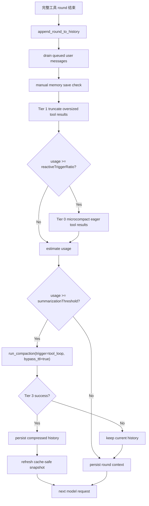

# 工具循环中上下文摘要压缩方案

> 状态：设计草案 v3  
> 关联总方案：[`docs/plan/context-compact-state-transfer.md`](context-compact-state-transfer.md)  
> 目标架构文档：[`docs/architecture/context-compact.md`](../architecture/context-compact.md)、[`docs/architecture/chat-engine.md`](../architecture/chat-engine.md)  
> 目标：让用户设置的自动摘要阈值（例如 80%）不仅作用于 turn 开头，也作用于一次回复内部的长工具循环。  
> v2 修订重点（Claude Code review）：① mid-loop 复用 `run_compaction` 必须门控其副作用（memory flush 不得每 checkpoint 重跑）；② 频率地板/迟滞从「初版不做」提升为 v1 必做；③ 对已有 summary 做 carry-forward 而非再摘一遍；④ mid-loop 摘要必须可取消、且冷 `summarizationModel` 下默认禁用/显式 opt-in（本地低延迟模型可放行）；⑤ `PreCompact` hook v1 即区分 `ToolLoop` trigger；⑥ incognito 以代码事实为准：context_json 复用既有焚毁语义，但 recovery/ledger 的无痕 gate 当前不存在、需新增（勿假设守卫已就位）。
> v3 收口：① 可取消必须采用 `select!` + 100ms cancel poll-loop，中止在途 summary future；② cache-safe snapshot 只在 `changed_history == true` 时刷新；③ checkpoint 使用当前 round-head 重建后的 `system_prompt_for_budget` / `system_prompt_for_cache`，不能复用旧 prompt。

## 背景

Hope Agent 当前上下文压缩已经具备 5 层策略：

- Tier 0：清理旧的 eager 工具结果。
- Tier 1：截断单个超大工具结果。
- Tier 2：裁剪旧工具结果。
- Tier 3：调用摘要模型，把旧历史替换成 continuation summary，并注入 runtime ledger / file recovery。
- Tier 4：ContextOverflow 后的紧急确定性压缩。

这套机制目前主要在**每次用户 turn 开始、第一次模型请求发出前**运行。对应入口是：

- `crates/ha-core/src/agent/streaming_loop.rs`：构造本轮 `messages` 后调用 `AssistantAgent::run_compaction()`。
- `crates/ha-core/src/agent/context.rs::run_compaction`：执行 Tier 0/1/2，同步结果为 `summarization_needed` 时继续执行 Tier 3。
- `crates/ha-core/src/context_compact/compact.rs`：同步压缩主入口。
- `crates/ha-core/src/context_compact/summarization.rs`：Tier 3 split / prompt / apply summary。

一次用户回复内部可能包含多轮工具循环：

```text
模型请求 1
→ assistant tool_call
→ 工具执行
→ tool_result 写入 history
→ 模型请求 2
→ assistant tool_call
→ 工具执行
→ tool_result 写入 history
→ ...
```

在这个过程中，工具结果会不断进入 `messages`。当前代码在每个完整工具 round 落历史后只做轻量处理：

- `crates/ha-core/src/agent/streaming_loop.rs`：`adapter.append_round_to_history(...)` 后调用 `truncate_tool_results(...)`。
- `crates/ha-core/src/agent/mod.rs::reactive_microcompact_in_loop`：达到 `reactiveTriggerRatio` 后只运行 Tier 0 microcompact。

也就是说，**如果用户把自动摘要阈值设为 80%，当前只有 turn 开头会触发 Tier 3；工具循环中涨到 80% 时不会摘要**。它只会尝试 Tier 1 / Tier 0，若仍然过大，下一次模型请求可能直接触发 ContextOverflow，然后才进入 Tier 4 emergency compact。

这对“无限对话 / 长时间持续运行”不够理想：Tier 4 是急救兜底，不应该成为长工具循环的常规压缩路径。

## 问题定义

当前缺口：

```text
turn 开头达到 summarizationThreshold
→ 可以 Tier 3 摘要

工具循环中达到 summarizationThreshold
→ 只做 Tier 1 + Tier 0
→ 不做 Tier 3 摘要
→ 可能一路涨到 ContextOverflow
```

用户预期更自然的是：

```text
只要上下文达到自动摘要阈值，例如 80%
→ 在安全边界上摘要
→ 不等到 provider 报错才急救
```

但“工具循环中摘要”不能理解成随时打断。上下文在一次模型请求发出后已经固定，不能在流式输出中途修改；工具正在执行时也不能摘要半截状态。唯一安全位置是：

```text
一个完整工具 round 结束后
tool_call + tool_result 已经成对写入 history
下一次模型请求尚未发出
```

本文称这个位置为 **mid-loop compaction checkpoint**。

## 目标

1. 用户设置的 `compact.summarizationThreshold` 同时作用于 turn 开头和工具循环 checkpoint。
2. 只在完整工具 round 之后、下一次模型请求之前触发 Tier 3。
3. 不拆开 tool_call / tool_result；继续复用 `boundary.rs` 的 round-safe boundary。
4. 复用现有 Tier 3 continuation summary、runtime ledger、file recovery、manifest。
5. 摘要失败或超时不破坏 history；继续按原 history 进入下一轮，必要时仍由 Tier 4 兜底。
6. 摘要成功后立即持久化 `context_json`；任何确定性 cleanup / summary 使 `changed_history == true` 时刷新 cache-safe snapshot。
7. cache TTL 不能阻止 mid-loop 高水位摘要；用户设置 80% 自动摘要时，工具循环达到 80% 应当真的尝试 Tier 3。

## 非目标

- 不在模型流式输出中途压缩。
- 不在工具执行中途压缩。
- 不新增另一套 summary prompt。
- 不把 Active Task、Memory、KB access、Working Directory、Permission、Plan Mode 镜像进 ledger。
- 不用 Tier 4 替代常规摘要；Tier 4 仍只作为 ContextOverflow 急救。
- 初版不新增独立 UI 配置项；先复用现有 `summarizationThreshold`。

## 现有调用链

### turn 开头压缩

引用文件：

- `crates/ha-core/src/agent/streaming_loop.rs`
- `crates/ha-core/src/agent/context.rs`
- `crates/ha-core/src/context_compact/engine.rs`
- `crates/ha-core/src/context_compact/compact.rs`
- `crates/ha-core/src/context_compact/summarization.rs`

当前流程：

```text
AssistantAgent::chat(...)
→ 构造 messages + push user message
→ build_full_system_prompt / build_merged_system_prompt
→ run_compaction(...)
   → context_engine.compact_sync(...)
      → compact_if_needed(...)
         → Tier 0 / Tier 1 / Tier 2
         → 若仍 >= summarizationThreshold，返回 summarization_needed
   → split_for_summarization(...)
   → summarize_with_model(...)
   → apply_summary(...)
   → build_runtime_ledger_message(...)
   → build_recovery_message(...)
   → emit context_compacted
→ select_memories_if_needed(...)
→ save_cache_safe_params(...)
→ 进入工具循环
```

### 工具循环中当前处理

引用文件：

- `crates/ha-core/src/agent/streaming_loop.rs`
- `crates/ha-core/src/agent/mod.rs::reactive_microcompact_in_loop`
- `crates/ha-core/src/context_compact/truncation.rs`
- `crates/ha-core/src/context_compact/compact.rs::microcompact`

当前流程：

```text
adapter.chat_round(...)
→ 执行工具
→ adapter.append_round_to_history(...)
→ drain_queued_turn_user_messages(...)
→ check_manual_memory_save(...)
→ truncate_tool_results(...)        # Tier 1 only
→ reactive_microcompact_in_loop(...) # Tier 0 only
→ persist_round_context(...)
→ 下一轮模型请求
```

缺口就在这里：没有 Tier 2 / Tier 3。

## 方案总览

新增一个 mid-loop checkpoint，替换当前“Tier 1 + reactive Tier 0 + persist”的散装逻辑。



## 触发语义

### 使用哪个阈值

初版复用现有配置：

- `compact.reactiveTriggerRatio`：只控制 cheap cleanup，即 Tier 0 reactive microcompact。
- `compact.summarizationThreshold`：控制 Tier 3 摘要高水位。

如果用户想要“80% 自动压缩”，应设置：

```json
{
  "compact": {
    "summarizationThreshold": 0.8
  }
}
```

mid-loop checkpoint 应当使用同一个 `summarizationThreshold`，而不是新增 `midLoopSummarizationThreshold`。这样 turn 开头和工具循环中的语义一致。

### 何时检查

只在以下位置检查：

```text
adapter.append_round_to_history(...)
drain_queued_turn_user_messages(...)
check_manual_memory_save(...)
truncate_tool_results(...)
reactive microcompact
→ mid-loop Tier 3 check
```

不在以下位置检查：

- `adapter.chat_round(...)` 正在流式输出时。
- 并发工具还没全部返回时。
- sequential 工具批次中间。
- tool_call 已写但 tool_result 未写时。

### 同一 checkpoint 尝试次数

同一个 checkpoint 只尝试一次 Tier 3。失败或超时不循环重试，避免一个工具 round 卡在摘要失败里。

**跨 checkpoint 的频率约束（v2）**：除了「同一 checkpoint 一次」，还需「同一 turn 内 mid-loop Tier 3 有次数上限 + 迟滞带」——见 §9。否则多个 checkpoint 各自达标会逐轮重摘。

后续如果模型请求仍然超限，现有 `chat_engine/engine.rs` 的 ContextOverflow 逻辑会触发 Tier 4 emergency compact。

## 关键设计

### 1. 把 `run_compaction` 做成可复用 checkpoint 原语

当前 `AssistantAgent::run_compaction(...)` 返回 `()`，调用方不知道是否真的发生了 Tier 2 / Tier 3，也不知道是否需要刷新 cache snapshot。

建议引入：

```rust
pub(super) struct CompactionRunOptions {
    pub trigger: CompactionRunTrigger,
    pub bypass_cache_ttl: bool,
    pub emit_start_event: bool,
}

pub(super) enum CompactionRunTrigger {
    TurnStart,
    ToolLoopCheckpoint,
}

pub(super) struct CompactionRunOutcome {
    pub tier_applied: u8,
    pub changed_history: bool,
    pub summary_applied: bool,
    pub tokens_after: u32,
}
```

把现有 `run_compaction(...)` 改成：

```rust
pub(super) async fn run_compaction(
    &self,
    messages: &mut Vec<Value>,
    system_prompt: &str,
    model: &str,
    max_tokens: u32,
    on_delta: &(impl Fn(&str) + Send),
    options: CompactionRunOptions,
) -> CompactionRunOutcome
```

或者保留原函数签名，新增内部函数：

```rust
run_compaction_with_options(...)
```

原 turn 开头路径调用默认选项：

```rust
CompactionRunOptions {
    trigger: TurnStart,
    bypass_cache_ttl: false,
    emit_start_event: true,
}
```

mid-loop checkpoint 调用：

```rust
CompactionRunOptions {
    trigger: ToolLoopCheckpoint,
    bypass_cache_ttl: true,
    emit_start_event: true,
}
```

### 2. cache TTL 语义

当前 `run_compaction` 有 cache TTL：

- 如果最近做过 Tier 2+，短时间内跳过 Tier 2 / Tier 3。
- 只有使用率达到 95% 才强制覆盖 TTL。

这对 turn 开头合理，但对 mid-loop 80% 自动摘要不合理。用户设置了 80% 自动摘要，工具循环达到 80% 时不应被 “刚压缩过” 阻止。

设计：

- `TurnStart`：保留现有 TTL 语义。
- `ToolLoopCheckpoint`：当 checkpoint 已经确认 `usage >= summarizationThreshold` 后，调用 `run_compaction` 时设置 `bypass_cache_ttl = true`。

这样不会每轮都绕过 TTL；只有真的超过摘要阈值的工具 checkpoint 才绕过。

### 3. PreCompact hook 语义

引用文件：

- `crates/ha-core/src/agent/context.rs`
- `crates/ha-core/src/hooks/*`

mid-loop checkpoint 仍应走 `PreCompact` hook，因为它也是自动压缩。

建议（v2 修订：trigger 区分提升为 v1 必做）：

- **v1 即新增 `CompactTrigger::ToolLoop`**，turn 开头继续用 `Auto`、mid-loop checkpoint 用 `ToolLoop`。理由：mid-loop 让 `PreCompact` **在工具循环中途触发、且单个 turn 可能触发多次**——hook 作者若 block `PreCompact`（例如某些操作期间禁止压缩），现在会连 mid-loop 一起 block、且频率高得多。给一个 trigger variant 让他们能区分/选择性放行，成本只是一个 enum 分支，却避免一个破坏性语义意外。这是低成本正确性闭合，不该推迟。
- block 语义复用现有逻辑：普通压力下可阻止；达到 emergency override band（≥ 0.95）时覆盖 block。

需要注意：mid-loop 80% 绕过 cache TTL，不等于绕过 PreCompact hook。TTL 是性能/缓存策略，hook 是用户/项目策略。

### 4. 新增 `maybe_compact_between_tool_rounds`

建议位置：`crates/ha-core/src/agent/context.rs` 或 `crates/ha-core/src/agent/streaming_loop.rs`。

签名草案：

```rust
pub(super) async fn maybe_compact_between_tool_rounds(
    &self,
    messages: &mut Vec<Value>,
    system_prompt_for_budget: &str, // 当前 round-head 最新预算 prompt
    system_prompt_for_cache: &str,  // 当前 round-head 最新实际/cache prompt
    tool_schemas: &[ToolSchema],
    model: &str,
    max_tokens: u32,
    on_delta: &(impl Fn(&str) + Send),
) -> MidLoopCompactionOutcome
```

如果类型依赖太重，也可以放在 `streaming_loop.rs` 内部，直接使用当前作用域里的 `system_prompt`、`tool_schemas` 和 `messages`。

建议逻辑：

```rust
let mut changed_history = false;

changed_history |= truncate_tool_results(messages, self.context_window, &self.compact_config);

let usage_after_t1 = estimate_request_tokens(system_prompt_for_budget, messages, max_tokens)
    / context_window;

if usage_after_t1 >= reactiveTriggerRatio {
    changed_history |= microcompact(messages, &self.compact_config);
}

let usage_after_cheap_cleanup = estimate_request_tokens(...);

if usage_after_cheap_cleanup < summarizationThreshold {
    self.persist_round_context(messages);
    if changed_history {
        self.save_cache_safe_params(
            system_prompt_for_cache.to_owned(),
            tool_schemas.clone(),
            messages.clone(),
            model,
        );
    }
    return NoSummaryNeeded;
}

let outcome = self.run_compaction_with_options(
    messages,
    system_prompt_for_budget,
    model,
    max_tokens,
    on_delta,
    CompactionRunOptions {
        trigger: ToolLoopCheckpoint,
        bypass_cache_ttl: true,
        emit_start_event: true,
    },
).await;

self.persist_round_context(messages);

if changed_history || outcome.changed_history {
    self.save_cache_safe_params(
        system_prompt_for_cache.to_owned(),
        tool_schemas.clone(),
        messages.clone(),
        model,
    );
}
```

### 5. 刷新 cache-safe snapshot

引用文件：

- `crates/ha-core/src/agent/streaming_loop.rs::save_cache_safe_params`
- `crates/ha-core/src/agent/context.rs::persist_round_context`

turn 开头压缩后，代码已经在进入工具循环前调用 `save_cache_safe_params(...)`。

mid-loop 压缩可能改变 `messages`，因此刷新 cache snapshot 必须受 `changed_history` gate 控制：只有确定 history 发生变化时才刷新，否则跳过，避免长工具循环中每轮 clone 整份 `messages` / `system_prompt` / `tool_schemas`。

`changed_history == true` 后必须做：

```text
persist_round_context(current_messages)
save_cache_safe_params(current_system_prompt, current_tool_schemas, current_messages, model)
```

如果只发生 Tier 1 / Tier 0，也可能已经改变了工具结果文本，应通过 `persist_round_context` 保存，并在 `changed_history == true` 时刷新 cache snapshot。若 cheap cleanup 实际清了 0 条、`changed_history == false`，则不刷新 snapshot。

### 6. system prompt 预算输入

当前 `streaming_loop.rs` 至少涉及两类 prompt：

- `system_prompt` / `system_prompt_for_cache`：实际 API 使用、也用于 cache-safe snapshot 的当前完整 prompt。
- `system_prompt_for_budget`：用于 compaction / token budget 的合并 prompt。

mid-loop checkpoint 应继续用 budget prompt 做估算和 compaction，并用实际/cache prompt 刷新 cache-safe snapshot。二者都必须来自**当前 round-head 最新状态**：若 loop head 因 Plan Mode / profile 等 live state 改变重建了 `system_prompt`，也应同步重建 `system_prompt_for_budget` / `system_prompt_for_cache`，避免 checkpoint 用旧预算或把旧 prompt 写进 snapshot。

建议把 `system_prompt_for_budget` 从不可变局部改成 mutable，并在这些路径同步更新：

- turn 开头初始构造。
- `maybe_resync_plan_mode_from_backend()` 返回 true 后。
- 任何后续会重建 `system_prompt` / `tool_schemas` 的 round-head 分支。

`maybe_compact_between_tool_rounds(...)` 的参数只接收这两份当前 prompt，不在函数内部重新推断；调用方负责在进入 checkpoint 前完成 prompt/tool schema resync。

### 7. 成功与失败语义

#### Tier 3 成功

```text
旧 messages prefix
→ [Previous conversation summary]
→ optional runtime ledger
→ optional recovery snapshots
→ preserved recent rounds
```

然后：

- `persist_round_context` 保存压缩后的 history。
- `changed_history == true`，因此调用 `save_cache_safe_params` 刷新 cache snapshot。
- `context_compacted` event 的 manifest `trigger` 标记为 `tool_loop`。

#### Tier 3 失败 / 超时 / 取消

不调用 `apply_summary`，history 保持 cheap cleanup 后的状态。取消与失败/超时同属“未应用 summary”，不得再进入 ledger / recovery 注入：

- Tier 1 / Tier 0 已经发生的确定性清理可以保留。
- 不插入空 summary。
- 不插入空 ledger。
- 继续进入下一轮模型请求。
- 若 provider 随后返回 ContextOverflow，现有 Tier 4 处理。

#### Tier 2 后已低于阈值

如果 `run_compaction` 在 mid-loop 中只做 Tier 2 就降到安全区，不需要 Tier 3。若 Tier 2 实际裁剪了 history，仍应 persist，并按 `changed_history == true` 刷新 snapshot。

### 8. 门控 `run_compaction` 的副作用：memory flush 不得每 checkpoint 重跑（v2 红线）

`run_compaction` 的 Tier 3 路径当前**无条件 spawn `flush_before_compact`**（从被摘要消息抽取记忆，`agent/context.rs`）。turn 开头一轮触发一次没问题；但 mid-loop 若一个 turn 内摘要多次，就会**抽多次记忆**，且相邻 checkpoint 的 `summarized_messages` 区间高度重叠 → 重复/近重复记忆 + 成倍抽取成本与延迟。

因此把 `run_compaction` 改成可复用原语时，flush 必须随 trigger 门控：

- `TurnStart`：保留现有 flush 行为。
- `ToolLoopCheckpoint`：**默认不在每个 checkpoint 重跑整段 flush**。两种可接受实现，二选一：
  - 简单版：mid-loop Tier 3 跳过 flush，记忆抽取仍交给 turn 边界的下一次 `TurnStart` 压缩兜底；
  - 精确版：只 flush「相对上次成功 mid-loop 摘要新增的那段 delta 消息」，避免重叠区重复抽取。
- 同理审视 `run_compaction` 里其它 per-turn 副作用（事件 emit、`touch_compaction_timer`）在 mid-loop 重复触发是否可接受——timer 仍应 touch（用于 TTL 记账），事件 emit 见 §事件与 manifest。

### 9. 频率地板 / 迟滞：v1 必做，不推迟

摘要把 usage 降到阈值**下方多少**是不确定的（取决于 preserved 区大小与摘要长度）。若降幅小，下一轮一个大 tool result 就再次越过阈值 → 再摘一次。每次 mid-loop 摘要 = 一次 LLM 调用 + prefix 变化导致 **prompt cache 全量重建** + 信息再损耗（见 §10）。「一次摘要通常显著降 token」是假设而非保证。

因此 v1 必须带最小迟滞（**风险 3 的缓解从「后续追加」提升为 v1 必做**），至少其一：

- **迟滞带**：mid-loop 摘要后若 usage 仍未降到 `summarizationThreshold - Δ`（如 Δ=0.15），**区分两种状态、不要混为「失败」**：
  - **摘要失败**（没改 history）：`summary_applied=false`，history 保持 cheap-cleanup 后状态。
  - **摘要成功但收益不足**（`summary_applied=true`，history 已变短、必须保留压缩结果）：标 `insufficient_reduction` warning，**本 turn 禁止再次 mid-loop Tier 3**，继续下一轮请求；若仍溢出交 Tier 4。
  - 关键差异：收益不足**绝不能丢弃已应用的压缩**，只是停止本 turn 内反复重摘。
- **round 间隔**：距上次成功 mid-loop 摘要 `< min_rounds_between_mid_loop_summary`（默认如 3）的 checkpoint 跳过 Tier 3。
- **收益闸**：若 split 后 summarizable 前缀过小（可摘的旧历史本就不多），跳过——类比 Tier 2 的 `min_prunable_tool_chars`。

初版可仅落「每 turn 内 mid-loop Tier 3 次数上限 + 迟滞带」这一组合，**零地板会让病态长循环 thrash**。

### 10. 对已有 summary 做 carry-forward，而非再摘一遍（v2）

`run_compaction` 现在调 `build_summarization_prompt(&split.summarizable, None, …)`——`previous_summary` 传 **None**。跨 turn 时这已有「摘要套摘要」式衰减；mid-loop 把它压进**单个 turn 内**：第 2 次 mid-loop 摘要会把第 1 次产出的 `[Previous conversation summary]` 当普通消息再摘一遍 → 摘要的摘要，关键标识符 / 失败尝试逐层流失。

设计：

- split 时检测 summarizable 区里既有的 `[Previous conversation summary]` 消息，把它**作为 `previous_summary` 参数 carry-forward**（`build_summarization_prompt` 已支持该参数），并从被重摘的消息体里剔除，让模型在「旧摘要 + 新增 rounds」基础上产出新摘要，而不是把旧摘要再压一层。
- 这条同时改善 turn-start 的跨 turn 衰减，但 mid-loop 是它的放大器，必须一起处理。

### 11. 可取消 + 冷 `summarizationModel` 退化（v2）

mid-loop 摘要是阻塞 LLM 调用（最长 `summarization_timeout_secs`），会让用户**正在观看的回复中途冻结**。延迟可接受的前提与退化策略：

- **复用对话模型 + prefix cache**（`summarizationModel` 留空）时 ~90% 缓存命中、很快，mid-loop 冻结可接受。
- **若用户配置了独立 `summarizationModel`（冷调用、无缓存共享）**，mid-loop 冻结可能明显变长。策略化处理，**不要绝对禁用**：
  - **默认**：独立 `summarizationModel` 下 mid-loop Tier 3 **禁用或需显式 opt-in**（checkpoint 仍跑 Tier 0/1/2 cheap cleanup，Tier 3 留给 turn 边界）。
  - **可放行**：本地 / 低延迟摘要模型可允许 mid-loop 摘要——用户专门配了快/便宜的摘要模型，往往正希望它在循环中工作。
  - 后续可加配置项（如 `midLoopSummaryWithSeparateModel`）让用户显式开启；初版给保守默认 + opt-in 钩子，不把产品路线锁死。
- **可取消**：mid-loop 摘要必须挂到本 turn 的 `cancel` flag——用户按 stop 后在途 summary 应立即中止，而不是等满 `summarization_timeout_secs`。实现上复用 `streaming_loop.rs` 里主循环已有的取消模式：把 `summarize_with_model(...)` 包进 `tokio::select!`，一边跑 summary future，一边用 100ms poll-loop 检查 turn cancel；cancel 分支胜出时丢弃 summary future，返回 `summary_applied=false` / `changed_history=false` 的取消结果，不调用 `apply_summary` / ledger / recovery。

推荐形态：

```rust
tokio::select! {
    result = summarize_with_model(...) => result,
    _ = async {
        loop {
            if turn_cancel.is_cancelled() {
                break;
            }
            tokio::time::sleep(Duration::from_millis(100)).await;
        }
    } => {
        return CompactionRunOutcome::cancelled();
    }
}
```

仅在调用前后检查一次 bool 不满足本方案；那会让用户按 stop 后仍可能等待完整 `summarization_timeout_secs`。

## 事件与 manifest

引用文件：

- `crates/ha-core/src/context_compact/manifest.rs`
- `crates/ha-core/src/chat_engine/im_system_message.rs`
- `crates/ha-core/src/chat_engine/persister.rs`

建议 manifest / event 区分触发源：

```json
{
  "type": "context_compacted",
  "data": {
    "tier_applied": 3,
    "description": "summarization_needed",
    "manifest": {
      "trigger": "tool_loop",
      "tier": 3,
      "protectedStartIndex": 12,
      "summarizedRange": [0, 12],
      "warnings": []
    }
  }
}
```

`description: "summarizing"` 的 start marker 仍可以保留，IM formatter 已经对 start marker 做 suppress，避免聊天里刷两条系统消息。

## 与 runtime ledger / recovery 的关系

引用文件：

- `crates/ha-core/src/agent/runtime_ledger.rs`
- `crates/ha-core/src/context_compact/ledger.rs`
- `crates/ha-core/src/context_compact/recovery.rs`

mid-loop Tier 3 复用现有状态转移协议：

- ledger snapshot 由 `agent/runtime_ledger.rs` 在调用方构造。
- `context_compact` 只渲染 snapshot，不反向读取 live state。
- 文件 touch 仍从 `summarized_messages` 中提取，recovery 和 ledger 共用。
- 不新增 active tasks / memory / KB / cwd / permission / plan mode 的 ledger 镜像。
- **incognito（v2 修订：以代码事实为准，不假设守卫已存在）**：核实当前实现——
  - `persist_round_context` → `db.save_context` 直接 `UPDATE sessions SET context_json`，**无 incognito gate**（[`db.rs`](../../crates/ha-core/src/session/db.rs)）。无痕会话本就写 context_json，靠 `session:purged` 关闭即焚——这是既有 session-context 持久化语义，**mid-loop 复用即可、不新增落盘面**。
  - `recovery` 构造处（[`context.rs`](../../crates/ha-core/src/agent/context.rs)）当前**没有 incognito gate**，无痕下会读盘 + 注入文件正文。
  - 因此契约是：**mid-loop 复用现有 session context 持久化/焚毁语义；若要求 incognito 不读盘/不注入 recovery，必须在 `run_compaction` / `recovery` 上补显式 incognito gate（当前不存在，需新增）；ledger snapshot 必须在 incognito 下归零或跳过。** 不要写成「已有守卫已经做到」——否则实现会漏掉 recovery 的无痕门控。
  - 需加无痕回归测试：mid-loop 在 incognito 下不触发 recovery 读盘、ledger 为空。

mid-loop 的价值在这里更明显：长工具循环中最容易出现 “刚写了文件 / 开了后台 job / 派了 subagent”，如果只等下一次用户 turn 才摘要，可能中途已经 ContextOverflow。

## 测试计划

### 单元测试

1. `maybe_compact_between_tool_rounds` 在 usage 低于 `summarizationThreshold` 时只做 Tier 1 / Tier 0，不调用摘要 provider。
2. usage 高于 `summarizationThreshold` 且 cache TTL 热时，mid-loop 仍会尝试 Tier 2 / Tier 3。
3. Tier 3 失败时 history 不出现 `[Previous conversation summary]`，已有 tool_call / tool_result 不被拆。
4. Tier 3 成功后 history 形态为 summary + ledger/recovery + preserved。
5. `changed_history == true` 后 `persist_round_context` 被调用，cache-safe snapshot 更新；`changed_history == false` 时不刷新 snapshot。
6. Plan Mode round-head 重建 system prompt 后，mid-loop 的 `system_prompt_for_budget` / `system_prompt_for_cache` 都同步更新，checkpoint 不复用 turn 入口旧 prompt。
7. **（v2）mid-loop Tier 3 不重复触发 memory flush**：一个 turn 内多次 checkpoint 摘要，`flush_before_compact` 不被每次整段重跑（§8）。
8. **（v2）频率地板**：摘要降幅不足（未到 `threshold-Δ`）或未达 round 间隔时，后续 checkpoint 跳过 Tier 3（§9）。
9. **（v2）carry-forward**：第二次 mid-loop 摘要把已有 `[Previous conversation summary]` 作为 previous_summary，不再整体重摘（§10）。
10. **（v3）可取消**：turn 取消时在途 mid-loop summary 经 `select!` + 100ms poll-loop 立即中止，不等满 timeout（§11）。
11. **（v2）incognito**：无痕会话 mid-loop 下 recovery 不读盘/不注入、ledger 为空；context_json 复用既有焚毁语义（需新增 recovery/ledger 的 incognito gate，当前不存在）。
12. **（v2）queued user message**：checkpoint 前 drain 进来的新 user 消息不被 mid-loop 摘要吞掉（边界 user-turn 扩展保住它）。

### context_compact 定向测试

复用并扩展：

- `crates/ha-core/src/context_compact/boundary.rs`：不拆 Responses 并行 tool calls。
- `crates/ha-core/src/context_compact/summarization.rs`：`SummarizeUnderPressure` 高压可摘旧 prefix。
- `crates/ha-core/src/context_compact/recovery.rs`：file recovery 与 ledger 文件清单预算。

### 集成 / 回归场景

构造一个长工具循环：

```text
user: inspect repo
round 1: ls huge
round 2: grep huge
round 3: read huge
```

把 `summarizationThreshold` 设低，例如 0.25，以便稳定触发。

验收：

- 在 round 结束后触发 `context_compacted` tier 3。
- 压缩后下一轮模型请求使用 summary history。
- 没有 ContextOverflow。
- `context_json` 里保存的是压缩后的 history。

## 风险与缓解

### 风险 1：mid-loop 摘要增加延迟

摘要是额外 LLM 调用，会让当前回复在工具循环中暂停。

缓解：

- 只在达到 `summarizationThreshold` 后触发。
- 同一 checkpoint 只尝试一次。
- 使用现有 `summarization_timeout_secs`，并**挂到 turn 的 cancel flag**（见 §11，`select!` + 100ms poll-loop，stop 立即中止在途 summary）。
- **冷 `summarizationModel` 退化**：配了独立摘要模型时 mid-loop Tier 3 默认禁用/opt-in（本地低延迟模型可放行），见 §11。
- start marker 可让 UI 知道正在 compact。

### 风险 2：摘要失败后仍然溢出

如果摘要 provider 失败，下一轮模型请求可能 ContextOverflow。

缓解：

- history 不破坏。
- 现有 `chat_engine/engine.rs` ContextOverflow 捕获会触发 Tier 4 emergency compact + retry。
- 日志和 manifest 记录失败。

### 风险 3：重复压缩过于频繁

长工具任务可能每轮都超过阈值。

缓解（v2：频率地板从「后续追加」提升为 v1 必做，见 §9）：

- 成功后 `touch_compaction_timer` 仍记录时间；turn 开头继续受 TTL 管。
- mid-loop 仅当 cheap cleanup 后仍超过 `summarizationThreshold` 才绕过 TTL。
- **v1 即带最小迟滞**：迟滞带用于判断**本 turn 后续是否允许继续 mid-loop Tier 3**；若 summary 已应用但 usage 未低于 `summarizationThreshold - Δ`，标 `insufficient_reduction` 并保留压缩结果，本 turn 禁止再次 mid-loop Tier 3。再叠加每 turn mid-loop Tier 3 次数上限 + 收益闸（summarizable 前缀过小则跳过）。零地板会让病态长循环每轮重摘、反复重建 prompt cache（见 §9）。
- `memory flush` / 事件等 per-turn 副作用按 trigger 门控，不随 mid-loop 重复触发（见 §8）。

### 风险 4：cache snapshot 不一致

压缩改变 messages 后，如果不刷新 snapshot，side_query 可能复用旧 history。

缓解：

- `CompactionRunOutcome.changed_history == true` 时强制 `save_cache_safe_params(...)`。
- `changed_history == false` 时跳过 snapshot 刷新，避免每个 checkpoint 都 clone 大 history。
- snapshot 使用当前 round-head 最新的 `system_prompt_for_cache` / `tool_schemas` / compressed messages。

### 风险 5：hook 阻止压缩导致无限逼近上限

PreCompact hook 可能 block mid-loop compaction。

缓解：

- 复用现有连续 block 上限。
- 达到 emergency override band 时覆盖 block。
- 如果仍 ContextOverflow，Tier 4 emergency compact 继续兜底。

## 实施步骤

### Phase 1：重构 `run_compaction` 返回 outcome

文件：

- `crates/ha-core/src/agent/context.rs`
- `crates/ha-core/src/context_compact/engine.rs`

内容：

- 新增 `CompactionRunOptions` / `CompactionRunOutcome`。
- 原 turn 开头路径保持行为不变。
- manifest trigger 支持 `turn_start` / `tool_loop`。
- `run_compaction` 返回是否改变 history。
- **（v2）按 trigger 门控副作用**：`ToolLoopCheckpoint` 默认不重跑整段 `flush_before_compact`（§8）；`touch_compaction_timer` 仍 touch。
- **（v2）新增 `CompactTrigger::ToolLoop`** 并接通 `PreCompact` hook（§3）。
- **（v2）carry-forward 既有 summary**：split 检出 `[Previous conversation summary]` 作为 `previous_summary` 传入、剔出重摘体（§10）。
- **（v3）summary future 与 turn cancel 使用 `select!` + 100ms poll-loop**，cancel 分支胜出时丢弃在途 summary，不等 timeout（§11）。

### Phase 2：新增 mid-loop checkpoint

文件：

- `crates/ha-core/src/agent/streaming_loop.rs`
- `crates/ha-core/src/agent/mod.rs`

内容：

- 把现有 `truncate_tool_results + reactive_microcompact_in_loop + persist_round_context` 替换为 `maybe_compact_between_tool_rounds`。
- checkpoint 内先 cheap cleanup，再判断 `summarizationThreshold`。
- 达标后调用 `run_compaction(..., trigger=ToolLoopCheckpoint, bypass_cache_ttl=true)`。
- **（v3）频率地板**：每 turn mid-loop Tier 3 次数上限 + 迟滞带（未低于 `threshold-Δ` 则保留已应用 summary、标 `insufficient_reduction`、本 turn 禁止再次 mid-loop Tier 3）+ summarizable 前缀收益闸（§9）。状态（如 `mid_loop_summary_count` / `last_mid_loop_summary_round` / `mid_loop_summary_suppressed_for_turn`）随 turn 作用域，不持久化。
- **（v2）冷 `summarizationModel` 退化**：配了独立摘要模型时 checkpoint 默认跳过 Tier 3、只做 cheap cleanup；本地低延迟模型或显式 opt-in 可放行（§11）。

### Phase 3：持久化与 cache snapshot

文件：

- `crates/ha-core/src/agent/context.rs`
- `crates/ha-core/src/agent/streaming_loop.rs`

内容：

- 成功或 deterministic cleanup 后调用 `persist_round_context`。
- `changed_history == true` 时调用 `save_cache_safe_params`；`changed_history == false` 时跳过，避免无变化 checkpoint 反复 clone 大 history。
- round-head 重建 prompt 时同步更新 `system_prompt_for_budget` / `system_prompt_for_cache`，checkpoint 不使用 turn 入口旧值。

### Phase 4：测试与文档

文件：

- `crates/ha-core/src/agent/context.rs`
- `crates/ha-core/src/agent/streaming_loop.rs`
- `crates/ha-core/src/context_compact/*`
- `docs/architecture/context-compact.md`

内容：

- 添加 mid-loop checkpoint 单元测试。
- 补 context compact 回归测试。
- 更新架构文档说明“turn-start compaction”和“tool-loop checkpoint compaction”的区别。

## 建议验收标准

1. 工具 round 未完成时不会触发摘要。
2. 工具 round 完成后，usage 达到 `summarizationThreshold` 会触发 Tier 3。
3. cache TTL 热时，mid-loop 高水位仍能触发 Tier 3。
4. 摘要失败不破坏 history。
5. 摘要成功后 `context_json` 与 cache snapshot 都是压缩后的 history；无 history 变化的 checkpoint 不刷新 cache snapshot。
6. `context_compacted` event/manifest 能看出 `trigger=tool_loop`。
7. Responses / OpenAI Chat / Anthropic 三种 tool shape 都不拆 tool_call/tool_result。
8. Plan Mode / profile 等 round-head resync 后，mid-loop checkpoint 使用最新 `system_prompt_for_budget` / `system_prompt_for_cache`。
9. `cargo check -p ha-core` 与 `cargo test -p ha-core context_compact` 通过；新增 mid-loop 测试通过。

## 开放问题

1. ~~`PreCompact` hook 是否需要新增 `CompactTrigger::ToolLoop`~~ → **v2 已定：v1 即新增 `ToolLoop`**（见 §3）。
2. ~~是否需要限制每 turn 内最多 mid-loop Tier 3 次数~~ → **v2 已定：v1 必带次数上限 + 迟滞带**（见 §9）。剩余可调项：默认 `Δ` 与次数上限取值，先用保守默认、不暴露 UI。
3. mid-loop 摘要 start marker 是否需要在 UI 上和 turn-start 摘要区分展示。
4. 手动 `/compact` 是否继续保持 sync-only，不参与 mid-loop 方案。本文建议保持不变。
